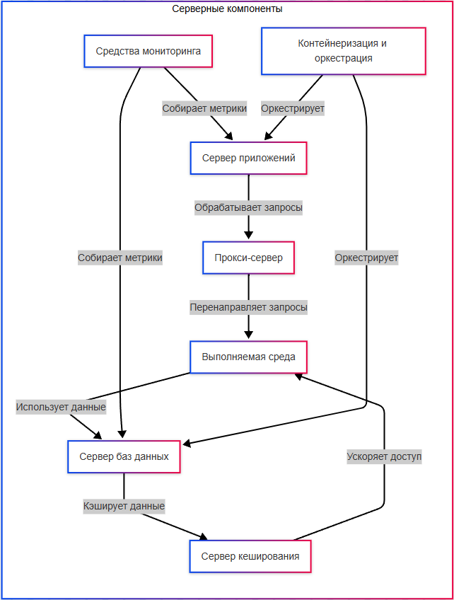

---
title: 2.06. Сеть и соединения
---

# 2.06. Сеть и соединения

  В РАЗРАБОТКЕ
  НЕ ДЛЯ НОВИЧКОВ
  НЕ ОБЯЗАТЕЛЬНО

Разработчику
Архитектору
Инженеру

## Сеть и соединения

Никакой сервер не сможет раскрыть свой потенциал без выполнения сетевых настроек. Даже если мы разобрались в том, как создать приложение, без навыков развёртывания, конфигурации серверов, мы не сможем запустить это всё в сети. Какие устройства находятся в сети?
	- компьютеры и серверы – узлы сети;
	- маршрутизаторы (роутеры) – соединяют узлы, направляют трафик;
	- коммутаторы (свитчи) объединяют устройства в локальной сети (LAN);
	- МФУ (многофункциональные устройства) – принтеры, сканеры, копировальные устройства с сетевым интерфейсом.

Для всех участников сети важно предусмотреть наличие автоматического или ручного определения IP-адресов. Для небольшого офиса вполне можно просто создать журнал-таблицу с IP и присвоить каждому устройству в сети свой адрес – по манере 192.168.0.XXX. Для сервера лучше определять статический (постоянный) IP-адрес, и это важно решить с провайдером, так как они используют технологию динамических адресов, выдавая новый адрес при каждом подключении – так, после перезагрузки роутера, внешний IP-адрес изменится. 

**SSH (Secure SHell - безопасная оболочка)** является сетевым протоколом, который позволяет производить удалённое управление ОС и туннелирование TCP-соединений. Он шифрует весь трафик, включая передаваемые пароли. SSH-клиенты и SSH-серверы доступны почти для всех ОС.

**Telnet (TELetype NETwork)** - другой сетевой протокол для реализации текстового терминального интерфейса по сети (сейчас TCP). Также telnet называют и утилиту для клиентской части работы с протоколом.

Этих протоколов так много, что можно и запутаться. Обычно их делят по уровням:
	- Прикладной (уровень приложений, Application Layer) - HTTP, FTP, DNS, SSH, Echo, IMAP, HTTPS, NTP, POP3, RTSTP, SNMP, Telnet, XDMCP и ещё некоторые другие;
	- Транспортный - TCP, UDP - именно они используют порт (число);
	- Сетевой (или межсетевой) - IP;
	- Канальный - физический - Ethernet, WLAN, ATM, и прочие.
	
Есть разные деления протоколов, к примеру, модель OSI и модель TCP/IP - а бывают и «гибридные» деления. Для понимания, можно либо выучить особенности OSI и подходы в технической литературе, либо просто погрузиться в каждый протокол. Здесь уж не пугайтесь - поначалу будет страшно понимать все эти тонкости, но начать нужно с того, с чем работаете, к примеру, HTTP, HTTPS, SSH, IMAP, POP3, FTP, DNS, TCP, UDP, IP. А дальше уже по мере столкновения с технологией.

Для обеспечения сетевой работы сервера, нужно также установить важные компоненты. Для Linux это:
	- SSH-сервер (openssh-server) для удалённого управления;
	- Firewall (ufw/ iptables / firewalld) – защита от нежелательного трафика;
	- Мониторинг (htop, nmon, netdata) – контроль нагрузки;
	- Логирование (rsyslog, journald) – запись событий.

Для Windows:
	- Active Directory (если сервер – доменный контроллер);
	- DNS-сервер (для внутреннего разрешения имён);
	- DHCP-сервер (автоназначение IP);
	- Hyper-V (виртуализация).

Специфические компоненты (зависят от того, что будет на сервере):
	- сервер приложений (IIS в Windows, Nginx/Apache в Linux);
	- прокси-сервер (Nginx, Squid, HAProxy, 3proxy);
	- компоненты для выполняемой среды (Java, .NET);
	- сервер баз данных (СУБД, к примеру, SQL Server, PostgreSQL, MySQL);
	- сервер кеширования (Redis, Memcached);
	- средства мониторинга (Prometheus);
	- средства контейнеризации и оркестрации (Docker, Kubernetes).

Сервер приложений на Windows устанавливается через IIS (Диспетчер IIS), а в Linux – через Nginx/Apache. Это своего рода программная среда для обеспечения бесперебойной работы сайта, путем «включения доступа» и перенаправления трафика на соответствующие папки с сайтом+приложением. Если сервер приложений «упадёт», то и сайт будет недоступен. Словом, это ключевой элемент для веб-составляющей.

DNS-сервер нужен, если локальная сеть с множеством устройств (серверов, принтеров), и нужно разрешать имена типа server.local вместо IP. Вообще, глубокие настройки DNS, CDN, Anycast/Multicast, QoS (приоретизация трафика) выполняет сетевой инженер, а не системный администратор. Как правило, для настроек сети, IP и DNS, админы обращаются к провайдеру – часто они самостоятельно выполняют определённую часть настроек – ибо их задача – дать доступ к сети. Провайдеры предоставляют, как правило, услугу по аренде статического IP.

Важно: если роутер один, а клиентов много, и один из клиентов будет «качать торренты», то он заберёт всю скорость, что сильно урежет производительность сервера. Поэтому, если нужна стабильная и быстрая работа сервера, лучше обеспечить выделенный канал для сервера, наилучшую скорость и, конечно, хороший роутер.

Nginx – мощный веб-сервер и обратный прокси-сервер, который умеет:
	- раздавать сайты (как IIS и Apache);
	- балансировать нагрузку между несколькими серверами;
	- защищать от DDoS и перегрузок;
	- кешировать данные (ускорять загрузку страниц).
	
★ **Балансировщик нагрузки (Load Balancer)** – это диспетчер, который принимает запросы от пользователей, распределяет их между несколькими серверами, и следит, чтобы ни один сервер не перегрузился. Когда пользователь «стучится» на сайт, балансировщик отправляет, на какой сервер отправить запрос, и в случае перегруженности, к примеру, сервера №1, отправит на сервер №2. Это важно, когда пользователей много.
