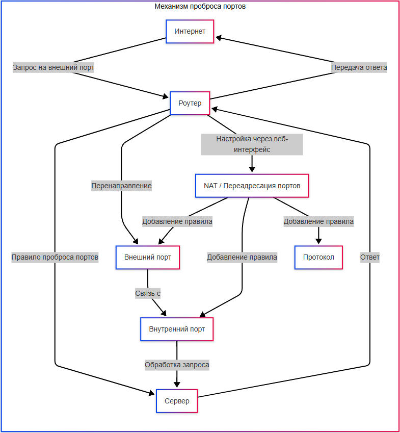

---
title: NAT и проброс портов
tags: [beginner, advanced, notrequired, engineer, developer, architector]
description: Маршрутизация трафика между сетями.
---

# NAT и проброс портов

<div class="article-tags">
  <span class="tag tag-inprogress">В РАЗРАБОТКЕ</span>
  <span class="tag tag-advanced">НЕ ДЛЯ НОВИЧКОВ</span>
  <span class="tag tag-notrequired">НЕ ОБЯЗАТЕЛЬНО</span>
</div>
<span class="complexity-badge">Разработчику</span>
<span class="complexity-badge">Архитектору</span>
<span class="complexity-badge">Инженеру</span>

## NAT и проброс портов

Давайте для начала представим ситуацию:
1. Есть многоквартирный дом, и у него есть консьерж (это и есть NAT);
2. У вас есть один адрес дома (публичный IP);
3. Внутри - много квартир (наши устройства - компьютер, телефон, телевизор);
4. Когда мы хотим отправить письмо (зайти в интернет):
- консьерж смотрит "ага, из такой-то квартиры письмо";
- он меняет обратный адрес (кв. 12) на публичный (ул. Ленина, д. 5);
- почтальон (интернет) приносит ответ на адрес дома;
- консьерж помнит, что это письмо в квартиру 12 и отдаёт письмо нам.

Пример:
1. У нас есть веб-сервер на компьютере (`192.168.1.100:80`);
2. Мы хотим, чтобы друзья заходили на сайт;
3. Заходим в настройки роутера (`192.168.1.1`);
4. Добавляем правило:
```
Если кто-то стучится на порт 8080 снаружи → 
отправить на 192.168.1.100:80
```
5. Друг вводит в браузере `наш_публичный_IP:8080`;
6. Роутер перенаправляет запрос на наш компьютер;
7. Сайт открывается.

То есть, как раз NAT, наш консьерж, по умолчанию, без проброса портов, блокирует ВХОДЯЩИЕ соединения к нам. Дозволены только исходящие (чтобы мы шли в интернет свободно). Это для безопасности. А уже с пробросом портов, мы можем открывать входящие запросы.

NAT есть в каждом домашнем роутере, это причина, почему у всех устройств в квартире один внешний IP. Проброс портов надо настраивать руками, ибо роутер сам не догадается.



В современных сетевых архитектурах, особенно в домашних и корпоративных локальных сетях, ключевую роль играет технология преобразования сетевых адресов — **NAT (Network Address Translation)**. Она позволяет множеству устройств внутри частной (внутренней) сети взаимодействовать с внешними ресурсами, используя один или ограниченное число публичных IP-адресов. Эта технология решает проблему дефицита IPv4-адресов и обеспечивает дополнительный уровень изоляции и защиты локальных хостов от прямого доступа из глобальной сети. Однако, когда требуется обратное — обеспечить доступ к внутреннему сервису извне, — возникает необходимость в механизме **проброса портов** (port forwarding). Ниже рассматриваются оба явления как взаимосвязанные компоненты функционирования шлюза (роутера) в типовой IPv4-сети.

---

### Что такое NAT

**NAT (Network Address Translation)** — это функция сетевого шлюза, которая изменяет адресные и портовые поля заголовков IP-пакетов при их прохождении через границу между частной и публичной сетями. Основная задача NAT — маскировать внутреннюю топологию сети, позволяя множеству клиентов с частными (непубличными) IP-адресами использовать один внешний адрес для исходящих соединений.

Частные адреса определены в стандартах RFC 1918 и включают следующие диапазоны:

- `10.0.0.0` – `10.255.255.255` (`10.0.0.0/8`);
- `172.16.0.0` – `172.31.255.255` (`172.16.0.0/12`);
- `192.168.0.0` – `192.168.255.255` (`192.168.0.0/16`).

Эти адреса не маршрутизируются в глобальной сети Интернет и предназначены исключительно для использования во внутренних сетях. В то же время интернет-провайдер выделяет шлюзу один или несколько публичных адресов — именно они и регистрируются в DNS-системе и используются внешними узлами при взаимодействии.

Когда устройство из локальной сети (например, с адресом `192.168.1.15`) отправляет TCP- или UDP-пакет в интернет, роутер подменяет поле *источника* в заголовке IP (и при необходимости — в заголовке транспортного уровня), заменяя `192.168.1.15:54321` на `публичный_IP:назначенный_порт`. Эта операция сопровождается созданием записи в таблице NAT-преобразований — *NAT-таблице*. При получении ответного пакета от удалённого сервера, роутер сверяется с этой таблицей и перенаправляет пакет тому клиенту, от которого изначально поступил запрос.

Таким образом, NAT реализуется на уровне шлюза, а не на конечных устройствах. Конечные хосты не осведомлены о преобразованиях; для них шлюз выступает как прозрачный посредник.

---

### Зачем нужен NAT

Первоначально NAT был разработан как временное решение для замедления истощения адресного пространства IPv4. Сегодня он выполняет несколько функций:

1. **Экономия публичных IP-адресов** — вместо того чтобы выделять каждому устройству отдельный публичный адрес, сеть использует один или несколько адресов на шлюзе. Это особенно важно для крупных организаций и массовых провайдеров.

2. **Сокрытие внутренней структуры сети** — внешние наблюдатели не могут напрямую определить количество узлов, их ОС, сетевые роли или физические сегменты внутри локальной сети. Это затрудняет сканирование и целенаправленные атаки.

3. **Упрощение управления сетевыми настройками** — в случае смены провайдера или внешнего адреса, перенастройка требуется только на шлюзе, а не на всех клиентах.

4. **Фильтрация входящего трафика по умолчанию** — большинство NAT-устройств по умолчанию *не пропускают* входящие соединения, инициированные извне. Это предоставляет базовый уровень защиты, аналогичный простейшему межсетевому экрану.

Однако именно последнее свойство — блокировка входящих соединений — создаёт препятствие для размещения серверов внутри NAT-сети. Чтобы внешний клиент мог инициировать соединение с локальным сервером (например, веб-сервером, игровым хостом или SSH-демоном), требуется явное правило перенаправления — **проброс портов**.

---

### Типы NAT и их поведение

Реализация NAT может различаться по строгости контроля над исходящими и входящими соединениями. Это принципиально важно при разработке P2P-приложений (VoIP, видеочаты, онлайн-игры) и при настройке пробросов. Выделяют четыре основных типа, описанных в RFC 3489 и уточнённых в RFC 5389 (STUN):

#### Full Cone NAT (полный конус)

После того как внутренний хост инициировал соединение к внешнему адресу `X:Px`, создаётся постоянное отображение `(внутренний_IP, внутренний_порт)` → `(публичный_IP, публичный_порт)`. После этого **любой** внешний хост может отправить пакет на `(публичный_IP, публичный_порт)`, и он будет доставлен внутреннему хосту. Такое поведение максимально открыто и редко используется в современных устройствах из соображений безопасности.

#### Restricted Cone NAT (ограниченный конус)

Отображение создаётся аналогично, но входящий пакет принимается только в том случае, если его источник (`Y:Py`) совпадает с адресом, на который ранее отправлялись исходящие пакеты с данного внутреннего порта — то есть `Y = X`, а порт `Py` может быть произвольным. Это типичное поведение большинства домашних роутеров.

#### Port-Restricted Cone NAT (порт-ограниченный конус)

Дополнительно накладывается ограничение и на порт источника: входящий пакет от `Y:Py` принимается, только если ранее с внутреннего хоста отправлялись пакеты именно на `Y:Py`. Такой NAT встречается в более строгих сетевых средах, например, в корпоративных сегментах с дополнительными правилами фильтрации.

#### Symmetric NAT (симметричный NAT)

Это наиболее строгий тип. Для каждой уникальной комбинации `(внешний_IP, внешний_порт)` создаётся *отдельное* отображение на свой публичный порт. То есть, если один и тот же внутренний хост посылает пакеты на `A:80` и `B:443`, роутер может назначить для этих направлений разные внешние порты — `S:50001` и `S:50002`. Это создаёт серьёзные сложности для проброса портов и P2P-соединений, так как внешняя сторона не может предсказать, на какой публичный порт направлять ответ. Симметричный NAT часто встречается в мобильных сетях (LTE/5G), на некоторых провайдерских шлюзах и в защищённых инфраструктурах.

> **Практическое значение**: при настройке сервера внутри сети с симметричным NAT невозможно обеспечить стабильный входящий доступ без дополнительных мер — например, использования реверс-туннелей (SSH reverse tunnel), облачных прокси (Ngrok, Cloudflare Tunnel) или выделенного публичного IP (в том числе с помощью IPv6 или L2TPv3).

---

### Как работает система портов

Порт — это логический идентификатор, позволяющий одновременно обслуживать множество сетевых приложений на одном хосте. Он используется на транспортном уровне (TCP или UDP) и представлен 16-битным числом, то есть может принимать значения от 0 до 65535.

- **Порты 0–1023** — *зарезервированные (well-known ports)*. Используются стандартными сервисами (HTTP, SSH, DNS и т.д.). Запуск прослушивания на этих портах требует привилегий суперпользователя в Unix-подобных системах.
- **Порты 1024–49151** — *зарегистрированные (registered ports)*. Могут быть официально зарегистрированы в IANA для конкретных приложений (например, PostgreSQL использует 5432), но в общем случае свободны для пользовательских программ.
- **Порты 49152–65535** — *динамические или эфемерные (ephemeral ports)*. Используются операционной системой для назначения исходящих соединений. Например, при открытии браузером сайта на `example.com:443`, локальный порт может быть, скажем, `54321`.

Каждое TCP- или UDP-соединение однозначно идентифицируется пятёркой:  
`(локальный_IP, локальный_порт, удалённый_IP, удалённый_порт, протокол)`.

Это позволяет одному хосту поддерживать тысячи независимых соединений одновременно. NAT опирается именно на эту модель: при подмене адреса он сохраняет уникальность комбинаций в своей таблице, чтобы не смешать потоки данных между разными клиентами.

При пробросе портов роутер не создаёт нового соединения; он лишь *привязывает* один конкретный внешний порт к фиксированному внутреннему адресу и порту. В отличие от динамической трансляции, применяемой для исходящих запросов, проброс — это статическое или полу-статическое правило.

---

### Что такое проброс портов

**Проброс портов (port forwarding)** — это настройка NAT-устройства, при которой входящие пакеты, адресованные определённому внешнему порту шлюза, перенаправляются на заранее указанный внутренний IP-адрес и порт. Это единственный способ, позволяющий внешним хостам инициировать соединение с сервером, находящимся за NAT.

Проброс портов — это *явное исключение* из стандартного поведения NAT, которое блокирует все входящие соединения. Он не включается автоматически и требует ручной конфигурации.

Семантически проброс портов — это создание статической записи в NAT-таблице, которая действует независимо от наличия исходящих соединений. Такое правило сохраняется до тех пор, пока администратор не удалит его или не изменит настройки шлюза.

> **Важно**: проброс портов не равнозначен открытию порта в межсетевом экране. Многие роутеры имеют встроенный фаервол, и правило NAT может не сработать, если входящий трафик блокируется на уровне фильтрации. Поэтому при диагностике следует проверять оба компонента — NAT и политики фаервола.

### Как выполняется проброс портов: пошаговое объяснение

Проброс портов — это конкретная операция конфигурирования шлюза, результатом которой становится постоянное правило маршрутизации входящего трафика. Ниже описана типовая последовательность действий, общая для большинства проводных и Wi-Fi роутеров, включая устройства от TP-Link, Keenetic, ASUS, MikroTik и т.п.

#### 1. Подготовка сервера внутри локальной сети

Первое условие — целевой хост должен быть доступен в локальной сети и ожидать входящие соединения на заданном порту. Это означает:

- Сервис (например, `nginx`, `sshd`, `minecraft-server`) должен быть установлен и запущен.
- Сервис должен быть настроен на прослушивание не только `127.0.0.1` (локального интерфейса), но и либо `0.0.0.0` (все интерфейсы), либо конкретного внутреннего IP (например, `192.168.1.100`). Проверить это можно командой:
  ```bash
  ss -tuln | grep :<порт>
  ```
  или в Windows:
  ```cmd
  netstat -ano | findstr :<порт>
  ```

- Необходимо убедиться, что локальный межсетевой экран (например, `ufw` в Linux или «Брандмауэр Защитника Windows») разрешает входящие соединения на этом порту.

- Желательно назначить серверу статический IP-адрес (через DHCP-резервирование в роутере или настройку в ОС), чтобы при перезагрузке хоста правило проброса не «потеряло» цель.

#### 2. Доступ к интерфейсу управления шлюзом

Обычно веб-интерфейс роутера доступен по одному из стандартных адресов: `192.168.0.1`, `192.168.1.1` или `192.168.100.1`. Для входа требуются учётные данные администратора — они указаны на наклейке устройства или заданы при первоначальной настройке.

В современных роутерах раздел, отвечающий за проброс, может называться по-разному:

- *Port Forwarding*,
- *Virtual Servers*,
- *NAT Rules*,
- *Applications & Gaming* → *Port Range Forwarding*,
- *Advanced* → *NAT Forwarding* → *Port Forwarding*.

Несмотря на различия в терминологии, суть одна: добавление правила вида  
**внешний порт → внутренний IP : внутренний порт (протокол)**.

#### 3. Содержание правила проброса

Правило проброса состоит из следующих обязательных полей:

- **Имя правила** — произвольная метка для удобства идентификации (например, `Web_Server_HTTP`).
- **Протокол** — `TCP`, `UDP` или `Both`. Выбор зависит от приложения:  
  - HTTP, HTTPS, SSH, RDP, FTP (управление) — `TCP`;  
  - VoIP (SIP/RTP), онлайн-игры, streaming (часто) — `UDP`;  
  - DNS, NTP — могут использовать оба.  
  Некорректный выбор протокола — частая причина «недоступности» сервиса, несмотря на настроенное правило.
- **Внешний порт** — порт, по которому будет доступен сервис снаружи. Может совпадать с внутренним (например, 80→80), но не обязан.
- **Внутренний IP-адрес** — адрес хоста в локальной сети (например, `192.168.1.100`).
- **Внутренний порт** — порт, на котором сервис ожидает подключения.

Некоторые роутеры позволяют указать *диапазон* внешних и внутренних портов (например, `27015–27030 → 192.168.1.50:27015–27030`), что полезно для игровых серверов, использующих несколько портов.

#### 4. Тестирование правила

После сохранения настроек следует проверить работоспособность.

- **Из локальной сети** — попытка подключиться по публичному IP и внешнему порту *не сработает* в большинстве случаев. Это связано с тем, что NAT-устройства часто не поддерживают *hairpinning* (loopback NAT): запрос от внутреннего клиента к публичному IP не перенаправляется внутрь, а либо блокируется, либо уходит в интернет и возвращается уже как внешний трафик (если провайдер разрешает такое). Поэтому тестировать лучше с мобильного устройства вне Wi-Fi или через облачный сервер (например, `curl ifconfig.me` для проверки публичного IP, затем `curl -v http://<публичный_IP>:<внешний_порт>`).

- **Простой способ проверки** — использовать онлайн-сервис проверки открытых портов (например, `yougetsignal.com/port-scanner`), либо командную строку:
  ```bash
  telnet <публичный_IP> <внешний_порт>
  ```
  или в PowerShell:
  ```powershell
  Test-NetConnection <публичный_IP> -Port <порт>
  ```

Если соединение устанавливается — правило работает. Если нет — проверяются:
- точность IP и портов;
- статус сервиса на целевом хосте;
- локальный фаервол;
- провайдерский CGNAT (Carrier-Grade NAT), о чём ниже.

---

### Какие порты выбирать

Выбор портов при пробросе — элемент проектирования безопасности и совместимости.

#### Избегайте стандартных портов при внешнем доступе

Хотя технически ничто не мешает пробросить внешний порт `22` на внутренний `22` для SSH, это крайне нежелательно. Сканеры уязвимостей (например, `Shodan`, `Censys`, боты-брютфорсеры) постоянно опрашивают стандартные порты:

- `22` (SSH),  
- `21` (FTP),  
- `23` (Telnet),  
- `3389` (RDP),  
- `445` (SMB),  
- `1433` (MSSQL),  
- `3306` (MySQL).

Если такие порты открыты напрямую в интернет, велика вероятность атаки. Поэтому рекомендуется:

- Использовать нестандартный внешний порт (например, `22222` → `192.168.1.10:22` для SSH),  
- Совмещать проброс с аутентификацией по ключу (не по паролю),  
- Ограничивать доступ по IP (если провайдер позволяет фильтрацию на шлюзе),  
- Использовать fail2ban или аналоги на сервере.

#### Нельзя использовать динамические порты в качестве внешних

Порты из диапазона `49152–65535` могут конфликтовать с эфемерными портами, используемыми шлюзом для исходящих соединений. Хотя современные реализации NAT стараются избегать пересечений, лучше выбирать внешние порты из диапазона `1024–49151`, где вероятность коллизии минимальна.

#### Учёт особенностей приложений

Некоторые приложения требуют *нескольких* портов или динамического диапазона:

- **FTP в активном режиме** требует порт `21` (управление) и дополнительный порт данных, согласованный в процессе сессии. Для работы через NAT нужен ALG (Application Layer Gateway) или переход на пассивный режим.
- **Игровые серверы** (Minecraft, Counter-Strike) часто используют один порт для TCP и другой — для UDP, а также открывают дополнительные порты для голосового чата или мастер-серверов.
- **VoIP (SIP)** использует сигнальный порт (обычно `5060`) и динамические RTP-порты (например, `10000–20000`). Для стабильной работы требуется проброс всего диапазона или настройка STUN/TURN-сервера.

В таких случаях важно сверяться с документацией приложения и не ограничиваться минимальным набором.

---

### Таблица основных портов часто используемых приложений

Ниже приведена сводка по наиболее распространённым сервисам. Указаны *стандартные* порты; при пробросе внешний порт может отличаться.

| Сервис | Протокол | Стандартный порт | Комментарий |
|--------|----------|------------------|-------------|
| HTTP | TCP | 80 | Веб-сервер без шифрования. Рекомендуется перенаправлять на HTTPS. |
| HTTPS | TCP | 443 | Шифрованный веб-трафик. Часто используется как точка входа в reverse proxy. |
| SSH | TCP | 22 | Удалённое управление. Следует заменять на нестандартный внешний порт. |
| RDP | TCP | 3389 | Удалённый рабочий стол Windows. Высокий риск атак. |
| SMB/CIFS | TCP | 445 | Общий доступ к файлам (Windows). Категорически не рекомендуется открывать в интернет. |
| DNS | UDP/TCP | 53 | Запросы к локальному DNS-резолверу. Редко пробрасывается. |
| SMTP | TCP | 25, 587 | Отправка почты. Порт 25 часто блокируется провайдерами. |
| IMAP | TCP | 143, 993 (SSL) | Приём почты. |
| POP3 | TCP | 110, 995 (SSL) | Устаревший протокол приёма почты. |
| NTP | UDP | 123 | Синхронизация времени. Обычно только исходящие запросы. |
| MySQL | TCP | 3306 | База данных. Никогда не открывается напрямую — только через SSH-туннель или приложение-посредник. |
| PostgreSQL | TCP | 5432 | Аналогично MySQL — прямой доступ небезопасен. |
| Redis | TCP | 6379 | In-memory хранилище. Крайне уязвим при открытии без аутентификации. |
| MongoDB | TCP | 27017 | База данных. Требует строгой настройки доступа. |
| Minecraft (Java) | TCP | 25565 | Игровой сервер. Часто пробрасывается напрямую. |
| Steam (игровой сервер) | UDP/TCP | 27015–27030 | Диапазон для мастер-сервера и голосового чата. |
| SIP | UDP/TCP | 5060 | Сигнальный протокол VoIP. Требует дополнительного проброса RTP. |

> Примечание: стандартные порты определены IANA. Отклонения возможны, но снижают совместимость (например, браузер не добавит `https://` автоматически, если сайт доступен на нестандартном порту).

---

### NAT и проброс портов: взаимодействие, ограничения и альтернативы

#### Почему проброс может не работать: основные причины

1. **CGNAT (Carrier-Grade NAT)**  
   Многие провайдеры, особенно в сегменте «домашнего интернета», не выдают клиенту настоящий публичный IPv4-адрес, а помещают его в *вложенную NAT-сеть*. То есть шлюз клиента получает частный адрес (например, `100.64.0.0/10`), а настоящий публичный IP разделяется между сотнями абонентов. В этом случае проброс портов на роутере *бессилен* — трафик даже не доходит до него.  
   Проверить можно: открыть в браузере `ifconfig.me/ip`, затем сравнить с IP, указанным в веб-интерфейсе роутера в разделе WAN. Если они различаются — включён CGNAT.  
   Решение: запросить у провайдера выделенный IPv4 (часто платно), перейти на IPv6 (если поддерживается), или использовать облачные туннели.

2. **Отсутствие поддержки hairpinning (NAT loopback)**  
   Как уже упоминалось, при попытке доступа к `публичный_IP:порт` изнутри сети соединение может не установиться. Это ограничение реализации NAT.  
   Обход: использовать внутренний IP при локальном доступе, или настроить split DNS (внутри сети домен `myservice.local` разрешается в `192.168.1.100`, снаружи — в публичный IP).

3. **Фаервол на шлюзе или хосте**  
   Даже при корректном правиле NAT, входящие пакеты могут блокироваться. Многие роутеры имеют отдельный раздел *Firewall* или *Security*, где по умолчанию запрещены все входящие подключения. Нужно явно разрешить трафик на указанный порт.

4. **Динамическая смена публичного IP**  
   Если провайдер не предоставляет статический IP (что типично для домашних тарифов), внешний адрес может меняться после переподключения. В этом случае нужно использовать динамический DNS (DDNS), например, `noip.com`, `duckdns.org`, или встроенные сервисы роутера.

#### Безопасность при использовании проброса

Проброс портов — это *осознанный отказ* от изоляции, предоставляемой NAT. Поэтому каждое правило должно быть:

- Минимально необходимым (один порт, один протокол, один хост),  
- Обоснованным (нет ли альтернативы?),  
- Регулярно аудируемым (удалять ненужные правила),  
- Дополненным мерами защиты:
  - смена стандартных портов,  
  - ограничение по IP (если поддерживается),  
  - шифрование канала (TLS, SSH),  
  - двухфакторная аутентификация,  
  - логирование и мониторинг (например, `fail2ban` + `journalctl`).

#### Альтернативы прямому пробросу

В современных условиях всё чаще предпочтение отдаётся более безопасным и гибким методам:

- **Обратные SSH-туннели**  
  Сервер внутри NAT инициирует исходящее SSH-соединение к внешнему хосту (VPS), создавая проброс порта *в обратную сторону*. Внешний клиент подключается к VPS, а трафик перенаправляется по защищённому туннелю. Не требует доступа к роутеру и работает даже при CGNAT.

- **Cloudflare Tunnel / Ngrok / LocalXpose**  
  Эти инструменты создают зашифрованный туннель от локального хоста к облачному прокси. Внешние запросы направляются на доменное имя (например, `myapp.trycloudflare.com`), а Cloudflare — на ваш сервер. Плюсы:  
  - нет открытых портов,  
  - встроенный WAF, DDoS-защита,  
  - поддержка HTTPS без сертификатов Let’s Encrypt,  
  - работа через CGNAT.  
  Минусы: зависимость от третьей стороны, ограничения в бесплатных тарифах.

- **IPv6**  
  При наличии поддержки IPv6 у провайдера и хостов, каждый устройство может получить глобально маршрутизируемый адрес. В этом случае NAT не требуется, и сервер доступен напрямую — при условии, что фаервол настроен корректно. Это наиболее «чистое» решение, но требует осторожности: отсутствие NAT не означает отсутствие угроз.

---