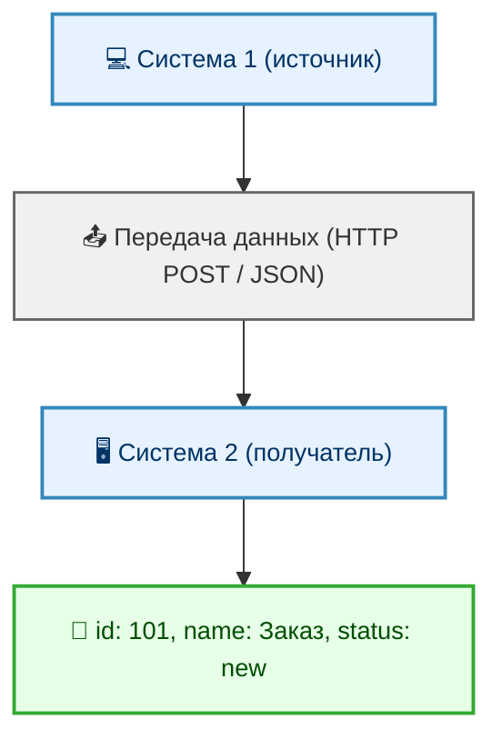
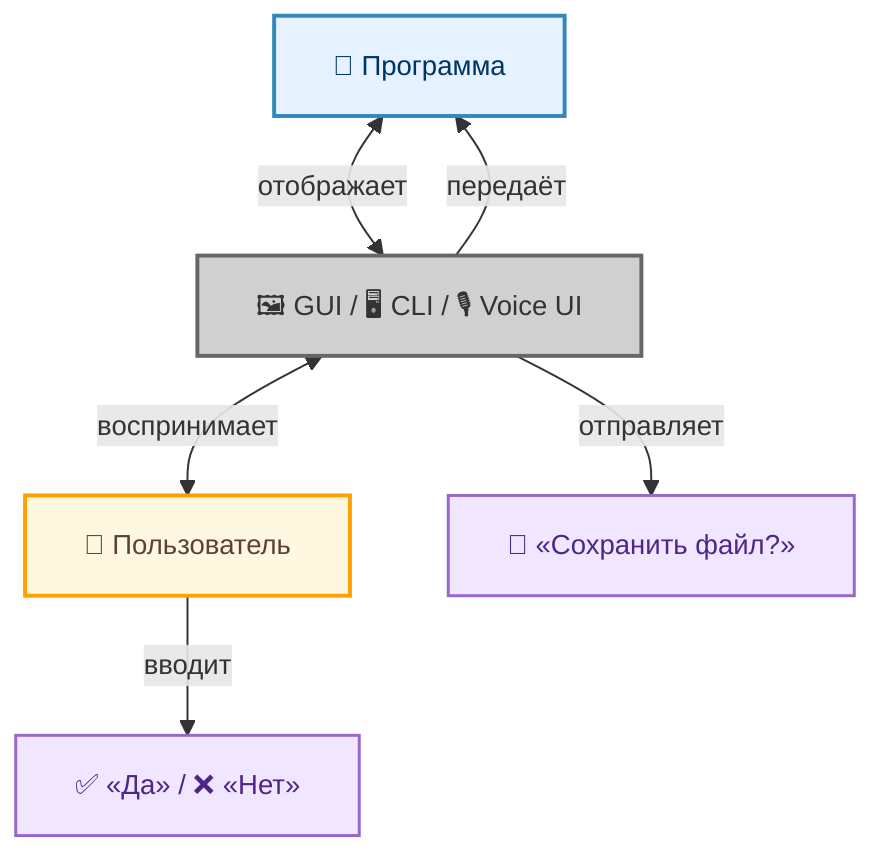
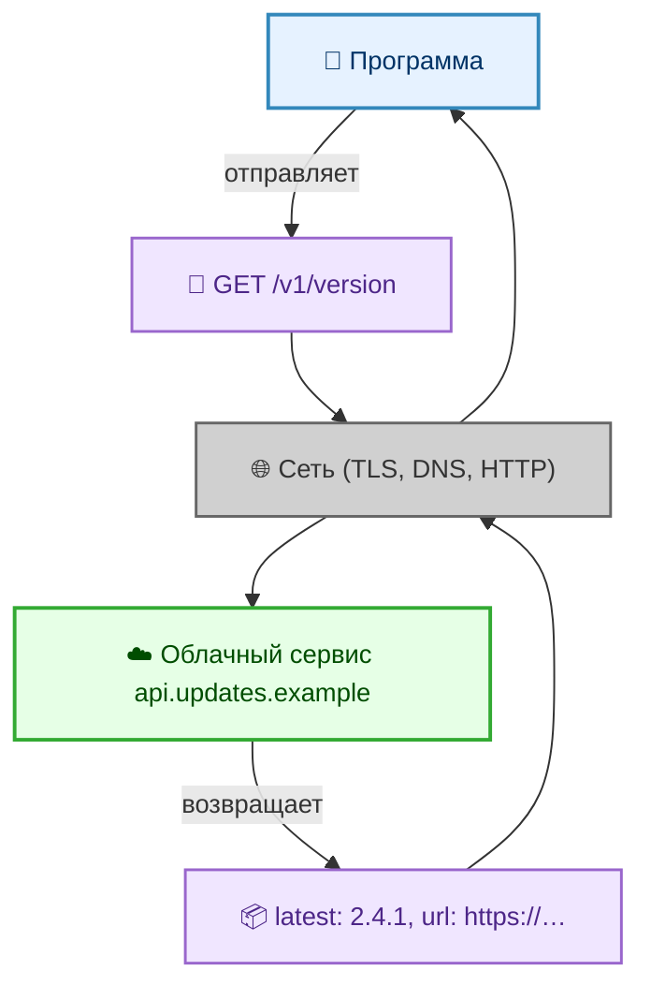

---
title: Интеграция
tags: [beginner, advanced, required, all]
---

# Интеграция

<div class="article-tags">
  <span class="tag tag-required">ОБЯЗАТЕЛЬНО</span>
  <span class="tag tag-beginner">ДЛЯ НОВИЧКОВ</span>
  <span class="tag tag-advanced">НЕ ДЛЯ НОВИЧКОВ</span>
  <span class="tag tag-inprogress">В РАЗРАБОТКЕ</span>
</div>
<span class="complexity-badge">Всем</span>

## Интеграция

Современные программные системы, даже самые автономные на первый взгляд, крайне редко существуют в полной изоляции. Даже локальное приложение, не подключённое к интернету, может взаимодействовать с операционной системой, использовать системные библиотеки или сохранять данные в файловую систему — всё это формы интеграции. Однако в промышленной, корпоративной и веб-разработке интеграция приобретает особую значимость, поскольку бизнес-процессы, пользовательские сценарии и технические архитектуры требуют координации множества независимых компонентов.

Интеграционное взаимодействие — это совокупность механизмов, протоколов, принципов и практик, посредством которых программные системы обмениваются данными, координируют поведение и совместно реализуют сложные функциональные требования. Без таких механизмов невозможно построить распределённую, масштабируемую и гибкую архитектуру.

---

### Что такое интеграция? Как она соотносится с коммуникацией и взаимодействием?

Термины **интеграция**, **коммуникация** и **взаимодействие** часто используются как синонимы, но в техническом контексте они описывают разные уровни и аспекты одного и того же явления.

**Интеграция** — это процесс и результат объединения двух или более автономных систем с целью достижения функциональной целостности. Интеграция предполагает обмен данными и согласование семантики, форматов, протоколов, политик безопасности и жизненных циклов. Например, интеграция CRM-системы с платёжным шлюзом включает передачу суммы и идентификатора заказа, согласование статусов транзакций, обработку ошибок и восстановление после сбоев.

**Коммуникация** — это технический акт передачи информации от одного участника к другому. Это уровень сигнала: байты передаются по каналу связи, с использованием того или иного транспортного протокола (TCP, HTTP, AMQP и т.д.). Коммуникация может быть успешной с технической точки зрения, даже если смысл сообщения не понят получателю.

**Взаимодействие** — это семантический и функциональный уровень общения систем. Оно включает передачу данных и ожидание определённого поведения в ответ. Например, отправка запроса на авторизацию подразумевает доставку токена и проверку его валидности, выдачу прав доступа и потенциальную генерацию сессии. Взаимодействие предполагает наличие контракта — явного или неявного — между сторонами.




Таким образом, интеграция охватывает взаимодействие, которое, в свою очередь, использует коммуникацию как транспортный механизм.

В IT интеграция означает налаживание взаимодействия между программными и аппаратными элементами: приложениями, базами данных, устройствами, API, облачными платформами и другими технологическими единицами. Цель — устранить изолированность («информационные острова»), повысить автоматизацию, сократить дублирование действий и обеспечить сквозные бизнес-процессы.

Интеграция бывает:

- **Технической** — на уровне протоколов, форматов данных, сетевой доступности (например, подключение терминала оплаты к кассовой системе через TCP/IP и JSON-обмен).  
- **Функциональной** — на уровне задач: система учёта запускает уведомление в мессенджер, CRM создаёт задачу в системе поддержки.  
- **Бизнес-уровневой** — когда процессы разных подразделений или компаний синхронизируются: приём заказа → резервирование товара → выпуск счёта → логистика → уведомление клиента.


---

### Почему программы не работают сами по себе?

На первый взгляд, автономное программное обеспечение — например, редактор текста или игра — может функционировать полностью независимо. Однако даже в таких случаях присутствуют формы взаимодействия:

- с операционной системой (через системные вызовы, файловую систему, устройства ввода-вывода);
- с пользователем (через интерфейс, который сам по себе является формой диалога);
- с внешними библиотеками или службами (например, проверка обновлений, синхронизация настроек в облако).



В корпоративной среде изоляция практически невозможна. Бизнес-процессы часто распределены между различными доменами: продажи, финансы, логистика, поддержка. Каждый из них обслуживается отдельной системой: ERP, CRM, WMS, биллинг, аналитика. Для выполнения даже простой операции — например, оформления заказа — требуется координация множества систем. Ни одна из них не обладает полной информацией о контексте; только совместная работа позволяет принять корректное решение.



Более того, современные архитектурные стили — микросервисы, event-driven architecture, serverless — основаны на декомпозиции функционала на независимые компоненты, которые обязаны взаимодействовать. Изоляция здесь — достоинство: она повышает устойчивость, упрощает развертывание и позволяет масштабировать отдельные части независимо.

---

### Как общаются системы?

Общение систем строится на нескольких фундаментальных принципах:

1. **Наличие общего протокола** — системы должны использовать один и тот же транспортный и прикладной протокол (например, HTTP/1.1, gRPC, MQTT). Протокол определяет синтаксис сообщений, порядок обмена, правила ошибок.

2. **Согласование формата данных** — даже при использовании одного протокола данные могут передаваться в разных форматах: JSON, XML, Protocol Buffers, Avro. Формат должен быть согласован заранее или определён динамически (например, через MIME-типы в HTTP).

3. **Семантический контракт** — стороны должны понимать структуру данных и их смысл. Например, поле `amount` может быть в центах или в рублях; значение `status: "confirmed"` может означать разное в разных системах. Контракт часто формулируется в виде OpenAPI, AsyncAPI, GraphQL-схемы или просто в технической документации.

4. **Политики взаимодействия** — это правила, определяющие, когда, как часто и при каких условиях допустимо взаимодействие. Сюда относятся ограничения по скорости (rate limiting), требования к надёжности (retry policy), временные окна доступности (SLA), а также правила обработки ошибок.

5. **Контекст безопасности** — почти любое взаимодействие осуществляется в рамках доверенной среды. Это требует аутентификации, авторизации, шифрования и аудита.

Без соблюдения хотя бы одного из этих принципов общение либо невозможно, либо приводит к ошибкам, несогласованности данных или уязвимостям.

---

## Интеграционный контракт

**Интеграционный контракт** — это соглашение между двумя или более системами, сервисами или компонентами, фиксирующее правила, форматы и условия их взаимодействия. Он описывает, как стороны обмениваются данными и что ожидается от каждой из них в процессе интеграции.

Этот документ или спецификация задаёт чёткие рамки сотрудничества. Он не предполагает юридической силы (в отличие от договора между организациями), но служит технической основой для разработки, тестирования и сопровождения интеграции.

### Основные части интеграционного контракта

1. **Идентификация участников**  
   Указываются имена или идентификаторы взаимодействующих компонентов: например, *«Система учёта заказов»* и *«Платёжный шлюз»*.

2. **Точки взаимодействия (endpoints)**  
   Адреса, по которым доступны интерфейсы:  
   - URL для REST-вызова (`https://api.shop.example/v1/payments`)  
   - имя очереди в брокере сообщений (`queue:order.created`)  
   - имя метода в gRPC-сервисе (`PaymentService.ProcessPayment`)  

3. **Форматы данных**  
   Чёткое описание структуры входных и выходных сообщений:  
   - тип контента (`application/json`, `application/xml`)  
   - схема данных (например, JSON Schema или XSD)  
   - обязательные и необязательные поля  
   - примеры корректных запросов и ответов  

   Пример фрагмента:  
   ```json
   {
     "orderId": "string, 36 символов, UUID",
     "amount": "число, больше 0, с двумя знаками после запятой",
     "currency": "строка, например 'RUB', 'USD'",
     "callbackUrl": "валидный HTTPS-URL"
   }
   ```

4. **Протоколы и методы обмена**  
   - HTTP-методы (`POST`, `GET`, `PUT`)  
   - коды ответов и их смысл (`201 Created`, `400 Bad Request`, `409 Conflict`)  
   - механизм аутентификации (`Bearer Token`, `API-Key`, `mTLS`)  
   - требования к шифрованию (`TLS 1.2+`)  

5. **Семантика операций**  
   Что означает каждое действие в предметной области:  
   - вызов `POST /payments` — *«инициировать процесс оплаты и зарезервировать средства»*  
   - событие `order.shipped` — *«товар передан в службу доставки, изменение статуса окончательно»*  
   Это исключает неоднозначность: разные команды могут по-разному понимать слово «отмена», а контракт фиксирует её точное значение.

6. **Гарантии и ограничения**  
   - идемпотентность (повторный вызов с тем же ID не создаёт дубль)  
   - уровень изоляции транзакций  
   - ограничения по частоте вызовов (rate limits)  
   - SLA на время ответа (например, *«95% запросов обрабатываются за ≤800 мс»*)  
   - политика повторных попыток (retry policy) и обработки отказов  

7. **Версионирование**  
   Правила изменения контракта:  
   - как обозначаются версии (`/v1/`, заголовок `API-Version: 2`)  
   - срок поддержки старых версий (например, *«v1 поддерживается 12 месяцев после выхода v2»*)  
   - правила обратной совместимости (что можно менять без нарушения работы клиентов)

---

### Зачем нужен интеграционный контракт?

- **Снижает риски недопонимания** между командами разработки, аналитиками и тестировщиками.  
- Позволяет начать работу параллельно: одна команда реализует «продюсера», другая — «консьюмера», опираясь на один документ.  
- Упрощает автоматическое тестирование: mock-серверы и контрактные тесты (например, Pact) проверяют соответствие реализации спецификации.  
- Служит основой для документации и генерации клиентских SDK.  
- Обеспечивает стабильность при развитии систем: изменения вносятся контролируемо, без «сломанных» интеграций.

---

### Где и как фиксируется контракт?

- В виде **спецификации OpenAPI** (Swagger) — для REST API.  
- Как **Protobuf-файл** — для gRPC-сервисов.  
- В **графе зависимостей событий** (Event Storming) — для событийных систем.  
- В **таблице в Confluence или Docusaurus** — для внутренних договорённостей без формальной сериализации.  
- В **файле схемы данных** (XSD, JSON Schema) — при обмене XML/JSON по файлам или очередям.

Контракт живёт и развивается вместе с системами — но любое изменение проходит согласование и публикуется заранее.

---
