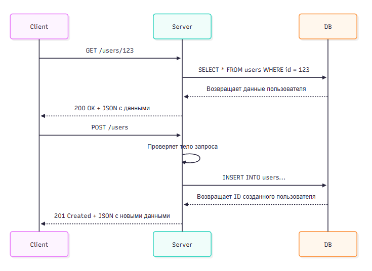

---
title: 2.09. API
---

# 2.09. API

<div class="article-tags">
  <span class="tag tag-required">ОБЯЗАТЕЛЬНО</span>
  <span class="tag tag-beginner">ДЛЯ НОВИЧКОВ</span>
  <span class="tag tag-advanced">НЕ ДЛЯ НОВИЧКОВ</span>
  <span class="tag tag-inprogress">В РАЗРАБОТКЕ</span>
</div>
<span class="complexity-badge">Всем</span>

## API

### API и SDK

```
+Подписка на API
```

Человек общается с компьютером через ввод и вывод - соответствующие устройства. А устройство, точнее, его компоненты между собой, общаются через череду сигналов. Эти сигналы структурируются в наборы данных, которые отправляются пакетами по протоколам. Но как программы друг друга понимают? Ответ - при помощи единообразия, в виде API.

**API (Application Programming Interface)** — это набор правил, методов и инструментов, позволяющих различным программам или сервисам взаимодействовать друг с другом. Можно привести в пример реальную жизнь - когда вы приходите в ресторан, вы не говорите напрямую поварам свои пожелания - к вам подходит официант, предоставляет меню с возможным ассортиментом, вы выбираете нужный, даёте указания официанту, который и действует аналогично API - посредник между вами и кухней.

API обычно состоит из:
	- Точек доступа (endpoints, эндпоинты) — URL, по которым можно обращаться.
	- Методов HTTP — GET, POST, PUT, PATCH, DELETE и др.
	- Параметров запроса — пути, строка запроса (query string), заголовки, тело.
	- Формата данных — JSON, XML, Protobuf и т.д.
	- Документации — описание возможностей, примеры использования, ограничения.

**SDK (Software Development Kit)** — это набор готовых библиотек, инструментов и примеров кода, предназначенных для работы с определённым API. Используется тогда, когда хочется не писать HTTP-запросы вручную, а использовать удобный интерфейс на своём языке. К примеру, Telegram предоставляет такой набор инструментов, благодаря чему на стороне сервера нужно лишь подключить библиотеку, указать токен и использовать готовые методы для работы без необходимости расписывать логику базовых действий, к примеру, отправки сообщений. SDK скрывает сетевые детали и предоставляет простой интерфейс.

### REST

**REST API (Representational State Transfer)** является архитектурным стилем, использующем стандартные HTTP-методы. Это самый распространённый подход для реализации веб-сервисов - можно просто определить эндпоинт, методы, параметры, формат и разработать серверный бэкенд-код, который будет «принимать» запросы и «отвечать» на них. На стороне клиента проблем ещё меньше - там просто нужно, к примеру, сделать кнопку, которая будет формировать запрос и отправлять его по эндпоинту.

Он основан на следующих принципах:
	- Стандартные методы HTTP.
	- Ресурсо-ориентированная адресация (URL как ресурсы).
	- Отсутствие состояния (stateless).
	- Поддержка разных форматов данных (обычно JSON или XML).

REST (Representational State Transfer) — это архитектурный стиль для создания веб-сервисов, основанный на использовании HTTP-протокола. REST API предоставляет набор правил для взаимодействия между клиентом и сервером через стандартные HTTP-методы.

Этот подход лучше использовать для простых CRUD-операций, и если нужно разработать API быстро, без лишней настройки.

Каждый ресурс имеет уникальный URL (Uniform Resource Locator), а данные отправляются, как правило, в формате JSON или XML. Каждый запрос содержит всю необходимую информацию для его обработки. Сервер не хранит состояние клиента между запросами. Чуть позже мы углубимся в API и REST.

Документацией REST можно считать документацию HTTP.

Стандартные методы HTTP, используемые в REST:
	- GET — получение данных.
	- POST — создание нового ресурса.
	- PUT/PATCH — обновление существующего ресурса.
	- DELETE — удаление ресурса.


**Как создать свой REST API?**

1. Определить, какие данные будут передаваться.
2. Определить, какие операции нужно поддерживать (CRUD: Create, Read, Update, Delete).
3. Определить, кто будет использовать API (фронтенд, мобильное приложение, другие сервисы).
4. Выбрать и определить базовый путь, например, /api/v1.
5. Для каждого типа данных определить URL-пути:
	- GET /users – получить список пользователей
	- GET /users/123 – получить пользователя с ID 123
	- POST /users – создать нового пользователя
	- PUT /users/123 – обновить пользователя
	- DELETE /users/123 – удалить пользователя
6. Определить необходимость и добавить параметры запроса - фильтрация, сортировка, пагинация.
7. Определить формат обмена данными (обычно JSON).
8. Определить структуру запросов и ответов, к примеру:

```
// Пример запроса
{
  "name": "John",
  "email": "john@example.com"
}

// Пример ответа
{
  "id": 123,
  "name": "John",
  "created_at": "2025-04-05T10:00:00Z"
}

```
9. Настроить маршруты (роутинг) - сопоставить URL + HTTP-метод → обработчик.
10. В обработчиках нужно написать возможности:
	- чтения входящих данных из заголовков, строки запроса или тела;
	- проверку данных (валидацию);
	- обращение к БД или другому источнику данных (например, файл);
	- формирование ответа - статус, заголовки, тело;
	- обработка ошибок.

Обычно в готовых SDK уже имеются некоторые написанные решения, порой можно просто пользоваться имеющимися свойствами и методами объектов.

11. Добавить авторизацию (если нужна, но очевидно она всегда нужна для безопасности) - JWT, OAuth, API ключи. По возможности, кстати, нужно придерживаться и иных мер безопасности - использование HTTPS, ограничение доступа по CORS, валидация данных и логирование действий.
12. Задокументировать, указав описание всех эндпоинтов, примеры запросов и ответов, описание кодов и ошибок. Для этого можно использовать Open API / Swagger.
13. Проверять работу всех методов можно через Postman, curl, Swagger UI.
14. После тестирования, сервис разворачивается на бэкенд-сервере, допустим на хостинге, и когда будет определен хост, можно будет уже отправлять запросы. До этого момента, на этапе тестирования, его можно выполнять на локальной машине.
Итого:
	- клиент отправляет HTTP-запрос на конкретный URL;
	- сервер определяет маршрут и вызывает функцию-обработчик;
	- обработчик получает данные, может взаимодействовать с БД или даже другими API;
	- сервер формирует HTTP-ответ и отправляет его обратно клиенту.



REST — это стиль, а не строгий протокол, может быть реализован на любом языке программирования, легко масштабируется, хорошо документируется. 


### Другие API

А как же другие API?

GraphQL API запрашивает только нужные данные, гибко управляя структурой ответа, используется для SPA, микросервисов, сложных данных.

SOAP API более старый протокол с жёсткой структурой, основанный на XML. Его можно встретить в устаревших корпоративных системах.

gRPC API высокопроизводительный (ведь там RPC-протокол), работает поверх HTTP/2, использует Protobuf. В высоконагруженных системах с микросервисами можно часто встретить такой стиль.

WebSocket API, как мы уже не раз отметили, использует двустороннее постоянное соединение.

SSE (Server-Sent Events) использует одностороннюю передачу данных от сервера к клиенту - новости, уведомления, мониторинг.

OAuth 2.0 API — это протокол авторизации, который позволяет приложениям получать ограниченный доступ к ресурсам пользователя без необходимости знать его пароль. К примеру, это авторизация через Google/Facebook, подключение к Google Drive или Dropbox, работа с банковскими API. OAuth 2.0 использует токены , такие как:
	- access_token — временный ключ для доступа к ресурсам
	- refresh_token — для получения нового access_token

Front API — это не общепринятый термин, но его можно интерпретировать как API, которое используется для взаимодействия с фронтендом (клиентской частью) приложения. В более широком смысле это может означать:
	- API для клиентских приложений - предоставление данных и функциональности для веб-приложений, мобильных приложений или десктопных клиентов.
	- REST/GraphQL API - часто такие API используются для передачи данных между сервером и клиентом.

Кстати говоря о фронте, следует отметить, что как раз для работы с API в JavaScript используют метод fetch():

```
fetch('/api/user/profile', {
  method: 'GET',
  headers: { Authorization: 'Bearer <token>' }
})
```

fetch() — это встроенный в браузер метод , позволяющий отправлять HTTP-запросы к серверу и получать данные без перезагрузки страницы. Он возвращает Promise , который разрешается в объект ответа (Response), а затем можно обработать тело ответа (например, как JSON или текст).
Синтаксис прост - fetch(input, init). input это URL, по которому делается запрос (строка) или объект Request, а init (необязательный) это объект с настройками запроса: метод, заголовки, тело и т.д.

После вызова fetch(), вы получаете объект Response.

Основные свойства Response:
	- .ok — возвращает true, если статус 200–299.
	- .status — HTTP-статус ответа (например, 200, 404).
	- .statusText — текстовое описание статуса (например, "OK", "Not Found").
	- .headers — объект Headers, содержащий заголовки ответа.
	- .url — фактический URL ответа (может отличаться от запрошенного при редиректах).

Методы для получения тела:
	- .json() — парсит тело как JSON.
	- .text() — возвращает тело как строку.
	- .blob() — возвращает как Blob (например, изображения).
	- .formData() — возвращает как FormData.
	- .arrayBuffer() — возвращает как массив ArrayBuffer.

fetch() подчиняется политике CORS (Cross-Origin Resource Sharing), если сервер не разрешает кросс-доменные запросы, браузер блокирует их, а для авторизации может потребоваться установка заголовков или использование credentials.

Web API — это общий термин, обозначающий API, доступные через веб-интерфейс. Это могут быть как серверные API (например, REST, GraphQL), так и клиентские API (например, браузерные API).

Основные типы Web API:

Серверные API :
	- RESTful API: стандартный подход к созданию веб-сервисов.
	- GraphQL API: гибкий запрос данных с возможностью выбора полей.
	- SOAP API: устаревший протокол для веб-сервисов.

Клиентские API :
	- DOM API: управление HTML-документами в браузере.
	- Fetch API: выполнение HTTP-запросов из браузера.
	- Geolocation API: получение географических данных пользователя.

Fluent API — это стиль программирования, при котором методы возвращают объект, позволяя «цеплять» вызовы методов друг за другом. Используется в ORM, билдерах SQL, тестовых фреймворках. Этот подход часто используется для создания удобного и читаемого кода.

FastAPI — это современный веб-фреймворк для создания API на Python. Он известен своей высокой производительностью, простотой использования и поддержкой асинхронного программирования. Основан на на Starlette и Pydantic, что делает его одним из самых быстрых фреймворков.

Чит-лист FastAPI - https://cheatsheets.zip/fastapi

Starlette — это лёгкий и быстрый веб-фреймворк для Python, предназначенный для создания асинхронных веб-приложений и API. Он является основой таких проектов, как FastAPI , и известен своей производительностью и гибкостью.

Pydantic — это библиотека Python для валидации данных и управления конфигурацией с использованием аннотаций типов. Она автоматически проверяет данные на соответствие ожидаемым типам и структурам.

SignalR — это библиотека для ASP.NET Core, которая позволяет реализовать реальное взаимодействие между клиентом и сервером. Она поддерживает двустороннюю связь через WebSocket, Server-Sent Events (SSE) и Long Polling. Именно оно используется для чатов, онлайн-игр, обновлений.

Long Polling — это техника для реализации асинхронного взаимодействия между клиентом и сервером в веб-приложениях. Она позволяет клиенту ожидать новые данные от сервера, не отправляя постоянные запросы.

Как работает:
	- Клиент отправляет HTTP-запрос на сервер.
	- Сервер держит соединение открытым до тех пор, пока не появятся новые данные или истечет таймаут.
	- Как только данные доступны, сервер отправляет ответ, и клиент сразу же отправляет новый запрос.

Каждая программа, которая поддерживает какой-то свой метод взаимодействия, может предоставлять свой интерфейс, и как правило, он будет характерен именно для взаимодействия соответствующего продукта - Kubernetes API, Telegram API, Windows API, WhatsApp API, Google Maps API, Twitter/X API и прочие.
