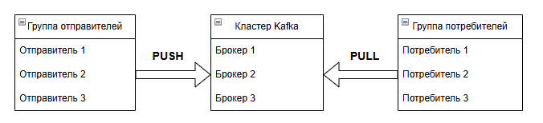

---
title: 2.09. Kafka
---

# 2.09. Kafka

<div class="article-tags">
  <span class="tag tag-required">ОБЯЗАТЕЛЬНО</span>
  <span class="tag tag-beginner">ДЛЯ НОВИЧКОВ</span>
  <span class="tag tag-advanced">НЕ ДЛЯ НОВИЧКОВ</span>
  <span class="tag tag-inprogress">В РАЗРАБОТКЕ</span>
</div>
<span class="complexity-badge">Всем</span>

## Kafka

Apache Kafka — это распределённая потоковая платформа (streaming platform), которая предназначена для обработки больших объёмов данных в реальном времени. Kafka часто используется для построения систем, где требуется высокая производительность, масштабируемость и надёжность.
Официальный сайт - https://kafka.apache.org/

Kafka работает в кластере, поддерживает обработку данных в реальном времени и может обрабатывать миллионы сообщений в секунду.


Это работает так:
1. Определяются продюсеры (отправляют данные) и консьюмеры (получают данные).
2. Создаётся кластер Kafka — группа серверов, называемых брокерами.
3. Для потока данных создаётся топик — это как лог событий, куда можно только добавлять записи.
4. Продюсеры отправляют сообщения в топик (режим PUSH).
5. Консьюмеры сами забирают данные из топика (режим PULL), когда готовы их обработать.
6. Каждый топик делится на партиции — это позволяет обрабатывать данные параллельно и масштабироваться.
7. Партиции распределяются между брокерами кластера для равномерной нагрузки.
8. Каждая партиция реплицируется на несколько брокеров — это обеспечивает отказоустойчивость.
9. В каждой репликации одна копия — лидер, она обрабатывает все запросы. Остальные — следят за синхронизацией. Если лидер падает, один из них автоматически становится новым лидером.


Теперь давайте разберём чуть подробнее.

Когда имеется много сервисов, БД, монолитов и прочих источников данных, часто возникает ситуация, когда одни и те же данные нужны многим сервисам, но формат хранения разный. Kafka выступает в качестве масштабируемого и отказоустойчивого инструмента, который может пропускать большие объёмы данных (миллионы!), 

Как мы обозначили ранее, в Kafka сообщения называются топиками.

Топики, можно сказать, просто собирают данные, добавляя их снова и снова, не изменяясь и используются только для чтения. Продюсеры (отправители) отправляют данные в топики, а консюмеры (потребители) читают топики. К примеру, это сбор активности с различных систем, потоковая обработка большого количества событий, логирование.

Масштабируемость достигуется за счёт архитектуры кластера и системы партиций. Продюсеры группируются, отправляют сообщения в кластер кафки, а потребители «вытягивают» их. Это классическая модель PUSH (толкать, отправлять)/PULL (вытягивать).



Топики разделяются на партиции, которые распределяются между брокерами в кластере. Поэтому кластер Kafka можно считать группой брокеров, используемых для масштабируемости.

Для надёжности, кластеры используют технику репликации - партиции не просто раскидываются между брокерами, а используют репликацию. Это непростой механизм, который похож на копирование - представьте себе четыре папки и 10 файлов. Каждая папка - брокер, а файл - партиция. Для оптимизации нагрузки, вы закидываете файл №1 в папку №1, файл №2 в папку №2, файл №3 в папку №3, а все остальные файлы (4-10) в папку №4. Это простое перемещение, распределение. Но репликация подразумевает, что во всех четырёх папках будут все 10 файлов, как копии. Зачем это используется? Для распределения нагрузки, чтобы брокер №1 работал с сообщением №1, брокер №2 с сообщением №2, и т.д.

Таким образом, для каждой партиции мы получаем экземпляр реплики. Одна из реплик считается «оригиналом», и называется лидером. Все запросы на запись и чтение проходят через лидера - это гарантирует согласованность. А другие реплики, не являющиеся лидерами, не обслуживают запросы клиентов, а только копируют сообщения от лидера, как бы «синхронизируясь». Если реплика считается синхронизированной, то она может быть избрана в качестве лидера раздела. Смена лидера происходит тогда, когда существующий лидер вышел из строя.

Администратор может настроить максимальные размеры сообщений (к примеру, 1 МБ), а также время хранения данных и уровень репликации.

Основные компоненты Kafka:
1. Брокер (Broker) — это узел (сервер) в Kafka-кластере, который отвечает за хранение и управление данными. Каждый брокер хранит часть данных (топиков) и обрабатывает запросы от продюсеров и консьюмеров. В кластере может быть несколько брокеров для обеспечения отказоустойчивости и масштабируемости.
2. Кластер (Cluster) — это группа брокеров, которые работают вместе для обработки данных. Kafka использует ZooKeeper (или Raft в новых версиях) для координации работы брокеров в кластере.
3. Координатор (Coordinator) — это специальный брокер, который отвечает за управление группами консьюмеров. Он отслеживает, какие консьюмеры читают данные из каких партиций, и управляет оффсетами.
4. Топик (Topic) — это логический канал, через который передаются сообщения. Каждый топик разделяется на партиции (partitions) для параллельной обработки данных. 
5. Партиция (Partition) — это упорядоченный лог данных внутри топика. Каждая партиция хранится на одном брокере, но может реплицироваться на другие брокеры для отказоустойчивости. Сообщения в партиции имеют строгий порядок, что позволяет гарантировать последовательность обработки.
6. Оффсет (Offset) — это уникальный идентификатор сообщения в партиции. Консьюмеры используют оффсеты для отслеживания своего прогресса при чтении данных. Оффсеты сохраняются либо на стороне консьюмера, либо в Kafka.
7. Продюсер (Producer) — это приложение или сервис, которое отправляет сообщения в Kafka. Продюсер выбирает топик и партицию для отправки сообщений.
8. Консьюмер (Consumer) — это приложение или сервис, которое читает сообщения из Kafka. Консьюмеры организованы в группы (consumer groups), чтобы распределить нагрузку между несколькими экземплярами.

Kafka использует модель «продюсер-брокер-консьюмер» для обработки данных. 

Вот как это работает:
	- продюсер отправляет сообщения, пишет их в определённый топик;
	- сообщения автоматически распределяются по партициям топика;
	- каждый брокер хранит данные в партициях - данные сохраняются в течение заданного времени (например, неделя);
	- консьюмер подключается к топику и начинает читать сообщения;
	- каждый консьюмер в группе получает данные из одной или нескольких партиций;
	- координатор следит за тем, какие консьюмеры читают данные и из каких партиций, если консьюмер выходит из строя, его партиции переназначаются другим консьюмерам.

### Как настроить Kafka?

1. Установка Java. Kafka работает поверх Java, поэтому сначала нужно установить Java Development Kit (JDK).
2. Установка ZooKeeper. ZooKeeper — это координатор, который управляет кластером Kafka. В новых версиях Kafka (например, 3.x) ZooKeeper заменяется на Raft, но для старых версий он всё ещё обязателен.
2.1. Скачайте и распакуйте ZooKeeper;
2.2. Настройте конфигурацию. Создайте файл zoo.cfg в папке conf.
2.3. Запустите ZooKeeper
3. Установка Kafka. 
3.1. Скачайте и распакуйте Kafka.
3.2. Настройте конфигурацию. Файл конфигурации находится в config/server.properties. Основные параметры:

```
broker.id=1
listeners=PLAINTEXT://localhost:9092
log.dirs=/tmp/kafka-logs
num.partitions=3

```

3.3. Запустите Kafka:
```
bin/kafka-server-start.sh config/server.properties
```

3.4. Чтобы Kafka запускался автоматически при загрузке системы, добавьте скрипт в автозагрузку или используйте systemd.
4. Создание топика. 
Топик — это логический канал для передачи сообщений.
Создайте топик:

```
bin/kafka-topics.sh --create --topic my_topic --bootstrap-server localhost:9092 --partitions 3 --replication-factor 1
```

Проверьте список топиков:
```
bin/kafka-topics.sh --list --bootstrap-server localhost:9092
```

5. Отправка и получение сообщений.
Пример отправки сообщения:

```
bin/kafka-console-producer.sh --topic my_topic --bootstrap-server localhost:9092
```

Пример получения сообщения:
```
bin/kafka-console-consumer.sh --topic my_topic --from-beginning --bootstrap-server localhost:9092
```

6. Подключение Kafka к программам.
В разных языках программирования испольхуются соответствующие библиотеки.
6.1. Java - библиотека org.apache.kafka:kafka-clients
Пример использования:

```
import org.apache.kafka.clients.producer.*;
import java.util.Properties;

public class KafkaExample {
    public static void main(String[] args) {
        Properties props = new Properties();
        props.put("bootstrap.servers", "localhost:9092");
        props.put("key.serializer", "org.apache.kafka.common.serialization.StringSerializer");
        props.put("value.serializer", "org.apache.kafka.common.serialization.StringSerializer");
        Producer<String, String> producer = new KafkaProducer<>(props);
        producer.send(new ProducerRecord<>("my_topic", "key", "Hello, Kafka!"));
        producer.close();
    }
}

```

6.2. Python- библиотека kafka-python
Пример использования:

```
from kafka import KafkaProducer

producer = KafkaProducer(bootstrap_servers='localhost:9092')
producer.send('my_topic', value=b'Hello, Kafka!')
producer.flush()

```

6.3. JavaScript (Node.js)- библиотека kafkajs
Пример использования:

```
const { Kafka } = require('kafkajs');
const kafka = new Kafka({ brokers: ['localhost:9092'] });
const producer = kafka.producer();
await producer.connect();
await producer.send({
    topic: 'my_topic',
    messages: [{ value: 'Hello, Kafka!' }],
});
await producer.disconnect();

```

6.4. PHP - библиотека php-rdkafka
Пример использования:

```
<?php
$rk = new RdKafka\Producer();
$rk->addBrokers("localhost:9092");

$topic = $rk->newTopic("my_topic");
$topic->produce(RD_KAFKA_PARTITION_UA, 0, "Hello, Kafka!");
$rk->poll(0);
?>

```

7. Мониторинг предоставляет инструмент для управления кластерами - Kafka Manager. 
Пример установки:

```
docker run -it --rm -p 9000:9000 -e ZK_HOSTS="localhost:2181" sheepkiller/kafka-manager
```

Для визуализации можно использовать Grafana, а Prometheus для сбора метрик.
