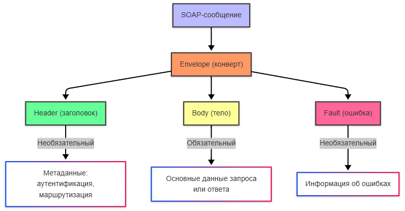

---
title: 2.09. SOAP
---

# 2.09. SOAP

<div class="article-tags">
  <span class="tag tag-required">ОБЯЗАТЕЛЬНО</span>
  <span class="tag tag-beginner">ДЛЯ НОВИЧКОВ</span>
  <span class="tag tag-advanced">НЕ ДЛЯ НОВИЧКОВ</span>
  <span class="tag tag-inprogress">В РАЗРАБОТКЕ</span>
</div>
<span class="complexity-badge">Всем</span>

## SOAP

SOAP (Simple Object Access Protocol) — это протокол для обмена структурированными данными в веб-сервисах. Он использует XML для форматирования сообщений и работает поверх различных транспортных протоколов, таких как HTTP, SMTP или TCP.

Про SOAP можно почитать на официальном сайте W3 - https://www.w3.org/TR/soap12-part1/


SOAP имеет строгую спецификацию, независим от платформы и языка, поддерживает сложные сценарии, такие как транзакции, безопасность и маршрутизация. Все данные передаются в виде XML, что делает их человекочитаемыми, но менее эффективными по сравнению с бинарными форматами.

SOAP-сообщение представляет собой XML-документ, который состоит из нескольких частей:
	- Envelope (конверт), корневой элемент SOAP-сообщения, который определяет начало и конец сообщения.
	- Header (заголовок), необязательный элемент, который содержит метаданные, такие как аутентификация, маршрутизация или транзакции.
	- Body (тело), обязательный элемент, содержит основные данные запроса или ответа.
	- Fault (ошибка), необязательный элемент, используется для передачи информации об ошибках.



Пример:
```
<soap:Envelope xmlns:soap="http://www.w3.org/2003/05/soap-envelope">
  <soap:Header>
    <auth:Authentication xmlns:auth="http://example.com/auth">
      <auth:Token>12345</auth:Token>
    </auth:Authentication>
  </soap:Header>
  <soap:Body>
    <getUserRequest xmlns="http://example.com/user">
      <userId>1</userId>
    </getUserRequest>
  </soap:Body>
</soap:Envelope>

```

**Как работает SOAP?**
1. Клиент отправляет SOAP-запрос на сервер через HTTP POST.
2. Сервер обрабатывает запрос и формирует SOAP-ответ.
3. Ответ отправляется обратно клиенту.

WSDL (Web Services Description Language) — это язык, используемый для описания веб-сервисов, доступных через SOAP. WSDL предоставляет формальное описание того, какие операции поддерживает сервис, какие данные используются в запросах и ответах, где находится сервис (URL) и какой протокол используется для взаимодействия.


WSDL-документ состоит из нескольких ключевых элементов:
1. Types определяет типы данных, используемые в сервисе (например, строки, числа, объекты). Часто использует XML Schema (XSD).
2. Message описывает входные и выходные данные для операций.
3. PortType определяет набор операций, которые поддерживает сервис.
4. Binding описывает протокол (например, SOAP) и формат данных для каждой операции.
5. Service указывает URL, где находится сервис.


Как работает взаимодействие SOAP+WSDL?
1. Клиент получает WSDL, загружая документ с сервера, чтобы узнать, какие операции доступны и как их вызывать.
2. На основе WSDL генерируется код для клиента.
3. Клиент вызывает метод, например, getUser, передавая параметры в виде XML.
4. Сервер получает SOAP-запрос, выполняет операцию и формирует SOAP-ответ.
5. Клиент получает SOAP-ответ и обрабатывает его.
