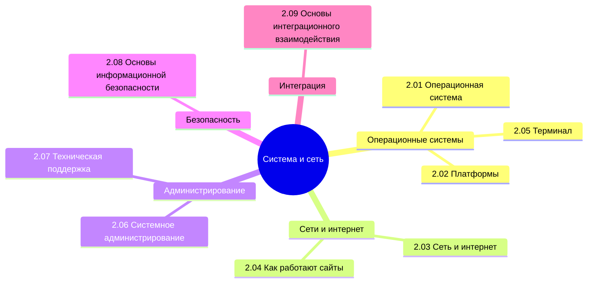

## 2. Оглавление

Приветствую! Надеюсь, вы ознакомились с первыми шагами и готовы продвигаться дальше. Если поначалу мы только разгонялись, с целью разобраться, как вообще всё устроено - от устройства компьютера до особенностей ведения бизнеса в сфере информационных технологий, то сейчас мы уже считаемся продвинутыми пользователями. Теперь мы переходим к более сложным и специализированным темам, и поэтому придётся думать и работать, и конечно много учить.

Теперь пора приступить к системной части.

Вообще, лучше воспользуйтесь содержанием или перейдите к Базе знаний. Но для удобства, я размещу здесь ссылки на основные главы раздела:

<ul>
  <li><a href="/it-knowledge-base/docs/Система%20и%20сеть/2.01.%20Операционная%20система/1">2.01. Операционная система</a></li>
  Центральное программное обеспечение, управляющее ресурсами компьютера: процессором, памятью, устройствами. Функции ядра, файловой системы, планировщика задач и интерфейса взаимодействия с приложениями.
  
  <li><a href="/it-knowledge-base/docs/Система%20и%20сеть/2.02.%20Платформы/1">2.02. Платформы</a></li>
  Комплекс аппаратных и программных условий, определяющих среду выполнения приложений: десктопные (Windows, macOS, Linux), мобильные (Android, iOS), веб- и облачные платформы.
  
  <li><a href="/it-knowledge-base/docs/Система%20и%20сеть/2.03.%20Сеть%20и%20интернет/1">2.03. Сеть и интернет</a></li>
  Принципы построения компьютерных сетей: модели OSI и TCP/IP, протоколы передачи данных, маршрутизация, адресация (IP), доменная система (DNS). Основы функционирования глобальной сети.
  
  <li><a href="/it-knowledge-base/docs/Система%20и%20сеть/2.04.%20Как%20работают%20сайты%20и%20веб-сайты/1">2.04. Как работают сайты и веб-сайты</a></li>
  Архитектура веб-взаимодействия: клиент-серверная модель, HTTP/HTTPS, запросы и ответы, статические и динамические страницы, роль браузера и веб-сервера.
  
  <li><a href="/it-knowledge-base/docs/Система%20и%20сеть/2.05.%20Терминал/1">2.05. Терминал</a></li>
  Текстовый интерфейс для управления операционной системой. Командная строка, оболочки (shell), выполнение скриптов, автоматизация задач и навигация по файловой системе.
  
  <li><a href="/it-knowledge-base/docs/Система%20и%20сеть/2.06.%20Системное%20администрирование/1">2.06. Системное администрирование</a></li>
  Обеспечение стабильной работы IT-инфраструктуры: настройка серверов, управление пользователями, обновления, мониторинг производительности, резервное копирование и восстановление.
  
  <li><a href="/it-knowledge-base/docs/Система%20и%20сеть/2.07.%20Техническая%20поддержка/1">2.07. Техническая поддержка</a></li>
  Процессы диагностики и устранения неисправностей у пользователей. Уровни поддержки, работа с обращениями, документирование решений, коммуникация с конечными пользователями.
  
  <li><a href="/it-knowledge-base/docs/Система%20и%20сеть/2.08.%20Основы%20информационной%20безопасности/1">2.08. Основы информационной безопасности</a></li>
  Первичные меры защиты данных и систем: аутентификация, шифрование, антивирусная защита, брандмауэры, политики паролей, защита от фишинга и социальной инженерии.
  
  <li><a href="/it-knowledge-base/docs/Система%20и%20сеть/2.09.%20Основы%20интеграционного%20взаимодействия/1">2.09. Основы интеграционного взаимодействия</a></li>
  Механизмы обмена данными между системами: API (REST, SOAP), форматы сообщений (JSON, XML), очереди сообщений, шины данных и принципы обеспечения согласованности.
</ul>

Вообще, что такое система? Попробуйте себе ответить на этот вопрос, что вам пришло в голову? Windows? Android? Какая-то платформа или архитектура? Под это понятие можно подобрать почти всё, ведь система это множество элементов, находящихся в связях друг с другом. А всё вокруг нас состоит из этих элементов.

Есть даже целое направление методологии, рассматривающей любой объект как систему - это системный подход. Технически да, возьмите что угодно - это будет целостный комплекс взаимосвязанных элементов, и вопрос лишь в том, какой объект брать.

В IT система сильно зависит от контекста, но суть всегда одна - это некая совокупность элементов, действующих вместе как одно целое и выполняющих этим определённую функцию.

Системой может быть некая платформа, включающая в себе множество модулей, программ, приложений, взаимодействующих между собой, и всё целиком служит какой-то единой цели. Фактически, любая система на самом деле нужна, чтобы кто-то зарабатывал деньги, ведь это основа экономики. Разработчик не возьмётся за разработку, если ему не нужны деньги, заказчик не будет платить, если ему не нужны ещё большие деньги. И операционная система тоже кому-то приносит прибыль, и это техногиганты.

Вроде бы логично. Но есть такое явление, как Linux.

Обычно большинство систем предоставляются в пользование бесплатно лишь в образовательных целях. Но ведь они позволяют заработать денежные средства, путем использования операционной системы как некой платформы для разработки или эксплуатации уже разработанных программ! И именно поэтому создатели зачастую считают как-то вроде «не-не, если ты зарабатываешь, то будь добр делиться с нами», и коммерческое использование ограничивается. Однако Linux (как и множество других открытых решений) изменили мир, создав категорию свободного и открытого программного обеспечения с общедоступными (открытыми) исходными кодами. Сейчас нам уже не кажется это чем-то новым или необычным, но это меняет всё.
И прежде, чем мы продолжим погружение, давайте разберём такой вид информационных систем, как операционные системы - каких они бывают видов, какие особенности имеет каждая. Кроме этого, понадобится изучить терминал (консоль), чтобы понимать, как она запускается, и чем может пригодится пользователю.

Потом нам понадобится изучить платформы, которые тоже представляют собой некую систему. И после этого приступим к самой важной части - сети.
Мир уже привык к тому, что мы все соединены и обладаем круглосуточным и бесперебойным доступом к сети. И когда отключают интернет (технические сбои или неуплата), или блокируется доступ к какому-то сервису, то начинается паника, которая удивляет, наводя мысли о том, что мы абсолютно и полностью зависимы от интернет-соединения. Теперь же нам понадобится разобраться в сетях, изучив протоколы, порты, особенности процессов соединений. Нужно понять, как работает это всё в совокупности, и нам нельзя здесь пробегаться поверхностно. Например, знаете ли вы что такое DNS, SSH, Cookie и WebSocket? Если нет, то изучение критично - иначе потом будем спотыкаться.

После изучения основ сетевых соединений важно рассмотреть особенности работы сайтов и веб-приложений. Думаю, всем интересно узнать, как же оно всё устроено - структура и состав сайта, этапы создания сайта. Важно понимать, что ещё мы не погружаемся в HTML/CSS/JavaScript, а изучаем устройство. Причем, придётся изучить и основы интеграционного взаимодействия, чтобы понимать, как приложения общаются друг с другом - а это уже API, веб-сервисы, и многое другое.

Но самое вкусное оставим «технарям». Здесь база системного администрирования (установки, настройки, инфраструктура, сервера и компьютеры и прочие тонкости магии админа), техническая поддержка и основы информационной безопасности. Будьте внимательны, и старайтесь понять всё, так как это лишь начало нашего сложного технического пути.

