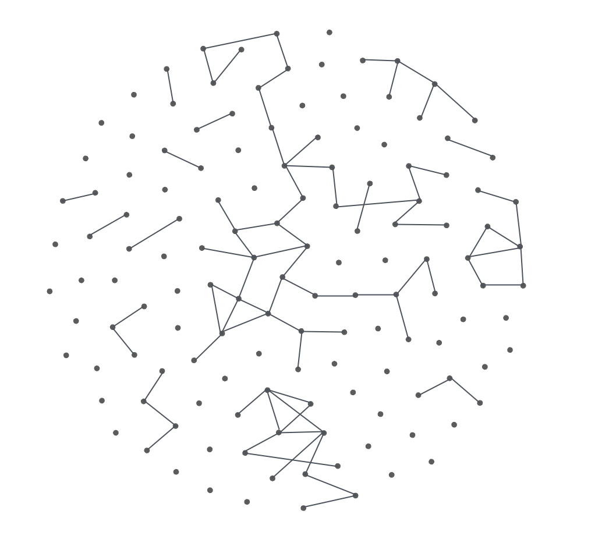

import DataStructureTable from '@site/src/components/DataStructureTable';
import DataStructureHierarchy from '@site/src/components/DataStructureHierarchy';
import DataStructureGraph from '@site/src/components/DataStructureGraph';
import DataStructureLinear from '@site/src/components/DataStructureLinear';
import DataStructureKeyValue from '@site/src/components/DataStructureKeyValue';
import DataStructureStack from '@site/src/components/DataStructureStack.jsx';
import DataStructureQueue from '@site/src/components/DataStructureQueue.jsx';

# Структуры данных

<div class="article-tags">
  <span class="tag tag-required">ОБЯЗАТЕЛЬНО</span>
  <span class="tag tag-beginner">ДЛЯ НОВИЧКОВ</span>
</div>

<span class="complexity-badge">Разработчику</span>
<span class="complexity-badge">Архитектору</span>
<span class="complexity-badge">Инженеру</span>

<div class="callout callout--tip">
  <div class="callout-title">Внимание</div>

  <div class="callout-body">
Приготовьтесь!
Страшные слова	
Структуры, типы данных – это очень важно.
Это фундаментальные знания, которые помогут вам изучать всё в дальнейшем быстрее и эффективнее. Некоторые вещи будут пока не понятны, главное пробегитесь, и возвращайтесь к разделу в дальнейшем, если понадобится.
</div>
  </div>


---

## Структуры данных

<div class="callout callout--tip">
  <div class="callout-title">Маршрут</div>

  <div class="callout-body">
  Обзор здесь → [реализация и алгоритмы на псевдокоде](./2.md#алгоритмический-справочник-псевдокод) → коллекции в [разделе языков](/encyclopedia/3-data-markup/3-02-struktury-dannyh/intro#коллекции-в-разделах-языков).
</div>
  </div>


Данные хранятся в памяти в определённой структуре, они не лежат "кучей".

Ниже — обзор **форм хранения** и **абстрактных типов данных (АТД)**. АТД задаёт *правила* (например, "последним вошёл — первым вышел" у стека), а конкретная структура — *как это сделано в памяти* (массив, связный список, хеш-таблица). Одна и та же идея часто имеет несколько реализаций.

**Карта раздела:** эта статья — введение с примерами из жизни; в [Основные структуры данных и их реализация](./2.md) — реализации, сложность `O(·)`, коллизии, кучи и B-деревья; в [Истории развития](./11.md) — контекст; в [Геометрические структуры](./12.md) — пространственные индексы (R-деревья, ГИС).

| Класс | Примеры | Типичные операции | Когда уместно |
|-------|---------|-------------------|---------------|
| Табличный | SQL, CSV, Excel | фильтр, сортировка, JOIN | много однотипных записей с полями |
| Иерархический | JSON, DOM, папки | обход вглубь/вширь | вложенность, один родитель |
| Линейный | массив, список | доступ по индексу, вставка | упорядоченная последовательность |
| Ассоциативный | словарь, кэш | get/set по ключу | быстрый поиск по идентификатору |
| Графовый | ссылки, зависимости npm | обход, кратчайший путь | произвольные связи между сущностями |
| Файловый (бинарный) | PNG, MP3, EXE | чтение по спецификации | данные для программ/железа, не для глаз |
| АТД поверх линейных | стек, очередь, дек | push/pop, enqueue/dequeue | фиксированный порядок доступа |

В обзоре ниже встретятся:
- **таблицы** и **иерархии (деревья)**;
- **бинарные форматы файлов** (не путать с *двоичными деревьями* — они в [главе про реализацию](./2.md));
- **графы**, **линейные** структуры и модель **"ключ–значение"**;
- отдельно — **стек**, **очередь**, **хеш-таблица**, **кортежи**, **множества**, **матрицы**.

---

### Таблица

**Таблица** представляет собой структурированный набор, где данные в виде строк и столбцов (реляционные БД, Excel, CSV):
	- Вертикально - столбец;
	- Горизонтально - строка.
	- Пересечение столбца и строки — ячейка.

<DataStructureTable />

| № п/п | Имя | Возраст |
| :--- | :---: | ---: |
| 1 | Владимир | 44|
| 2 | Владислав | 35|
| 3 | Жанна | 18|

Здесь "№ п/п", "Имя" и "Возраст" - столбцы, "1", "2", "3" - строки (по столбцу "№ п/п"), "Владимир" - значение ячейки (столбец "Имя", строка "1").

- **Столбец** — вертикальная группа ячеек, объединённых по смыслу. У столбца есть имя (заголовок), определяющее, какую информацию он содержит: *"Дата рождения"*, *"Цена"*, *"Статус"*. Все значения в одном столбце имеют одинаковую природу — например, только даты, только числа, только текст.

- **Строка** — горизонтальная группа ячеек, описывающая один целостный объект или событие. Вся строка — это "карточка": один пользователь, одна покупка, один эксперимент. Порядок строк в таблице обычно не имеет значения — их можно сортировать, фильтровать, переставлять.

- **Ячейка** — одно значение в таблице, принадлежащее конкретной строке и конкретному столбцу. Ячейка — это "точка данных". В ней может быть число, текст, дата, логическое значение (`да`/`нет`), ссылка — но только одно значение за раз. Пустая ячейка означает не "ноль" и не "ложь", а отсутствие информации.

---

#### Пример 1 — Список сотрудников (бизнес-контекст)

| Табельный номер | ФИО          | Подразделение     | Оклад (₽) | Руководитель |
| :-------------- | :----------- | :---------------- | --------: | :----------- |
| 1024            | Ахметова Р.Н.| Отдел аналитики   | 120 000   | Да           |
| 2058            | Беляев К.С.  | Техподдержка      | 75 000    | Нет          |
| 3017            | Волкова М.А. | Отдел аналитики   | 110 000   | Нет          |

- **Столбец** *"Оклад (₽)"* содержит только числа — зарплаты.  
- **Строка** `2058, Беляев К.С., Техподдержка, 75 000, Нет` — полное описание одного сотрудника.  
- **Ячейка** на пересечении строки *Беляев К.С.* и столбца *"Подразделение"* содержит текст *"Техподдержка"*.

Такая таблица позволяет быстро отвечать на вопросы:  
→ *Кто работает в отделе аналитики?* — фильтрация по столбцу.  
→ *Какой оклад у руководителей?* — выборка строк, где *"Руководитель" = "Да"*, и чтение столбца *"Оклад"*.  
→ *Сколько сотрудников?* — подсчёт строк.

---

#### Пример 2 — Журнал температур (научный контекст)

| Дата       | Утро (°C) | День (°C) | Вечер (°C) |
| :--------- | --------: | --------: | ---------: |
| 2025-12-27 |     -12.4 |      -8.1 |      -10.3 |
| 2025-12-28 |     -13.0 |      -7.5 |       -9.8 |
| 2025-12-29 |     -11.7 |      -6.2 |       -8.0 |

- **Столбец** *"День (°C)"* — измерения в одно и то же время суток. Это позволяет сравнивать показатели *внутри столбца* (например, найти самый тёплый день за неделю).  
- **Строка** — полная картина погоды за один день.  
- **Ячейка** *2025-12-28 / Вечер* = *-9.8* — конкретное измерение, зафиксированное в определённый момент.

Таблица здесь служит основой для расчётов: можно посчитать среднюю температуру за день (сумма по строке), или построить график (значения одного столбца во времени).

---

#### Пример 3 — Плейлист (бытовой контекст)

| № | Название трека         | Исполнитель      | Длительность | Жанр       |
| :- | :--------------------- | :--------------- | -----------: | :--------- |
| 1  | Blinding Lights        | The Weeknd       | 3:20         | Synthwave  |
| 2  | Smells Like Teen Spirit| Nirvana          | 5:01         | Grunge     |
| 3  | Levitating             | Dua Lipa         | 3:23         | Pop        |

- **Столбец** *"Жанр"* помогает классифицировать музыку. Он не числовой, но структурирует данные — и это тоже мощный инструмент: по жанру можно группировать, строить подборки, искать похожие треки.  
- **Строка** — описание одной песни как единицы медиатеки.  
- **Ячейка** *"Levitating" / "Длительность"* = *3:23* — атомарная информация, которую можно использовать отдельно (например, при подсчёте общего времени прослушивания).

В программах таблицы реализуются разными способами:

- В **Excel** или **Google Таблицах** — каждая ячейка — объект с форматом, формулой, стилем.  
- В **CSV-файле** — таблица записана как текст: строки разделены символом новой строки (`\n`), ячейки — запятыми. Программа "понимает", что каждая строка — новая запись, каждая запятая — новая колонка.  
- В **реляционных базах данных (PostgreSQL, MySQL)** — таблица — постоянная структура. Её схема задаётся заранее: имена столбцов, их типы (`TEXT`, `INTEGER`, `DATE`), ограничения (`NOT NULL`, `UNIQUE`). Данные хранятся на диске в оптимизированном виде — часто в виде *страничек* (pages), где несколько строк помещаются в один блок памяти для быстрого чтения.


---

### Иерархические структуры

<DataStructureHierarchy />

**Иерархические структуры**, где данные в виде "дерева" (родители и дети), например XML, JSON. Один узел является корневым, а остальные организованы в поддеревья.

```xml
<parent name="Спарда">
  <child name="Данте" />
  <child name="Вергилий" />
</parent>

```

```json
{
  "family": {
    "parent": {
      "name": "Спарда",
      "children": [
        { "name": "Данте" },
        { "name": "Вергилий" }
      ]
    }
  }
}
```

**Дерево** — это абстрактная структура, состоящая из **узлов** и **связей** между ними. Узел — это единица данных с возможными дочерними узлами. Связь всегда идёт от одного узла к другому вниз — от родителя к потомку.

Основные свойства дерева:
- Есть ровно **один корневой узел** — самый верхний, без родителя.  
- У каждого узла, кроме корневого, ровно **один родитель**.  
- Узел может иметь **несколько потомков** (детей), одного или ни одного.  
- Нельзя вернуться к предыдущему узлу, двигаясь по связям — дерево не содержит циклов.

- **Узел (node)** — элемент дерева, содержащий данные и (опционально) ссылки на дочерние узлы. Пример: `{ "name": "Спарда" }`.

- **Корневой узел (root)** — самый первый, верхний узел дерева. Он не имеет родителя. В XML и JSON корневой узел единственный — это требование формата. В файле не может быть два `<parent>` на одном уровне без обёртки.

- **Родитель (parent)** — узел, у которого есть один или несколько дочерних узлов. Например, в `<family><parent><child/></parent></family>` узел `<parent>` — родитель для `<child>`.

- **Дочерний узел / потомок (child / descendant)** — узел, находящийся непосредственно ниже родителя. Если узел `A` → `B` → `C`, то `B` — ребёнок `A`, а `C` — ребёнок `B` и *потомок* `A`.

- **Лист (leaf)** — узел без потомков. Он завершает ветвь. В примере с семьёй — это `<child name="Данте"/>`, если у Данте нет своих детей в структуре.

- **Глубина узла** — расстояние (в шагах) от корневого узла. Корень имеет глубину 0. Его дети — глубину 1. Внуки — глубину 2.

- **Высота дерева** — максимальная глубина среди всех узлов. Определяет, насколько "высоким" получилось дерево.

---

#### Пример 1 — Файловая система

Самая близкая иерархия — это папки и файлы на диске:

```
C:\
└── Users\
    └── Timur\
        ├── Documents\
        │   ├── report.docx
        │   └── budget.xlsx
        ├── Pictures\
        │   └── vacation.jpg
        └── Downloads\
            └── setup.exe
```

- `C:\` — корневой узел.  
- `Users` — дочерний узел для `C:\`.  
- `Timur` — потомок `C:\`, ребёнок `Users`.  
- `report.docx` — лист: у файла нет подпапок.  
- `Documents` — узел с двумя потомками.

Файловые менеджеры отображают дерево в виде "сворачиваемых" папок — это прямая визуализация иерархии.

---

#### Пример 2 — HTML-документ

Любая веб-страница — дерево. Браузер строит **DOM-дерево** (Document Object Model) из HTML:

```html
<html>
  <head>
    <title>Привет</title>
  </head>
  <body>
    <h1>Заголовок</h1>
    <ul>
      <li>Первый</li>
      <li>Второй</li>
    </ul>
  </body>
</html>
```

- `<html>` — корневой узел.  
- `<head>` и `<body>` — его дети.  
- `<title>` — ребёнок `<head>`, лист (внутри только текст).  
- `<ul>` — узел с двумя потомками `<li>`.  
- Каждый `<li>` — лист, если в нём нет вложенных тегов.

Инструменты разработчика в браузере показывают это дерево в интерактивном виде — с возможностью сворачивать и разворачивать ветви.

---

#### Пример 3 — Организационная структура

```
Генеральный директор
├── Руководитель отдела продаж
│   ├── Менеджер по работе с клиентами
│   └── Менеджер по развитию
├── Руководитель отдела разработки
│   ├── Тимлид фронтенда
│   │   ├── Разработчик 1
│   │   └── Разработчик 2
│   └── Тимлид бэкенда
│       ├── Разработчик 3
│       └── Разработчик 4
└── Финансовый директор
```

- Каждый человек — узел.  
- Подчинённость — это связь "родитель → ребёнок".  
- Листья — исполнители без подчинённых.  
- Глубина показывает, сколько уровней управления между сотрудником и гендиректором.

Такие деревья используются в HR-системах, в чатах (типа Slack или Discord — сервер → каналы → темы), в настройках программ (окно настроек → вкладка → секция → параметр).

- В **JSON** дерево задаётся через вложенные объекты и массивы. Объект — узел, его свойства — возможные дочерние узлы, массив — список потомков одного уровня.

- В **XML** каждый открывающий тег — начало узла, закрывающий — его конец. Вложенность тегов = иерархия.

- В **базах данных** (например, PostgreSQL с расширением `ltree`) деревья хранятся с использованием путей: `company.Разработка.frontend.team1`. По такому пути легко найти всех потомков (`company.Разработка.*`) или предков (`*.team1`).

- В коде деревья обрабатываются рекурсивно: функция заходит в узел, выполняет действие, затем вызывает саму себя для каждого потомка. Это естественный способ обхода.


---

### Бинарные файлы и форматы данных

> **Не путать с двоичным деревом.** Здесь речь о **файлах как последовательности байтов** (PNG, EXE, MP3). Иерархические *двоичные деревья поиска*, кучи и B-деревья разобраны в [главе про реализацию](./2.md).

Бинарные (двоичные) **файлы** — это данные в виде байтов "0–255", которые без специальной программы человеку не читаются: исполняемые файлы (.exe, .dll), изображения (.jpg, .png), видео (.mp4), аудио (.mp3). Внутри файла есть заголовки, таблицы, блоки данных, контрольные суммы — всё по строгому шаблону, определённому стандартом или спецификацией.

**Бинарная структура файла** — способ организации данных в виде последовательности байтов для прямой обработки программами или оборудованием. Такие форматы не предназначены для чтения глазами — их "понимают" интерпретаторы, драйверы, кодеки и процессоры.

**Байт** — базовая единица хранения в современных компьютерах. Один байт состоит из 8 бит и может принимать 256 различных значений (от `0` до `255`). Программы читают файл побайтово: первый байт — начало, второй — продолжение, и так далее. Каждый байт имеет смысл только в контексте своей позиции и формата. Например, в текстовом файле байты интерпретируются как символы (по таблице UTF-8 или Windows-1251). В изображении те же числа — координаты пикселей, яркость, сжатые блоки. Контекст задаётся структурой.

Большинство двоичных форматов строятся по единой логике:

| Часть | Назначение | Пример |
|------|-------------|--------|
| **Сигнатура (magic number)** | Несколько байт в начале, однозначно идентифицирующих формат. Позволяет программе понять: "Это PNG, а не ZIP". | PNG: байты `137 80 78 71` → в ASCII: `‰PNG` |
| **Заголовок** | Метаинформация: версия, размеры, параметры кодека, количество кадров, разрешение, битрейт. | В MP3 — частота дискретизации, режим стерео, длительность. |
| **Таблицы и индексы** | Указатели на блоки данных: где начинается кадр, где — следующий сегмент аудио. Без них пришлось бы читать файл целиком, чтобы найти нужное. | В видео MP4 — таблица `moov` содержит временные метки для каждого фрагмента. |
| **Тело (payload)** | Основные данные: пиксели, звуковые семплы, инструкции процессора. Часто сжаты алгоритмами (Deflate, Huffman, DCT). | В JPG — коэффициенты преобразования, описывающие цвет и яркость блоков 8×8. |
| **Хвост / контрольные суммы** | Проверка целостности: CRC, MD5, SHA-1. Позволяет убедиться, что файл не повреждён при передаче. | ZIP-архивы хранят CRC32 для каждого файла внутри. |

---

#### Пример 1 — Файл PNG (изображение)

PNG — наглядный пример сложной, но строгой двоичной структуры.

1. **Сигнатура**: 8 байт `‰ P N G \r \n \x1A \n` — гарантирует, что это PNG, а не случайный бинарник.  
2. **Блоки (chunks)**: весь файл состоит из последовательности *чанков*. Каждый чанк имеет:
   - 4 байта — длина данных,
   - 4 байта — тип чанка (`IHDR`, `IDAT`, `IEND`),
   - *N* байт — полезные данные,
   - 4 байта — контрольная сумма (CRC).

   - `IHDR` — заголовок: ширина, высота, глубина цвета, метод сжатия.  
   - `IDAT` — сжатые пиксельные данные (может быть несколько таких блоков).  
   - `IEND` — маркер конца файла.

Чанки можно читать по одному, пропуская незнакомые — это обеспечивает обратную совместимость. Программа, не знающая про `tEXt` (текстовые комментарии), просто пропустит такой блок и продолжит работу.

> 🔍 Попробуйте: откройте PNG в шестнадцатеричном редакторе (например, HxD). В начале вы увидите `89 50 4E 47 0D 0A 1A 0A` — это и есть сигнатура.

---

#### Пример 2 — Исполняемый файл Windows (.exe)

EXE — двоичная структура для запуска кода на процессоре x86/x64.

- **DOS-заголовок** (старый, для совместимости): 64 байта. В нём, среди прочего, строка `This program cannot be run in DOS mode.` — на случай запуска в устаревшей среде.  
- **PE-заголовок** (Portable Executable): современный формат Microsoft. Содержит:
  - таблицу секций: `.text` (код), `.data` (глобальные переменные), `.rsrc` (иконки, строки),
  - точку входа — адрес, с которого начнёт выполняться программа,
  - список импортируемых библиотек (kernel32.dll, user32.dll и т.д.),
  - таблицу экспорта — функции, доступные другим программам (для DLL).

Процессор не "понимает" файл целиком. Операционная система загружает нужные секции в память, настраивает таблицы, передаёт управление на точку входа — и только тогда начинается выполнение машинных инструкций.

---

#### Пример 3 — Аудиофайл MP3

MP3 — потоковый формат, построенный из *фреймов*.

Каждый фрейм — самостоятельный блок:
- 4 байта — синхронизирующая метка (гарантирует, что декодер не "потеряется"),
- заголовок: битрейт, частота, каналы,
- основные данные: сжатые аудиосэмплы (часто с потерей — psychoacoustic model),
- дополнительные данные: ID3-теги (исполнитель, название, обложка) — обычно в конце или начале файла.

MP3 можно "обрезать" по границам фреймов — и звук останется целым. Именно поэтому программы вроде Audacity или ffmpeg могут быстро резать треки без перекодирования.


---

#### Как программы работают с двоичными структурами?

1. **Чтение по схеме**  
   Программа знает спецификацию формата. Например, "первые 4 байта — длина имени, следующие *N* байт — само имя в UTF-8". Она читает байты, интерпретирует их согласно правилам и строит внутреннее представление.

2. **Сериализация и десериализация**  
   При сохранении объекта в файл — происходит *сериализация*: данные упаковываются в двоичную структуру. При загрузке — *десериализация*: байты распаковываются обратно в объекты в памяти.

3. **Конвертация**  
   Конвертер из JPG в PNG:
   - читает JPG по его структуре (разжимает DCT-блоки → получает пиксели),
   - строит новое изображение в памяти,
   - записывает его в формате PNG (формирует чанки, считает CRC, пишет сигнатуру).


---

### Графовые структуры

**Графовые структуры**, где узлы (объекты) и связи между ними, это просто группа сущностей и их взаимосвязей, используются в рекомендациях, алгоритмах поиска, соцсетях. Здесь суть в сущностях, которые связаны друг с другом – это может быть связь двух таблиц, объектов любой другой структуры - но важно именно наличие связи между такими "сущностями".

<DataStructureGraph />

Это термин из математики (теория графов), закрепившийся в информатике. 

**Граф** — это структура данных, представляющая собой набор вершин (узлов), соединённых рёбрами.

**Рёбра** могут быть направленными (ориентированный граф) или нет.

В графовой структуре "Сущность-линия связи-Сущность", "сущность" соответствует вершине (узлу), а "линия связи" соответствует ребру графа. Каждая сущность связана с другими сущностями через линии связи (рёбра).




Когда объекты устанавливают связи между собой, они ссылаются друг на друга.

Интересный пример можно увидеть в программе Obsidian - статьи (файлы) могут ссылаться друг на друга, и эта связь отображается визуально в виде графов, где видны связи объектов между собой.

---

#### Основные элементы графа

- **Узел (вершина, node / vertex)** — объект, участвующий в системе. Это может быть:  
  - человек в соцсети,  
  - веб-страница,  
  - город на карте,  
  - функция в коде,  
  - документ в базе знаний.  
  Узел может содержать данные: имя, возраст, URL, координаты.

- **Ребро (edge / link)** — связь между двумя узлами. Оно может быть:
  - **ненаправленным** — связь симметрична: *А дружит с Б* ⇔ *Б дружит с А* (соцсеть как Facebook),  
  - **направленным** — связь односторонняя: *А читает Б*, но *Б не читает А* (Twitter, ссылки между веб-страницами).  
  Ребро тоже может нести данные: вес (расстояние, стоимость), тип ("дружба", "цитирование", "зависимость"), временная метка.

- **Путь** — последовательность узлов, соединённых рёбрами.  
  Пример: `Москва → Казань → Екатеринбург` — путь длиной 2 (два ребра).

- **Степень узла** — число рёбер, с которыми узел связан. В **ориентированном** графе различают **исходящую** степень (сколько рёбер *из* узла) и **входящую** (сколько рёбер *в* узел). У крупного аэропорта исходящая степень высока; у "тупика" на конце дороги в ненаправленном графе степень часто равна 1.

Интернет — огромный направленный граф:

- **Узел** — веб-страница (`https://example.com/page1`).  
- **Ребро** — гиперссылка с одной страницы на другую.  
- **Направление** важно: если страница А ссылается на Б, это не значит, что Б ссылается на А.

Поисковая система (например, Google) анализирует этот граф:
- Страницы, на которые ссылаются **много других**, получают высокий "вес" — это сигнал доверия.  
- Алгоритм **PageRank** вычисляет важность узла, исходя из количества и качества входящих рёбер.  
- Чтобы построить индекс, поисковик *обходит граф*, начиная с известных страниц и следуя по ссылкам — как человек, бродящий по Википедии.

Возьмём упрощённую соцсеть:

```text
Алёна → читает → Борис  
Алёна → дружит ↔ Вера  
Борис → упоминает → Вера  
Вера → дружит ↔ Глеб  
Глеб → читает → Алёна
```

Это смешанный граф:  
- "дружит" — ненаправленное ребро (двусторонняя связь),  
- "читает" и "упоминает" — направленные.

Теперь можно задавать вопросы:
- *Кто ближе всех к Алёне?* → Вера (дружба напрямую), Глеб (через Веру).  
- *Кого может заинтересовать пост Бориса?* → Алёну (читает), Веру (упоминает), и косвенно — Глеба (друг Веры).  
- *Есть ли цикл доверия?* → Алёна → Вера ↔ Глеб → Алёна — да, цикл длиной 3.

Системы рекомендаций используют такие графы, чтобы находить:
- "Друзья друзей",  
- "Люди, которые лайкают то же, что и вы",  
- "Группы с плотными внутренними связями" (сообщества).

В проекте на JavaScript:

```json
{
  "dependencies": {
    "react": "^18.0.0",
    "axios": "^1.4.0"
  }
}
```

— это маленький граф:
- Узлы: `мой-проект`, `react`, `axios`, `loose-envify` (зависимость `react`), `follow-redirects` (зависимость `axios`)…  
- Рёбра: `мой-проект → react`, `react → loose-envify`.

Менеджер пакетов (npm, yarn) строит граф зависимостей целиком, чтобы:
- избежать конфликтов версий,  
- не устанавливать одно и то же дважды,  
- знать, в каком порядке запускать сборку.

Если в графе появляется цикл (`A → B → C → A`) — это ошибка: сборка зависнет. Система её обнаруживает и сообщает.

---

#### Как графы хранятся в памяти?

Есть два основных способа:

1. **Список смежности**  
   Для каждого узла хранится список его соседей.  
   Пример (на JavaScript-подобном синтаксисе):

   ```javascript
   graph = {
     "Москва": ["Санкт-Петербург", "Казань", "Нижний Новгород"],
     "Казань": ["Москва", "Екатеринбург"],
     "Екатеринбург": ["Казань", "Челябинск"]
   }
   ```

   Плюсы: экономия памяти (особенно когда рёбер мало), легко перебирать соседей.  
   Используется в большинстве реальных систем: соцсетях, маршрутизаторах, графовых БД.

2. **Матрица смежности**  
   Таблица `N × N`, где `N` — число узлов. Ячейка `[i][j]` = 1, если есть ребро от узла `i` к узлу `j`, иначе 0 (или вес ребра).

   |            | Москва | Казань | Екб |
   |-----------|:------:|:------:|:---:|
   | **Москва** |   0    |   1    |  0  |
   | **Казань** |   1    |   0    |  1  |
   | **Екб**    |   0    |   1    |  0  |

   Плюсы: мгновенная проверка наличия ребра (`O(1)`), удобно для алгоритмов на плотных графах.  
   Минус: много пустых ячеек, если узлов много, а рёбер мало.

---

### Линейные структуры

**Линейные структуры**, где данные идут "один за другим", в последовательности – это массивы (список – `[1, 2, 3]`).

<DataStructureLinear />

**Массив** – структура данных, представляющая собой упорядоченную коллекцию элементов (часто одного типа). В классическом варианте элементы лежат в памяти подряд, и адрес `i`-го можно вычислить по формуле — доступ по индексу за **O(1)**. Примеры:

```javascript
const words = ["Один", "Два", "Три"]; // массив строк
const numbers = [1, 2, 3];             // массив чисел
```

Каждый элемент имеет **индекс**; нумерация с **0**: `numbers[0] === 1`, `words[0] === "Один"`. Через индекс читают и меняют значение без перебора всего списка. Удобно, когда нужен, например, список имён:

```javascript
const names = ["Роуч", "Соуп", "Гоуст", "Прайс"];
```

Представьте книжную полку, где ячейки пронумерованы: 0, 1, 2, 3…  
- Полка в комнате — **адрес начала массива** в памяти (например, `0x1000`).  
- Каждая книга — **элемент**. Одинаковый "формат" книг — аналогия *одному типу данных*.  
- **Третья** книга — индекс **2** (не 3): адрес `0x1000 + 2 × размер_элемента`. Это **доступ по индексу** за фиксированное время.

Вот как выглядит массив в памяти (условно, по 4 байта на число):

| Адрес       | 0x1000 | 0x1004 | 0x1008 | 0x100C |
|-------------|:------:|:------:|:------:|:------:|
| Значение    |   10   |   20   |   30   |   40   |
| Индекс      |   0    |   1    |   2    |   3    |

`массив[2]` → адрес `0x1000 + 2 × 4 = 0x1008` → значение `30`.

---

##### Свойства массива

- **Фиксированный размер** (в классическом виде). При создании указывается, сколько элементов поместится.  
- **Быстрый доступ по индексу** — мгновенно, за одно действие.  
- **Медленное добавление/удаление в середине** — если вставить элемент между 1 и 2, придётся сдвинуть все последующие.  
- **Плотное хранение** — никаких "пустот" между элементами, минимум накладных расходов.


Массивы используются, к примеру, для обработки данных в научных вычислениях или хранения списков каких-то позиций, допустим, товаров.

**Связный список (Linked List)** — это линейная структура данных, где каждый элемент (узел) содержит данные и ссылку на следующий узел.

Представьте череду людей, стоящих в тёмной комнате, каждый держит записку с именем следующего:
- Первый знает, кто второй,  
- Второй — кто третий,  
- Последний держит записку `null` — "дальше никого".

- Чтобы добраться до третьего элемента, нужно пройти через первый и второй — **последовательный обход**.  
- Зато вставить новый узел между первым и вторым легко:  
  1. Создать новый узел (`"Новый"`),  
  2. В его `следующий` записать адрес второго,  
  3. В `следующий` первого записать адрес нового.  
  Сдвигать ничего не нужно — только переписать две ссылки.

| Тип | Описание | Где используется |
|-----|----------|------------------|
| **Односвязный** | Каждый узел ссылается только на следующий. | Простые очереди, стеки, потоки данных. |
| **Двусвязный** | Узел содержит ссылки *и на следующий, и на предыдущий*. | История браузера ("назад/вперёд"), редакторы текста (перемещение по строкам). |
| **Кольцевой** | Последний узел ссылается на первый. | Планировщики задач (циклическое распределение времени), музыкальные плейлисты в режиме "повтор". |


Минимальный односвязный список в коде (идея, не стандартная библиотека):

```javascript
// узел: значение + ссылка на следующий
const head = {
  value: "первый",
  next: {
    value: "второй",
    next: { value: "третий", next: null }
  }
};

// обход: идём по next, пока не null
let node = head;
while (node) {
  console.log(node.value);
  node = node.next;
}
```

В Python для очереди/FIFO на практике чаще `collections.deque`, а не "ручной" список — см. [реализацию очереди](./2.md#32-очередь-fifo--first-in-first-out).

---

### Ключ-значение

**Ключ-значение**, где есть слово (ключ) и его определение (значение), как в словаре – используется в NoSQL-базах данных, допустим для кэширования;

```javascript
const user = { имя: "Скарлетт" };
```

Эта модель отражает естественные способы поиска:  
→ *"Какой телефон у Скарлетт?"* — ключ = *"Скарлетт"*, значение = *"+7 999…"*  
→ *"Какой порт у HTTP?"* — ключ = *"http"*, значение = *80*  
→ *"Какой цвет фона?"* — ключ = *"background-color"*, значение = *"#f0f0f0"*

<DataStructureKeyValue />

**Ключ** — это уникальный идентификатор, по которому можно найти значение.  
- Ключ должен быть **однозначным**: два разных значения не могут иметь один и тот же ключ в одной структуре.  
- Ключ часто бывает строкой (`"имя"`, `"email"`), но может быть числом (`1001` — ID пользователя), хешем, UUID, даже кортежем (в некоторых языках).  
- Ключ не меняется после добавления — иначе связь с значением нарушится.

**Значение** — это данные, привязанные к ключу.  
- Значение может быть любого типа: строка, число, булево, массив, другой словарь, даже функция (в языках с поддержкой первого класса функций).  
- Значение можно менять — при этом ключ остаётся прежним.  
- Значение не обязано быть уникальным: разные ключи могут указывать на одно и то же значение.


- **Пара** — минимальная единица: один ключ + одно значение. Пример: `["порт", 80]`.  
- **Словарь (dictionary, map)** — коллекция пар "ключ-значение" как **интерфейс**: `get`, `set`, уникальность ключей. В JavaScript `Object` и `Map`, в Python `dict`, в Java `HashMap` — это уже **реализации**; чаще всего под капотом — **хеш-таблица** (см. следующий раздел).

```javascript
const config = {
  "host": "api.example.com",
  "port": 443,
  "ssl": true,
  "timeout": 5000,
  "headers": {
    "Content-Type": "application/json",
    "Authorization": "Bearer xyz"
  }
};
```

Здесь:
- `"host"` — ключ, `"api.example.com"` — значение (строка),  
- `"headers"` — ключ, его значение — *другой словарь*,  
- `"port"` → `443` — ключ-строка, значение-число.


---

#### Пример 1 — Настройки приложения

Любая программа хранит параметры в виде ключ-значение:

| Ключ | Значение | Тип |
|------|----------|-----|
| `theme` | `"dark"` | строка |
| `autoSave` | `true` | булево |
| `fontSize` | `14` | число |
| `recentFiles` | `["отчёт.docx", "бюджет.xlsx"]` | массив строк |

Такой формат удобен:
- добавить новый параметр — просто новая пара,  
- прочитать настройку — `config["theme"]`,  
- сохранить в файл — легко сериализовать в JSON или INI.

---

#### Пример 2 — Кэш в веб-сервере

Сервер кэширует результаты тяжёлых операций:

```text
Ключ: "user:1001:profile"          → Значение: { "name": "Скарлетт", "role": "admin" }
Ключ: "product:777:details"        → Значение: { "title": "Ноутбук XYZ", "price": 99900 }
Ключ: "page:/about"                → Значение: "<html>…</html>"
```

Когда приходит новый запрос:
1. Сервер формирует ключ из URL, параметров, прав пользователя.  
2. Ищет его в кэше.  
3. Если есть — отдаёт значение мгновенно, без обращения к базе.  
4. Если нет — выполняет запрос, сохраняет результат под этим ключом.

Ключ здесь — *точный адрес данных в кэше*. Значение — *готовый ответ*.

---

#### Пример 3 — NoSQL-базы (Redis, DynamoDB, etcd)

В таких системах вся база — большой распределённый словарь.

**Redis** (in-memory store):
```bash
> SET user:1001:name "Скарлетт"
> SET user:1001:email "scarlett@example.com"
> GET user:1001:name
"Скарлетт"
```

Ключ `user:1001:name` построен по шаблону: `сущность:id:поле`. Это позволяет:
- группировать данные по префиксу (`user:1001:*`),  
- быстро находить по полному пути,  
- избегать коллизий (другая сущность — другой префикс: `session:abc123`).

---

Словари почти всегда реализованы на основе **хеш-таблиц** (см. отдельный раздел), но для пользователя это не важно — интерфейс остаётся простым: *положи по ключу*, *достань по ключу*.

Внутри может происходить:
- преобразование ключа в хеш (число),  
- выбор "ящика" (bucket) по хешу,  
- разрешение коллизий (если два ключа попали в один ящик),  
- рост таблицы при заполнении.

Но пользователь видит только:
```javascript
dict["ключ"] = "значение";
console.log(dict["ключ"]); // → "значение"
```


---

#### Имена в разных языках

Словари называются по-разному, но суть едина:

| Язык | Тип / Конструкция | Пример |
|------|-------------------|--------|
| JavaScript | `Object`, `Map` | `let d = { key: "value" }` |
| Python | `dict` | `d = {"key": "value"}` |
| Java | `HashMap`, `TreeMap` | `Map<String, String> d = new HashMap<>()` |
| C# | `Dictionary<TKey, TValue>` | `var d = new Dictionary<string, string>()` |
| Go | `map` | `d := map[string]string{"key": "value"}` |
| Rust | `HashMap` | `let mut d = HashMap::new(); d.insert("key", "value");` |

Во всех случаях:  
→ добавление — `set(key, value)` или `d[key] = value`,  
→ получение — `get(key)` или `d[key]`,  
→ проверка наличия — `has(key)`, `containsKey(key)` и т.п.

---

### Хеш-таблицы

**Хеш-таблица** — типичная **реализация** словаря: пары "ключ–значение" кладут в массив *бакетов*, а номер бакета получают из **хеш-функции** `h(ключ)`. Снаружи вы по-прежнему пишете `dict["age"]`, внутри — вычисление хеша и поиск в бакете.

<div class="callout callout--tip">
  <div class="callout-title">Сложность</div>

  <div class="callout-body">
  В среднем вставка, поиск и удаление — <strong>O(1)</strong>, если таблица не переполнена и хеш распределяет ключи равномерно. В худшем случае (много коллизий в одном бакете) — <strong>O(n)</strong>. Подробнее о цепочках и открытой адресации — в <a href="./2.md#4-хеш-таблицы">главе про реализацию</a>.
</div>
  </div>


Пример записи, как у обычного объекта:

```javascript
const friend = { name: "Иван", age: 30, city: "Москва" };
```

Упрощённо для ключа `"name"`:
1. `h("name")` → число, например `98765`;
2. `индекс = 98765 % число_бакетов` → ячейка массива;
3. в бакете хранится пара `("name", "Иван")`. При коллизии (другой ключ попал в тот же индекс) в бакет кладут вторую пару — **цепочкой** или ищут следующую ячейку (**открытая адресация**).

То есть, хеш-таблица принципиально отличается от обычной таблицы, однако, если её представить в вертикальном порядке, это становится уже более понятным для человеческого представления:

| Ключ (Key) | Значение (Value) |
| :--- | :---: |
|name	|Иван
|age	|30
|city	|Москва

Так, система получает команду взять Value для Key="age" и результат будет 30.

Хеш-таблицы используются в базах данных (индексация записей), для кэширования (NoSQL). В отличие от массивов, где доступ идёт по индексу, в хеш-таблице доступ только по ключу. Можно представить, что массив – это своего рода хеш-таблица, где первая строка (ключ) это индекс массива:

| Индекс | Элемент |
| :--- | :--- |
| 0 | Один |
| 1 | Два |
| 2 | Три |
| 3 | Четыре |
| 4 | Пять |

---

#### Как устроена хеш-таблица

##### 1. Уровень пользователя  

Вы пишете:
```javascript
cache["user:1001"] = { name: "Иван", city: "Москва" };
console.log(cache["user:1001"].name); // → "Иван"
```
Вам не нужно знать, как это работает — только **ключ** и **значение**.

---

##### 2. Уровень логики  

Происходит следующее:
1. Берётся ключ (`"user:1001"`).  
2. Применяется **хеш-функция** — детерминированный алгоритм, преобразующий любые данные в **целое число фиксированной длины**.  
   - Для одного и того же ключа хеш всегда одинаков.  
   - Малое изменение ключа даёт сильно отличающийся хеш ("лавинный эффект").  
3. Полученное число приводится к размеру таблицы:  
   `индекс = хеш % количество_бакетов`.  
4. Значение сохраняется в бакете под этим индексом.

---

##### 3. Уровень памяти  

Представьте себе почтовое отделение:

| Бакет № | Содержимое |
|:-------:|------------|
| 0 | пусто |
| 1 | `["user:1001", { name: "Иван", … }]` |
| 2 | `["session:abc", { expires: "…" }]` |
| 3 | пусто |
| 4 | `["config:theme", "dark"]` |

- **Бакет** — ячейка в массиве.  
- Внутри бакета — одна или несколько пар "ключ–значение" (если произошла *коллизия* — см. ниже).  
- Чтобы прочитать `cache["user:1001"]`, система:  
  → вычисляет хеш ключа,  
  → находит номер бакета,  
  → просматривает содержимое бакета,  
  → находит пару с нужным ключом,  
  → возвращает значение.

---

#### Что такое хеш-функция

Хеш-функция — это "переводчик имен в номера". Она не шифрует и не сжимает — она **надёжно распределяет** ключи по бакетам.

Представьте библиотеку по системе Дьюи:
- Книга *"Алгоритмы"* → классификационный номер `005.1`,  
- *"Кулинария"* → `641.5`,  
- *"Астрономия"* → `520`.

Номер несёт смысл, но главное — он **уникален для категории** и позволяет быстро найти полку.

В компьютере хеш-функция делает то же, но быстрее и без семантики:
- `"name"` → `98765`  
- `"age"`  → `23412`  
- `"city"` → `87654`

Даже длинный ключ (`"very-long-session-id-xyz-2025"`) превращается в компактное число — за микросекунды.

Популярные хеш-функции:  
- **MurmurHash** — быстрая, хорошее распределение, используется в Redis, Cassandra.  
- **FNV-1a** — простая, эффективная для небольших ключей.  
- **SipHash** — защищённая от атак (например, в Python, Rust), предотвращает намеренные коллизии.

Коллизия — ситуация, когда два разных ключа получают один и тот же индекс бакета. Это не ошибка — это неизбежность: число возможных ключей бесконечно, а бакетов — конечно.

---

##### Как разрешают коллизии

1. **Цепочки (chaining)**  
   Каждый бакет — это связный список (или массив) пар.  
   Пример:
   ```text
   Бакет 3:
     → ["port", 80]
     → ["sport", 443]   ← коллизия: оба ключа дали индекс 3
   ```
   При поиске `"sport"` система проверяет все пары в бакете 3, пока не найдёт совпадение по ключу.

   Плюсы: простота, устойчивость к переполнению.  
   Минусы: при большом числе пар в одном бакете поиск замедляется.

2. **Открытая адресация (open addressing)**  
   Если бакет занят, система ищет *следующий свободный* по определённому правилу (линейный шаг, квадратичный, двойное хеширование).  
   Пример: хотим положить в бакет 3, но он занят → пробуем 4 → свободен → кладём туда.

   Плюсы: данные хранятся плотно, меньше накладных расходов.  
   Минусы: удаление сложнее, при высокой загрузке таблицы производительность падает резко.

Большинство реализаций (Java `HashMap`, Python `dict`, JavaScript `Map`) используют **цепочки** на начальном этапе, а при росте таблицы переключаются на более сложные схемы (например, деревья внутри бакетов — в Java при 8+ элементах).

---

#### Где применяются хеш-таблицы?

| Контекст | Роль хеш-таблицы |
|---------|------------------|
| **Кэширование** | Быстрое хранение и извлечение результатов: `ключ = параметры запроса`, `значение = ответ`. |
| **Индексация в базах данных** | Первичные и вторичные индексы часто строятся на хеш-таблицах (для точных совпадений: `WHERE id = 1001`). |
| **Поиск переменных** | В интерпретаторах: таблица имён → значение и тип переменной. |
| **Удаление дубликатов** | Множества (`Set`) реализуются через хеш-таблицу, где значение — `true` или `null`. |
| **Разбор JSON/XML** | При создании объекта из текста — ключи полей складываются в хеш-таблицу. |
| **Фильтрация спама** | Блум-фильтры — вероятностная структура, частично основанная на хешировании. |


Кроме этого, можно отметить также такие виды структуры данных, которые могут быть реализованы на массивах или связных списках, но часто выделяются как отдельные — это стек и очередь.

---

### Сетевые структуры

**Сетевые структуры** – данные связаны сложной "паутиной" (отсюда и название Web): микросервисы, HTML-страница со стилями, скриптами и картинками. Формально это **граф** (узлы и рёбра), но на практике добавляют сеть как отдельный слой: узлы на разных машинах, задержки, протоколы, очереди сообщений — то, чего нет у "графа в памяти" одной программы.

Сетевая структура — это распределённая система из автономных узлов, соединённых каналами связи и взаимодействующих по заранее определённым правилам. Узлы могут находиться на разных устройствах, в разных дата-центрах, даже в разных странах. Связи между ними — не просто логические рёбра, а физические или логические каналы передачи данных: сетевые соединения, API-вызовы, сообщения в очереди.

| Узел | Роль | Как подключается |
|------|------|------------------|
| HTML-документ | Корень — описывает структуру | Загружается первым по HTTP |
| CSS-файлы | Стилизация | `<link rel="stylesheet" href="…">` |
| JavaScript-скрипты | Поведение | `<script src="…"></script>` |
| Изображения | Контент | `` |
| Шрифты | Отображение текста | `@font-face { src: url(…) }` |
| API-эндпоинты | Данные (пользователи, товары) | `fetch("/api/users")` |

Браузер:
1. Запрашивает HTML.  
2. Парсит его и обнаруживает ссылки на другие ресурсы.  
3. Открывает *множество параллельных соединений* к разным узлам (даже на разные домены — CDN, аналитика, шрифты Google).  
4. Собирает всё в единое дерево (DOM + CSSOM → Render Tree).

Это сеть: узлы независимы, связи асинхронны, порядок загрузки влияет на UX, сбои (404, CORS) обрабатываются явно.

Современное приложение — это сеть сервисов:

```
[Веб-интерфейс]  
       ↓ (HTTP)  
[Сервис авторизации] ←→ [Сервис пользователей]  
       ↓ (gRPC)  
[Сервис заказов] → [Сервис оплаты]  
       ↓ (AMQP)  
[Сервис уведомлений] → [Email-провайдер]  
                      → [Push-шлюз]
```

Особенности:
- Каждый сервис — отдельная программа, развёрнутая в контейнере (Docker).  
- Связи — не вызовы функций, а сетевые запросы (даже если сервисы на одном сервере).  
- Данные не делятся напрямую — только через API или очереди сообщений.  
- Сервис может масштабироваться независимо: если "оплата" тормозит — добавляют её копии, остальное не трогают.

Такая сеть обладает *эластичностью*: нагрузка перераспределяется, сбои локализуются, обновления — по одному сервису.

Системы вроде Cassandra, CockroachDB, YugabyteDB строятся как сеть узлов:

- Данные **фрагментируются** (sharding): часть записей — на узле A, часть — на B, часть — на C.  
- Каждый фрагмент **реплицируется**: копии хранятся на нескольких узлах для отказоустойчивости.  
- Запрос проходит через *координатор* — узел, который знает, где лежат нужные данные, собирает ответы, обрабатывает конфликты.

Пользователь видит одну базу. На самом деле — это сеть, где:
- узел может выйти из строя — данные не потеряются,  
- трафик перенаправляется автоматически,  
- географически распределённые кластера снижают задержки для пользователей.

---

### Стек

**Стек** — это **АТД** (абстрактный тип данных): задаёт правило **LIFO** (Last-In, First-Out) — последний добавленный уходит первым. Реализовать стек можно на **массиве** (быстро, компактно) или на **связном списке** (без сдвигов при росте) — см. [раздел про стек](./2.md#31-стек-lifo--last-in-first-out).

Стек начинается пустым: `push` кладёт элемент на вершину, `pop` снимает с вершины.


Стек поддерживает две основные операции:  
- **push** — положить элемент на вершину,  
- **pop** — снять элемент с вершины и вернуть его.

<DataStructureStack />

Стек начинается пустым. После серии `push(1)`, `push(2)`, `push(3)` он выглядит как стопка тарелок:  
```
[3] ← вершина  
[2]  
[1] ← дно
```  
Вызов `pop()` вернёт `3`, затем `2`, затем `1`.

Стек может быть реализован двумя способами:

1. **На массиве с указателем вершины**  
   - Выделяется блок памяти фиксированного или динамического размера.  
   - Переменная `top` хранит индекс последнего занятого элемента.  
   - `push(x)`: `top += 1`; `массив[top] = x`  
   - `pop()`: `x = массив[top]`; `top -= 1`; вернуть `x`  

   Плюсы: высокая локальность данных (элементы рядом в памяти), быстрый доступ.  
   Минусы: при переполнении требуется выделить новый массив и скопировать данные.

2. **На связном списке**  
   - Каждый элемент — узел с данными и ссылкой на предыдущий.  
   - Вершина стека — это указатель на *последний добавленный узел*.  
   - `push(x)`: создать узел, его `next` = текущая вершина, вершина = новый узел.  
   - `pop()`: сохранить данные вершины, вершина = вершина.next, вернуть данные.

   Плюсы: динамический размер, нет перераспределения памяти.  
   Минусы: больше накладных расходов (ссылки), хуже кэш-локальность.

В реальных системах чаще используется **массивный стек** — из-за скорости и предсказуемости.

Когда программа вызывает функции, операционная система и процессор используют **аппаратный стек** — область памяти, управляемая регистром `RSP` (x86/x64) или `SP` (ARM).

Пусть код:
```javascript
function main() {
  a();
}
function a() {
  b();
}
function b() {
  console.log("стек полон");
}
```

При выполнении:
1. `main()` вызывается → в стек кладётся *фрейм вызова*: адрес возврата, локальные переменные (если есть).  
2. `a()` вызывается → новый фрейм поверх предыдущего.  
3. `b()` вызывается → ещё один фрейм.  
4. `b()` завершается → `pop()` — управление возвращается в `a()`.  
5. `a()` завершается → `pop()` — управление в `main()`.  
6. `main()` завершается → стек пуст.

Стек вызовов — фундамент рекурсии. Каждый рекурсивный вызов добавляет фрейм. Глубокая рекурсия → переполнение стека (*stack overflow*).

> 💡 В инструментах разработчика (Chrome DevTools, VS Code) стек вызовов отображается при остановке на точке останова — это буквально снимок текущего состояния стека.


Стек позволяет вычислять выражения без скобок, используя **обратную польскую запись (RPN)**.

Выражение `3 + 4 * 2` в RPN: `3 4 2 * +`

Алгоритм:
1. Читаем токен слева направо.  
2. Если число — `push` в стек.  
3. Если оператор — `pop()` два числа, применить операцию, `push` результат.

Пошагово:
- `3` → стек: `[3]`  
- `4` → стек: `[3, 4]`  
- `2` → стек: `[3, 4, 2]`  
- `*` → pop: 2 и 4 → 4 * 2 = 8 → push 8 → стек: `[3, 8]`  
- `+` → pop: 8 и 3 → 3 + 8 = 11 → push 11 → стек: `[11]`

Результат — вершина стека.

Так работают многие калькуляторы (включая инженерные), а также компиляторы при генерации кода для виртуальных машин (например, JVM, CPython bytecode).

В текстовых редакторах, графических программах, IDE:

- При изменении (ввод символа, вырезание фрагмента) создаётся *команда отмены* и кладётся в стек.  
- `Ctrl+Z` → `pop()` → выполнить команду отмены (например, вставить удалённый текст на место).  
- `Ctrl+Y` (повтор) — может использовать второй стек или флаг в команде.

Стек обеспечивает правильный порядок: последнее действие отменяется первым.

---

#### Пример 4 — Парсинг вложенных структур

Проверка корректности скобок: `{ [ ( ) ] }` — валидно, `{ [ } ]` — нет.

Алгоритм:
- Открывающая скобка (`{`, `[`, `(`) → `push` в стек.  
- Закрывающая (`}`, `]`, `)`) → `pop()`, проверить соответствие типа.  
- В конце стек должен быть пуст.

Пошагово для `{ [ ( ) ] }`:
1. `{` → стек: `["{"]`  
2. `[` → стек: `["{", "["]`  
3. `(` → стек: `["{", "[", "("]`  
4. `)` → pop `"("` → совпадает → стек: `["{", "["]`  
5. `]` → pop `"["` → совпадает → стек: `["{"]`  
6. `}` → pop `"{"` → совпадает → стек: `[]` → валидно.

Такие стеки используются в:
- компиляторах (проверка блоков `{}`),  
- XML/JSON-парсерах (отслеживание вложенности тегов),  
- маршрутизаторах (обработка вложенных протоколов: Ethernet → IP → TCP → HTTP).

---

### Очередь

Очередь — это структура данных, работающая по принципу FIFO (First-In, First-Out): первый добавленный элемент будет первым удалённым. Это именно та очередь, которая знакома нам в жизни, но только здесь нет наглецов, которым "просто спросить".


Все операции происходят на двух концах:  
- **enqueue** (или *push*) — добавление элемента в **хвост**,  
- **dequeue** (или *pop*) — извлечение элемента из **головы**.

<DataStructureQueue />

Очередь начинается пустой. После серии `enqueue(A)`, `enqueue(B)`, `enqueue(C)` она выглядит так:  
```
Голова → [A] → [B] → [C] ← Хвост
```  
Вызов `dequeue()` вернёт `A`, затем `B`, затем `C`.

Существует два основных способа реализации.

---

##### 1. На связном списке

- Голова — указатель на первый узел.  
- Хвост — указатель на последний узел.  
- `enqueue(x)`: создать узел, хвост.next = новый узел, хвост = новый узел.  
- `dequeue()`: сохранить данные головы, голова = голова.next, вернуть данные.

Плюсы:  
- вставка и извлечение за фиксированное время,  
- динамический размер,  
- нет сдвига элементов.

Минусы:  
- накладные расходы на хранение ссылок,  
- узлы разбросаны в памяти → хуже кэш-локальность.

Используется там, где важна стабильная производительность при частых операциях: диспетчеры задач, потоки сообщений.

---

##### 2. На циклическом массиве (кольцевой буфер)

Массив фиксированного размера, в котором голова и хвост "ходят по кругу".

Пусть массив длиной 4: `[_, _, _, _]`, индексы 0–3.  
- `head = 0`, `tail = 0` — очередь пуста.  
- `enqueue(A)`: `массив[tail] = A`; `tail = (tail + 1) % 4` → `tail = 1`.  
- `enqueue(B)`: `массив[1] = B`; `tail = 2`.  
- `dequeue()`: `x = массив[head]`; `head = (head + 1) % 4` → `head = 1`; вернуть `x`.

Когда `tail` доходит до конца — он возвращается к началу, если там свободно (голова уже ушла вперёд).

Плюсы:  
- плотное хранение,  
- отличная кэш-локальность,  
- предсказуемое поведение.

Минусы:  
- ограниченный размер (если не предусмотрено динамическое расширение),  
- сложнее логика при полной/пустой очереди (обычно резервируют одну ячейку или хранят отдельный флаг).

Циклические буферы применяются в драйверах устройств, аудиосистемах, сетевых стеках — где критична скорость и предсказуемость.

ОС управляет множеством процессов, но процессор может выполнять один (или несколько на ядро) за раз. Очередь готовых процессов — FIFO-структура:

1. Процесс поступает в систему → `enqueue` в очередь.  
2. Планировщик выбирает первый процесс из головы → `dequeue`, передаёт ему CPU.  
3. Если процесс не завершился за выделённое время (квант), он возвращается в хвост очереди → новый цикл.

Так обеспечивается **честное распределение времени** между всеми задачами — от системных служб до браузера.

> 💡 Современные ОС используют *многоуровневые очереди* и *динамический приоритет*, но базовый цикл обработки остаётся FIFO на каждом уровне.

В распределённых системах сервисы обмениваются сообщениями через брокеры: RabbitMQ, Kafka, Redis Streams.

- Сервис A → `enqueue("заказ создан", user_id=1001)` → очередь.  
- Сервис B, C, D — подписчики: каждый `dequeue()` сообщение и обрабатывает по своему сценарию:  
  - B: отправить email,  
  - C: обновить статистику,  
  - D: зарезервировать товар.

Очередь гарантирует:  
- сообщение не потеряется (даже при падении получателя — оно останется в очереди),  
- обработка в порядке поступления,  
- декуплинг: отправитель не ждёт ответа, система масштабируется независимо.

Когда вы печатаете в терминале:
- Каждое нажатие клавиши → `enqueue` символа в буфер ввода.  
- Программа (например, `cat`) читает по одному символу → `dequeue`.  
- Если программа медленная, буфер накапливает символы — вы продолжаете печатать, ничего не теряется.

Аналогично в аудиосистемах:  
- Декодер MP3 выдаёт семплы → `enqueue` в аудиобуфер.  
- Звуковая карта забирает семплы → `dequeue` с фиксированной частотой (44.1 кГц).  
- Циклический буфер обеспечивает плавное воспроизведение без "щелчков".

При обходе графа или дерева в ширину очередь управляет порядком посещения узлов.

Алгоритм:
1. Поместить стартовый узел в очередь.  
2. Пока очередь не пуста:  
   - `dequeue()` узел,  
   - обработать его,  
   - `enqueue()` всех его непосещённых соседей.

Для дерева:
```
        A
       / \
      B   C
     /   / \
    D   E   F
```

Очередь:
- `[A]`  
- dequeue A → enqueue B, C → `[B, C]`  
- dequeue B → enqueue D → `[C, D]`  
- dequeue C → enqueue E, F → `[D, E, F]`  
- dequeue D → …  

Результат: обход в порядке уровней — A, B, C, D, E, F.  
Используется в:  
- картах (поиск кратчайшего пути без весов),  
- соцсетях ("друзья друзей"),  
- парсерах (обработка токенов по уровням вложенности).

---

#### Варианты очередей

| Тип | Описание | Где применяется |
|-----|----------|-----------------|
| **Очередь с приоритетом (Priority Queue)** | Элемент с наивысшим приоритетом извлекается первым (не по времени, а по важности). Часто реализуется через *кучу* (heap). | Планировщики задач с приоритетами, алгоритм Дейкстры, срочные уведомления. |
| **Двусторонняя очередь (Deque)** | Добавление и извлечение возможны с обоих концов. | Отмена/повтор (undo/redo), скользящее окно в алгоритмах, реализация стека и очереди в одном интерфейсе. |
| **Очередь с ограниченной длиной** | При переполнении старейший элемент автоматически удаляется. | Логирование последних N событий, кэширование последних запросов, буферы видеопотока. |


---

### Кортежи

Кортеж — это упорядоченная коллекция элементов, в которой количество и типы позиций фиксированы. Кортеж напоминает массив, но с важным отличием: после создания он не изменяется — в него нельзя добавить, удалить или заменить элемент без создания нового кортежа.

Кортеж объединяет разнородные данные в одну логическую сущность, где **порядок позиций несёт смысл**. Это не просто контейнер — это *контракт*: "позиция 0 — всегда X, позиция 1 — всегда Y".

Кортежи часто применяются, когда нужно сгруппировать несколько значений разного типа в одну логическую единицу. Например, координаты на карте — это пара чисел: *широта* и *долгота*. Или описание человека — имя (строка), возраст (число), статус подписки (булево значение).

```javascript
const coordinates = [55.7558, 37.6176]; // [широта, долгота] — по соглашению
const userStatus = ["Алёна", 28, true];  // [имя, возраст, активна_подписка]
```

В JavaScript отдельного типа "кортеж" нет: фиксированную длину и типы задают **соглашение** или **TypeScript** (`type Point = [number, number]`). В **Python** кортеж — тип `tuple`, неизменяемый после создания.

В некоторых языках (например, Python или TypeScript) кортежи имеют строгую сигнатуру — порядок и тип значений определяются заранее, и система проверяет их при использовании. Это повышает надёжность кода: если функция ожидает кортеж `[string, number]`, передача `[123, "Имя"]` будет отклонена.

Кортежи встречаются в:
- возвращаемых значениях функций, когда нужно вернуть сразу несколько результатов;  
- параметрах API, где порядок аргументов строго задан (например, `[x, y, z]` в 3D-графике);  
- конфигурационных парах, где важна неизменность: `[порт, хост]`, `[путь, режим]`.

> 💡 **Полезная аналогия**: кортеж — как паспорт. Там строго определены поля: серия, номер, ФИО, дата рождения. Порядок важен, содержимое не меняется после выдачи — только замена паспорта целиком.

Сигнатура — это описание структуры кортежа: сколько элементов и какого типа каждый.

Примеры сигнатур:
- `(string, number)` — имя и возраст,  
- `(number, number, number)` — RGB-цвет,  
- `(string, string, boolean)` — логин, токен, флаг активности,  
- `(string, number, number, number)` — название города, широта, долгота, высота над уровнем моря.

В языках со статической типизацией сигнатура проверяется на этапе компиляции:
```typescript
// TypeScript
function getLocation(): [string, number, number] {
  return ["Москва", 55.7558, 37.6176]; // ✅ корректно
  // return ["Москва", "55.7558", 37.6176]; // ❌ ошибка: ожидается number, получена string
}
```

В динамических языках сигнатура поддерживается соглашениями и документацией — но нарушение приводит к ошибкам в runtime.

---

#### Основные свойства кортежа

| Свойство | Пояснение | Пример |
|---------|-----------|--------|
| **Фиксированная длина** | Количество элементов известно заранее и не меняется. | Координаты — всегда 2 числа (2D) или 3 (3D). |
| **Позиционность** | Значение определяется не именем, а номером. Позиция 0 ≠ позиции 1. | В `(host, port)` перепутать местами — соединение не установится. |
| **Неизменяемость** | После создания содержимое нельзя изменить. Гарантирует целостность данных. | Передача кортежа в функцию — безопасна: вызываемая сторона не сможет его "испортить". |
| **Гетерогенность** | Элементы могут быть разных типов. | `("error", 404, "Not Found")` — тип ошибки, код, сообщение. |

Кортежи удобно использовать с **деструктуризацией** — одновременным присваиванием значений из кортежа в отдельные переменные.

```javascript
// JavaScript (массив как кортеж)
const [name, age, isActive] = ["Алёна", 28, true];
// → name = "Алёна", age = 28, isActive = true
```

```python
# Python
status = ("online", 15, "msk-01")
state, latency, server = status
# → state = "online", latency = 15, server = "msk-01"
```

Это особенно полезно при возврате нескольких значений:
```python
def divide(a, b):
    quotient = a // b
    remainder = a % b
    return (quotient, remainder)  # кортеж из двух чисел

q, r = divide(10, 3)  # q = 3, r = 1
```

Деструктуризация делает код читаемым и исключает ошибки с индексами (`result[0]`, `result[1]`).

Многие низкоуровневые интерфейсы возвращают кортежи.

- **Python `os.waitpid()`**:
  ```python
  pid, status = os.waitpid(child_pid, 0)
  # pid — идентификатор завершившегося процесса,
  # status — код завершения (битовое поле).
  ```

- **HTTP-статус в фреймворках**:
  ```python
  return ("OK", 200, {"Content-Type": "application/json"})
  # тело, код, заголовки — строго по позициям.
  ```

- **Графические API (OpenGL, WebGL)**:
  ```glsl
  vec3 color = vec3(1.0, 0.5, 0.0); // R, G, B
  vec2 uv = vec2(0.3, 0.7);         // u, v
  ```
  Здесь `vec2`, `vec3` — это кортежи фиксированной длины, встроенные в язык шейдеров.
  
Кортежи идеальны для передачи связанных, но разнородных параметров:

| Контекст | Кортеж | Назначение |
|---------|--------|-----------|
| **Сетевое соединение** | `("api.example.com", 443)` | хост, порт |
| **Файл и режим** | `("/var/log/app.log", "append")` | путь, режим открытия |
| **Геопозиция** | `(55.7558, 37.6176, 150)` | широта, долгота, высота (м) |
| **Цвет в HSL** | `(240, 1.0, 0.5)` | оттенок (град), насыщенность, светлота |

Такой подход исключает путаницу с порядком аргументов — особенно когда параметров много и они одного типа (например, три числа: X, Y, Z).

В языках с поддержкой конкурентности кортежи передают результаты из потоков или задач:

```rust
// Rust: канал передаёт кортеж
let (tx, rx) = mpsc::channel();
tx.send(("result", 42, true)).unwrap(); // тип: (&str, i32, bool)

let (kind, value, ok) = rx.recv().unwrap();
```

Поскольку кортеж неизменяем, его можно безопасно передавать между потоками без блокировок — данные *владеет* принимающая сторона.

---

#### Кортежи в разных языках

| Язык | Синтаксис | Особенности |
|------|-----------|-------------|
| **Python** | `(x, y)` или `x, y` | Неизменяемый объект типа `tuple`. Поддерживает распаковку, вложенные кортежи. |
| **TypeScript** | `[string, number]` | Типизированный кортеж. Проверяется на этапе компиляции. |
| **Rust** | `(T1, T2, T3)` | Неименованный, неизменяемый (если не `mut`). Распаковка через `let (a, b) = …`. |
| **Swift** | `(name: String, age: Int)` | Поддержка *именованных* кортежей (labelled tuples). |
| **C#** | `(string name, int age)` | ValueTuple — структура значения, эффективна по памяти. |
| **Haskell** | `(String, Int)` | Неизменяем, ленив, используется повсеместно. |

> 💡 **Важно**: в JavaScript "кортежей" как отдельного типа нет — но массивы часто **используются как кортежи** по соглашению (особенно с деструктуризацией). Отличие — в *намерении*: если длина и типы фиксированы и известны заранее — это кортеж, даже если синтаксически это `[...]`.


---

### Множества

Множество — это коллекция **уникальных** элементов; **порядок не гарантируется** (в отличие от массива). Если важна последовательность — нужен массив; если важны уникальность и быстрая проверка "есть ли элемент?" — множество.

```javascript
const colors = new Set(["красный", "синий", "зелёный", "синий"]);
// Set { "красный", "синий", "зелёный" } — второй "синий" отброшен
```

Множества поддерживают операции, знакомые из школьной математики:  
- **объединение** — все элементы из двух множеств;  
- **пересечение** — только те, что есть в обоих;  
- **разность** — элементы первого множества, которых нет во втором.

Эти операции особенно полезны при работе с большими объёмами данных: например, найти пользователей, которые есть в списке рассылки, но не в чёрном списке — это разность двух множеств.

Множества применяются для:
- удаления дубликатов из списка (например, извлечь уникальные теги из 10 000 постов);  
- быстрой проверки принадлежности — "есть ли такой элемент?" (внутренне множества часто используют хеш-таблицы, поэтому проверка выполняется почти мгновенно);  
- сравнения составов — например, "какие товары купили и в январе, и в феврале?" — пересечение двух множеств.

> ⚠️ Важно: множество *не гарантирует порядок*. Если важна последовательность — нужен массив. Если важна уникальность и скорость поиска — множество.

В подавляющем большинстве реализаций (JavaScript `Set`, Python `set`, Java `HashSet`, C# `HashSet<T>`) множество строится **на основе хеш-таблицы**, где:
- ключ — сам элемент,  
- значение — `true`, `null` или просто маркер (например, `PRESENT` в Java).

Пример внутреннего представления:
```text
Хеш-таблица:
  хеш("красный") % N → бакет 3 → ["красный"]
  хеш("синий")  % N → бакет 7 → ["синий"]
  хеш("зелёный")% N → бакет 3 → ["красный", "зелёный"]  ← коллизия, цепочка
```

При добавлении `"синий"` второй раз:
1. Вычисляется хеш.  
2. Находится бакет 7.  
3. Система проверяет: элемент `"синий"` уже есть в цепочке → операция игнорируется.

Так обеспечивается уникальность — без перебора всего множества.

> 💡 Некоторые языки (например, C++ `std::set`, Java `TreeSet`) используют **сбалансированные деревья** (красно-чёрные). Там элементы хранятся упорядоченно, вставка/поиск — за *логарифмическое* время. Такие множества называют *упорядоченными* — но в большинстве случаев под "множеством" подразумевают *неупорядоченное*, на основе хеш-таблицы.

Сервис аналитики получает события:
```text
январь = {"user1", "user3", "user5", "user7"}
февраль = {"user3", "user5", "user6", "user8"}
март = {"user1", "user2", "user5", "user9"}
```

Запросы:
- **Постоянные пользователи** (во всех трёх месяцах):  
  `январь ∩ февраль ∩ март = {"user5"}`  
- **Новые в марте**:  
  `март \ (январь ∪ февраль) = {"user2", "user9"}`  
- **Ушедшие после января**:  
  `январь \ (февраль ∪ март) = {"user7"}`

Без множеств пришлось бы писать вложенные циклы и ручную проверку дубликатов — медленно и подвержено ошибкам.

У пользователя есть набор прав:
```javascript
userRoles = new Set(["read", "comment", "upload"]);
adminRoles = new Set(["read", "write", "delete", "moderate"]);
```

Проверки:
- Может ли пользователь писать? → `userRoles.has("write")`  
- Какие права есть у админа, но не у пользователя? →  
  `difference = new Set([...adminRoles].filter(r => !userRoles.has(r)))`  
  → `{"write", "delete", "moderate"}`  
- Общие права (например, для совместного редактирования):  
  `common = new Set([...userRoles].filter(r => adminRoles.has(r)))`  
  → `{"read"}`

Системы вроде RBAC (Role-Based Access Control) строят иерархии прав именно через множества и их операции.

JavaScript часто использует множества для работы с CSS-классами:
```javascript
element.classList.add("active");      // → внутренне: Set.add("active")
element.classList.remove("loading"); // → Set.delete("loading")
if (element.classList.contains("error")) { … } // → Set.has("error")
```

API `DOMTokenList` (как у `classList`) ведёт себя как множество: дубликаты игнорируются, порядок не гарантируется.

Аналогично — `Set` для хранения уникальных URL, имён полей формы, ID активных соединений.


В 2D-игре:
- `visibleEntities = Set<Enemy>` — враги в поле зрения игрока,  
- `damagedThisFrame = Set<Enemy>` — получившие урон в этом кадре,  
- `toRemove = damagedThisFrame ∩ visibleEntities` — кого нужно уничтожить и удалить из рендера.

Множества позволяют мгновенно:
- избежать двойного нанесения урона одному врагу,  
- синхронизировать физику и рендер,  
- обновлять интерфейс (например, счётчик "осталось врагов" = `visibleEntities.size`).


---

### Матрицы

Матрица — это двумерная структура данных: таблица чисел (или других элементов), организованная в строки и столбцы. Матрица — это массив массивов, где каждый вложенный массив представляет одну строку.

```javascript
// Матрица 3×3 — три строки, три столбца; grid[row][col]
const grid = [
  [1, 0, 0],
  [0, 1, 0],
  [0, 0, 1],
];
```

Матрицы активно используются в:
- **графике и играх** — для поворотов, масштабирования, проекций (например, 3D-движки используют матрицы 4×4 для преобразования координат);  
- **машинном обучении** — обучающие данные часто представляют в виде матриц: строки — объекты (люди, изображения), столбцы — признаки (возраст, цвет пикселя, балл);  
- **научных вычислениях** — решение систем уравнений, моделирование физических процессов;  
- **играх и картах** — шахматная доска, уровень в "Змейке" или "Тетрисе" — всё это матрицы, где каждая ячейка хранит состояние: "пусто", "стена", "игрок", "враг".

Доступ к элементу матрицы осуществляется по двум индексам: сначала номер строки, потом — номер столбца. Например, `grid[1][2]` — это элемент во второй строке и третьем столбце (помните: индексация с нуля!), в примере выше это `0`.

Визуально матрицу можно представить как сетку:

```
[1][0][0]
[0][1][0]
[0][0][1]
```

Такая сетка — основа для понимания изображений: любая картинка в памяти — это матрица пикселей, где каждый пиксель — это, например, тройка чисел `[R, G, B]`.

Несмотря на двумерный вид, память компьютера — одномерная. Поэтому матрица "разворачивается" в линейную последовательность. Есть два основных способа:

1. **По строкам (row-major order)** — стандарт в C, C++, Java, JavaScript, Python (NumPy по умолчанию).  
   Элементы строки хранятся подряд, затем следующая строка:  
   ```
   [1, 0, 0,   0, 1, 0,   0, 0, 1]
    ↑ строка 0  ↑ строка 1  ↑ строка 2
   ```

2. **По столбцам (column-major order)** — стандарт в Fortran, MATLAB, OpenGL.  
   Элементы столбца хранятся подряд:  
   ```
   [1, 0, 0,   0, 1, 0,   0, 0, 1]
    ↑ столбец 0  ↑ столбец 1  ↑ столбец 2
   ```

Порядок хранения влияет на производительность: при обходе матрицы "внутренний" цикл должен идти по смежным элементам в памяти — иначе процессор делает много промахов в кэше.

---

#### Основные операции с матрицами

| Операция | Описание | Пример из практики |
|---------|----------|---------------------|
| **Доступ по индексам** | Чтение/запись `matrix[i][j]` | Изменение состояния клетки на карте: `map[y][x] = "стена"` |
| **Транспонирование** | Обмен строк и столбцов: `A[i][j] ↔ A[j][i]` | Подготовка данных для ML: признаки → объекты, если исходно было наоборот |
| **Умножение матриц** | Композиция преобразований: `C = A × B` | Цепочка: поворот → масштабирование → перенос = одна результирующая матрица |
| **Применение к вектору** | `v' = M × v` | Преобразование 3D-координаты вершины модели в экранные координаты |

> 🔍 **Важно**: умножение матриц — это не поэлементное умножение. Оно описывает *последовательное применение преобразований*. Например, сначала повернуть объект, потом сместить — итоговое положение задаётся произведением двух матриц.

В 2D-движке уровень игры — матрица:
```javascript
const level = [
  ["#", "#", "#", "#", "#"],
  ["#", " ", "P", " ", "#"],
  ["#", " ", "#", "E", "#"],
  ["#", " ", " ", " ", "#"],
  ["#", "#", "#", "#", "#"]
];
// "#" — стена, " " — пусто, "P" — игрок, "E" — враг
```

- Позиция игрока — `(1, 2)` (строка 1, столбец 2).  
- Проверка столкновения: `if (level[newY][newX] === "#") → остановиться`.  
- Генерация карты: заполнение матрицы алгоритмом (например, волновой рост для комнат и коридоров).

Матрица здесь — карта мира. Каждая ячейка — состояние клетки. Проход по строкам/столбцам — отрисовка кадра.

В 3D-движке (Three.js, Unity, Unreal) каждое преобразование — матрица 4×4:

- **Матрица поворота вокруг оси Y**:
  ```
  [ cosθ, 0, sinθ, 0 ]
  [   0,  1,   0,  0 ]
  [-sinθ, 0, cosθ, 0 ]
  [   0,  0,   0,  1 ]
  ```

- **Матрица переноса на (dx, dy, dz)**:
  ```
  [ 1, 0, 0, dx ]
  [ 0, 1, 0, dy ]
  [ 0, 0, 1, dz ]
  [ 0, 0, 0, 1  ]
  ```

GPU применяет эти матрицы к тысячам вершин за кадр:
```
экранная_позиция = проекция × вид × модель × исходная_вершина
```
Все четыре матрицы заранее умножаются в одну — для максимальной скорости.

> 💡 Почему 4×4 для 3D? Чтобы включить перенос (смещение) в одну матрицу. В 3×3 можно только вращать и масштабировать. Четвёртая координата (однородная) — `w = 1` для точек, `w = 0` для векторов.

В задаче классификации изображений:
- Одно изображение 28×28 пикселей → вектор из 784 чисел (яркости 0–255).  
- 60 000 изображений → матрица **60 000 × 784**.  
- Каждая строка — объект (цифра), каждый столбец — признак (яркость одного пикселя).

Библиотеки вроде TensorFlow и PyTorch работают с такими матрицами:
- Умножение на веса слоя нейросети — `output = input × weights`.  
- Пакетная обработка — сразу 32, 64, 128 строк за раз (SIMD, GPU).  
- Нормализация — вычитание среднего по столбцу (по признаку), а не по строке.

Матрица здесь — компактное, эффективное представление обучающего набора.

Любое изображение в памяти браузера — матрица пикселей. Например, через Canvas API:

```javascript
const ctx = canvas.getContext("2d");
const imageData = ctx.getImageData(0, 0, width, height);
// imageData.data — Uint8ClampedArray длиной width × height × 4
// Порядок: [R, G, B, A,  R, G, B, A,  ...]
```

Физически — это одномерный массив, но логически — матрица:
- Пиксель в `(x, y)` → индекс `((y * width) + x) * 4`  
- Его компоненты:  
  `R = data[idx + 0]`,  
  `G = data[idx + 1]`,  
  `B = data[idx + 2]`,  
  `A = data[idx + 3]`.

Фильтры (размытие, повышение резкости) — это **свёртка**: для каждой ячейки берётся окно 3×3, применяется матрица весов (ядро), вычисляется новое значение.


---

#### Специальные виды матриц

| Тип | Свойство | Применение |
|-----|----------|------------|
| **Единичная** | 1 на диагонали, 0 — везде | Начальное состояние преобразований ("ничего не делать") |
| **Диагональная** | Ненулевые только на главной диагонали | Масштабирование по осям независимо: `[sx, 0, 0]`, `[0, sy, 0]` |
| **Разреженная** | Большинство элементов — нули | Графы (матрица смежности), системы уравнений — хранят только ненулевые |
| **Блочная** | Состоит из подматриц | Параллельные вычисления — разбиение на фрагменты для GPU/ядер |


---

{/* http-basics-link  */}
<div class="callout callout--tip">
  <div class="callout-title">Основа по протоколу</div>

  <div class="callout-body">
  Базовый разбор HTTP и HTTPS находится в отдельной статье — [HTTP как основа веб-интеграций](/encyclopedia/2-system-network/2-09-osnovy-integratsionnogo-vzaimodeystviya/118).
</div>
  </div>


