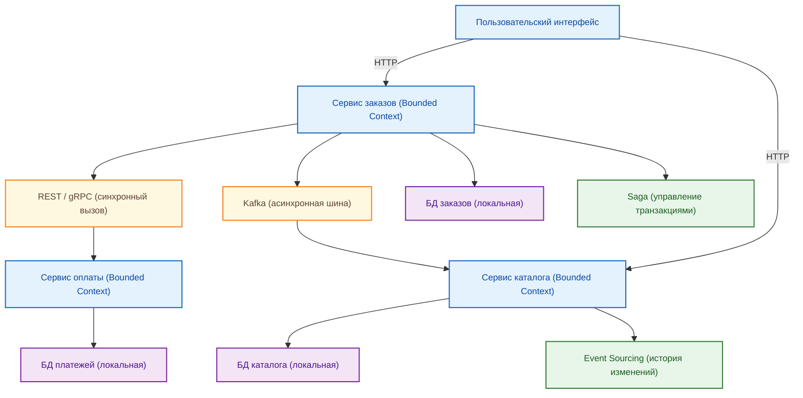
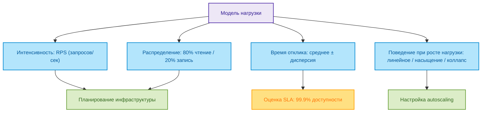

# Системы и модели

  ОБЯЗАТЕЛЬНО
  ДЛЯ НОВИЧКОВ

Архитектору
Инженеру

---

## Системы и модели

Слово "система" встречается повсюду: в IT, в управлении, в биологии, в философии. Однако за этим привычным термином скрывается глубокая концептуальная основа, без которой невозможно осмысленно проектировать, анализировать или даже понимать сложные явления. В контексте информационных технологий система — это не просто набор программ или серверов. Это целостное образование, обладающее внутренней структурой, целями, связями и закономерностями поведения.

Понимание систем и моделей открывает путь к системному мышлению — способности видеть мир не как хаотичный набор событий, а как совокупность взаимосвязанных компонентов, функционирующих по определённым правилам. Эта глава раскрывает фундаментальные понятия, лежащие в основе системного подхода, и показывает, как они применяются при создании и исследовании ИТ-решений.

---

### Что такое система

**Система** — это целостное единство взаимосвязанных и взаимозависимых элементов, объединённых общей целью, структурой и правилами функционирования.

Элементы системы не существуют изолированно. Они взаимодействуют друг с другом, обмениваются информацией, энергией или веществом, и именно эти связи определяют поведение всей системы в целом. Если убрать один элемент или нарушить связь между ними, система может перестать выполнять свою функцию или изменить своё поведение кардинально.

Примеры систем:
- Организм человека (сердце, лёгкие, мозг и т.д.);
- Компьютер (процессор, память, дисковая подсистема);
- Корпоративная информационная система (CRM, ERP, базы данных, пользователи);
- Интернет (маршрутизаторы, серверы, протоколы, пользователи).

Каждая система имеет **границы**, отделяющие её от внешней среды. То, что находится за пределами этих границ, считается окружением. Система взаимодействует с окружением через входы и выходы: получает ресурсы, данные или сигналы и выдаёт результаты, продукты или реакции.

---

### Объект и субъект

**Объект** — это то, на что направлено внимание, исследование или действие. Объект существует независимо от наблюдателя. В системном контексте объектом может быть любой элемент реальности: устройство, процесс, организация, человек.

**Субъект** — это тот, кто осуществляет наблюдение, анализ или воздействие на объект. Субъект обладает сознанием, целями и интерпретацией. В ИТ-проектах субъектом часто выступает аналитик, разработчик, архитектор или пользователь.

Разделение на объект и субъект важно, потому что оно подчёркивает: любое знание о системе формируется субъектом на основе его восприятия, целей и методов. Это ведёт к следующему ключевому различию — между объективной реальностью и субъективной моделью.

---

### Реальность, объективность и субъективность

**Реальность** — это всё, что существует независимо от человеческого сознания. Реальность объективна: она не зависит от того, верит ли в неё наблюдатель или нет.

**Объективность** — свойство знания или явления, которое не зависит от мнений, эмоций или интерпретаций отдельного субъекта. Например, факт наличия у компьютера 16 ГБ оперативной памяти — объективен.

**Субъективность** — зависимость восприятия или интерпретации от внутреннего состояния, опыта, целей и установок субъекта. Один и тот же интерфейс может казаться "удобным" одному пользователю и "неудобным" другому — это субъективная оценка.

В системном анализе стремятся к максимально объективному описанию, но полностью исключить субъективность невозможно: выбор того, **что** моделировать и **как**, всегда определяется целями субъекта.

---

### Феномены и факторы

**Феномен** — это наблюдаемое явление, событие или процесс в реальности. В ИТ это могут быть: сбой сервиса, рост времени отклика, увеличение числа пользователей, утечка данных.

**Фактор** — это элемент, влияющий на поведение системы или возникновение феномена. Факторы могут быть внутренними (например, неоптимальный алгоритм) или внешнимi (например, DDoS-атака).

Моделирование начинается с фиксации феноменов, которые требуют объяснения или управления, и выявления факторов, их порождающих.

---

### Субъективная модель объективно существующих феноменов

Любая **модель** — это упрощённое, целенаправленное представление реальной системы, созданное субъектом для достижения конкретной цели: понять, спрогнозировать, оптимизировать или воспроизвести поведение.

Модель не является копией реальности. Она отражает только те аспекты системы, которые важны для поставленной задачи. Например:
- Модель нагрузки игнорирует цвет кнопок в интерфейсе, но учитывает частоту запросов;
- Модель микросервисной архитектуры фокусируется на границах сервисов и каналах взаимодействия, но не на реализации бизнес-логики внутри.

Таким образом, модель — это **субъективный инструмент**, созданный для работы с **объективной реальностью**.

---

### Отличие реальной системы от её модели

Реальная система существует в физическом или социальном мире. Она обладает бесконечным количеством свойств, взаимодействий и контекстов.

Модель — это ограниченное, формализованное описание, построенное по определённым правилам и в рамках заданной абстракции. Она всегда:
- Проще реальности;
- Целенаправленна (служит одной или нескольким задачам);
- Может быть представлена в разных формах: текстовой, графической, математической, программной.

Ошибка многих начинающих — путать модель с реальностью. Например, считать, что если диаграмма архитектуры выглядит идеально, то и система будет работать без сбоев. На практике реальность всегда богаче и сложнее любой модели.

---

### Целостное единство

Система — это не сумма частей, а **целостное единство**, где целое обладает свойствами, которых нет у отдельных элементов. Это свойство называется **эмерджентностью** (от англ. *emergence* — возникновение).

Пример: отдельный нейрон не "думает", но миллиарды нейронов, связанных в мозг, порождают сознание. Отдельный микросервис не решает бизнес-задачу, но совокупность сервисов — да.

Целостность означает, что система функционирует как единый организм. Её нельзя понять, изучая компоненты в изоляции — необходимо анализировать связи и взаимодействия.

---

### Правила, структура и метод

**Правила** — это законы, ограничения или соглашения, определяющие, как элементы системы могут взаимодействовать. В ИТ это могут быть протоколы (HTTP, TCP), политики безопасности, соглашения об интерфейсах (API contracts).

**Структура** — это устойчивая организация элементов и связей между ними. Структура определяет, какие компоненты есть в системе и как они соединены. Примеры: клиент-серверная архитектура, многоуровневая система, peer-to-peer сеть.

**Метод** — это способ действия, последовательность шагов, применяемая для достижения цели в рамках системы. Например, метод аутентификации OAuth 2.0, метод репликации данных, метод CI/CD-развёртывания.

Правила, структура и метод вместе определяют **поведение** системы.

---

### Общие границы и цели

Каждая система имеет **границы**, которые определяют, что входит в систему, а что относится к её окружению. Границы могут быть физическими (корпус сервера), логическими (API-интерфейс) или организационными (отдел компании).

**Цель** — это функция или результат, ради которого система существует. У ИТ-системы цель может быть:
- Обеспечить хранение и обработку данных;
- Предоставить пользователям доступ к услугам;
- Автоматизировать бизнес-процесс.

Цель определяет, какие элементы и связи важны, а какие можно игнорировать при моделировании.

---

### Связи между компонентами

**Связи** — это каналы взаимодействия между элементами системы. Они могут передавать:
- Данные (запросы, ответы);
- Управление (сигналы, команды);
- Энергию (в технических системах);
- Информацию (в социальных системах).

Связи бывают:
- **Направленными** (A → B) или **двунаправленными** (A ↔ B);
- **Синхронными** (ожидание ответа) или **асинхронными** (без ожидания);
- **Жёсткими** (строгая зависимость) или **гибкими** (через очередь, шину).

Анализ связей позволяет выявить узкие места, точки отказа и возможности для декомпозиции.

---

### Компоненты и элементы системы

**Элемент** — это минимальная неделимая часть системы в рамках рассматриваемой модели. Что считать элементом, зависит от уровня абстракции. Для одного аналитика элементом может быть "пользователь", для другого — "HTTP-запрос".

**Компонент** — это функционально завершённая часть системы, обладающая чёткими границами и интерфейсом. Компонент может состоять из множества элементов. Примеры: база данных, веб-сервер, модуль авторизации.

Выбор уровня детализации — ключевой этап моделирования. Слишком высокая детализация делает модель громоздкой, слишком низкая — бесполезной.

---

### Взаимозависимость

Элементы системы **взаимозависимы**: изменение одного компонента влияет на другие. Эта зависимость может быть прямой (вызов API) или косвенной (конкуренция за ресурсы).

Взаимозависимость объясняет, почему локальные оптимизации иногда ведут к глобальному ухудшению: ускорение одного сервиса может перегрузить другой.

Понимание взаимозависимостей критично для:
- Проектирования отказоустойчивых систем;
- Анализа причин сбоев;
- Планирования изменений.

---

### Закономерность

Системы подчиняются **закономерностям** — устойчивым, повторяющимся принципам поведения. Эти закономерности могут быть:
- Физическими (ограничения скорости передачи данных);
- Логическими (принципы работы баз данных);
- Организационными (цикл разработки ПО).

Знание закономерностей позволяет предсказывать поведение системы и проектировать её более эффективно.

---

### Классификация систем

Системы можно классифицировать по множеству критериев:

---

#### По происхождению
- **Естественные** (экосистемы, организм);
- **Искусственные** (компьютеры, программы, организации).

---

#### По взаимодействию с окружением
- **Закрытые** — минимальный обмен с окружением (редкость в реальности);
- **Открытые** — активно взаимодействуют с окружением (большинство ИТ-систем).

---

#### По характеру связей
- **Детерминированные** — поведение точно предсказуемо;
- **Вероятностные** — поведение описывается вероятностями (например, сетевой трафик).

---

#### По степени сложности
- **Простые** — мало элементов, линейные связи;
- **Сложные** — множество элементов, нелинейные взаимодействия;
- **Сверхсложные** — адаптивные, самоорганизующиеся (например, рынок, интернет).

---

### Способ организации мыслительной деятельности

Системный подход — это не просто метод, а **способ организации мышления**. Он учит:
- Видеть целое, а не только части;
- Анализировать связи, а не только объекты;
- Учитывать контекст и цели;
- Работать с абстракциями и уровнями детализации.

Этот подход противопоставляется **аналитическому**, который стремится разложить всё на атомарные части и изучать их по отдельности. Системное мышление дополняет аналитическое, добавляя синтез.

О системном подходе вы можете почитать в разделе "Проектирование и архитектура".

---

### Совокупность объектов

Система — это **совокупность объектов**, объединённых общей функцией. Но не любая совокупность является системой. Чтобы совокупность стала системой, необходимы:
- Общая цель;
- Взаимосвязи между объектами;
- Целостность поведения.

Груда железа на складе — не система. Та же железка, собранная в работающий сервер, — система.

---

### Конструкционный принцип

**Конструкционный принцип** гласит: система строится из компонентов, каждый из которых сам является системой более низкого уровня. Это принцип **иерархичности**.

Пример:
- Приложение → микросервисы → модули → функции → инструкции процессора.

Каждый уровень имеет свою структуру, правила и цели, но подчиняется целям вышестоящего уровня. Этот принцип лежит в основе модульного проектирования, архитектурных паттернов и даже ООП.

---

### Общая теория систем

**Общая теория систем** — это междисциплинарная область знаний, изучающая универсальные закономерности строения, функционирования и развития систем независимо от их природы. Она была сформулирована Людвигом фон Берталанфи в середине XX века как попытка преодолеть узкоспециализированный подход в науке и создать единый язык для описания сложных явлений.

Основные положения общей теории систем:
- Системы любого типа подчиняются общим принципам;
- Целое больше суммы своих частей (принцип эмерджентности);
- Системы стремятся к сохранению целостности (гомеостаз);
- Системы развиваются по определённым законам, включая адаптацию и самоорганизацию.

В ИТ эта теория лежит в основе проектирования архитектур, управления проектами, анализа требований и даже разработки пользовательских интерфейсов. Она позволяет переносить решения из одной области в другую: например, использовать биологические метафоры (иммунная система → система защиты от атак) или социальные модели (рынок → микросервисная экономика).

---

### Системный анализ

**Системный анализ** — это методология исследования сложных объектов путём представления их в виде систем, выявления структуры, целей, связей и факторов влияния. Он применяется на ранних этапах проектирования ИТ-решений, особенно в задачах автоматизации бизнес-процессов.

Этапы системного анализа:
1. **Формулировка проблемы** — чёткое определение того, что требуется решить.
2. **Определение границ системы** — отделение системы от окружения.
3. **Идентификация компонентов и связей** — выявление элементов и их взаимодействий.
4. **Построение модели** — формализация поведения и структуры.
5. **Анализ альтернатив** — сравнение различных вариантов решения.
6. **Рекомендации** — выбор оптимального пути на основе модели.

Системный анализ не ограничивается технической стороной. Он учитывает организационные, экономические и человеческие аспекты — например, как внедрение новой CRM повлияет на работу менеджеров.

---

### Системология

**Системология** — это наука о системах как таковых. В отличие от общей теории систем, она стремится к строгой формализации понятий "система", "структура", "поведение", "цель". Системология разрабатывает онтологии, классификации и формальные языки описания систем (например, SysML).

В ИТ системология проявляется в:
- Моделировании требований с помощью UML, BPMN, ArchiMate;
- Создании метамоделей архитектуры (например, TOGAF ADM);
- Разработке стандартов описания компонентов (OpenAPI, AsyncAPI).

Системология обеспечивает **точность** и **однозначность** при передаче знаний между участниками проекта: аналитиком, разработчиком, заказчиком.

---

### Кибернетика

**Кибернетика** — наука об управлении и связи в живых организмах и машинах. Основоположник — Норберт Винер. Ключевое понятие кибернетики — **обратная связь**: система получает информацию о результате своего действия и корректирует поведение.

В ИТ кибернетические принципы лежат в основе:
- Автоматизированных систем мониторинга (например, Prometheus + Alertmanager);
- Самонастраивающихся систем (self-healing infrastructure);
- Алгоритмов регулирования нагрузки (автомасштабирование в Kubernetes);
- Чат-ботов с обучением на основе пользовательской реакции.

Кибернетика показывает: любая устойчивая система должна уметь **чувствовать**, **анализировать** и **реагировать**.

---

### Системная инженерия

**Системная инженерия** — это дисциплина, направленная на проектирование, интеграцию и управление сложными техническими системами на протяжении всего жизненного цикла. Она объединяет инженерные, управленческие и аналитические практики.

Характерные черты системной инженерии в ИТ:
- Фокус на **целостности** решения, а не только на коде;
- Использование **моделей** как основного средства коммуникации;
- Учёт **нефункциональных требований**: масштабируемость, отказоустойчивость, безопасность;
- Поэтапная верификация и валидация на каждом этапе разработки.

Системная инженерия особенно важна при создании распределённых систем, IoT-платформ, встроенных решений, где ошибки могут иметь физические последствия.

---

### Системная динамика

**Системная динамика** — метод моделирования поведения сложных систем во времени с учётом запаздываний, обратных связей и накопления ресурсов. Разработана Джей Форрестером. Основной инструмент — **диаграммы потоков и уровней** (stock-and-flow diagrams).

В ИТ системная динамика применяется для:
- Моделирования нагрузки на сервисы при росте числа пользователей;
- Прогнозирования эффекта от изменений в архитектуре (например, кэширование → снижение задержек → рост конверсии);
- Анализа "эффекта хлыстa" (bullwhip effect) в цепочках поставок ПО;
- Исследования поведения пользователей в цифровых экосистемах.

Она помогает понять, почему локальное улучшение (ускорение одного сервиса) может привести к глобальному ухудшению (перегрузке базы данных).

---

### Формализация поведения, структуры и взаимодействий

Чтобы модель была полезной, её необходимо **формализовать** — представить в виде, допускающем однозначную интерпретацию и, при необходимости, автоматическую обработку.

Формализация включает три аспекта:

---

#### Структура

Описывает **что есть в системе** и **как связано**. Инструменты:
- Диаграммы компонентов (UML Component Diagram);
- ER-диаграммы (для данных);
- Архитектурные карты (C4 Model).

---

#### Поведение

Описывает **как система реагирует на события**. Инструменты:
- Диаграммы последовательностей (Sequence Diagrams);
- Конечные автоматы (state machines);
- Диаграммы деятельности (Activity Diagrams).

---

#### Взаимодействия

Описывает **как компоненты обмениваются информацией**. Инструменты:
- API-спецификации (OpenAPI, GraphQL Schema);
- Протоколы обмена (gRPC, AMQP);
- Диаграммы потоков данных (Data Flow Diagrams).

Формализация позволяет:
- Избежать двусмысленности;
- Автоматизировать генерацию кода, тестов, документации;
- Проводить верификацию модели (например, проверку на тупики в workflow).

---

## Роль моделирования в анализе и проектировании ИТ-систем

Моделирование — не абстрактное упражнение, а **практический инструмент**, который:
- Снижает стоимость ошибок (ошибку в модели исправить дешевле, чем в продакшене);
- Ускоряет коммуникацию между участниками проекта;
- Позволяет экспериментировать без риска для реальной системы.

---

### Имитационное моделирование

**Имитационное моделирование** — это воспроизведение поведения системы во времени с помощью программной модели. Оно особенно ценно, когда аналитическое решение невозможно (например, из-за стохастичности).

Примеры в ИТ:
- Моделирование нагрузки на микросервисную архитектуру с помощью **Locust**, **k6** или специализированных платформ вроде **AnyLogic** или **Albeyu** (возможно, имеется в виду **AnyLogic** или **Arena**, но если "Альбею" — это внутренний инструмент, то он используется аналогично).
- Моделирование пользовательских потоков для оценки ёмкости системы.
- Симуляция отказов компонентов для проверки отказоустойчивости.

Имитационная модель позволяет ответить на вопросы:
- Что произойдёт, если число пользователей вырастет в 10 раз?
- Как система отреагирует на одновременный выход из строя двух нод?
- Хватит ли пропускной способности канала при пиковой нагрузке?

---

## Примеры моделей в ИТ

### Модель микросервисной архитектуры

Такая модель фокусируется на:
- Границах сервисов (bounded contexts);
- Каналах взаимодействия (REST, gRPC, Kafka);
- Стратегиях управления данными (локальные БД vs shared DB);
- Механизмах обеспечения согласованности (Saga, Event Sourcing).

Она может быть представлена в виде:
- C4-диаграммы уровня контейнеров;
- Диаграммы зависимостей (dependency graph);
- OpenAPI-спецификаций для каждого сервиса.

---

### Модель пользовательского потока

Описывает путь пользователя через систему:
- Экраны или страницы;
- Действия (клик, ввод, отправка формы);
- Переходы между состояниями;
- Возможные ошибки и исключения.

Инструменты:
- User journey maps;
- Диаграммы состояний (state diagrams);
- Прототипы в Figma или Balsamiq.

```mermaid
%%{init: {
"theme": "default",
"themeVariables": {
"fontSize": "13px",
"fontFamily": "Segoe UI, Tahoma, sans-serif"
}
}}%%
flowchart LR
    classDef screen fill:#e0f7fa,stroke:#006064,stroke-width:1.5px,color:#004d40;
    classDef action fill:#ffecb3,stroke:#ff6f00,stroke-width:1.5px,color:#e65100;
    classDef error fill:#ffcdd2,stroke:#b71c1c,stroke-width:1.5px,color:#b71c1c;
    classDef state fill:#c8e6c9,stroke:#2e7d32,stroke-width:1.5px,color:#1b5e20;

    Start["Старт: вход на сайт"]:::state
    Home["Главная страница"]:::screen
    Search["Поиск товара"]:::screen
    Results["Результаты поиска"]:::screen
    Product["Карточка товара"]:::screen
    Cart["Корзина"]:::screen
    Checkout["Оформление заказа"]:::screen
    Payment["Оплата"]:::screen
    Success["Заказ подтверждён"]:::screen
    Err404["Ошибка 404: товар не найден"]:::error
    ErrCart["Ошибка корзины: недоступен"]:::error

    Start --> Home
    Home -->|ввод запроса| Search
    Search -->|отправка формы| Results
    Results -->|выбор товара| Product
    Results -->|нет результатов| Err404
    Product -->|добавить в корзину| Cart
    Cart -->|перейти к оплате| Checkout
    Checkout -->|ввести данные| Payment
    Payment -->|успешно| Success
    Cart -->|корзина недоступна| ErrCart
```

---

### Модель нагрузки

Описывает:
- Интенсивность запросов (RPS — requests per second);
- Распределение типов запросов (80% чтение, 20% запись);
- Время отклика и его дисперсию;
- Поведение при росте нагрузки (линейное, экспоненциальное, с насыщением).

Используется для:
- Планирования инфраструктуры;
- Настройки autoscaling;
- Оценки SLA.

---

