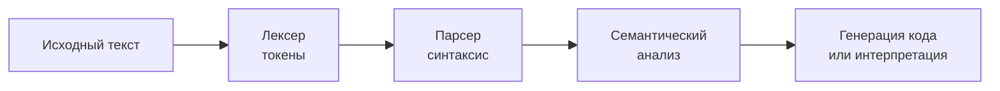
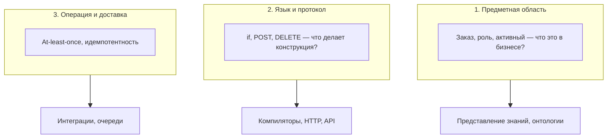
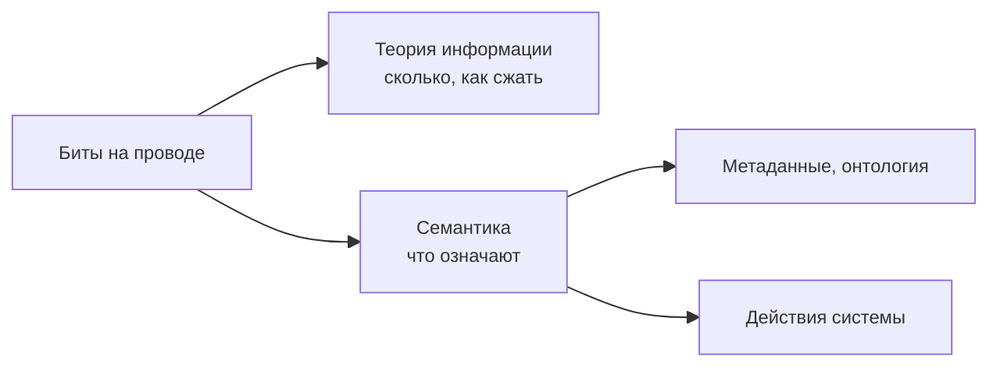
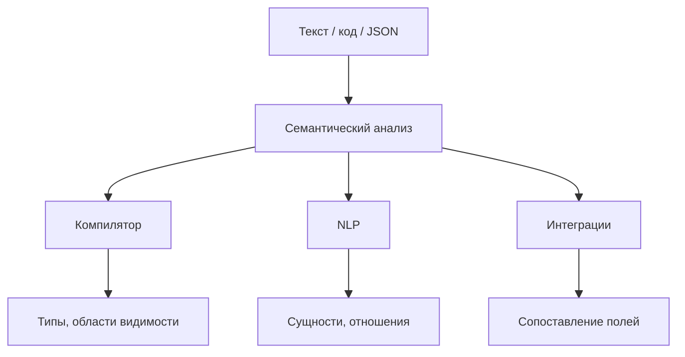
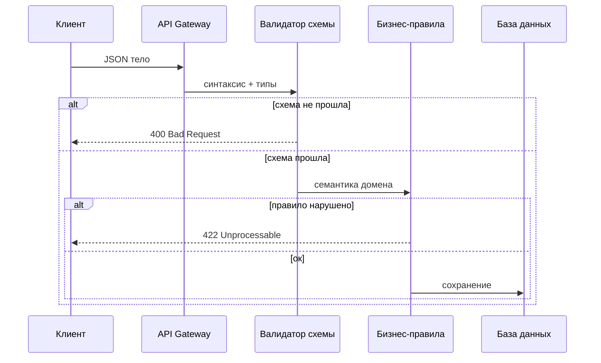
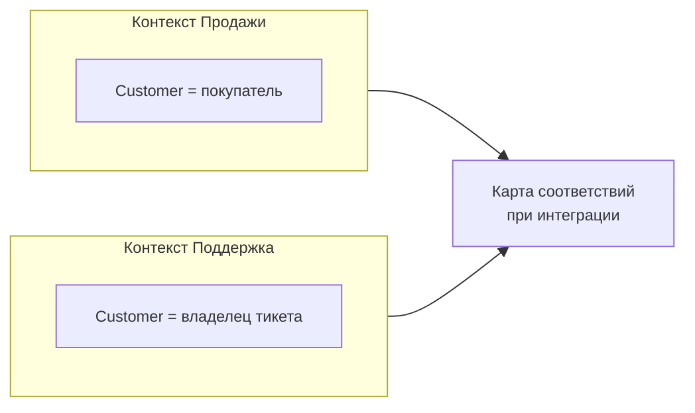
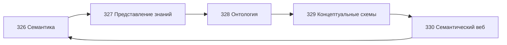

# Семантика — смысл знаков и данных

<div class="article-tags">
  <span class="tag tag-notrequired">НЕ ОБЯЗАТЕЛЬНО</span>
  <span class="tag tag-beginner">ДЛЯ НОВИЧКОВ</span>
</div>

<span class="complexity-badge">Архитектору</span>
<span class="complexity-badge">Аналитику</span>
<span class="complexity-badge">Инженеру</span>

**Семантика** (от греч. *semantikos* — "знаковый", "смысловой") — часть лингвистики и логики, которая изучает **смысл** знаков, слов и высказываний. В IT то же слово используют шире: речь идёт о том, **что означают** данные, команды языка, поля в [JSON](/encyclopedia/3-data-markup/3-04-konfiguratsii-i-dannye/intro) или методы [HTTP](/encyclopedia/2-system-network/2-03-set-i-internet/intro).

Слово "семантика" в чате разработчиков может означать три разные вещи. Ниже — как их различать и куда идти дальше: [представление знаний](./327), [онтология](./328), [концептуальные схемы](./329), [семантический веб](./330). Общий контекст — [статья "Семантика" в Википедии](https://ru.wikipedia.org/wiki/Семантика). Раздел [Мыслительная база](./intro) связывает эти темы с [графами](./323), [логикой](./31) и [теорией информации](./39).

---

## Синтаксис и семантика — два слоя понимания

**Синтаксис** отвечает на вопрос *как устроена форма* — правила записи, по которым текст или файл считается корректным.

**Семантика** отвечает на вопрос *что это значит* — какой смысл несёт запись в конкретном контексте.

| | Синтаксис | Семантика |
| --- | --- | --- |
| Вопрос | Правильно ли **написано**? | Правильно ли **понято**? |
| Пример | В JSON есть `{`, `}`, кавычки у ключей | Поле `"status": "active"` — заказ открыт или пользователь активен? |
| Кто проверяет | Парсер, линтер, валидатор схемы | Люди, бизнес-правила, модель данных |
| Типичная ошибка | Пропущена запятая | Сумма в рублях прочитана как копейки |

Файл может быть синтаксически верным и при этом бессмысленным для бизнеса. Типы в [API](/encyclopedia/2-system-network/2-09-osnovy-integratsionnogo-vzaimodeystviya/intro) совпали, а слово "клиент" в одном сервисе означает физическое лицо, в другом — юридическое. [Компилятор](/encyclopedia/1-basics/1-19-programma/2) поймает пропущенную скобку; согласовать смысл полей между командами помогают [метаданные](/encyclopedia/1-basics/1-09-dannye-i-informatsiya/5), [концептуальные схемы](./329) и [онтологии](./328).

### Аналогия из повседневной жизни

Представьте адрес на конверте.

- **Синтаксис** — почтовый индекс из шести цифр, улица написана кириллицей, есть номер дома. Форма соблюдена.
- **Семантика** — это действительно существующий адрес? Квартира 42 есть в этом подъезде? Получатель — человек или организация?

Почтовая служба сначала проверяет, что конверт **оформлен по правилам**. Доставка зависит от того, **куда** и **кому** адресовано письмо. В программах порядок похожий: сначала парсинг, затем интерпретация.

```text
// Синтаксис — скобки и запятые на месте
если (x > 0) то вернуть x иначе вернуть 0

// Семантика — что такое x?
// метры, рубли, идентификатор пользователя?
// Без договорённости код формально корректен, но результат непредсказуем
```

### Цепочка обработки в формальных языках

В [формальных языках](./38) и [компиляторах](/encyclopedia/4-code-dev/4-03-vypolnenie-koda/intro) цепочка обычно такая:



| Этап | Что делает | Пример ошибки |
| --- | --- | --- |
| **Лексер** | Делит поток символов на токены (слова языка) | `@` вместо буквы в идентификаторе |
| **Парсер** | Проверяет, что токены складываются в допустимые конструкции | `если (x > 0` без закрывающей скобки |
| **Семантический анализ** | Проверяет смысл в рамках языка | сложение строки и числа без приведения типов |
| **Генерация** | Строит исполняемое представление | оптимизации, раскладка по регистрам |

Подробнее о семантике **языков программирования** — в [глоссарии](/glossary/С#семантика-в-программировании) и в статье [Что такое код](/encyclopedia/4-code-dev/4-02-chto-takoe-kod-i-kak-on-rabotaet/intro).

---

## Синтаксис и семантика на примерах JSON

[JSON](/encyclopedia/3-data-markup/3-04-konfiguratsii-i-dannye/intro) (JavaScript Object Notation — текстовый формат обмена данными) часто используют в [REST API](/encyclopedia/2-system-network/2-09-osnovy-integratsionnogo-vzaimodeystviya/2). Разберём один и тот же документ с двух сторон.

### Синтаксически корректный JSON

```json
{
  "order_id": 1042,
  "status": "active",
  "amount": 15000,
  "customer": {
    "id": "usr-7",
    "email": "alice@example.com"
  }
}
```

Парсер `JSON.parse` (или аналог в другом языке) примет документ: фигурные скобки сбалансированы, ключи в кавычках, числа и строки записаны по правилам.

### Синтаксические ошибки

```json
{
  order_id: 1042,
  "status": 'active',
}
```

Типичные нарушения:

- ключ `order_id` без кавычек (в строгом JSON кавычки обязательны);
- одинарные кавычки у строки (в JSON — только двойные);
- лишняя запятая после последнего поля (в строгом JSON недопустима).

Такой текст **не разберётся** парсером. Ошибка видна сразу.

### Семантические вопросы к тому же корректному JSON

Даже при валидном синтаксисе остаются вопросы без контракта:

| Поле | Синтаксический тип | Семантический вопрос |
| --- | --- | --- |
| `amount` | число | рубли, копейки, доллары? до или после НДС? |
| `status` | строка | заказ активен или пользователь активен? |
| `customer.id` | строка | внутренний ID, UUID, email? |
| `active` | строковое значение | полный список допустимых статусов? |

**JSON Schema** (схема для описания структуры JSON) фиксирует часть семантики на уровне типов и ограничений:

```json
{
  "$schema": "https://json-schema.org/draft/2020-12/schema",
  "type": "object",
  "required": ["order_id", "status", "amount"],
  "properties": {
    "order_id": { "type": "integer", "minimum": 1 },
    "status": {
      "type": "string",
      "enum": ["draft", "paid", "shipped", "cancelled"]
    },
    "amount": {
      "type": "integer",
      "description": "Сумма в копейках, целое число, без дробной части"
    }
  }
}
```

Поле `description` и `enum` — мост от синтаксиса к смыслу. Полное согласование домена — в [глоссарии](/encyclopedia/7-project/7-09-bazy-znaniy-i-zadachniki/intro), [онтологии](./328) и тексте [OpenAPI](/encyclopedia/2-system-network/2-09-osnovy-integratsionnogo-vzaimodeystviya/2).

### Практический приём для команд

При ревью JSON-контракта задавайте два списка вопросов:

**Синтаксис и схема**

- проходит ли документ через валидатор?
- все обязательные поля перечислены в `required`?
- типы совпадают с потребителями?

**Семантика**

- единицы измерения явно указаны?
- перечисления статусов совпадают с [БД](/encyclopedia/3-data-markup/3-05-osnovy-baz-dannyh/intro)?
- имена полей согласованы с [единым языком](#единый-язык-ddd-и-глоссарий) домена?

---

## Синтаксис и семантика в SQL

[SQL](/encyclopedia/3-data-markup/3-07-sql/intro) (Structured Query Language — язык структурированных запросов) тоже разделяет форму и смысл.

### Синтаксически верный запрос

```sql
SELECT customer_id, SUM(amount) AS total
FROM orders
WHERE status = 'active'
GROUP BY customer_id
HAVING SUM(amount) > 10000;
```

СУБД (система управления базами данных) примет запрос, если имена таблиц и столбцов существуют в каталоге.

### Семантика имён и значений

| Элемент | Синтаксис | Семантика |
| --- | --- | --- |
| `status = 'active'` | сравнение строки со строкой | что считается "активным" заказом в этом продукте? |
| `amount` | числовой столбец | валюта, копейки, налог включён? |
| `customer_id` | внешний ключ | тот же идентификатор, что в CRM? |

Два отчёта с **одинаковым** SQL по форме могут давать **разные** цифры, если справочник статусов или правила агрегации разошлись между командами. [Концептуальная схема](./329) и [реляционная алгебра](./322) помогают формализовать смысл до уровня таблиц.

### Пример семантической ловушки

```sql
-- Отчёт A
SELECT COUNT(*) FROM users WHERE status = 1;

-- Отчёт B
SELECT COUNT(*) FROM users WHERE status = 'active';
```

Оба запроса синтаксически корректны. Если в справочнике `1` означает "заблокирован", а строка `'active'` — другое состояние, цифры в отчётах **несопоставимы**, хотя слово "активные пользователи" в заголовке одно и то же.

Решение на уровне семантики:

- единый справочник статусов в [метаданных](/encyclopedia/1-basics/1-09-dannye-i-informatsiya/5);
- явные имена вроде `account_state` вместо размытого `status`;
- документированные инварианты в [представлении знаний](./327).

---

## Синтаксис и семантика в коде

Языки программирования задают **синтаксис** грамматикой и **статическую семантику** системой типов.

### Пример на псевдокоде

```text
функция скидка(сумма: Деньги, клиент: Клиент) -> Деньги
    если клиент.уровень = "gold" то
        вернуть сумма * 0.9
    иначе
        вернуть сумма
```

**Синтаксис** — ключевые слова, скобки, типы в аннотациях.

**Семантика** — что такое `Деньги` (рубли с копейками или decimal?), что означает `gold`, можно ли применять скидку к уже уценённой позиции.

### Ошибки двух уровней

| Уровень | Пример | Кто ловит |
| --- | --- | --- |
| Синтаксис | `если x > 0` без `то` | компилятор, интерпретатор |
| Статическая семантика | `x + "текст"` для чисел | проверка типов |
| Динамическая семантика | деление на ноль в рантайме | тесты, мониторинг |
| Доменная семантика | скидка 110% | бизнес-правила, код-ревью |

Связь с [ООП](/encyclopedia/4-code-dev/4-08-oop/intro): класс `Order` в коде — синтаксическая конструкция языка; соглашение, что `Order.total` всегда в копейках — доменная семантика, которую команда несёт в [DDD](#единый-язык-ddd-и-глоссарий).

---

## Синтаксис и семантика в HTTP

[HTTP](/encyclopedia/2-system-network/2-03-set-i-internet/intro) (HyperText Transfer Protocol — протокол передачи гипертекста) разделяет **форму сообщения** и **смысл операции**.

### Форма запроса

```http
DELETE /api/users/usr-7 HTTP/1.1
Host: shop.example.com
Authorization: Bearer eyJhbGciOi...
```

Синтаксически корректны: метод, путь, версия протокола, заголовки.

### Семантика метода и ресурса

| Метод | Синтаксическая роль | Семантическая роль |
| --- | --- | --- |
| `GET` | запрос с телом допустим, но редок | **безопасное** чтение, без изменения состояния |
| `POST` | тело часто присутствует | создание или команда с побочным эффектом |
| `PUT` | полная замена ресурса по URI | идемпотентная замена |
| `DELETE` | удаление по URI | ресурс исчезает или помечается удалённым |

Один и тот же путь `/api/users/usr-7` с методами `GET` и `DELETE` **выглядит похоже**, но **означает разное**. Подробнее — [методы и статус-коды](/encyclopedia/2-system-network/2-09-osnovy-integratsionnogo-vzaimodeystviya/118).

### Статус-коды — синтаксис ответа и смысл для клиента

```http
HTTP/1.1 422 Unprocessable Content
Content-Type: application/json

{"error": "status transition not allowed"}
```

- **Синтаксис** — код `422`, заголовки, тело JSON валидно.
- **Семантика** — клиент понял запрос, сервер отклонил **смысл** данных (бизнес-правило), а не грамматику JSON. См. [статус-коды](/encyclopedia/2-system-network/2-03-set-i-internet/611).

### Семантика доставки (третий уровень)

Отдельно от смысла поля `order` обсуждают **гарантии повторной доставки** сообщения:

- **at-least-once** — сообщение придёт минимум один раз, возможны дубликаты;
- **exactly-once** — ровно один раз (дорого, часто приближение);
- **идемпотентность** — повторный вызов даёт тот же эффект.

Hub-статья — [Идемпотентность и семантика доставки](/encyclopedia/2-system-network/2-09-osnovy-integratsionnogo-vzaimodeystviya/133). В код-ревью полезно уточнять: речь о смысле поля в домене или о гарантиях [интеграции](/encyclopedia/2-system-network/2-09-osnovy-integratsionnogo-vzaimodeystviya/intro)?

---

## Три уровня слова "семантика" в IT

В разговоре полезно уточнять, о каком уровне идёт речь. Три уровня **пересекаются**, но отвечают на разные вопросы.



| Уровень | Главный вопрос | Типичные артефакты | Соседние статьи |
| --- | --- | --- | --- |
| Предметная область | Что означают сущности? | глоссарий, ER, онтология | [327](./327), [328](./328), [329](./329) |
| Язык и протокол | Что делает конструкция? | спецификация языка, RFC | [38](./38), [HTTP](/encyclopedia/2-system-network/2-03-set-i-internet/intro) |
| Операция и доставка | Что будет при повторе? | контракт очереди, idempotency key | [133](/encyclopedia/2-system-network/2-09-osnovy-integratsionnogo-vzaimodeystviya/133) |

### Уровень 1 — семантика предметной области

Здесь речь о **смысле сущностей и связей** в модели бизнеса.

**Вопросы этого уровня**

- Кого называем "пользователем" — человека, аккаунт или организацию?
- Какие значения допустимы у статуса "активный"?
- Какие отношения между сущностями считаются реальными?

**Инструменты**

- [Метаданные](/encyclopedia/1-basics/1-09-dannye-i-informatsiya/5) — описание конкретного ресурса;
- [Концептуальные схемы](./329) — карта сущностей до таблиц;
- [Онтологии](./328) — формальные классы и аксиомы;
- [Представление знаний](./327) — правила и графы понятий.

**Типичная ошибка**

Два [микросервиса](/encyclopedia/7-project/7-06-proektirovanie-i-arhitektura/intro) используют поле `amount`, но один хранит копейки, другой — рубли. JSON в обоих случаях валиден; **смысл поля разный**.

**Мини-кейс — поле `client`**

```text
Сервис "Корзина":  client = session_id посетителя
Сервис "Биллинг":  client = юрлицо с ИНН
Сервис "Отчёты":   JOIN по полю client без уточнения
```

Синтаксически все сервисы обмениваются JSON. Семантически `client` — **три разных понятия**. Лечение — развести имена (`visitor_session`, `legal_entity`) и зафиксировать в [онтологии](./328).

### Уровень 2 — семантика языка, разметки и протокола

Здесь фиксируют **правила интерпретации конструкций** независимо от конкретного магазина или банка.

**Примеры**

- Что делает оператор `if` или ключевое слово `async` в конкретном языке.
- Чем отличаются HTTP-методы `GET` и `DELETE` при одинаковом виде запроса.
- Какой [HTML](/encyclopedia/3-data-markup/3-09-html/intro)-тег обозначает навигацию, а какой — основной контент ([семантика и доступность в CSS](/encyclopedia/3-data-markup/3-10-css/2#семантика-и-доступность)).

Синтаксис HTML — теги и атрибуты. Семантика — роли элементов для браузера, поисковика и [скринридера](/encyclopedia/1-basics/1-25-interfeys/intro).

**Таблица — конструкции и их смысл**

| Технология | Синтаксис | Семантика |
| --- | --- | --- |
| JavaScript | `===` и `==` | строгое и нестрогое сравнение |
| CSS | `display: flex` | модель раскладки flexbox |
| HTML | `<nav>`, `<main>` | ориентиры для доступности |
| HTTP | `Cache-Control` | правила кэширования |
| SQL | `LEFT JOIN` | сохранение строк левой таблицы |

Спецификации (ECMAScript, WHATWG HTML, RFC для HTTP) — **договор** о смысле на этом уровне.

### Уровень 3 — семантика операции и доставки

Здесь описывают **гарантии поведения** при повторе вызова или сбое сети.

**Ключевые понятия**

- **At-least-once** — сообщение доставят хотя бы один раз, возможны дубликаты.
- **At-most-once** — дубликатов нет, возможна потеря.
- **Идемпотентность** — повторный вызов даёт тот же эффект, что и первый.

**Пример**

```text
POST /payments  без ключа идемпотентности
  → два клика пользователя → два списания

POST /payments  с заголовком Idempotency-Key: uuid-...
  → повтор с тем же ключом → один платёж
```

Поведение операции при сбоях описывают **отдельно** от значения слова "заказ" в [базе данных](/encyclopedia/3-data-markup/3-05-osnovy-baz-dannyh/intro). Оба слоя нужны в [событийных архитектурах](/encyclopedia/2-system-network/2-09-osnovy-integratsionnogo-vzaimodeystviya/intro).

---

## Шеннон, информация и смысл

[Теория информации](./39) (Клод Шеннон, 1948) измеряет данные **количественно** — энтропия, сжатие, пропускная способность канала — **без** привязки к смыслу.

### Что измеряет Шеннон

| Понятие | Смысл в теории Шеннона | Пример |
| --- | --- | --- |
| Бит | единица неопределённости | монета: 1 бит |
| Энтропия | среднее число бит на символ | сжатие текста |
| Канал | пропускная способность | мегабит в секунду |

Один и тот же набор битов может быть фотографией, логом или шифротекстом; теория информации **не различает** эти случаи по содержанию.

### Что добавляет семантика

Семантика отвечает на другие вопросы:

- **Назначение** — для чего эти данные существуют?
- **Как** сопоставить их с объектами в мире или в другой системе?
- **Какие** правила интерпретации обязательны?

### Аналогия

Передача по радио цифр `15000` — вопрос Шеннона: сколько бит нужно, надёжен ли канал.

Вопрос семантики: это **цена в копейках**, **высота в миллиметрах** или **номер заказа**?



Обе дисциплины нужны в [данных](/encyclopedia/1-basics/1-09-dannye-i-informatsiya/1): Шеннон — для сетей и хранения; семантика — для интеграций и аналитики.

### Способы зафиксировать смысл (от простого к сложному)

| Уровень | Что фиксирует | Пример |
| --- | --- | --- |
| Комментарий в коде | локальная договорённость | `amount_kopecks` |
| **Метаданные** | описание конкретного файла или ресурса | автор, дата, теги |
| **Словарь или справочник** | допустимые значения поля в одной БД | `status IN (...)` |
| **Концептуальная схема** | сущности и связи домена | ER-диаграмма |
| **Онтология** | классы, свойства, отношения, аксиомы | OWL-модель |
| **Граф знаний** | факты в сети с URI | [RDF](./330) |

Метаданные похожи на этикетку на коробке. Онтология — на общий каталог складов: одни и те же названия полок во всех зданиях. Переход от этикетки к каталогу — тема [представления знаний](./327).

---

## Семантический анализ

**Семантический анализ** — извлечение или проверка смысла из текста, кода или данных.



### Семантический анализ в компиляторе

После успешного парсинга компилятор строит **абстрактное синтаксическое дерево** (AST) и проверяет:

- совместимость типов;
- объявлены ли используемые имена;
- допустимы ли вызовы методов для данного класса.

```text
// Псевдокод на русском
пусть x: целое = "привет"   // ошибка семантики типов

пусть y: целое = 5
пусть z = y + true          // ошибка: сложение числа и логического
```

Такие ошибки **синтаксически** допустимы (скобки на месте), но **семантически** запрещены. См. [формальные языки](./38) и [выполнение кода](/encyclopedia/4-code-dev/4-03-vypolnenie-koda/intro).

### Семантический анализ в NLP

**NLP** (Natural Language Processing — обработка естественного языка) извлекает смысл из текста людей:

- именованные сущности (имена, организации, даты);
- отношения ("Алиса работает в Acme");
- тональность отзыва;
- тематическая классификация.

Современные модели — [трансформеры и NLP](/encyclopedia/6-ai/6-09-transformery-i-nlp/intro). Они **угадывают** смысл по статистике; для юридически значимых полей нужны **явные** схемы из [представления знаний](./327) и [онтологий](./328).

**Сравнение подходов**

| Подход | Сильная сторона | Слабая сторона |
| --- | --- | --- |
| Правила и онтологии | объяснимость, аудит | ручная поддержка |
| Статистический NLP | гибкость на свободном тексте | ошибки на редких доменах |
| Гибрид | RAG + граф знаний | сложность внедрения |

### Семантический анализ в интеграциях

При стыковке систем выполняют **mapping** (сопоставление полей):

```text
CRM.customer_ref     →  ERP.party_id
CRM.email            →  ERP.contact_email
CRM.status_code      →  ERP.lifecycle_state  (таблица соответствия)
```

Инструменты:

- ETL-пайплайны и [интеграции](/encyclopedia/2-system-network/2-09-osnovy-integratsionnogo-vzaimodeystviya/intro);
- валидаторы JSON Schema на входе API;
- ответ `422 Unprocessable Content`, когда JSON синтаксически верен, но значения нарушают бизнес-правила.

Модель или парсер могут распознать формат даты `2026-06-15`, но не знают ваших правил скидок без явной схемы и глоссария. Автоматика работает **вместе** с договорённостями людей.

### Конвейер проверки входящего API-запроса



---

## Кейс-стади — несовпадение единиц измерения

### Ситуация

Интернет-магазин вырос: появились сервис каталога, сервис заказов, сервис аналитики. Все обмениваются JSON. Поле `line_total` везде тип `number`.

### Хронология

| Команда | Договорённость "устно" | Факт в коде |
| --- | --- | --- |
| Каталог | цены в рублях | `price: 199.99` |
| Заказы | суммы в копейках | `line_total: 19999` |
| Аналитика | "как пришло" | `SUM(line_total)` |

### Симптом

Отчёт показывает выручку в 100 раз выше реальности. JSON **везде валиден**. Ошибка **семантическая**.

### Разбор по уровням

| Уровень | Что пошло не так |
| --- | --- |
| Синтаксис | нарушений нет |
| Схема типов | везде `number` |
| Домен | разные единицы у одного имени |
| Операции | агрегация без нормализации |

### Решение

1. Переименовать поля: `price_rub_decimal`, `line_total_kopecks`.
2. Добавить в OpenAPI `description` и примеры.
3. Ввести тип-обёртку в коде (`MoneyKopecks`, `MoneyRub`).
4. Зафиксировать в [концептуальной схеме](./329) и глоссарии.
5. Тест-контракт между сервисами на граничных значениях.

Урок: **одинаковое имя + одинаковый тип** ещё не гарантируют одинаковый смысл.

---

## Кейс-стади — поле `status`

### Ситуация

В таблице `orders` есть столбец `status`. Его используют фронтенд, бэкенд, отчёты и внешний склад.

### Расхождения

| Система | Значение `active` | Значение `closed` |
| --- | --- | --- |
| Фронтенд | заказ в работе | доставлен |
| Склад | комплектуется | отгружен |
| Бухгалтерия | не используется | оплачен и закрыт |
| CRM | лид в воронке | сделка проиграна |

### Почему синтаксис не спасает

```sql
SELECT * FROM orders WHERE status = 'active';
```

Запрос корректен. **Смысл** `active` четыре разных.

### Решение — семантическая нормализация

**Шаг 1.** Разделить понятия:

- `order_fulfillment_state` — логистика;
- `payment_state` — оплата;
- `crm_deal_stage` — продажи.

**Шаг 2.** Справочники с явными кодами и [метаданными](/encyclopedia/1-basics/1-09-dannye-i-informatsiya/5).

**Шаг 3.** Диаграмма переходов состояний (state machine) с подписанными событиями.

**Шаг 4.** Правила в [представлении знаний](./327):

```text
ЕСЛИ fulfillment_state = "shipped"
   И payment_state = "captured"
ТО можно выставить бухгалтерский документ
```

**Шаг 5.** Версионирование API при добавлении нового статуса — см. [раздел о версионировании](#версионирование-и-эволюция-смысла).

---

## Контракты API и семантика

**API** (Application Programming Interface — интерфейс прикладного программирования) — договор между системами. [OpenAPI](/encyclopedia/2-system-network/2-09-osnovy-integratsionnogo-vzaimodeystviya/2) описывает пути, параметры и схемы.

### Слои контракта

| Слой | Что фиксирует | Инструмент |
| --- | --- | --- |
| Транспорт | HTTP, TLS, кодировка | RFC, инфраструктура |
| Синтаксис | формат JSON, XML | парсер |
| Структура | поля, типы, обязательность | JSON Schema, OpenAPI |
| Семантика | единицы, инварианты, жизненный цикл | описания, глоссарий, примеры |
| Поведение | идемпотентность, порядок событий | документация, тесты |

### Пример фрагмента OpenAPI с семантикой

```yaml
components:
  schemas:
    MoneyKopecks:
      type: integer
      description: >
        Сумма в копейках. Целое неотрицательное число.
        19999 означает 199 руб 99 коп. НДС включён.
      minimum: 0
      example: 19999
    OrderStatus:
      type: string
      enum: [draft, paid, packed, shipped, cancelled]
      description: >
        Состояние исполнения заказа. Не путать с payment_status.
```

### Consumer-driven contracts

Команда-потребитель пишет тест: "мы ожидаем, что `amount` — копейки". CI проверяет поставщика. Так семантика становится **проверяемой**, а не только текстом в Wiki.

Связанные темы: [интеграционное взаимодействие](/encyclopedia/2-system-network/2-09-osnovy-integratsionnogo-vzaimodeystviya/intro), [тестирование](/encyclopedia/7-project/7-05-testirovanie/intro).

---

## Единый язык, DDD и глоссарий

**DDD** (Domain-Driven Design — предметно-ориентированное проектирование) вводит **единый язык** (ubiquitous language): одни и те же термины в разговоре с бизнесом, в коде и в документации. См. [методологию и жизненный цикл](/encyclopedia/7-project/7-03-metodologiya-i-zhiznennyy-tsikl-po/1).

### Как выглядит единый язык

| Термин в бизнесе | Класс в коде | Таблица в БД | Поле в API |
| --- | --- | --- | --- |
| Заказ | `Order` | `orders` | `order` |
| Покупатель | `Customer` | `customers` | `customer` |
| Строка заказа | `OrderLine` | `order_lines` | `lines[]` |

Запрещены "синонимы без причины": `client`, `user`, `buyer` для одной сущности без явного различия в [онтологии](./328).

### Ограниченный контекст

В DDD **bounded context** (ограниченный контекст) — граница, внутри которой термин однозначен. Слово "клиент" в контексте **Продаж** и **Поддержки** может означать разное, но внутри каждого контекста — одно.



Между контекстами — явный **mapping**, как в [семантическом вебе](./330).

### Глоссарий команды

Короткие определения для фронта, бэка и аналитики:

| Термин | Определение | Не путать с |
| --- | --- | --- |
| Активный заказ | оплачен и не отменён | активный пользователь |
| Сумма заказа | копейки, НДС включён | цена в каталоге |

Хранить в [базе знаний](/encyclopedia/7-project/7-09-bazy-znaniy-i-zadachniki/intro). Связь с [представлением знаний](./327) — правила и онтологии **машиночитаемого** глоссария.

---

## Версионирование и эволюция смысла

Смена **смысла** при том же имени поля ломает [интеграции](/encyclopedia/2-system-network/2-09-osnovy-integratsionnogo-vzaimodeystviya/intro) сильнее, чем смена формата скобок.

### Типы изменений

| Изменение | Пример | Риск |
| --- | --- | --- |
| Синтаксическое | XML → JSON | средний, видно сразу |
| Структурное | разбить `name` на `first`/`last` | высокий без версии |
| Семантическое | `amount` рубли → копейки | критический, тихий |

### Стратегии

**Версия в пути**

```http
GET /api/v2/orders/1042
```

**Версия в заголовке**

```http
Accept: application/vnd.shop.orders.v2+json
```

**Параллельные поля на переходный период**

```json
{
  "amount": 199.99,
  "amount_kopecks": 19999,
  "amount_deprecated": true
}
```

**События с версией схемы**

```json
{
  "event": "order.paid",
  "schema_version": 3,
  "payload": { ... }
}
```

### Чеклист при изменении поля

- обновлён глоссарий?
- миграция данных с пересчётом единиц?
- уведомлены потребители API?
- контрактные тесты в CI?
- [концептуальная схема](./329) синхронизирована?

---

## Семантика в разметке и интерфейсах

### HTML и доступность

Тег `<button>` и `<div onclick="...">` могут **выглядеть** одинаково. Семантика для [скринридера](/encyclopedia/1-basics/1-25-interfeys/intro) разная: кнопка объявлена как интерактивный элемент с ролью.

Landmark-элементы (`<main>`, `<nav>`, `<header>`) задают **смысловую структуру** страницы. Подробнее — [HTML](/encyclopedia/3-data-markup/3-09-html/intro) и [CSS — семантика](/encyclopedia/3-data-markup/3-10-css/2).

### Микроразметка Schema.org

Атрибуты `itemtype`, JSON-LD — способ сказать поисковику: "это товар", "это цена". Связь с [семантическим вебом](./330).

---

## Связь с соседними статьями маршрута



| Статья | Вклад в общую картину |
| --- | --- |
| [326](./326) (эта) | различение формы и смысла, три уровня "семантики" |
| [327](./327) | как **записать** знания для машин |
| [328](./328) | формальные **понятия** домена |
| [329](./329) | **схемы** от идеи до таблиц |
| [330](./330) | **обмен** смыслом в сети, RDF, графы |

Дополнительно: [графы](./323), [логика](./31), [теория информации](./39), [структуры данных](/encyclopedia/3-data-markup/3-02-struktury-dannyh/intro).

---

## Практика для команды

### На этапе проектирования

- начинать с [концептуальной схемы](./329), а не с таблиц;
- фиксировать единицы измерения в именах полей;
- разделять перегруженные `status`, `type`, `name`.

### На этапе разработки

- JSON Schema / OpenAPI в репозитории рядом с кодом;
- контрактные тесты между сервисами;
- линтеры на запрещённые синонимы в API.

### На этапе эксплуатации

- каталог данных (data catalog) с описаниями столбцов;
- алерты на аномалии (скачок сумм на порядок);
- ретроспективы инцидентов с пометкой "семантика / синтаксис".

### Вопросы для код-ревью

- Понятно ли из имени поля, **в каких единицах** значение?
- Совпадает ли смысл с глоссарием?
- Есть ли описание в контракте API?
- Что произойдёт при повторной доставке сообщения?

---

## Прагматика — смысл в контексте

Рядом с синтаксисом и семантикой в лингвистике выделяют **прагматику** — как смысл зависит от **ситуации**, **говорящего** и **цели**.

### Примеры в IT

| Высказывание | Без контекста | С контекстом |
| --- | --- | --- |
| `DELETE /users/5` | удалить запись | в проде — инцидент; в тесте — очистка фикстуры |
| `status = 0` | число ноль | в прошивке — "выключено"; в API v1 — "черновик" |
| "клиент недоволен" в тикете | эмоция | приоритет SLA, эскалация |

Прагматика объясняет, почему одна и та же **семантика** требует разных **действий**: резервное копирование перед миграцией, feature flag, канареечный релиз.

### Связь с метаданными

Поля `created_by`, `environment`, `valid_from` в [метаданных](/encyclopedia/1-basics/1-09-dannye-i-informatsiya/5) несут прагматический слой: **кто** утвердил смысл и **когда** он действует. В [онтологиях](./328) временные версии понятий называют **версионированием онтологии**.

---

## Семантика в событиях и очередях

В [событийно-ориентированной архитектуре](/encyclopedia/2-system-network/2-09-osnovy-integratsionnogo-vzaimodeystviya/intro) сообщение — это JSON плюс **тип события**.

```json
{
  "type": "order.paid",
  "occurred_at": "2026-06-15T14:22:00Z",
  "payload": {
    "order_id": 1042,
    "amount_kopecks": 19999
  }
}
```

**Синтаксис** — валидный JSON.

**Семантика типа** — `order.paid` означает успешное списание, а не "заказ создан" или "чек отправлен".

**Семантика доставки** — подписчик может получить событие дважды; обработчик должен быть идемпотентным или использовать deduplication по `event_id`.

Таблица соглашений для команды:

| Поле | Назначение |
| --- | --- |
| `type` | имя события из реестра |
| `schema_version` | версия смысла payload |
| `event_id` | уникальный идентификатор для дедупликации |
| `occurred_at` | момент факта в домене (не время отправки) |

---

## Семантика в аналитике и отчётах

BI-дашборд (Business Intelligence — система бизнес-аналитики) агрегирует таблицы. Ошибка семантики здесь особенно болезненна: цифры **выглядят** точными.

### Типичные ловушки

- **Разные определения "активного пользователя"** — заход за 30 дней или за 7?
- **Валовая и чистая выручка** — одно имя столбца `revenue`.
- **Окно атрибуции** — клик и покупка в разных сессиях.

### Практика

- metric store (хранилище определений метрик) с версией формулы;
- ссылка из отчёта на определение в [базе знаний](/encyclopedia/7-project/7-09-bazy-znaniy-i-zadachniki/intro);
- тесты на эталонных наборах данных.

Связь с [анализом данных](/encyclopedia/3-data-markup/3-11-analiz-dannyh/intro): SQL корректен, **определение метрики** — семантика.

---

## Семантика и безопасность

[Информационная безопасность](/encyclopedia/2-system-network/2-08-osnovy-informatsionnoy-bezopasnosti/intro) опирается на **смысл** ролей и действий.

| Решение | Семантический вопрос |
| --- | --- |
| RBAC (Role-Based Access Control — разграничение по ролям) | что может роль `editor`? |
| Маскирование поля | `email` — PII (Personally Identifiable Information — персональные данные)? |
| Аудит-лог | какое действие означает `user.delete`? |

Одинаковый HTTP `200 OK` на удаление и на soft-delete (логическое удаление) — **разная семантика** для восстановления данных и комплаенса.

---

## Мини-глоссарий

| Термин | Краткое определение |
| --- | --- |
| **Семантика** | смысл знаков, данных, конструкций |
| **Синтаксис** | правила формы записи |
| **Прагматика** | смысл в контексте использования (кто, когда, зачем) |
| **Онтология** | формальная модель понятий домена |
| **Метаданные** | данные о данных |
| **Инвариант** | условие, которое всегда должно быть истинно |
| **Mapping** | сопоставление полей между схемами |
| **Идемпотентность** | повтор операции без лишнего эффекта |
| **Bounded context** | граница однозначности терминов в DDD |
| **Триплет** | утверждение "субъект — предикат — объект" в RDF |
| **NLP** | обработка естественного языка |
| **RAG** | дополнение ответов LLM извлечённым контекстом |

---

## Вопросы для самопроверки

1. Приведите пример JSON, который синтаксически верен, но семантически неоднозначен без контракта.
2. Назовите три уровня слова "семантика" в IT и по одному примеру на каждый.
3. Чем измерение Шеннона отличается от вопросов семантики?
4. Почему поле `status` часто становится источником ошибок?
5. Какие слои есть у контракта API кроме синтаксиса JSON?
6. Что такое единый язык в DDD и как он связан с глоссарием?
7. Какие стратегии версионирования вы знаете при смене смысла поля?
8. Чем семантический анализ компилятора отличается от NLP?
9. Как связаны эта статья, [327](./327), [328](./328), [329](./329) и [330](./330)?
10. Опишите шаги исправления кейса с единицами измерения.

**Задание со звёздочкой.** Нарисуйте ER-фрагмент для заказа с отдельными справочниками для логистики и оплаты. Сверьте с [концептуальными схемами](./329).

---

## Связанные статьи

- [Представление знаний](./327) — как записывать знания для машин.
- [Онтология в информатике](./328) — формальная модель понятий домена.
- [Концептуальные схемы и информационные модели](./329) — ER, UML, уровни схемы.
- [Семантический веб и графы знаний](./330) — RDF, Linked Data.
- [Графы — маршруты, остовы и раскраски](./323) — математика графов.
- [Теория информации](./39) — энтропия и каналы.
- [Формальные языки и автоматы](./38) — лексер, парсер, семантика.
- [Мыслительная база — о разделе](./intro).
- [Метаданные](/encyclopedia/1-basics/1-09-dannye-i-informatsiya/5).
- [Основы интеграционного взаимодействия](/encyclopedia/2-system-network/2-09-osnovy-integratsionnogo-vzaimodeystviya/intro).
- [Применение ИИ](/encyclopedia/6-ai/6-06-primenenie-ii/intro) — RAG и графы знаний.

---
