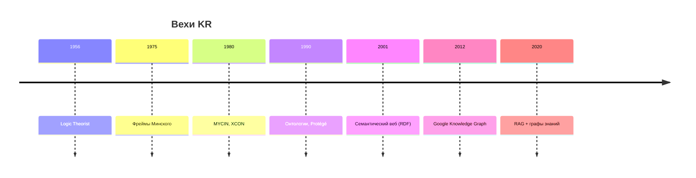
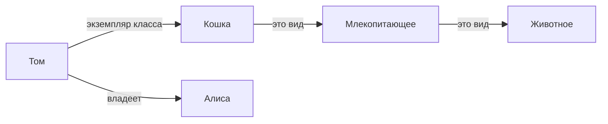
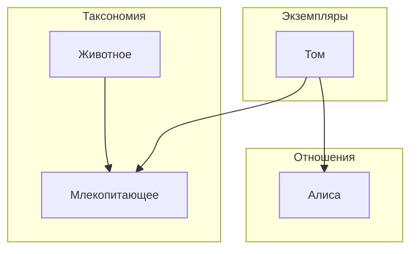
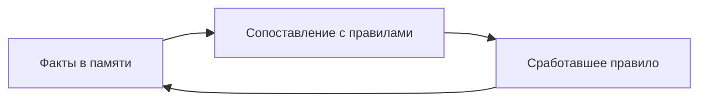
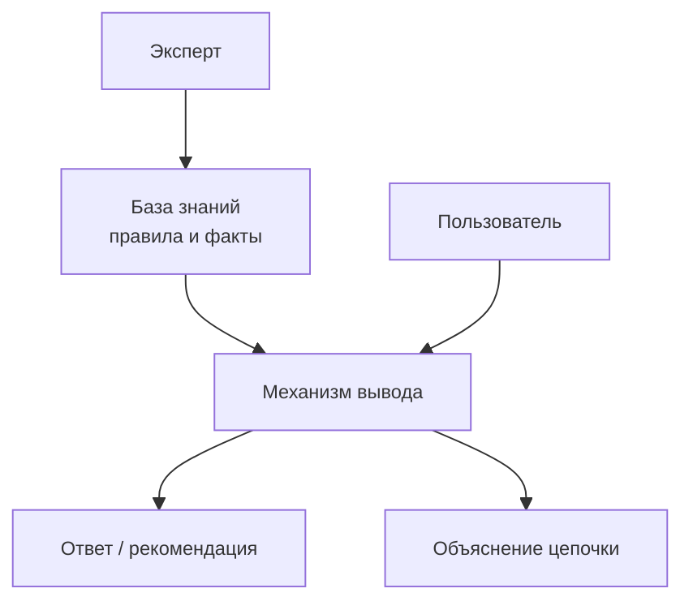
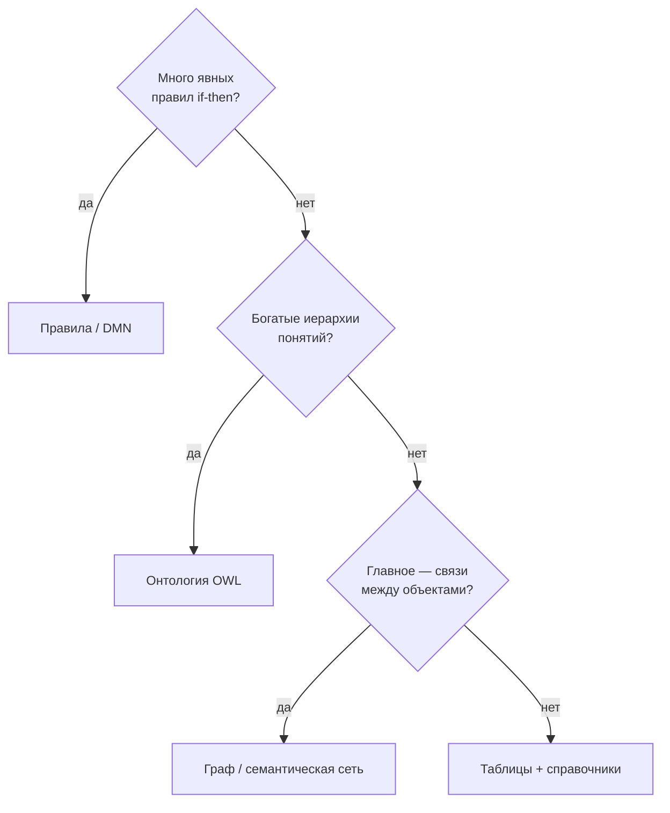
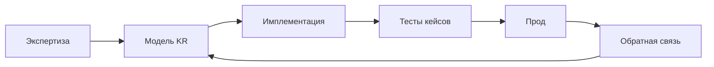
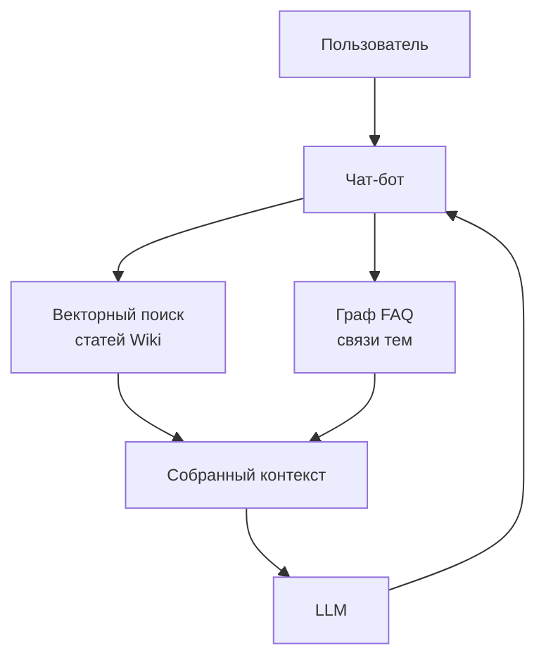
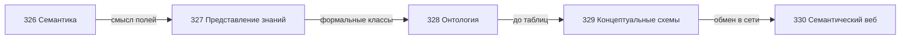

# Представление знаний

<div class="article-tags">
  <span class="tag tag-notrequired">НЕ ОБЯЗАТЕЛЬНО</span>
  <span class="tag tag-beginner">ДЛЯ НОВИЧКОВ</span>
</div>

<span class="complexity-badge">Архитектору</span>
<span class="complexity-badge">Аналитику</span>
<span class="complexity-badge">Инженеру</span>

**Представление знаний** (англ. *Knowledge Representation*, KR — представление знаний) — направление информатики и [искусственного интеллекта](/encyclopedia/6-ai/6-01-vvedenie-v-ii/intro), где знания о **предметной области** записывают в форме, удобной для программ: поиск, проверка условий, вывод новых фактов, согласование с [данными](/encyclopedia/1-basics/1-09-dannye-i-informatsiya/1).

Обычная [база данных](/encyclopedia/3-data-markup/3-05-osnovy-baz-dannyh/intro) хранит строки и отвечает на запросы вроде `SELECT … WHERE …`. KR добавляет явный слой **понятий**, **правил** и **связей между смыслами**. Обзор — [статья "Представление знаний" в Википедии](https://ru.wikipedia.org/wiki/Представление_знаний). Соседние статьи — [семантика](./326), [онтология](./328), [концептуальные схемы](./329), [семантический веб](./330). Раздел [Мыслительная база](./intro) связывает KR с [логикой](./31), [графами](./323) и [системами](./22).

---

## Явная запись знаний

Эксперт по логистике формулирует правило словами:

```text
Если заказ оплачен
   и склад подтвердил отгрузку
   и статус заказа — "собран",
то статус можно перевести в "отправлен".
```

**Задача KR** — записать это так, чтобы система могла:

- проверить условие на конкретном заказе;
- объяснить, почему статус изменился;
- обнаружить противоречие с другими правилами.

Без явной записи такие знания остаются в головах, в тикетах и в разрозненных `if` по коду. KR даёт **общий слой смысла** поверх приложений — в медицине, финансах, техподдержке, корпоративных справочниках.

### Аналогия

**База данных** — журнал фактов: "заказ 1042 оплачен 15.06.2026".

**Представление знаний** — устав склада: "оплаченный и собранный заказ можно отправлять".

Журнал без устава не подскажет, **можно ли** менять статус. Устав без журнала — пустая формальность.

---

## История представления знаний

### 1950–1960-е — логика и первые программы

После работ Алана Тьюринга и Джона фон Неймана стало ясно: машины манипулируют **символами**. Исследователи пробовали кодировать рассуждения как [логические](./31) формулы. Программа *Logic Theorist* (1956) искала доказательства теорем — ранний пример **символьного ИИ**.

### 1970-е — семантические сети и фреймы

**Семантические сети** (Quillian, 1960-е; развитие в 1970-х) представили понятия как узлы [графа](./323), а отношения — как подписанные рёбра.

**Фреймы** Марвина Минского (1975) описали типичные ситуации шаблонами со слотами — прообраз объектных моделей в коде.

### 1980-е — экспертные системы

**Экспертные системы** (expert systems) — программы, имитирующие рассуждения специалиста в узкой области:

| Система | Область | Идея |
| --- | --- | --- |
| **MYCIN** | диагностика инфекций | цепочки правил IF-THEN |
| **XCON** (R1) | конфигурация DEC | подбор комплектующих |
| **DENDRAL** | химический анализ | гипотезы по спектрам |

Успех в **узком домене** с чёткими правилами. Провал при попытке охватить "весь мир" без структуры понятий.

### 1990-е — онтологии и веб

Стандартизация **онтологий** для повторного использования понятий. Появление [XML](/encyclopedia/3-data-markup/3-04-konfiguratsii-i-dannye/intro), затем **RDF** (Resource Description Framework) — основа [семантического веба](./330).

### 2000-е — Linked Data и графы знаний

[Википедия](https://ru.wikipedia.org/wiki/Википедия), [DBpedia](https://www.dbpedia.org/), [Wikidata](https://www.wikidata.org/) — открытые графы фактов. Google Knowledge Graph — коммерческое применение.

### 2010-е — сегодня

- корпоративные **каталоги данных** (data catalog);
- **графы знаний** для поиска и **RAG** (Retrieval-Augmented Generation — дополнение ответов [LLM](/encyclopedia/6-ai/6-04-modeli-i-instrumenty/intro) извлечённым контекстом);
- отраслевые онтологии (SNOMED CT, FIBO);
- гибриды нейросетей и символьных правил.

[Нейросети](/encyclopedia/6-ai/6-03-neyroseti/intro) хорошо угадывают по тексту; для аудита, регуляторики и стыковки legacy-систем по-прежнему нужны **явные** модели — см. [семантику](./326).



---

## Карта формализмов

| Формализм | Суть | Близкий аналог в IT |
| --- | --- | --- |
| **Семантическая сеть** | узлы — понятия, дуги — именованные отношения | [граф](./323) с подписями на рёбрах |
| **Фрейм** | шаблон сущности со слотами (полями) | класс или структура с полями |
| **Правила** | цепочки "если … то …" | бизнес-правила, движки вроде Drools |
| **Логика** | формулы с кванторами "для всех", "существует" | ограничения, языки вроде Prolog |
| **Онтология** | классы, свойства, иерархии, аксиомы | статья [Онтология в информатике](./328) |
| **Таблицы решений** | матрица условий и результатов | spreadsheet, DMN |

Формализмы **сочетаются**. Онтология задаёт типы узлов и рёбер, правила — поведение, таблица или граф — конкретные факты (экземпляры).

---

## Семантические сети

**Семантическая сеть** — [граф](./323), в котором:

- **вершины** — понятия ("Кошка", "Млекопитающее") или конкретные объекты ("кот Том");
- **рёбра** — типы связей с подписью.



### Типы связей

| Связь | Обозначение | Смысл | Пример |
| --- | --- | --- | --- |
| **это вид** | is-a | наследование свойств | Кошка → Млекопитающее |
| **часть целого** | part-of | состав | Колесо → Автомобиль |
| **экземпляр класса** | instance-of | объект относится к типу | Том → Кошка |
| **атрибут** | has-attribute | свойство со значением | Том → цвет: рыжий |
| **ассоциация** | related-to | слабая связь | Алиса → знает → Боб |

Путаница между "Москва как класс всех городов" и "Москва как один город" — частая ошибка моделирования. См. [ООП](/encyclopedia/4-code-dev/4-08-oop/intro) (класс и объект в коде) и [онтологию](./328).

### Наследование свойств

```text
Млекопитающее имеет свойство "дышит лёгкими"
Кошка — это вид Млекопитающего
→ вывод: Кошка дышит лёгкими (если правило наследования разрешено)
```

Такой **вывод** (inference) — отличие KR от простого хранения фактов.

### Запросы к семантической сети

На псевдокоде:

```text
найти все X, где
  (Том, instance-of, X)
  И существует Y: (X, это вид, Y)

ответ: X = Кошка, Y = Млекопитающее
```

В [графовых СУБД](/encyclopedia/3-data-markup/3-06-nosql/intro) похожие обходы делают языком вроде Cypher. В [RDF](./330) — SPARQL.

### Многослойные сети



Разделение **типов**, **экземпляров** и **связей** упрощает сопровождение. Та же идея — в [концептуальных схемах](./329).

### Промышленные графы

Семантические сети лежат в основе **графов знаний** (Google Knowledge Graph, Wikidata) и рекомендательных систем. В [структурах данных](/encyclopedia/3-data-markup/3-02-struktury-dannyh/2) графы применяют для социальных и смысловых связей.

---

## Фреймы

**Фрейм** (концепция Марвина Минского, 1970-е) — шаблон сущности: именованные **слоты** (поля) и значения, часто с наследованием от более общего фрейма.

```text
ФРЕЙМ "Транспорт"
  слот "колёса"       тип: число
  слот "вместимость"  тип: число

ФРЕЙМ "Автомобиль" НАСЛЕДУЕТ "Транспорт"
  слот "колёса"           значение по умолчанию: 4
  слот "тип_двигателя"    допустимые: бензин | дизель | электро

экземпляр "машина_компании_12"
  класс: Автомобиль
  тип_двигателя: электро
```

### Слоты и демоны

Минский описывал **демонов** (procedures attached to slots) — процедуры, срабатывающие при заполнении слота:

```text
слот "страна" → при значении "Россия" подставить слот "валюта" = "RUB"
```

Современный аналог — вычисляемые поля, триггеры в БД, валидаторы в формах.

### Фреймы и объекты в коде

| Концепция фрейма | В [ООП](/encyclopedia/4-code-dev/4-08-oop/1) | В данных |
| --- | --- | --- |
| фрейм-шаблон | класс | JSON Schema `object` |
| слот | поле | property |
| значение по умолчанию | default в конструкторе | `default` в схеме |
| наследование | extends | `allOf` в JSON Schema |
| экземпляр | object | документ JSON |

### Пример фрейма заказа

```text
ФРЕЙМ "Заказ"
  слот order_id      тип: целое, обязательный
  слот status        допустимые: draft | paid | shipped
  слот lines         тип: список СтрокаЗаказа
  слот customer      тип: Покупатель

ФРЕЙМ "СтрокаЗаказа"
  слот sku           тип: строка
  слот qty           тип: целое, минимум 1
  слот unit_price_kopecks  тип: целое
```

Связь с [семантикой](./326): слот `unit_price_kopecks` явно фиксирует единицы.

### Множественное наследование фреймов

Когда фрейм наследует два родителя, слоты могут конфликтовать:

```text
ФРЕЙМ "Летающее"   слот "среда" = воздух
ФРЕЙМ "Плавающее"  слот "среда" = вода
ФРЕЙМ "Утка" НАСЛЕДУЕТ "Летающее", "Плавающее"
```

Стратегии разрешения:

- **приоритет по порядку** наследования (как в Python MRO);
- **запрет множественного наследования** (как в Java для классов);
- **явное переопределение** в дочернем фрейме;
- **разделение ролей** (миксины только для отдельных слотов).

Та же проблема встречается в [ООП](/encyclopedia/4-code-dev/4-08-oop/61) и в OWL-классах с несколькими родителями — [онтология](./328).

### Фреймы в UI и формах

Конструктор форм в админке часто неосознанно повторяет фреймы:

- шаблон полей для типа "Товар";
- условное отображение слотов при выборе категории;
- значения по умолчанию из справочника.

Явное описание фрейма в KR согласует фронтенд, бэкенд и отчёты — см. [семантику](./326) про единые имена.

---

## Продукционные правила

**Продукционные правила** (production rules) — формат "ЕСЛИ условия ТО действие":

```text
ЕСЛИ   заказ.оплачен = да
   И   заказ.склад_подтвердил = да
   И   заказ.статус = "собран"
ТО     заказ.статус := "отправлен"
```

### Структура правила

| Часть | Роль |
| --- | --- |
| **Условие (LHS)** | left-hand side — что проверяем |
| **Действие (RHS)** | right-hand side — что делаем |
| **Приоритет** | порядок при нескольких срабатываниях |
| **Салience** | вес в движках вроде Drools |

### Цепочки вывода



- **Прямой вывод** (forward chaining) — от фактов к заключениям; типично для мониторинга.
- **Обратный вывод** (backward chaining) — от цели к нужным фактам; типично для диагностики ("почему заказ не отправлен?").

### Конфликты правил

```text
Правило 1: ЕСЛИ сумма > 100000 ТО требуется_ручная_проверка = да
Правило 2: ЕСЛИ клиент.vip = да ТО требуется_ручная_проверка = нет
```

Обе могут сработать одновременно. Нужна **стратегия разрешения конфликтов** — приоритет, специфичность, запрет противоречий. В [тестировании](/encyclopedia/7-project/7-05-testirovanie/intro) покрывают пары правил таблицами кейсов.

### Таблицы решений

Для бизнес-аналитиков удобна матрица:

| Оплачен | Собран | Склад OK | Новый статус |
| --- | --- | --- | --- |
| да | да | да | отправлен |
| да | да | нет | ожидание_склада |
| нет | * | * | ожидание_оплаты |

Нотация **DMN** (Decision Model and Notation) стандартизирует такие таблицы.

---

## Логика в представлении знаний

**Логические формулы** удобны, когда нужны строгие доказательства и общие утверждения.

### Предикаты и кванторы

```text
для каждого x: если x — Сотрудник,
  то существует отдел y, в котором x работает

∀x (Сотрудник(x) → ∃y (Отдел(y) ∧ РаботаетВ(x, y)))
```

Математический фундамент — [логика](./31) и [алгебра логики](./314).

### Логика описаний (Description Logic)

Основа языков **OWL** (Web Ontology Language) в [онтологиях](./328):

| Конструкция | Смысл |
| --- | --- |
| `SubClassOf` | каждый A — это B |
| `DisjointWith` | классы не пересекаются |
| `someValuesFrom` | существует связь с классом |
| `onlyValuesFrom` | все связи только с классом |

Пример:

```text
Класс "Несовершеннолетний" ⊆ возраст < 18
Класс "Водитель" ⊆ имеет_права = да
Несовершеннолетний и Водитель — непересекающиеся (в типовой юрисдикции)
```

**Reasoner** (программа логического вывода) проверяет согласованность и выводит новые факты.

### Prolog и Datalog

**Prolog** — язык, где программа — набор фактов и правил:

```prolog
родитель(алиса, боб).
родитель(боб, карл).
предок(X, Y) :- родитель(X, Y).
предок(X, Z) :- родитель(X, Y), предок(Y, Z).
```

Запрос `?- предок(алиса, карл).` — обратный вывод.

**Datalog** — ограниченный поднабор для больших данных и распределённых вычислений.

Обзор старых языков — [Lisp и родственные](/encyclopedia/5-languages/5-16-starye-yazyki/Lisp/intro).

### Когда выбирать логику

| Задача | Подход |
| --- | --- |
| Жёсткие ограничения домена | OWL + reasoner |
| Цепочки событий | продукционные правила |
| Рекурсивные отношения на графе | Datalog |
| Быстрый прототип правил | Prolog |

---

## Экспертные системы

**Экспертная система** — архитектура из **базы знаний** и **механизма вывода** (inference engine).



### Компоненты

| Компонент | Функция |
| --- | --- |
| База фактов | текущее состояние кейса |
| База правил | знания домена |
| Механизм вывода | сопоставление, срабатывание |
| Модуль объяснений | "почему такой вывод" |
| Интерфейс | вопросы пользователю при нехватке фактов |

### Кейс MYCIN (упрощённо)

Система для подбора антибиотиков при бактериальных инфекциях.

```text
ЕСЛИ инфекция — менингит
   И грам-отрицательная
   И возраст < 18
ТО рекомендовать препарат из класса X
   с учётом аллергий из факта пациента
```

Сильная сторона — **объяснимость**. Слабая — хрупкость при выходе за рамки закодированных правил.

### Кейс XCON

Конфигурация компьютеров DEC: тысячи компонентов, ограничения совместимости. Правила заменили ручной подбор. Экономический эффект — снижение ошибок сборки.

### Уроки для современных систем

- разбивать знания на **модули** по поддоменам;
- вести **журнал срабатываний** правил;
- связывать правила с **тестами** и эталонными кейсами;
- не дублировать всё в коде — вынести в управляемый слой KR.

---

## KR и реляционные базы

| | Реляционная БД | Представление знаний |
| --- | --- | --- |
| Главный вопрос | Какие факты хранятся? | Что они **означают** и что из них **следует**? |
| Типичный запрос | `SELECT … WHERE …` | "Выполнены ли все условия правила?" |
| Схема | таблицы, внешние ключи | онтология, граф, набор правил |
| Вывод | обычно в приложении | в reasoner или движке правил |
| Объяснимость | SQL показывает выборку | цепочка правил |

На практике слои **комбинируют**:

- представления (views) и материализованные справочники поверх [SQL](/encyclopedia/3-data-markup/3-07-sql/intro);
- [графовые СУБД](/encyclopedia/3-data-markup/3-06-nosql/intro) для связей "кто с кем";
- **триплетные хранилища** для RDF — см. [семантический веб](./330).

[Концептуальная схема](./329) часто рисуется в нотации ER, а живёт в реляционной или графовой БД.

### Пример гибрида

```text
PostgreSQL  — транзакции заказов, ACID
Neo4j       — граф рекомендаций "купили вместе"
Drools      — правила скидок и комплаенса
OWL-файл    — общий глоссарий понятий для всех трёх
```

Согласование имён — через [семантику](./326) и [онтологию](./328).

---

## Как выбрать формализм

### Дерево решений (упрощённо)



### Критерии выбора

| Критерий | Вопрос |
| --- | --- |
| Объём фактов | миллиарды строк → SQL, не reasoner на всём |
| Частота смены правил | часто → вынести в движок правил |
| Аудит и регуляторика | нужны доказательства → логика, журнал вывода |
| Межорганизационный обмен | открытые URI, RDF — [330](./330) |
| Команда | аналитики читают таблицы → DMN; онтологи — OWL |

### Антипаттерны

- кодировать всю онтологию мира в одном JSON;
- дублировать одно правило в десяти микросервисах без реестра;
- выбирать графовую СУБД только "потому что модно", без запросов по связям.

---

## Отраслевые примеры

### Медицина — SNOMED CT

**SNOMED CT** (Systematized Nomenclature of Medicine — Clinical Terms) — клиническая терминология: болезни, симптомы, процедуры. Миллионы понятий, строгие иерархии.

| Задача | Как помогает KR |
| --- | --- |
| Электронная медкарта | единый код диагноза |
| Клинические решения | правила на кодах, не на свободном тексте |
| Обмен между клиниками | сопоставление терминов |

Свободный текст врача ("кашель") сопоставляют с кодом через терминологию и NLP — [трансформеры](/encyclopedia/6-ai/6-09-transformery-i-nlp/intro).

### Финансы — FIBO

**FIBO** (Financial Industry Business Ontology) — онтология финансовых инструментов, организаций, сделок.

| Понятие | Роль формализации |
| --- | --- |
| Облигация, дериватив | отчётность регулятору |
| Контрагент | KYC (Know Your Customer) |
| Событие платежа | соответствие ISO 20022 |

Банки связывают внутренние справочники с FIBO при [интеграциях](/encyclopedia/2-system-network/2-09-osnovy-integratsionnogo-vzaimodeystviya/intro).

### Техподдержка и ITSM

База знаний с связанными статьями, дерево категорий инцидентов, правила маршрутизации:

```text
ЕСЛИ категория = "биллинг"
   И приоритет = "критический"
ТО очередь = "duty-finops"
```

Граф статей помогает RAG-боту не выдумывать ответ — см. ниже.

### Производство и IoT

Правила на показаниях датчиков:

```text
ЕСЛИ температура_печи > 900
   И давление < порога_из_справочника_модели_X
ТО режим = "аварийная_остановка"
```

Факты — поток telemetry в [БД](/encyclopedia/3-data-markup/3-05-osnovy-baz-dannyh/intro); правила — отдельный слой KR.

---

## Связь с ИИ и RAG

**RAG** (Retrieval-Augmented Generation) — пайплайн: запрос пользователя → поиск релевантных фрагментов → передача в [LLM](/encyclopedia/6-ai/6-04-modeli-i-instrumenty/intro) как контекста → ответ.


### Роль KR в RAG

| Без KR | С KR |
| --- | --- |
| поиск по похожести эмбеддингов | плюс точные факты из графа |
| риск "галлюцинации" | опора на URI и источник |
| сложный аудит | цитата триплета или правила |

Гибрид: векторный поиск находит кандидатов, **граф знаний** уточняет отношения ("этот препарат — противопоказан при аллергии X"). Подробнее — [применение ИИ](/encyclopedia/6-ai/6-06-primenenie-ii/intro), [семантический веб](./330).

### Ограничения чисто нейросетевого подхода

- редкие юридические формулировки;
- строгие числовые пороги из регламента;
- согласованность с legacy-кодом в COBOL или 1С.

Явные правила и онтологии **дополняют**, а не заменяют полностью современные модели.

---

## Пример из интернет-магазина (полный цикл)

### 1. Семантическая сеть каталога

```text
(Смартфон_X, это вид, Смартфон)
(Смартфон, это вид, Электроника)
(Смартфон_X, бренд, Acme)
```

### 2. Фрейм заказа

```text
ФРЕЙМ Заказ
  lines: список СтрокаЗаказа
  fulfillment_state: enum
```

### 3. Правило отгрузки

```text
ЕСЛИ fulfillment_state = packed И payment = captured
ТО fulfillment_state := shipped
```

### 4. Хранение

- факты заказов — PostgreSQL;
- рекомендации "похожие товары" — граф в Neo4j;
- правила скидок — Drools;
- глоссарий — OWL или JSON-LD — [330](./330).

### 5. Проверка

Контрактные тесты на кейсы из таблицы решений. Смысл полей — [семантика](./326).

---

## Сопровождение базы знаний

### Жизненный цикл



### Версионирование правил

| Практика | Результат |
| --- | --- |
| id правила в реестре | трассировка в логах |
| valid_from / valid_to | старые заказы по старым правилам |
| код-ревью правил как кода | те же стандарты, что для Java |

### Документация для людей

Даже формальная модель нуждается в **человекочитаемых** описаниях — [база знаний](/encyclopedia/7-project/7-09-bazy-znaniy-i-zadachniki/intro), связь с [единым языком](/encyclopedia/7-project/7-03-metodologiya-i-zhiznennyy-tsikl-po/1).

---

## Аналогии и кейсы рассуждения

KR описывает не только факты, но и **шаблоны рассуждений**.

### Рассуждение по аналогии

```text
Известно: Антибиотик_A эффективен при инфекции типа X
Новый кейс: инфекция похожа на X по набору признаков
→ гипотеза: рассмотреть Антибиотик_A (с проверкой противопоказаний)
```

В графе это пути похожести между узлами. В [машинном обучении](/encyclopedia/6-ai/6-03-neyroseti/intro) — ближайшие соседи в embedding-пространстве. Явная запись аналогий в KR помогает **объяснять** рекомендацию.

### Кейс-рассуждение (case-based reasoning)

Хранятся **прецеденты** — прошлые решённые ситуации:

| Поле прецедента | Пример |
| --- | --- |
| Симптомы | температура, тип ошибки API |
| Контекст | версия релиза, регион |
| Решение | откат, патч, обходной путь |
| Исход | успех / неудача |

Новый инцидент сопоставляют с библиотекой кейсов. Подходит для техподдержки L2/L3 и runbook-ов в [системном администрировании](/encyclopedia/2-system-network/2-06-sistemnoe-administrirovanie/intro).

---

## Неопределённость и достоверность

Реальные знания редко бывают абсолютными.

### Факторы уверенности

```text
правило_диагноза с уверенность 0.85
факт_от_датчика с уверенность 0.60 (шум измерения)
```

**Fuzzy logic** (нечёткая логика) и байесовские сети — расширения классического KR для градаций "скорее да, чем нет". В медицине и финансах важно хранить **источник** факта и **дату актуальности**.

### Таблица — типы знаний

| Тип | Пример | Как хранить |
| --- | --- | --- |
| Факт | заказ 1042 оплачен | строка в БД |
| Правило | если оплачен — можно отгружать | движок правил |
| Гипотеза | возможна задержка из-за погоды | пометка confidence |
| Запрет | нельзя смешивать валюты в одной строке | аксиома онтологии |

См. [семантику](./326) про инварианты и [онтологию](./328) про аксиомы.

---

## Инструменты и нотации (обзор)

| Инструмент / стандарт | Назначение |
| --- | --- |
| **Protégé** | редактор OWL-онтологий |
| **Drools** | движок бизнес-правил на JVM |
| **Apache Jena** | RDF, SPARQL на Java |
| **Neo4j** | графовая СУБД, язык Cypher |
| **JSON-LD** | JSON с семантическими URI |
| **SHACL** | валидация RDF-графов |
| **DMN** | таблицы решений для аналитиков |

Выбор инструмента следует за выбором **формализма**, а не наоборот. Для долгоживущего домена важнее согласованная [концептуальная схема](./329), чем конкретный вендор.

---

## Кейс-стади — корпоративный глоссарий

### Проблема

Холдинг после слияния: в ERP поле `partner`, в CRM `account`, в отчётах `client` — одна сущность "контрагент", три имени.

### Шаги KR-проекта

1. **Инвентаризация** — список полей из каталога данных.
2. **Семантическая сеть** — `Контрагент` как класс, подтипы `ЮрЛицо`, `ФизЛицо`.
3. **Mapping** — таблица соответствия legacy-имён.
4. **Правила** — "в отчёте revenue by partner использовать только `Контрагент.id`".
5. **Публикация** — OWL или JSON-LD в [семантическом вебе](./330); человекочитаемый глоссарий в [базе знаний](/encyclopedia/7-project/7-09-bazy-znaniy-i-zadachniki/intro).

### Метрики успеха

- снижение расхождений в сводных отчётах;
- время онбординга аналитика (меньше "устных" объяснений);
- прохождение контрактных тестов между сервисами.

---

## Кейс-стади — чат-бот поддержки с RAG

### Архитектура



### Что класть в граф

- иерархия категорий обращений;
- связи "симптом → известная причина → runbook";
- ссылки на версии продукта (прагматика из [326](./326)).

### Что класть в векторный индекс

- полнотекстовые статьи с длинными объяснениями;
- фрагменты документации API.

### Проверка качества

- эталонные вопросы с ожидаемой цитатой источника;
- запрет ответа при низком score поиска;
- эскалация на человека при конфликте правил.

---

## Ошибки моделирования KR

| Ошибка | Последствие | Лечение |
| --- | --- | --- |
| Один узел "на всё" | путаница класса и экземпляра | разделить типы и объекты |
| Циклы is-a без аксиом | парадоксы вывода | запрет циклов, review онтологии |
| Правила в коде и в движке | расхождение поведения | единый реестр |
| Онтология без владельца | устаревание | роль data steward |
| Слишком общие предикаты | бессмысленный граф | именованные отношения домена |

Связь с [системами и моделями](./22): модель KR тоже упрощает реальность — важно фиксировать границы применимости.

---

## Практикум — пошаговый мини-проект

### День 1 — глоссарий (10 терминов)

Согласовать с бизнесом определения. Связать с [семантикой](./326).

### День 2 — семантическая сеть на доске

Нарисовать 15–20 узлов домена "подписка на SaaS" (план, пользователь, счёт, пробный период).

### День 3 — пять правил

Оформить переходы состояния подписки в таблице решений.

### День 4 — маппинг на SQL

Сопоставить узлы сети с таблицами [концептуальной схемы](./329).

### День 5 — тест-кейсы

По одному кейсу на каждое правило; негативные сценарии (оплата не прошла, карта просрочена).

Такой практикум укладывается в спринт и даёт осязаемый артефакт без немедленного внедрения OWL.

---

## Упражнения

### Упражнение 1 — семантическая сеть

Постройте сеть для домена "библиотека": Книга, Автор, Читатель, Выдача. Укажите минимум три типа связей (это вид, экземпляр, ассоциация). Сверьте с [графами](./323).

### Упражнение 2 — фрейм

Опишите фрейм `Invoice` (счёт) со слотами: номер, дата, валюта, сумма в минимальных единицах, плательщик. Укажите наследование от фрейма `Document`.

### Упражнение 3 — правила

Запишите три продукционных правила для перехода статуса заказа. Добавьте таблицу решений 3×3 для оплаты, сборки и отгрузки.

### Упражнение 4 — логика

Сформулируйте на русском и в кванторах: "Каждый оплаченный заказ имеет хотя бы одну строку".

### Упражнение 5 — KR и SQL

Дано правило "VIP-клиенту скидка 10%". Где его место — в SQL `CHECK`, в приложении, в движке правил? Аргументируйте ссылкой на таблицу [KR и БД](#kr-и-реляционные-базы).

### Упражнение 6 — отрасль

Выберите медицину или финансы. Найдите название стандарта (SNOMED CT или FIBO) и один пример понятия из него.

### Упражнение 7 — RAG

Опишите, какие факты магазина лучше хранить в графе знаний, а какие — только в векторном индексе описаний товаров.

### Упражнение 8 — онтология и ER

Сравните сущность `Patient` в ER-диаграмме и класс `Patient` в OWL. Какие элементы ER легко переносятся в онтологию, какие требуют аксиом? См. [329](./329) и [328](./328).

### Упражнение 9 — семантический веб

Запишите три триплета Turtle для заказа интернет-магазина с префиксами `ex:` и `schema:`. Проверьте по [статье 330](./330).

### Упражнение 10 — интеграция legacy

Два сервиса отдают статус заказа разными строками. Предложите слой KR (справочник + правила mapping), не меняя сразу оба API. Связь с [семантикой](./326).

### Разбор типовых ошибок (учебные задачи)

**Задача A.** В сети есть ребро `(Москва, это вид, Город)` и экземпляр `(Москва, столица, Россия)`. Объясните, почему смешение уровней мешает выводу.

**Задача B.** Правило "скидка 20% всем" и правило "скидка 0% на акционные товары". Опишите стратегию приоритетов.

**Задача C.** В RAG бот отвечает уверенно без источника. Перечислите три меры на стороне KR и графа знаний.

---

## Чтение и следующие шаги

После этой статьи логично перейти к:

1. [Онтология в информатике](./328) — если нужна формальная таксономия и вывод.
2. [Концептуальные схемы](./329) — если проект начинается с согласования сущностей с бизнесом.
3. [Семантический веб](./330) — если данные уходят за пределы одной организации.
4. [Семантика](./326) — если спор идёт о смысле полей, а не о формате файла.

Для углубления в математику — [графы](./323), [логика](./31). Для внедрения в продукт с ИИ — [применение ИИ](/encyclopedia/6-ai/6-06-primenenie-ii/intro) и [трансформеры](/encyclopedia/6-ai/6-09-transformery-i-nlp/intro).

---

## Вопросы для самопроверки

1. Чем база знаний экспертной системы отличается от реляционной таблицы?
2. Назовите три типа связей в семантической сети.
3. Что такое прямой и обратный вывод?
4. В чём разница между онтологией и ER-диаграммой, если обе описывают сущности?
5. Как KR связан с [семантикой](./326)?
6. Приведите пример гибрида SQL + правила + граф.
7. Что даёт KR в пайплайне RAG?

---

## Мини-глоссарий

| Термин | Определение |
| --- | --- |
| **KR** | представление знаний для машинной обработки |
| **Семантическая сеть** | граф понятий и отношений |
| **Фрейм** | шаблон сущности со слотами |
| **Продукционное правило** | если-то правило |
| **Механизм вывода** | движок сопоставления правил с фактами |
| **Онтология** | формальная спецификация понятий |
| **Reasoner** | программа логического вывода |
| **Триплет** | субъект — предикат — объект |
| **Граф знаний** | большой семантический граф фактов |
| **RAG** | поиск контекста + генерация ответа LLM |
| **DMN** | нотация таблиц решений |
| **OWL** | язык веб-онтологий |

---

## Связь с маршрутом 326→330



| Статья | Вклад |
| --- | --- |
| [326](./326) | форма и смысл данных |
| [327](./327) (эта) | формализмы записи знаний |
| [328](./328) | онтологии как стандарт понятий |
| [329](./329) | ER, UML, уровни схемы |
| [330](./330) | RDF, Linked Data, графы в сети |

---

## Связанные статьи

- [Семантика — смысл знаков и данных](./326)
- [Онтология в информатике](./328)
- [Концептуальные схемы и информационные модели](./329)
- [Семантический веб и графы знаний](./330)
- [Графы — маршруты, остовы и раскраски](./323)
- [Логика](./31)
- [Теория информации](./39)
- [Мыслительная база — о разделе](./intro)
- [Основы баз данных](/encyclopedia/3-data-markup/3-05-osnovy-baz-dannyh/intro)
- [NoSQL](/encyclopedia/3-data-markup/3-06-nosql/intro)
- [Применение ИИ](/encyclopedia/6-ai/6-06-primenenie-ii/intro)
- [ООП](/encyclopedia/4-code-dev/4-08-oop/intro)

---
