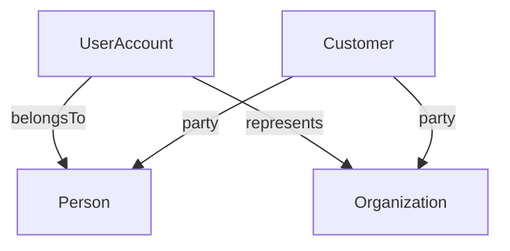
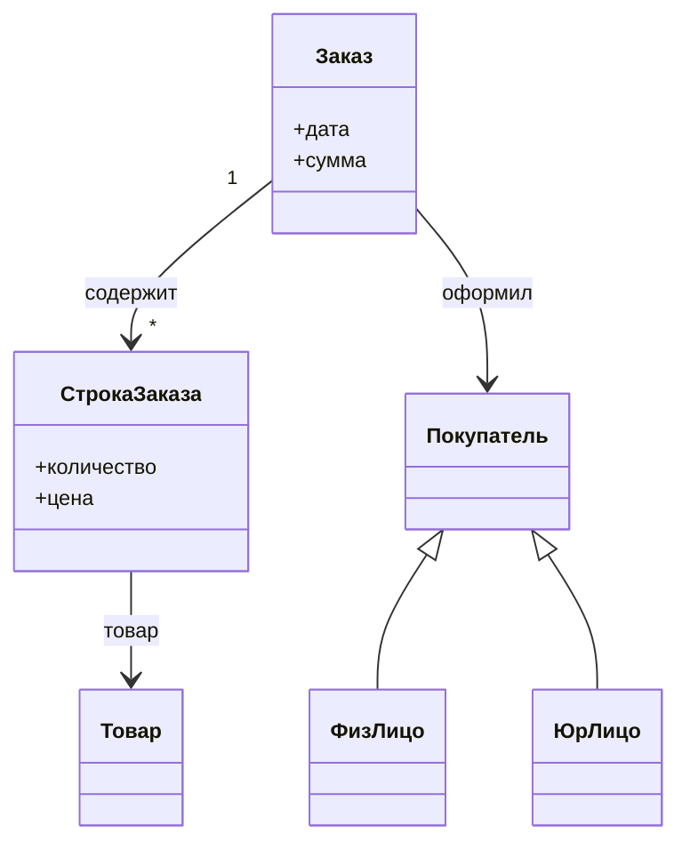
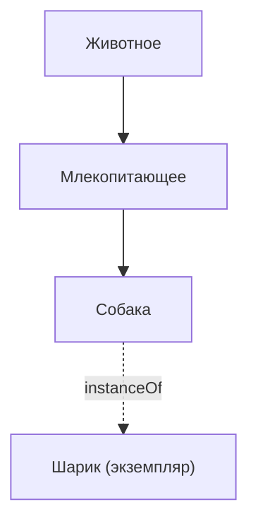
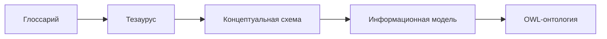
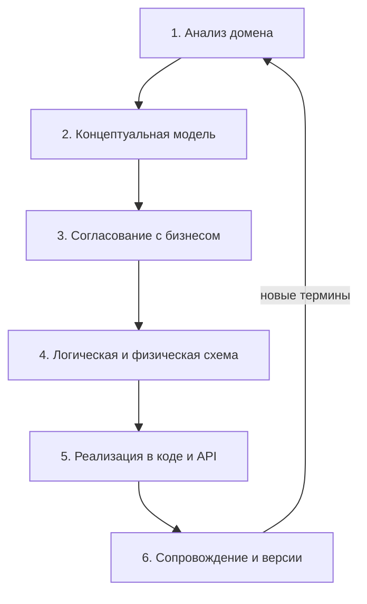
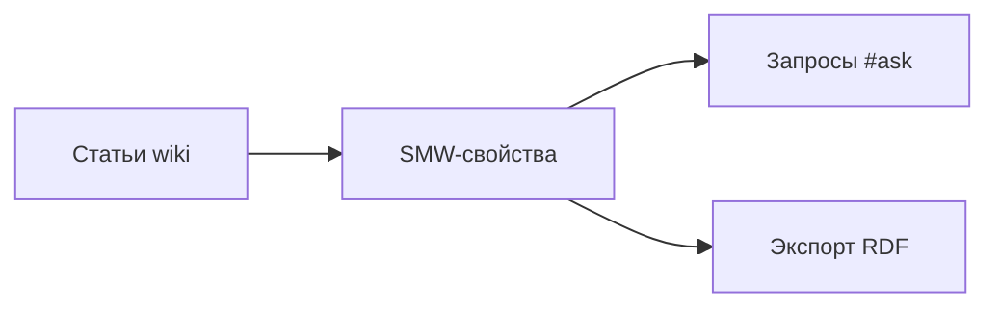
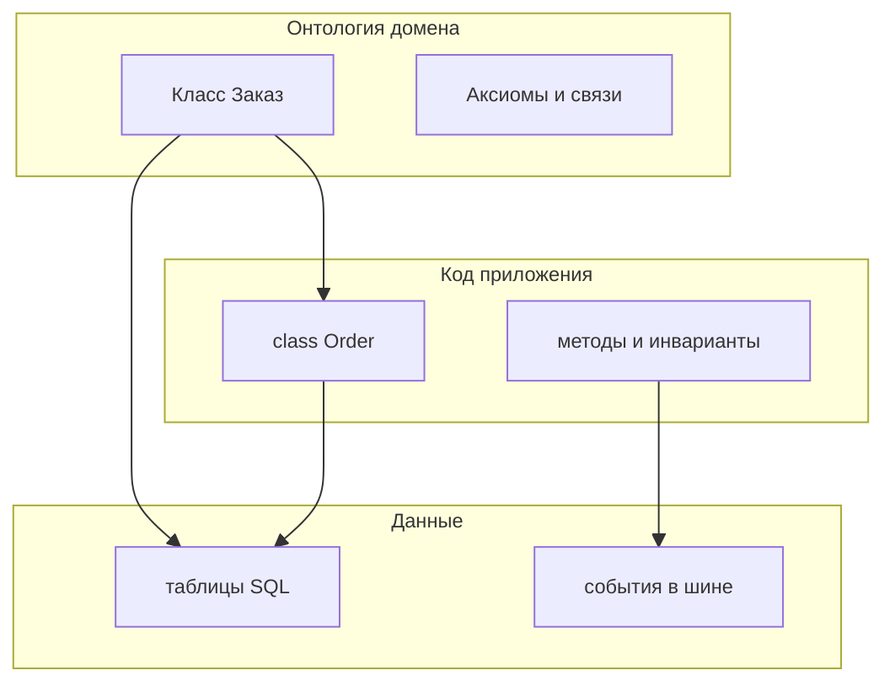
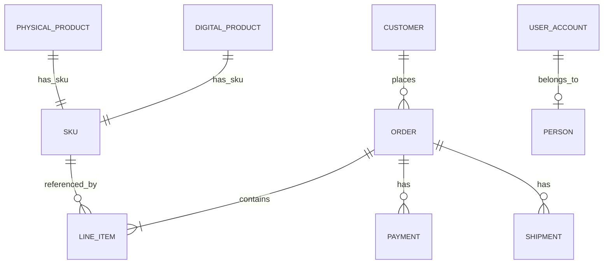
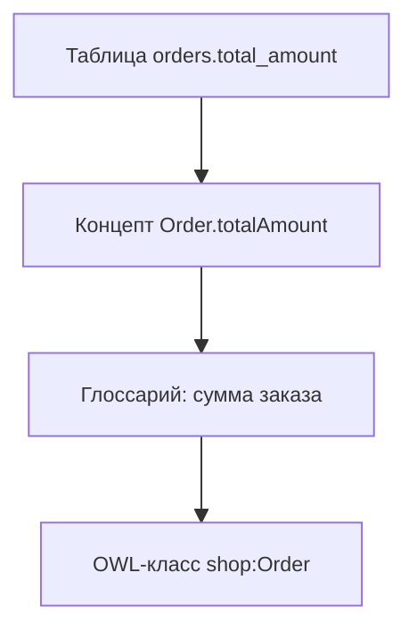

import ExternalPlayEmbed from '@site/src/components/ExternalPlayEmbed';


# Онтология в информатике

<ExternalPlayEmbed example="data-markup/ontology-graph-play" title="Онтология и граф знаний" minHeight={480} />


<div class="article-tags">
  <span class="tag tag-notrequired">НЕ ОБЯЗАТЕЛЬНО</span>
  <span class="tag tag-beginner">ДЛЯ НОВИЧКОВ</span>
</div>

<span class="complexity-badge">Архитектору</span>
<span class="complexity-badge">Аналитику</span>

В **информатике** слово **онтология** означает **явную, формальную спецификацию понятий** предметной области. Модель отвечает на вопросы:

- какие **классы** сущностей существуют;
- какие у них **свойства** и **отношения**;
- какие **ограничения** обязательны для всех участников обмена.

Это общая договорённость, по которой разные люди и программы понимают термины одинаково. Онтология похожа на **словарь предметной области с правилами** — структуру с иерархией, связями и логическими ограничениями поверх списка терминов.

Маршрут чтения в разделе [Мыслительная база](./intro):

- [Семантика](./326) — смысл знаков и данных;
- [Представление знаний](./327) — фреймы, сети, правила;
- **эта статья** — онтология как формальная модель понятий;
- [Концептуальные схемы](./329) — ER, UML, уровни схемы;
- [Семантический веб](./330) — RDF, OWL, графы знаний.

Обзор термина — [статья "Онтология" в Википедии](https://ru.wikipedia.org/wiki/Онтология_(информатика)). Контекст моделей и реальности — [Системы и модели](./22).

---

## Слово "онтология" в разных дисциплинах

Слово **онтология** (от греч. *ontos* — "сущее", *logos* — "учение") встречается в нескольких несовместимых значениях. В разговоре полезно уточнять контекст, иначе собеседники говорят о разном.

| Контекст | Что обычно имеют в виду | Связь с IT |
| --- | --- | --- |
| **Философия** | учение о бытии, категориях реальности, существовании объектов | задаёт язык для размышлений, редко напрямую в коде |
| **Психология и социология** | личная или групповая "картина мира" | встречается в статьях про [карьеру в ИИ](/encyclopedia/6-ai/6-06-primenenie-ii/2) |
| **Информатика** | формальная модель понятий предметной области | классы, свойства, аксиомы, обмен данными |
| **ООП** | иногда путают с **экземпляром** класса в коде | см. раздел про [объекты в ООП](#онтология-и-объекты-в-ооп) |

**Аналогия.** В философии онтология спрашивает "что вообще существует в мире?". В информатике вопрос уже сужен: "какие **типы вещей** мы признаём в **этой** задаче и как они связаны?". Модель не претендует описать всю вселенную — только **домен** (предметную область) конкретного продукта, отрасли или стандарта.

```text
Философская онтология     →  "Существуют ли универсалии?"
Онтология в информатике   →  "Что в нашей системе считается Заказом?"
Объект в Java/C#          →  экземпляр класса Order в памяти процесса
```

Три уровня не противоречат друг другу, но **не подменяют** друг друга. Диаграмма классов в [ООП](/encyclopedia/4-code-dev/4-08-oop/intro) описывает **реализацию**; онтология домена фиксирует **смысл**, которому реализация должна соответствовать.

---

## Определение для практики IT

**Онтология предметной области** (domain ontology) — структурированное описание:

- **классов** (типов сущностей);
- **экземпляров** (конкретных объектов, если они явно перечислены);
- **свойств** (атрибутов и связей);
- **аксиом** (правил, которые должны выполняться всегда);
- **таксономии** (иерархии "вид — род").

Цель — **согласованность смысла** между людьми, системами, документами и [API](/encyclopedia/2-system-network/2-09-osnovy-integratsionnogo-vzaimodeystviya/intro).

[Метаданные](/encyclopedia/1-basics/1-09-dannye-i-informatsiya/5) описывают **конкретный** ресурс:

- кто создал файл;
- когда изменён;
- какой формат.

Онтология описывает **типы вещей** в мире задачи:

- что вообще считается заказом;
- чем покупатель отличается от пользователя сайта;
- какие статусы допустимы.

[Концептуальная схема](./329) часто рисуется на доске для одной команды. **Логическая онтология** (OWL — Web Ontology Language) добавляет машиночитаемые ограничения и вывод. Подробности форматов — в [Семантическом вебе](./330).

---

## Пример расхождения терминов

Типичная интеграционная боль — одно слово, разные сущности.

```text
Сервис A: поле "клиент" = email пользователя
Сервис B: поле "клиент" = юридическое лицо с ИНН
Отчёт C:  JOIN по client_id склеивает несовместимые сущности
```

Синтаксис [JSON](/encyclopedia/3-data-markup/3-04-konfiguratsii-i-dannye/intro) корректен. Типы в OpenAPI совпали. **Семантика** ([статья 326](./326)) разошлась — отчёт показывает бессмысленные строки, а бизнес теряет доверие к цифрам.

**Онтология домена** вводит явные понятия:

| Класс | Смысл |
| --- | --- |
| `Person` | физическое лицо |
| `Organization` | юридическое лицо |
| `UserAccount` | учётная запись на сайте (логин, email) |
| `Customer` | роль покупателя в коммерческих отношениях |
| `CustomerAccount` | связь Customer с UserAccount или контактными данными |

Отношения:

- `UserAccount` **принадлежит** `Person` **или** представляет `Organization`;
- `Customer` **может ссылаться на** `Person` / `Organization`, но это другой смысл, чем "пользователь сайта";
- в [событиях](/encyclopedia/2-system-network/2-09-osnovy-integratsionnogo-vzaimodeystviya/intro) и API используются **стабильные идентификаторы** с префиксом типа (`person:…`, `org:…`).



После согласования онтологии поле `client_id` в разных сервисах либо переименовывают, либо снабжают явным типом в контракте. [Представление знаний](./327) помогает записать правила перехода статусов и проверки ролей.

### Мини-кейс — слияние CRM и биллинга

Компания купила стартап с отдельной CRM. В обеих системах есть сущность "Account".

| Система | Account означает |
| --- | --- |
| Legacy CRM | компанию-клиента с контрактом |
| Новый биллинг | лицевой счёт для начислений |

Без онтологии команда месяцами чинит ETL-скрипты. С онтологией вводят:

- `CommercialAccount` — договорные отношения;
- `BillingAccount` — финансовый счёт;
- отношение `CommercialAccount` **имеет** `BillingAccount` (1:N).

Миграция идёт по **смыслу**, а не по совпадению имён таблиц.

---

## Когда строят онтологию

| Ситуация | Цель формальной модели |
| --- | --- |
| Несколько команд описывают **один домен** | единый глоссарий и идентификаторы |
| Нужен **логический вывод** | из "Собака — млекопитающее" наследуются свойства |
| Регуляторика и обмен | медицина, финансы, госсектор |
| [Wiki](/encyclopedia/7-project/7-09-bazy-znaniy-i-zadachniki/11) или каталог данных | структурированный поиск, связи между статьями |
| Открытые данные и граф знаний | публикация в RDF, связь с внешними справочниками |
| Долгоживущий стандарт | отраслевые онтологии живут десятилетиями |

Для небольшого приложения с одной [БД](/encyclopedia/3-data-markup/3-05-osnovy-baz-dannyh/intro) часто хватает:

- глоссария в Confluence;
- [концептуальной схемы](./329);
- соглашений в коде ([DDD](/encyclopedia/7-project/7-03-metodologiya-i-zhiznennyy-tsikl-po/1)).

Полноценная логическая онтология (OWL) оправдана при **межсистемном** обмене, **машинном выводе** и **долгоживущих** доменах. Прикладному разработчику достаточно понимать **идею** классов и отношений; внедрение OWL — зона архитектора данных и предметных экспертов.

---

## Строительные блоки онтологии

Онтология собирается из повторяющихся элементов. Ниже — таблица и развёрнутые примеры.

| Элемент | Другое имя | Что это | Пример |
| --- | --- | --- | --- |
| **Класс** | concept, type | множество однотипных сущностей | `Заказ`, `Товар` |
| **Экземпляр** | individual, instance | конкретный объект | заказ № 1042 |
| **Свойство-данные** | data property | литеральное значение | `дата_создания`, `сумма` |
| **Свойство-объект** | object property | связь между экземплярами | `содержит`, `оформил` |
| **Аксиома** | axiom | правило модели | "у каждого Заказа ровно один Покупатель" |
| **Ограничение** | restriction | условие на класс или свойство | "Заказ содержит минимум одну строку" |

### Класс

**Класс** — абстрактный тип. Все экземпляры класса разделяют общие характеристики.

```text
Класс: Товар
  описание: позиция каталога, которую можно добавить в заказ
  не путать с: СтрокаЗаказа (конкретная позиция внутри заказа)
```

В [фреймах](./327) класс похож на шаблон с слотами. В [ER-модели](./329) — на сущность. В OWL класс имеет **URI** (Uniform Resource Identifier) для глобальной однозначности.

### Экземпляр

**Экземпляр** — конкретный представитель класса.

```text
Экземпляр: order-1042
  класс: Заказ
  дата_создания: 2026-06-15
  сумма: 4590.00
```

Экземпляры хранят в [базе](/encyclopedia/3-data-markup/3-05-osnovy-baz-dannyh/intro), в triple store, в [графе](./323). Класс "Москва" как **тип** города и город **Москва** как экземпляр — частая ошибка смешения (см. раздел [Частые ошибки](#частые-ошибки)).

### Свойства

**Свойство-данные** связывает экземпляр с литералом:

- строка;
- число;
- дата;
- булево значение.

**Свойство-объект** связывает два экземпляра:

```text
(order-1042, оформил, customer-alice)
(order-1042, содержит, line-7)
(line-7, ссылается_на_товар, sku-BOOK-42)
```

В RDF такие утверждения называют **триплетами** — подробнее в [330](./330).

### Аксиомы и ограничения

**Аксиома** — правило, которое модель утверждает всегда.

Примеры на псевдоязыке:

```text
АКСИОМА cardinality
  ДЛЯ КАЖДОГО x ИЗ Заказ
  СУЩЕСТВУЕТ РОВНО 1 y ИЗ Покупатель
  ТАКОЕ ЧТО (x, оформил, y)

АКСИОМА disjoint
  Классы ФизЛицо И ЮрЛицо НЕ ПЕРЕСЕКАЮТСЯ

АКСИОМА subClassOf
  СтрокаЗаказа ПОДКЛАСС ПозицияДокумента
```

**Reasoner** (модуль логического вывода) проверяет, не противоречат ли аксиомы друг другу, и **выводит** новые факты: если `Кошка` — подкласс `Млекопитающее`, а у млекопитающих есть свойство `дышит лёгкими`, то кошки наследуют это свойство.



---

## Таксономия

**Таксономия** — иерархия классов по отношению **"является подклассом"** (is-a, subClassOf). Родительский класс задаёт общие свойства; дочерние уточняют тип.

```text
Животное
  └── Млекопитающее
        └── Собака
              └── СлужебнаяСобака
```

Свойства наследуются вниз по дереву:

- у `Животное` может быть `имеет_вес`;
- `Собака` наследует `имеет_вес` без повторного объявления;
- у `СлужебнаяСобака` добавляют `специализация` (поиск, охрана).

### Таксономия и композиция

Таксономия описывает **типы**. Отдельно моделируют **части целого**:

| Отношение | Смысл | Пример |
| --- | --- | --- |
| **is-a** (подкласс) | "X — это вид Y" | Собака → Млекопитающее |
| **part-of** (часть) | "X входит в Y" | Колесо → Автомобиль |
| **instance-of** | "конкретный x — экземпляр X" | Шарик → Собака |



Путаница is-a и part-of порождает ложный вывод: "Колесо — вид Автомобиля" — логическая ошибка.

### Тезаурус SKOS

На ступени между глоссарием и OWL часто используют **SKOS** (Simple Knowledge Organization System) — стандарт связей "шире / уже", синонимов, связанных терминов. Тезаурус хорош для корпоративных словарей без тяжёлой логики. Логическая онтология строится поверх согласованных терминов.

---

## Ступени формальности

Онтологии редко появляются сразу в OWL. Обычно модель **зреет** по ступеням.

| Ступень | Содержание | Кто ведёт | Типичные инструменты |
| --- | --- | --- | --- |
| **Глоссарий** | термины и определения на естественном языке | аналитик, продакт | Confluence, Notion |
| **Тезаурус** | синонимы, "шире / уже", связанные термины | методолог, библиотекарь данных | SKOS, корпоративные словари |
| **Концептуальная схема** | сущности и связи для системы | аналитик, архитектор | ER, UML — [329](./329) |
| **Информационная модель** | сущности под конкретные приложения | команда разработки | DDL, JSON Schema |
| **Логическая онтология** | классы + аксиомы для машинного вывода | эксперт домена + архитектор данных | OWL, RDF — [330](./330) |



**OWL** (Web Ontology Language) — язык описания онтологий для [семантического веба](./330). Для многих продуктов достаточно согласованного глоссария и ER-диаграммы без OWL. Переход на OWL оправдан, когда:

- нужен автоматический вывод;
- данные публикуют для внешних потребителей;
- домен стандартизирован на уровне отрасли.

---

## Жизненный цикл онтологии в проекте

Онтология живёт вместе с продуктом. Её нельзя один раз нарисовать и забыть.



### 1. Анализ домена

Совместно с бизнесом выделяют понятия, события, роли. В [DDD](/encyclopedia/7-project/7-03-metodologiya-i-zhiznennyy-tsikl-po/1) это **ubiquitous language** — единый язык команды. Источники:

- интервью с экспертами;
- существующие регламенты;
- legacy-системы (с осторожностью — они отражают прошлое, а не идеал).

### 2. Концептуальная модель

Диаграмма домена **без привязки** к фреймворку и СУБД. Подробности — [329](./329). На этом этапе фиксируют кардинальности и спорные термины.

### 3. Согласование

Воркшопы с владельцем продукта. Спорные решения записывают в [ADR](/encyclopedia/7-project/7-20-adr-i-arhitekturnaya-pamyat/intro). Без владельца терминов модель устаревает после реорганизации.

### 4. Логическая и физическая схема

Таблицы, [SQL](/encyclopedia/3-data-markup/3-07-sql/intro), индексы, контракты [API](/encyclopedia/2-system-network/2-09-osnovy-integratsionnogo-vzaimodeystviya/intro). Имена в коде должны **отражать** онтологию, даже если физическая схема нормализована иначе.

### 5. Реализация

Классы в [ООП](/encyclopedia/4-code-dev/4-08-oop/intro), миграции, события. Онтология **дополняет** код: фиксирует смысл, которому код и данные должны соответствовать.

### 6. Сопровождение

Термины устаревают вместе с продуктом. **Мёртвые определения** в вики вреднее, чем их отсутствие: люди доверяют устаревшей схеме. Версионируют онтологию так же, как [миграции БД](/encyclopedia/3-data-markup/3-05-osnovy-baz-dannyh/intro).

| Артефакт | Где хранить | Как версионировать |
| --- | --- | --- |
| Глоссарий | wiki, репозиторий docs | pull request, ревью аналитика |
| OWL-файл | git | теги, changelog |
| ER-диаграмма | draw.io в репозитории | рядом с ADR |
| JSON Schema / OpenAPI | репозиторий сервиса | semver API |

---

## Отраслевые и публичные онтологии

Крупные домены опираются на **общие онтологии**. Их не пишут с нуля в каждом проекте — **импортируют** и **расширяют**.

### SNOMED CT (медицина)

**SNOMED CT** (Systematized Nomenclature of Medicine — Clinical Terms) — клиническая терминология:

- диагнозы;
- процедуры;
- анатомия;
- находки.

Миллионы понятий с кодами. Используют в электронных медкартах, страховых системах, обмене между клиниками. Задача онтологии — чтобы "инфаркт миокарда" в одной системе однозначно соответствовал тому же понятию в другой.

| Аспект | Значение для разработчика |
| --- | --- |
| Лицензирование | зависит от страны и роли |
| Идентификаторы | стабильные коды понятий |
| Связь с FHIR | ресурсы здравоохранения ссылаются на коды |

### FIBO (финансы)

**FIBO** (Financial Industry Business Ontology) — онтология финансовой отрасли от EDM Council:

- инструменты;
- контрагенты;
- сделки;
- юридические лица.

Применяют для согласования отчётности, риск-данных, регуляторного обмена. Граф понятий связывают с конкретными сообщениями ISO 20022 и внутренними справочниками.

### schema.org (веб)

[schema.org](https://schema.org) — словарь типов для разметки страниц:

- `Person`;
- `Product`;
- `Event`;
- `Organization`.

Поисковые системы используют разметку для расширенных сниппетов. Разработчик добавляет JSON-LD в HTML:

```json
{
  "@context": "https://schema.org",
  "@type": "Product",
  "name": "Книга по онтологиям",
  "offers": {
    "@type": "Offer",
    "price": "1200",
    "priceCurrency": "RUB"
  }
}
```

schema.org — **прагматичная** онтология: достаточно выразительна для SEO, без тяжёлого reasoner.

### Внутренний IT-домен

В [базе знаний](/encyclopedia/7-project/7-09-bazy-znaniy-i-zadachniki/11) компании можно ввести классы:

- `Сервис`;
- `Микросервис`;
- `SLA` (Service Level Agreement — соглашение об уровне сервиса);
- `Зависимость`;
- `Инцидент`.

Такая онтология связывает документацию, CMDB и дашборды. Без неё слово "сервис" означает и процесс в Kubernetes, и бизнес-функцию, и SOAP-endpoint.

### Сравнение отраслевых онтологий

| Онтология | Домен | Формальность | Типичный потребитель |
| --- | --- | --- | --- |
| SNOMED CT | медицина | очень высокая | клиники, страховщики |
| FIBO | финансы | высокая | банки, регуляторы |
| schema.org | веб, SEO | средняя | маркетинг, фронтенд |
| Внутренняя wiki | IT компании | низкая–средняя | инженеры, саппорт |

---

## Semantic MediaWiki (SMW)

**Semantic MediaWiki** (SMW) — расширение [MediaWiki](https://www.mediawiki.org/wiki/MediaWiki), которое превращает обычную вики в **структурированную базу знаний**.

Идея:

- в статье задают **свойства** (`Has author`, `Has status`);
- значения индексируются;
- можно строить **запросы** как у простой БД.

```text
Статья "Сервис платежей"
  [[Has type::Microservice]]
  [[Depends on::Service "Orders"]]
  [[SLA::99.9%]]
```

Запрос на странице каталога:

```text
{{#ask: [[Has type::Microservice]][[SLA::>99%]]
  |? Has owner
  |? Depends on
}}
```

| Плюс SMW | Ограничение |
| --- | --- |
| низкий порог входа для авторов | слабее OWL по логике |
| связи между статьями | масштабирование на миллионы страниц требует настройки |
| визуальное редактирование | миграция в RDF возможна, но требует дисциплины |

SMW — мост между **документацией** и **онтологией**. Команда без Protégé получает таксономию сервисов и зависимостей. При росте зрелости экспортируют в RDF и связывают с [графом знаний](./330).



---

## Protégé и введение в OWL

**Protégé** ([protege.stanford.edu](https://protege.stanford.edu/)) — бесплатный редактор онтологий. Поддерживает OWL 2, визуализацию классов, запуск **reasoner**.

### Основные действия в Protégé

1. Создать **онтологию** с базовым URI (например `http://example.org/shop#`).
2. Добавить **классы** (`Order`, `LineItem`, `Product`).
3. Задать **иерархию** (subClassOf).
4. Создать **свойства** (`hasCustomer`, `containsLine`).
5. Добавить **ограничения** (cardinality, domain, range).
6. Запустить **reasoner** (HermiT, Pellet) — проверка согласованности.
7. Экспортировать в **RDF/XML** или **Turtle**.

### Фрагмент OWL (Turtle)

```turtle
@prefix : <http://example.org/shop#> .
@prefix owl: <http://www.w3.org/2002/07/owl#> .
@prefix rdfs: <http://www.w3.org/2000/01/rdf-schema#> .
@prefix xsd: <http://www.w3.org/2001/XMLSchema#> .

:Order a owl:Class .
:Customer a owl:Class .
:hasCustomer a owl:ObjectProperty ;
    rdfs:domain :Order ;
    rdfs:range :Customer .

:Order owl:equivalentClass [
    a owl:Restriction ;
    owl:onProperty :hasCustomer ;
    owl:qualifiedCardinality "1"^^xsd:nonNegativeInteger ;
    owl:onClass :Customer
] .
```

Чтение фрагмента:

- `Order` и `Customer` — классы;
- `hasCustomer` — свойство-объект от заказа к покупателю;
- ограничение говорит: у каждого заказа **ровно один** покупатель типа `Customer`.

### Reasoner — что даёт

| Без reasoner | С reasoner |
| --- | --- |
| разработчик вручную помнит все подклассы | из `Dog subClassOf Mammal` выводятся свойства млекопитающих |
| противоречия всплывают в проде | пустой класс, невыполнимые ограничения — на этапе модели |
| дублирование правил в коде | часть проверок следует из онтологии |

Прикладному разработчику часто достаточно понимать **идею** классов и отношений. Внедрение OWL в runtime — зона архитектора данных. Подробности RDF, SPARQL, графов — [330](./330).

---

## Онтология и объекты в ООП

В [объектно-ориентированном программировании](/encyclopedia/4-code-dev/4-08-oop/intro) слово **объект** означает **экземпляр класса в памяти процесса**:

```csharp
var order = new Order { Id = 1042, Total = 4590m };
```

В онтологии **объект** (object) часто означает **ресурс в модели знаний** — экземпляр понятия домена, не обязательно строку в одной таблице.

| Понятие | ООП | Онтология домена |
| --- | --- | --- |
| Класс | `class Order` в коде | тип `Заказ` в модели |
| Объект / экземпляр | `order` в heap | `order-1042` как индивид |
| Наследование | переопределение методов | subClassOf, наследование свойств |
| Инкапсуляция | private поля | не всегда явна в OWL |
| Полиморфизм | виртуальные методы | вывод типов reasoner |

**Соответствие, которое помогает:**

- доменный класс `Order` в коде **реализует** понятие `Заказ` из онтологии;
- один доменный объект может **мапиться** на несколько таблиц;
- агрегат в DDD — граница согласованности, а не один OWL-класс.

**Расхождения, которые важно помнить:**

- в ООП класс несёт **поведение** (методы); онтология чаще описывает **структуру и правила**;
- в ООП наследование ради переиспользования кода; в онтологии subClassOf — про **смысл** ("все собаки — млекопитающие");
- объект в памяти **исчезает** после завершения процесса; онтологический индивид может иметь **постоянный URI**.



Практика: сначала согласуют **онтологию / концептуальную схему**, затем проектируют **доменные классы** и **схему БД**. Обратный порядок (сначала таблицы legacy) даёт модель, которая отражает **историю кода**, а не предметную область.

---

## Практикум — онтология интернет-магазина

Пошаговый пример для домена e-commerce. Цель — согласовать CRM, склад, сайт и аналитику.

### Шаг 1. Список терминов (глоссарий)

| Термин | Определение |
| --- | --- |
| Покупатель | сторона, которая размещает заказ |
| Пользователь | человек с учётной записью на сайте |
| Заказ | запрос на покупку с номером и статусом |
| Корзина | временный набор позиций до оформления |
| SKU | складская единица учёта товара |
| Отгрузка | факт передачи товара перевозчику |

### Шаг 2. Классы и таксономия

```text
Party (сторона)
  ├── Person
  └── Organization

Customer subClassOf Party
UserAccount — отдельный класс, не подкласс Customer

Product
  ├── PhysicalProduct
  └── DigitalProduct

Order
Cart
LineItem — позиция в заказе или корзине
Shipment
Payment
```

### Шаг 3. Свойства-объект

```text
Order.hasCustomer → Customer (1)
Order.contains → LineItem (1..*)
LineItem.refersToSku → SKU (1)
Order.hasPayment → Payment (0..*)
Order.hasShipment → Shipment (0..*)
UserAccount.belongsTo → Person (0..1)
Cart.ownedBy → UserAccount (1)
```

### Шаг 4. Свойства-данные

```text
Order.createdAt : dateTime
Order.totalAmount : decimal
LineItem.quantity : positiveInteger
LineItem.unitPrice : decimal
SKU.code : string
Payment.status : enum {pending, captured, failed}
```

### Шаг 5. Аксиомы

```text
1. У каждого Order ровно один Customer
2. У каждого LineItem ровно один SKU
3. Order.totalAmount = сумма (LineItem.quantity * LineItem.unitPrice)
4. DigitalProduct не имеет Shipment
5. Person и Organization — непересекающиеся классы
```

### Шаг 6. Диаграмма



### Шаг 7. События и API

События называют по онтологии:

```text
OrderPlaced { orderId, customerId, occurredAt }
LineItemAdded { orderId, lineItemId, sku, quantity }
PaymentCaptured { orderId, paymentId, amount }
```

Поля в OpenAPI **не** называют `client` без типа — используют `customerId` со ссылкой на класс `Customer`.

### Шаг 8. Проверка сценариями

| Сценарий | Что должно быть возможно в модели |
| --- | --- |
| Гость оформляет заказ без регистрации | `Customer` типа `Person` без `UserAccount` |
| Юрлицо платит по счёту | `Customer` типа `Organization`, отложенный `Payment` |
| Цифровая книга | `DigitalProduct`, без `Shipment` |
| Частичная отгрузка | несколько `Shipment` на один `Order` |

Если сценарий не ложится на модель — уточняют онтологию **до** миграций [SQL](./329).

---

## Частые ошибки

| Ошибка | Что происходит | Как избежать |
| --- | --- | --- |
| Один класс на все случаи | нельзя задать разные правила для типов | выделять подклассы и роли |
| Путаница класса и экземпляра | "Москва" как тип и как город в одном узле | отдельные URI для типа и индивида |
| Бессмысленные циклы is-a | `A subClassOf B subClassOf A` | ревью таксономии, reasoner |
| Копия legacy-таблицы 1:1 | модель отражает БД, а не домен | интервью с бизнесом, [329](./329) |
| Нет владельца терминов | модель не обновляют | назначить куратора глоссария |
| Слишком ранняя OWL | месяцы на формальности без пользы | начать с глоссария и ER |
| Игнорирование синонимов | "клиент", "покупатель", "заказчик" | тезаурус SKOS или явные sameAs |
| Онтология без примеров | абстрактные определения | кейсы и тестовые экземпляры |

### Кейс — "универсальный" класс Entity

Стартап создал класс `Entity` с полем `type` и JSON `payload`. Через год в `payload` десятки несовместимых форм. Reasoner бессилен: типы не формализованы. Решение — выделить классы `Order`, `Ticket`, `Invoice` с явными свойствами; `Entity` оставить только как технический антипаттерн legacy.

---

## Связь с соседними темами энциклопедии

| Тема | Статья | Связь |
| --- | --- | --- |
| Смысл данных | [326](./326) | онтология задаёт семантику полей |
| Фреймы и правила | [327](./327) | онтология — один из формализмов KR |
| ER и уровни схемы | [329](./329) | концептуальная схема рядом с онтологией |
| RDF и графы | [330](./330) | сериализация и запросы |
| Графы | [323](./323) | онтология как размеченный граф |
| Множества и ключи | [321](./321) | основа ограничений |
| SQL | [7](/encyclopedia/3-data-markup/3-07-sql/intro) | физическое хранение |
| Интеграции | [2-09](/encyclopedia/2-system-network/2-09-osnovy-integratsionnogo-vzaimodeystviya/intro) | контракты по понятиям домена |
| DDD | [7-03](/encyclopedia/7-project/7-03-metodologiya-i-zhiznennyy-tsikl-po/1) | ubiquitous language |
| Метаданные | [5](/encyclopedia/1-basics/1-09-dannye-i-informatsiya/5) | описание ресурсов, не типов |
| ИИ и RAG | [6-06](/encyclopedia/6-ai/6-06-primenenie-ii/intro) | граф знаний как контекст |

---

## Машиночитаемые форматы и обмен

Онтологии публикуют в форматах, которые программы читают без "догадок" по имени поля.

| Формат | Роль | Когда выбирать |
| --- | --- | --- |
| **RDF** (Resource Description Framework) | граф утверждений-триплетов | обмен между системами, Linked Data |
| **OWL** 2 | классы, свойства, аксиомы | логический вывод, строгие ограничения |
| **RDFS** | базовые классы и свойства | лёгкая схема поверх RDF |
| **JSON-LD** | JSON с `@context` | веб-API, schema.org |
| **Turtle** | компактный текст RDF | хранение в git, ревью diff |

Пример связи заказа и покупателя в Turtle (см. [330](./330)):

```turtle
@prefix shop: <http://example.org/shop#> .

shop:order-1042 a shop:Order ;
    shop:hasCustomer shop:customer-alice ;
    shop:createdAt "2026-06-15T10:00:00"^^xsd:dateTime .

shop:customer-alice a shop:Person ;
    shop:legalName "Алиса Иванова" .
```

**Triple store** хранит миллионы таких строк и отвечает на **SPARQL**-запросы. Это другой путь, чем [реляционная БД](/encyclopedia/3-data-markup/3-05-osnovy-baz-dannyh/intro), хотя маппинг OWL → таблицы возможен.

### Аннотации и человекочитаемый текст

У классов и свойств задают **метки** и **комментарии** на разных языках:

```turtle
shop:Order rdfs:label "Заказ"@ru ;
    rdfs:label "Order"@en ;
    rdfs:comment "Коммерческое обязательство на поставку товаров или услуг."@ru .
```

Reasoner опирается на логику; люди читают `rdfs:label` в Protégé и в документации.

---

## Вопросы для ревью онтологии

Перед публикацией версии модели полезно пройти чеклист:

- [ ] У каждого термина из глоссария есть класс или явное объяснение, почему это свойство
- [ ] Нет циклов subClassOf без обоснования
- [ ] Кардинальности согласованы с бизнес-правилами
- [ ] Примеры экземпляров для спорных классов
- [ ] Синонимы зафиксированы (тезаурус или `owl:sameAs`)
- [ ] Идентификаторы в API совпадают с URI или таблицей соответствия
- [ ] Reasoner завершился без UNSAT (неудовлетворимой модели)
- [ ] Владелец терминов подписал релиз

---

## Дополнительные кейсы из практики

### Кейс — логистика и статусы

Склад использовал статус `SHIPPED`, сайт — `SENT`, аналитика — `DISPATCHED`. В онтологии ввели класс `ShipmentStatus` с перечислением и **маппинг** legacy-строк:

```text
SHIPPED  → ontology:Dispatched
SENT     → ontology:Dispatched
DISPATCHED → ontology:Dispatched
```

Новые сервисы пишут только канонический код. Старые адаптируют на границе.

### Кейс — образование и курсы

Университет объединил LMS и регистратуру. Термин "студент" в одной системе — login, в другой — запись в зачётке. Онтология:

- `Person`;
- `Student` как **роль** (`Role`), назначаемая на учебный период;
- `Enrollment` связывает `Student` и `CourseOffering`.

Роль можно снять, не удаляя `Person` — модель переживает отчисление и повторный приём.

### Кейс — IoT и датчики

Производитель описывает `Device`, `Sensor`, `Reading`. Облако добавляет `Tenant`, `AlertRule`. Без онтологии поле `value` то температура, то влажность, то счётчик. Свойства типизируют через `QuantityKind` и единицы измерения (QUDT и подобные словари).

---

## Версионирование и эволюция онтологии

Онтология меняется так же, как [схема БД](./329). Без дисциплины версий интеграции ломаются тихо.

| Стратегия | Когда применять | Риск |
| --- | --- | --- |
| **Семантическое версионирование** (semver для OWL) | публичные онтологии | потребители должны следить за changelog |
| **Параллельные URI** (`/v1/Order`, `/v2/Order`) | долгоживущие стандарты | дублирование определений |
| **Обратная совместимость** (только добавление) | внутренние API и графы | модель раздувается |
| **Deprecation** старых классов | переименование терминов | миграционные скрипты |

```text
Версия 1.0: класс Client (email обязателен)
Версия 1.1: добавлен подкласс CorporateClient (ИНН обязателен)
Версия 2.0: Client переименован в Customer, старый URI — owl:deprecated
```

Правила для команды:

- каждое изменение термина — запись в changelog;
- breaking change согласуют с потребителями [API](/encyclopedia/2-system-network/2-09-osnovy-integratsionnogo-vzaimodeystviya/intro);
- тестовые экземпляры обновляют вместе с онтологией;
- [ADR](/encyclopedia/7-project/7-20-adr-i-arhitekturnaya-pamyat/intro) для спорных развилок.

---

## Каталог данных и онтология

В крупных компаниях **Data Catalog** (каталог данных) индексирует таблицы, колонки, lineage. Онтология даёт **слой смысла** поверх технических имён.



| Уровень каталога | Что хранит |
| --- | --- |
| Технический | имя таблицы, тип столбца, владелец |
| Бизнес | определение метрики, формула |
| Онтологический | URI класса, связи, ограничения |

Без связи `orders.client_id` → понятие `Customer` каталог превращается в телефонную книгу таблиц. Аналитики снова интерпретируют поля по-своему. Связь с [метаданными](/encyclopedia/1-basics/1-09-dannye-i-informatsiya/5) — каталог описывает **экземпляры данных**, онтология — **типы**.

---

## Онтология и аналитика

В BI-отчётах дублируются метрики с разными формулами. Онтология задаёт **канонические определения**:

```text
Концепт: GrossMerchandiseValue (GMV)
  определение: сумма line_items.unit_price * quantity
               для заказов в статусе paid или shipped
               за выбранный период
  не включает: возвраты, налоги, доставку (отдельные концепты)
```

Дашборд ссылается на URI или код концепта, а не на произвольный SQL из витрины. При изменении правила обновляют **одно** определение в онтологии и lineage в каталоге.

---

## Краткое резюме

**Онтология в информатике** — формальная договорённость о понятиях предметной области: классы, свойства, отношения, таксономия и аксиомы. Она отличается от философской онтологии, от метаданных конкретных файлов и от объектов в памяти [ООП](/encyclopedia/4-code-dev/4-08-oop/intro)-процесса.

Строят модель по ступеням — от глоссария к OWL. Живут ей в [жизненном цикле](#жизненный-цикл-онтологии-в-проекте) продукта. Опираются на отраслевые стандарты (SNOMED, FIBO, schema.org) или на wiki с SMW. Инструменты вроде Protégé и reasoner проверяют согласованность. Практикум на интернет-магазине показывает путь от терминов до событий API.

Дальше по маршруту — [Концептуальные схемы и информационные модели](./329) и [Семантический веб и графы знаний](./330).

---

## Связанные статьи

- [Концептуальные схемы и информационные модели](./329)
- [Семантический веб и графы знаний](./330)
- [Семантика](./326) · [Представление знаний](./327)
- [Системы и модели](./22) — объект, модель, реальность
- [Основы баз данных](/encyclopedia/3-data-markup/3-05-osnovy-baz-dannyh/intro)
- [Проектирование и архитектура](/encyclopedia/7-project/7-06-proektirovanie-i-arhitektura/intro)

---

## Глоссарий кратких терминов статьи

| Термин | Расшифровка |
| --- | --- |
| **OWL** | Web Ontology Language — язык веб-онтологий |
| **RDF** | Resource Description Framework — каркас описания ресурсов |
| **URI** | Uniform Resource Identifier — глобальный идентификатор ресурса |
| **SKOS** | Simple Knowledge Organization System — тезаурусы и иерархии терминов |
| **SMW** | Semantic MediaWiki — семантические свойства в wiki |
| **SNOMED CT** | Systematized Nomenclature of Medicine — Clinical Terms |
| **FIBO** | Financial Industry Business Ontology |
| **Reasoner** | программа логического вывода над OWL |
| **subClassOf** | отношение "подкласс" в таксономии |
| **Triple** | утверждение субъект — предикат — объект в RDF |

---
