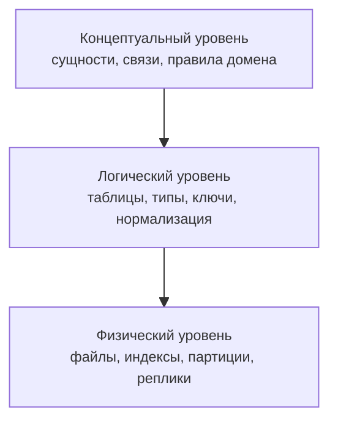
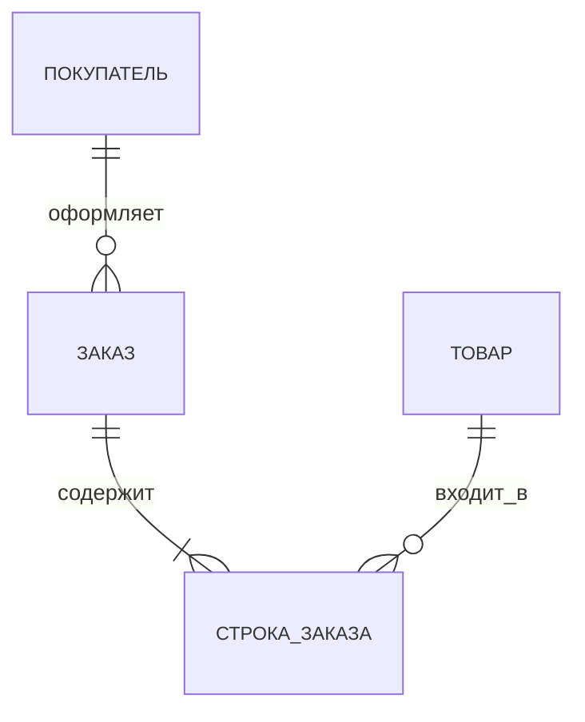
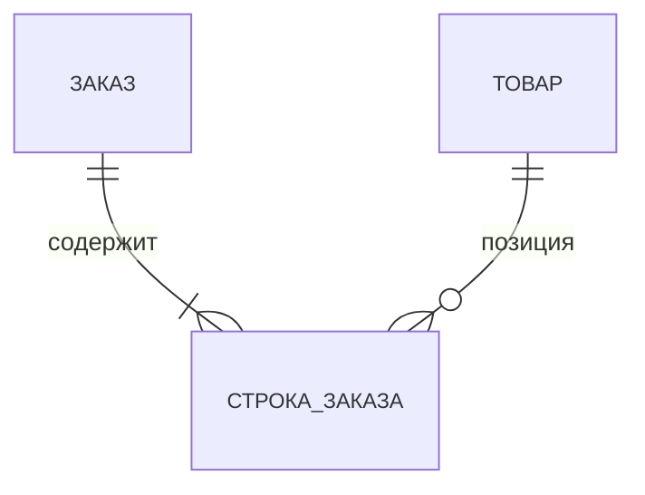
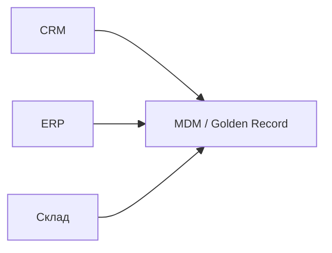
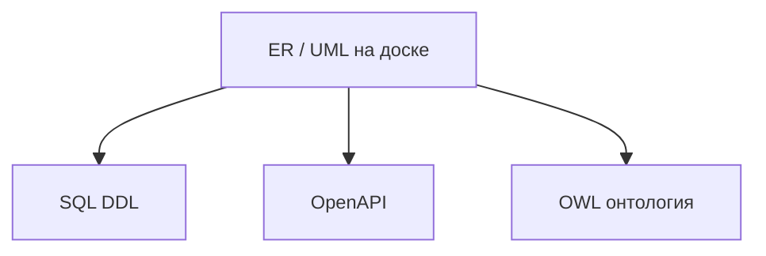
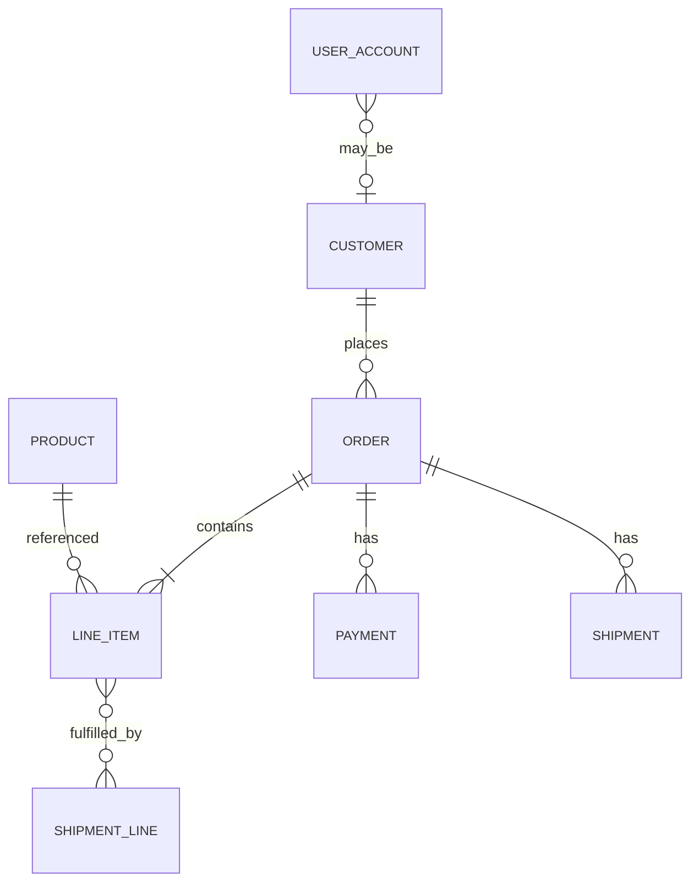
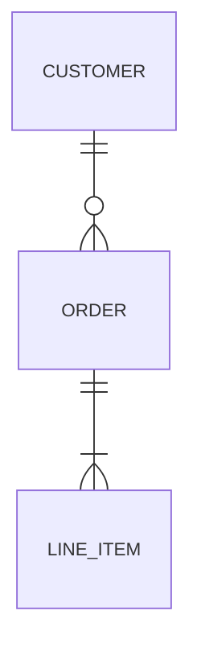

# Концептуальные схемы и информационные модели

<div class="article-tags">
  <span class="tag tag-notrequired">НЕ ОБЯЗАТЕЛЬНО</span>
  <span class="tag tag-beginner">ДЛЯ НОВИЧКОВ</span>
</div>

<span class="complexity-badge">Архитектору</span>
<span class="complexity-badge">Аналитику</span>

**Информационная модель** — описание того, какие **сущности**, **атрибуты** и **связи** нужны системе, чтобы отражать предметную область. **Концептуальная схема** — верхний уровень такой модели: **что существует в мире задачи**, без деталей [СУБД](/encyclopedia/3-data-markup/3-08-upravlenie-rsubd/intro), индексов и форматов файлов.

Маршрут в разделе [Мыслительная база](./intro):

- [Семантика](./326) — смысл полей и терминов;
- [Представление знаний](./327) — фреймы, сети, правила;
- [Онтология](./328) — формальные понятия и вывод;
- **эта статья** — ER, UML, уровни схемы, путь к SQL;
- [Семантический веб](./330) — RDF, OWL, графы знаний.

Материал перекликается со статьями [Концептуальная схема](https://ru.wikipedia.org/wiki/Концептуальная_схема) и [Информационная модель](https://ru.wikipedia.org/wiki/Информационная_модель) в Википедии. Рядом по смыслу — [реляционная алгебра](./322) и [множества и отношения](./321). Контекст моделей — [Системы и модели](./22).

---

## Концепция и таблицы — разные уровни

Если сразу рисовать таблицы, команда может не согласовать **смысл** с бизнесом. Типичный симптом — поле `status` с десятком несовместимых трактовок в отчётах.

**Аналогия.** Концептуальная схема — **карта города** с районами и дорогами. Логическая схема — **план зданий** с этажами и комнатами. Физическая схема — **как построен фундамент и где стоят лифты**. Строить фундамент без карты можно, но риск перепутать улицы высок.

Рекомендуемый порядок:

1. согласовать концепцию с владельцем продукта;
2. спроектировать логическую модель под [SQL](/encyclopedia/3-data-markup/3-07-sql/intro) или другую модель данных;
3. оптимизировать физический уровень под нагрузку.

Ввод по хранению — [Основы баз данных](/encyclopedia/3-data-markup/3-05-osnovy-baz-dannyh/intro). Смысл полей — [Семантика](./326).

---

## Три уровня схемы данных

Классическое разделение восходит к стандарту **ANSI/SPARC** (трёхуровневая архитектура) и на высоком уровне согласуется с framework **Zachman** — матрицей вопросов "что / как / где" для предприятия.



| Уровень | Главный вопрос | Что игнорируем намеренно | Типичный артефакт |
| --- | --- | --- | --- |
| **Концептуальный** | О чём говорим? | движок БД, язык программирования | ER-диаграмма, domain model, глоссарий |
| **Логический** | Как хранить в выбранной модели данных? | конкретный сервер, диск | DDL, ER→таблицы, JSON Schema |
| **Физический** | Как быстро и надёжно на носителе? | чистота доменной терминологии | индексы, шардирование, сжатие, реплики |

### Концептуальный уровень — подробнее

Фиксируют **понятия предметной области**:

- сущности (Заказ, Товар, Покупатель);
- атрибуты (дата, сумма);
- связи (оформляет, содержит);
- бизнес-правила на естественном языке ("заказ нельзя удалить после оплаты").

Не фиксируют:

- `VARCHAR(255)`;
- UUID или auto-increment;
- названия индексов.

Аудитория — аналитик, продакт, архитектор, эксперт домена. Артефакт должен быть понятен **без знания SQL**.

### Логический уровень — подробнее

Выбирают **модель данных**:

- реляционные таблицы;
- документы JSON;
- графовые узлы и рёбра;
- колоночные семейства.

На этом уровне появляются:

- первичные и внешние ключи;
- типы столбцов;
- уникальные ограничения;
- [нормализация](/encyclopedia/3-data-markup/3-05-osnovy-baz-dannyh/intro) — устранение избыточности.

Логическая схема **всё ещё** переносима между PostgreSQL и MySQL, хотя детали типов могут отличаться.

### Физический уровень — подробнее

Оптимизация под конкретную [СУБД](/encyclopedia/3-data-markup/3-08-upravlenie-rsubd/intro) и железо:

- B-tree и GIN-индексы;
- партиционирование по дате;
- реплики чтения;
- сжатие страниц;
- размещение на SSD или object storage.

Изменения на физическом уровне **не должны** менять смысл концептуальной модели. Если меняется смысл — это ревизия концепции.

### Три уровня и несколько сервисов

В [микросервисной архитектуре](/encyclopedia/7-project/7-06-proektirovanie-i-arhitektura/intro) у каждого сервиса своя логическая и физическая схема, но **концептуальный** глоссарий предприятия один.

```text
Концепция (общая):     Customer, Order, Product
Сервис заказов:        таблицы orders, line_items
Сервис каталога:       таблицы products, categories
Сервис клиентов:       таблицы parties, contacts
```

Согласование — через [интеграции](/encyclopedia/2-system-network/2-09-osnovy-integratsionnogo-vzaimodeystviya/intro) и [онтологию](./328), а не через общую БД.

---

## Концептуальная схема как карта домена

В [глоссарии](/glossary/К#концептуальная-схема) концептуальная схема определена как **семантическая сеть понятий** с правилами связи — карта всей предметной области.

```text
СУЩНОСТЬ "Заказ"
  атрибуты
    — номер
    — дата
    — сумма
  связи
    — оформлен Покупателем (один к одному)
    — содержит СтрокиЗаказа (один ко многим)
    — имеет Статус из справочника

СУЩНОСТЬ "Покупатель"
  специализация: ФизЛицо | ЮрЛицо
```

Такую схему обсуждают с аналитиком и владельцем продукта **до** выбора `VARCHAR(255)` и движка БД.

### Правила на концептуальном уровне

| Тип правила | Пример |
| --- | --- |
| Структурное | у заказа минимум одна строка |
| Инвариант | сумма заказа неотрицательна |
| Жизненный цикл | из "черновик" можно в "оплачен", из "отменён" — нельзя |
| Идентификация | номер заказа уникален в пределах компании |

Правила потом переносят в код, ограничения SQL и контракты API. [Представление знаний](./327) позволяет часть правил записать явно для вывода.

---

## ER-модель — пошаговое построение

**ER-модель** (Entity-Relationship — "сущность–связь", Питер Чен, 1976) — распространённый язык концептуального проектирования.

### Шаг 1. Собрать существительные из требований

Из user story "покупатель оформляет заказ с несколькими товарами":

- Покупатель
- Заказ
- Товар
- (неявно) Строка заказа

### Шаг 2. Отфильтровать атрибуты и сущности

| Кандидат | Сущность или атрибут? |
| --- | --- |
| email покупателя | атрибут сущности Покупатель |
| дата заказа | атрибут Заказ |
| количество в позиции | атрибут СтрокаЗаказа |
| "срочный" | атрибут или тип заказа — уточнить с бизнесом |

Если у объекта **собственная идентичность** и на него ссылаются — это сущность. Если описывает другое — атрибут.

### Шаг 3. Нарисовать сущности (прямоугольники)

```text
┌─────────────┐  ┌─────────────┐  ┌─────────────┐
│  Покупатель │  │    Заказ    │  │    Товар    │
└─────────────┘  └─────────────┘  └─────────────┘
```

### Шаг 4. Добавить атрибуты (овалы или список внутри прямоугольника)

В нотации Chen — овалы. В практике чаще список внутри блока:

```text
Покупатель: имя, email, тип (физ/юр)
Заказ: номер, дата, сумма
Товар: артикул, название, цена
СтрокаЗаказа: количество, цена_за_единицу
```

### Шаг 5. Связи (ромбы или подписи на линиях)

```text
Покупатель —[оформляет]— Заказ
Заказ —[содержит]— СтрокаЗаказа
Товар —[входит в]— СтрокаЗаказа
```

### Шаг 6. Кардинальности (см. следующий раздел)

### Шаг 7. Проверить сценариями

Прогнать три реальных кейса из бизнеса. Если диаграмма не позволяет описать кейс — вернуться к шагу 1.

### Элементы ER в таблице

| Элемент | На диаграмме Chen | Смысл |
| --- | --- | --- |
| **Сущность** | прямоугольник | объект домена (Заказ, Товар) |
| **Атрибут** | овал | свойство сущности (дата, сумма) |
| **Связь** | ромб | отношение между сущностями |
| **Кардинальность** | 1:1, 1:N, M:N | сколько экземпляров с каждой стороны |
| **Слабая сущность** | двойной контур | идентификатор зависит от родителя (СтрокаЗаказа без Заказа не существует) |



---

## Кардинальность и кратность

**Кардинальность** отвечает на вопрос "сколько экземпляров B допустимо для одного A".

| Обозначение | Читается | Пример |
| --- | --- | --- |
| **1:1** | один к одному | Паспорт — Владелец |
| **1:N** (1:M) | один ко многим | Заказ — СтрокиЗаказа |
| **M:N** | многие ко многим | Студент — Курс (без промежуточной сущности) |

### Минимальная и максимальная кратность

Часто уточняют **обязательность**:

```text
Заказ (1,1) —— (0,*) СтрокаЗаказа
  у каждого заказа от нуля строк? → бизнес сказал "минимум 1" → (1,*)
```

Запись `(min, max)`:

| Связь | min | max | Смысл |
| --- | --- | --- | --- |
| Заказ — Покупатель | 1 | 1 | у заказа ровно один покупатель |
| Заказ — Строка | 1 | * | минимум одна строка |
| Товар — Отзыв | 0 | * | отзывов может не быть |

### Связь многие-ко-многим и промежуточная сущность

**Связь многие-ко-многим** на логическом уровне раскладывают через **ассоциативную сущность**.

```text
Студент M:N Курс   →   ЗаписьНаКурс (student_id, course_id, grade)
Товар M:N Заказ    →   СтрокаЗаказа (order_id, product_id, qty, price)
```

Таблица `строка_заказа` связывает заказ и товар и хранит **собственные** атрибуты связи (количество, цена за единицу).



### Идентифицирующая связь

Если дочерняя сущность **не существует** без родителя, ключ строки включает ключ заказа:

```text
СтрокаЗаказа: (order_id, line_no) — составной первичный ключ
```

На концептуальном уровне это "слабая сущность"; на логическом — составной PK или суррогатный `id` плюс FK.

---

## UML и ER в одной задаче

**Диаграмма классов UML** (Unified Modeling Language — унифицированный язык моделирования) на этапе анализа часто играет роль концептуальной модели.

| Критерий | ER (Chen / crow's foot) | UML class diagram |
| --- | --- | --- |
| Фокус | данные и связи | структура + при необходимости поведение |
| Нотация связей | ромб, кратность 1:N | ассоциация, агрегация, композиция |
| Аудитория | аналитики БД, архитекторы данных | разработчики [ООП](/encyclopedia/4-code-dev/4-08-oop/intro) |
| Наследование | специализация сущностей | обобщение с подклассами |
| Типичный выход | таблицы SQL | классы Java, C#, Kotlin |

**ER** нагляднее, когда моделируют **только данные** и отчётность. **UML** привычнее, если модель тянут в код на Java или C#.

### Агрегация и композиция в UML

| Связь | Смысл | Пример |
| --- | --- | --- |
| **Ассоциация** | общая связь | Покупатель оформляет Заказ |
| **Агрегация** (пустой ромб) | целое и части, части могут жить отдельно | Отдел и Сотрудники |
| **Композиция** (закрашенный ромб) | части не существуют без целого | Заказ и СтрокиЗаказа |

На ER это обычно выражают обязательностью и идентифицирующей связью.

### Когда использовать оба

- ER на воркшопе с бизнесом;
- UML в репозитории рядом с кодом;
- явная таблица соответствия "сущность ER → класс UML → таблица SQL".

---

## Domain model в DDD

**Domain model** в [DDD](/encyclopedia/7-project/7-03-metodologiya-i-zhiznennyy-tsikl-po/1) (Domain-Driven Design — проектирование, управляемое предметной областью) — концептуальная модель **ядра** продукта в коде и в языке команды.

Принципы:

- **Ubiquitous language** — те же слова в диаграмме, в коде и в разговоре с бизнесом;
- **Bounded context** — внутри контекста модель цельна; между контекстами — явные переводы терминов;
- **Агрегат** — кластер сущностей с корнем (например `Order` + `LineItem`) и границей транзакции.

```text
Контекст "Продажи"
  Aggregate Order
    - OrderId
    - CustomerId (ссылка на контекст CRM)
    - Lines[]
    - метод Submit(), Pay()

Контекст "Каталог"
  Aggregate Product
    - SKU, title, price
```

Концептуальная схема на доске и domain model в коде **должны совпадать по терминам**. Расхождение порождает баги на границе слоёв. Связь с [онтологией](./328) — онтология может охватывать несколько bounded context и задавать глобальные определения.

---

## Модель предприятия

На уровне всей организации информационная модель шире одной базы.

Что входит:

- потоки между CRM, ERP, складом;
- **мастер-данные** (MDM — Master Data Management, эталонные справочники клиентов и товаров);
- границы [микросервисов](/encyclopedia/7-project/7-06-proektirovanie-i-arhitektura/intro);
- роли владельцев данных (data steward).



Связанные подходы:

- **CIM** (Common Information Model) — унификация описания инфраструктуры;
- диаграммы C4 и контекста — [проектирование и архитектура](/encyclopedia/7-project/7-06-proektirovanie-i-arhitektura/intro);
- **контракты API** — продолжение модели на границе сервиса;
- **ArchiMate** — слои бизнес / приложение / технология.

Концептуальная схема одного сервиса должна **вписываться** в общий глоссарий терминов предприятия. Иначе "клиент" в CRM и "клиент" в биллинге останутся разными сущностями.

### Кейс — розничная сеть

- Центральный MDM хранит `Product` и `Store`.
- Интернет-магазин добавляет `WebCategory` и `Promotion`.
- Касса POS знает `ReceiptLine`, но не дублирует название товара — тянет из MDM по SKU.

Концептуальная схема **на уровне предприятия** показывает `Product` один раз; сервисные схемы — только расширения.

---

## От концепции к таблицам SQL

Типичная последовательность маппинга ER → реляционная модель:

1. **Сущность** → таблица (`orders`, `customers`, `products`).
2. **Атрибут** → столбец с типом (`created_at TIMESTAMPTZ`, `total NUMERIC(12,2)`).
3. **1:N** → внешний ключ на стороне "многих" (`line_items.order_id → orders.id`).
4. **M:N** → промежуточная таблица (`line_items` для заказ–товар).
5. **1:1** → FK с UNIQUE или общий PK.
6. **Справочник** → отдельная таблица + FK (`order_status_id`).

### Псевдокод маппинга

```text
ДЛЯ КАЖДОЙ сущности E
  СОЗДАТЬ таблицу E_plural
  ДОБАВИТЬ суррогатный ключ id ИЛИ естественный ключ из атрибутов

ДЛЯ КАЖДОЙ связи 1:N от A к B
  ДОБАВИТЬ в таблицу B столбец a_id NOT NULL REFERENCES A(id)

ДЛЯ КАЖДОЙ связи M:N между A и B
  СОЗДАТЬ таблицу A_B с (a_id, b_id) и атрибутами связи

ДЛЯ подтипов (ФизЛицо / ЮрЛицо)
  ВАРИАНТ 1: одна таблица customers + колонка type + nullable поля
  ВАРИАНТ 2: таблица parties + person_details / org_details
```

### Пример DDL для фрагмента заказа

```sql
CREATE TABLE customers (
    id          BIGSERIAL PRIMARY KEY,
    type        TEXT NOT NULL CHECK (type IN ('person', 'organization')),
    email       TEXT,
    legal_name  TEXT
);

CREATE TABLE orders (
    id           BIGSERIAL PRIMARY KEY,
    customer_id  BIGINT NOT NULL REFERENCES customers(id),
    created_at   TIMESTAMPTZ NOT NULL DEFAULT now(),
    total_amount NUMERIC(12, 2) NOT NULL
);

CREATE TABLE line_items (
    id          BIGSERIAL PRIMARY KEY,
    order_id    BIGINT NOT NULL REFERENCES orders(id),
    product_id  BIGINT NOT NULL REFERENCES products(id),
    quantity    INT NOT NULL CHECK (quantity > 0),
    unit_price  NUMERIC(12, 2) NOT NULL,
    UNIQUE (order_id, product_id)
);
```

[Реляционная алгебра](./322) описывает операции над получившимися таблицами; [множества и отношения](./321) — основу ключей и функциональных зависимостей.

### Естественный и суррогатный ключ

| Подход | Плюс | Минус |
| --- | --- | --- |
| **Естественный** (ИНН, номер заказа) | осмыслен для людей | может измениться, составной |
| **Суррогатный** (`id` BIGSERIAL) | стабилен, узкий FK | без JOIN непонятен бизнесу |

Подробнее — [естественный ключ](/encyclopedia/3-data-markup/3-05-osnovy-baz-dannyh/1). На концептуальном уровне фиксируют **бизнес-идентификатор**; на логическом часто добавляют суррогат.

---

## Нормализация — куда смотреть дальше

**Нормализация** — приведение логической схемы к нормальным формам (1NF, 2NF, 3NF, BCNF и далее), чтобы убрать избыточность и аномалии обновления.

На концептуальном уровне **не** считают нормальные формы — проверяют смысл. На логическом:

- повторяющиеся группы полей → отдельная таблица;
- частичные зависимости от составного ключа → вынос;
- транзитивные зависимости → справочники.

```text
Плохо: order (id, customer_name, customer_email, product_name, qty)
Хорошо: orders + customers + products + line_items
```

Полный разбор — [Основы баз данных](/encyclopedia/3-data-markup/3-05-osnovy-baz-dannyh/intro). Денормализация на **физическом** уровне (кэш суммы в `orders.total_amount`) допустима, если правила синхронизации ясны.

---

## API как граница схемы

В распределённых системах **контракт API** — продолжение информационной модели на границе сервиса.

| Артефакт | Уровень | Роль |
| --- | --- | --- |
| OpenAPI / GraphQL schema | логический (внешний) | какие сущности видны потребителю |
| JSON Schema тела сообщения | логический | форма полей события |
| Protobuf `.proto` | логический | бинарный контракт gRPC |
| Версия API `v1`, `v2` | жизненный цикл | эволюция без поломки клиентов |

```text
Внутри сервиса:  таблица orders (физическая/логическая схема)
Наружу:           OrderDTO { orderId, customerId, lines[] }
Событие:          OrderPlaced { ... } в Kafka
```

Правила:

- DTO **не обязан** совпадать 1:1 с таблицами;
- имена полей API берут из **концептуальной модели** (`customerId`, а не `client`);
- breaking change в API — как миграция схемы: версия, deprecation, [ADR](/encyclopedia/7-project/7-20-adr-i-arhitekturnaya-pamyat/intro).

Интеграции — [раздел 2-09](/encyclopedia/2-system-network/2-09-osnovy-integratsionnogo-vzaimodeystviya/intro). [Конфигурации и данные](/encyclopedia/3-data-markup/3-04-konfiguratsii-i-dannye/intro) — JSON Schema для файлов.

---

## Онтология и концептуальная схема

| | Концептуальная схема (ER, UML) | Онтология (OWL) |
| --- | --- | --- |
| Цель | спроектировать информационную систему | согласовать понятия, обмен, вывод |
| Аудитория | аналитики, разработчики | эксперты домена, открытые данные |
| Форма | диаграмма + текст | логика, URI, reasoner |
| Жизненный цикл | релизы продукта | долгоживущие отрасли и стандарты |
| Проверка | ревью людей, тест-кейсы | reasoner + ревью экспертов |
| Типичный выход | DDL, классы | RDF, SPARQL, граф знаний |

Одна и та же диаграмма может быть рабочей концептуальной схемой для команды и **основой** для [онтологии](./328), если продукт выходит на открытые данные или граф знаний ([330](./330)).



---

## Практикум — диаграмма заказа от начала до SQL

### Постановка

Интернет-магазин: гость или пользователь оформляет заказ, несколько товаров, оплата, возможна частичная отгрузка.

### Шаг 1. Глоссарий

| Термин | Определение |
| --- | --- |
| Покупатель | сторона, на которую оформлен заказ |
| Пользователь | учётная запись на сайте |
| Заказ | документ покупки |
| SKU | складская единица |
| Платёж | попытка списания денег |
| Отгрузка | передача товара перевозчику |

### Шаг 2. ER на концептуальном уровне



### Шаг 3. Кардинальности в тексте

```text
Customer (1) — places — (0..*) Order
Order (1) — contains — (1..*) LineItem
Order (1) — has — (0..*) Payment
Order (1) — has — (0..*) Shipment
LineItem (0..*) — fulfilled_by — (0..*) ShipmentLine
```

### Шаг 4. Атрибуты

```text
Order: order_number, created_at, status_code, total_amount
LineItem: quantity, unit_price
Payment: amount, status, provider_ref
Shipment: carrier, tracking_number, shipped_at
Product: sku, title
Customer: display_name, customer_type
UserAccount: email, password_hash
```

### Шаг 5. Бизнес-правила

- заказ без строк недопустим;
- `total_amount` = сумма строк;
- цифровой товар не создаёт `Shipment`;
- гость: `Customer` без `UserAccount`.

### Шаг 6. Логическая схема (фрагмент DDL)

```sql
CREATE TABLE order_statuses (
    code TEXT PRIMARY KEY,
    title TEXT NOT NULL
);

CREATE TABLE customers (
    id BIGSERIAL PRIMARY KEY,
    customer_type TEXT NOT NULL,
    display_name TEXT NOT NULL
);

CREATE TABLE user_accounts (
    id BIGSERIAL PRIMARY KEY,
    customer_id BIGINT REFERENCES customers(id),
    email TEXT UNIQUE NOT NULL
);

CREATE TABLE orders (
    id BIGSERIAL PRIMARY KEY,
    customer_id BIGINT NOT NULL REFERENCES customers(id),
    order_number TEXT UNIQUE NOT NULL,
    status_code TEXT NOT NULL REFERENCES order_statuses(code),
    created_at TIMESTAMPTZ NOT NULL,
    total_amount NUMERIC(12,2) NOT NULL
);

CREATE TABLE products (
    id BIGSERIAL PRIMARY KEY,
    sku TEXT UNIQUE NOT NULL,
    title TEXT NOT NULL,
    is_digital BOOLEAN NOT NULL DEFAULT false
);

CREATE TABLE line_items (
    id BIGSERIAL PRIMARY KEY,
    order_id BIGINT NOT NULL REFERENCES orders(id),
    product_id BIGINT NOT NULL REFERENCES products(id),
    quantity INT NOT NULL,
    unit_price NUMERIC(12,2) NOT NULL
);

CREATE TABLE payments (
    id BIGSERIAL PRIMARY KEY,
    order_id BIGINT NOT NULL REFERENCES orders(id),
    amount NUMERIC(12,2) NOT NULL,
    status TEXT NOT NULL
);

CREATE TABLE shipments (
    id BIGSERIAL PRIMARY KEY,
    order_id BIGINT NOT NULL REFERENCES orders(id),
    carrier TEXT,
    tracking_number TEXT,
    shipped_at TIMESTAMPTZ
);
```

### Шаг 7. API (логическая граница)

```json
{
  "orderId": "ord_1042",
  "customerId": "cus_88",
  "status": "paid",
  "lines": [
    { "lineId": "li_1", "sku": "BOOK-42", "quantity": 2, "unitPrice": "600.00" }
  ],
  "totalAmount": "1200.00"
}
```

Имена полей совпадают с концептуальной моделью. Внутри сервиса `orderId` может быть BIGINT — маппинг на границе.

### Шаг 8. Проверка сценариев

| Сценарий | Проходит? |
| --- | --- |
| Гость, один товар, карта | Customer без UserAccount, Payment |
| Два товара, две отгрузки | два Shipment, ShipmentLine |
| Цифровая книга | Product.is_digital = true, Shipment = 0 |
| Отмена до оплаты | status draft → cancelled |

---

## Альтернативные модели данных

Концептуальная схема **не привязана** к SQL.

| Модель | Как отразить концепцию | Статья |
| --- | --- | --- |
| Документы JSON | вложенные `lines` в `order` | [конфигурации](/encyclopedia/3-data-markup/3-04-konfiguratsii-i-dannye/intro) |
| Граф | узлы Order, Customer, рёбра PLACED | [графы](./323), [330](./330) |
| Key-value | ключи по id, ссылки по FK в значении | [NoSQL](/encyclopedia/3-data-markup/3-06-nosql/intro) |
| Колоночное | те же сущности, семейства столбцов | NoSQL |

Концептуальный уровень **один**; логический выбирают под нагрузку и команду.

---

## Частые ошибки при моделировании

| Ошибка | Последствие | Что делать |
| --- | --- | --- |
| Пропуск концептуального этапа | поля `status`, `type` без смысла | воркшоп с бизнесом |
| Имена из legacy (`tbl_ord_v2`) | новички не понимают домен | язык бизнеса |
| M:N без промежуточной сущности | невозможно хранить qty, price | СтрокаЗаказа |
| Игнор кардинальностей | сиротские строки в БД | FK и NOT NULL |
| Один огромный диаграмма | никто не читает | разбить по bounded context |
| Схема без сценариев | дыры в жизненном цикле | 3–5 кейсов из продакшена |
| API 1:1 с таблицами | утечка внутренней структуры | DTO по концепции |

---

## Чеклист проектирования концептуальной схемы

Используйте перед ревью с архитектором и перед миграциями.

### Сущности и атрибуты

- [ ] Каждая сущность имеет определение на языке бизнеса
- [ ] Атрибуты принадлежат правильной сущности (не "всё в Заказ")
- [ ] Справочники (статус, валюта, страна) вынесены отдельно
- [ ] Нет дублирующих сущностей с разными именами

### Связи

- [ ] У каждой связи указана кардинальность (min, max)
- [ ] M:N разложены через ассоциативную сущность
- [ ] Слабые сущности помечены (зависимость от родителя)

### Согласованность

- [ ] Термины совпадают с [глоссарием](./328) предприятия
- [ ] Диаграмма согласована с [онтологией](./328), если она есть
- [ ] Bounded context в DDD отмечены на диаграмме

### Проверка

- [ ] Пройдены сценарии "создать", "изменить", "отменить", "отчёт"
- [ ] Спорные решения записаны в [ADR](/encyclopedia/7-project/7-20-adr-i-arhitekturnaya-pamyat/intro)
- [ ] План маппинга в SQL или API намечен

### Сопровождение

- [ ] Диаграмма в git рядом с кодом
- [ ] Версия модели указана в changelog
- [ ] Владелец схемы назначен

---

## Инструменты

| Инструмент | Назначение |
| --- | --- |
| draw.io / diagrams.net | ER, экспорт в репозиторий |
| dbdiagram.io | ER → SQL |
| PlantUML | текстовое описание диаграмм |
| Enterprise Architect, Visual Paradigm | UML, RE |
| pgModeler, MySQL Workbench | логическая + физическая схема |
| Mermaid в markdown | диаграммы в документации, как в этой статье |

Выбор инструмента менее важен, чем **процесс согласования** с бизнесом.

---

## Нотация crow's foot (лапка ворона)

Помимо классической нотации Chen, в инструментах часто используют **crow's foot** — символы на концах линий.

| Символ | Кратность |
| --- | --- |
| Вертикальная черта `\|` | ровно один |
| Круг `○` | ноль |
| "Лапка" `<` | много |

```text
Покупатель ||——o{ Заказ
  ||  = ровно один покупатель на стороне заказа? 
  На стороне Покупателя: один покупатель — много заказов
  o{  = ноль или много заказов у покупателя
```

Чтение связи **с обеих сторон**:

- у одного **Покупателя** — ноль или много **Заказов**;
- у каждого **Заказа** — ровно один **Покупатель**.



Практика: на воркшопе с бизнесом рисуют Chen или блок-схему; в технической документации — crow's foot из draw.io.

---

## Слабые сущности и идентифицирующие связи

**Слабая сущность** не имеет смысла без родителя. Примеры:

- `СтрокаЗаказа` без `Заказа`;
- `Этаж` без `Здания` (в модели недвижимости);
- `Ответ на вопрос` без `Анкеты`.

На диаграмме — двойной прямоугольник или пометка "weak". Ключ:

```text
СтрокаЗаказа: (order_id, line_number)
  order_id — FK на Заказ
  line_number — порядковый номер внутри заказа
```

Альтернатива в современных схемах — суррогатный `id` у строки плюс обязательный FK `order_id NOT NULL`. Концептуально связь остаётся идентифицирующей.

---

## Обратное проектирование из существующей БД

Когда документации нет, схему восстанавливают из DDL (**reverse engineering**).

| Шаг | Действие |
| --- | --- |
| 1 | Экспорт DDL из [СУБД](/encyclopedia/3-data-markup/3-08-upravlenie-rsubd/intro) |
| 2 | Автогенерация ER в pgModeler / MySQL Workbench |
| 3 | Переименование таблиц в язык бизнеса |
| 4 | Выделение лишних технических таблиц (audit, outbox) |
| 5 | Воркшоп — сверка с реальными процессами |

Опасность: автоматическая диаграмма отражает **как было построено**, а не **как должно быть**. Используют reverse engineering как стартовую точку, затем ревизию концепции с экспертом домена и сверку с [онтологией](./328).

```text
Таблица tbl_ord_v2  →  переименовать концептуально в Order
Колонка cust_ref    →  customer_id, связь с Customer
```

---

## Супертип и подтипы в ER

Наследование **ФизЛицо / ЮрЛицо** от **Покупатель** моделируют тремя способами.

### Одна таблица с дискриминатором

```sql
CREATE TABLE customers (
    id   BIGSERIAL PRIMARY KEY,
    kind TEXT NOT NULL CHECK (kind IN ('person', 'org')),
    inn  TEXT,  -- только для org
    passport TEXT  -- только для person
);
```

Плюс — простые запросы. Минус — много nullable-полей.

### Таблица на подтип

```sql
CREATE TABLE parties (id BIGSERIAL PRIMARY KEY, kind TEXT);
CREATE TABLE persons (party_id PRIMARY KEY REFERENCES parties(id), ...);
CREATE TABLE organizations (party_id PRIMARY KEY REFERENCES parties(id), inn TEXT, ...);
```

Плюс — чистые ограничения. Минус — JOIN при выборке.

### Только на концептуальном уровне

На ER рисуют треугольник обобщения; в SQL оставляют одну таблицу до появления требований регулятора.

Выбор фиксируют в [ADR](/encyclopedia/7-project/7-20-adr-i-arhitekturnaya-pamyat/intro).

---

## Временные и исторические данные

Концептуальная схема должна ответить, **нужна ли история**.

| Вопрос | Влияние на модель |
| --- | --- |
| Меняется ли цена товара задним числом? | `LineItem.unit_price` хранит цену на момент заказа |
| Нужен ли аудит статусов? | сущность `OrderStatusHistory` |
| Действует ли договор периодами? | `valid_from`, `valid_to` на связи |

```text
OrderStatusHistory: order_id, status_code, changed_at, changed_by
```

Без явного решения на концептуальном уровне разработчики добавляют `updated_at` и теряют прошлые значения.

---

## Согласование с тестированием

Тест-кейсы — проверка, что схема **полна**.

| Сценарий теста | Проверка модели |
| --- | --- |
| Создать заказ с нулевой суммой | допустимо ли? инвариант на Order |
| Удалить покупателя с заказами | CASCADE или запрет? |
| Два платежа на один заказ | кардинальность Payment |

QA получает не только UI-сценарии, но и **матрицу сущностей** из концептуальной схемы. Пробелы находят до миграций.

---

## Связь с соседними темами

| Тема | Статья |
| --- | --- |
| Смысл полей | [326](./326) |
| Правила и фреймы | [327](./327) |
| Онтология | [328](./328) |
| RDF, OWL | [330](./330) |
| Таблицы и алгебра | [322](./322) |
| Множества, ключи | [321](./321) |
| SQL | [7](/encyclopedia/3-data-markup/3-07-sql/intro) |
| Структуры данных | [3-02](/encyclopedia/3-data-markup/3-02-struktury-dannyh/intro) |
| Системы и модели | [22](./22) |

---

## Краткое резюме

**Концептуальная схема** фиксирует сущности, атрибуты и связи предметной области без деталей СУБД. **Информационная модель** добавляет логический и физический уровни. ER-модель строят пошагово; кардинальности определяют будущие FK. UML и ER дополняют друг друга в зависимости от аудитории. Domain model в DDD переносит схему в код. На уровне предприятия схема связана с MDM и API. Маппинг в SQL следует правилам сущность→таблица, M:N→промежуточная таблица. [Нормализация](/encyclopedia/3-data-markup/3-05-osnovy-baz-dannyh/intro) — следующий шаг логического уровня. [Онтология](./328) усиливает согласование между системами.

---

## Связанные статьи

- [Онтология в информатике](./328)
- [Семантический веб и графы знаний](./330)
- [SQL — о разделе](/encyclopedia/3-data-markup/3-07-sql/intro)
- [Семантика](./326) · [Представление знаний](./327)
- [Структуры данных — о разделе](/encyclopedia/3-data-markup/3-02-struktury-dannyh/intro)
- [Системы и модели](./22)

---

## Глоссарий кратких терминов статьи

| Термин | Расшифровка |
| --- | --- |
| **ER** | Entity-Relationship — модель "сущность–связь" |
| **UML** | Unified Modeling Language — унифицированный язык моделирования |
| **DDD** | Domain-Driven Design — проектирование от предметной области |
| **DDL** | Data Definition Language — язык определения схемы (CREATE TABLE) |
| **FK** | Foreign Key — внешний ключ |
| **PK** | Primary Key — первичный ключ |
| **MDM** | Master Data Management — управление эталонными справочниками |
| **ANSI/SPARC** | стандарт трёхуровневой архитектуры схемы данных |
| **DTO** | Data Transfer Object — объект передачи данных на границе API |
| **ADR** | Architecture Decision Record — запись архитектурного решения |

---
