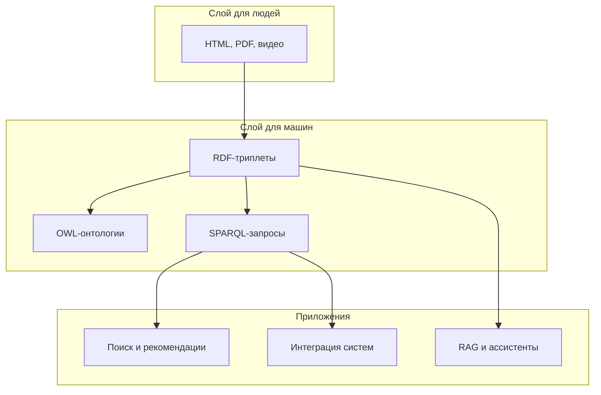
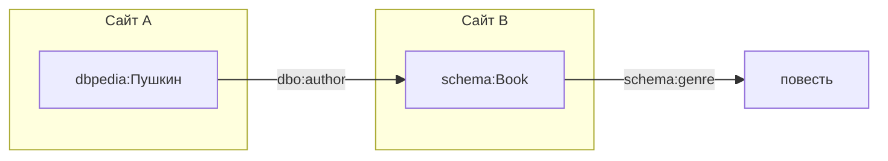
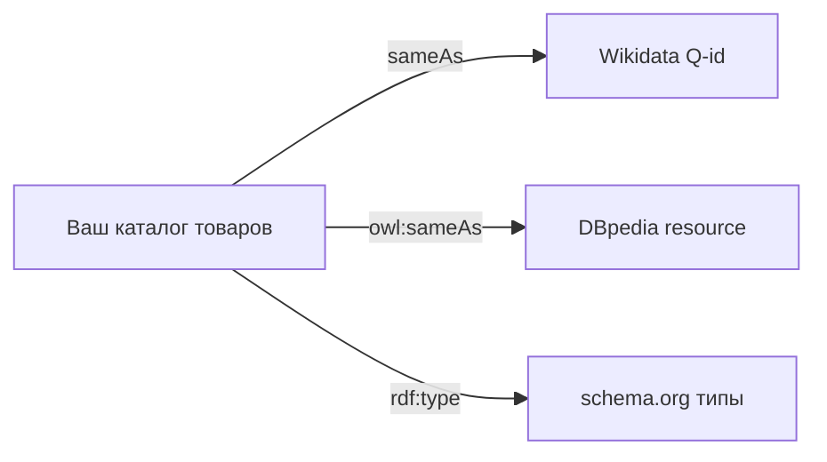
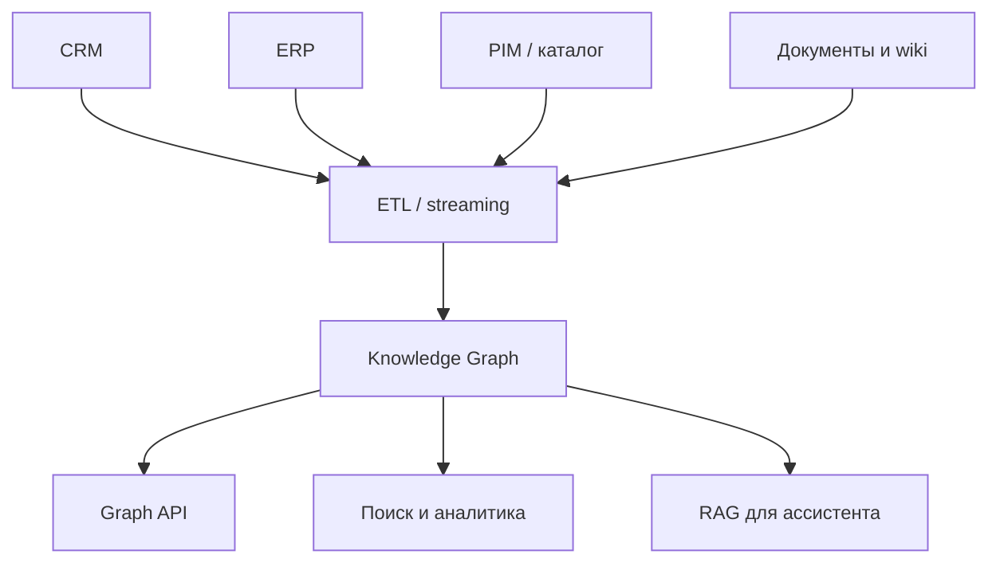
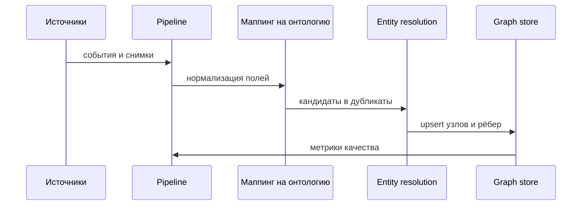
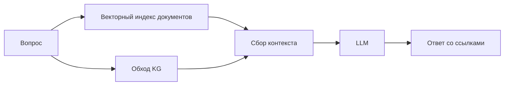
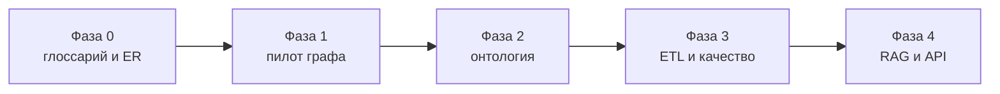

# Семантический веб и графы знаний

<div class="article-tags">
  <span class="tag tag-notrequired">НЕ ОБЯЗАТЕЛЬНО</span>
</div>

<span class="complexity-badge">Архитектору</span>
<span class="complexity-badge">Инженеру</span>

**Семантический веб** (англ. *Semantic Web*) — направление развития [Всемирной паутины](/encyclopedia/2-system-network/2-03-set-i-internet/intro), в котором данные снабжают **явным машиночитаемым смыслом**. Рядом с документами для людей появляются **связанные факты**, на которые программы опираются при поиске, [интеграции](/encyclopedia/2-system-network/2-09-osnovy-integratsionnogo-vzaimodeystviya/intro) и логическом выводе.

Те же идеи лежат в основе **графов знаний** (англ. *knowledge graph*), открытых справочников ([Wikidata](https://www.wikidata.org/)) и части стеков **RAG** (Retrieval-Augmented Generation — дополнение ответов [LLM](/encyclopedia/6-ai/6-04-modeli-i-instrumenty/intro) извлечённым контекстом) в [применении ИИ](/encyclopedia/6-ai/6-06-primenenie-ii/intro).

Маршрут читателя в разделе [Мыслительная база](./intro):

- [Семантика — смысл знаков и данных](./326) — что значит "смысл" в IT;
- [Представление знаний](./327) — фреймы, сети, правила;
- [Онтология в информатике](./328) — формальные классы и аксиомы;
- [Концептуальные схемы](./329) — от идеи до таблиц SQL;
- **эта статья** — стандарты W3C, открытые данные, индустриальные графы.

Математический аппарат [графов](./323) и практика [графовых БД](/encyclopedia/3-data-markup/3-06-nosql/7) дополняют теорию. Обзор — [статья "Семантическая паутина" в Википедии](https://ru.wikipedia.org/wiki/Семантическая_паутина).

---

Термины главы — в [словаре](./331#термины-семантического-веба-330).

## Видение семантического веба

Идею сформулировал **Тим Бернерс-Ли** (создатель HTTP и HTML) в конце 1990-х. Исходная [веб-страница](/encyclopedia/2-system-network/2-04-kak-rabotayut-sayty-i-veb-sayty/intro) передаёт смысл **текстом** и вёрсткой. Человек читает абзац и понимает, что речь о заказе или о городе. Программа видит теги `<div>` и слова, но **не гарантированно** знает, что "Пушкин" — автор, а "Москва" — город.

**Семантический веб** добавляет слой **структурированных утверждений** поверх документов:

- каждый объект получает **глобальное имя** (URI — Uniform Resource Identifier);
- связи между объектами записывают в стандартном формате (RDF — Resource Description Framework);
- разные сайты **ссылаются** на одни и те же URI и тем самым **соединяют** свои данные.



### Четыре слоя стека W3C

| Слой | Стандарт | Роль |
| --- | --- | --- |
| **Идентификация** | URI, IRI | глобальные имена сущностей и свойств |
| **Утверждения** | RDF | факты в виде триплетов |
| **Схема** | RDFS, OWL | классы, иерархии, ограничения |
| **Запросы** | SPARQL | поиск подграфов, обновление |

Слои **наслаиваются**. Можно публиковать только RDF без OWL. Можно размечать страницы JSON-LD без собственного triple store. Полный стек нужен там, где важны **межотраслевой обмен** и **логический вывод**.

### Что изменилось с 2000-х

Ранние презентации рисовали "единый глобальный разум" из связанных онтологий. На практике семантический веб **эволюционировал**:

- **schema.org** и **JSON-LD** — разметка для поисковиков и карточек;
- **Wikidata** и **DBpedia** — открытые графы фактов с миллиардами триплетов;
- **корпоративные knowledge graph** — продукты, клиенты, риски, зависимости сервисов;
- **RAG** — граф и векторный поиск как контекст для [больших языковых моделей](/encyclopedia/6-ai/6-04-modeli-i-instrumenty/intro).

Идея "машиночитаемого смысла" жива. Изменились **масштаб**, **инструменты** и **точки входа** — чаще через JSON-LD и граф в продукте, реже через полный OWL-reasoner на весь интернет.

### Связь с семантикой и онтологией

В [статье о семантике](./326) различают синтаксис ("правильно ли написано") и семантику ("что это значит"). RDF фиксирует **договорённый смысл** полей через URI. [Онтология](./328) задаёт **типы** и **правила** поверх фактов. [Концептуальная схема](./329) на доске — человекочитаемый чертёж; OWL-файл — машиночитаемый контракт того же домена.

---

## Граф фактов поверх HTML

Обычная страница интернет-магазина содержит цену, название и кнопку "Купить". Парсер HTML может извлечь текст `"1 299 ₽"`, но не знает, **что** это за число — цена, скидка, номер версии.

Семантический слой добавляет **утверждения** в форме троек "субъект — предикат — объект":

```text
(товар-abc, тип, Product)
(товар-abc, название, "Беспроводные наушники")
(товар-abc, цена, "1299")
(товар-abc, бренд, бренд-xyz)
```

Если `товар-abc` и `бренд-xyz` — **URI** с префиксом вашего домена или общей схемы, другой сервис **однозначно** соединит эти факты со своими.



### Отличие от обычной базы данных

| Аспект | Таблица SQL | RDF-граф |
| --- | --- | --- |
| Единица | строка в таблице | триплет |
| Схема | жёсткая, заранее | открытая, триплеты о типах — тоже данные |
| Связь между системами | импорт/ETL, маппинг колонок | общие URI, Linked Data |
| Запрос | SQL | SPARQL (шаблон подграфа) |

Таблицы остаются отличным выбором для транзакций и отчётов. RDF силён там, где **много источников**, **разная структура** и нужен **обмен без единой центральной схемы**. Подробнее о реляционной модели — [Основы баз данных](/encyclopedia/3-data-markup/3-05-osnovy-baz-dannyh/intro).

---

## RDF и триплеты — углублённый разбор

**RDF** (Resource Description Framework) — базовый формат семантического веба от консорциума **W3C** (World Wide Web Consortium). Любое RDF-описание — **набор триплетов** `(субъект, предикат, объект)`.

### Роли частей триплета

| Часть | Роль | Типичное значение |
| --- | --- | --- |
| **Субъект** | о ком или о чём утверждение | URI ресурса |
| **Предикат** | тип связи или свойство | URI свойства |
| **Объект** | значение или другой ресурс | URI или литерал (строка, число, дата) |

**Литерал** — константа с опциональным языковым тегом или типом:

```turtle
@prefix ex: <http://example.org/> .
@prefix xsd: <http://www.w3.org/2001/XMLSchema#> .

ex:product-42 ex:label "Наушники"@ru ;
              ex:price "1299.00"^^xsd:decimal ;
              ex:inStock true .
```

Здесь `^^xsd:decimal` задаёт тип данных XML Schema; `@ru` — язык строки.

### RDF как мультиграф

Один и тот же субъект может иметь **много** предикатов и **много** объектов для одного предиката:

```turtle
ex:alice ex:knows ex:bob ;
         ex:knows ex:carol ;
         ex:age "30"^^xsd:integer .
```

RDF **не** требует заранее объявить таблицу `Person`. Тип задают отдельным триплетом:

```turtle
ex:alice a ex:Person .
```

`a` — сокращение для `rdf:type` (предикат "является экземпляром типа").

### Синтаксисы RDF

Один и тот же граф можно записать в разных **синтаксисах**:

| Синтаксис | Где встречается |
| --- | --- |
| **Turtle** (.ttl) | файлы онтологий, ручное редактирование |
| **JSON-LD** | веб-страницы, REST API |
| **RDF/XML** | legacy-системы, некоторые инструменты |
| **N-Triples** | по одному триплету на строку, потоковая загрузка |
| **TriG** | несколько именованных графов в одном файле |

Пример заказа в Turtle:

```turtle
@prefix ex: <http://example.org/> .
@prefix schema: <http://schema.org/> .

ex:order-1042 a schema:Order ;
    schema:orderDate "2026-06-15"^^xsd:date ;
    schema:customer ex:alice ;
    schema:orderedItem ex:line-1 .

ex:line-1 schema:orderedItem ex:product-99 ;
          schema:quantity 2 .

ex:alice a schema:Person ;
    schema:name "Алиса" ;
    schema:email "alice@example.org" .

ex:product-99 a schema:Product ;
    schema:name "Клавиатура" .
```

### Именованные графы

В **именованном графе** (named graph) набор триплетов помечен **четвёртым** компонентом — URI графа. Это удобно для:

- версий данных ("снимок на 2026-01-01");
- источника ("импорт из CRM");
- уровня доверия ("подтверждено вручную").

```turtle
@prefix ex: <http://example.org/> .

GRAPH ex:graph-crm {
  ex:alice schema:name "Алиса" .
}

GRAPH ex:graph-erp {
  ex:alice schema:name "Alice Smith" .
}
```

SPARQL позволяет запрашивать конкретный граф или объединение графов.

### Blank nodes

**Blank node** (пустой узел) — субъект или объект **без** глобального URI. Используют для промежуточных структур:

```turtle
ex:order-1042 schema:billingAddress [
    schema:streetAddress "ул. Примерная, 1" ;
    schema:addressLocality "Москва"
] .
```

Квадратные скобки `[ ... ]` в Turtle — анонимный ресурс. В продакшене для **склейки** данных между системами предпочитают **стабильные URI**.

### Хранилища triple store

**Triple store** — СУБД, оптимизированная под хранение и запрос **миллиардов** триплетов. Примеры:

- **GraphDB** (Ontotext);
- **Apache Jena Fuseki**;
- **Stardog**;
- **Amazon Neptune** (поддержка RDF и property graph);
- **Blazegraph**, **Virtuoso**.

Индексы строят по субъекту, предикату и объекту. Масштабирование — шардирование по субъекту, репликация, кластеры.

См. также [NoSQL — о разделе](/encyclopedia/3-data-markup/3-06-nosql/intro) для сравнения с документными и [графовыми](/encyclopedia/3-data-markup/3-06-nosql/7) моделями.

---

## RDFS — схема поверх RDF

**RDFS** (RDF Schema) добавляет словарь для описания **классов** и **свойств**. Сами описания — обычные триплеты.

### Основные конструкции RDFS

| Класс / свойство RDFS | Смысл |
| --- | --- |
| `rdfs:Class` | множество ресурсов одного типа |
| `rdfs:subClassOf` | иерархия классов |
| `rdfs:subPropertyOf` | иерархия свойств |
| `rdfs:domain` | класс субъекта свойства |
| `rdfs:range` | класс объекта свойства |
| `rdfs:label` | человекочитаемое имя |
| `rdfs:comment` | пояснение |

Пример:

```turtle
@prefix ex: <http://example.org/> .
@prefix rdfs: <http://www.w3.org/2000/01/rdf-schema#> .

ex:Order a rdfs:Class ;
    rdfs:label "Заказ"@ru ;
    rdfs:subClassOf ex:BusinessObject .

ex:CustomerOrder a rdfs:Class ;
    rdfs:subClassOf ex:Order .

ex:hasCustomer a rdf:Property ;
    rdfs:domain ex:Order ;
    rdfs:range ex:Person ;
    rdfs:label "оформил"@ru .
```

### Что умеет RDFS-reasoner

**Reasoner** (модуль логического вывода) по правилам RDFS **добавляет** триплеты, которые следуют из схемы:

- если `CustomerOrder` подкласс `Order`, каждый экземпляр `CustomerOrder` — также экземпляр `Order`;
- если у свойства `domain` = `Order`, а субъект использует это свойство, reasoner пометит субъект как `Order`.

Выразительность RDFS **ограничена**. Сложные ограничения ("ровно один покупатель", "запрет одновременно быть ФизЛицом и ЮрЛицом") требуют **OWL**.

### RDFS и онтология предметной области

[RDFS-схема](./328) близка к **глоссарию с иерархией**. Для внутреннего каталога метаданных и портала открытых данных RDFS часто **достаточно**. Для медицинских и финансовых стандартов (SNOMED CT, FIBO) обычно берут **OWL 2**.

---

## OWL — онтологический язык

**OWL** (Web Ontology Language) — язык для **выразительных** онтологий: эквивалентности классов, несовместимости, кардинальности, перечисления.

### Профили OWL 2

| Профиль | Выразительность | Применение |
| --- | --- | --- |
| **OWL 2 EL** | ограничен, быстрый вывод | большие медицинские терминологии |
| **OWL 2 QL** | запросы к данным через OWL | OBDA, виртуализация |
| **OWL 2 RL** | правила, масштаб | продакшен-графы с выводом |
| **OWL 2 DL** | полная логика описаний | проектирование онтологий |

### Примеры конструкций

**Эквивалентность классов** — два имени описывают одно множество:

```turtle
ex:ApprovedOrder owl:equivalentClass [
    a owl:Class ;
    owl:intersectionOf (
        ex:Order
        [ a owl:Restriction ;
          owl:onProperty ex:hasStatus ;
          owl:hasValue ex:StatusApproved
        ]
    )
] .
```

**Несовместимость** — экземпляр не может принадлежать двум классам:

```turtle
ex:Person owl:disjointWith ex:Organization .
```

**Кардинальность** — сколько значений допустимо:

```turtle
ex:Order rdfs:subClassOf [
    a owl:Restriction ;
    owl:onProperty ex:hasCustomer ;
    owl:qualifiedCardinality 1 ;
    owl:onClass ex:Customer
] .
```

### Reasoner и согласованность

OWL-reasoner проверяет:

- **согласованность** — нет ли класса, в котором одновременно невозможно и обязательно иметь свойство;
- **классификацию** — вычисление иерархии подклассов;
- **материализацию** — добавление выведенных триплетов в граф.

Инструменты: **Protégé** (редактор), **HermiT**, **Pellet**, **ELK**, встроенные reasoner в GraphDB и Stardog.

### OWL в инженерной практике

Полная OWL-онтология на весь корпоративный домен — **дорого** в сопровождении. Типичные компромиссы:

- OWL для **ядра** понятий (клиент, договор, продукт);
- SHACL (Shapes Constraint Language) для **валидации** данных без тяжёлого вывода;
- бизнес-правила в коде или движке правил для **операционной** логики.

Связь с [представлением знаний](./327): OWL формализует то, что в экспертных системах раньше записывали правилами и фреймами.

---

## Принципы Linked Data

**Связанные открытые данные** (Linked Data) — практические правила Тима Бернерса-Ли для публикации данных в сети.

### Четыре правила (классическая формулировка)

1. Использовать **URI** как имена сущностей.
2. По HTTP(S) на URI отдавать **полезное** представление (RDF, HTML с метаданными).
3. Включать **ссылки** на URI других источников (другие домены, Wikidata, schema.org).
4. Ссылаться на **высококачественные** открытые наборы данных.



### Content negotiation

Сервер по заголовку `Accept` отдаёт **RDF** или **HTML**:

```http
GET /entity/product-42 HTTP/1.1
Host: example.org
Accept: text/turtle
```

Ответ — Turtle с фактами о товаре. Браузер с `Accept: text/html` получит страницу для человека с встроенным JSON-LD.

### LOD cloud

**LOD cloud** (облако связанных открытых данных) — экосистема наборов, связанных `owl:sameAs`, `skos:exactMatch` и ссылками на общие URI. Узлы — **Wikidata**, **DBpedia**, **GeoNames**, **WordNet**, отраслевые реестры.

Для инженера важно:

- при публикации сущности дать **стабильный URI**;
- связать внутренний ID с **внешним** справочником, если он есть;
- документировать **лицензию** данных (CC0, ODbL).

---

## SPARQL — язык запросов к RDF

**SPARQL** (SPARQL Protocol and RDF Query Language) — стандарт W3C для чтения и изменения RDF-графов. Запрос описывает **шаблон** подграфа с **переменными**; движок находит все подстановки.

### Базовый SELECT

```sparql
PREFIX schema: <http://schema.org/>
PREFIX xsd: <http://www.w3.org/2001/XMLSchema#>

SELECT ?name ?date ?productName
WHERE {
  ?order a schema:Order ;
         schema:customer ?person ;
         schema:orderDate ?date ;
         schema:orderedItem ?line .
  ?person schema:name ?name .
  ?line schema:orderedItem ?product ;
        schema:quantity ?qty .
  ?product schema:name ?productName .
  FILTER(?date >= "2026-01-01"^^xsd:date)
}
ORDER BY DESC(?date)
LIMIT 100
```

Переменные начинаются с `?`. Точка с запятой `;` в Turtle-стиле связывает несколько предикатов одного субъекта.

### OPTIONAL и UNION

**OPTIONAL** — левое внешнее соединение (как LEFT JOIN в SQL):

```sparql
SELECT ?person ?name ?email
WHERE {
  ?person a schema:Person ;
          schema:name ?name .
  OPTIONAL { ?person schema:email ?email }
}
```

**UNION** — альтернативные шаблоны:

```sparql
SELECT ?entity ?label
WHERE {
  { ?entity a schema:Person ; schema:name ?label }
  UNION
  { ?entity a schema:Organization ; schema:legalName ?label }
}
```

### Агрегация

```sparql
SELECT ?customer (COUNT(?order) AS ?orderCount) (SUM(?amount) AS ?total)
WHERE {
  ?order a schema:Order ;
         schema:customer ?customer ;
         schema:price ?amount .
}
GROUP BY ?customer
HAVING (COUNT(?order) > 5)
```

### CONSTRUCT и DESCRIBE

**CONSTRUCT** — построить новый RDF-граф из результатов:

```sparql
PREFIX ex: <http://example.org/>

CONSTRUCT {
  ?customer ex:vip true .
}
WHERE {
  ?customer ex:orderCount ?c .
  FILTER(?c > 20)
}
```

**DESCRIBE** — получить все известные триплеты о ресурсе (удобно для отладки).

### UPDATE (SPARQL 1.1)

```sparql
PREFIX ex: <http://example.org/>

DELETE {
  ?order ex:status ex:Pending .
}
INSERT {
  ?order ex:status ex:Shipped .
}
WHERE {
  ?order ex:status ex:Pending ;
         ex:trackingNumber ?tn .
  FILTER(BOUND(?tn))
}
```

### Запрос к Wikidata

Публичный endpoint: `https://query.wikidata.org/sparql`

```sparql
# Русские писатели XIX века (упрощённый пример)
SELECT ?writer ?writerLabel ?birth
WHERE {
  ?writer wdt:P31 wd:Q36180 .        # instance of: writer
  ?writer wdt:P569 ?birth .          # date of birth
  FILTER(YEAR(?birth) < 1900)
  SERVICE wikibase:label {
    bd:serviceParam wikibase:language "ru,en" .
    ?writer rdfs:label ?writerLabel .
  }
}
LIMIT 20
```

Префиксы `wdt:`, `wd:`, `wikibase:` — служебные для Wikidata. Такие запросы — живой пример Linked Open Data.

### SPARQL и SQL — сравнение по духу

| | SQL | SPARQL |
| --- | --- | --- |
| Модель | таблицы, JOIN | подграф, шаблон |
| Схема | фиксирована | открыта, типы в данных |
| Проекция | SELECT столбцов | SELECT переменных |
| Графовые шаги | рекурсивный CTE | property paths (`ex:knows+`) |

Property path — обход по цепочке предиката:

```sparql
SELECT ?ancestor
WHERE {
  ex:alice ex:parent+ ?ancestor .
}
```

В коммерческой разработке SPARQL встречается в **каталогах метаданных**, **научных репозиториях**, **корпоративных KG** и **порталах открытых данных**. Для операционных OLTP-нагрузок чаще берут SQL или [графовые БД](/encyclopedia/3-data-markup/3-06-nosql/7) с Cypher.

---

## JSON-LD и разметка веб-страниц

**JSON-LD** (JSON for Linking Data) — формат RDF в виде **обычного JSON** с ключом `@context`. Удобен для фронтенда и REST API.

### Минимальный пример

```json
{
  "@context": "https://schema.org/",
  "@type": "Product",
  "@id": "https://example.org/products/42",
  "name": "Беспроводные наушники",
  "brand": {
    "@type": "Brand",
    "name": "Acme"
  },
  "offers": {
    "@type": "Offer",
    "price": "1299.00",
    "priceCurrency": "RUB",
    "availability": "https://schema.org/InStock"
  }
}
```

`@context` сопоставляет ключи `name`, `brand` с URI свойств schema.org. Парсер JSON-LD превращает документ в **набор триплетов**.

### Встраивание в HTML

```html
<script type="application/ld+json">
{
  "@context": "https://schema.org",
  "@type": "Organization",
  "name": "Пример ООО",
  "url": "https://example.org"
}
</script>
```

Поисковые системы и ассистенты извлекают блок без разбора видимого текста страницы. Связь с [HTML](/encyclopedia/3-data-markup/3-09-html/intro).

### RDFa

**RDFa** — атрибуты в HTML (`property`, `typeof`, `resource`). Используют реже JSON-LD, но встречается в CMS и государственных порталах.

### API без triple store

JSON-LD в ответе API даёт **контракт смысла** без миграции всей БД в RDF:

- клиенты понимают поля через общий `@context`;
- можно публиковать **только** публичные сущности в linked data формате;
- внутреннее хранение остаётся в PostgreSQL или MongoDB.

Сравнение с [OpenAPI и JSON Schema](/encyclopedia/2-system-network/2-09-osnovy-integratsionnogo-vzaimodeystviya/2): JSON Schema описывает **структуру**; JSON-LD добавляет **глобальные URI** понятий.

---

## schema.org

**schema.org** — совместный словарь типов и свойств (Google, Microsoft, Yahoo и др.) для разметки контента.

### Назначение schema.org

- единые имена для `Product`, `Event`, `Person`, `FAQPage`;
- богатые сниппеты в поиске;
- общий язык между сайтом, CRM и внешними каталогами.

### Популярные типы

| Тип | Примеры свойств |
| --- | --- |
| `Product` | name, sku, brand, offers |
| `Organization` | name, logo, contactPoint |
| `Article` | headline, author, datePublished |
| `BreadcrumbList` | itemListElement |
| `FAQPage` | mainEntity |

### Расширение схемы

Собственные поля объявляют через **расширение контекста**:

```json
{
  "@context": {
    "@vocab": "https://schema.org/",
    "ex": "https://example.org/vocab/",
    "loyaltyTier": "ex:loyaltyTier"
  },
  "@type": "Person",
  "name": "Алиса",
  "loyaltyTier": "gold"
}
```

### schema.org и онтология

schema.org — **практичный** верхний уровень, близкий к [концептуальной схеме](./329). Для юридически значимых ограничений поверх него строят **отраслевые** онтологии (healthcare, finance, IoT).

---

## Wikidata и DBpedia

### Wikidata

**Wikidata** — свободная база знаний Викимедиа. Каждая сущность имеет **Q-id** (например, `Q720` — Пушкин). Утверждения — **тройки** с свойствами **P-id** (`P569` — дата рождения).

Особенности:

- **мультиязычные** подписи;
- **ссылки** на Википедию и внешние авторитетные файлы;
- **SPARQL-endpoint** для всего графа;
- лицензия **CC0** (общественное достояние).

Интеграция в продукт:

- хранить у себя `wikidataId: "Q720"` у сущности "автор";
- подтягивать биографию и даты через API или SPARQL;
- использовать `sameAs` в RDF для склейки.

### DBpedia

**DBpedia** извлекает структурированные факты из **инфобоксов** [Википедии](https://ru.wikipedia.org/wiki/Заглавная_страница). URI вида `http://dbpedia.org/resource/Alexander_Pushkin`.

| | Wikidata | DBpedia |
| --- | --- | --- |
| Редактирование | централизованная wiki | через Википедию |
| Модель | свойства P/Q | маппинг инфобоксов |
| Свежесть | быстрее для фактов | зависит от обновления статей |
| Использование | идентификаторы, SPARQL | legacy-ссылки, исследования |

На практике новые проекты чаще опираются на **Wikidata**; DBpedia остаётся в академических корпусах и старых linked data наборах.

### Другие открытые графы

- **GeoNames** — географические объекты;
- **WordNet** — лексические связи (синонимы, гиперонимы);
- **ConceptNet** — общеязыковые отношения для NLP;
- национальные **open data** порталы с RDF-дампами.

---

## Графы знаний в индустрии

**Граф знаний** (knowledge graph, KG) — инженерная реализация идей [представления знаний](./327) и семантического веба с процессами **ETL**, **версионированием**, **качеством данных** и **SLA**.

### Google Knowledge Graph

Используется в поиске для **карточек** сущностей (люди, места, фильмы). Факты связывают запрос пользователя с **каноническим** объектом. Технические детали закрыты; публично известны масштаб (миллиарды сущностей) и опора на **структурированные** и **открытые** источники.

### Корпоративный knowledge graph

Типичные домены:

- **продуктовый каталог** — SKU, совместимость, замены;
- **клиенты и контракты** — иерархия холдинга, роли;
- **IT-инфраструктура** — сервисы, зависимости, инциденты ([граф для SRE](/encyclopedia/2-system-network/2-06-sistemnoe-administrirovanie/intro));
- **комплаенс** — политики, риски, регуляторные ссылки;
- **R&D** — публикации, патенты, эксперты.



### Отличие от "просто графа в Neo4j"

KG включает **управление смыслом**:

- [онтология](./328) или схема классов;
- **entity resolution** — слияние дубликатов;
- **происхождение** (provenance) — откуда факт;
- **жизненный цикл** — устаревание, версии;
- **доступ** — кто может видеть какие рёбра.

[Семантическая сеть](./327) в учебнике — исторический предшественник. Knowledge graph — **дисциплина** с владельцами данных и метриками качества.

---

## Property graph, Neo4j, Cypher и triple store

Существуют **две** распространённые модели графов в индустрии.

### RDF-граф (триплеты)

- всё — **триплет**; свойства на рёбрах кодируют отдельными предикатами или reification;
- стандарты W3C, SPARQL, OWL;
- сильная **интероперабельность**.

### Labelled property graph (LPG)

- **узлы** с метками (labels) и свойствами;
- **рёбра** с **типом** и собственными свойствами;
- языки **Cypher** (Neo4j), **Gremlin**, **GQL** (стандарт в работе).

Пример Cypher:

```cypher
CREATE (a:Person {name: 'Алиса', email: 'alice@example.org'})
CREATE (b:Person {name: 'Борис'})
CREATE (o:Order {id: '1042', total: 2598})
CREATE (a)-[:PLACED {at: datetime('2026-06-15')}]->(o)
CREATE (a)-[:KNOWS]->(b)
```

Запрос:

```cypher
MATCH (p:Person)-[:PLACED]->(o:Order)
WHERE o.total > 1000
RETURN p.name, o.id, o.total
ORDER BY o.total DESC
```

Подробнее — [Графовые базы данных](/encyclopedia/3-data-markup/3-06-nosql/7).

### Сравнительная таблица

| Критерий | RDF triple store | Neo4j / LPG |
| --- | --- | --- |
| Модель | субъект–предикат–объект | узлы, типизированные рёбра |
| Стандарты | W3C (RDF, SPARQL, OWL) | де-факто Cypher, открытый GQL |
| Схема | открытая, онтологии | label/schema опционально |
| Свойства на связи | отдельные предикаты | нативно на ребре |
| Вывод OWL | зрелые reasoner | ограниченно / через плагины |
| Linked Data | естественно | через экспорт RDF |
| Типичный кейс | открытые данные, каталоги | рекомендации, фрод, IT-граф |

### Гибриды

- **Neptune** — RDF и property graph в одном сервисе;
- **Stardog** — виртуализация SQL + OWL + граф;
- экспорт LPG → RDF для публикации linked data;
- **n10s** (Neo4j) — импорт RDF в граф.

Выбор зависит от команды: если нужен **SPARQL и OWL** — triple store; если **быстрые обходы** и привычный стек разработчиков — Neo4j. Многие корпорации держат **операционный** LPG и **публичный** RDF-слой.

---

## ETL в граф и качество данных

Построение KG — **непрерывный конвейер** с регулярными обновлениями.

### Этапы ETL/ELT

1. **Extract** — CDC из [SQL](/encyclopedia/3-data-markup/3-07-sql/intro), API, файлов, логов.
2. **Transform** — маппинг полей на классы онтологии, нормализация имён, единицы измерения.
3. **Entity resolution** — "ООО Ромашка" и "Romashka Ltd" → один узел.
4. **Load** — bulk load триплетов или `MERGE` в Cypher.
5. **Validate** — SHACL, бизнес-правила, отчёты о пробелах.



### Идентификаторы

- внутренний стабильный `id` (UUID, ULID);
- внешние ключи источников как свойства;
- ссылка `sameAs` на Wikidata или отраслевой реестр;
- **никогда** не использовать имя или email как первичный ключ графа.

### Происхождение (provenance)

Для каждого факта полезно хранить:

- источник (`crm:export-2026-06`);
- время извлечения;
- уровень доверия;
- версию онтологии.

В RDF — именованный граф или свойства `prov:wasDerivedFrom`.

### Инкрементальные обновления

- потоковая обработка ([Kafka](/encyclopedia/2-system-network/2-09-osnovy-integratsionnogo-vzaimodeystviya/intro) и аналоги);
- идемпотентный `MERGE` по бизнес-ключу;
- **soft delete** — пометка `deprecated` вместо физического удаления рёбер.

---

## Интеграция с ИИ, NLP и RAG

Современный интерес к KG связан с [большими языковыми моделями](/encyclopedia/6-ai/6-04-modeli-i-instrumenty/intro) и [применением ИИ](/encyclopedia/6-ai/6-06-primenenie-ii/intro).

### NLP и извлечение фактов

**NLP** (Natural Language Processing — обработка естественного языка) извлекает из текста имена, отношения, даты. Модели NER (Named Entity Recognition) и relation extraction **предлагают** триплеты. Граф **закрепляет** их стабильными URI и связями с источником.

Раздел [Трансформеры и NLP](/encyclopedia/6-ai/6-09-transformery-i-nlp/intro).

### RAG с графом

**RAG** (Retrieval-Augmented Generation) — пайплайн:

1. вопрос пользователя;
2. **извлечение** релевантных фрагментов (векторный поиск, BM25, обход графа);
3. **формирование** промпта с контекстом;
4. ответ LLM.

Граф улучшает RAG:

- **многошаговые** связи ("клиент → договор → SLA → штраф");
- **фильтрация** по типам сущностей;
- **объяснимость** — путь в графе как цитата;
- меньше **выдуманных** связей, если факты проверяемы.



Гибрид **вектор + граф** — частая архитектура 2024–2026. Векторный поиск находит похожие тексты; граф уточняет **сущности** и **отношения**. См. [векторные БД](/encyclopedia/3-data-markup/3-06-nosql/812).

### GraphRAG и community summaries

Исследовательские и продуктовые схемы (Microsoft GraphRAG и др.) строят **сводки** над кластерами графа для ответов на вопросы "о чём весь корпус". Это дорого на построении, но полезно для **аналитики** больших архивов.

### Ограничения LLM

Модель может **галлюцинировать** факты. KG снижает риск, если:

- в промпт попадают **только** проверенные триплеты;
- ответ обязан ссылаться на `id` ребра или документа;
- спорные утверждения помечены уровнем доверия.

Подробнее — [галлюцинации](/encyclopedia/6-ai/6-04-modeli-i-instrumenty/113), [безопасность при работе с ИИ](/encyclopedia/6-ai/6-10-bezopasnost-pri-rabote-s-ii/intro).

### Агенты и инструменты

[AI-агенты](/encyclopedia/6-ai/6-08-agentops/intro) могут вызывать **SPARQL** или **Cypher** как tool — получать структурированный ответ вместо угадывания. Онтология задаёт **допустимые** типы запросов.

---

## Безопасность, URI и управление доступом

### HTTPS и подлинность URI

URI должен **разрешаться** по HTTPS. Это основа доверия в Linked Data. Подмена DNS или HTTP без TLS ломает цепочку ссылок.

### Политики доступа

RDF-граф редко бывает полностью публичным.

- **ABAC** — атрибуты на узлах (отдел, классификация);
- **фильтрация** на уровне API — запрос возвращает только разрешённый подграф;
- **шифрование** чувствительных литералов отдельно от структуры графа.

В property graph права часто на уровне **меток** узлов. В triple store — на **именованных графах** (граф `internal` закрыт, `public` открыт).

### Персональные данные

Факты о человеке — **PII** (Personally Identifiable Information). Требования GDPR и локальных законов:

- минимизация полей в графе;
- псевдонимизация URI (`urn:uuid:...` без имени в идентификаторе);
- право на удаление — каскад по связанным триплетам;
- журнал доступа к чувствительным подграфам.

### URI как контракт

Смена URI **ломает** внешние ссылки. Практики:

- **постоянные** редиректы 301 со старых URI;
- `owl:sameAs` между старым и новым;
- версионирование API отдельно от идентификаторов сущностей.

---

## Ограничения и типичные ошибки

### Сложность для команды

OWL, глобальные URI и согласование онтологий требуют **обучения**. Без владельца модели граф **деградирует** в хаос дубликатов и мёртвых ссылок.

### Entity resolution

Одна сущность в CRM, ERP и support — три узла. Без **правил слияния** отчёты врут. Это отдельная инженерная задача (ML, правила, ручная модерация).

### Производительность рассуждений

Полный OWL 2 DL на миллиардах триплетов **дорог**. Reasoner запускают **офлайн** или на подмножестве. Онлайн-сервис опирается на **материализованный** вывод.

### Избыточность для MVP

Для узкого продукта с одной командой часто хватает:

- [глоссария](/encyclopedia/7-project/7-09-bazy-znaniy-i-zadachniki/intro);
- [концептуальной схемы](./329);
- стабильных `id` в [REST API](/encyclopedia/2-system-network/2-09-osnovy-integratsionnogo-vzaimodeystviya/2).

Принцип **YAGNI** ("You Aren't Gonna Need It" — не усложняй без нужды) уместен. RDF оправдан при **межсистемном** обмене, **открытых** данных или **RAG** на большом корпусе.

### Зоопарк стандартов

RDF, RDFS, OWL, SHACL, SKOS, PROV, JSON-LD — долгий список. **Точка входа** — JSON-LD + schema.org; углубление — по мере задачи.

---

## Дорожная карта внедрения

Пошаговый маршрут для организации, которая движется от таблиц к графу знаний.

### Фаза 0 — смысл без RDF

- глоссарий терминов (заказ, клиент, продукт);
- [ER-диаграмма](./329) с согласованными именами;
- стабильные UUID в API и событиях;
- владелец модели данных (data steward).

### Фаза 1 — пилот графа

- один домен (каталог, IT-зависимости, эксперты);
- выбор движка (Neo4j или triple store);
- импорт из одного-двух источников;
- базовые запросы Cypher или SPARQL для отчёта.

### Фаза 2 — онтология и связи

- маппинг классов на [schema.org](https://schema.org) или отраслевую онтологию;
- `sameAs` на Wikidata для публичных сущностей;
- JSON-LD на публичных страницах;
- метрики покрытия и дубликатов.

### Фаза 3 — интеграция и качество

- потоковый ETL;
- entity resolution;
- SHACL-валидация;
- дашборд происхождения фактов.

### Фаза 4 — ИИ и самообслуживание

- векторный индекс документов + KG для RAG;
- чат-ассистент с tool calling к графу;
- публикация read-only SPARQL/GraphQL API внутренним командам.



### Критерии готовности к следующей фазе

| Переход | Сигнал |
| --- | --- |
| 0 → 1 | согласован глоссарий, есть UUID в API |
| 1 → 2 | пилот даёт ценность одной команде |
| 2 → 3 | онтология покрывает >80% классов домена |
| 3 → 4 | качество данных стабильно по метрикам |

---

## Сравнение подходов к машиночитаемому смыслу

| Подход | Сильные стороны | Слабые стороны | Когда выбирать |
| --- | --- | --- | --- |
| **Только SQL** | транзакции, зрелые инструменты | жёсткая схема, слабая связь между компаниями | один продукт, один домен |
| **JSON Schema / OpenAPI** | простота для разработчиков | нет глобальных URI понятий | внутренние микросервисы |
| **JSON-LD + schema.org** | SEO, быстрый старт | ограниченная логика | публичный сайт, каталог |
| **RDF + SPARQL** | стандарты, linked data | кривая обучения | открытые данные, каталоги метаданных |
| **OWL + reasoner** | формальный вывод | стоимость сопровождения | медицина, финансы, госсектор |
| **Neo4j / LPG** | скорость обходов, DX | слабее linked data "из коробки" | фрод, рекомендации, IT-граф |
| **KG + RAG** | объяснимые ответы ИИ | два контура данных | корпоративный ассистент |

---

## Практический мини-кейс — интернет-магазин

Связываем темы статьи в одном сценарии.

### Исходное состояние

- PostgreSQL с таблицами `orders`, `customers`, `products`;
- сайт на React;
- внутренний чат-бот на LLM без контекста.

### Шаг 1 — стабильные URI

```text
https://id.example.org/customer/{uuid}
https://id.example.org/product/{uuid}
https://id.example.org/order/{uuid}
```

### Шаг 2 — JSON-LD на карточке товара

Блок `Product` + `Offer` для поисковика.

### Шаг 3 — ночной ETL в Neo4j

```cypher
LOAD CSV WITH HEADERS FROM 'file:///export/products.csv' AS row
MERGE (p:Product {id: row.uri})
SET p.name = row.name, p.sku = row.sku
```

### Шаг 4 — связь с Wikidata для брендов

```turtle
<https://id.example.org/brand/acme> owl:sameAs <https://www.wikidata.org/entity/Q123456> .
```

### Шаг 5 — SPARQL или Cypher для отчёта

"Топ клиентов по сумме заказов за квартал" — один запрос по графу вместо трёх JOIN в разных репликах.

### Шаг 6 — RAG

Вопрос "какие наушники Acme совместимы с моделью X?" — векторный поиск по мануалам + обход `(:Product)-[:COMPATIBLE_WITH]->(:Device)`.

---

## Инструменты и экосистема

### Редакторы и моделирование

| Инструмент | Назначение |
| --- | --- |
| **Protégé** | OWL-онтологии, визуализация классов |
| **WebVOWL** | диаграмма онтологии в браузере |
| **Cambridge Semantics ANZO** | enterprise KG (коммерция) |
| **PoolParty** | семантические корпоративные тезаурусы |

### Пайплайны

- **Apache Jena** — Java-стек RDF;
- **RML / YARRRML** — маппинг таблиц в RDF;
- **Morph-KGC** — материализация KG из SQL;
- **Airflow / Dagster** — оркестрация ETL.

### Валидация

- **SHACL** — формы и ограничения на граф (аналог JSON Schema для RDF);
- **Skos** — тезаурусы и синонимы терминов.

### Публикация

- **Docusaurus / статический сайт** с JSON-LD (как в этой [энциклопедии](/encyclopedia/intro));
- **Semantic MediaWiki** — [внутренняя wiki](/encyclopedia/7-project/7-09-bazy-znaniy-i-zadachniki/11) с фактами в RDF.

---

## Связь с соседними разделами энциклопедии

| Тема | Статья |
| --- | --- |
| Смысл полей и синтаксис | [Семантика](./326) |
| Фреймы, правила, сети | [Представление знаний](./327) |
| Классы и аксиомы | [Онтология](./328) |
| ER и уровни схемы | [Концептуальные схемы](./329) |
| Математика графов | [Графы](./323) |
| Neo4j, обходы | [Графовые БД](/encyclopedia/3-data-markup/3-06-nosql/7) |
| Документные и иные NoSQL | [NoSQL](/encyclopedia/3-data-markup/3-06-nosql/intro) |
| Векторный поиск | [Векторные БД](/encyclopedia/3-data-markup/3-06-nosql/812) |
| LLM и RAG | [Модели и инструменты ИИ](/encyclopedia/6-ai/6-04-modeli-i-instrumenty/intro) |
| Прикладные кейсы ИИ | [Применение ИИ](/encyclopedia/6-ai/6-06-primenenie-ii/intro) |
| NLP | [Трансформеры и NLP](/encyclopedia/6-ai/6-09-transformery-i-nlp/intro) |

---

## Резюме

**Семантический веб** — это стандарты и практики, по которым данные в сети получают **явный смысл** для программ. **RDF** выражает факты триплетами; **RDFS** и **OWL** описывают схему и правила; **SPARQL** запрашивает подграфы; **JSON-LD** и **schema.org** снижают порог входа для сайтов и API.

**Linked Data** соединяет наборы по URI — от **Wikidata** и **DBpedia** до корпоративного каталога. **Граф знаний** добавляет ETL, качество, безопасность и жизненный цикл. **Neo4j** и **triple store** решают разные инженерные задачи; гибрид с **векторным поиском** питает **RAG** и ассистентов на базе [ИИ](/encyclopedia/6-ai/6-01-vvedenie-v-ii/intro).

Маршрут 326→330 в [Мыслительной базе](./intro) ведёт от "что значит смысл" к "как публиковать и использовать связанные факты". Следующий практический шаг зависит от домена — пилот JSON-LD, SPARQL к Wikidata или корпоративный граф для аналитики и ИИ.

---

## Связанные статьи

- [Семантика — смысл знаков и данных](./326) · [Представление знаний](./327) · [Онтология в информатике](./328) · [Концептуальные схемы](./329)
- [Графы — маршруты, остовы и раскраски](./323) · [Графовые базы данных](/encyclopedia/3-data-markup/3-06-nosql/7)
- [NoSQL — о разделе](/encyclopedia/3-data-markup/3-06-nosql/intro) · [Векторные базы данных](/encyclopedia/3-data-markup/3-06-nosql/812)
- [Модели и инструменты ИИ](/encyclopedia/6-ai/6-04-modeli-i-instrumenty/intro) · [Применение ИИ](/encyclopedia/6-ai/6-06-primenenie-ii/intro) · [Трансформеры и NLP](/encyclopedia/6-ai/6-09-transformery-i-nlp/intro)
- [Организация внутренней Wiki](/encyclopedia/7-project/7-09-bazy-znaniy-i-zadachniki/11) — Semantic MediaWiki
- [Мыслительная база — о разделе](./intro)

---
