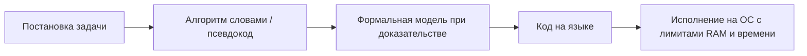
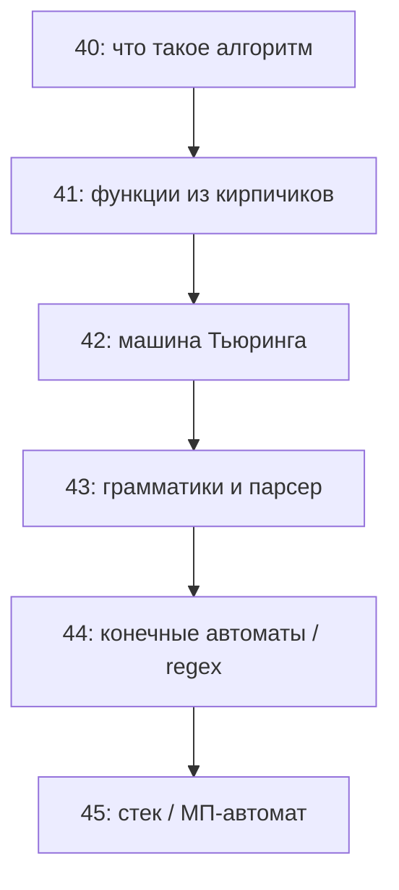

# Теория алгоритмов — формальные основы

<div class="article-tags">
  <span class="tag tag-notrequired">НЕ ОБЯЗАТЕЛЬНО</span>
  <span class="tag tag-beginner">ДЛЯ НОВИЧКОВ</span>
</div>

<span class="complexity-badge">Архитектору</span>
<span class="complexity-badge">Инженеру</span>

В [практическом введении в алгоритмы](/encyclopedia/4-code-dev/4-01-algoritmy/1) мы говорили о шагах, блок-схемах и свойствах «дискретность — определённость — конечность». Этого достаточно, чтобы писать программы. **Теория алгоритмов** отвечает на другой вопрос: *что вообще считается алгоритмом в математике* и почему одни задачи принципиально не решаются кодом.

Эта статья — первая в цепочке по [теории автоматов и формальных языков](/encyclopedia/3-data-markup/3-03-myslitelnaya-baza/38). Дальше: [рекурсивные функции](./41), [машина Тьюринга](./42).

<div class="callout callout--tip">
  <div class="callout-title">Зачем это разработчику</div>
  Формальное определение объясняет, почему нельзя «написать универсальный анализатор без false positive», почему regex не разбирает вложенные скобки и почему спецификация «алгоритм должен завершиться» — не пустые слова в контракте SLA.
</div>

## Для читателя без математического фона

Если вы уже писали циклы и функции — вы **уже пользовались алгоритмами**. Эта статья показывает, **как математики записывают** ту же идею строго, чтобы можно было доказывать пределы: «такую проверку для всех программ написать нельзя», «этот язык описывает только regex, а для скобок нужен парсер».

**Как читать по шагам:**

1. «Общее понятие» и таблица **задача / экземпляр** — базовый словарь на весь курс ТАФЯ.
2. «Требования к алгоритмам» — сверяйте с реальным кодом: есть ли выход из цикла, один ли метод на всех входах.
3. «Математическое определение» и «алфавитный оператор» — плотнее; при первом проходе достаточно идеи, детали доберёте в [статье 42](./42).
4. Разбор скобок и мини-лабораторная связывают теорию с regex и стеком.

Из школьной математики достаточно: «функция» как правило «вход → ответ», «для любого n» в формулировках. Доказательства на первом чтении можно пропустить — важнее понять **смысл слов**.

## Словарь терминов (шпаргалка)

| Термин | Простыми словами | Где встретится в IT |
| --- | --- | --- |
| **Алфавит** `Σ` | конечный набор допустимых символов | байты, символы Unicode в лексере |
| **Слово** | конечная строка из символов алфавита | токен, файл, HTTP-запрос как текст |
| **Задача** | правило «для любого допустимого входа — какой ответ» | «отсортировать массив», «проверить пароль» |
| **Экземпляр** | один конкретный вход | один файл `data.csv` |
| **Алгоритм** | одна схема шагов на весь класс входов | одна функция `sort`, а не ручная сортировка пяти чисел |
| **Массовость** | схема одна, входов бесконечно много (конечной длины) | `def process(path)` для любого пути |
| **Дискретность** | состояние меняется скачком, шаг за шагом | инструкции процессора, тик event loop |
| **Тотальность** | на каждом допустимом входе есть ответ за конечное время | метод API без бесконечного ожидания |
| **Частичность** | на части входов ответа нет (зацикливание) | полуалгоритм «найди решение перебором» |
| **Алфавитный оператор** | правило «строка → строка» | trim, escape, лексер «выдать токены» |
| **Тезис Чёрча–Тьюринга** | все разумные модели «вычисления» эквивалентны | Python, Java, SQL с рекурсией — одна «мощность» |

## Общее понятие алгоритма

**Алгоритм** в быту — понятная инструкция: «вскипятить воду → залить в чашку». В информатике добавляется требование **массовости**: один и тот же метод должен применяться к **классу** задач, а не к единственному чаю.

Пример массового алгоритма: «найти максимум в конечном списке чисел». Вход — список произвольной длины (но конечной); выход — одно число. Конкретный список `[3, 1, 9]` — лишь **экземпляр** задачи.

| Понятие | Смысл |
| --- | --- |
| **Задача (проблема)** | Семейство пар «вход → ожидаемый ответ» |
| **Экземпляр (вход)** | Конкретные данные для одного запуска |
| **Алгоритм** | Правило, которое для каждого допустимого входа за конечное число шагов выдаёт ответ (или корректно сообщает, что вход недопустим) |

Программа на Python — **реализация** алгоритма на конкретной машине с ограниченной памятью. Теория же часто рассматривает **идеализированную** машину с неограниченной памятью, чтобы отделить «невозможно в принципе» от «не влезло в RAM».

### Разбор на пальцах: «максимум в списке»

**Задача:** для любого конечного списка целых чисел вернуть наибольший элемент (если список пуст — сообщить об ошибке).

| Уровень | Что это |
| --- | --- |
| Экземпляр | `[3, 1, 9, 2]` |
| Алгоритм | «взять первый как текущий максимум; для каждого следующего, если он больше — обновить максимум; в конце вернуть» |
| Программа | `def max_in_list(a): ...` на Python |
| Запуск | один вызов с конкретным массивом в памяти 16 ГБ |

Один и тот же алгоритм работает для списка из 3 и из 3 000 000 элементов — меняется только **время** (см. [анализ сложности](./33)), а **схема шагов** та же. Если бы вы вручную расписали «для `[3,1,9]` сделай так, для `[0,5]` — иначе» без общего правила — это была бы инструкция для **одного** экземпляра, без массовости.

## Основные требования к алгоритмам

В учебниках и стандартах (в духе ГОСТ 19.701 для блок-схем) перечисляют свойства, близкие к школьным. В теории алгоритмов их уточняют:

### Дискретность

Процесс разбит на **отдельные шаги**, между которыми система находится в одном из конечного набора **состояний**. Переходы дискретны: между шагами нет «полушага» — только скачок. Именно поэтому модели вроде [конечного автомата](./44) и [машины Тьюринга](./42) естественны: состояние + правило перехода.

**Аналогия:** игра в шахматы — ход за ходом, после каждого хода позиция **полностью** определена. Компьютер между инструкциями тоже в конкретном состоянии (значения переменных, счётчик команд). Непрерывная физика процессора скрыта под дискретной моделью «одна машинная инструкция — один шаг».

**В коде:** `for`, присваивание, вызов функции — шаги. `sleep(0.5)` в спецификации алгоритма сортировки обычно лишний: он про реальное время, а про **логику** преобразования данных.

### Определённость (детерминированность)

На каждом шаге **однозначно** известно, что делать дальше. Если правило допускает ветвление, выбор должен быть задан **формально** (условие на данные), а не «на усмотрение исполнителя».

> В коде `if` с чётким условием — детерминированность. Фраза «обработай по ситуации» в постановке задачи — **не** алгоритм, пока ситуации не классифицированы.

Недетерминированные модели (например, НКА) в теории тоже есть, но они **описывают** язык через «существует допустимый путь»; реализация на железе обычно детерминизирует их (см. [конечные автоматы](./44)).

### Конечность (завершаемость)

Для **каждого** допустимого входа число шагов **конечно**. Алгоритм сортировки, который на некоторых массивах крутится вечно, — дефект, а не «особый режим».

В теории вычислимости отдельно рассматривают **частичные** алгоритмы: на части входов ответ есть, на части — зацикливание. Это связано с [рекурсивно перечислимыми](./41) множествами.

### Массовость и конструктивность

Алгоритм задан **схемой**, не зависящей от размера входа: «для любого n» повторить тело цикла, а не «для n = 5 сделай пять раз вручную». Конструктивность: результат не только существует, но и **получен явной процедурой**.

### Результативность

После остановки остаётся **понятный результат** — число, строка, «да/нет», изменённая лента. Пустая трата времени без выхода не считается алгоритмом в строгом смысле.

### Массовость (формально)

В учебниках по теории алгоритмов **массовость** означает: описание не привязано к одному фиксированному входу. Параметр `n` (длина строки, размер массива) может быть **любым** натуральным, а схема шагов **одна и та же**.

| Постулат | Инженерный аналог |
| --- | --- |
| Один алгоритм — бесконечно много входов | одна функция `sort(arr)`, а не развернутый код для `arr` длины 5 |
| Длина входа конечна | файл не бесконечен, но «на сколько угодно большой» |
| Время может расти с `n` | O(n log n) — норма; бесконечный цикл на части входов — уже [частичный](./41) случай |

### Эффективная вычислимость (кратко)

**Тезис Чёрча–Тьюринга** говорит о **существовании** алгоритма. Отдельно вводят **эффективную** (разумно быструю) вычислимость — это уже теория сложности (P, NP), см. [анализ алгоритмов](./33). Важно не смешивать: задача может быть **вычислима**, но **практически неприемлема** (например, перебор `2^n` состояний).

Сводка для сопоставления с кодом:

| Свойство | В программе | Если нарушено |
| --- | --- | --- |
| Дискретность | инструкции, тики event loop | неформализуемая «непрерывная» логика |
| Определённость | нет `random` без seed в спецификации | гонки, недетерминированные тесты |
| Конечность | цикл с условием выхода | зависание, OOM без прогресса |
| Массовость | параметризованный вход | хардкод под один файл |
| Результативность | return, запись в БД | silent hang |

Подробнее о школьной традиции: [Алгоритмы, языки и программирование](/encyclopedia/1-basics/1-035-bazovaya-informatika/4).

## Математическое определение алгоритма

Интуиция «алгоритм = инструкция» недостаточна для доказательств. В XX веке предложили **эквивалентные** формальные модели:

| Модель | Идея | Где читать у нас |
| --- | --- | --- |
| **Машина Тьюринга** | Лента, головка, таблица переходов | [статья 42](./42) |
| **Лямбда-исчисление** | Функции и подстановка | [Великие люди — Чёрч](/encyclopedia/9-spinoff/9-01-velikie-lyudi/1) |
| **Частично-рекурсивные функции** | Базовые функции + схемы | [статья 41](./41) |
| **Нормальные алгоритмы Маркова** | Подстановки в строке | ниже, кратко |

**Тезис Чёрча–Тьюринга** (научная гипотеза): всё, что интуитивно **эффективно вычислимо**, реализуемо на машине Тьюринга (и в других перечисленных моделях). Отсюда — одна «граница вычислимости» для проблемы остановки, эквивалентности программ и т.д.

Для разработчика тезис означает: **любой** ваш код на Тьюринг-полном языке не сильнее абстрактной МТ — а значит, общие «волшебные» проверки всего поведения **невозможны**.

### Нормальный алгоритм Маркова (идея)

Работают со **словами** над алфавитом. Есть набор правил подстановки: «если в строке встретился фрагмент `α`, замени его на `β`». Применяют правила по фиксированной стратегии (например, первое сработавшее слева направо), пока ни одно не применимо — **результат**.

Пример (учебный): алфавит `{a, b}`, правило `a → ab` на слове `a` даёт рост строки; важно доказать завершение или зацикливание подстановок.

Марковские алгоритмы удобны для доказательств в теории строк; компиляторы напрямую на них не пишут, но это ещё один способ сказать: **алгоритм = чёткое преобразование символов**.

**Развёрнутый пример.** Алфавит `{a, b}`, правила (слева направо, первое применимое):

1. `a → ba`  
2. `b → ab`

Старт со слова `a`. Цепочка подстановок может расти; в учебных задачах доказывают **завершение** (алгоритм Маркова **применим** к слову) или описывают предел. Сравните с **макросами** в редакторе: «замени все `foo` на `bar`» — тот же дух, но без гарантии остановки, если правила цикличны.

**Связь с компилятором:** фаза оптимизации «подстановка шаблонов в AST» — не Марков в чистом виде, но **последовательные переписывания дерева** по правилам — та же идея нормального алгоритма на структурах, а не только на строках.

## Понятие алфавитного оператора

В классических курсах по теории алгоритмов и ТАФЯ часто вводят **алфавитный оператор** — правило, которое преобразует **слова** (конечные последовательности символов из алфавита `Σ`).

Обозначение в духе: `Op : Σ* → Σ*` (от множества всех слов в себя).

Читается так: `Σ*` — «все возможные конечные строки из букв алфавита `Σ`» (звёздочка — «ноль и больше повторений»). Оператор берёт такую строку и выдаёт **новую** строку того же алфавита (или расширенного).

**Пошаговый микропример.** Алфавит `{a, b}`. Оператор «удалить все `a`»:

| Вход | Выход | Что произошло |
| --- | --- | --- |
| `aba` | `b` | убрали обе `a` |
| `bbb` | `bbb` | `a` не было |
| `ε` (пустая строка) | `ε` | нечего удалять |

Оператор **детерминирован**, если один вход всегда даёт один выход. **Распознаватель языка** можно записать как оператор `Σ* → {да, нет}`: «да», если строка входит в язык (например, только цифры).

| Пример оператора | Описание |
| --- | --- |
| **reverse** | `abc → cba` |
| **удалить все `a`** | `aba → b` |
| **инкремент в двоичной записи** | `1011 → 1100` (с переносом) |

**Алгоритм над словами** — композиция конечного числа таких операторов, где каждый шаг однозначен. **Машина Тьюринга** — частный случай: один «супер-оператор» с доступом к ленте и состоянию.

Связь с [формальными языками](./38): язык — множество слов `L ⊆ Σ*`. **Распознаватель** (автомат) — алфавитный оператор, который переводит вход в «принято / отклонено» (часто через достижение принимающего состояния).

### Распознавание и вычисление

| Тип задачи | Вход | Выход | Модель |
| --- | --- | --- | --- |
| **Распознавание (decision)** | слово `w` | да/нет: `w ∈ L?` | [ДКА](./44), [МПА](./45), [МТ](./42) |
| **Вычисление (function)** | данные `x` | значение `f(x)` | [рекурсивные функции](./41), МТ с декодированием ленты |
| **Преобразование** | слово | другое слово | алфавитный оператор, [трансдуктор](./45) |

Язык программирования задаёт и **синтаксис** (распознать программу), и **семантику** (вычислить результат) — два разных алфавитных оператора на разных уровнях.

### Кодирование входов

Чтобы [машина Тьюринга](./42) «считала» программу, строку JSON или число, всё **кодируют словом** над фиксированным алфавитом: биты, UTF-8, разделители. Универсальный интерпретатор получает на ленте `⟨код программы⟩ # ⟨вход⟩`. Отсюда вся мощь **сведений** (reduction): «если бы задача X решалась алгоритмом, то и остановку можно было бы решить».

## От алгоритма к программе



На этапе **C** выбирают модель по удобству: доказать неразрешимость — через [машину Тьюринга](./42); описать синтаксис — через [грамматику](./43); проверить токены — через [конечный автомат](./44).

## Типичные ошибки понимания

1. **«Алгоритм = программа»** — программа может содержать библиотеки, ОС, прерывания; алгоритм — логическое ядро преобразования входа.
2. **«Недетерминизм в коде = нарушение определённости алгоритма»** — в спецификации задачи может быть «вернуть любой из оптимальных ответов»; важно, что множество допустимых выходов **задано**.
3. **«Бесконечный цикл всегда ошибка»** — сервер и event loop бесконечны по дизайну; алгоритм «обслуживать запросы» формулируют иначе (частичная вычислимость, реактивные системы).

## Связь с остальным курсом (карта)



| Вопрос новичка | Статья |
| --- | --- |
| Почему regex не для JSON? | [44](./44), [43](./43) |
| Что такое «вычислимо»? | [41](./41), [42](./42) |
| Почему анализатор не найдёт все баги? | [42](./42), теорема Райса в [41](./41) |

## Разбор: «алгоритм проверки скобок»

**Regex без памяти** — не описывает сбалансированные `()`. **Стек** — [МП-автомат](./45). **Грамматика** `S → (S) | ε` — [тип 2](./43). Одна задача — три уровня [иерархии](./38).

```python
def is_balanced(s: str, pairs="()[]{}") -> bool:
    openers = {pairs[i]: pairs[i + 1] for i in range(0, len(pairs), 2)}
    closers = {v: k for k, v in openers.items()}
    stack: list[str] = []
    for ch in s:
        if ch in openers:
            stack.append(ch)
        elif ch in closers:
            if not stack or stack.pop() != closers[ch]:
                return False
    return not stack
```

Явный **стек** — уровень [магазинного автомата](./45); чистый [регулярный](./44) распознаватель памяти для счётчика вложенности не имеет.

**Проследим вручную** вход `([)]` (ошибка):

| Символ | Действие | Стек после |
| --- | --- | --- |
| `(` | положить | `(` |
| `[` | положить | `(`, `[` |
| `)` | вершина `[`, ожидали `(` | **отклонить** |

Для `()` стек в конце пуст — **принять**.

## Мини-лабораторная

1. «Max в массиве» как таблица состояний на каждом элементе.
2. Алфавитный оператор «удалить `//` до конца строки».
3. Для e-mail: что регулярно, что требует [парсера](./43).

## Контрольные вопросы

1. Чем **задача** отличается от **экземпляра** входа?
2. Почему «налить чай один раз» — пример, а не массовый алгоритм?
3. Назовите три формальных модели алгоритма и что объединяет тезис Чёрча–Тьюринга.
4. Что делает **алфавитный оператор** и как он связан с распознавателем языка?

Дальше: [Рекурсивные и вычислимые функции](./41).

---
