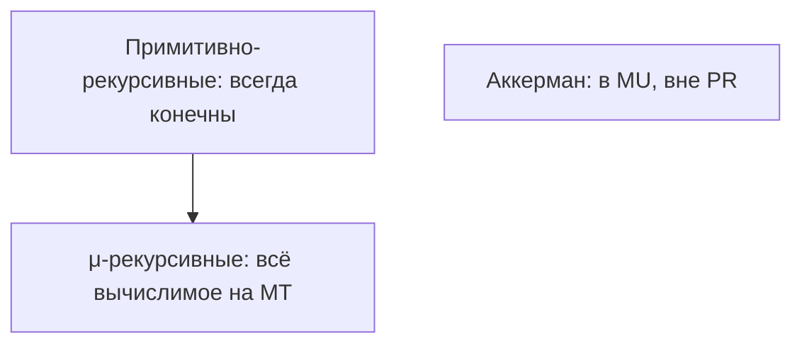

import ExternalPlayEmbed from '@site/src/components/ExternalPlayEmbed';


# Рекурсивные и вычислимые функции

<ExternalPlayEmbed example="data-markup/grammar-derivation-play" title="Вывод в КС-грамматике" minHeight={480} />


<div class="article-tags">
  <span class="tag tag-notrequired">НЕ ОБЯЗАТЕЛЬНО</span>
  <span class="tag tag-beginner">ДЛЯ НОВИЧКОВ</span>
</div>

<span class="complexity-badge">Архитектору</span>
<span class="complexity-badge">Инженеру</span>

В [теории чисел и псевдокоде](./33) рекурсия — это `factorial(n)` с базовым случаем и уменьшением аргумента. В **теории вычислимости** рекурсия — способ **построить класс всех вычислимых функций** из нескольких простых кирпичиков. Термины похожи, смысл другой.
В [теории чисел и псевдокоде](./33) рекурсия — это `factorial(n)` с базовым случаем и уменьшением аргумента. В **теории вычислимости** рекурсия — способ **построить класс всех вычислимых функций** из нескольких простых кирпичиков. Термины похожи, смысл другой.

> В прикладном коде рекурсию и стек вызовов разбирают в [функции в коде](/encyclopedia/4-code-dev/4-02-chto-takoe-kod-i-kak-on-rabotaet/4); ниже — теория вычислимых функций (другой смысл слова "функция").


Цепочка: [формальные основы алгоритма](./40) → эта статья → [машина Тьюринга](./42) → [обзор ТАФЯ](./38).

---

## Для читателя без математического фона

Слово **рекурсия** в Python вы уже видели: функция вызывает сама себя. Здесь то же слово, но речь о **классе всех функций**, которые вообще можно вычислить машиной — из нескольких "кирпичиков" (`0`, "плюс один", "взять i-й аргумент") и правил сборки.

**Зачем читать:**

- понять, что "всегда завершается" в API — это **тотальность**;
- увидеть, почему "проверить любую программу на корректность" упирается в [неразрешимость](./42);
- отличить **примитивную** рекурсию (гарантированный конец) от полной **μ-рекурсии** (всё вычислимое, включая тяжёлые функции вроде Аккермана).

Если формулы с `f(y, n+1) = h(y, n, f(y, n))` пугают — сначала прочитайте блок про факториал и таблицу "языки и множества", затем вернитесь к схемам.

---

## Понятие рекурсии в математике

**Рекурсивное определение** задаёт объект через **более простые** экземпляры того же типа:

- натуральные числа: `0` — база; `n+1` — "следующее за n";
- дерево: либо лист, либо узел с дочерними деревьями;
- список: пустой список или "голова + хвост-список".

В программировании вы пишете функцию, которая вызывает себя. В теории функций говорят о **схемах**: из уже известных функций `f`, `g` собрать новую `h` по шаблону — без произвольного "магического" кода.

<div class="callout callout--info">
  <div class="callout-title">Не путать</div>

  <div class="callout-body">
  **Рекурсия в коде** — приём реализации.

  **Примитивная рекурсия** — строгое ограничение класса функций, гарантирующее завершение на всех входах.

  **Частичная рекурсия** — расширение до всего, что вычислимо на машине Тьюринга, включая функции без значения на части входов.
</div>
  </div>


---

## Простейшие (базовые) функции

Работают с натуральными числами `ℕ = {0, 1, 2, …}` (в некоторых учебниках старт с 1 — суть та же).

| Функция | Обозначение | Смысл |
| --- | --- | --- |
| **Нуль** | `Z(n) = 0` | константа 0 |
| **Следующее** | `S(n) = n + 1` | "+1" |
| **Проекция** | `Pᵢᵏ(x₁,…,xₖ) = xᵢ` | выбрать i-й аргумент из k |

Проекции выглядят тривиально, но без них нельзя формально сказать "возьми второй аргумент" в схеме подстановки.

**Зачем натуральные числа `ℕ`?** В классической теории удобно кодировать всё дискретное числами — пары, списки, строки потом кодируют в одно большое число (идея [универсальной машины](./42)). В программировании вы оперируете объектами напрямую; в доказательствах — "всё свели к числам на ленте".

---

### Разбор — от `S` к сложению

Интуиция: `plus(a, b)` — "прибавить к `a` единицу `b` раз".

| Шаг | Значение `plus(2, 3)` | Комментарий |
| --- | --- | --- |
| база `b = 0` | `2` | `plus(a, 0) = a` |
| `b = 1` | `3` | `S(plus(2, 0)) = S(2)` |
| `b = 2` | `4` | ещё один `S` |
| `b = 3` | `5` | готово |

В коде это цикл `while b > 0: a += 1; b -= 1` или рекурсия. В теории — **примитивная рекурсия** по второму аргументу — счётчик `b` строго убывает (в смысле "дойти до 0"), поэтому завершение **гарантировано** для всех `a`, `b`.

---

## Схемы построения новых функций

### Суперпозиция (подстановка)

Если `f` зависит от `m` аргументов, а `g₁,…,gₘ` — функции от `n` общих переменных, то

`h(x₁,…,xₙ) = f(g₁(x₁,…,xₙ), …, gₘ(x₁,…,xₙ))`

— тоже **вычислимая** в том же классе. Аналог: вызвать `f` на результатах других функций — обычная композиция в коде.

---

### Примитивная рекурсия

Пусть `g` — база (функция от `n` переменных), `h` — "шаг", зависящий от `n`, значения на предыдущем шаге и **ещё m параметров**. Тогда единственная функция `f`:

```
f(y, 0) = g(y)
f(y, n+1) = h(y, n, f(y, n))
```

**Пример: сложение** `plus(a, b)` рекурсией по `b`:

- `plus(a, 0) = a`  (база `g`)
- `plus(a, b+1) = S(plus(a, b))`  (шаг через `S`)

**Пример: умножение** как примитивная рекурсия по второму аргументу через уже построенное сложение.

**Важно:** примитивно-рекурсивные функции **всегда тотальны** — определены для всех входов и **обязаны завершиться**. Это подкласс "хороших" вычислений; арифметика, Ackermann-подобные конструкции из учебника часто укладываются сюда.

---

### μ-оператор (минимизация)

Чтобы получить **все** вычислимые функции, добавляют **неограниченный поиск**: "наименьшее `t`, такое что …". Если такого `t` нет — результат **не определён** (функция **частичная**).

**Аналогия в коде:** цикл `for t in range(10**9) — if P(x, t): return t` без гарантии, что `P` когда-нибудь станет истинным. Если ответа нет — программа крутится вечно; в теории говорят: **значения нет** (частичная функция), а в проде ставят таймаут.

Отсюда **μ-рекурсивные (частично рекурсивные)** функции — то же мощности, что и машина Тьюринга (при стандартных определениях).



---

## Примитивно-рекурсивные и частично рекурсивные

| Класс | Завершение | Мощность |
| --- | --- | --- |
| **Примитивно-рекурсивные** | всегда | строго меньше полного класса вычислимых (классический пример — функция Аккермана) |
| **Частично (μ-) рекурсивные** | не гарантировано | **все** функции, вычислимые Тьюрингом |

**Вычислимая функция** — существует алгоритм (Тьюринг, программа), который для **каждого** входа из области определения за конечное время выдаёт значение.

**Рекурсивная функция** (в смысле "тотальная вычислимая") — вычислима и определена **везде** на `ℕᵏ`. В русской традиции "рекурсивные" ↔ тотальные вычислимые; "частично рекурсивные" допускают "зависание" как "нет значения".

Связь с [разрешимостью](./38) — язык **разрешим**, если характеристическая функция (1 — в языке, 0 — нет) **тотальна и вычислима**. **Рекурсивно перечислимый** язык — допускает полуалгоритм: "да" останавливается, "нет" может крутиться вечно.

---

## Типы рекурсивных алгоритмов (в программировании)

Теория и практика снова сходятся по форме:

| Тип | Структура | Пример в коде |
| --- | --- | --- |
| **Линейная** | один рекурсивный вызов | факториал, обход списка |
| **Древовидная** | несколько вызовов | merge sort, обход дерева |
| **Взаимная (взаимная рекурсия)** | `f` зовёт `g`, `g` зовёт `f` | парсер "выражение / терм" |
| **Хвостовая** | рекурсия — последняя операция | можно заменить циклом (оптимизация компилятора) |

Парсеры в [компиляторе](/encyclopedia/1-basics/1-19-programma/2) — классический пример **взаимной рекурсии**, согласованной с [КС-грамматикой](./43).

---

### Факториал — два взгляда

**В коде (Python):**

```python
def fact(n: int) -> int:
    if n <= 0:
        return 1
    return n * fact(n - 1)
```

**В теории:** `fact` строится из `0`, `S`, умножения (само примитивно рекурсивно) — поэтому **тотальна**.

**Контрпример к "всё рекурсивное — примитивное":** функция **Аккермана** растёт быстрее любой примитивно-рекурсивной, но **вычислима** — нужна полная мощь μ-рекурсии / Тьюринга.

---

### Функция Аккермана (разбор)

Определение (один из вариантов):

```text
A(0, n) = n + 1
A(m+1, 0) = A(m, 1)
A(m+1, n+1) = A(m, A(m+1, n))
```

Реализация (для экспериментов — с кэшем; на больших `m,n` растёт глубина стека):

```python
from functools import lru_cache

@lru_cache(maxsize=None)
def ack(m: int, n: int) -> int:
    if m == 0:
        return n + 1
    if n == 0:
        return ack(m - 1, 1)
    return ack(m - 1, ack(m, n - 1))

print(ack(3, 2))  # 29 — уже "большое" для интуиции
```

Значения растут **фантастически** быстро: `A(4, 2)` уже больше числа атомов в наблюдаемой Вселенной. При этом для каждой пары `(m, n)` результат **конечен** — функция **тотальна**.

**Смысл для теории:** существуют **вычислимые** функции, которые нельзя получить конечным числом применений только **примитивной** рекурсии от `S` и проекций. Любая "закрытая" арифметика в духе "только циклы for с известной глубиной" не покрывает весь класс интуитивно вычислимого.

В коде Ackermann — stress-тест для стека и рекурсии; в курсе ТАФЯ — **граница** примитивной рекурсии.

---

### μ-оператор — пример

Пусть `μy[P(x, y)]` — "наименьшее `y`, такое что `P(x,y)` истинно". Если такого `y` нет — значение **не определено**.

Идея: "разложение на множители" — перебор делителей до `√n` формулируется через минимизацию. Перебор с остановкой при успехе — **частичный** алгоритм на входах без решения (или тотальный, если заранее гарантирован ответ).

---

### Языки и множества — таблица

| Понятие | Характеристическая функция | Алгоритм "да" | Алгоритм "нет" |
| --- | --- | --- | --- |
| **Разрешимый (recursive) язык** | тотальна, вычислима | всегда останавливается | всегда останавливается |
| **Рекурсивно перечислимый (RE)** | полуразрешим | останавливается | может **не** остановиться |
| **Со-дополнение RE** | если `L` RE, то `Σ*\L` может быть **не** RE | — | ключ к доказательству неразрешимости |

Язык программ, которые **останавливаются** на пустом входе — RE, но **не** разрешим (см. [проблему остановки](./42)).

---

### Теорема Райса (идея, без доказательства)

**Любое нетривиальное** свойство **семантики** программ (что программа **делает**, а не как записана) **неразрешимо** в общем виде.

Примеры нетривиальных свойств — "вычисляет константу 42", "корректен для всех входов", "эквивалентна данной программе".

**Тривиальное** свойство — то, что выполняется для **всех** программ или ни для одной ("программа написана символами ASCII"). **Нетривиальное** — часть программ да, часть нет.

**Человеческий смысл:** вопрос "что **на самом деле** делает этот код?" в полной общности не сводится к одной кнопке "проанализировать". Инструменты работают на **ограниченных** фрагментах:

| Инструмент | Что проверяет | Почему это возможно |
| --- | --- | --- |
| TypeScript types | синтаксис + часть семантики | ограниченная модель |
| ESLint правила | шаблоны в AST | [регулярные](./44) / локальные правила |
| Parser | принадлежность [грамматике](./43) | КС, не произвольная семантика |
| Unit-тесты | перечисленные входы | конечная выборка, не все входы мира |

Следствие: **универсальный** анализатор "всегда освобождает ресурсы / без утечек / эквивалентен эталону" для **любой** программы на **любом** языке — логический предел; в проде — приближения и ограничения области.

---

## Связь с машиной Тьюринга

Теорема (идея): функция вычислима на **машине Тьюринга** тогда и только тогда, когда она **частично рекурсивна** (в смысле μ-рекурсии). Поэтому в [статье про Тьюринга](./42) проблема остановки — центральная: она отделяет "есть значение" от "зациклилось".

Для инженера — **любой** ваш алгоритм на C/Java/Python, который **всегда** завершается и возвращает число, задаёт тотальную вычислимую функцию. Если допускаете бесконечный цикл на части входов — **частичную**.

---

## Практические следствия

1. **Тотальность vs частичность** в API: "метод всегда возвращает ответ" — контракт тотальности; "ждём до таймаута" — признание частичности в реальном мире.
2. **Рекурсия в стеке** — ограничение глубины (переполнение) не отменяет теоретической тотальности; это лимит реализации.
3. **Доказательство завершения** для критичных систем часто сводят к нахождению **варианта** (лексикографического порядка), похожего на примитивную рекурсию по "мере" входа.

---

## Разбор — факториал и gcd

**Факториал** — классическая **примитивная рекурсия** по второму аргументу (или по одному, если первый фиксирован).

**НОД (алгоритм Евклида):** `gcd(a, 0) = a`, `gcd(a, b) = gcd(b, a mod b)` — рекурсия по **уменьшающемуся** второму аргументу; в теории это тоже укладывается в вычислимые (и примитивно-рекурсивные) построения над `mod` и сравнением.

**В коде** вы доказываете завершение **вариантом** `b → 0`; в формальной логике — тем же "мере", что в учебнике по μ- и примитивной рекурсии.

---

## Упражнение

1. Рекурсивно опишите `sum(1..n)` и укажите базу и шаг в форме `f(n+1) = h(n, f(n))`.
2. Почему "поиск в графе без ограничения глубины" может не давать тотальной функции на всех графах?
3. Приведите свойство API, которое **семантическое** (поведение), а не **синтаксическое** (имя метода) — оно попадает под "дух" теоремы Райса.

---

## Вопросы для самопроверки

1. Чем **примитивная рекурсия** отличается от рекурсивного вызова в Python?
2. Почему функция Аккермана не примитивно-рекурсивна, но вычислима?
3. Что такое **частичная** функция и как это связано с полуразрешимостью языка?
4. Приведите пример **взаимной рекурсии** из синтаксиса языка программирования.

Дальше: [Машина Тьюринга](./42).

---
