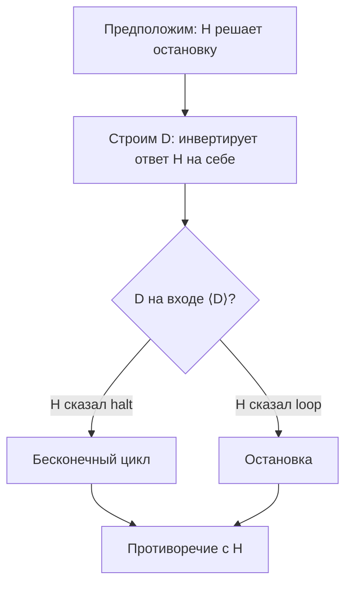
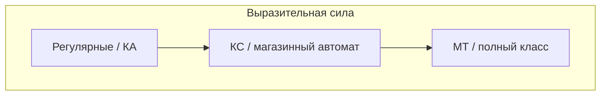

# Машина Тьюринга

<div class="article-tags">
  <span class="tag tag-notrequired">НЕ ОБЯЗАТЕЛЬНО</span>
  <span class="tag tag-beginner">ДЛЯ НОВИЧКОВ</span>
</div>

<span class="complexity-badge">Архитектору</span>
<span class="complexity-badge">Инженеру</span>

**Машина Тьюринга (МТ)** — мысленный компьютер из полоски бумаги и набора правил. Её не производят, но на ней **доказывают**, что некоторые задачи не решаются **никаким** кодом. Алан Тьюринг предложил модель в 1936 году; сегодня она — сердце [теории вычислимости](./38).

См. также: [Великие люди — Тьюринг](/encyclopedia/9-spinoff/9-01-velikie-lyudi/1), [рекурсивные функции](./41), [формальные основы алгоритма](./40).

---

## Для читателя без математического фона

Представьте **длинную ленту в клетку** (как чековая лента или бесконечная строка в редакторе), **курсор** на одной клетке и **блокнот с текущим режимом** (состояние автомата). На каждом шаге вы смотрите символ под курсором, по таблице решаете: **что записать**, **куда сдвинуть курсор**, **в какой режим перейти**. Всё. Из этого минимума выводится, что любой ваш Python "в принципе" не мощнее такой модели — и что некоторые вопросы про **произвольные** программы **не решаются** никаким кодом.

**Связь с реальностью:**

| МТ | Компьютер |
| --- | --- |
| лента | память (RAM, файл) |
| головка | указатель / текущая ячейка |
| состояние `q` | "где мы в программе" (PC + режим) |
| таблица `δ` | машинный код / интерпретатор |
| остановка | процесс завершился |

Память в МТ **неограничена** в теории; в жизни — лимит RAM. Теория отвечает на "можно ли в принципе"; инженерия — на "влезет ли в 32 ГБ".

---

## Машина Тьюринга как способ представления алгоритмов

Любой алгоритм, который можно выполнить на обычном компьютере при неограниченной памяти (в рамках **тезиса Чёрча–Тьюринга**), можно переписать как работу МТ:

1. Вся память — **лента** из ячеек с символами.
2. **Головка** читает/пишет одну ячейку и двигается влево/вправо.
3. **Управление** — конечный автомат состояний: "в состоянии `q`, видя символ `a`, сделай действие и перейди в `q'`".

Программа на Java — миллионы состояний и сложная семантика; МТ — предельное упрощение: **всё** сводится к символам и таблице переходов. Упрощение не делает модель слабой — она **Тьюринг-полна**.

---

## Неформальное определение

Представьте бесконечную ленту в клетку, в каждой клетке — символ из конечного **алфавита** (например `{0, 1, B}`, где `B` — blank, "пустая" клетка). Головка в каждый момент смотрит на одну клетку. Есть **состояния** `q₀, q₁, …` (как узлы [конечного автомата](./44)). На каждом шаге:

- читаем символ под головкой;
- по правилу **записываем** новый символ (или тот же);
- **сдвигаем** головку ← / → / стоим;
- переходим в **новое состояние**.

Если правил нет — машина **останавливается** (или зацикливается — в зависимости от постановки). **Принимающее** состояние означает "ответ да" для задачи распознавания.

```text
# Псевдокод шага (как в статье о Тьюринге)
пока состояние не в {HALT, ACCEPT, REJECT}:
    (символ_записи, направление, новое_состояние) = δ[состояние][символ_под_головкой]
    записать(символ_записи)
    сдвинуть_головку(направление)
    состояние = новое_состояние
```

---

## Формальное определение

**Детерминированная машина Тьюринга** — кортеж:

`M = (Q, Σ, Γ, δ, q₀, B, F)`

| Компонент | Смысл |
| --- | --- |
| `Q` | конечное множество **состояний** |
| `Σ` | **входной алфавит** (символы на ленте при старте) |
| `Γ` | **ленточный алфавит**, `Σ ⊆ Γ` (добавляют служебные символы) |
| `δ : Q × Γ → Q × Γ × {L, R}` | **функция переходов** (детерминированная) |
| `q₀ ∈ Q` | начальное состояние |
| `B ∈ Γ \ Σ` | символ **пустой** ячейки |
| `F ⊆ Q` | **принимающие** (финальные) состояния — для распознавателей |

**Конфигурация** — тройка (содержимое ленты, положение головки, текущее состояние). **Вычисление** — последовательность конфигураций по `δ`.

**Язык, распознаваемый МТ:** множество входных слов, на которых `M` останавливается в состоянии из `F`.

Недетерминированная МТ: `δ` возвращает **множество** вариантов; по мощности класса языков не расширяет (эквивалентна детерминированной), но удобна в доказательствах.

---

## Способы представления машины Тьюринга

| Способ | Когда удобен |
| --- | --- |
| **Таблица переходов** | полная формальная запись, проверка вручную |
| **Диаграмма переходов** | как у [ДКА](./44), для небольших машин |
| **Словесный алгоритм** | "если видишь 0 — иди вправо…" |
| **Код симулятора** | учебная проверка на Python |

**Пример 1: замена `0` → `1`.** Состояния `q₀` (ищем начало слова), `q₁` (читаем и заменяем), `q₂` (HALT на blank). Таблица фрагмента:

| Состояние | Символ | Запись | Движение | Новое |
| --- | --- | --- | --- | --- |
| q₀ | 0 | 1 | R | q₁ |
| q₁ | 0 | 1 | R | q₁ |
| q₁ | B | B | R | q₂ |

**Проследим слово `00` на ленте (упрощённо).**

| Шаг | Состояние | Под головкой | Действие |
| --- | --- | --- | --- |
| 0 | q₀ | первый `0` | пишем `1`, R → q₁ |
| 1 | q₁ | второй `0` | пишем `1`, R → q₁ |
| 2 | q₁ | `B` | остаёмся, S → q₂ (стоп) |

На ленте получилось `11` — учебная "замена всех нулей на единицы до пустого хвоста". Важно: каждый шаг **однозначен** (детерминированная МТ).

**Пример 2: палиндром над `{0,1}` (идея).** Копируют символ маркером, сдвигают головку к противоположному концу, сравнивают, съедают — классическое упражнение на **многоходовую** ленту в голове; формально всё сводится к одной ленте служебными символами.

**Многосекционная лента (удобство):** в доказательствах часто вводят 2–3 ленты (вход, рабочая, выход); теорема: **k лент** не сильнее одной (симуляция с чередованием треков на одной ленте).

В инженерии **таблица переходов** напоминает таблицу парсера или state machine в workflow — только лента в теории неограничена.

---

## Вычислимые функции

МТ может **вычислять функцию** `f: ℕᵏ → ℕ`: на ленту кодируют аргументы (например, унарно: число `n` — `n` единиц), запускают `M`, после остановки **декодируют** результат с ленты.

- **Частичная функция** — определена только на тех входах, где `M` **останавливается**.
- **Тотальная вычислимая** — останавливается на всех входах.

Эквивалентность с [μ-рекурсивными функциями](./41): то же класс "алгоритмически вычислимого".

---

## Операции над машинами Тьюринга

Из простых машин строят сложные (как из функций — композиция):

| Операция | Идея |
| --- | --- |
| **Композиция** | выход первой — вход второй |
| **Ветвление** | по маркеру на ленте выбрать подпрограмму |
| **Цикл** | повторять фрагмент, пока не выполнится условие |
| **Копирование блока** | служебные символы для переноса слова |

Так доказывают, что модель **замкнута**: всё, что собирается из МТ, снова МТ. Отсюда — **универсальная** машина.

---

## Машина Тьюринга с полулентой

**Полулента** (односторонняя): бесконечность только в одну сторону, слева — "стена". Формально слабее выглядящая модель, но **эквивалентна** полной: любую полную МТ можно симулировать на полуленте (кодируют "вправо" и маркеры).

Для интуиции: стек вызовов растёт в одну сторону, а "прошлое" не перечитывается — похожая идея ограничения доступа к памяти.

---

## Универсальная машина Тьюринга

**Универсальная МТ (УМТ)** — такая машина `U`, которая на вход получает **кодирование** программы `P` (описание таблицы переходов) и **вход** `x`, и **симулирует** поведение `P` на `x`.

Аналог в мире ПО: **интерпретатор** или **виртуальная машина** — одна фиксированная программа `U`, которая читает байткод и данные.

Следствие: **программа и данные — одно и то же** на ленте (как код в RAM в [архитектуре фон Неймана](/encyclopedia/9-spinoff/9-01-velikie-lyudi/1)).

---

### Как кодируют программу на ленте

1. Фиксируют **конечный** алфавит инструкций (опкод + адреса).
2. Записывают таблицу переходов МТ `P` как строку `⟨P⟩`.
3. Универсальная машина `U` читает `⟨P⟩`, симулирует декодирование и шаг `δ` в цикле.

Тот же приём — **виртуальная машина**, **интерпретатор байткода**, **WASM runtime**: одна фиксированная "машина" `U`, меняется только "лента" с описанием `P`.

**Самоприменение** `U(⟨P⟩, x)` — теоретическая версия `eval(source, input)` в Python; проблема остановки — "можно ли написать `always_terminates(source, input)` для всех пар".

---

## Алгоритмически неразрешимые проблемы

**Разрешимая проблема** — существует алгоритм, который для **любого** входа за конечное время отвечает "да" или "нет".

---

### Проблема остановки

**Вход:** код программы `P` и данные `x`.  
**Вопрос:** остановится ли `P` на `x`?

**Теорема:** такой **универсальный** алгоритм **не существует**.

**Интуиция без формул:** если бы существовала программа `HaltChecker`, которая для **любой** пары `(программа, вход)` за конечное время отвечала "да, остановится" / "нет, зациклится", можно было бы построить **ловушку** — программу, которая делает намеренно противоположное тому, что предсказал checker, когда её запускают на **собственном** коде. Получается логическое противоречие: checker не может быть всегда прав. Значит, полного автоматического "анти-зацикливателя" для всех программ **в принципе** нет — только эвристики, таймауты, проверки на подклассах программ.

**Практические аналоги (не строгие, но близкие по духу):**

| Вопрос | Почему тяжело в общем случае |
| --- | --- |
| Завершится ли произвольный скрипт? | остановка |
| Эквивалентны ли два парсера на всех входах? | сводится к остановке |
| Всегда ли сервис выходит из deadlock? | частично моделируется автоматами, полная проверка — ограничена |

---

### Эскиз доказательства (диагонализация)

Обозначим `H(P, x)` — гипотетическая программа, которая **всегда останавливается** и отвечает "да", если `P` на входе `x` останавливается, и "нет" — если нет.

Построим **диагональную** программу `D`:

1. На вход `⟨P⟩` (код программы) запустить `H(⟨P⟩, ⟨P⟩)` — проверка остановки **на себе**.
2. Если `H` сказал "остановится" — уйти в **бесконечный цикл**.
3. Если `H` сказал "не остановится" — **остановиться**.

Что будет с `D(⟨D⟩)`?

- Если `H` говорит "D останавливается на ⟨D⟩" → по построению `D` **зацикливается** — противоречие.
- Если `H` говорит "D не останавливается" → по построению `D` **останавливается** — снова противоречие.

Значит, `H` **не существует**. Это не "технический долг анализаторов" — логический предел.



---

### Сведение (reduction)

Чтобы доказать, что задача **X** неразрешима, достаточно показать: **если бы** был алгоритм для X, из него можно было бы собрать решатель остановки.

| Задача X | Идея сведения |
| --- | --- |
| "Программа печатает `Hello`" | встроить проверку в конец симуляции |
| "Две программы эквивалентны" | сводится к остановке |
| "Программа корректна на всех входах" | тотальность семантики |

В инженерии: "мы упростили анализ до проверки типов" — это **сознательное** ограничение мощности, чтобы не попасть в зону неразрешимости.

---

### Другие классические неразрешимые задачи

| Проблема | Смысл для практики |
| --- | --- |
| **Пустота языка МТ** | нет общего способа узнать, что автомат вообще что-то принимает |
| **Эквивалентность двух МТ** | нельзя автоматически доказать, что два парсера/валидатора эквивалентны |
| **Принадлежность слова универсальному языку** | связана с остановкой |
| **Тотальность частичной функции** | "завершится ли на всех входах" |

Для **регулярных** и части **КС** задач ситуация лучше: пустота регулярных языков, эквивалентность ДКА — **разрешимы** ([конечные автоматы](./44)).

---

### Связь со статическим анализом

IDE не "ленятся" находить все баги: **полный** анализ произвольной программы упирается в неразрешимость. Поэтому используют **приближения**: анализ на уровне [регулярных](./44) или [КС](./43) свойств, ограниченные по времени, с false positive/negative.

---

## Сравнение с другими моделями



| Модель | Память | Типичная роль |
| --- | --- | --- |
| [ДКА](./44) | конечная | токены, regex |
| [МП-автомат](./45) | стек | синтаксис |
| **МТ** | лента | "всё вычислимое" |

---

## Учебная симуляция МТ (Python)

Таблица переходов `δ[(state, symbol)] = (write, move, next)`; `move` — `'L'`, `'R'` или `'S'` (стоять):

```python
def run_tm(tape: list[str], delta: dict, q0="q0", blank="B",
           accept=None, reject=None, max_steps=10_000):
    accept = accept or {"q_accept"}
    reject = reject or {"q_reject"}
    head, state = 0, q0
    for _ in range(max_steps):
        if state in accept:
            return True
        if state in reject:
            return False
        sym = tape[head] if 0 <= head < len(tape) else blank
        if (state, sym) not in delta:
            return False
        write, move, state = delta[(state, sym)]
        if 0 <= head < len(tape):
            tape[head] = write
        elif write != blank:
            tape.append(write)
            head = len(tape) - 1
        if move == "L":
            head -= 1
        elif move == "R":
            head += 1
    return False

# Замена всех 0 на 1 до blank (упрощённо)
delta = {
    ("q0", "0"): ("1", "R", "q0"),
    ("q0", "1"): ("1", "R", "q0"),
    ("q0", "B"): ("B", "S", "q_accept"),
}
print(run_tm(list("0010"), delta))  # True
```

Это не полноценная УМТ, но тот же цикл "конфигурация → δ → новая конфигурация", что в определении выше.

---

## Мини-лабораторная

1. Нарисуйте ДКА для слов над `{0,1}`, оканчивающихся на `01` — затем представьте, как тот же язык могла бы проверять **двухсекционная** МТ (лента 1 — вход, лента 2 — счётчик).
2. Сформулируйте на русском: "дана программа и вход; существует ли путь выполнения без deadlock" — почему это близко к духу проблемы остановки?
3. Назовите одну **разрешимую** подзадачу для Java-кода (например, на уровне [регулярных](./44) токенов) и одну **неразрешимую** в общем виде.

---

## Контрольные вопросы

1. Перечислите компоненты кортежа `M = (Q, Σ, Γ, δ, q₀, B, F)`.
2. Чем **распознавание языка** отличается от **вычисления функции** на МТ?
3. Зачем нужна **универсальная** машина?
4. Сформулируйте **проблему остановки** и одно практическое следствие.

Дальше: [Формальные грамматики и разбор](./43).

---
