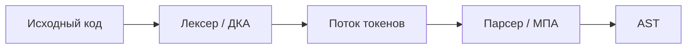

import ExternalPlayEmbed from '@site/src/components/ExternalPlayEmbed';


# Конечные автоматы и регулярные языки

<div class="article-tags">
  <span class="tag tag-notrequired">НЕ ОБЯЗАТЕЛЬНО</span>
  <span class="tag tag-beginner">ДЛЯ НОВИЧКОВ</span>
</div>

<span class="complexity-badge">Архитектору</span>
<span class="complexity-badge">Инженеру</span>

**Конечный автомат (КА)** — схема с памятью "только в голове": текущее **состояние** из конечного набора. Прочитал символ — перешёл. Никакого стека и ленты. Так работают лексеры, [регулярные выражения](/encyclopedia/4-code-dev/4-01-algoritmy/111), простые протоколы ("ожидаем заголовок → тело").

Часть [теории автоматов](./38). Далее по мощности: [магазинные автоматы](./45). Грамматики: [формальные грамматики](./43).

---

## Для читателя без математического фона

**Конечный автомат** — схема "в каком я **режиме** нахожусь" после прочтения очередного символа. Память только в голове: **текущее состояние** из конечного списка. Нет стека, нет "вспомнить, сколько скобок открыли" — поэтому вложенность вроде `((()))` **вне** чистого КА.

**Где вы уже видели КА:**

- переключатель "ожидаю логин → ожидаю пароль → авторизован";
- regex "строка из цифр";
- лексер, который выделяет `while`, числа, строки в исходнике.

**Словарь:**

| Термин | Смысл |
| --- | --- |
| `Q` | список состояний (режимов) |
| `Σ` | алфавит входа (символы, которые читаем) |
| `δ` | таблица переходов: (состояние, символ) → новое состояние |
| `q₀` | старт |
| `F` | "хорошие" финальные состояния — принять строку |

---

## Понятие автомата. Типы автоматов

| Тип | Память | Класс языков |
| --- | --- | --- |
| **Конечный (FA)** | состояние `|Q|` | регулярные |
| **Магазинный (PDA)** | состояние + стек | контекстно-свободные |
| **Линейно-ограниченный** | лента ограничена длиной слова | тип 1 |
| **Машина Тьюринга** | бесконечная лента | тип 0 |

**Распознаватель** — автомат, который для входного слова отвечает **принять / отклонить** (достижение принимающего состояния после чтения всего ввода).

**Преобразователь (трансдуктор)** — на переходе может **выдавать** выходные символы; см. [Мили и Мура](./45).

---

## Формальное определение автомата

### Детерминированный конечный автомат (ДКА)

`A = (Q, Σ, δ, q₀, F)`

| Компонент | Смысл |
| --- | --- |
| `Q` | конечное множество **состояний** |
| `Σ` | **входной алфавит** |
| `δ : Q × Σ → Q` | **переход** (ровно один следующий шаг) |
| `q₀ ∈ Q` | **начальное** состояние |
| `F ⊆ Q` | **принимающие** (финальные) состояния |

**Расширение** `δ̂` на слова — `δ̂(q, ε) = q`, `δ̂(q, wa) = δ(δ̂(q, w), a)`.

Слово **принято**, если `δ̂(q₀, w) ∈ F`.

---

### Недетерминированный КА (НКА)

`δ : Q × Σ → 2^Q` — множество возможных следующих состояний. Слово принято, если **существует** путь в графе переходов, заканчивающийся в `F`.

**Теорема:** для каждого НКА есть **эквивалентный** ДКА (построение подмножеств: состояния ДКА — подмножества состояний НКА). По **мощности языков** НКА = ДКА.

В regex-движках часто сначала строят НКА (Thompson), потом детерминизируют для быстрого прогона.

<ExternalPlayEmbed example="data-markup/finite-automaton-demo" title="Конечный автомат" minHeight={480} />

---

## Языки и автоматы

**Язык** `L ⊆ Σ*` — множество допустимых строк.

**Регулярный язык** — распознаётся некоторым ДКА (эквивалентно — НКА, регулярной грамматикой, regex).

Примеры:

| Язык | Идея автомата |
| --- | --- |
| слова, оканчивающиеся на `ab` | цепочка "увидел a → жду b → принять" |
| чётное число символов `a` | два состояния: чёт / нечёт |
| идентификатор C | буква/`_`, затем буквы/цифры/`_` |

**Не регулярно:** `&#123; aⁿbⁿ | n ≥ 0 &#125;` — нужен счётчик "сколько a", память КА не хватает.

---

### Разбор — ДКА "строка оканчивается на `ab`"

Алфавит `&#123;a, b&#125;`. Состояния — `q0` (старт), `qa` (видели `a` в конце), `qab` (принять).

| Текущее | Символ | Следующее | Зачем |
| --- | --- | --- | --- |
| `q0` | `a` | `qa` | возможное начало суффикса `ab` |
| `q0` | `b` | `q0` | `b` не подходит как конец `ab` |
| `qa` | `a` | `qa` | снова ждём `b` |
| `qa` | `b` | `qab` | увидели `ab` |
| `qab` | `a` | `qa` | после принятия продолжаем читать |
| `qab` | `b` | `q0` | сброс |

Строка `aaab`: `q0 → qa → qa → qa → qab` — **принята**. Строка `aba`: заканчивается в `qa`, не в `qab` — **отклонена**.

Попробуйте тот же путь на интерактивном виджете ниже.

---

### Лемма о накачке для регулярных языков

Если `L` регулярно, то существует константа `p` (число состояний минимального ДКА + 1), такая что для любого слова `w ∈ L` длины `≥ p` можно разбить `w = xyz`, где:

- `|xy| ≤ p`,
- `|y| ≥ 1`,
- для всех `i ≥ 0` слово `xyⁱz` тоже в `L`.

**Доказательство идеи для `aⁿbⁿ`:** в ДКА после `p` символов `a` повторяется **состояние**; "накачка" только `a` даёт слово `aⁿ⁺ⁱbⁿ`, которое ДКА всё ещё принимает, но оно **не** в языке `aⁿbⁿ` — противоречие.

Отсюда — вложенные скобки, XML без атрибутов, счётчик "открытых тегов" — [КС](./43) / [стек](./45), не regex.

---

## Регулярные множества

Регулярные языки замкнуты относительно операций:

| Операция | Обозначение | Regex-аналог |
| --- | --- | --- |
| **Объединение** | `L₁ ∪ L₂` | `r1\|r2` |
| **Конкатенация** | `L₁ · L₂` | `r1r2` |
| **Итерация (звезда Клини)** | `L*` | `r*` |
| **Дополнение** | `Σ* \ L` | (с ДКА — дополнить и сменить F) |
| **Пересечение** | `L₁ ∩ L₂` | (декартово произведение автоматов) |

**Регулярное выражение** — алгебраическая запись тех же языков — `∅`, `ε`, символы, `+`, `·`, `*`, скобки.

Связь с практикой: [Регулярные выражения](/encyclopedia/4-code-dev/4-01-algoritmy/111) — инженерный синтаксис; [готовые паттерны](/lab/Примеры/615); под капотом — автомат или backtracking (в зависимости от движка; backtracking может выходить за "чистые" регулярные языки в расширенных regex).

---

## Операции над регулярными языками (построения)

Классические конструкции "из автоматов":

1. **Объединение** — новый старт с ε-переходами к старым (в НКА); для ДКА — произведение с объединением F.
2. **Конкатенация** — принимающие первого соединить с стартом второго.
3. **Звезда** — новый старт/финал, цикл по старому автомату.

Из regex компилятор строит НКА, затем ДКА — отсюда предсказуемое время **O(|w|)** на строку `w` после компиляции.

---

### Построение НКА из regex (Thompson)

| Конструкция | Автомат |
| --- | --- |
| `∅` | нет принимающего пути |
| `ε` | ε-переход в accept |
| символ `a` | `start --a--> accept` |
| `r1 \| r2` | ε-ветвление к подавтоматам |
| `r1 r2` | concat через ε между ними |
| `r*` | ε-петля вокруг подавтомата |

---

### Детерминизация НКА (подмножества)

Состояния ДКА = **подмножества** состояний НКА, содержащие хотя бы одно достижимое из `q₀` по ε-замыканию. Переход по `a` — взять все `δ(q, a)`, снова ε-замыкание.

**Цена:** до `2^|Q|` состояний — в худшем случае взрыв. На практике лексеры и компактные regex редко бьют в экспоненту; тем не менее **pathological** regex существуют (учебные примеры для ReDoS).

---

### Теорема Майхилла–Нероде

Язык `L` регулярен **тогда и только тогда**, когда отношение **неразличимости** по продолжениям имеет **конечное** число классов.

**Практика:** минимизация ДКА = сжатие таблицы переходов лексера; два состояния сливают, если на **всех** продолжениях `z` поведение (принять/отклонить) совпадает.

---

## Автоматные (регулярные) грамматики

**Праволинейная** грамматика (тип 3): правила только вида

- `A → aB`  (потом ещё символы)
- `A → a`   (закончить)

или **леволинейная** (`A → Ba`). Язык **регулярный** ⟺ порождается такой грамматикой ⟺ распознаётся ДКА.

**Пример:** идентификатор

```
S → letter R
R → letter R | digit R | ε
```

(с ε или без — в зависимости от стиля; эквивалентно ДКА "в состоянии чтения хвоста").

См. [классификацию Хомского](./43).

---

## Минимизация и эквивалентность

**Минимальный ДКА** для языка `L` — единственный (с точностью до изоморфизма) автомат с минимальным числом состояний.

Алгоритм (идея) — **различимые** состояния — те, из которых одна строка ведёт в принятие, другая — в отклонение; сливать **неразличимые** классы.

**Разрешимость:** для двух ДКА можно **алгоритмически** проверить, задают ли они один язык (в отличие от [КС-грамматик](./43)).

Практика: оптимизация таблицы переходов в lexer generator, сжатие state machine в протоколах.

---

## Распознаватели в пайплайне компилятора



Лексер — набор ДКА (или одного с метками) для ключевых слов, чисел, строк. [Компиляция](/encyclopedia/1-basics/1-19-programma/2), этап 1.

---

## Эксперимент по распознаванию состояния

В учебниках по ТА: **можно ли** по наблюдаемым входам/выходам отличить, в каком скрытом состоянии стартовал автомат? Для **полного** наблюдения переходов — иногда да (диагностическая последовательность). Для **чёрного ящика** с одинаковыми внешними реакциями — **неразличимые** состояния сливают при минимизации.

Это мост к [автоматам Мили и Мура](./45) и тестированию stateful API: "какой sequence запросов выведет систему в ошибку 403?".

---

## Практические советы

1. Если нужна **вложенность** (скобки, XML без атрибутов) — regex **недостаточен**, нужен [парсер](./43).
2. Детерминированный автомат проще отлаживать; НКА удобнее **собирать** из кусков.
3. Модели сессий ("логин → корзина → оплата") часто рисуют как КА — проверяйте, не нужен ли счётчик (тогда уже не чисто регулярно).

---

### ReDoS (regular expression denial of service)

Если движок regex использует **наивный backtracking** на "плохом" шаблоне `(a+)+b` и входе `aaaa...` без `b`, время может расти **экспоненциально**. Детерминированный ДКА даёт **линейное** время по длине входа после компиляции.

**Вывод:** для пользовательских regex в продакшене — знать движок (DFA-based vs backtracking), ограничивать длину входа, тестировать catastrophic backtracking.

---

### ДКА "чётное число нулей" в коде

Два состояния `even` / `odd`; читаем символы `{0,1}`, считаем только `0`:

```python
def dfa_even_zeros(s: str) -> bool:
    state = "even"
    for ch in s:
        if ch not in "01":
            return False
        if ch == "0":
            state = "odd" if state == "even" else "even"
    return state == "even"

print(dfa_even_zeros("1010"))  # True — два нуля (чётное число)
```

Тот же язык можно описать regex в движке с **детерминизацией**; важно не путать с языком `aⁿbⁿ`, для которого нужен [стек](./45).

---

## Мини-лабораторная

1. Постройте ДКА для языка "чётное число символов `0` над `{0,1}`" (два состояния).
2. Объедините два ДКА "заканчивается на `0`" и "заканчивается на `1`" — сколько состояний в произведении?
3. Объясните, почему `(.|\n)*` в regex движка с backtracking может быть опаснее, чем кажется.

---

## Контрольные вопросы

1. Запишите кортеж ДКА и условие принятия слова.
2. Почему НКА не "сильнее" ДКА по языкам?
3. Какие три операции замыкают класс регулярных языков?
4. Почему `aⁿbⁿ` не регулярный язык?
5. Где в компиляторе стоит конечный автомат?

Дальше: [Магазинные автоматы, Мили и Мура](./45).

---
