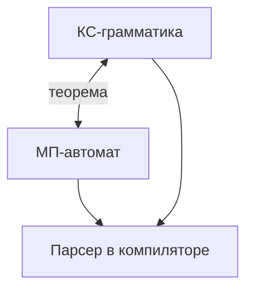

# Магазинные автоматы, Мили и Мура

<div class="article-tags">
  <span class="tag tag-notrequired">НЕ ОБЯЗАТЕЛЬНО</span>
  <span class="tag tag-beginner">ДЛЯ НОВИЧКОВ</span>
</div>

<span class="complexity-badge">Архитектору</span>
<span class="complexity-badge">Инженеру</span>

**Конечный автомат** помнит только "где мы сейчас". Для **вложенных** конструкций — скобок, дерева вызовов, вложенных `if` — нужна память **LIFO**: последний открытый элемент закрывается первым. В теории это **магазинный (стековый) автомат**; в компиляторе — **парсер** со стеком нетерминалов.

Предшествующие темы: [конечные автоматы](./44), [грамматики](./43). Обзор: [ТАФЯ](./38).

---

## Для читателя без математического фона

**Магазинный автомат** = [конечный автомат](./44) + **стек** (LIFO: последним положили — первым сняли). Стек — та же идея, что при проверке скобок: открыли `(` — положили на стек; закрыли `)` — сняли и сверили пару.

| Задача | ДКА | МП-автомат |
| --- | --- | --- |
| "строка из букв и цифр" | достаточно | достаточно |
| "скобки `()` сбалансированы" | памяти не хватает | стек считает вложенность |
| "выражение `a + (b * c)`" | — | парсер + [грамматика](./43) |

**Мили и Мура** — про автоматы, которые **что-то выдают** на каждом шаге (сигнал, действие), а только "да/нет" в конце. Удобно для протоколов, UI state machines, прошивок.

---

## Автоматы с магазинной памятью (МП-автомат, PDA)

**МП-автомат** — кортеж (в одной из распространённых форм):

`M = (Q, Σ, Γ, δ, q₀, Z₀, F)`

| Компонент | Смысл |
| --- | --- |
| `Q` | состояния (как у [ДКА](./44)) |
| `Σ` | **входной** алфавит |
| `Γ` | **магазинный** алфавит (символы стека) |
| `δ` | переходы с операциями над стеком |
| `q₀` | начальное состояние |
| `Z₀` | **дно стека** (начальный символ) |
| `F` | принимающие состояния |

На шаге автомат читает (или не читает) символ входа и **заменяет** вершину стека строкой символов из `Γ`.

**Запись перехода** (один из стандартов):

`(q, a, X) ⊢ (q', γ)` — в состоянии `q`, прочитав `a` (или `ε`), с вершиной стека `X`, перейти в `q'` и заменить `X` на строку `γ` (символы кладутся **слева направо**, верхний — первый символ `γ`).

**Пример:** при `(` заменить `Z₀` на `( Z₀` — маркер открытой скобки лежит над прежним дном.

---

### Принятие по пустому стеку и по состоянию

- **По финальному состоянию** — как ДКА, плюс стек "не мешает".
- **По пустому стеку** — слово принято, если стек опустошён после обработки (удобно для "скобки сбалансированы").

Классы совпадают для **недетерминированных** МП-автоматов с обычными КС-языками.

---

### Пример — сбалансированные скобки `()`, `[]`

Идея переходов:

1. Видим `(` — кладём на стек маркер, переходим дальше.
2. Видим `)` — если на вершине маркер `(` — снимаем, иначе **отклонить**.
3. В конце ввода — стек должен содержать только дно `Z₀`.

Один тип скобок — можно свернуть к счётчику; **два типа** без стека (только конечные состояния) — **не** регулярный язык.

---

### Пошагово — стек для `(()())`

| Символ | Действие | Стек (низ → верх) |
| --- | --- | --- |
| `(` | push | `(` |
| `(` | push | `(`, `(` |
| `)` | pop, совпало | `(` |
| `(` | push | `(`, `(` |
| `)` | pop, совпало | `(` |
| `)` | pop, совпало | пусто → **принять** |

Для `(()` после третьего символа стек `(`, вход кончился — **отклонить**.

---

### Разбор — язык `{ aⁿbⁿ }`

Идея МП-автомата:

1. Читаем `a`, кладём на стек символ `A` (или считаем маркеры).
2. При первом `b` переходим в фазу "снимаем по одному `A` на каждый `b`".
3. Если `a` после `b`, или стек не пуст при конце — **отклонить**.
4. Принять, если вход кончился и стек пуст (по дну `Z₀`).

Это **не** [регулярный](./44) язык — нужна **неограниченная** (в теории) глубина стека.

---

### Детерминированный МП-автомат (ДМПА)

Не всякий КС-язык распознаётся **детерминированным** МП-автоматом. Языки, которые распознаются — **LR(k), LL(k)** — подкласс, на котором держится большинство компиляторов.

**Следствие:** "написать парсер вручную" часто = спроектировать **детерминированный** стековый автомат, а не общий недетерминированный PDA с угадыванием.

```python
def parse_parens(s: str) -> bool:
    """МП-идея: стек открывающих скобок."""
    stack: list[str] = []
    pairs = {")": "(", "]": "[", "}": "{"}
    for ch in s:
        if ch in "([{":
            stack.append(ch)
        elif ch in ")]}":
            if not stack or stack.pop() != pairs[ch]:
                return False
    return not stack
```

---

### Связь с КС-грамматиками

**Теорема:** язык **контекстно-свободный** (тип 2 по [Хомскому](./43)) **тогда и только тогда**, когда распознаётся некоторым МП-автоматом.

| Направление | Смысл |
| --- | --- |
| Грамматика → PDA | недетерминированный автомат "угадывает" правило, кладёт нетерминалы на стек |
| PDA → грамматика | симулирует снятие/кладку стеком правилами `A → …` |

Парсеры **LR/LL** — детерминированные подклассы; не всякая КС-грамматика LR, но промышленные языки подгоняют под генераторы.



---

## Понятие преобразователей

**Преобразователь (трансдуктор)** — автомат с **выходом**: на каждом переходе может печатать символы в **выходную ленту** (или в поток).

| Вид | Вход → выход |
| --- | --- |
| **Регулярный трансдуктор** | конечный автомат + выход на переходах — простые потоковые замены |
| **Синтаксически ориентированный** | дерево → код (обход AST после парсера) |

Компилятор: лексер (распознаватель) → парсер (распознаватель + структура) → **генератор кода** (преобразователь AST в инструкции). Трансдуктор в узком смысле — шаг "структура → другая структура".

---

## Автоматы Мили и Мура

В [конечном автомате](./44) часто говорят только "принять / не принять". В **управлении и протоколах** важно **что выдать** на каждом шаге. Два классических варианта:

---

### Автомат Мили

**Выход зависит от перехода** (пара "из какого состояния → в какое" + входной символ).

`λ : Q × Σ × Q → Γ_out` (или на рёбрах графа подпись выхода)

**Пример:** по событию `tick` в состоянии `Idle` перейти в `Work` и выдать сигнал `start_motor`.

---

### Автомат Мура

**Выход зависит от состояния** (в каждом состоянии свой выход, независимо от того, как в него вошли).

`λ : Q → Γ_out`

**Пример:** в состоянии `Red` светофор всегда "красный", пока не сменится состояние.

| | Мили | Мура |
| --- | --- | --- |
| Выход на | **переходе** | **состоянии** |
| Число выходов при `|Q| = n`, `|Σ| = k` | до `n·k·n` на переходах | до `n` |
| Преобразование | любой Мура → Мили (разбить состояние по выходам) | любой Мили → Мура (добавить промежуточные состояния) |

**Равносильность:** для конечных автоматов классы **вычислимых реакций** совпадают — любой автомат Мили можно переписать в эквивалентный Мура и наоборот (ценой роста числа состояний).

---

### Преобразование Мили → Мура

Если на переходе `(q, a, q')` выход `z`, вводят **промежуточное** состояние `q_*` с выходом `z` в духе Мура: "вошли в переход — зафиксировали выход". Число состояний растёт, но для **синтеза схем** и верификации удобнее единый стиль.

---

### Преобразование Мура → Мили

Каждое состояние `q` с выходом `g(q)` разбивают: переходы **входят** в `q` с меткой выхода на ребре "как при входе в q". Снова рост `|Q|`, зато **события на рёбрах** (удобно для логов "по какому событию сменили фазу").

```mermaid
stateDiagram-v2
    direction LR
    [*] --> Idle
    Idle --> Working: tick / start_motor
    Working --> Idle: done / stop_motor
    note right of Idle: Мили: выход на переходе
```

---

### Где встречается в IT

- **Протоколы** (TCP states, TLS handshake) — часто диаграммы Мили/Мура.
- **UI state machines** (XState, Redux reducers): состояние + действие на переходе — ближе к **Мили**.
- **HDL / цифровая схема**: выход регистра по текущему состоянию — **Мура**.

Не путать с **законом Мура** (транзисторы на чипе) — [другая тема](/encyclopedia/9-spinoff/9-01-velikie-lyudi/1).

---

## Эксперимент по распознаванию состояния

**Задача:** автомат в **скрытом** начальном состоянии `q ∈ Q`; вы подаёте **входную последовательность** и наблюдаете **выходы** (для Мили/Мура) или "принято/нет" (для распознавателя). Можно ли **однозначно** определить `q`?

| Ситуация | Результат |
| --- | --- |
| Состояния различаются **ответами** на одну и ту же входную цепочку | **диагностическая** последовательность существует |
| Состояния **неразличимы** | при **минимизации** ДКА сливаются в один класс |

В тестировании API: последовательность запросов как "вход", коды ответов как "выход" — поиск **минимального** сценария, отличающего "баг в auth" от "баг в cart".

Связь с [конечными автоматами](./44): минимальный ДКА уникален с точностью до переименования состояний.

**Алгоритм минимизации (напоминание):** строят таблицу различимости пар состояний; пары, не различаемые ни одной входной цепочкой, **сливают**. Для Мили/Мура добавляют сравнение **выходных** реакций — иначе два состояния с одинаковыми переходами, но разным "светофором", нельзя объединять.

---

### Вложенные автоматы (иерархия в продукте)

Часто **стек машин:

- верхний уровень — сессия пользователя;
- внутри — подмашина оплаты;
- внутри — подмашина 3DS.

Это **не** один плоский КА: вложенность снова требует **стека** (или явного стека состояний в XState `invoke`). Теория оправдывает, почему "простая диаграмма из 5 кружков" ломается на реальных сценариях.

---

## Сравнение уровней

| Модель | Память | Типичный пример |
| --- | --- | --- |
| ДКА | `|Q|` | токен `while`, regex email (упрощённо) |
| МПА | `|Q|` + стек | выражение `a + (b * c)` |
| МТ | лента | произвольная программа |

---

## Практические выводы

1. **Парсер** = МП-автомат + дерево; ошибка "ожидался `)`" — стек показал несовпадение.
2. **State machine** в продукте без стека — обычно [регулярный](./44) уровень; вложенные сценарии могут требовать явного стека (стек вызовов, вложенные машины).
3. Выбор **Мили vs Мура** — вопрос удобства модели: действия на рёбрах (Мили) vs инварианты состояния (Мура).

---

## Мини-лабораторная

1. Проследите стек для входа `(()())` по правилам скобок (вручную или через `parse_parens` выше).
2. Нарисуйте автомат Мура для светофора (Red / Yellow / Green) с таймерными переходами.
3. В тестах API: придумайте **короткую** последовательность запросов, различающую "не авторизован" и "корзина пуста" (диагностика состояний).

---

## Контрольные вопросы

1. Чем **стек** МП-автомата отличается от "памяти" ДКА?
2. Сформулируйте связь **КС-грамматики** и **МП-автомата**.
3. Где выход в **Мили**, где в **Муре**?
4. Почему любой автомат Мили можно преобразовать в автомат Мура?
5. Что такое **диагностическая последовательность** для двух состояний?

Вернуться к обзору: [Формальные языки и автоматы](./38). Следующая тема блока: [Теория информации](./39).

---
