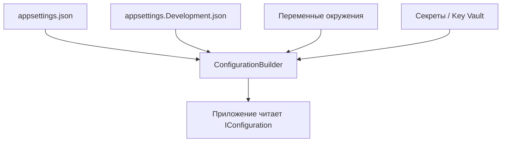

# Конфигурационные данные в текстовых форматах

<div class="article-tags">
  <span class="tag tag-required">ОБЯЗАТЕЛЬНО</span>
  <span class="tag tag-beginner">ДЛЯ НОВИЧКОВ</span>
</div>

<span class="complexity-badge">Разработчику</span>
<span class="complexity-badge">Аналитику</span>
<span class="complexity-badge">Тестировщику</span>  
<span class="complexity-badge">Архитектору</span>
<span class="complexity-badge">Инженеру</span>

## Конфигурации и данные

Представьте - у вас есть набор настроек в программе:
- Тема - тёмная или светлая;
- Использовать "особый режим";
- Куда сохранять файл по умолчанию.

Если их куда-то не выгружать на диск, то программа при каждом запуске не будет знать ничего - будут стандартные настройки, вбитые литералами в код. А оперативная память вычищается при перезапуске компьютера.

Для этого мы можем использовать XML, YAML, INI, или JSON:
1. XML Configuration
```xml
<?xml version="1.0" encoding="utf-8"?>
<appSettings>
    <add key="theme" value="dark" />
    <add key="specialMode" value="true" />
    <add key="defaultPath" value="C:\Users\Timur\Documents\Backup" />
</appSettings>
```
2. JSON Configuration
```json
{
  "theme": "dark",
  "specialMode": true,
  "defaultPath": "C:\\Users\\Timur\\Documents\\Backup"
}
```
3. INI Configuration
```ini
[General]
theme=dark
specialMode=true
defaultPath=C:\Users\Timur\Documents\Backup
```
4. YAML Configuration (файлы часто с расширением `.yaml` или `.yml` — это одно и то же)
```yaml
theme: dark
specialMode: true
defaultPath: C:/Users/Timur/Documents/Backup
```

Зато теперь такой набор данных можно:
- прочитать программой при запуске;
- изменить программой при записи (сохранить);
- передать кому-то, чтобы синхронизировать;
- хранить на диске;
- расширять для прочих данных.

Этому и будет посвящен раздел «Конфигурации и данные».

Ниже — теоретическая часть: зачем данные структурируют, чем конфигурация отличается от «боевых» записей и как выбирать формат. Практические главы по каждому формату: [XML](./2.md), [JSON](./3.md), [YAML](./4.md). Кодировки и текст как носитель символов — в [Текстовые форматы представления данных](./111.md).

### Сравнение форматов на одном примере

| Критерий | XML | JSON | YAML | INI |
|----------|-----|------|------|-----|
| Читаемость человеком | Средняя | Хорошая | Очень высокая | Высокая для плоских настроек |
| Комментарии | Да | Нет (в стандарте) | Да (`#`) | Да (`;` или `#`) |
| Вложенность | Да | Да | Да (отступы) | Слабая (секции `[...]`) |
| Схема / валидация | XSD, DTD | JSON Schema, OpenAPI | Внешние (например, K8s CRD) | Обычно нет |
| Типичный стек | SOAP, .NET `app.config`, гособмен | REST API, `package.json` | Kubernetes, Ansible, Compose | Legacy Windows, простые утилиты |

Один смысл — четыре записи выше; выбор формата определяется **потребителем** (браузер ждёт JSON, кластер — YAML-манифест).

### Другие текстовые конфигурации

**INI** — секции в квадратных скобках и пары `ключ=значение`. Удобен для плоских настроек и legacy-приложений; глубокую вложенность выражает плохо. Кодировка в старых файлах Windows иногда была не UTF-8 — см. [кодировки](./111.md).

**TOML** — явные таблицы `[section]` и `key = value`, популярен в Rust (`Cargo.toml`), Python (`pyproject.toml`). Компромисс между читаемостью INI и структурой JSON.

**Файлы `.env`** — пары `KEY=value` для переменных окружения на машине разработчика. Не заменяют полноценный конфиг: удобны для секретов и переопределений локально, но **не коммитят** в Git с паролями. В продакшене значения подставляют из хранилища секретов или переменных среды контейнера (принцип [12-factor](https://12factor.net/config): конфигурация в окружении).

**Java `.properties`** — плоский `key=value`, как INI без секций; встречается в Spring и локализации.

### Секреты — плохо и хорошо

```json
{
  "database": {
    "password": "SuperSecret123"
  }
}
```

Так в репозитории хранить нельзя: пароль попадёт в историю Git и клоны.

Лучше:

```json
{
  "database": {
    "password": ""
  }
}
```

…а реальное значение передать через переменную окружения `DATABASE__PASSWORD` или секрет в CI/CD. В .NET цепочка часто такая: `appsettings.json` → `appsettings.Production.json` → переменные среды (переопределяют файл). Подробнее о типах значений в [JSON](./3.md).

### Как приложение собирает настройки (пример .NET)



Порядок важен: **последний источник побеждает**. То же идея применима к Docker (`env_file` + переменные в `docker-compose.yml`) и Kubernetes (ConfigMap + Secret).

---

В повседневной практике разработки программного обеспечения, администрирования систем и проектирования цифровых решений термин *«данные»* употребляется многократно — от базы данных до временных буферов, от файлов настроек до сетевых пакетов. Однако чтобы осмысленно работать с данными, необходимо выйти за пределы представления о них как о «чём-то, что хранится». Важно осознать *роль* данных: они не статичны, не пассивны, и не ограничиваются лишь хранилищем. Данные — это средство *взаимодействия*: между программой и средой, между компонентами системы, между человеком и машиной, между машинами друг с другом.  

Рассмотрим четыре неотделимых аспекта, определяющих современное понимание данных в ИТ:

1. **Данные как носитель смысла и состояния**  
2. **Структурирование как условие автоматизированной обработки**  
3. **Машиночитаемость как ключевое свойство цифровых данных**  
4. **Конфигурация как особая форма управляющих данных**

---

### Данные

Под данными понимается любая информация, представленная в форме, пригодной для хранения, передачи и обработки вычислительными системами. Это может быть число, текст, изображение, аудиозапись, видеофрагмент — но также и *сведения о сущностях*, *параметры поведения*, *правила принятия решений*.  

Критически важно выделить, что данные выполняют как минимум три функциональные роли:

- **Хранение** — фиксация информации в долговременной или временной памяти.  
- **Передача** — перемещение информации между адресатами: процессами, узлами, приложениями.  
- **Управление** — использование информации для изменения поведения системы без изменения её кода.  

Последнее особенно значимо. Например, веб-приложение может быть разработано в универсальном виде, но его поведение при запуске — язык интерфейса, доступные модули, параметры подключения к базе — определяется *данными*, поступающими извне. Это и есть проявление *конфигурации* как одной из форм управляющих данных.

Конфигурация — это *описание контекста выполнения*. Она позволяет отделить логику от окружения. Программа, жёстко закодировавшая параметры подключения к базе данных, теряет переносимость. Та же программа, получающая эти параметры из файла конфигурации, может быть развёрнута в десятках сред без перекомпиляции. Таким образом, конфигурационные данные становятся *интерфейсом между программой и её окружением*.

---

### Структурирование

Если бы все данные существовали в виде сплошного неформатированного текста (например, как сканированная копия договора в формате PDF без слоя OCR), их обработка машиной стала бы чрезвычайно затруднительной. Человек, прочитав такой документ, способен выделить из него реквизиты, даты, суммы — но компьютер, сталкиваясь с тем же файлом, видит лишь массив пикселей или неструктурированный поток символов без семантических меток.

Здесь вступает в силу принцип *структурирования* — заранее определённая организация данных в иерархическую или табличную форму, где каждая единица информации имеет:

- **Имя или метку**, указывающую на её назначение (например, `"host"` или `"timeout_ms"`),  
- **Значение**, соответствующее определённому типу (строка, число, логическое значение и т.д.),  
- **Позицию в иерархии**, позволяющую однозначно определить контекст (например, параметр `"port"` может относиться к базе данных *или* к внешнему API — различие определяется уровнем вложенности).

Структурирование не является синонимом «оформления» — это *логическое разделение*, позволяющее извлечь смысл без неоднозначности. Например, фраза *«Сервер отвечает через 500 миллисекунд»* несёт информацию для человека, но не позволяет программе надёжно извлечь величину `500` как числовое значение с единицей измерения, поскольку формат выражения не регламентирован. В то же время запись `"response_time_ms": 500` в структурированном документе оставляет лишь один вариант интерпретации.

Таким образом, структурирование — это компромисс между *человеческой выразительностью* и *машинной однозначностью*. Оно жертвует гибкостью естественного языка ради предсказуемости и воспроизводимости обработки.

---

### Машиночитаемость

Термин *«машиночитаемый»* часто используется как маркетинговый лозунг, но в инженерной практике он имеет точное значение: документ или поток данных считается машиночитаемым, если его можно автоматически разобрать (*распарсить*) с помощью алгоритма без привлечения методов, требующих искусственного интеллекта (распознавания образов, обработки естественного языка и т.п.).  

Для машиночитаемости необходимо соблюдение трёх условий:

- **Синтаксис строго определён и верифицируем** — любое отклонение (лишняя запятая, пропущенная кавычка, неверная вложенность) приводит к явной ошибке разбора, а не к неопределённому поведению.  
- **Семантика декларируется явно или выводится по правилам** — типы данных, имена полей и их взаимные связи задаются в спецификации формата или схеме, а не подразумеваются по контексту.  
- **Порядок и иерархия имеют значение** — расположение элементов не случайно: оно либо фиксировано (как в табличных форматах), либо управляемо правилами вложенности (как в древовидных).

Эти требования исключают такие форматы, как сканированный PDF, изображение на доске, распечатанный на бумаге текст — даже если содержание *для человека* ясно и полно. Такие документы относятся к категории *человекочитаемых*. Они могут быть *цифровыми*, но не являются *машиночитаемыми* в инженерном смысле.

Разграничение принципиально. Например, при интеграции двух систем передача сведений о заказе в виде PDF-файла требует дополнительного этапа — извлечения данных с помощью OCR и NLP, что вносит задержку, повышает вероятность ошибок и требует поддержки отдельного ПО. В то же время передача того же заказа в виде JSON-структуры позволяет получить все поля напрямую, без промежуточного преобразования.

---

### Конфигурация

Конфигурационные файлы — один из самых распространённых примеров структурированных машиночитаемых данных, с которыми сталкивается разработчик. Их назначение — определить *параметры поведения программного обеспечения* без изменения исходного кода.

Конфигурация может включать:

- **Параметры среды выполнения**: адреса хостов, порты, пути к каталогам, таймауты.  
- **Учётные данные и ключи доступа**: токены API, имена пользователей, хэши паролей (никогда — пароли в открытом виде).  
- **Логические флаги**: включение/выключение функций, режимы отладки, уровень логирования.  
- **Метаданные приложения**: версия, идентификатор сборки, метки для мониторинга.  
- **Описания зависимостей и маршрутизации**: в случае микросервисных архитектур — адреса других сервисов, правила балансировки.

Важно отличать *конфигурацию* от *данных предметной области*. Конфигурация управляет *как* работает программа, а данные предметной области — *о чём* программа работает. Например, в системе учёта сотрудников список сотрудников — это данные предметной области; а настройка URL для подключения к корпоративному LDAP — это конфигурация.

Конфигурация обладает рядом особых свойств:

- **Статичность во времени выполнения** — в большинстве случаев загружается один раз при старте приложения и не изменяется в его процессе (хотя существуют исключения — динамические конфигурации, подгружаемые по расписанию или по событию).  
- **Чувствительность к точности** — ошибка в одном символе (например, опечатка в имени хоста) может привести к полному отказу сервиса.  
- **Требование к версионированию** — конфигурация — часть системы; её изменения должны фиксироваться в системе контроля версий наравне с кодом.  
- **Потенциальная секретность** — наличие учётных данных требует применения механизмов защиты: шифрования, использования переменных окружения, внешних хранилищ секретов.

Конфигурация — это *декларативное описание среды*. Вместо того чтобы писать код вида `if (environment == "production") connectTo("prod.db.example.com")`, мы задаём значение `"host": "prod.db.example.com"` в конфигурации, а код остаётся общим для всех окружений. Это повышает надёжность, тестируемость и безопасность системы.

---

### Форматы структурированных данных

Несмотря на разнообразие существующих форматов, в практике современной разработки доминируют три текстовых представления: **JSON**, **YAML** и **XML**. Все они решают одну и ту же фундаментальную задачу — описать иерархическую структуру данных в виде текстового файла, пригодного для автоматической обработки. Но каждое из этих решений отражает разные приоритеты, исторические условия и философские установки.

#### JSON

JSON (JavaScript Object Notation) возник как подмножество языка JavaScript, пригодное для передачи данных между клиентом и сервером. Его главная сила — в *ограниченности*. JSON намеренно лишен:

- комментариев,  
- сложных типов (даты, бинарные данные требуют кодирования),  
- ссылок и перекрёстных зависимостей,  
- произвольных директив или метаинформации.

Простота JSON позволяет реализовать надёжный парсер даже в средах с ограниченными ресурсами — от встраиваемых систем до браузерных расширений. Отсутствие расширяемости снижает риски несовместимости: если документ соответствует спецификации, его интерпретация однозначна.

В контексте конфигурации JSON используется там, где важна предсказуемость и где данные в первую очередь предназначены для программ, а не для прямого редактирования человеком. Примеры: конфигурация сборщиков (например, `tsconfig.json`, `package.json`), ответы API, метаданные веб-манифестов, описание слоёв в Docker Compose (до версии 3.8).  

Фактически, JSON стал *языком обмена по умолчанию* в веб-экосистеме, потому что он наименее спорен.

#### YAML

YAML (YAML Ain’t Markup Language) позиционируется как *человеко-ориентированный* формат данных. Он сохраняет иерархическую структуру, но отказывается от скобок и запятых в пользу отступов и переносов — того, что делает текст привычным для редактирования вручную. YAML поддерживает:

- комментарии,  
- алиасы (повторное использование узлов без дублирования),  
- скалярные типы с автоматическим выводом (числа, строки, логические значения, null),  
- многострочные строки с управлением форматированием.

Эти возможности снижают когнитивную нагрузку при написании и сопровождении конфигураций. Однако выразительность имеет цену: правила синтаксиса, хотя и основаны на интуитивных принципах (например, отступ = уровень вложенности), содержат нюансы, способные привести к неочевидным ошибкам (например, неявное преобразование строки `"yes"` в логическое `true` в некоторых реализациях).  

YAML получил широкое применение в системах, где конфигурация регулярно редактируется разработчиками и инженерами: Kubernetes (манифесты), Ansible (playbooks), GitLab CI/CD, Docusaurus, OpenAPI Specification (в альтернативном представлении). Здесь важна машиночитаемость и *читаемость* — способность быстро оценить структуру и намерение автора без специальных инструментов.

#### XML

XML (eXtensible Markup Language) — самый старший из трёх. Он был задуман как *универсальный язык разметки*, способный описывать любые структуры — от документа до сообщения в распределённой системе. Его отличительные черты:

- явное именование элементов и атрибутов,  
- поддержка пространств имён (namespaces), позволяющая избегать конфликтов имён в составных документах,  
- возможность описания структуры с помощью схем (DTD, XML Schema),  
- встроенная поддержка ссылок (XLink), трансформаций (XSLT), пути по дереву (XPath).

XML не стремится быть кратким или удобным для ручного редактирования — он стремится быть *полным и проверяемым*. Это делает его предпочтительным в доменах, где важна формальная верификация: электронный документооборот (ГОСТ Р 7.0.97–2016, СФР, Диадок), интеграции между корпоративными системами (SOAP, FIXML), научные форматы (MathML, TEI), конфигурации промышленного ПО (например, в SCADA-системах).

Избыточность XML (повторяющиеся теги, многословность) компенсируется его способностью нести *самодостаточное описание*: документ в принципе может включать в себя и данные, и схему их проверки, и инструкции по преобразованию — всё в рамках одного стандарта. Это свойство особенно ценно в долгосрочных, высоконадёжных системах, где стабильность интерфейсов важнее скорости разработки.

---

### Выбор формата

Отсутствует универсально «лучший» формат. Выбор между JSON, YAML и XML определяется *контекстом использования*:

- Если данные создаются и потребляются программой, а человек только инспектирует их — **JSON**.  
- Если человек регулярно редактирует, комментирует, рефакторит — **YAML**.  
- Если требуется строгая верификация, совместимость с унаследованными системами, поддержка составных документов — **XML**.

Формат — это *интерфейс*. Он определяет, как участники взаимодействия (программы, люди, системы) соглашаются об интерпретации данных. Ошибка в выборе формата — это нарушение договорённости на уровне проектирования. Например, использование XML в микросервисной архитектуре, где все остальные сервисы ожидают JSON, порождает постоянные преобразования и риски потери семантики. И наоборот — применение YAML для хранения данных в высоконагруженном API добавляет ненужную сложность парсинга и риск синтаксических ошибок со стороны клиентов.

Ключевой принцип: *формат должен соответствовать циклу жизни данных*. Конфигурация, меняемая раз в квартал и редактируемая инженером — кандидат на YAML. Поток событий, генерируемый тысячами устройств в секунду — на JSON. Регламентированный документ, подлежащий юридической экспертизе и архивированию на десятилетия — на XML.

---

### За пределами трёх — когда структура — недостаточна

JSON, YAML и XML — это форматы *иерархических* данных. Они хорошо подходят для описания деревьев: конфигурации, настроек, транзакций, простых сущностей. Однако современные системы всё чаще сталкиваются с задачами, где иерархия недостаточна:

- **Графы связей** — пользователи и их отношения, маршруты доставки, зависимости компонентов. Здесь применяются специализированные форматы (GraphML, RDF/XML) или просто JSON с явными ссылками по идентификаторам.  
- **Потоковые данные** — логи, метрики, события в реальном времени. Здесь приоритет — минимальная задержка и компактность, поэтому используются бинарные форматы (Protocol Buffers, Apache Avro, MessagePack) с предварительно определённой схемой.  
- **Документы со сложной семантикой** — научные публикации, юридические акты. Здесь требуется структура и *онтология* — формальное описание понятий и связей, что выходит за пределы возможностей классических форматов.

Однако даже в этих случаях фундаментальные принципы, описанные в начале главы, остаются неизменными: данные должны быть структурированы, машиночитаемы и пригодны для автоматизированного обмена. Разница лишь в том, *на каком уровне* эта структура задаётся — в самом файле (как в XML Schema), в отдельной спецификации (как в `.proto` для Protobuf), или в договорённости между участниками.

---
