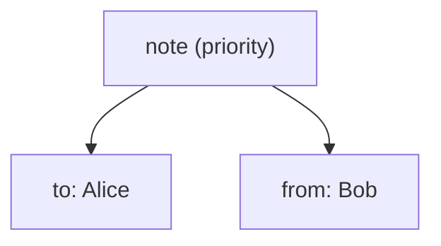

import XsdValidationDemo from '@site/src/components/XsdValidationDemo';
import XsltTransformDemo from '@site/src/components/XsltTransformDemo';

# XML

<div class="article-tags">
  <span class="tag tag-required">ОБЯЗАТЕЛЬНО</span>
  <span class="tag tag-beginner">ДЛЯ НОВИЧКОВ</span>
</div>

<span class="complexity-badge">Разработчику</span>
<span class="complexity-badge">Аналитику</span>
<span class="complexity-badge">Тестировщику</span>  
<span class="complexity-badge">Архитектору</span>
<span class="complexity-badge">Инженеру</span>

## XML

### Основы XML

★ **XML (eXtensible Markup Language)** - универсальный язык разметки, предназначенный для хранения и передачи данных. Он позволяет структурировать информацию в виде текстового файла, который легко читается человеком и машиной. Его можно открыть в любом текстовом редакторе, работает на любых ОС и устройствах. Изначально он создавался как способ представления структурированных данных, и благодаря этому стал основой множества технологий, конфигурационных файлов, веб-сервисов, форматов документов и метаданных.

Структура XML-документа является самодокументируемой - описывает саму себя через теги и атрибуты. XML позволяет создавать собственные теги для описания данных.

> **Самодокументируемость** — свойство формата данных или языка разметки, при котором структура и содержание документа позволяют понять его назначение, состав и логику без обращения к внешним пояснениям. В XML это достигается за счёт использования осмысленных имён тегов и атрибутов, которые явно отражают суть описываемых сущностей и их отношений. Например, тег `<заказ>` с атрибутом `дата="2026-01-24"` и вложенными элементами `<товар>`, `<цена>`, `<количество>` делает структуру документа понятной даже при первом чтении.

★ **DTD (Document Type Definition)** - стандартный способ описания структуры XML, и определяет, какие элементы (теги) могут использоваться, какие атрибуты могут быть у элементов, и каков порядок и вложенность элементов.

★ **XSD (XML Schema Definition)** - схема, которая описывает структуру документа. В отличие от DTD, XSD использует сам XML для описания правил.

Пример XSD:

```xml
<xs:schema xmlns:xs="http://www.w3.org/2001/XMLSchema">
  <xs:element name="Test1">
    <xs:complexType>
      <xs:sequence>
        <xs:element name="Test2" type="xs:string"/>
      </xs:sequence>
      <xs:attribute name="Attribute1" type="xs:string" use="required"/>
    </xs:complexType>
  </xs:element>
</xs:schema>

```

Эта схема описывает, что элемент Test1 должен содержать обязательный строковый атрибут Attribute1, и вложенный элемент Test2.

<XsdValidationDemo />

★ **Теги** - основные элементы XML, которые «окружают» данные. Они определяют начало и конец элемента:

```xml
<note>
  <to>Alice</to>
  <from>Bob</from>
</note>
```

Здесь note, to, from - теги, а Alice и Bob - значения элементов.

★ **Атрибуты** - дополнительные параметры, которые добавляются к тегам для описания их свойств. Расширим наши note:

```xml
<note priority="high">
  <to>Alice</to>
  <from>Bob</from>
</note>

```

Здесь priority – это атрибут, а high - значение атрибута.



★ **Узел** - любая часть XML-документа, включая элементы, атрибуты, текст и комментарии. XML это дерево узлов, упорядоченных иерархично. В нашем документе будет:
	- note - корневой узел;
	- to - дочерний узел;
	- Alice - текстовый узел.

---

### Синтаксис и правила XML

XML — строго структурированный язык разметки. Его синтаксис определяет чёткие правила построения документа, которые обеспечивают однозначность интерпретации и надёжность обработки. Нарушение любого из этих правил делает документ недействительным.

#### 1. Единственный корневой элемент

Каждый XML-документ обязан содержать ровно один корневой элемент. Он охватывает всё содержимое документа и служит точкой входа для парсера. Все остальные элементы находятся внутри него и считаются его дочерними.

Пример:
```xml
<note priority="high">
  <to>Alice</to>
  <from>Bob</from>
</note>
```

Здесь `note` — корневой элемент. Он не несёт самостоятельного семантического значения, но организует структуру: внутри него расположены элементы `to` и `from`, описывающие получателя и отправителя сообщения.

Если в документе окажется два или более элемента на верхнем уровне, парсер выдаст ошибку. Это правило гарантирует древовидную иерархию без разветвлений на корневом уровне.

#### 2. Правильное закрытие тегов

Все элементы в XML должны быть явно закрыты. Это требование устраняет двусмысленность при чтении структуры.

Существуют два способа записи элементов:

- **Парные теги** — используются, когда элемент содержит текст или другие элементы:
  ```xml
  <title>Введение в XML</title>
  ```

- **Пустые (одиночные) теги** — применяются, когда элемент не содержит содержимого:
  ```xml
  <br/>
  ```
  Такая запись эквивалентна `<br></br>`, но короче и предпочтительнее.

Открывающий тег начинается с символа `<`, за которым следует имя элемента. Закрывающий тег начинается с `</`, затем следует то же имя и завершается `>`. Имена в открывающем и закрывающем тегах должны совпадать точно, включая регистр.

#### 3. Чувствительность к регистру

XML различает заглавные и строчные буквы в именах элементов и атрибутов. Элементы `<Message>` и `<message>` считаются разными. Это требование обеспечивает точность и предотвращает случайные коллизии имён.

Следствие: если схема или приложение ожидает элемент с именем `User`, использование `user` приведёт к ошибке валидации или игнорированию данных.

#### 4. Экранирование специальных символов

Некоторые символы имеют особое значение в XML и не могут использоваться напрямую в текстовом содержимом или значениях атрибутов. К ним относятся:

- `<` — начало тега
- `>` — конец тега
- `&` — начало сущности
- `"` — ограничитель значений атрибутов в двойных кавычках
- `'` — ограничитель значений атрибутов в одинарных кавычках

Чтобы включить эти символы в данные, их заменяют на предопределённые сущности:

| Символ | Сущность |
|--------|----------|
| `<`    | `&lt;`   |
| `>`    | `&gt;`   |
| `&`    | `&amp;`  |
| `"`    | `&quot;` |
| `'`    | `&apos;` |

Пример:
```xml
<description>Цена &lt; 1000 руб.</description>
```

Без экранирования парсер попытается интерпретировать `< 1000` как начало тега и выдаст ошибку.

Альтернативный способ — использовать секции CDATA, если требуется вставить большой фрагмент текста с множеством специальных символов:
```xml
<code><![CDATA[if (x < y && y > 0) { return "ok"; }]]></code>
```
Всё содержимое внутри `<![CDATA[ ... ]]>` обрабатывается как чистый текст, без анализа тегов и сущностей.

---

### Структура XML

XML-документ состоит из двух основных частей: **пролога** и **корневого элемента**. Эта структура обеспечивает единообразие, предсказуемость и совместимость между разными системами.

#### Пролог

Пролог — необязательная, но рекомендуемая часть документа, которая располагается в самом начале. Он задаёт базовые параметры интерпретации содержимого:

```xml
<?xml version="1.0" encoding="UTF-8"?>
```

Эта строка содержит две ключевые директивы:

- `version="1.0"` указывает, что документ соответствует первой версии спецификации XML. На сегодняшний день это единственная широко используемая версия.
- `encoding="UTF-8"` определяет кодировку текста. UTF-8 поддерживает все символы Unicode и является стандартом для современных систем. Если кодировка не указана, парсер предполагает UTF-8 или UTF-16 в зависимости от байтового порядка (BOM).

Пролог может также включать атрибут `standalone`, который принимает значения `"yes"` или `"no"` и сигнализирует, зависит ли документ от внешних сущностей (например, DTD). В большинстве случаев этот атрибут опускается.

Если пролог отсутствует, парсер применяет значения по умолчанию: версия 1.0 и кодировка UTF-8. Однако явное указание пролога повышает читаемость и исключает неоднозначности при обработке в разных средах.

#### Корневой элемент

Все данные XML-документа находятся внутри одного корневого элемента. Это требование гарантирует древовидную структуру без разрывов на верхнем уровне.

Пример:
```xml
<catalog>
  <book id="101">
    <title>Основы XML</title>
    <author>Иван Петров</author>
  </book>
  <book id="102">
    <title>Современные форматы данных</title>
    <author>Анна Смирнова</author>
  </book>
</catalog>
```

Здесь `catalog` — корневой элемент. Он объединяет все записи каталога и служит контекстом для дочерних элементов `book`. Каждый `book`, в свою очередь, содержит собственные вложенные элементы и атрибуты.

Корневой элемент может иметь атрибуты, текстовое содержимое и любую вложенную структуру, допустимую согласно схеме или логике приложения. Его имя выбирается автором документа и должно отражать общее назначение данных.


---

### XPath

**XPath (XML Path Language)** — язык выражений для адресации и выбора узлов в XML-документе. Он позволяет точно указывать путь к элементам, атрибутам, тексту или другим частям XML-структуры, независимо от её глубины или сложности.

В основе XPath лежит модель документа как дерева узлов. Каждый элемент, атрибут, текстовый фрагмент, комментарий и даже сам документ рассматриваются как отдельные узлы. XPath предоставляет средства для навигации по этому дереву с помощью путей, условий и функций.

#### Основные компоненты синтаксиса

- **`/`** — выбирает дочерний узел относительно текущего контекста. Если путь начинается с `/`, поиск ведётся от корня документа.
  ```xpath
  /library/book
  ```
  Этот запрос возвращает все элементы `book`, которые являются прямыми потомками корневого элемента `library`.

- **`//`** — выбирает узлы на любом уровне вложенности, начиная с текущего контекста. Это сокращение от оси `descendant-or-self`.
  ```xpath
  //author
  ```
  Возвращает все элементы `author` в документе, независимо от их положения.

- **`@`** — обращается к атрибутам элемента.
  ```xpath
  /library/book[@id='2']
  ```
  Выбирает элемент `book`, у которого атрибут `id` равен `"2"`.

- **`[]`** — задаёт предикат (условие фильтрации). Внутри скобок можно использовать позиционные функции, сравнения, вызовы других функций.
  ```xpath
  /library/book[1]/title
  ```
  Возвращает элемент `title` первой книги в списке.

#### Оси навигации

XPath определяет **оси** — направления движения по дереву узлов. Наиболее часто используемые:

- **`child::`** — дочерние узлы (по умолчанию, поэтому `/book/title` эквивалентно `/book/child::title`);
- **`descendant::`** — все потомки любого уровня;
- **`attribute::`** — атрибуты (можно сократить до `@`);
- **`parent::`** — родительский узел (сокращается до `..`);
- **`following-sibling::`** — последующие элементы на том же уровне;
- **`ancestor::`** — все предки вплоть до корня.

Пример:
```xpath
//book[author = 'Лев Толстой']/title
```
Выбирает заголовок книги, автор которой — Лев Толстой.

#### Функции XPath

XPath включает встроенные функции для работы со строками, числами, узлами и логикой:

- **`text()`** — извлекает текстовое содержимое узла:
  ```xpath
  //title/text()
  ```
  Возвращает строки `"Война и мир"` и `"Мастер и Маргарита"`.

- **`position()`** и **`last()`** — позволяют работать с порядком элементов:
  ```xpath
  //book[position() <= 2]
  ```
  Выбирает первые две книги.

- **`contains()`, `starts-with()`, `ends-with()`** — проверяют подстроки:
  ```xpath
  //book[contains(author, 'Булгаков')]
  ```

- **`count()`** — подсчитывает количество узлов:
  ```xpath
  count(//book)
  ```
  Возвращает число `2`.

Пример. У нас есть XML:
```xml
<library>
  <book id="1">
    <title>Война и мир</title>
    <author>Лев Толстой</author>
  </book>
  <book id="2">
    <title>Мастер и Маргарита</title>
    <author>Михаил Булгаков</author>
  </book>
</library>
```

К такому документу можно обращаться, используя XPath-запросы, чтобы получить информацию из определённого элемента. Допустим:

1. Выбрать все книги - `/library/book`
2. Выбрать заголовок первой книги - `/library/book[1]/title`
3. Выбрать книгу с id равным «2» - `/library/book[@id='2']`
4. Выбрать всех авторов - `//author`

Это используется для извлечения информации из XML, таким образом обрабатывая их, проверяя структуру и т.д.


Чит-лист - https://cheatsheets.zip/xpath


---

### XSLT

**XSLT (Extensible Stylesheet Language Transformations)** — язык преобразования XML-документов. Он позволяет взять исходный XML и, применив к нему шаблон, получить новый документ в другом формате: HTML, текст, другой XML или даже CSV. XSLT работает на основе декларативных правил и шаблонов, а не последовательного кода, что делает его особенно подходящим для задач, где важна структура данных.

#### Принцип работы

Процесс преобразования состоит из трёх компонентов:

1. **Исходный XML-документ** — содержит данные.
2. **XSL-шаблон** — описывает, как эти данные следует представить.
3. **XSLT-процессор** — программа, которая применяет шаблон к XML и формирует результат.

Результатом может быть любой текстовый формат. Чаще всего XSLT используется для генерации HTML-страниц на основе XML-данных, особенно в системах, где контент и представление строго разделены.

#### Пример преобразования

Рассмотрим XML-документ с библиотекой книг:

```xml
<library>
  <book id="1">
    <title>Война и мир</title>
    <author>Лев Толстой</author>
  </book>
  <book id="2">
    <title>Мастер и Маргарита</title>
    <author>Михаил Булгаков</author>
  </book>
</library>
```

Для его преобразования создаётся XSL-файл:

```xml
<?xml version="1.0" encoding="UTF-8"?>
<xsl:stylesheet xmlns:xsl="http://www.w3.org/1999/XSL/Transform" version="1.0">
  <xsl:template match="/">
    <html>
      <body>
        <h1>Список книг</h1>
        <ul>
          <xsl:for-each select="library/book">
            <li>
              <xsl:value-of select="title"/> (<xsl:value-of select="author"/>)
            </li>
          </xsl:for-each>
        </ul>
      </body>
    </html>
  </xsl:template>
</xsl:stylesheet>
```

После обработки XSLT-процессором получается HTML-документ:

```html
<html>
  <body>
    <h1>Список книг</h1>
    <ul>
      <li>Война и мир (Лев Толстой)</li>
      <li>Мастер и Маргарита (Михаил Булгаков)</li>
    </ul>
  </body>
</html>
```

Этот HTML можно сразу открыть в браузере или встроить в веб-приложение.

<XsltTransformDemo />

#### Ключевые элементы XSLT

- **`<xsl:template match="...">`** — определяет правило для обработки узла, соответствующего указанному XPath-выражению. `match="/"` означает корень документа.
- **`<xsl:for-each select="...">`** — повторяет блок для каждого узла, найденного по XPath.
- **`<xsl:value-of select="...">`** — вставляет текстовое содержимое выбранного узла.
- **`<xsl:if>` и `<xsl:choose>`** — позволяют добавлять условия и ветвления.
- **`<xsl:apply-templates>`** — вызывает другие шаблоны рекурсивно, что даёт возможность строить модульные и переиспользуемые преобразования.

#### Практическое применение

XSLT используется в следующих сценариях:

- **Генерация отчётов** — например, из XML-логов или финансовых данных создаются читаемые HTML- или PDF-документы.
- **Публикация контента** — системы управления контентом (CMS) могут хранить статьи в XML и преобразовывать их в HTML при запросе.
- **Интеграция систем** — когда две системы используют разные XML-схемы, XSLT служит мостом для конвертации структур.
- **Поддержка старых форматов** — многие государственные и промышленные системы до сих пор используют XML + XSLT для формирования интерфейсов и выгрузок.

#### Версии XSLT

- **XSLT 1.0** — самая распространённая версия, поддерживается практически везде, включая старые браузеры и .NET Framework.
- **XSLT 2.0 и 3.0** — добавляют функции группировки, регулярных выражений, переменных, функций и даже потоковой обработки. Однако требуют специализированных процессоров, таких как Saxon.

---

### Применение XML

XML позволяет структурировать информацию и сделать её машиночитаемой. Например, когда я работал в государственном секторе, у нас была задача по цифровизации путём перевода документов в электронный вид. Началось всё с заявлений, когда человек оформляет их через Госуслуги, формируя XML-файл.

Для пользователя всё просто - он заполняет интерактивную форму в браузере или приложении, и система получает отдельные блоки с информацией, к примеру:
```
Имя: Иван
Фамилия: Иванов
Отчество: Иванович
Дата рождения: 01.01.1999
```

И для того, чтобы таким массивом информации поделиться, система формирует файл XML-файл согласно заложенной схеме, например:
```
<Name>Иван</Name>
<Surname>Иванов</Surname>
<Patronymic>Иванович</Patronymic>
<Birthdate>01.01.1999</Birthdate>
```
Можно даже сделать более детально:
```
<Name>Иван</Name>
<Surname>Иванов</Surname>
<Patronymic>Иванович</Patronymic>
<Birthdate>
	<Day>01</Day>
	<Month>01</Month>
	<Year>1999</Year>
</Birthdate>
```

В дальнейшем этот файл отправляется по сети в соответствующие системы, к примеру, СМЭВ, а затем уже получателю - системе соответствующих органов власти. Чтобы получатель смог понять структуру файла, он дорабатывает свою систему под последнюю версию XSD-схемы, чтобы обеспечить читаемость файла.

Как результат - когда и отправитель, и получатель знают схему, они могут совместимо обмениваться информацией, и данные раскладываются в целевых базах.

XML получил широкое распространение благодаря такой простой схеме, но в последние годы уступил место JSON в большинстве новых систем, из-за производительности - XML надёжный, но медленный. Почему надёжный - потому что XML имеет ряд возможностей, встроенных в язык:

- XSD — язык описания структуры документа. С его помощью можно определить допустимые элементы, атрибуты, типы данных и отношения между ними. Валидация происходит до парсинга, что исключает ошибки на раннем этапе. JSON Schema существует, но остаётся внешним инструментом, не имеющим статуса стандарта и редко применяемым в реальных проектах.

- Пространства имён. XML позволяет комбинировать элементы из разных словарей в одном документе без коллизий. Каждый префикс явно указывает на источник определения. В JSON подобная функциональность отсутствует, и разработчики вынуждены использовать соглашения об именовании или вкладывать объекты вручную.

- XML изначально поддерживает комментарии, что делает документы самодостаточными и понятными даже без внешней документации. JSON запрещает комментарии, поскольку они нарушают требования к чистоте данных и усложняют парсинг.

- Хорошо составленный XML-документ содержит ссылку на свою схему или включает поясняющие атрибуты и теги. Это позволяет понять назначение полей без дополнительного контекста. В JSON значение `"status": 1` остаётся загадкой без внешнего описания.

Microsoft долгое время использовала XML в ключевых технологиях: MSBuild, WPF, App.config, SOAP-сервисы. Даже после перехода .NET Core на JSON для конфигурации, XML сохранился в форматах проектов (.csproj), где важна расширяемость и точность.

XML применяется для обмена данными между системами, конфигурационных файлов, а порой и для хранения данных в виде файлов. К примеру, Microsoft Office форматы (тот же Word, Excel) это на самом деле XML.

Подробнее об XML также рекомендую почитать на https://www.w3.org/XML/ (официальный сайт W3C, Консорциума Всемирной паутины). Он не переведён на русский язык, но можно найти много интересного.

<div class="callout callout--tip">
  <div class="callout-title">Практическое задание</div>
Попробуйте составить XML-файл.
Создайте родительский тег и закройте его.
Добавьте дочерний элемент и закройте его.
Добавьте значение дочернего элемента.
Добавьте атрибут дочернего элемента.
Добавьте значение атрибута.
</div>

---
