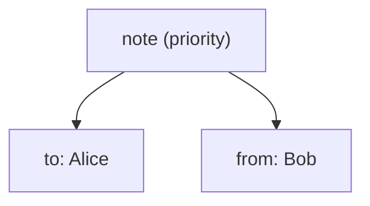

import XsdValidationDemo from '@site/src/components/XsdValidationDemo';
import XsltTransformDemo from '@site/src/components/XsltTransformDemo';
import XPathPlayDemo from '@site/src/components/XPathPlayDemo';

# XML

<div class="article-tags">
  <span class="tag tag-required">ОБЯЗАТЕЛЬНО</span>
  <span class="tag tag-beginner">ДЛЯ НОВИЧКОВ</span>
</div>

<span class="complexity-badge">Разработчику</span>
<span class="complexity-badge">Аналитику</span>
<span class="complexity-badge">Тестировщику</span>  
<span class="complexity-badge">Архитектору</span>
<span class="complexity-badge">Инженеру</span>

---

## XML

### Основы XML

★ **XML (eXtensible Markup Language)** - универсальный язык разметки, предназначенный для хранения и передачи данных. Он позволяет структурировать информацию в виде текстового файла, который легко читается человеком и машиной. Его можно открыть в любом текстовом редакторе, работает на любых ОС и устройствах. Изначально он создавался как способ представления структурированных данных, и благодаря этому стал основой множества технологий, конфигурационных файлов, веб-сервисов, форматов документов и метаданных.

Структура XML-документа является самодокументируемой - описывает саму себя через теги и атрибуты. XML позволяет создавать собственные теги для описания данных.

> **Самодокументируемость** — свойство формата данных или языка разметки, при котором структура и содержание документа позволяют понять его назначение, состав и логику без обращения к внешним пояснениям. В XML это достигается за счёт использования осмысленных имён тегов и атрибутов, которые явно отражают суть описываемых сущностей и их отношений. Например, тег `<заказ>` с атрибутом `дата="2026-01-24"` и вложенными элементами `<товар>`, `<цена>`, `<количество>` делает структуру документа понятной даже при первом чтении.

★ **DTD (Document Type Definition)** - стандартный способ описания структуры XML, и определяет, какие элементы (теги) могут использоваться, какие атрибуты могут быть у элементов, и каков порядок и вложенность элементов.

★ **XSD (XML Schema Definition)** - схема, которая описывает структуру документа. В отличие от DTD, XSD использует сам XML для описания правил.

Пример XSD:

```xml
<xs:schema xmlns:xs="http://www.w3.org/2001/XMLSchema">
  <xs:element name="Test1">
    <xs:complexType>
      <xs:sequence>
        <xs:element name="Test2" type="xs:string"/>
      </xs:sequence>
      <xs:attribute name="Attribute1" type="xs:string" use="required"/>
    </xs:complexType>
  </xs:element>
</xs:schema>

```

Эта схема описывает, что элемент Test1 должен содержать обязательный строковый атрибут Attribute1, и вложенный элемент Test2.

<XsdValidationDemo />

★ **Теги** - основные элементы XML, которые "окружают" данные. Они определяют начало и конец элемента:

```xml
<note>
  <to>Alice</to>
  <from>Bob</from>
</note>
```

Здесь note, to, from - теги, а Alice и Bob - значения элементов.

★ **Атрибуты** - дополнительные параметры, которые добавляются к тегам для описания их свойств. Расширим наши note:

```xml
<note priority="high">
  <to>Alice</to>
  <from>Bob</from>
</note>

```

Здесь priority – это атрибут, а high - значение атрибута.



★ **Узел** - любая часть XML-документа, включая элементы, атрибуты, текст и комментарии. XML это дерево узлов, упорядоченных иерархично. В нашем документе будет:
	- note - корневой узел;
	- to - дочерний узел;
	- Alice - текстовый узел.

---

### Синтаксис и правила XML

XML — строго структурированный язык разметки. Его синтаксис определяет чёткие правила построения документа, которые обеспечивают однозначность интерпретации и надёжность обработки. Нарушение любого из этих правил делает документ недействительным.

---

#### 1. Единственный корневой элемент

Каждый XML-документ обязан содержать ровно один корневой элемент. Он охватывает всё содержимое документа и служит точкой входа для парсера. Все остальные элементы находятся внутри него и считаются его дочерними.

Пример:
```xml
<note priority="high">
  <to>Alice</to>
  <from>Bob</from>
</note>
```

Здесь `note` — корневой элемент. Он не несёт самостоятельного семантического значения, но организует структуру: внутри него расположены элементы `to` и `from`, описывающие получателя и отправителя сообщения.

Если в документе окажется два или более элемента на верхнем уровне, парсер выдаст ошибку. Это правило гарантирует древовидную иерархию без разветвлений на корневом уровне.

---

#### 2. Правильное закрытие тегов

Все элементы в XML должны быть явно закрыты. Это требование устраняет двусмысленность при чтении структуры.

Существуют два способа записи элементов:

- **Парные теги** — используются, когда элемент содержит текст или другие элементы:
  ```xml
  <title>Введение в XML</title>
  ```

- **Пустые (одиночные) теги** — применяются, когда элемент не содержит содержимого:
  ```xml
  <page size="A4"/>
  ```
  Запись с `/` перед `>` — самозакрывающийся элемент. Эквивалентна `<page size="A4"></page>`, но короче. (Тег `<br>` — из HTML, в произвольном XML так не пишут.)

Открывающий тег начинается с символа `<`, за которым следует имя элемента. Закрывающий тег начинается с `</`, затем следует то же имя и завершается `>`. Имена в открывающем и закрывающем тегах должны совпадать точно, включая регистр.

---

#### 3. Чувствительность к регистру

XML различает заглавные и строчные буквы в именах элементов и атрибутов. Элементы `<Message>` и `<message>` считаются разными. Это требование обеспечивает точность и предотвращает случайные коллизии имён.

Следствие: если схема или приложение ожидает элемент с именем `User`, использование `user` приведёт к ошибке валидации или игнорированию данных.

---

#### 4. Экранирование специальных символов

Некоторые символы имеют особое значение в XML и не могут использоваться напрямую в текстовом содержимом или значениях атрибутов. К ним относятся:

- `<` — начало тега
- `>` — конец тега
- `&` — начало сущности
- `"` — ограничитель значений атрибутов в двойных кавычках
- `'` — ограничитель значений атрибутов в одинарных кавычках

Чтобы включить эти символы в данные, их заменяют на предопределённые сущности:

| Символ | Сущность |
|--------|----------|
| `<`    | `&lt;`   |
| `>`    | `&gt;`   |
| `&`    | `&amp;`  |
| `"`    | `&quot;` |
| `'`    | `&apos;` |

Пример:
```xml
<description>Цена &lt; 1000 руб.</description>
```

Без экранирования парсер попытается интерпретировать `< 1000` как начало тега и выдаст ошибку.

Альтернативный способ — использовать секции CDATA, если требуется вставить большой фрагмент текста с множеством специальных символов:
```xml
<code><![CDATA[if (x < y && y > 0) { return "ok"; }]]></code>
```
Всё содержимое внутри `<![CDATA[ ... ]]>` обрабатывается как чистый текст, без анализа тегов и сущностей.

---

#### Well-formed и valid

| Термин | Что проверяется | Пример ошибки |
|--------|-----------------|---------------|
| **Well-formed** (синтаксически корректный) | Один корень, закрытые теги, экранирование, правильные имена | Два корневых элемента на верхнем уровне |
| **Valid** (валидный по схеме) | Well-formed **и** соответствие DTD/XSD | В документе нет обязательного атрибута из XSD |

Парсер XML сначала проверяет well-formedness; XSD/DTD добавляют правила предметной области (какие теги и атрибуты допустимы).

---

### Структура XML

XML-документ состоит из двух основных частей: **пролога** и **корневого элемента**. Эта структура обеспечивает единообразие, предсказуемость и совместимость между разными системами.

---

#### Пролог

Пролог — необязательная, но рекомендуемая часть документа, которая располагается в самом начале. Он задаёт базовые параметры интерпретации содержимого:

```xml
<?xml version="1.0" encoding="UTF-8"?>
```

Эта строка содержит две ключевые директивы:

- `version="1.0"` указывает, что документ соответствует первой версии спецификации XML. На сегодняшний день это единственная широко используемая версия.
- `encoding="UTF-8"` определяет кодировку текста. UTF-8 поддерживает все символы Unicode и является стандартом для современных систем. Если кодировка не указана, парсер предполагает UTF-8 или UTF-16 в зависимости от байтового порядка (BOM).

Пролог может также включать атрибут `standalone`, который принимает значения `"yes"` или `"no"` и сигнализирует, зависит ли документ от внешних сущностей (например, DTD). В большинстве случаев этот атрибут опускается.

Если пролог отсутствует, парсер применяет значения по умолчанию: версия 1.0 и кодировка UTF-8. Однако явное указание пролога повышает читаемость и исключает неоднозначности при обработке в разных средах.

---

#### Корневой элемент

Все данные XML-документа находятся внутри одного корневого элемента. Это требование гарантирует древовидную структуру без разрывов на верхнем уровне.

Пример:
```xml
<catalog>
  <book id="101">
    <title>Основы XML</title>
    <author>Иван Петров</author>
  </book>
  <book id="102">
    <title>Современные форматы данных</title>
    <author>Анна Смирнова</author>
  </book>
</catalog>
```

Здесь `catalog` — корневой элемент. Он объединяет все записи каталога и служит контекстом для дочерних элементов `book`. Каждый `book`, в свою очередь, содержит собственные вложенные элементы и атрибуты.

Корневой элемент может иметь атрибуты, текстовое содержимое и любую вложенную структуру, допустимую согласно схеме или логике приложения. Его имя выбирается автором документа и должно отражать общее назначение данных.

---

### Элементы XML

**Элемент** — узел дерева, ограниченный парой тегов (или самозакрывающимся тегом). У элемента может быть:

- **родитель** — элемент, внутри которого он вложен;
- **дочерние элементы** — вложенные теги;
- **текстовое содержимое** — символы между открывающим и закрывающим тегом;
- **атрибуты** — пары "имя=значение" в открывающем теге.

Отношения между элементами на одном уровне вложенности:

| Термин | Значение |
|--------|----------|
| **Родитель** | Элемент, содержащий данный |
| **Потомок** | Любой вложенный элемент или текст внутри |
| **Предок** | Родитель, дед, и так далее до корня |
| **Потомок по оси descendant** | Любой узел ниже по дереву |
| **Сосед (sibling)** | Элемент с тем же родителем |

Пустой элемент без внутреннего текста и без дочерних тегов записывают кратко:

```xml
<br/>
<page size="A4"/>
```

Порядок дочерних элементов в XML **значим**: `<a/><b/>` и `<b/><a/>` — разные документы, если схема не задаёт иное.

---

### Атрибуты — элемент или атрибут?

**Атрибут** всегда принадлежит одному элементу, записывается в открывающем теге и не может содержать вложенные теги — только текстовое значение в кавычках.

| Критерий | Атрибут | Дочерний элемент |
|----------|---------|------------------|
| Сложная структура | Нет | Да (вложенность, списки) |
| Повторяемость | Один раз на имя в элементе | Сколько угодно однотипных тегов |
| Порядок | Не важен для парсера | Часто важен |
| Типичное использование | Идентификатор, флаг, единица измерения | Основные бизнес-данные |

Пример: идентификатор книги логично держать в атрибуте, а заголовок и автора — в элементах:

```xml
<book id="101" lang="ru">
  <title>Основы XML</title>
  <author>Иван Петров</author>
</book>
```

В XSD можно ограничить: какие атрибуты обязательны (`use="required"`), какие элементы допустимы и в каком порядке.

---

### Пространства имён (XML Namespaces)

Когда в одном документе смешиваются теги из **разных словарей** (SOAP, SVG, пользовательская схема), имена могут совпасть. **Пространство имён (namespace)** — URI, идентифицирующий словарь; в документе он сокращается **префиксом**.

```xml
<root xmlns="http://example.com/default"
      xmlns:meta="http://example.com/metadata">
  <title>Заголовок</title>
  <meta:created>2026-05-25</meta:created>
</root>
```

- `xmlns="..."` — пространство имён **по умолчанию** для элементов без префикса (атрибуты без префикса в него не входят).
- `xmlns:meta="..."` — префикс `meta` для элементов и атрибутов с этим префиксом.
- Префиксы `xml` и `xmlns` зарезервированы спецификацией.

**QName** (qualified name) — пара "пространство имён + локальное имя", например `{http://example.com/metadata}created`. Парсер сравнивает полные имена, а не только локальную часть `created`.

Зачем это нужно на практике:

- обмен сообщениями (SOAP, REST с XML-телом);
- конфигурации .NET (`xmlns` в `.csproj`, `app.config`);
- отраслевые форматы (UBL, HL7, СМЭВ) с собственными NS.

Подробные правила имён и NS — в [справочнике по XML](./211.md).

---

### Просмотр и редактирование XML

XML — обычный текст: файл открывается в любом редакторе. Для удобства используют инструменты с подсветкой, сворачиванием дерева и проверкой синтаксиса:

| Среда | Возможности |
|-------|-------------|
| **IDE** (Visual Studio, IntelliJ, VS Code с расширениями) | Дерево узлов, XSD-подсказки, форматирование |
| **Браузер** | Отображение дерева; без стилей — "сырой" XML |
| **Специализированные редакторы** (Oxygen XML, XMLSpy) | Валидация, XSLT-отладка, сравнение файлов |
| **CLI** (`xmllint`, `xmlstarlet`) | Проверка well-formed, валидация по XSD, XPath в терминале |

При **редактировании** важно сохранять well-formedness: закрытые теги, экранирование, одну кодировку (обычно UTF-8). Автоформатирование в IDE помогает выровнять отступы, но не заменяет валидацию по схеме.

---

### Отображение XML с помощью CSS

Сам по себе XML в браузере не оформлен. Связка **XML + CSS** задаёт, как элементы выглядят при просмотре (цвет, отступы, скрытие узлов).

В прологе или корневом элементе указывают инструкцию обработки:

```xml
<?xml version="1.0" encoding="UTF-8"?>
<?xml-stylesheet type="text/css" href="catalog.css"?>
<catalog>
  <book><title>Пример</title></book>
</catalog>
```

Фрагмент `catalog.css`:

```css
catalog { display: block; font-family: sans-serif; }
book { display: block; margin-left: 1em; border-left: 3px solid #ccc; padding-left: 0.5em; }
title { display: block; font-weight: bold; }
title::before { content: """; }
title::after { content: """; }
```

Селекторы ориентированы на **имена элементов XML**, а не на HTML-теги. Для сложного представления (таблицы, агрегация, другой разметки) чаще применяют **XSLT** — см. [главу XSLT](./214.md).

---

### Валидация XML-документов

| Этап | Что проверяется | Инструмент / стандарт |
|------|-----------------|------------------------|
| 1 | Синтаксис (well-formed) | Любой XML-парсер |
| 2 | Структура и типы (valid) | **DTD** или **XSD** |
| 3 | Бизнес-правила | Schematron, assert в XSD 1.1, код приложения |

**DTD** — устаревающий, но встречающийся формат ограничений (часто в legacy и SGML-наследии). **XSD** — основной выбор для новых схем: типы данных, пространства имён, расширяемость.

Типичный процесс в разработке:

1. Описать XSD (или сгенерировать из классов — `xsd.exe` в .NET).
2. Проверить образец документа (`xmllint --schema`, IDE, `<XsdValidationDemo />` ниже).
3. Включить валидацию при приёме файлов в API или ETL.

Ошибка валидации должна возвращать **понятное сообщение** (путь к элементу, ожидаемый тип) — это ускоряет интеграции (госуслуги, банки, EDI).

<XsdValidationDemo />

Полные таблицы сущностей, типов XSD и команд — [справочник по XML](./211.md).

---

### Связанные технологии

XML редко используют изолированно. Три стандартных спутника:

| Технология | Назначение | Материал в энциклопедии |
|------------|------------|-------------------------|
| **XPath** | Запросы и выбор узлов в дереве | [XPath](./213.md), [чит-лист](https://cheatsheets.zip/xpath) |
| **XSLT** | Преобразование XML → HTML, другой XML, текст | [XSLT](./214.md), [справочник](./212.md) |
| **XML DOM** | Программный доступ к узлам (API в браузере и на сервере) | [XML DOM](./215.md) |

Кратко: XPath отвечает на вопрос "**какие узлы** выбрать"; XSLT — "**как из них собрать новый документ**"; DOM — "**как читать и менять дерево из кода**".

---

### XSLT — преобразование XML в HTML

**XSLT** (eXtensible Stylesheet Language Transformations) — язык таблиц стилей для построения **нового документа** из исходного XML. В связке с **XPath** вы указываете, какие узлы взять (`select`, `match`) и как их вывести. Подробный курс — в [главе XSLT](./214.md); здесь — готовый пример "библиотека → HTML-страница".

Исходные данные:

```xml
<?xml version="1.0" encoding="UTF-8"?>
<library>
  <book id="1">
    <title>Война и мир</title>
    <author>Лев Толстой</author>
  </book>
  <book id="2">
    <title>Мастер и Маргарита</title>
    <author>Михаил Булгаков</author>
  </book>
</library>
```

Таблица стилей XSLT 1.0:

```xml
<?xml version="1.0" encoding="UTF-8"?>
<xsl:stylesheet xmlns:xsl="http://www.w3.org/1999/XSL/Transform" version="1.0">
  <xsl:template match="/">
    <html>
      <body>
        <h1>Список книг</h1>
        <ul>
          <xsl:for-each select="library/book">
            <li>
              <xsl:value-of select="title"/>
              (<xsl:value-of select="author"/>)
            </li>
          </xsl:for-each>
        </ul>
      </body>
    </html>
  </xsl:template>
</xsl:stylesheet>
```

| Элемент XSLT | Роль в примере |
|--------------|----------------|
| `xsl:stylesheet` | Корень таблицы; `version="1.0"` — версия процессора |
| `xsl:template match="/"` | Правило для всего документа (корень дерева) |
| `xsl:for-each select="library/book"` | Цикл по каждой книге (XPath) |
| `xsl:value-of select="title"` | Текст дочернего элемента в результат |

Запуск вне браузера: `xsltproc library.xsl library.xml > out.html` (libxslt), или `Transform` в .NET (`System.Xml.Xsl`).

<XsltTransformDemo />

---

### XPath — выборка узлов

Перед XSLT или DOM почти всегда нужен **XPath** — адресация узлов в дереве. Примеры для документа `<library>` выше:

| Выражение | Что выберет |
|-----------|-------------|
| `/library/book` | Все элементы `book` — прямые дети `library` |
| `/library/book[1]/title` | Заголовок первой книги |
| `/library/book[@id='2']` | Книга с атрибутом `id="2"` |
| `//author` | Все `author` на любой глубине |
| `//book[author = 'Лев Толстой']/title` | Заголовок книги с заданным автором |

<XPathPlayDemo />

---

### Применение XML

XML позволяет структурировать информацию и сделать её машиночитаемой. Например, в государственном секторе заявление с портала превращается в XML по **опубликованной XSD**: отправитель и получатель (СМЭВ, ведомство) согласуют одну версию схемы.

Пользователь заполняет форму; бэкенд собирает поля и сериализует их в XML. Плоский вариант:

```xml
<application formId="gos-42">
  <name>Иван</name>
  <surname>Иванов</surname>
  <patronymic>Иванович</patronymic>
  <birthdate>1999-01-01</birthdate>
</application>
```

Структурированная дата (как в **примере 2: XSD заявления** в начале статьи) удобнее для валидации по частям:

```xml
<application formId="gos-42">
  <applicant>
    <surname>Иванов</surname>
    <name>Иван</name>
    <patronymic>Иванович</patronymic>
    <birthDate>
      <day>1</day>
      <month>1</month>
      <year>1999</year>
    </birthDate>
  </applicant>
  <submittedAt>2026-05-26</submittedAt>
</application>
```

Файл уходит по защищённому каналу; получатель **валидирует по XSD** и только затем кладёт данные в свои таблицы. Смена версии схемы — отдельный релиз интеграции: старые клиенты не должны слать поля, которых нет в новой XSD.

Когда и отправитель, и получатель знают схему, они могут совместимо обмениваться информацией, и данные раскладываются в целевых базах.

XML получил широкое распространение благодаря такой простой схеме, но в последние годы уступил место JSON в большинстве новых систем, из-за производительности — XML надёжный, но медленнее текстового JSON. Сильные стороны XML:

- **XSD** — язык описания структуры документа: допустимые элементы, атрибуты, типы (`xs:date`, `xs:integer`) и кардинальность. Сначала документ разбирают как **well-formed** (синтаксис XML), затем проверяют по XSD — **до** бизнес-логики приложения. Для JSON аналог — [JSON Schema](./3.md#json-schema-и-валидация) и схемы в OpenAPI; они тоже внешние к самому JSON, но широко используются в API.

- **Пространства имён** — в одном документе можно смешивать теги из разных стандартов (SOAP, пользовательская схема) без коллизий имён. В JSON нет встроенных NS: избегают конфликтов префиксами в ключах (`"order:id"`) или вложенными объектами по договорённости.

- **Комментарии** в XML (`<!-- ... -->`) помогают сопровождать интеграционные форматы. В **стандарте JSON** комментарии запрещены; для конфигов с `#` берут [YAML](./4.md) или диалекты JSONC/JSON5 в редакторах (не для публичного API).

- **Самодокументируемость**: осмысленные имена тегов и ссылка на XSD (`xsi:schemaLocation`) снижают неоднозначность. В JSON смысл поля `"status": 1` задаёт контракт (OpenAPI, JSON Schema) или документация — иначе код остаётся магическим числом.

Microsoft долгое время использовала XML в ключевых технологиях: MSBuild, WPF, App.config, SOAP-сервисы. Даже после перехода .NET Core на JSON для конфигурации, XML сохранился в форматах проектов (.csproj), где важна расширяемость и точность.

XML применяется для обмена данными между системами, конфигурационных файлов, а порой и для хранения данных в виде файлов. К примеру, Microsoft Office форматы (тот же Word, Excel) это на самом деле XML.

Подробнее об XML также рекомендую почитать на https://www.w3.org/XML/ (официальный сайт W3C, Консорциума Всемирной паутины). Он не переведён на русский язык, но можно найти много интересного.

<div class="callout callout--tip">
  <div class="callout-title">Практическое задание</div>
Попробуйте составить XML-файл.
Создайте родительский тег и закройте его.
Добавьте дочерний элемент и закройте его.
Добавьте значение дочернего элемента.
Добавьте атрибут дочернего элемента.
Добавьте значение атрибута.
</div>

---
