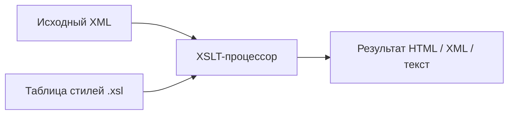

import XsltTransformDemo from '@site/src/components/XsltTransformDemo';

# XSLT

<div class="article-tags">
  <span class="tag tag-required">ОБЯЗАТЕЛЬНО</span>
  <span class="tag tag-beginner">ДЛЯ НОВИЧКОВ</span>
</div>

<span class="complexity-badge">Разработчику</span>
<span class="complexity-badge">Аналитику</span>
<span class="complexity-badge">Архитектору</span>

---

## Семейство XSL

| Часть | Назначение |
|-------|------------|
| **XSLT** (Transformations) | XML → другой XML, HTML, текст |
| **XPath** | Выбор узлов внутри XSLT | [XPath](./213.md) |
| **XSL-FO** (Formatting Objects) | Вёрстка для PDF (печать) — отдельный стек | [справочник XSL-FO](./211.md#xsl-fo--форматирование-для-печати-и-pdf) |

XSLT — **декларативный** язык: вы описываете шаблоны «если узел такой — выведи так», а процессор обходит дерево. Это не замена общему языку программирования, но силён для отчётов, маппинга схем и публикации.

Исходный XML (данные):

```xml
<library>
  <book id="1">
    <title>Война и мир</title>
    <author>Лев Толстой</author>
    <price>450</price>
  </book>
  <book id="2">
    <title>Мастер и Маргарита</title>
    <author>Михаил Булгаков</author>
    <price>380</price>
  </book>
</library>
```

---

## Как работает преобразование

1. Загружается **исходный XML**.
2. Загружается **таблица стилей** (файл `.xsl`, корень `xsl:stylesheet`).
3. **Процессор** (Saxon, `xslt` в .NET, `xsltproc`, встроенный в IDE) строит **дерево результата** и сериализует его (HTML, XML, текст).



Пространство имён XSLT 1.0: `http://www.w3.org/1999/XSL/Transform`, префикс обычно `xsl:`.

---

## Минимальная таблица стилей

```xml
<?xml version="1.0" encoding="UTF-8"?>
<xsl:stylesheet version="1.0"
  xmlns:xsl="http://www.w3.org/1999/XSL/Transform">
  <xsl:template match="/">
    <html>
      <body>
        <h1>Каталог</h1>
        <xsl:apply-templates select="library/book"/>
      </body>
    </html>
  </xsl:template>

  <xsl:template match="book">
    <p><xsl:value-of select="title"/> — <xsl:value-of select="author"/></p>
  </xsl:template>
</xsl:stylesheet>
```

---

## Ключевые элементы XSLT 1.0

### `xsl:template`

Определяет правило для узлов, совпадающих с **XPath Pattern** в `match`:

```xml
<xsl:template match="book[@id='1']">
  <em><xsl:apply-templates/></em>
</xsl:template>
```

`match="/"` — точка входа с корня документа. `priority` и `mode` разрешают конфликты нескольких шаблонов.

---

### `xsl:value-of`

Вставляет **строковое значение** первого узла из `select`:

```xml
<xsl:value-of select="title"/>
<xsl:value-of select="@id"/>
```

---

### `xsl:for-each`

Цикл по узлам, выбранным XPath:

```xml
<xsl:for-each select="library/book">
  <li><xsl:value-of select="title"/></li>
</xsl:for-each>
```

---

### `xsl:sort`

Сортировка внутри `for-each` или `apply-templates`:

```xml
<xsl:for-each select="library/book">
  <xsl:sort select="title" order="ascending" data-type="text"/>
  <li><xsl:value-of select="title"/></li>
</xsl:for-each>
```

---

### `xsl:if`

Одна ветвь без `else` (для `else` — `choose`):

```xml
<xsl:if test="price &gt; 400">
  <span class="expensive"><xsl:value-of select="title"/></span>
</xsl:if>
```

В XML/XSLT символ `>` в атрибутах пишут как `&gt;` или в CDATA.

---

### `xsl:choose`

```xml
<xsl:choose>
  <xsl:when test="@genre='classic'">Классика</xsl:when>
  <xsl:when test="@genre='novel'">Роман</xsl:when>
  <xsl:otherwise>Другое</xsl:otherwise>
</xsl:choose>
```

---

### `xsl:apply-templates`

Делегирует обработку дочерним узлам **другим** шаблонам (рекурсивный обход):

```xml
<xsl:template match="library">
  <ul><xsl:apply-templates select="book"/></ul>
</xsl:template>
```

`select` ограничивает, какие узлы передаются; `mode` — альтернативный набор шаблонов.

---

## Продвинутые приёмы XSLT

Ниже — приёмы из практики трансформации: повторное использование логики, альтернативные проходы по дереву, нумерация и управление пробелами.

### Именованные шаблоны — `xsl:call-template`

**Именованный шаблон** — подпрограмма с параметрами. В отличие от `match`, его вызывают явно по имени:

```xml
<xsl:template name="format-price">
  <xsl:param name="amount"/>
  <xsl:text>$</xsl:text>
  <xsl:value-of select="format-number($amount, '#,##0.00')"/>
</xsl:template>

<xsl:template match="book">
  <p>
    <xsl:value-of select="title"/> —
    <xsl:call-template name="format-price">
      <xsl:with-param name="amount" select="price"/>
    </xsl:call-template>
  </p>
</xsl:template>
```

| Механизм | Когда использовать |
|----------|-------------------|
| `match` + `apply-templates` | Обход дерева «по событию» узла |
| `name` + `call-template` | Общая форматировка (цена, дата, ссылка) из разных мест |

### Переменные и параметры

```xml
<xsl:variable name="currency" select="'RUB'"/>
<xsl:param name="show-author" select="true()"/>
```

`xsl:param` задаётся на уровне `stylesheet` или именованного шаблона; при вызове переопределяется через `with-param`. Константы и флаги так проще, чем дублировать XPath в каждом шаблоне.

### Режимы — `mode`

**Режим** позволяет иметь **несколько наборов** шаблонов для одних и тех же узлов. Первый проход строит HTML, второй — оглавление, третий — сноски:

```xml
<xsl:template match="chapter" mode="toc">
  <li><xsl:value-of select="title"/></li>
</xsl:template>

<xsl:template match="/">
  <html><body>
    <nav><ul>
      <xsl:apply-templates select="//chapter" mode="toc"/>
    </ul></nav>
    <main>
      <xsl:apply-templates select="//chapter" mode="body"/>
    </main>
  </body></html>
</xsl:template>
```

Вызов: `apply-templates` с атрибутом `mode="toc"`. Шаблон без `mode` не участвует в режимном проходе и наоборот.

### `xsl:number` — нумерация глав и списков

```xml
<xsl:template match="chapter">
  <h2>
    <xsl:text>Глава </xsl:text>
    <xsl:number value="position()" format="1"/>
    <xsl:text>. </xsl:text>
    <xsl:value-of select="title"/>
  </h2>
</xsl:template>
```

| Атрибут | Пример | Эффект |
|---------|--------|--------|
| `value` | `position()` | Текущая позиция в списке |
| `format` | `"1"`, `"I"`, `"a"` | Арабские, римские, буквенные |
| `level` | `single`, `any`, `multiple` | Область подсчёта (раздел, документ) |
| `count` | `chapter` | Какие узлы считать |

Для сквозной нумерации рисунков: `count="figure"` + `level="any"`.

### Пробелы и текст в результате

Процессор может **сжимать** пробелы между тегами в stylesheet. Для точного контроля:

- **`xsl:text`** — буквальный текст без нормализации;
- **`xsl:strip-space elements="*"`** / **`xsl:preserve-space`** — политика для исходного XML;
- **`disable-output-escaping="yes"`** — редко, для совместимости с legacy HTML.

```xml
<xsl:text> </xsl:text>   <!-- один пробел между словами -->
<xsl:comment> generated </xsl:comment>  <!-- комментарий в HTML-результате -->
```

### Фильтрация и сводки

Трансформация часто **сужает** документ — типичные задачи: оглавление по заголовкам, сводка по числовым полям, фильтр по дате:

| Задача | Подход в XSLT |
|--------|---------------|
| Оглавление по заголовкам | `//chapter/title` в `mode="toc"` |
| Сводка расходов | `sum(//payment/amount)` в XPath |
| Только записи за период | `xsl:for-each select="entry[date >= '2026-01-01']"` |
| Адаптер между двумя XSD | Шаблоны `match` на исходные теги → другие имена в результате |

Пример сводки по библиотеке:

```xml
<xsl:template match="/">
  <report>
    <total-books><xsl:value-of select="count(library/book)"/></total-books>
    <expensive>
      <xsl:for-each select="library/book[price > 400]">
        <title><xsl:value-of select="title"/></title>
      </xsl:for-each>
    </expensive>
  </report>
</xsl:template>
```

Исходный XML **не меняется** — XSLT создаёт новый документ (отчёт, HTML, упрощённый XML для другой системы).

### Объединение таблиц стилей

`xsl:import` и `xsl:include` собирают общие шаблоны (формат даты, макет страницы) с частными правилами. `import` задаёт **приоритет** (импортированные шаблоны слабее главного файла) — удобно для тем оформления поверх базовой DocBook-цепочки.

---

## Полный пример — HTML-список с сортировкой

```xml
<xsl:stylesheet version="1.0" xmlns:xsl="http://www.w3.org/1999/XSL/Transform">
  <xsl:template match="/">
    <html><body>
      <h1>Список книг</h1>
      <ul>
        <xsl:for-each select="library/book">
          <xsl:sort select="title"/>
          <li>
            <strong><xsl:value-of select="title"/></strong>
            (<xsl:value-of select="author"/>)
            <xsl:if test="price &gt; 400"> — премиум</xsl:if>
          </li>
        </xsl:for-each>
      </ul>
    </body></html>
  </xsl:template>
</xsl:stylesheet>
```

<XsltTransformDemo />

Полный перечень элементов и атрибутов XSLT 2.0/3.0 — [справочник по XSLT](./212.md).

---

## XSLT на стороне клиента

Исторически браузеры (IE, ранний Firefox) могли применять XSLT через `<?xml-stylesheet type="text/xsl" href="..."?>`.

Сегодня:

- в **современных браузерах** поддержка XSLT **ограничена или отключена**;
- для веб-UI предпочтительны **серверное** преобразование или сборка на этапе CI;
- клиентский XSLT иногда встречается во **внутренних** корпоративных приложениях и legacy.

Практический вывод: не закладывайте XSLT в браузер как единственный способ рендера без проверки целевой среды.

---

## XSLT на стороне сервера

Типичные сценарии:

| Среда | Инструмент |
|-------|------------|
| **.NET** | `System.Xml.Xsl.XslCompiledTransform` |
| **Java** | JAXP `Transformer`, Saxon |
| **PHP** | `XSLTProcessor` (libxslt) |
| **CLI** | `xsltproc`, Saxon (`java -jar saxon.jar`) |
| **Конвейеры** | Преобразование перед публикацией отчёта, EDI, СМЭВ |

Преимущества сервера: контроль версий XSLT, кэширование скомпилированных таблиц, единый PDF/HTML для всех клиентов.

Пример запуска Saxon из командной строки:

```bash
java -jar saxon-he.jar -s:input.xml -xsl:transform.xsl -o:output.html
```

---

## Редактирование XML и роль XSLT

**Редактирование** XML — это изменение исходного файла (IDE, DOM API, сериализация из кода). **XSLT** исходник не меняет: он создаёт **производный** документ.

| Задача | Подход |
|--------|--------|
| Правка конфигурации | Редактор + валидация XSD |
| Массовая смена структуры | XSLT или скрипт (Python, C#) |
| Просмотр для человека | XSLT → HTML или CSS к XML |
| Обмен между системами | XSLT как "адаптер" между двумя XSD |

Связанные темы: [XML](./2.md), [XML DOM](./215.md), [справочник XSLT](./212.md).

<div class="callout callout--tip">
  <div class="callout-title">Практическое задание</div>

  <div class="callout-body">
  Добавьте в таблицу стилей: (1) именованный шаблон <code>format-price</code> и вызов через <code>call-template</code>; (2) второй проход <code>mode="toc"</code>, который выводит только заголовки книг списком. Проверьте в демо выше.
</div>
  </div>


---
