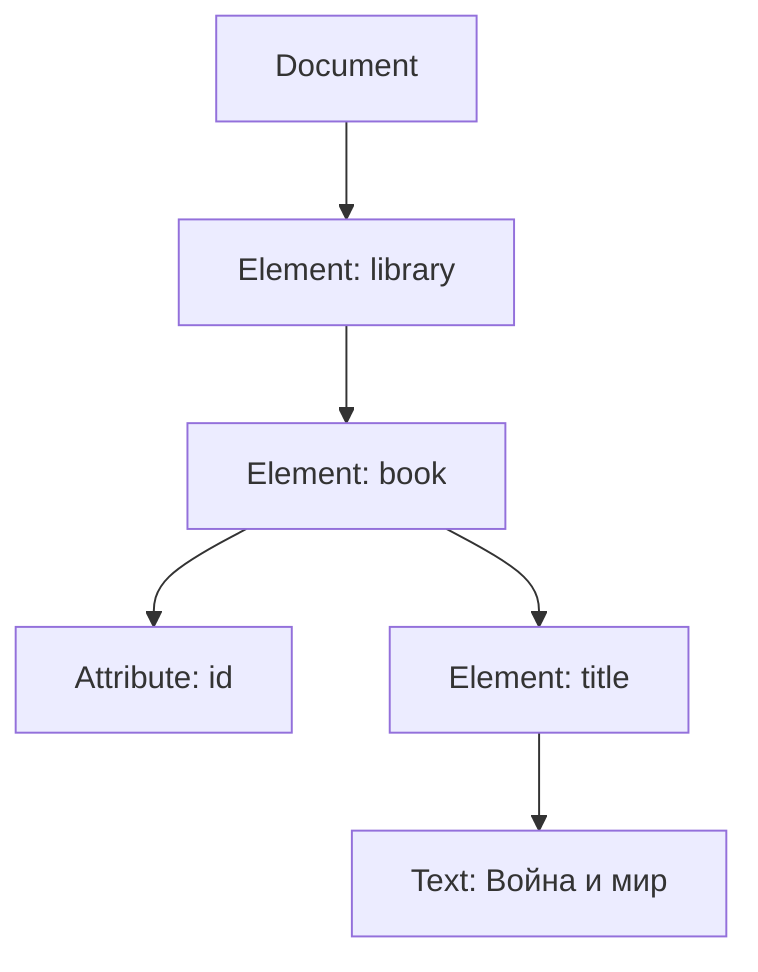

# XML DOM

<div class="article-tags">
  <span class="tag tag-beginner">ДЛЯ НОВИЧКОВ</span>
</div>

<span class="complexity-badge">Разработчику</span>

## Что такое XML DOM

**DOM (Document Object Model)** — программный интерфейс к дереву XML (и HTML). Парсер загружает файл в память и предоставляет объекты для чтения, изменения, добавления и удаления узлов.

В экосистеме XML DOM тесно связан с **XPath** ([глава](./213.md)) и отличается от **потоковых** API (SAX, `XmlReader` в .NET), которые не держат всё дерево в памяти.

| Подход | Память | Удобство |
|--------|--------|----------|
| **DOM** | Весь документ | Произвольная навигация, правки |
| **SAX / XmlReader** | Поток | Большие файлы, только последовательное чтение |
| **LINQ to XML** (`XDocument`) | Дерево, современный API .NET | Удобнее классического DOM |

Основы разметки: [XML](./2.md).

---

## Узлы XML DOM

Каждый фрагмент документа — **узел** с типом `nodeType` (в W3C DOM):

| Тип | Константа (типично) | Пример |
|-----|---------------------|--------|
| Element | `ELEMENT_NODE` (1) | `<book>` |
| Attribute | `ATTRIBUTE_NODE` (2) | `id="1"` |
| Text | `TEXT_NODE` (3) | `Война и мир` |
| CDATA Section | `CDATA_SECTION_NODE` (4) | `<![CDATA[...]]>` |
| Entity Reference | `ENTITY_REFERENCE_NODE` (5) | `&amp;` |
| Entity | `ENTITY_NODE` (6) | в DTD |
| Processing Instruction | `PROCESSING_INSTRUCTION_NODE` (7) | `<?xml-stylesheet ...?>` |
| Comment | `COMMENT_NODE` (8) | `<!-- ... -->` |
| Document | `DOCUMENT_NODE` (9) | корень API |
| Document Type | `DOCUMENT_TYPE_NODE` (10) | `<!DOCTYPE ...>` |
| Document Fragment | `DOCUMENT_FRAGMENT_NODE` (11) | временный контейнер |
| Notation | `NOTATION_NODE` (12) | в DTD |



---

## Доступ к узлам

После разбора документа доступны свойства и методы (имена близки в JavaScript, Java, .NET `XmlDocument`):

| Операция | Идея |
|----------|------|
| `documentElement` | Корневой элемент XML |
| `getElementsByTagName('book')` | Коллекция по локальному имени (без учёта NS в старых API) |
| `getAttribute('id')` | Значение атрибута элемента |
| `childNodes` | Все дочерние узлы, включая текст и комментарии |
| `firstChild` / `lastChild` | Первый / последний дочерний |
| `parentNode` | Родитель |
| `nodeValue` | Текст для текстовых узлов; для элементов — не всегда то, что ожидают новички |

В .NET для новых проектов чаще используют `XElement`, `XDocument`; классический DOM — `XmlDocument` + `SelectNodes` с XPath.

Пример чтения (C# / `XmlDocument`):

```csharp
var doc = new XmlDocument();
doc.Load("library.xml");
XmlNodeList books = doc.SelectNodes("/library/book");
foreach (XmlNode book in books)
{
    string title = book.SelectSingleNode("title")?.InnerText;
    string id = book.Attributes["id"]?.Value;
}
```

Тот же выбор через XPath описан в [главе XPath](./213.md).

---

## NodeList и NodeMap

**NodeList** — упорядоченная коллекция узлов (результат `getElementsByTagName`, XPath). Может быть «живой»: изменение дерева меняет список.

**NamedNodeMap** — атрибуты элемента, доступ по имени или индексу:

```javascript
// Иллюстрация в стиле W3C DOM (браузер / legacy)
const attr = element.attributes.getNamedItem('id');
```

Важно: текст внутри `<title>Война</title>` часто представлен как **дочерний текстовый узел**, а не как «значение элемента» одной строкой — при обходе `childNodes` появляются «лишние» текстовые узлы с пробелами и переводами строк.

---

## Обход дерева узлов

Три классических способа:

### 1. По дочерним узлам (рекурсия)

```text
function traverse(node):
  обработать(node)
  for each child in node.childNodes:
    traverse(child)
```

### 2. Обход в глубину (DFS)

Сначала вниз по ветке, затем к соседям — естественен для DOM.

### 3. TreeWalker / NodeIterator (W3C)

Фильтры по типу узла (только элементы, без пустого текста). В .NET аналог — собственные обходы или LINQ по `Descendants()`.

---

## Навигация по узлам

| Свойство / метод | Направление |
|------------------|-------------|
| `parentNode` | Вверх |
| `childNodes` | Вниз на один уровень |
| `nextSibling` / `previousSibling` | Соседи на том же уровне |
| XPath `/library/book[2]/title` | Декларативный путь ([XPath](./213.md)) |

**Смешанный контент**: между `<book>` и `<title>` парсер может вставить текстовый узел с переводом строки — при `nodeValue` элемента `book` получится склейка текстов потомков, но не всегда так, как ожидается без `InnerText` / нормализации.

**Создание и вставка** (редактирование дерева):

- `createElement`, `createTextNode`, `setAttribute`;
- `appendChild`, `insertBefore`, `removeChild`, `replaceChild`.

После изменений документ сериализуют обратно в файл (`Save` в .NET).

---

## DOM в браузере и на сервере

| Контекст | API |
|----------|-----|
| Браузер | `DOMParser`, `document.implementation.createDocument` — для XML; HTML использует тот же DOM, но другие правила |
| Java | `DocumentBuilder`, `org.w3c.dom` |
| .NET | `XmlDocument`, предпочтительно `XDocument` |
| Python | `xml.dom.minidom` (реже — `lxml` etree) |

Для **больших** XML на сервере предпочтительны потоковые парсеры; DOM загружает весь файл в RAM.

---

## Связь с XSLT и валидацией

- **XSLT-процессор** внутри строит дерево исходника (часто DOM-подобное).
- **Валидация XSD** может выполняться до или после построения DOM ([XML](./2.md), [справочник](./211.md)).
- Преобразование через XSLT: [глава XSLT](./214.md) — DOM исходника напрямую не обязателен менять.

<div class="callout callout--tip">
  <div class="callout-title">Практическое задание</div>
  Загрузите небольшой XML в IDE или скриптом, выведите список имён всех дочерних элементов корня и значения каждого атрибута <code>id</code> у элементов <code>book</code>.
</div>

---
