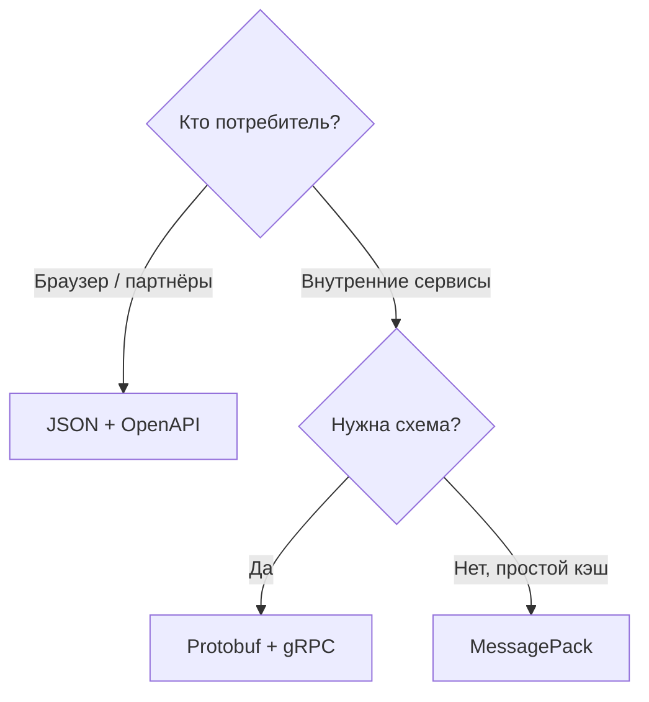

# Бинарные форматы обмена данными

  ОБЯЗАТЕЛЬНО
  ДЛЯ НОВИЧКОВ

Разработчику
Архитектору

**JSON** и **YAML** удобны людям и отладке. В высоконагруженных каналах (микросервисы, мобильные клиенты, очереди) часто выбирают **бинарные** форматы: меньше байт, быстрее парсинг, явная схема.

Текстовые форматы: [JSON](./3.md), [YAML](./4.md). Использование в API: [интеграции](/encyclopedia/2-system-network/2-09-osnovy-integratsionnogo-vzaimodeystviya/117).

---

## Сравнение

| Формат | Схема | Читаемость | Размер | Типичное применение |
|--------|-------|------------|--------|---------------------|
| **JSON** | Нет (опционально JSON Schema) | Высокая | Базовый | Публичные REST API |
| **MessagePack** | Нет | Низкая | Меньше JSON | Кэш, внутренние очереди |
| **BSON** | Нет | Низкая | Компактнее JSON | MongoDB на диске |
| **Protocol Buffers** | `.proto`, строгая | Низкая | Очень компактно | gRPC, внутренние контракты |
| **CBOR** | Опционально | Низкая | Компактно | IoT, COSE/JWT-подобные сценарии |

---

## MessagePack

«Бинарный JSON»: те же типы (map, array, int, str), но без повторения имён полей в каждом сообщении.

**Когда:** внутренний кэш (Redis), сериализация сессии, когда обе стороны на одном стеке и не нужна эволюция схемы годами.

**Осторожно:** без схемы легко сломать совместимость при смене типа поля.

---

## BSON

Расширение JSON с типами даты, `ObjectId`, бинарными полями. Нативен для [MongoDB](/encyclopedia/3-data-markup/3-06-nosql/4).

**Когда:** документная БД, вложенные структуры, GridFS.

Не обязан быть форматом API наружу — наружу часто всё равно JSON.

---

## Protocol Buffers (Protobuf)

Схема в `.proto` → кодогенерация классов → бинарный wire-format.

**Плюсы:**

- компактность и скорость;
- явная версионность полей (`optional`, reserved);
- основа **gRPC**.

**Минусы:**

- нужен пайплайн codegen;
- неудобно читать в DevTools без декодера.

**Когда:** service-to-service, стриминг, жёсткий контракт между командами.

---

## Выбор для архитектора

Правила:

1. **Публичный API** — JSON (или JSON + опциональный binary content-type).
2. **Не десериализуйте** бинарь из ненадёжного источника без валидации длины и схемы.
3. **Версионируйте** контракт (semver API, поля `v2` в Protobuf).
4. Логи и трассировка — оставляйте **текст** (JSON-логи), не Protobuf.

---

## Безопасность

Бинарные форматы не «безопаснее» JSON. Уязвимости в парсерах и **неограниченная вложенность** возможны везде. Ограничивайте размер тела запроса на reverse proxy.

---

## Связанные темы

- [gRPC в обзоре API](/encyclopedia/2-system-network/2-09-osnovy-integratsionnogo-vzaimodeystviya/117)
- [Компетенции бэкенда](/encyclopedia/1-basics/1-23-frontend-i-bekend/4)

---
