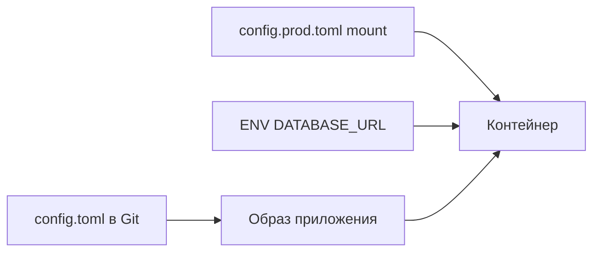

import ExternalPlayEmbed from '@site/src/components/ExternalPlayEmbed';


# TOML

<ExternalPlayEmbed example="data-markup/toml-json-compare-play" title="TOML ↔ JSON" minHeight={480} />


<div class="article-tags">
  <span class="tag tag-required">ОБЯЗАТЕЛЬНО</span>
  <span class="tag tag-beginner">ДЛЯ НОВИЧКОВ</span>
</div>

<span class="complexity-badge">Разработчику</span>
<span class="complexity-badge">Аналитику</span>
<span class="complexity-badge">Инженеру</span>

---

## TOML

### Основы

★ **TOML** (Tom's Obvious, Minimal Language) — текстовый формат для **файлов настроек**. Запись строится из пар `ключ = значение` и заголовков секций `[имя]`. Файл читают и правят в обычном редакторе: не нужны фигурные скобки как в [JSON](./3.md) и не нужны отступы как в [YAML](./4.md).

**Конфигурация** — данные, которые говорят программе, *как* работать (порт, путь к каталогу, имя темы), а не *что* хранить в базе. Общая картина форматов — в [конфигурационных данных](./1.md).

TOML придумали как ответ на боли INI (слишком плоский) и YAML (ошибки из-за отступов). Цель — **минимальный синтаксис**, который человек читает сверху вниз, а парсер проверяет строго.

Типичные файлы в проектах:

- `Cargo.toml` — настройки crate в [Rust](/encyclopedia/5-languages/5-13-rust/intro) (зависимости, версия, профили сборки)
- `pyproject.toml` — метаданные пакета [Python](/encyclopedia/5-languages/5-02-python/intro) (Poetry, uv, hatch, setuptools)
- `config.toml` — Hugo, многие CLI-утилиты, [Traefik](https://doc.traefik.io/traefik/)
- `Pipfile` — альтернативный стиль списка зависимостей Python (формат близок к TOML)
- `dprint.toml`, `taplo.toml` — настройки форматтеров самого TOML

Спецификация — [toml.io](https://toml.io/). Редактор с подсветкой и проверкой — [Taplo](https://taplo.tamasfe.dev/).

---

### Когда выбирать TOML

| Ситуация | Подходящий формат |
|----------|-------------------|
| Конфиг правит человек в редакторе, стек Rust или Python | **TOML** |
| Тело HTTP-запроса или ответ API | [JSON](./3.md) |
| Манифест Kubernetes, Ansible, GitLab CI | [YAML](./4.md) |
| Плоские настройки legacy Windows-утилиты | INI |
| Табличная выгрузка для Excel | [CSV](./219.md) |
| Контракт API с валидацией | [JSON Schema и OpenAPI](./220.md) |

Сводная таблица на одном примере — в [конфигурационных данных](./1.md#сравнение-форматов-на-одном-примере).

---

### Синтаксис

Правила, которые встречаются в каждом файле:

- комментарий начинается с `#` до конца строки
- строки в двойных `"..."` или одинарных `'...'` кавычках
- числа без кавычек; логика — `true` или `false`
- дата и время в формате ISO 8601, например `2026-06-14T12:00:00Z`
- **секция** — строка `[database]`; все пары ниже относятся к этой группе
- **вложенная секция** — `[database.connection]` или таблица в одну строку `{ host = "localhost", port = 5432 }`
- **массив значений** — `tags = ["api", "v2"]`
- **массив таблиц** — повторяющийся заголовок `[[servers]]` для списка однотипных блоков
- отступы только пробелами; **табуляция в файле запрещена** спецификацией

Тот же пример настроек, что в [главе про конфиги](./1.md):

```toml
theme = "dark"
specialMode = true
defaultPath = "C:/Users/Timur/Documents/Backup"

[database]
host = "localhost"
port = 5432
name = "app_db"
```

---

### Типы значений

TOML поддерживает ограниченный набор типов — этого достаточно для конфигов и достаточно мало, чтобы парсеры в разных языках совпадали.

| Тип | Пример | Замечание |
|-----|--------|-----------|
| Строка | `name = "app"` | Двойные или одинарные кавычки |
| Многострочная строка | `"""текст"""` | Тройные кавычки, как в Python |
| Целое | `port = 5432` | Без кавычек |
| Вещественное | `ratio = 3.14` | Точка как разделитель |
| Логическое | `debug = true` | Только `true` / `false` |
| Дата | `day = 2026-06-14` | ISO 8601 |
| Дата-время | `ts = 2026-06-14T12:00:00Z` | С часовым поясом `Z` или `+03:00` |
| Массив | `tags = ["a", "b"]` | Однотипные элементы |
| Таблица | `[db]` или `{ k = 1 }` | Группа ключей |

**Строки.** В двойных кавычках работают escape-последовательности `\n`, `\t`, `\"`. В одинарных кавычках `'C:\data\file'` обратный слэш — обычный символ, удобно для путей Windows.

```toml
path_win = 'C:\Users\Timur\Documents'
path_unix = "/home/timur/docs"
multiline = """
Первая строка
Вторая строка
"""
```

**Числа.** Шестнадцатеричные `0xDEADBEEF`, восьмеричные `0o755`, двоичные `0b1101` — по спецификации 1.0. Для портов и таймаутов обычно хватает десятичной записи.

**Даты.** TOML различает "только дата", "только время" и "дата+время". Парсер превращает их в нативные типы языка (в Python — `datetime.date`, `datetime.datetime`).

```toml
release = 2026-06-14
opened_at = 2026-06-14T09:30:00+03:00
```

---

### Секции и вложенность

**Плоская секция** `[database]` открывает группу ключей:

```toml
[database]
host = "localhost"
port = 5432
```

**Вложенная секция** через точку в заголовке:

```toml
[database.connection]
host = "localhost"
port = 5432

[database.pool]
max = 10
```

Эквивалент через **inline-таблицу** (одна строка):

```toml
database = { connection = { host = "localhost", port = 5432 }, pool = { max = 10 } }
```

Inline-таблицы удобны для коротких блоков. Длинные настройки читают проще в многострочных `[section]`.

---

### Массив таблиц `[[...]]`

Когда нужен **список однотипных объектов** (несколько серверов, несколько зависимостей с полями), используют **массив таблиц** — заголовок с двойными скобками:

```toml
[[servers]]
name = "alpha"
ip = "10.0.0.1"
role = "web"

[[servers]]
name = "beta"
ip = "10.0.0.2"
role = "db"
```

После парсинга в Python это список словарей `config["servers"]`. В Rust — `Vec<ServerConfig>`.

Типичная ошибка — смешать `[servers]` (одна таблица) и `[[servers]]` (массив таблиц) для одного и того же имени. Спецификация запрещает конфликт имён.

---

### Пример `Cargo.toml` (Rust)

Файл в корне Rust-проекта описывает пакет и зависимости. Команда `cargo build` читает его автоматически.

```toml
[package]
name = "notes-api"
version = "0.1.0"
edition = "2021"
authors = ["Timur <tim@example.com>"]
description = "Учебный API заметок"
license = "MIT"

[dependencies]
serde = { version = "1.0", features = ["derive"] }
tokio = { version = "1", features = ["full"] }
sqlx = { version = "0.7", features = ["runtime-tokio", "sqlite"] }

[dev-dependencies]
pretty_assertions = "1"

[profile.release]
opt-level = 3
lto = true
```

Здесь видны:

- корневые ключи внутри `[package]`
- зависимости с **inline-таблицами** и списком `features`
- отдельная секция `[profile.release]` для оптимизаций сборки

Подробнее о экосистеме — [Rust — о разделе](/encyclopedia/5-languages/5-13-rust/intro).

---

### Пример `pyproject.toml` (Python)

Стандарт [PEP 621](https://peps.python.org/pep-0621/) закрепил `pyproject.toml` как единую точку метаданных пакета.

```toml
[project]
name = "notes-cli"
version = "0.1.0"
description = "CLI для личных заметок"
readme = "README.md"
requires-python = ">=3.11"
dependencies = [
  "click>=8.1",
  "rich>=13.0",
]

[project.optional-dependencies]
dev = ["pytest>=8.0", "ruff>=0.4"]

[project.scripts]
notes = "notes_cli.main:cli"

[tool.ruff]
line-length = 100
target-version = "py311"

[tool.pytest.ini_options]
testpaths = ["tests"]
```

Секции `[tool.*]` — соглашение экосистемы Python: в одном файле лежат и описание пакета, и настройки линтера, и pytest. Инструменты читают только свою ветку.

Установка и публикация — [Python — о разделе](/encyclopedia/5-languages/5-02-python/intro), [Lab / JSON в файле](/lab/Примеры/1126#6-json-в-файле).

---

### Пример `config.toml` для приложения

Учебный конфиг веб-сервиса с несколькими окружениями через отдельные файлы:

```toml
app_name = "Notes"
log_level = "info"

[server]
host = "127.0.0.1"
port = 8080
workers = 4

[database]
url = "sqlite://notes.db"
pool_size = 5
timeout_seconds = 30

[[cors.allowed_origins]]
origin = "http://localhost:3000"

[[cors.allowed_origins]]
origin = "https://app.example.com"

[features]
metrics = true
swagger = false
```

Пароль и API-ключ **не пишут** в этот файл — только плейсхолдер или переменная окружения. Разбор — [конфиги и секреты](./1.md#konfigi-env-i-sekrety).

---

### Сравнение с JSON, YAML и INI

| Критерий | TOML | JSON | YAML | INI |
|----------|------|------|------|-----|
| Комментарии в файле | да (`#`) | нет в стандарте | да (`#`) | да |
| Явные секции | `[...]` | только объекты `{ }` | отступы | `[section]` |
| Риск ошибки отступов | низкий | нет отступов | высокий | плоская структура |
| Вложенные структуры | да | да | да | слабо |
| Массив объектов | `[[...]]` | массив объектов | список с `-` | нет |
| Типичное применение | Cargo, pyproject | REST API, npm | Kubernetes, CI | старые Windows-утилиты |
| Читаемость новичком | высокая | высокая | высокая при малых файлах | высокая для плоского |

**INI** не различает типы: всё строка, пока приложение само не преобразует `"true"` в логику. В TOML `enabled = true` — настоящий boolean.

**JSON** не терпит комментариев в стандарте — для `package.json` это осознанный выбор (файл и для машин, и для npm).

**YAML** в CI часто ломается из-за пробела вместо таба или неявного приведения `yes` к `true`. TOML строже к синтаксису строк.

---

### Чтение в коде

#### Python 3.11+

Модуль `tomllib` в стандартной библиотеке (только чтение; запись — сторонние пакеты `tomli-w`, `tomlkit`):

```python
import tomllib
from pathlib import Path

def load_config(path: Path) -> dict:
    with path.open("rb") as f:
        return tomllib.load(f)

config = load_config(Path("config.toml"))
db_host = config["database"]["host"]
print(f"Подключение к {db_host}:{config['database']['port']}")
```

Файл открывают в режиме **`rb`** (байты), потому что спецификация TOML привязана к Unicode и парсеру нужен сырой поток.

#### Node.js

```javascript
import fs from "node:fs";
import TOML from "@iarna/toml";

const raw = fs.readFileSync("config.toml", "utf8");
const config = TOML.parse(raw);
console.log(config.server.port);
```

#### Rust

В приложении часто используют `serde` + `toml`:

```rust
use serde::Deserialize;

#[derive(Deserialize)]
struct Database {
    host: String,
    port: u16,
}

#[derive(Deserialize)]
struct Config {
    database: Database,
}

let config: Config = toml::from_str(&std::fs::read_to_string("config.toml")?)?;
```

`Cargo.toml` читает сам `cargo` — ваш код подключается только если приложение грузит свой `config.toml`.

---

### Переменные окружения и несколько файлов

Паттерн из [12-factor](https://12factor.net/config):

1. `config.toml` — значения по умолчанию в репозитории
2. `config.local.toml` — локальные переопределения (в `.gitignore`)
3. переменные окружения — секреты и продакшен

В Python поверх словаря из TOML часто накладывают `os.environ`:

```python
import os
import tomllib

with open("config.toml", "rb") as f:
    cfg = tomllib.load(f)

cfg["database"]["url"] = os.getenv("DATABASE_URL", cfg["database"]["url"])
```

В .NET аналог — `appsettings.json` + `appsettings.Development.json` + переменные среды. Схема та же, формат другой — см. [конфигурационные данные](./1.md#как-приложение-собирает-настройки-пример-net).

---

### Валидация и редакторы

TOML сам по себе **не задаёт схему** полей (в отличие от [JSON Schema](./220.md)). Проверка — синтаксис парсера + тесты приложения.

Инструменты:

- **Taplo** — LSP для VS Code, форматирование, сортировка ключей
- **taplo-cli** — `taplo check config.toml` в CI
- **dprint** с плагином TOML — единый стиль в монорепозитории

Если конфиг критичен, опишите ожидаемую структуру в тесте:

```python
def test_config_has_database():
    cfg = load_config(Path("config.toml"))
    assert "host" in cfg["database"]
    assert isinstance(cfg["database"]["port"], int)
```

---

### Кодировка и переносы строк

Файл TOML — **UTF-8** без BOM. Кириллица в значениях и комментариях допустима:

```toml
# Приветствие на русском
greeting = "Добро пожаловать"
```

Перенос строки — `\n` (Unix) или `\r\n` (Windows); парсеры принимают оба. В репозитории для кроссплатформенности настройте `.gitattributes`:

```gitattributes
*.toml text eol=lf
```

Подробнее про байты и символы — [текстовые форматы](./111.md), [кодировки](/encyclopedia/1-basics/1-15-tekst/1).

---

### Миграция с INI и JSON

**Из INI** — секции `[General]` становятся `[general]`, пары `key=value` → `key = value` (пробелы вокруг `=` допустимы).

**Из JSON** — вложенные объекты превращают в секции:

JSON:

```json
{
  "server": { "host": "localhost", "port": 8080 },
  "tags": ["api", "v2"]
}
```

TOML:

```toml
[server]
host = "localhost"
port = 8080

tags = ["api", "v2"]
```

Автоматические конвертеры — `toml-cli`, онлайн-редакторы на [toml.io](https://toml.io/). После конвертации прогоните тесты: типы могли стать строками, если INI не различал числа.

---

### Типичные ошибки

| Симптом | Что проверить |
|---------|----------------|
| `Key already exists` | Один и тот же ключ дважды в одной секции — удалите дубликат или используйте `[[...]]` |
| `Invalid date` | Формат даты ISO 8601; не кавычьте дату как строку, если нужен тип даты |
| `Invalid character` | Табуляция в отступах запрещена — только пробелы |
| Пароль в репозитории | Секреты в `.env` или CI, не в `config.toml` — [конфиги и секреты](./1.md#konfigi-env-i-sekrety) |
| `yes` не boolean | В TOML строка только в кавычках: `enabled = "yes"`; без кавычек это не логика |
| Пустая таблица `[[items]]` без полей | Допустимо, но при чтении получите пустой объект в списке |
| Смешали `[servers]` и `[[servers]]` | Конфликт имён — выберите один стиль |

**Парсер** при ошибке обычно пишет номер строки и столбец. Сверяйтесь со [спецификацией TOML 1.0](https://toml.io/en/v1.0.0), если сомневаетесь в запятой в конце массива (trailing comma в TOML **разрешена**).

---

### TOML в пайплайне и Docker

Конфиг в образ не запекают с секретами. Типичная схема:



В [Docker Compose](/lab/Примеры/11111) файл монтируют через `volumes` или передают путь через переменную. Синтаксис YAML для compose — [глава YAML](./4.md).

---

### Версии спецификации

Актуальная версия — **TOML 1.0.0** (2021). Старые проекты могли использовать TOML 0.5; отличия редко встречаются новичку, но в CI полезно зафиксировать версию в документации команды.

Что изменилось к 1.0:

- уточнены правила для дат и времени
- запрещена неоднозначность между таблицей и массивом таблиц
- trailing comma в массивах разрешена явно

Если парсер пишет `unsupported TOML version`, обновите библиотеку (`toml` crate в Rust, `tomllib` в Python 3.11+).

---

### Пример Hugo `config.toml`

Статический генератор [Hugo](https://gohugo.io/) читает настройки сайта из TOML:

```toml
baseURL = "https://example.com/"
languageCode = "ru-ru"
title = "Мой блог"
theme = "ananke"

[params]
  author = "Timur"
  description = "Заметки про SQL и данные"

[menu]
  [[menu.main]]
    name = "Главная"
    url = "/"
    weight = 1
  [[menu.main]]
    name = "О проекте"
    url = "/about/"
    weight = 2

[markup]
  [markup.goldmark]
    [markup.goldmark.renderer]
      unsafe = true
```

Здесь снова `[[menu.main]]` — список пунктов меню. Такой же приём встречается в конфигах Traefik, [dprint](https://dprint.dev/), [Ruff](https://docs.astral.sh/ruff/).

---

### TOML и `.env`

| Источник | Назначение | В Git? |
|----------|------------|--------|
| `config.toml` | структура настроек, порты, флаги | да |
| `.env` | секреты и локальные переопределения | нет (только `.env.example`) |

TOML описывает **дерево** настроек. `.env` — плоский список `KEY=value` для [переменных окружения](./1.md#konfigi-env-i-sekrety). В продакшене приложение часто читает TOML и поверх подставляет значения из окружения.

---

### Частые вопросы

**Можно ли писать комментарии?**  
Да, `#` до конца строки. Блоков `/* */` нет.

**Есть ли `null`?**  
В TOML 1.0 ключ без значения не задают — отсутствие ключа означает "не настроено". Явный `null` как в JSON появился в черновиках 1.1; в 1.0 используйте опциональные секции или пустую строку по соглашению команды.

**TOML для REST API?**  
Почти никогда. API отдают [JSON](./3.md); TOML остаётся в файлах на диске.

**Как отформатировать файл в CI?**  
`taplo fmt config.toml` и проверка `taplo check` в pipeline рядом с линтером кода.

---

### Упражнение для закрепления

1. Создайте `config.toml` с секциями `[app]`, `[database]`, двумя блоками `[[servers]]`.
2. Прочитайте файл в Python через `tomllib` и выведите `host` первого сервера.
3. Вынесите `database.url` в переменную окружения `DATABASE_URL` и подставьте в коде.
4. Добавьте `config.toml` в репозиторий, а файл с паролем — в `.gitignore`.
5. Сравните тот же конфиг в [JSON](./3.md) — какой формат проще править вручную?

Чек-лист раздела — [99.md](./99.md). Итоги и FAQ — [98.md](./98.md).

---

### Справочник конструкций

Быстрый ориентир по синтаксису — таблица ниже. Полная спецификация — [toml.io](https://toml.io/en/v1.0.0).

| Конструкция | Пример | Результат после парсинга |
|-------------|--------|--------------------------|
| Ключ в корне | `title = "Notes"` | `config["title"]` → строка |
| Секция | `[db]` + пары | вложенный словарь `config["db"]` |
| Вложенная секция | `[db.pool]` | `config["db"]["pool"]` |
| Inline-таблица | `opts = { a = 1, b = 2 }` | объект с двумя ключами |
| Массив строк | `tags = ["a", "b"]` | список из двух элементов |
| Массив чисел | `ports = [8080, 8443]` | список int |
| Массив таблиц | `[[item]]` дважды | список из двух объектов |
| Комментарий | `# текст` | игнорируется парсером |
| Дата | `day = 2026-06-14` | тип date |
| Время | `t = 14:30:00` | тип time |
| Дата-время | `at = 2026-06-14T14:30:00+03:00` | datetime с TZ |

---

### Массивы и гетерогенность

Элементы массива могут быть разных типов, если так задумано конфигом:

```toml
mixed = [1, "two", true, 2026-06-14]
```

На практике для читаемости держат **однотипные** массивы (`["ru", "en"]` или `[1, 2, 3]`). Смешанные массивы усложняют статическую типизацию в Rust и Go.

**Пустой массив** — `items = []`. **Пустая inline-таблица** — `opts = {}`.

---

### Дублирование и переопределение ключей

В одной секции ключ встречается **один раз**. Повтор — ошибка парсера:

```toml
[app]
port = 8080
port = 9090   # ошибка: Key "port" is already defined
```

Разные секции могут содержать одноимённые ключи — они не конфликтуют:

```toml
[server]
port = 8080

[metrics]
port = 9090
```

---

### Строки и пути Windows

Обратный слэш в двойных кавычках — escape-символ. Для путей Windows удобнее **одинарные** кавычки:

```toml
data_dir = 'C:\ProgramData\MyApp'
log_file = "C:\\logs\\app.log"
```

В Unix-путях экранирование обычно не нужно:

```toml
socket = "/var/run/app.sock"
```

---

### Интеграция с Docker и Kubernetes

**Docker Compose** часто монтирует `config.toml` как volume:

```yaml
services:
  api:
    image: notes-api:latest
    volumes:
      - ./config.toml:/app/config.toml:ro
    environment:
      DATABASE_URL: ${DATABASE_URL}
```

Синтаксис YAML — [глава YAML](./4.md). Секреты — не в TOML на образе, а в `environment` или Docker secrets — [Compose в Lab](/lab/Примеры/11111).

В **Kubernetes** ConfigMap хранит текст конфига; приложение монтирует файл в pod. TOML остаётся форматом файла внутри ConfigMap, не форматом манифеста K8s (манифесты — YAML).

---

### Монорепозиторий

В репозитории с несколькими сервисами у каждого свой `config.toml` или своя секция в общем файле:

```text
repo/
  services/
    api/config.toml
    worker/config.toml
  libs/
    shared/defaults.toml
```

Общие значения выносят в `defaults.toml` и **мержат** в коде (Rust: `config` crate с несколькими источниками; Python: два вызова `tomllib.load` и `dict` merge). Стандарт TOML **не описывает** `import` другого файла — это логика приложения.

---

### Тестирование конфигурации

Минимальный набор проверок в CI:

1. `taplo check **/*.toml` — синтаксис
2. unit-тест загрузки — обязательные ключи на месте
3. отсутствие строк вроде `password = "real_secret"` — grep или secret scanner

Пример теста на [pytest](/encyclopedia/5-languages/5-02-python/intro):

```python
import tomllib
from pathlib import Path

REQUIRED = ("host", "port", "name")

def test_database_section():
    with Path("config.toml").open("rb") as f:
        cfg = tomllib.load(f)
    for key in REQUIRED:
        assert key in cfg["database"], f"Нет database.{key}"
```

---

### Сравнение одного конфига в четырёх форматах

Один смысл — четыре записи. Так проще понять, зачем TOML в стеке Rust/Python.

**TOML**

```toml
theme = "dark"
[database]
host = "localhost"
port = 5432
```

**JSON**

```json
{
  "theme": "dark",
  "database": { "host": "localhost", "port": 5432 }
}
```

**YAML**

```yaml
theme: dark
database:
  host: localhost
  port: 5432
```

**INI**

```ini
theme=dark
[database]
host=localhost
port=5432
```

TOML и INI похожи визуально, но TOML строже к типам и поддерживает вложенность без костылей.

---

### Когда TOML не подходит

- ответ HTTP API — [JSON](./3.md)
- манифест Kubernetes — [YAML](./4.md)
- таблица на миллион строк — [CSV](./219.md) или [Parquet](./222.md)
- документ с юридической схемой — [XML](./2.md)
- бинарный обмен внутри контура — [Protobuf](./216.md)

TOML сознательно остаётся в нише **человекочитаемых конфигов** на диске.

---

### Связанные материалы

- [Конфигурационные данные в текстовых форматах](./1.md)
- [JSON](./3.md) · [YAML](./4.md) · [CSV](./219.md)
- [JSON Schema и OpenAPI](./220.md)
- [Конфигурации и данные — о разделе](./intro.md)
- [Rust — о разделе](/encyclopedia/5-languages/5-13-rust/intro)
- [Python — о разделе](/encyclopedia/5-languages/5-02-python/intro)

---
