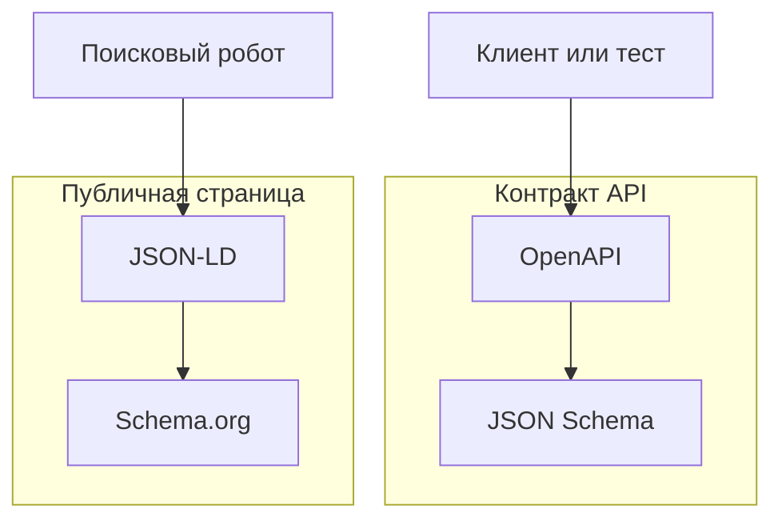
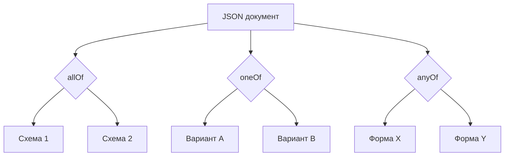
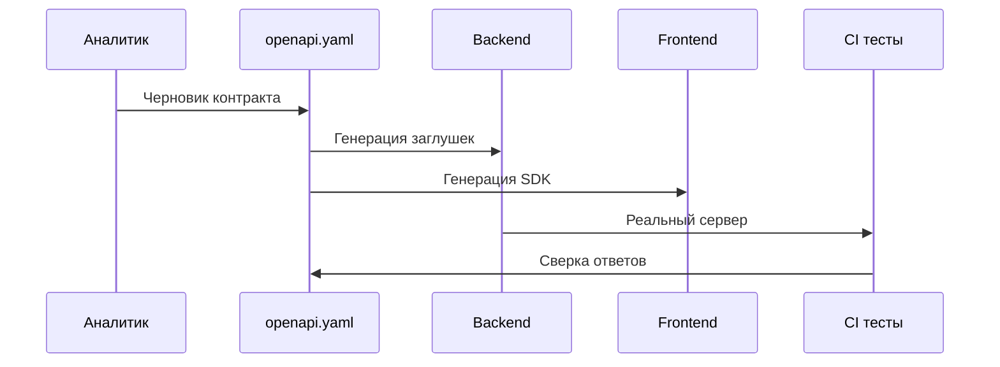
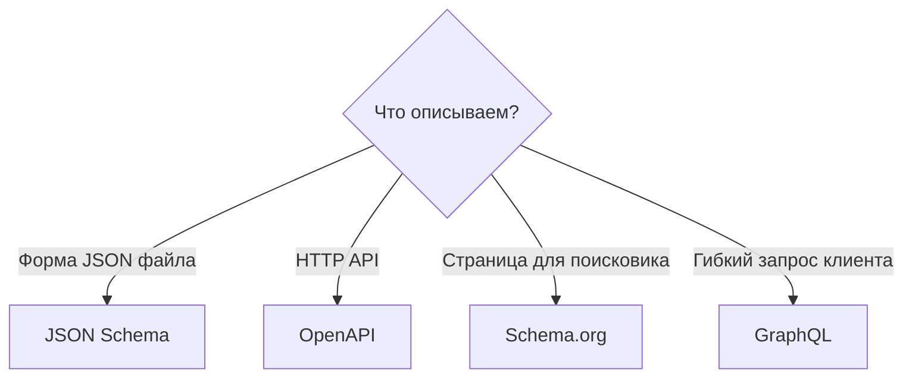
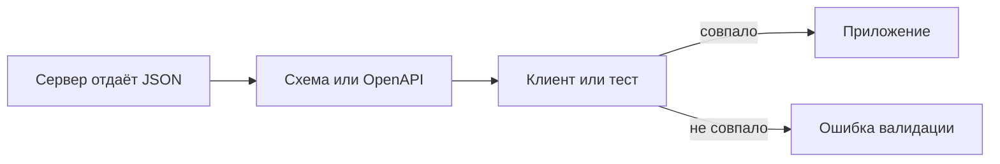

# JSON Schema, OpenAPI и Schema.org

<div class="article-tags">
  <span class="tag tag-required">ОБЯЗАТЕЛЬНО</span>
  <span class="tag tag-beginner">ДЛЯ НОВИЧКОВ</span>
</div>

<span class="complexity-badge">Разработчику</span>
<span class="complexity-badge">Аналитику</span>
<span class="complexity-badge">Архитектору</span>
<span class="complexity-badge">Тестировщику</span>

---

## JSON Schema, OpenAPI и Schema.org

Три разных инструмента решают три разные задачи. Их часто путают, потому что все связаны с [JSON](./3.md).

| Инструмент | Для чего |
|------------|----------|
| **JSON Schema** | Правила для JSON-документа (типы, обязательные поля) |
| **OpenAPI** | Описание HTTP API (URL, методы, тела запросов и ответов) |
| **Schema.org + JSON-LD** | Разметка веб-страницы для поисковиков |

[JSON](./3.md) задаёт синтаксис одного файла, но сам по себе не говорит, обязателен ли ключ `email` и может ли `age` быть строкой. **Схема** — отдельный документ с правилами. **Контракт** — договорённость между тем, кто отдаёт JSON, и тем, кто его принимает (клиент, другой сервис, тест).

Типичные сбои без схемы:

- клиент ждёт `userId`, сервер шлёт `user_id`
- `age` пришло строкой `"25"` вместо числа `25`
- ключ есть со значением `null`, хотя логика ждала отсутствие ключа
- парсер падает на лишней запятой в конце (trailing comma)

Смежные темы — [интеграции и API](/encyclopedia/2-system-network/2-09-osnovy-integratsionnogo-vzaimodeystviya/117), [маршалинг](/encyclopedia/3-data-markup/3-01-prodvinutye-operatsii-s-dannymi/111), [GraphQL](./221.md).



---

## JSON Schema — основы

★ **JSON Schema** — JSON-файл с правилами проверки другого JSON. Спецификация — [json-schema.org](https://json-schema.org/).

Пример схемы для объекта пользователя:

```json
{
  "$schema": "https://json-schema.org/draft/2020-12/schema",
  "$id": "https://example.com/schemas/user.json",
  "type": "object",
  "title": "User",
  "description": "Пользователь интернет-магазина",
  "properties": {
    "id": { "type": "integer", "minimum": 1 },
    "email": { "type": "string", "format": "email" },
    "nickname": { "type": "string", "maxLength": 32 }
  },
  "required": ["id", "email"],
  "additionalProperties": false
}
```

Ключевые поля схемы:

- `$schema` — версия черновика спецификации (часто `draft/2020-12`)
- `$id` — уникальный идентификатор схемы (URL или URN)
- `type` — тип значения (`object`, `array`, `string`, `number`, `integer`, `boolean`, `null`)
- `properties` — правила для каждого поля объекта
- `required` — список ключей, которые **должны** присутствовать в объекте
- `additionalProperties: false` — запрет лишних полей, не описанных в схеме
- `format` — подсказка валидатору (`email`, `date-time`, `uri`, `uuid`)
- `title` и `description` — текст для людей и для генераторов документации

### Обязательное поле и значение null

Это **два разных вопроса** в контракте.

1. **Должен ли ключ быть в JSON?** — список `required`.
2. **Может ли значение быть `null`?** — тип `["string", "null"]` или поле `nullable` в OpenAPI 3.

```json
{
  "type": "object",
  "properties": {
    "email": { "type": "string", "format": "email" },
    "middleName": { "type": ["string", "null"] }
  },
  "required": ["email"]
}
```

| Ситуация | Как выглядит в JSON | Как описать в схеме |
|----------|---------------------|---------------------|
| Поле не передавали | ключа нет | ключ не в `required` |
| Явно "нет значения" | `"middleName": null` | тип включает `null` |
| Пустая строка | `"middleName": ""` | это строка, не `null` |

В [JavaScript](/encyclopedia/5-languages/5-01-javascript/intro) при сериализации `undefined` **пропадает** из JSON. В API это путают с `null` — зафиксируйте в схеме явно. Подробнее про `null` в [JSON](./3.md).

---

## Вложенные объекты

Реальные контракты редко плоские. Адрес, профиль, метаданные — всё это вложенные `object`.

```json
{
  "$schema": "https://json-schema.org/draft/2020-12/schema",
  "type": "object",
  "required": ["id", "profile"],
  "properties": {
    "id": { "type": "integer" },
    "profile": {
      "type": "object",
      "required": ["displayName"],
      "properties": {
        "displayName": { "type": "string", "minLength": 1 },
        "avatarUrl": { "type": "string", "format": "uri" },
        "settings": {
          "type": "object",
          "properties": {
            "theme": { "type": "string", "enum": ["light", "dark", "system"] },
            "notifications": { "type": "boolean", "default": true }
          },
          "additionalProperties": false
        }
      },
      "additionalProperties": false
    }
  },
  "additionalProperties": false
}
```

Полезные ключи для вложенности:

- `minProperties` / `maxProperties` — сколько ключей допустимо в объекте
- `dependentRequired` — если есть ключ `creditCard`, обязателен `billingAddress`
- `patternProperties` — правила для ключей по шаблону (например `^S_` для служебных полей)

Пример `patternProperties`:

```json
{
  "type": "object",
  "patternProperties": {
    "^S_": { "type": "string" }
  },
  "additionalProperties": false
}
```

Здесь ключи вида `S_internal` проходят по шаблону, остальные — запрещены при `additionalProperties: false`.

---

## Массивы

★ Массив в JSON Schema описывается `type: "array"` и ключом `items` — схемой **одного** элемента.

```json
{
  "type": "object",
  "properties": {
    "tags": {
      "type": "array",
      "items": { "type": "string", "minLength": 1 },
      "minItems": 1,
      "maxItems": 10,
      "uniqueItems": true
    },
    "scores": {
      "type": "array",
      "items": { "type": "number", "minimum": 0, "maximum": 100 }
    }
  }
}
```

Ключи для массивов:

- `items` — схема элемента (одинаковая для всех позиций)
- `prefixItems` — схема по позициям (кортеж: первый элемент — строка, второй — число)
- `minItems` / `maxItems` — длина массива
- `uniqueItems: true` — все элементы различны (для примитивов сравнивают по значению)
- `contains` — хотя бы один элемент должен соответствовать под-схеме

Кортеж (tuple) через `prefixItems`:

```json
{
  "type": "array",
  "prefixItems": [
    { "type": "string" },
    { "type": "integer" },
    { "type": "boolean" }
  ],
  "items": false,
  "minItems": 3,
  "maxItems": 3
}
```

Массив объектов — типичный ответ списка:

```json
{
  "type": "array",
  "items": {
    "type": "object",
    "required": ["id", "title"],
    "properties": {
      "id": { "type": "integer" },
      "title": { "type": "string" }
    }
  }
}
```

---

## enum и const

Когда поле может принимать только фиксированный набор значений, используют `enum`:

```json
{
  "type": "string",
  "enum": ["draft", "published", "archived"]
}
```

`enum` работает и с числами, и с `null` в составе типа:

```json
{
  "type": ["string", "null"],
  "enum": ["ru", "en", "de", null]
}
```

`const` — ровно одно значение (строже `enum` из одного элемента):

```json
{
  "type": "object",
  "properties": {
    "apiVersion": { "const": "v2" },
    "kind": { "const": "User" }
  },
  "required": ["apiVersion", "kind"]
}
```

Так Kubernetes и многие внутренние API помечают тип ресурса в теле JSON.

---

## oneOf, anyOf, allOf

Три способа объединить несколько схем. Новички путают их чаще всего.

| Ключевое слово | Смысл |
|----------------|-------|
| `allOf` | Документ должен соответствовать **всем** перечисленным схемам сразу |
| `anyOf` | Достаточно соответствия **хотя бы одной** схеме |
| `oneOf` | Ровно **одна** схема из списка (не ноль, не две) |

### allOf — наследование и переиспользование

```json
{
  "allOf": [
    { "$ref": "#/$defs/Timestamped" },
    {
      "type": "object",
      "required": ["email"],
      "properties": {
        "email": { "type": "string", "format": "email" }
      }
    }
  ]
}
```

`allOf` часто склеивают базовую схему с расширением. В OpenAPI тот же приём для `User` и `UserWithOrders`.

### oneOf — взаимоисключающие варианты

Платёж картой **или** по счёту — два разных набора полей:

```json
{
  "oneOf": [
    {
      "type": "object",
      "required": ["type", "cardNumber"],
      "properties": {
        "type": { "const": "card" },
        "cardNumber": { "type": "string", "pattern": "^[0-9]{16}$" }
      }
    },
    {
      "type": "object",
      "required": ["type", "iban"],
      "properties": {
        "type": { "const": "bank" },
        "iban": { "type": "string", "minLength": 15 }
      }
    }
  ]
}
```

Добавьте дискриминатор `type` с `const`, иначе валидатору сложнее выбрать ветку.

### anyOf — несколько допустимых форм

```json
{
  "anyOf": [
    { "type": "string", "format": "email" },
    { "type": "string", "pattern": "^\\+?[0-9]{10,15}$" }
  ]
}
```

Поле `contact` может быть email **или** телефоном.



---

## $ref и $defs

Дублирование схем в большом проекте ведёт к рассинхрону. **$ref** — ссылка на другой фрагмент схемы.

```json
{
  "$schema": "https://json-schema.org/draft/2020-12/schema",
  "$defs": {
    "PositiveInt": {
      "type": "integer",
      "minimum": 1
    },
    "Email": {
      "type": "string",
      "format": "email"
    },
    "User": {
      "type": "object",
      "required": ["id", "email"],
      "properties": {
        "id": { "$ref": "#/$defs/PositiveInt" },
        "email": { "$ref": "#/$defs/Email" }
      }
    }
  },
  "$ref": "#/$defs/User"
}
```

Обозначения:

- `$defs` (в старых черновиках — `definitions`) — словарь именованных под-схем внутри файла
- `#/$defs/User` — ссылка на якорь в **текущем** документе
- `https://example.com/schemas/user.json` — ссылка на внешний файл (нужен доступ по URL при валидации)

В OpenAPI переиспользование через `components/schemas`:

```yaml
components:
  schemas:
    User:
      $ref: './schemas/user.json'
```

Правила работы с `$ref`:

- не смешивайте `$ref` с соседними ключами в одном объекте (в draft 2020-12 рядом с `$ref` нельзя писать `type`)
- для расширения ссылки используйте `allOf: [{ "$ref": "..." }, { ...дополнение... }]`
- циклические ссылки (User → Order → User) допустимы, если валидатор их разрешает

---

## Валидация в Python

Библиотека **jsonschema** — де-факто стандарт для [Python](/encyclopedia/5-languages/5-02-python/intro).

Установка:

```bash
pip install jsonschema
```

Базовая проверка:

```python
import json
from jsonschema import validate, ValidationError, Draft202012Validator

schema = {
    "type": "object",
    "required": ["id", "email"],
    "properties": {
        "id": {"type": "integer", "minimum": 1},
        "email": {"type": "string", "format": "email"},
    },
    "additionalProperties": False,
}

data = json.loads('{"id": 1, "email": "user@example.com"}')
validate(instance=data, schema=schema)
```

Разбор ошибки:

```python
bad = json.loads('{"id": "oops", "email": "not-an-email"}')

try:
    validate(instance=bad, schema=schema)
except ValidationError as e:
    print(e.message)       # текст ошибки
    print(e.json_path)     # путь к полю, например $.id
    print(e.validator)     # какое правило нарушено, например type
```

Сбор **всех** ошибок (не только первой):

```python
validator = Draft202012Validator(schema)
errors = sorted(validator.iter_errors(bad), key=lambda e: e.json_path)
for err in errors:
    print(f"{err.json_path}: {err.message}")
```

Загрузка схемы из файла:

```python
from pathlib import Path
import json

schema = json.loads(Path("schemas/user.json").read_text(encoding="utf-8"))
```

Интеграция с FastAPI — Pydantic модели часто генерируют из OpenAPI, а тесты сверяют ответы по JSON Schema напрямую.

Типичный порядок проверки в API:

1. HTTP-тело пришло — парсинг JSON (`json.loads`)
2. Синтаксис верный — `validate` по схеме
3. Бизнес-правила — код приложения (уникальный email, существующий `userId`)

---

## Валидация в JavaScript

В [Node.js](/encyclopedia/5-languages/5-01-javascript/intro) популярна библиотека **Ajv** (Another JSON Schema Validator).

Установка:

```bash
npm install ajv ajv-formats
```

Пример:

```javascript
import Ajv from "ajv";
import addFormats from "ajv-formats";

const ajv = new Ajv({ allErrors: true, strict: true });
addFormats(ajv);

const schema = {
  type: "object",
  required: ["id", "email"],
  properties: {
    id: { type: "integer", minimum: 1 },
    email: { type: "string", format: "email" },
  },
  additionalProperties: false,
};

const validate = ajv.compile(schema);

const data = { id: 1, email: "user@example.com" };
if (!validate(data)) {
  console.log(validate.errors);
}
```

В браузере Ajv тяжеловат; для форм чаще берут **Zod** или **Yup** — они не всегда совместимы с JSON Schema один в один, но идея та же: описать форму и проверить объект.

Express middleware с Ajv:

```javascript
function validateBody(schema) {
  const validate = ajv.compile(schema);
  return (req, res, next) => {
    if (!validate(req.body)) {
      return res.status(400).json({
        error: "validation_failed",
        details: validate.errors,
      });
    }
    next();
  };
}
```

Сначала `JSON.parse` ловит **синтаксис** (битый JSON). Затем Ajv ловит **семантику** (тип не тот). Это разные ошибки — клиенту отдавайте разные коды и сообщения.

---

## OpenAPI — обзор

★ **OpenAPI** (раньше называли Swagger) — описание **HTTP API** в одном YAML- или JSON-файле. Внутри — пути (`/users/{id}`), методы (`GET`, `POST`), параметры, коды ответов и **схемы тел** в нотации, совместимой с JSON Schema.

OpenAPI помогает команде:

- показать документацию в Swagger UI или Redoc
- сгенерировать клиент или заглушку сервера
- в CI сверять реальный ответ API со схемой
- договориться между backend, frontend и QA на одном языке

Инструменты — [Swagger Editor](https://editor.swagger.io/), `openapi-generator`, встроенная поддержка в [FastAPI](/encyclopedia/5-languages/5-02-python/intro), Spring, [ASP.NET](/encyclopedia/5-languages/5-04-platforma-dotnet/intro).

[GraphQL](./221.md) описывает другой стиль API — один endpoint и выбор полей клиентом. OpenAPI описывает классический **REST** — много URL и фиксированные ресурсы. Сравнение — в [главе GraphQL](./221.md#сравнение-с-rest-и-openapi).

---

## Полный пример OpenAPI

Ниже сокращённый, но цельный контракт магазина: **аутентификация**, **пагинация**, **ошибки**.

```yaml
openapi: 3.0.3
info:
  title: Shop API
  version: 1.2.0
  description: REST API каталога и заказов
servers:
  - url: https://api.example.com/v1
security:
  - bearerAuth: []
paths:
  /products:
    get:
      summary: Список товаров
      operationId: listProducts
      security: []
      parameters:
        - name: page
          in: query
          schema:
            type: integer
            minimum: 1
            default: 1
        - name: pageSize
          in: query
          schema:
            type: integer
            minimum: 1
            maximum: 100
            default: 20
        - name: category
          in: query
          schema:
            type: string
      responses:
        "200":
          description: Страница товаров
          content:
            application/json:
              schema:
                $ref: "#/components/schemas/ProductPage"
        "400":
          $ref: "#/components/responses/BadRequest"
        "429":
          $ref: "#/components/responses/RateLimited"
  /products/{id}:
    get:
      summary: Один товар
      operationId: getProduct
      security: []
      parameters:
        - $ref: "#/components/parameters/ProductId"
      responses:
        "200":
          description: OK
          content:
            application/json:
              schema:
                $ref: "#/components/schemas/Product"
        "404":
          $ref: "#/components/responses/NotFound"
  /orders:
    post:
      summary: Создать заказ
      operationId: createOrder
      requestBody:
        required: true
        content:
          application/json:
            schema:
              $ref: "#/components/schemas/CreateOrderRequest"
      responses:
        "201":
          description: Заказ создан
          content:
            application/json:
              schema:
                $ref: "#/components/schemas/Order"
        "400":
          $ref: "#/components/responses/BadRequest"
        "401":
          $ref: "#/components/responses/Unauthorized"
        "422":
          $ref: "#/components/responses/ValidationError"
  /orders/{id}:
    get:
      summary: Заказ по id
      operationId: getOrder
      parameters:
        - $ref: "#/components/parameters/OrderId"
      responses:
        "200":
          description: OK
          content:
            application/json:
              schema:
                $ref: "#/components/schemas/Order"
        "401":
          $ref: "#/components/responses/Unauthorized"
        "404":
          $ref: "#/components/responses/NotFound"
components:
  securitySchemes:
    bearerAuth:
      type: http
      scheme: bearer
      bearerFormat: JWT
      description: JWT в заголовке Authorization
  parameters:
    ProductId:
      name: id
      in: path
      required: true
      schema:
        type: integer
        minimum: 1
    OrderId:
      name: id
      in: path
      required: true
      schema:
        type: string
        format: uuid
  schemas:
    Product:
      type: object
      required: [id, title, price, currency]
      properties:
        id:
          type: integer
        title:
          type: string
        price:
          type: number
          minimum: 0
        currency:
          type: string
          enum: [RUB, USD, EUR]
    ProductPage:
      type: object
      required: [items, page, pageSize, total]
      properties:
        items:
          type: array
          items:
            $ref: "#/components/schemas/Product"
        page:
          type: integer
        pageSize:
          type: integer
        total:
          type: integer
    CreateOrderRequest:
      type: object
      required: [productId, quantity]
      properties:
        productId:
          type: integer
        quantity:
          type: integer
          minimum: 1
    Order:
      type: object
      required: [id, status, total]
      properties:
        id:
          type: string
          format: uuid
        status:
          type: string
          enum: [pending, paid, shipped, cancelled]
        total:
          type: number
    ErrorBody:
      type: object
      required: [error, message]
      properties:
        error:
          type: string
        message:
          type: string
        details:
          type: array
          items:
            type: object
            properties:
              field:
                type: string
              issue:
                type: string
    ValidationErrorBody:
      allOf:
        - $ref: "#/components/schemas/ErrorBody"
        - type: object
          properties:
            error:
              const: validation_error
  responses:
    BadRequest:
      description: Неверный запрос
      content:
        application/json:
          schema:
            $ref: "#/components/schemas/ErrorBody"
    Unauthorized:
      description: Нет или неверный токен
      content:
        application/json:
          schema:
            $ref: "#/components/schemas/ErrorBody"
    NotFound:
      description: Ресурс не найден
      content:
        application/json:
          schema:
            $ref: "#/components/schemas/ErrorBody"
    ValidationError:
      description: Тело не прошло валидацию
      content:
        application/json:
          schema:
            $ref: "#/components/schemas/ValidationErrorBody"
    RateLimited:
      description: Слишком много запросов
      headers:
        Retry-After:
          schema:
            type: integer
      content:
        application/json:
          schema:
            $ref: "#/components/schemas/ErrorBody"
```

Разбор фрагментов:

- `security` и `securitySchemes.bearerAuth` — JWT в заголовке `Authorization: Bearer <token>`
- `page` / `pageSize` / `total` — offset-пагинация в query
- переиспользуемые `responses` и `parameters` через `$ref`
- `enum` для статуса заказа и валюты
- `422` отдельно от `400` — тело синтаксически JSON, но семантика неверна

Для cursor-пагинации (как в [GraphQL Relay](./221.md#пагинация-курсоры-relay)) в OpenAPI обычно добавляют query-параметр `cursor` и поле `nextCursor` в ответе.

---

## Подход contract-first

**Contract-first** (сначала контракт) — команда пишет OpenAPI или JSON Schema **до** кода сервера. Затем:

- backend реализует endpoint по спецификации
- frontend генерирует типы и клиент
- QA пишет тесты по тем же схемам



Плюсы:

- меньше сюрпризов при интеграции [микросервисов](/encyclopedia/8-infra-security/8-05-mikroservisy-i-integratsiya/intro)
- одна правда для документации и тестов
- ревью API до написания логики

Минусы:

- нужна дисциплина обновлять YAML при изменениях
- генераторы не всегда дают идеальный код

Альтернатива **code-first** — аннотации в коде (FastAPI, SpringDoc) и экспорт OpenAPI из работающего приложения. Удобно на старте, но файл может обогнать договорённости с клиентами.

Практический компромисс: contract-first для публичного API, code-first для внутренних сервисов с коротким жизненным циклом.

---

## Swagger UI и документация

**Swagger UI** — веб-интерфейс, который читает `openapi.yaml` и показывает интерактивную документацию: список путей, примеры тел, кнопку Try it out.

Где встречается:

- встроено в FastAPI на `/docs`
- Spring Boot + springdoc на `/swagger-ui.html`
- статическая страница на GitHub Pages с файлом спецификации

Минимальный HTML с CDN:

```html
<!DOCTYPE html>
<html>
<head>
  <title>Shop API docs</title>
  <link rel="stylesheet" href="https://unpkg.com/swagger-ui-dist/swagger-ui.css" />
</head>
<body>
  <div id="swagger-ui"></div>
  <script src="https://unpkg.com/swagger-ui-dist/swagger-ui-bundle.js"></script>
  <script>
    SwaggerUIBundle({
      url: "./openapi.yaml",
      dom_id: "#swagger-ui",
    });
  </script>
</body>
</html>
```

**Redoc** — альтернатива с аккуратным читабельным макетом (три колонки, без Try it out по умолчанию).

**Swagger Editor** — онлайн-редактор с подсветкой ошибок в YAML.

Советы для команды:

- храните `openapi.yaml` в репозитории рядом с кодом
- версионируйте `info.version` и breaking changes
- добавьте примеры `example` в схемы — UI покажет их в Sample value

---

## Контрактное тестирование в CI

CI должен ловить расхождение **живого API** и **файла контракта**. Иначе Swagger UI врёт, а мобильный клиент падает в проде.

Типичный pipeline:

1. поднять сервер (или взять staging URL)
2. выполнить запросы из набора сценариев
3. проверить HTTP-код, заголовки и тело по OpenAPI

Инструменты:

- **Dredd** — прогоняет примеры из OpenAPI против URL
- **Schemathesis** — property-based тесты по схеме (находит краевые случаи)
- **Postman + Newman** — коллекция с тестами на JSON Schema в ответе
- **openapi-diff** — сравнение двух версий спецификации (breaking change detector)

Пример проверки ответа в Python (pytest + jsonschema):

```python
import httpx
import json
import jsonschema

def test_list_products_matches_schema(openapi_schema):
    product_page_schema = (
        openapi_schema["components"]["schemas"]["ProductPage"]
    )
    response = httpx.get("https://staging.example.com/v1/products?page=1")
    assert response.status_code == 200
    data = response.json()
    jsonschema.validate(data, product_page_schema)
```

Пример GitHub Actions (схематично):

```yaml
name: contract-tests
on: [push, pull_request]
jobs:
  schemathesis:
    runs-on: ubuntu-latest
    steps:
      - uses: actions/checkout@v4
      - run: pip install schemathesis
      - run: |
          schemathesis run openapi.yaml \
            --base-url=https://staging.example.com/v1 \
            --checks all
```

Что ловит CI:

- новое обязательное поле в ответе, которого нет в проде
- тип поля изменился с `integer` на `string`
- документированный `404`, а сервер отдаёт пустое тело
- забыли обновить OpenAPI после рефакторинга DTO

Связь с [тестированием](/encyclopedia/4-code-dev/4-14-razrabotka-i-otladka/intro) — контрактные тесты дополняют unit-тесты, не заменяют их.

---

## Schema.org — обзор

★ **Schema.org** — общий словарь типов для **поисковых систем** (статья, товар, FAQ, организация). Сайт размечает контент машиночитаемо, робот понимает, что на странице статья, цена или вопрос-ответ.

Официальный каталог — [schema.org](https://schema.org/). Типы наследуются: `BlogPosting` → `Article` → `CreativeWork`.

Schema.org **не заменяет** JSON Schema для API. Schema.org описывает **публичную страницу** для робота. OpenAPI описывает **сервис**, с которым общается приложение.

Проверка разметки — [Google Rich Results Test](https://search.google.com/test/rich-results). SEO-вопросы — [HTML — FAQ](/encyclopedia/3-data-markup/3-09-html/998), [основные теги](/encyclopedia/3-data-markup/3-09-html/2).

---

## Тип Article

Для статей блога и учебных материалов (в том числе страниц этой энциклопедии):

```html
<script type="application/ld+json">
{
  "@context": "https://schema.org",
  "@type": "Article",
  "headline": "Первые шаги с SQL",
  "description": "Вводная статья про SELECT и JOIN",
  "author": {
    "@type": "Person",
    "name": "Автор курса"
  },
  "datePublished": "2026-06-14",
  "dateModified": "2026-06-14",
  "image": "https://example.com/cover.jpg",
  "publisher": {
    "@type": "Organization",
    "name": "IT Universe",
    "logo": {
      "@type": "ImageObject",
      "url": "https://example.com/logo.png"
    }
  },
  "mainEntityOfPage": {
    "@type": "WebPage",
    "@id": "https://example.com/articles/sql-intro"
  }
}
</script>
```

Полезные свойства:

- `headline` — заголовок (близок к `<h1>`)
- `datePublished` / `dateModified` — ISO 8601
- `author` — Person или Organization
- `image` — обложка для превью в выдаче

Связь с [SQL](/encyclopedia/3-data-markup/3-07-sql/intro) — в `about` можно указать тему статьи через `Thing`.

---

## Тип Product

Для карточки товара в интернет-магазине:

```html
<script type="application/ld+json">
{
  "@context": "https://schema.org",
  "@type": "Product",
  "name": "Механическая клавиатура",
  "description": "TKL, переключатели Cherry MX Brown",
  "sku": "KB-2026-01",
  "brand": {
    "@type": "Brand",
    "name": "KeyCorp"
  },
  "offers": {
    "@type": "Offer",
    "url": "https://shop.example.com/kb-2026-01",
    "priceCurrency": "RUB",
    "price": "8990.00",
    "availability": "https://schema.org/InStock",
    "itemCondition": "https://schema.org/NewCondition"
  },
  "aggregateRating": {
    "@type": "AggregateRating",
    "ratingValue": "4.7",
    "reviewCount": "128"
  }
}
</script>
```

Робот может показать **расширенный сниппет** с ценой и звёздами. Цена и наличие должны совпадать с видимым текстом на странице — иначе это расценивают как вводящую в заблуждение разметку.

`Offer` можно вынести в отдельный блок, если на странице несколько продавцов.

---

## Тип FAQPage

Для блока вопрос-ответ (как на [HTML FAQ](/encyclopedia/3-data-markup/3-09-html/998)):

```html
<script type="application/ld+json">
{
  "@context": "https://schema.org",
  "@type": "FAQPage",
  "mainEntity": [
    {
      "@type": "Question",
      "name": "Чем JSON Schema отличается от OpenAPI?",
      "acceptedAnswer": {
        "@type": "Answer",
        "text": "JSON Schema описывает форму JSON-документа. OpenAPI описывает HTTP API целиком, включая пути и коды ответов."
      }
    },
    {
      "@type": "Question",
      "name": "Нужен ли JSON-LD для API?",
      "acceptedAnswer": {
        "@type": "Answer",
        "text": "Нет. JSON-LD для публичных HTML-страниц. Для API используют OpenAPI или GraphQL-схему."
      }
    }
  ]
}
</script>
```

Каждый `Question` должен соответствовать видимому тексту на странице. Копировать скрытый спам-список вопросов — риск санкций поисковика.

---

## Тип BreadcrumbList

Хлебные крошки в выдаче Google:

```html
<script type="application/ld+json">
{
  "@context": "https://schema.org",
  "@type": "BreadcrumbList",
  "itemListElement": [
    {
      "@type": "ListItem",
      "position": 1,
      "name": "Энциклопедия",
      "item": "https://example.com/encyclopedia"
    },
    {
      "@type": "ListItem",
      "position": 2,
      "name": "Конфигурации и данные",
      "item": "https://example.com/encyclopedia/data-markup/config"
    },
    {
      "@type": "ListItem",
      "position": 3,
      "name": "JSON Schema и OpenAPI",
      "item": "https://example.com/encyclopedia/data-markup/config/220"
    }
  ]
}
</script>
```

`position` начинается с 1. Последний элемент может без `item` — текущая страница. Разметка должна совпадать с видимой цепочкой ссылок в [HTML](/encyclopedia/3-data-markup/3-09-html/intro).

---

## JSON-LD и microdata

Два способа вставить Schema.org в HTML.

### JSON-LD

Блок в `<script type="application/ld+json">` — отдельный JSON, не смешивается с вёрсткой.

Плюсы:

- удобно генерировать на сервере из объекта
- проще читать и валидировать
- рекомендуемый вариант для Google

Минусы:

- данные дублируют видимый текст — нужна синхронизация
- большой блок увеличивает HTML

### microdata

Атрибуты прямо на тегах:

```html
<article itemscope itemtype="https://schema.org/Article">
  <h1 itemprop="headline">Первые шаги с SQL</h1>
  <p itemprop="description">Вводная статья...</p>
  <span itemprop="author" itemscope itemtype="https://schema.org/Person">
    <span itemprop="name">Автор курса</span>
  </span>
  <meta itemprop="datePublished" content="2026-06-14" />
</article>
```

Плюсы:

- разметка привязана к видимым элементам
- проще понять связь DOM и данных

Минусы:

- шум в HTML (`itemprop` на каждом поле)
- сложнее рефакторить шаблоны

### RDFa

Третий стандарт — атрибуты `typeof`, `property`, `resource`. Гибкий, но реже у новичков. Для типовых задач хватает JSON-LD.

| Критерий | JSON-LD | microdata |
|----------|---------|-----------|
| Читаемость HTML | чище | больше атрибутов |
| Генерация на backend | проще | сложнее |
| Поддержка поисковиков | отличная | отличная |
| Привязка к DOM | слабее | сильнее |

---

## Когда какой инструмент не подходит

Явные границы снижают путаницу в архитектуре.

### JSON Schema — не берите когда

- нужно описать **HTTP-пути и коды 401/404** — это OpenAPI
- разметка **страницы для Google** — это Schema.org
- конфиг правит человек в редакторе без CI — часто хватает [TOML](./218.md) или [YAML](./4.md) без отдельной схемы
- бинарные протоколы — смотрите [Protobuf и MessagePack](./216.md)

### OpenAPI — не берите когда

- клиенту нужен **один endpoint и гибкий набор полей** — смотрите [GraphQL](./221.md)
- стриминг событий или подписки в реальном времени — OpenAPI слабо описывает WebSocket (есть расширения, но экосистема беднее)
- внутренний RPC без HTTP — gRPC + Protobuf
- публичное SEO — OpenAPI роботу страницы не помогает

### Schema.org — не берите когда

- валидация тела POST-запроса к API
- обмен между микросервисами без HTML
- строгая типизация в коде backend — нужен JSON Schema / OpenAPI / [GraphQL SDL](./221.md#схема-sdl)



---

## Дополнительные форматы и ограничения JSON Schema

### string

```json
{
  "type": "string",
  "minLength": 8,
  "maxLength": 128,
  "pattern": "^(?=.*[A-Z])(?=.*[0-9]).+$"
}
```

`pattern` — регулярное выражение ECMAScript. Для паролей лучше проверять в коде, а в схеме держать только длину.

### number и integer

```json
{
  "type": "number",
  "multipleOf": 0.01,
  "minimum": 0,
  "maximum": 999999.99
}
```

`exclusiveMinimum` / `exclusiveMaximum` — граница не включается (строго больше или меньше).

### Условные схемы if / then / else

```json
{
  "type": "object",
  "properties": {
    "role": { "type": "string", "enum": ["user", "admin"] },
    "permissions": { "type": "array", "items": { "type": "string" } }
  },
  "if": {
    "properties": { "role": { "const": "admin" } }
  },
  "then": {
    "required": ["permissions"]
  }
}
```

Если `role` admin, массив `permissions` обязателен.

---

## Версии черновика и совместимость

| Черновик | Примечание |
|----------|------------|
| draft-04 | старые проекты, устаревший синтаксис `$ref` |
| draft-07 | ещё встречается в OpenAPI 3.0 |
| 2019-09 / 2020-12 | актуальные `$defs`, `prefixItems` |

В `$schema` указывайте версию явно. Смешивать черновики в одном репозитории опасно: валидатор Ajv и Python jsonschema должны быть настроены на один draft.

OpenAPI 3.1 выровнял схему с JSON Schema 2020-12. OpenAPI 3.0 — подмножество ближе к draft-07.

---

## Интеграция с остальным стеком

Связи с другими главами энциклопедии:

- [JSON](./3.md) — синтаксис, который проверяет схема
- [YAML](./4.md) — OpenAPI часто пишут в YAML, затем конвертируют в JSON
- [GraphQL](./221.md) — альтернативный контракт API
- [интеграции](/encyclopedia/2-system-network/2-09-osnovy-integratsionnogo-vzaimodeystviya/intro) — REST, очереди, согласование версий
- [как работают сайты](/encyclopedia/2-system-network/2-04-kak-rabotayut-sayty-i-veb-sayty/intro) — где живёт JSON-LD в HTML
- [HTML SEO](/encyclopedia/3-data-markup/3-09-html/998) — мета-теги дополняют Schema.org
- [микросервисы](/encyclopedia/8-infra-security/8-05-mikroservisy-i-integratsiya/intro) — contract-first между командами

При проектировании BFF иногда публикуют OpenAPI наружу, а внутри ходят в GraphQL или gRPC — контракт на границе системы один, внутри другой.

---

## Типичные ошибки



| Ошибка | Что проверить |
|--------|----------------|
| `Unexpected token` | Синтаксис JSON — лишняя запятая, одинарные кавычки |
| `Required property missing` | Список `required` в схеме |
| `is not of type` | Число в кавычках, `"true"` вместо `true` |
| Prod и dev расходятся | Версия схемы, `additionalProperties` |
| Документация врёт | CI проверяет ответы по OpenAPI |
| Rich Results Test красный | JSON-LD не совпадает с видимым текстом |
| `$ref` не резолвится | Путь `#/$defs/Name` и опечатка в имени |
| `oneOf` всегда падает | Несколько веток подходят одновременно — уточните `const` дискриминатор |

---

## Практикум — упражнения

### Уровень 1 — JSON Schema

1. Напишите схему объекта `Book` с полями `isbn`, `title`, `authors` (массив строк), `publishedYear` (integer 1000–2100).
2. Добавьте `additionalProperties: false`. Проверьте валидный и невалидный JSON в Python или Ajv.
3. Сделайте поле `subtitle` опциональным, но допускающим `null`.

### Уровень 2 — комбинаторы

1. Опишите `Payment` через `oneOf`: ветка `card` с `last4`, ветка `paypal` с `email`.
2. Вынесите `Timestamped` (`createdAt`, `updatedAt` в format `date-time`) в `$defs` и подключите через `allOf` к `Book`.

### Уровень 3 — OpenAPI

1. Расширьте пример Shop API endpoint `DELETE /orders/{id}` с кодами 204, 401, 404.
2. Добавьте `example` для `Product` в components.
3. Опишите cursor-пагинацию для `/products` с полями `items` и `pageInfo.hasNextPage`.

### Уровень 4 — Schema.org

1. Сверстайте страницу товара с видимой ценой и JSON-LD `Product` + `Offer`.
2. Добавьте `BreadcrumbList`, совпадающий с навигацией в шапке сайта.
3. Прогоните URL через Rich Results Test, исправьте предупреждения.

### Уровень 5 — CI

1. Добавьте в репозиторий pytest-тест, который валидирует фикстуру `fixtures/product_page.json` по вашей схеме.
2. Подключите `openapi-diff` между `openapi-1.0.yaml` и `openapi-1.1.yaml`, найдите breaking change.

Ответы и разбор типичных ошибок — в code review команды или в паре с [GraphQL-практикумом](./221.md#практикум-упражнения).

---

## Дополнительные примеры JSON Schema

### Метаданные и строгая схема конфига

Файл настроек деплоя — валидация до запуска CI:

```json
{
  "$schema": "https://json-schema.org/draft/2020-12/schema",
  "type": "object",
  "required": ["service", "replicas", "env"],
  "properties": {
    "service": { "type": "string", "minLength": 1 },
    "replicas": { "type": "integer", "minimum": 1, "maximum": 50 },
    "env": {
      "type": "string",
      "enum": ["development", "staging", "production"]
    },
    "resources": {
      "type": "object",
      "properties": {
        "cpu": { "type": "string", "pattern": "^[0-9]+m$" },
        "memory": { "type": "string", "pattern": "^[0-9]+Mi$" }
      },
      "additionalProperties": false
    }
  },
  "additionalProperties": false
}
```

Схему кладут рядом с [YAML](./4.md)-манифестом; пайплайн валидирует JSON после конвертации или проверяет JSON-конфиг напрямую.

### Документ с внешними $ref

```json
{
  "$schema": "https://json-schema.org/draft/2020-12/schema",
  "properties": {
    "user": { "$ref": "https://example.com/schemas/user.json" },
    "order": { "$ref": "https://example.com/schemas/order.json" }
  },
  "required": ["user", "order"]
}
```

CI должен иметь доступ к URL или подменять `$ref` локальными файлами через bundler (`json-schema-ref-parser`).

---

## OpenAPI — webhooks и callbacks (обзор)

OpenAPI 3 поддерживает **webhooks** — сервер вызывает клиента при событии:

```yaml
webhooks:
  orderPaid:
    post:
      requestBody:
        content:
          application/json:
            schema:
              $ref: "#/components/schemas/Order"
      responses:
        "200":
          description: Клиент принял уведомление
```

Это дополняет pull-модель REST. [GraphQL subscriptions](./221.md#подписки-subscriptions) решают похожую задачу push-обновлений внутри своего стека.

---

## Шпаргалка

| Задача | Инструмент |
|--------|------------|
| Проверить JSON-файл | JSON Schema + Ajv / jsonschema |
| Документировать REST | OpenAPI + Swagger UI |
| Согласовать frontend и backend | contract-first + CI |
| Сниппет с ценой в Google | Schema.org Product + JSON-LD |
| FAQ в выдаче | FAQPage |
| Цепочка разделов в выдаче | BreadcrumbList |
| Гибкий запрос полей | [GraphQL](./221.md) |

---

### Связанные материалы

- [JSON](./3.md) · [YAML](./4.md) · [TOML](./218.md) · [GraphQL](./221.md)
- [Конфигурационные данные](./1.md)
- [Основы интеграционного взаимодействия](/encyclopedia/2-system-network/2-09-osnovy-integratsionnogo-vzaimodeystviya/intro)
- [Как работают сайты](/encyclopedia/2-system-network/2-04-kak-rabotayut-sayty-i-veb-sayty/intro)
- [HTML — FAQ и SEO](/encyclopedia/3-data-markup/3-09-html/998)
- [Микросервисы и интеграция](/encyclopedia/8-infra-security/8-05-mikroservisy-i-integratsiya/intro)

---
