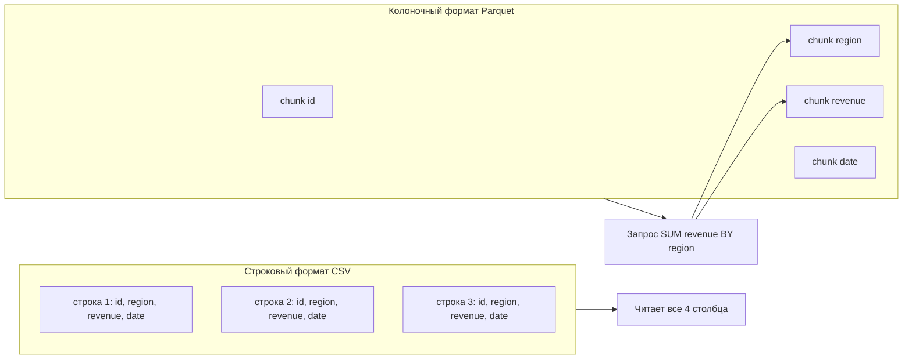

import ExternalPlayEmbed from '@site/src/components/ExternalPlayEmbed';


# Parquet и ORC

<ExternalPlayEmbed example="data-markup/parquet-column-play" title="Parquet — колоночное хранение" minHeight={480} />


<div class="article-tags">
  <span class="tag tag-required">ОБЯЗАТЕЛЬНО</span>
  <span class="tag tag-beginner">ДЛЯ НОВИЧКОВ</span>
</div>

<span class="complexity-badge">Разработчику</span>
<span class="complexity-badge">Аналитику</span>
<span class="complexity-badge">Архитектору</span>
<span class="complexity-badge">Инженеру</span>

---

## Parquet и ORC

### Колоночное хранение

Обычный [CSV](./219.md) и строка в [SQL](/encyclopedia/3-data-markup/3-07-sql/intro) хранят данные **по строкам** — сначала вся первая запись, потом вторая. **Колоночный** формат хранит значения **по столбцам** — все значения колонки `region` подряд, потом все `revenue`.

Это ускоряет типичную аналитику, когда из таблицы с тремястами столбцов нужны три:

- чтение с диска берёт только нужные колонки
- однотипные значения лучше сжимаются
- агрегации (`SUM`, `GROUP BY`) работают быстрее на больших объёмах

★ **Apache Parquet** и **Apache ORC** (Optimized Row Columnar) — **бинарные** колоночные форматы. Файл нельзя прочитать в блокноте; нужны Spark, Pandas с `pyarrow`, DuckDB, Hive и т.п.

Внутри файла лежит **схема** — имена и типы столбцов. Отдельный файл-словарь для импорта не нужен, как иногда бывает с CSV.

Применение:

- **Data Lake** и **DWH** (хранилища больших данных)
- пайплайны [ETL/ELT](/encyclopedia/3-data-markup/3-11-analiz-dannyh/425)
- [Spark](https://spark.apache.org/), Hive, ClickHouse, DuckDB, BigQuery

Обзор масштаба — [Big Data](/encyclopedia/3-data-markup/3-11-analiz-dannyh/11). Компактный обмен в API — [MessagePack, Protobuf](./216.md).

---

### Строки и столбцы на диске

Представьте таблицу из трёх строк и четырёх столбцов:

| id | region | revenue | date |
|----|--------|---------|------|
| 1 | Москва | 1000 | 2025-06-01 |
| 2 | Казань | 800 | 2025-06-02 |
| 3 | Москва | 1200 | 2025-06-03 |

**Row-oriented** (строковое хранение, как CSV) записывает на диск **целые строки подряд**:

```text
1,Москва,1000,2025-06-01 | 2,Казань,800,2025-06-02 | 3,Москва,1200,2025-06-03
```

Запрос `SELECT SUM(revenue) GROUP BY region` всё равно читает **все** столбцы каждой строки — лишние `id` и `date` попадают в память.

**Column-oriented** (колоночное хранение, Parquet/ORC) группирует значения **по столбцам**:

```text
id:      [1, 2, 3]
region:  [Москва, Казань, Москва]
revenue: [1000, 800, 1200]
date:    [2025-06-01, 2025-06-02, 2025-06-03]
```

Движок читает только `region` и `revenue` — остальное не трогает.



На практике внутри Parquet данные ещё разбиты на **row groups** (горизонтальные полоски строк), но **внутри каждой группы** значения одного столбца лежат рядом — отсюда выигрыш по сжатию и по I/O.

---

### Parquet

**Parquet** — самый частый выбор в облачной аналитике и в стеке Python (Pandas, Polars, PyArrow).

Устройство файла (упрощённо):

- файл разбит на **row groups** — горизонтальные блоки строк (обычно 128–256 МБ несжатых данных)
- внутри row group — **column chunks** со сжатием Snappy, ZSTD или GZIP
- метаданные и схема — в конце файла (**footer**)
- можно читать только выбранные столбцы, не весь файл

Запись и чтение в Python:

```python
import pandas as pd

df = pd.read_csv("sales.csv", encoding="utf-8-sig", sep=";")
df.to_parquet("sales.parquet", engine="pyarrow", compression="snappy")

df2 = pd.read_parquet("sales.parquet", columns=["region", "revenue"])
```

**DuckDB** выполняет SQL прямо по файлу на диске:

```sql
SELECT region, SUM(revenue) AS total
FROM 'sales.parquet'
GROUP BY region;
```

Сравнение с pandas и SQL — [напоминалка Pandas / Polars / SQL](/encyclopedia/3-data-markup/3-11-analiz-dannyh/426).

---

### Footer и метаданные

Parquet-файл устроен так, что **схема и статистика лежат в конце** (footer), а не в начале, как в CSV с заголовком.

```text
[ Row Group 0: column chunks ... ]
[ Row Group 1: column chunks ... ]
[ Row Group N: column chunks ... ]
[ Footer: schema, row group offsets, column statistics ]
[ 4 bytes: длина footer ]
[ 4 bytes: magic "PAR1" ]
```

**Footer в конце файла.** При записи потоком движок не знает заранее, сколько row groups получится. Он пишет данные, потом дописывает метаданные и длину footer. При чтении клиент **сначала читает хвост файла** (последние 8 байт), узнаёт длину footer, загружает схему и список row groups — и только потом обращается к нужным кускам.

В footer для каждого column chunk часто хранятся:

- минимум и максимум значений (для чисел и дат)
- количество NULL
- кодировка (plain, dictionary, RLE)

Эта статистика питает **predicate pushdown** — см. ниже.

Просмотреть метаданные без Python:

```bash
parquet-tools meta sales.parquet
parquet-tools schema sales.parquet
```

Утилита **parquet-tools** (Java) или **parquet-cli** — стандартный способ заглянуть внутрь бинарного файла. В экосистеме Arrow есть также `parquet-dump-arrow` и встроенные команды в DuckDB (`DESCRIBE SELECT * FROM 'file.parquet'`).

---

### Кодеки сжатия

Сжатие в Parquet работает **на уровне column chunk**, а не всего файла целиком. Один и т же файл может теоретически использовать разные кодеки для разных столбцов, хотя на практике чаще один кодек на весь файл.

| Кодек | Скорость записи | Скорость чтения | Степень сжатия | Типичное применение |
|-------|-----------------|-----------------|----------------|---------------------|
| **Snappy** | очень быстро | быстро | средняя | дефолт в Spark и многих пайплайнах |
| **ZSTD** | быстро | быстро | высокая | cold storage, архивы, когда диск дороже CPU |
| **GZIP** | медленнее | медленнее | высокая | совместимость со старыми системами |
| **LZ4** | очень быстро | очень быстро | ниже Snappy | realtime ingest, когда latency важнее места |
| **Brotli** | медленно | средне | очень высокая | редко в Parquet; чаще в веб |
| **uncompressed** | — | — | нет | отладка, уже сжатые payload (JPEG внутри binary) |

Выбор кодека — компромисс **место на диске ↔ CPU при чтении/записи**:

```python
# Pandas + PyArrow
df.to_parquet("sales_snappy.parquet", compression="snappy")
df.to_parquet("sales_zstd.parquet", compression="zstd")
df.to_parquet("sales_gzip.parquet", compression="gzip")
```

```python
# PySpark при записи
df.write.parquet("output/", compression="snappy")
df.write.option("compression", "zstd").parquet("output_zstd/")
```

**Snappy** почти не сжимает текстовые столбцы с уникальными UUID, но отлично работает на повторяющихся категориях (`region`, `status`). **ZSTD** часто даёт на 20–40% меньший файл при сопоставимой скорости на современных CPU — его всё чаще ставят дефолтом в новых lakehouse-платформах.

Parquet также применяет **кодирование значений** до сжатия:

- **Dictionary encoding** — если в столбце мало уникальных строк, хранят словарь и индексы
- **RLE / bit-packing** — для повторяющихся чисел и boolean

Именно сочетание однотипных значений подряд, dictionary encoding и Snappy/ZSTD даёт файлы в 5–20 раз меньше CSV на реальных датасетах.

---

### Apache Arrow и Parquet

**Apache Arrow** — не формат файла на диске, а **in-memory** представление табличных данных (columnar format в RAM). **Parquet** — формат **на диске**. Они дополняют друг друга:

```text
CSV / JSON  --read-->  Arrow Table (RAM)  --write-->  Parquet
Parquet     --read-->  Arrow Table (RAM)  --compute-->  результат
```

**PyArrow**, **Polars**, **DuckDB**, **Pandas 2.x** (через PyArrow backend) используют Arrow внутри:

```python
import pyarrow.parquet as pq

table = pq.read_table("sales.parquet", columns=["region", "revenue"])
# table — pyarrow.Table, колонки в памяти как Arrow arrays

df = table.to_pandas()  # zero-copy или почти zero-copy
```

```python
import polars as pl

lf = pl.scan_parquet("sales/*.parquet")  # lazy, читает только нужное
result = lf.filter(pl.col("year") == 2026).group_by("region").agg(pl.col("revenue").sum())
```

Arrow задаёт **единые типы** (`int64`, `utf8`, `timestamp[us]`) между Python, R, Spark и Rust. Parquet хранит схему, совместимую с Arrow — поэтому конвертация Parquet → Arrow быстрая.

**Flight** и **Arrow IPC** — протоколы передачи Arrow-таблиц по сети между процессами; Parquet остаётся форматом долговременного хранения в S3/HDFS.

Подробнее о типах в памяти — [структуры данных](/encyclopedia/3-data-markup/3-02-struktury-dannyh/2.md). Оценка объёма — [пакетная работа](/encyclopedia/3-data-markup/3-11-analiz-dannyh/433).

---

### Schema evolution (эволюция схемы)

В живом lake датасет **меняется со временем**: добавили столбец `campaign_id`, переименовали `rev` → `revenue`, поменяли `int32` на `int64`.

Parquet поддерживает **эволюцию схемы** на уровне чтения, если соблюдать правила:

| Изменение | Обычно безопасно | Риск |
|-----------|------------------|------|
| Добавить новый столбец | да — старые файлы без столбца дают NULL | нужна единая логика в ETL |
| Удалить столбец | да при чтении — столбец игнорируется | старые отчёты сломаются |
| Переименовать столбец | **нет** — для Parquet это удаление + добавление | нужна миграция или view в SQL |
| Сузить тип (`int64` → `int32`) | **нет** | ошибка или потеря данных |
| Расширить тип (`int32` → `int64`) | часто да через promotion | проверьте движок |

В **Spark** явная схема при записи предотвращает плавающие типы:

```python
from pyspark.sql.types import StructType, StructField, StringType, DoubleType, IntegerType

schema = StructType([
    StructField("region", StringType(), False),
    StructField("revenue", DoubleType(), True),
    StructField("year", IntegerType(), False),
])

df.write.schema(schema).mode("append").parquet("sales/")
```

При **append** новых файлов в ту же папку Spark/Hive/Delta проверяют совместимость схем. Для строгого контроля используют **Delta Lake**, **Iceberg** или **Hudi** — они добавляют transaction log поверх Parquet; базовая идея эволюции та же.

**mergeSchema** в Spark (осторожно в проде):

```python
df.write.option("mergeSchema", "true").mode("append").parquet("sales/")
```

Практика для bronze/silver слоёв — **не переименовывать** столбцы в сырых файлах; переименование делать в SQL-трансформации silver.

---

### Predicate pushdown

**Predicate pushdown** (проталкивание фильтра) — оптимизация, когда условие `WHERE revenue > 1000` **не читает** row groups и column chunks, где по статистике footer **точно нет** подходящих значений.

```sql
-- DuckDB / Spark SQL
SELECT region, SUM(revenue)
FROM 'sales.parquet'
WHERE year = 2026 AND revenue > 500
GROUP BY region;
```

Цепочка:

1. Читатель открывает footer, видит min/max `year` и `revenue` по каждому row group
2. Row group, где max(`year`) = 2025, **пропускается** целиком
3. Внутри оставшихся groups читаются только столбцы `region`, `revenue`, `year`
4. Фильтр применяется к декодированным значениям

Pushdown **не заменяет** partition pruning по папкам — они работают вместе. Pushdown отсекает **внутри файла**, pruning — **целые файлы** по пути `year=2026/`.

Ограничения:

- если статистика устарела или отключена при записи, pushdown слабее
- фильтр по `LIKE '%ма'` не использует min/max
- вложенные типы (struct) поддерживаются не во всех движках одинаково

```python
# PyArrow — filters при чтении
import pyarrow.parquet as pq

table = pq.read_table(
    "sales.parquet",
    columns=["region", "revenue", "year"],
    filters=[("year", "=", 2026), ("revenue", ">", 500)],
)
```

---

### Spark — чтение и запись

**Apache Spark** — типичный движок для batch-обработки Parquet в кластере.

Чтение:

```python
from pyspark.sql import SparkSession

spark = SparkSession.builder.appName("parquet-demo").getOrCreate()

sales = spark.read.parquet("s3://datalake/sales/")
# или локально
sales = spark.read.parquet("/data/sales/year=2026/")

sales.printSchema()
sales.filter("revenue > 1000").groupBy("region").sum("revenue").show()
```

Запись:

```python
(
    sales
    .repartition(4)  # 4 выходных файла (осторожно с мелкими файлами)
    .write
    .mode("overwrite")
    .partitionBy("year", "month")
    .parquet("/data/sales_curated/")
)
```

Параметры, которые стоит знать:

| Параметр | Смысл |
|----------|-------|
| `spark.sql.parquet.compression.codec` | snappy, gzip, zstd |
| `spark.sql.parquet.mergeSchema` | объединять схемы при чтении нескольких путей |
| `maxRecordsPerFile` | ограничить строк в одном файле |
| `coalesce(n)` / `repartition(n)` | число файлов на выходе |

**Мелкие файлы** (тысячи файлов по 100 КБ) убивают производительность listing в S3 и планирование задач. Целевой размер одного Parquet-файла — **128 МБ – 1 ГБ** несжатых или эквивалент после сжатия.

```python
# compact после ingest
spark.read.parquet("bronze/events/").coalesce(50).write.mode("overwrite").parquet("bronze/events_compact/")
```

Spark SQL напрямую:

```sql
CREATE TABLE sales USING PARQUET LOCATION 's3://datalake/sales/';
SELECT region, SUM(revenue) FROM sales WHERE year = 2026 GROUP BY region;
```

Связь с [ETL/ELT](/encyclopedia/3-data-markup/3-11-analiz-dannyh/425) и оркестрацией — Airflow, Dagster, dbt поверх тех же путей.

---

### Партиции каталога и partition pruning

В **Data Lake** один логический датасет — **папка** с множеством файлов:

```text
sales/
  year=2025/month=06/part-00001.parquet
  year=2025/month=06/part-00002.parquet
  year=2026/month=01/part-00001.parquet
  year=2026/month=02/part-00001.parquet
```

**Hive-style partitioning** — ключи `year=2026` в **имени папки**, не обязательно дублируются как столбцы в каждой строке (хотя Spark часто добавляет их как virtual columns).

**Partition pruning** — движок смотрит на путь и **не открывает** файлы из `year=2025/`, если в запросе `WHERE year = 2026`.

```sql
-- DuckDB
SELECT SUM(revenue) FROM read_parquet('sales/year=2026/*/*.parquet');

-- Spark
SELECT SUM(revenue) FROM sales WHERE year = 2026 AND month = 2;
```

Глубокий разбор:

**1. Pruning по пути vs фильтр по столбцу**

Если `year` есть только в пути, а в файле столбца `year` нет — pruning всё равно работает в Spark/Hive. Если `year` продублирован в данных, фильтр по столбцу + pruning дают двойную защиту.

**2. Слишком много мелких партиций**

Партиция `day=2026-06-14` с одним файлом 50 КБ × 365 дней = сотни мелких объектов в S3. Лучше партиционировать по **month** или **year**, а день фильтровать pushdown внутри файла.

**3. Partition columns в SELECT**

```python
# Spark — не забыть partition columns в схеме таблицы
spark.sql("""
  CREATE TABLE sales (
    region STRING,
    revenue DOUBLE
  )
  USING PARQUET
  PARTITIONED BY (year INT, month INT)
  LOCATION '/data/sales/'
""")
```

**4. Dynamic partition overwrite**

```python
spark.conf.set("spark.sql.sources.partitionOverwriteMode", "dynamic")
df.write.mode("overwrite").insertInto("sales")  # перезапишет только затронутые year/month
```

**5. DuckDB hive partitioning**

```python
import duckdb
duckdb.sql("""
  SELECT year, month, SUM(revenue)
  FROM read_parquet('sales/*/*/*.parquet', hive_partitioning=true)
  WHERE year >= 2026
  GROUP BY 1, 2
""")
```

Слои **bronze / silver / gold** — см. следующий раздел и [Data Warehouse, Lake, Mesh](/encyclopedia/3-data-markup/3-11-analiz-dannyh/11#data-warehouse-lake-mesh).

---

### Bronze, silver, gold в lake

Медальонная архитектура (medallion) — соглашение об **уровнях качества** данных в одном lake:

| Слой | Содержимое | Формат | Партиции |
|------|------------|--------|----------|
| **Bronze** | сырые события, как пришли из API/Kafka/CSV | Parquet, иногда JSON lines | по дате ingest |
| **Silver** | очистка типов, дедуп, join справочников | Parquet | по business date |
| **Gold** | витрины для BI, агрегаты | Parquet или таблицы DWH | по домену |

```text
s3://company-lake/
  bronze/events/dt=2026-06-14/part-00001.parquet
  silver/orders/date=2026-06-14/part-00001.parquet
  gold/daily_revenue_by_region/snapshot=2026-06-14/part-00001.parquet
```

**Bronze** — append-only, схема может плыть; `mergeSchema` или отдельные папки по версии API.

**Silver** — единая схема, NULL обработаны, ключи уникальны; здесь [очистка в Pandas](/encyclopedia/3-data-markup/3-11-analiz-dannyh/427) или Spark.

**Gold** — то, что читает Tableau / Metabase / внутренний дашборд; часто денормализованные широкие таблицы.

Parquet на всех трёх слоях — стандарт de facto: одни и те же инструменты (Spark, DuckDB, Trino), одно сжатие, pruning по дате.

---

### ORC

**ORC** — родственный колоночный формат. Исторически сильнее в экосистеме **Apache Hive** и части on-prem Hadoop-кластеров. Тоже сжимает данные и хранит схему внутри.

Структура ORC (упрощённо):

```text
[ Stripe 0: index + data streams по столбцам ]
[ Stripe 1: ... ]
[ Footer: schema, statistics, stripe locations ]
[ Postscript + footer length ]
```

**Stripe** в ORC ≈ **row group** в Parquet. ORC изначально проектировали под Hive **ACID**-транзакции и **vectorized** чтение в Tez/MR.

Расширенное сравнение:

| Критерий | Parquet | ORC |
|----------|---------|-----|
| Типичный стек | Spark, Arrow, облако, Databricks | Hive, Hadoop on-prem, часть Cloudera |
| Поддержка в облаке | S3, GCS, ADLS — native | есть, но реже default |
| Вложенные типы | struct, list, map — нативно в Arrow | struct, list, map — типы Hive |
| ACID upsert | через Delta/Iceberg/Hudi (Parquet base) | Hive ACID ORC (merging) |
| Сжатие по умолчанию | Snappy / Zstd | Zlib / Snappy / Zstd |
| Predicate pushdown | да, column statistics | да, bloom filters + stats |
| Bloom filters | опционально в Parquet 2.x | встроены для строковых столбцов |
| Скорость в Hive | хорошая через Tez | historically **лучше** на Hive |
| Скорость в Spark | **де facto standard** | поддерживается, но реже выбирают |
| Python pandas | `pyarrow`, first-class | через pyarrow/orc module, реже |
| Новый проект с нуля | **чаще Parquet** | если команда уже на Hive/ORC |
| ClickHouse, DuckDB | native read/write | ограниченная или read-only |

```python
# ORC в PySpark
df.write.format("orc").save("/data/hive_table/")
spark.read.orc("/data/hive_table/")
```

Для первого знакомства важнее понять **идею колоночного файла**, чем выбирать между Parquet и ORC. Оба выигрывают у [CSV](./219.md) на гигабайтах аналитики.

**Когда ORC оправдан**

- существующий Hive-warehouse с сотнями ORC-таблиц
- политика безопасности запрещает менять формат
- команда эксплуатации знает ORC tuning (stripe size, bloom filters)

**Когда мигрировать на Parquet**

- новый Spark-only pipeline без Hive metastore
- кросс-языковый стек (Rust, Go, Arrow)
- облачный lake без legacy Hadoop

---

### Инструменты

#### parquet-tools / parquet-cli

```bash
# Java parquet-tools
parquet-tools head -n 20 sales.parquet
parquet-tools schema sales.parquet
parquet-tools rowcount sales.parquet
parquet-tools dump sales.parquet --column revenue
```

Полезно при расследовании, почему Spark видит другой тип — schema в footer — источник правды.

#### DuckDB

Встраиваемая аналитическая SQL-СУБД. Читает Parquet локально и в S3 без кластера:

```sql
INSTALL httpfs;
LOAD httpfs;

SELECT *
FROM read_parquet('sales/**/*.parquet', hive_partitioning = true)
WHERE year = 2026
LIMIT 100;

COPY (
  SELECT region, SUM(revenue) AS total
  FROM 'sales.parquet'
  GROUP BY region
) TO 'summary.parquet' (FORMAT PARQUET, COMPRESSION ZSTD);
```

DuckDB — отличный способ **прототипировать** SQL-трансформации перед переносом в Spark. См. также [SQLite](/encyclopedia/3-data-markup/3-07-sql/887) для маленьких объёмов.

#### Polars

DataFrame-библиотека на Rust с lazy API:

```python
import polars as pl

q = (
    pl.scan_parquet("sales/year=2026/*.parquet")
    .filter(pl.col("revenue") > 1000)
    .group_by("region")
    .agg(pl.col("revenue").sum().alias("total"))
)
print(q.explain())  # план с pushdown
df = q.collect()
```

Polars агрессивно использует predicate и projection pushdown при scan Parquet.

#### Pandas + PyArrow

```python
import pandas as pd

pd.read_parquet("sales.parquet", engine="pyarrow", columns=["region"])
```

Для файлов больше RAM — `pyarrow.dataset` с batch iteration:

```python
import pyarrow.dataset as ds

dataset = ds.dataset("sales/", format="parquet", partitioning="hive")
for batch in dataset.to_batches(columns=["revenue"], filter=ds.field("year") == 2026):
    process(batch)
```

---

### Когда Parquet не подходит

Parquet — не универсальная замена всем форматам.

| Сценарий | Лучше альтернатива | Почему |
|----------|-------------------|--------|
| Обмен с бухгалтерией, Excel | [CSV](./219.md) | человек открывает в таблице |
| REST API, конфиг приложения | [JSON](./3.md) | текст, schema-on-read |
| Одна маленькая таблица на ноутбуке | CSV или [SQLite](/encyclopedia/3-data-markup/3-07-sql/887) | overhead метаданных Parquet |
| Потоковая запись событий по одной строке | Kafka, JSON lines | Parquet batch-oriented |
| Частые одиночные UPDATE строк | PostgreSQL, Delta/Iceberg | Parquet immutable files |
| Нужен full-text search по полю | Elasticsearch, OpenSearch | columnar не для inverted index |
| Картинки, PDF, бинарные blob | object storage as-is | Parquet для tabular |
| Latency &lt; 10 ms point lookup по PK | OLTP БД | Parquet scan-oriented |
| 5 строк для unit-теста | inline JSON в тесте | не тащить parquet-tools в CI |

**Immutable files** — ключевая идея. Parquet-файл после записи **не патчат** на месте; обновление = перезапись файла или новая версия в Delta/Iceberg.

**Много мелких случайных записей** — Parquet неудобен; накапливайте batch в буфере, flush раз в N минут или M мегабайт.

---

### Когда какой формат

| Задача | Формат |
|--------|--------|
| Отчёт в Excel, обмен с бухгалтерией | [CSV](./219.md) |
| REST API, конфиг приложения | [JSON](./3.md) |
| Датасет от ~100 МБ, много агрегаций и ML | **Parquet** |
| Архив сырых событий в lake | Parquet или ORC + разбиение по дате |
| Одна маленькая таблица на ноутбуке | CSV или SQLite достаточно |
| Feature store для ML offline | Parquet |
| Логи приложения в реальном времени | JSON lines → bronze Parquet batch |

Жёсткого порога "pandas уже не тянет" нет — смотрите на объём RAM, время `read_csv` и сколько раз вы проходите по файлу. Подсказки — [пакетная работа](/encyclopedia/3-data-markup/3-11-analiz-dannyh/433).

---

### Практический пайплайн CSV → Parquet

```python
import pandas as pd
import pyarrow as pa
import pyarrow.parquet as pq

# 1. Загрузка с явными типами
df = pd.read_csv(
    "raw/sales.csv",
    encoding="utf-8-sig",
    sep=";",
    dtype={"order_id": "Int64", "region": "string"},
    parse_dates=["order_date"],
)

# 2. Очистка
df = df.dropna(subset=["order_id", "revenue"])
df["revenue"] = pd.to_numeric(df["revenue"], errors="coerce")

# 3. Партиционированная запись через PyArrow
table = pa.Table.from_pandas(df)
pq.write_to_dataset(
    table,
    root_path="lake/silver/sales",
    partition_cols=["year", "month"],
    compression="zstd",
    existing_data_behavior="overwrite_or_ignore",
)
```

Проверка:

```python
import duckdb
duckdb.sql("SELECT COUNT(*) FROM 'lake/silver/sales/**/*.parquet'").show()
```

---

### Типичные ошибки

| Ошибка | Что сделать |
|--------|-------------|
| Файл не открывается в блокноте | Parquet бинарный — DuckDB, Arrow, Spark |
| Типы столбцов разъехались после склейки | Единая схема при записи; явный `schema` в Spark |
| CSV сконвертировали без очистки | Сначала типы и NULL — [очистка в Pandas](/encyclopedia/3-data-markup/3-11-analiz-dannyh/427) |
| Один гигантский файл | Разбить по партициям; row group порядка 128–256 МБ |
| Тысячи файлов по 50 КБ | `coalesce` / compact job |
| Переименовали столбец в новых файлах | VIEW с alias или миграция silver |
| `int`/`float` путаются между batch | Явный schema, не полагаться на inference |
| Snappy плохо сжимает UUID-столбец | Ожидаемо; вынести в отдельный файл или нормализовать |
| Pruning не работает | Проверьте hive paths и `hive_partitioning=true` |
| ORC не читается в Polars | Конвертируйте через Spark или pyarrow |

---

### ClickHouse и другие движки

**ClickHouse** читает Parquet из S3/HDFS natively:

```sql
SELECT region, sum(revenue)
FROM s3('https://bucket/sales/*.parquet', 'Parquet')
WHERE year = 2026
GROUP BY region;
```

**Trino/Presto** — federated SQL по каталогу:

```sql
SELECT * FROM hive.default.sales WHERE dt = '2026-06-14';
```

**BigQuery** — external tables over Parquet in GCS.

**Pandas 2.x** — optional PyArrow backend для zero-copy handoff в ML (scikit-learn, PyTorch dataloaders через `to_numpy()` на Arrow arrays).

---

### Безопасность и governance

Parquet-файл в публичном bucket **раскрывает схему** любому, кто скачает footer — не храните секреты в именах столбцов.

**Column-level encryption** — Parquet modular encryption (редко в small teams); чаще шифрование bucket (SSE-S3) + IAM.

**Lineage** — OpenLineage/Marquez отслеживают путь CSV → bronze Parquet → gold.

**PII** — маскируйте в silver; bronze может содержать сырые персональные данные с ограниченным ACL.

---

### Упражнения

**1. Row vs column**

Скачайте sample CSV ~50 МБ (например, публичный датасет продаж). Засеките:

```python
import time
import pandas as pd

t0 = time.perf_counter()
df = pd.read_csv("big.csv", usecols=["region", "amount"])
print("CSV partial:", time.perf_counter() - t0)

df.to_parquet("big.parquet", compression="snappy")

t0 = time.perf_counter()
df2 = pd.read_parquet("big.parquet", columns=["region", "amount"])
print("Parquet partial:", time.perf_counter() - t0)
```

Сравните размер файлов на диске.

**2. Кодеки**

Запишите один DataFrame в три файла (`snappy`, `zstd`, `gzip`). Таблица: размер MB, время записи, время чтения.

**3. Footer**

Установите `parquet-tools` или используйте DuckDB `DESCRIBE`. Найдите min/max для числового столбца в metadata.

**4. Partition pruning**

Создайте структуру папок `demo/year=2025/` и `demo/year=2026/` с Parquet внутри. Запрос в DuckDB с `hive_partitioning` — убедитесь через `EXPLAIN`, что читается одна ветка.

**5. Spark local**

```python
spark.read.parquet("demo/").filter("year = 2026").explain()
```

Найдите в плане `PartitionFilters` или `PushedFilters`.

**6. Schema evolution**

Запишите два файла — во втором добавьте столбец `notes`. Прочитайте оба одним `read_parquet('demo/*.parquet')` в Pandas. Что в `notes` для строк из первого файла?

**7. Bronze → silver**

Возьмите грязный CSV с пропусками и дубликатами. Очистите в pandas, запишите в `silver/` с партицией по month. Документируйте схему в комментарии SQL для DuckDB.

**8. Когда не Parquet**

Для каждого сценария (чат-приложение, Excel-отчёт, ML training 10 GB, конфиг nginx) выберите формат и опишите одним предложением.

---

### Связанные материалы

- [CSV](./219.md) · [JSON](./3.md) · [бинарные форматы](./216.md)
- [ETL/ELT](/encyclopedia/3-data-markup/3-11-analiz-dannyh/425)
- [Python для анализа](/encyclopedia/3-data-markup/3-11-analiz-dannyh/424)
- [Big Data и lake](/encyclopedia/3-data-markup/3-11-analiz-dannyh/11)
- [SQL — о разделе](/encyclopedia/3-data-markup/3-07-sql/intro)

---
