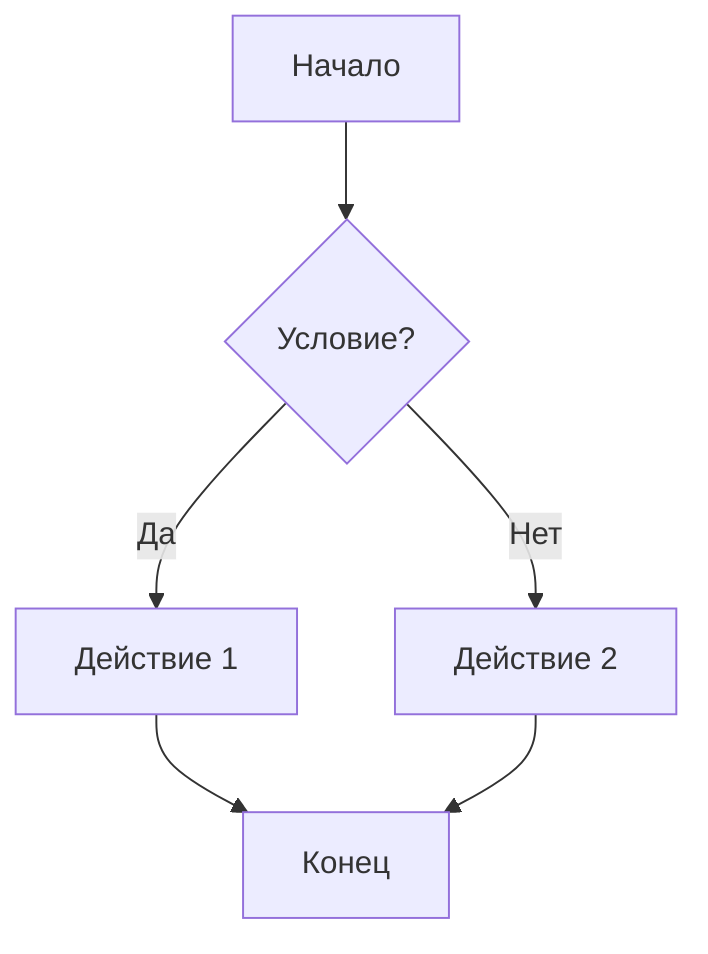

import MarkdownLivePlay from '@site/src/components/MarkdownLivePlay';

# Markdown

<div class="article-tags">
  <span class="tag tag-required">ОБЯЗАТЕЛЬНО</span>
  <span class="tag tag-beginner">ДЛЯ НОВИЧКОВ</span>
</div>

<span class="complexity-badge">Разработчику</span>
<span class="complexity-badge">Аналитику</span>
<span class="complexity-badge">Тестировщику</span>  
<span class="complexity-badge">Архитектору</span>
<span class="complexity-badge">Инженеру</span>
<span class="complexity-badge">Техническому писателю</span>

---

## Markdown (MD)

> **Важно для раздела "Конфигурации и данные":** Markdown — язык **разметки документов** (README, wiki, эта энциклопедия), а не формат для `appsettings` или API. Настройки приложения хранят в [JSON](./3.md), [YAML](./4.md) или [XML](./2.md); см. [вводную главу](./1.md).

★ **Markdown** - легковесный язык разметки, созданный для форматирования текста. Он позволяет писать простой и читаемый текст, который легко преобразуется в HTML или другие форматы (например, PDF). Этот язык был разработан Джоном Грубером в 2004 году с целью упростить написание структурированного текста. Исходный текст можно понять даже без преобразования, и нет необходимости учить сложные разметки, вроде HTML.

★ **Элементы Markdown**

Заголовки создаются с помощью символа #. Чем больше #, тем меньше уровень заголовка:

```markdown
# Заголовок 1
## Заголовок 2
### Заголовок 3

```

Итог:

# Заголовок 1

## Заголовок 2

### Заголовок 3

<MarkdownLivePlay />

Выделение текста:
Жирный текст - две звёздочки или два подчёркивания:

```markdown
**Жирный текст**
__Жирный текст__

```

Курсив - одна звёздочка (*) или одно подчёркивание (_):
```markdown
*Курсив*
_Курсив_

```
Жирный курсив - три звёздочки (***) или три подчёркивания (___):
```markdown
***Жирный курсив***
___Жирный курсив___

```

Списки могут быть нумерованными:
```markdown
1. Первый пункт
2. Второй пункт
3. Третий пункт

```

Маркированными:
```markdown
- Первый пункт
- Второй пункт
- Третий пункт

```

Вложенными:
```markdown
- Пункт 1
  - Подпункт 1.1
  - Подпункт 1.2

```

Ссылки создаются при помощи квадратных скобок `[текст]` и круглых скобок (URL):

```markdown
[GitHub](https://github.com )
```

Изображения добавляются с помощью восклицательного знака !, квадратных скобок `[alt-текст]` и круглых скобок (URL):
```markdown

```

Цитаты создаются с помощью символа >:
```markdown
> Это цитата.
```

Встроенный код оформляется через одинарные апострофы:
```markdown
Используйте команду `ls` для просмотра файлов.
```
Блок кода встраивается через три обратных апострофа.

Таким образом, Markdown поддерживает заголовки, списки, блоки текста, кодовые блоки, ссылки и изображения. Где же он применяется?

Ниже в статье — **расширенный справочник** (таблицы, GFM, Docusaurus): его удобно держать под рукой при вёрстке документации; для первого знакомства достаточно блока до раздела "Справочник Markdown".

Главное, с чем сталкивается любой айтишник - README-файлы на GitHub. Файл README.md является стандартом, содержащим описание программы или проекта. Там же можно найти и лучшую документацию по этому формату:

https://docs.github.com/ru/get-started/writing-on-github/getting-started-with-writing-and-formatting-on-github/basic-writing-and-formatting-syntax

Также MD используется в документации API, руководствах пользователя. Словом, не всё оформляется через Word - есть более изящные и простые решения.

---

## Справочник Markdown

## Базовый синтаксис и блочные элементы

### 1.1. Заголовки (ATX-стиль, рекомендуемый)

````markdown
# Заголовок 1 уровня
## Заголовок 2 уровня
### Заголовок 3 уровня
#### Заголовок 4 уровня
##### Заголовок 5 уровня
###### Заголовок 6 уровня

Альтернативный стиль (Setext, устаревший, ограничен 2 уровнями):
Заголовок 1 уровня
===================

Заголовок 2 уровня
-------------------
````

> **Примечание**: В Docusaurus и большинстве генераторов документации рекомендуется использовать только ATX-стиль (`#`).  
> Пробел после `#` обязателен для соответствия CommonMark.  
> Заголовки автоматически генерируют якоря (`#заголовок-1-уровня`) в большинстве реализаций.

---

### 1.2. Абзацы и разрывы строк

````markdown
Обычный абзац — одна или несколько строк текста, разделённых пустыми строками.

Чтобы принудительно вставить разрыв строки (без нового абзаца),  
добавьте два или более пробела в конце строки  
и перейдите на новую строку.

Или используйте HTML-тег `<br>`:  
Это первая строка<br>Это вторая строка
````

> **Важно**: Одиночный перевод строки без завершающих пробелов игнорируется.  
> В Docusaurus по умолчанию `commonmark`-совместимое поведение.

---

### 1.3. Горизонтальные разделители (линии)

````markdown
***
---
___
````

Все три варианта эквивалентны. Должны состоять из трёх и более символов (`*`, `-`, `_`), с необязательными пробелами между ними:

````markdown
* * *
- - - -
_ _ _ _ _
````

> Результат — `<hr>` в HTML.

---

### 1.4. Цитаты (блоки `>`)

````markdown
> Простая цитата.

> Многострочная цитата  
> может занимать несколько строк.

> Вложенная цитата:
> > Уровень 2
> >
> > > Уровень 3

> Цитата с другим Markdown внутри:
> - Пункт списка в цитате
> 1. Нумерованный пункт в цитате
> ```python
> print("Код в цитате")
> ```
````

> Пробел после `>` не обязателен по спецификации, но рекомендуется для читаемости.

---

### 1.5. Списки

#### Ненумерованные (маркированные)

````markdown
- Элемент
* Альтернативный маркер
+ Ещё альтернатива

- С вложенным списком:
  - Вложенный элемент
    - Ещё глубже (4 пробела или 2 табуляции)
  - Второй вложенный
- Следующий элемент верхнего уровня

- С абзацем внутри элемента:

  Это уже отдельный абзац в том же пункте списка.  
  Важно: отступ ≥4 пробелов (или 1 таб) относительно маркера.

- С кодом внутри:
  ```js
  console.log("Вложенный блок кода");
  ```
````

---

#### Нумерованные

````markdown
1. Первый
2. Второй
3. Третий

Но порядковые номера не важны — рендерится всегда по порядку:
9. Первый (отобразится как 1.)
1. Второй (отобразится как 2.)

С вложенными:
1. Основной
   1. Вложенный (отступ 3+ пробела)
   2. Ещё один
2. Следующий основной

С разрывом и абзацем:
1. Пункт

   Это абзац внутри пункта (отступ ≥4 пробелов).

   > Цитата внутри пункта списка.
````

> **Правило отступов**:  
> - Для вложенного блока (абзац, цитата, код, список) — **минимум 4 пробела или 1 таб** относительно начала текста *после маркера*.  
> - Для вложенного списка — **3+ пробела** после маркера родительского элемента.

---

### 1.6. Задачи (GFM Task Lists)

````markdown
- [x] Выполнено
- [ ] Невыполнено
- [ ] Частично выполнено (визуально — как невыполнено, но можно ставить `[-]`, нестандартно)
````

> Поддерживается в GitHub, GitLab, Docusaurus (с `remark-gfm`), VS Code.  
> HTML-рендер: `<input type="checkbox" disabled checked>`.

---

### 1.7. Код

#### Инлайн-код

````markdown
Используйте `const`, `let`, `var` в JavaScript.

Экранирование обратного апострофа: `` Используйте `` ` `` внутри ``.
Для нескольких ``: ``` Используйте ```triple``` внутри ```.
````

---

#### Блочный код (fenced code blocks, GFM)

````markdown
```js
function greet(name) {
  return `Hello, ${name}!`;
}
```

```python
def fib(n):
    a, b = 0, 1
    for _ in range(n):
        yield a
        a, b = b, a + b
```

```sql
SELECT id, name
FROM users
WHERE active = true;
```

Можно без указания языка:
```
plain text block
```
````

> Поддерживаемые языки зависят от синтаксического анализатора и подсветки (Prism, Highlight.js и др.).  
> Docusaurus использует Prism — [список поддерживаемых языков](https://prismjs.com/#supported-languages).

---

#### Отступной блочный код (устаревший, избыточный)

````markdown
    Это блок кода.
    Каждая строка отступает 4+ пробелами (или 1 таб).
    
        Вложенность через 8+ пробелов.
````

> Не рекомендуется — fenced blocks (` ``` `) предпочтительнее: поддерживают указание языка, более читаемы.

---

### 1.8. Таблицы (GFM)

````markdown
| Лево | Центр | Право |
|------|:-----:|------:|
| Текст | Текст | Текст |
| `код` | **жирный** | *курсив* |
| [ссылка](#) |  | ~~зачёркнутый~~ |

Можно опускать крайние `|`, но лучше не делать:
Лево | Центр | Право
-----|:-----:|-----:

Минимальная таблица (1 столбец, 1 строка):
| Колонка |
|---------|
| Данные  |

Пустые ячейки:
| A | B | C |
|---|---|---|
| x |   | z |
````

> Спецификация:  
> - Вторая строка — разделительная (`-`, `:`, `|`).  
> - `:` слева/справа задаёт выравнивание: `:---` (left), `:---:` (center), `---:` (right).  
> - Табличные ячейки поддерживают весь инлайн-Markdown (кроме блочных элементов).

> **Ограничение**: В чистом CommonMark таблиц нет. Поддержка требует расширения (GFM, `remark-gfm`).

---

### 1.9. Форматирование текста (инлайн)

````markdown
*Курсив* или _Курсив_  
**Жирный** или __Жирный__  
***Жирный курсив*** или ___Жирный курсив___  
~~Зачёркнутый~~ (GFM, `remark-gfm`)  
`Инлайн-код`  
[some text](https://example.com)  
[ссылка с title](https://example.com "Опциональный title")  
  
<https://auto.link> — автоссылка  
<user@example.com> — автопочта (рендерится как `mailto:`)  
````

> **Гнездование** (nested emphasis):  
> - `***text***` → `<em><strong>text</strong></em>`  
> - `**_text_**` → `<strong><em>text</em></strong>`  
> - Работает, если граничные символы не "слипаются" без пробелов (`**strong _em_**` — валидно; `**strong_em_**` — не валидно).

---

### 1.10. Экранирование

````markdown
\* Не курсив  
\` Не код  
\# Не заголовок  
\| В таблице, если нужно буквальное `|`: \|  
\{ \} \[ \] \( \) \. \! \* \+ \-  
\\ — обратный слэш
````

> Экранируются следующие символы: `\` ` ` `*` `_` `{` `}` `[` `]` `(` `)` `#` `+` `-` `.` `!` `|`  
> Не экранируются: `<`, `>`, `/`, `&`, `;`, `=`, `:`, `"` и др.

> Внутри инлайн-кода (` `) экранирование **не работает** — всё содержимое выводится буквально.

---

## Расширенный синтаксис, совместимость и инструменты

### 2.1. Ссылки — типы и расширения

#### Базовые ссылки

````markdown
[Внешняя](https://example.com)  
[Внутренняя](/docs/guide/intro) — относительно корня сайта (в Docusaurus)  
[Якорь](#заголовок-3-уровня) — относительно текущей страницы  
[Якорь — другая страница](/docs/guide/intro#установка)  

[С title](https://example.com "Подсказка при наведении")  
[Пустой title](https://example.com "") — валидно, но не рекомендуется
````

---

#### Ссылки-ссылки (reference-style links)

````markdown
Это [ссылка на проект][proj], а это [ещё одна][proj].

[proj]: https://github.com/user/repo "Официальный репозиторий"
[proj2]: /docs/about
````

> Плюсы: удобство при множественном использовании одной ссылки, улучшенная читаемость исходника.  
> Минусы: не поддерживаются в некоторых реализациях (например, базовый Remark без плагинов), сложнее отладка.  
> Docusaurus + `remark-parse` — поддерживает.

---

#### Автоматические ссылки

````markdown
<https://example.com> → <a href="https://example.com">https://example.com</a>  
<user@example.org> → <a href="mailto:user@example.org">user@example.org</a>
````

> Спецификация CommonMark: только для URL и email. Не для `ftp://`, `tel:`, `sms:` — их нужно писать явно: `[звонок](tel:+79991234567)`.

---

#### Якоря и идентификаторы (GFM, Docusaurus)

````markdown
### Заголовок с кастомным ID \{#custom-id\}

Теперь можно ссылаться: [сюда](#custom-id)

В Docusaurus также поддерживается синтаксис:
### Заголовок <!-- ID: custom-id-2 -->

Или через HTML:
<h3 id="custom-id-3">Заголовок</h3>
````

> По умолчанию якоря формируются автоматически:  
> - Пробелы → `-`  
> - Приведение к нижнему регистру  
> - Удаление знаков препинания (оставляются `-`, `_`)  
> - Дубликаты: `#заголовок`, `#заголовок-1`, `#заголовок-2` и т.д.

---

### 2.2. Изображения

````markdown
  
  

Размеры (не в Markdown, но часто требуется — через HTML):


В Docusaurus можно использовать компонент `@theme/Img` или `import Image from '@theme/IdealImage'`, но в Markdown-файлах — только `` или ссылка.

Для адаптивных изображений (ретина и др.):
  

→ Работает в GitHub README и Docusaurus (при настройке `imageRendering`).
````

> **Рекомендация**:  
> - Всегда указывайте содержательный `alt` — для доступности и SEO.  
> - Избегайте абсолютных путей (`https://...`) для локальных изображений — используйте относительные (`./`, `/static/`, `/img/`).  
> - В Docusaurus изображения кладутся в `static/` или обрабатываются через `@docusaurus/plugin-content-docs` (копируются в `build/.../assets/`).

---

### 2.3. Сноски (footnotes)

#### GFM-style (поддержка в Docusaurus с `remark-gfm`)

````markdown
Текст с сноской[^1].

[^1]: Это содержимое сноски. Может включать **Markdown**, `код`, [ссылки](#).

Вторая сноска[^note].

[^note]: Именованная сноска. Имя — любой идентификатор без пробелов.
````

> Рендерится как `<sup id="fnref:1"><a href="#fn:1">1</a></sup>` и список внизу страницы.

---

#### Pandoc-style (более мощный, но не в GFM)

````markdown
Текст[^pandoc].

[^pandoc]:
    Многострочная сноска.  
    Может содержать:

    - Списки
    - ```js
      код
      ```
    - Целые абзацы.
````

> Docusaurus не поддерживает Pandoc-стиль "из коробки". Для него нужен `remark-footnotes` (настраиваемый).

> **Важно**: Сноски — блочные элементы. Должны быть отделены пустыми строками.

---

### 2.4. HTML-вставки

````markdown
<!-- Комментарий (не отображается) -->

<span style="color:red">Красный текст</span>  
<div class="warning">⚠️ Это HTML-блок</div>

Блочные HTML-элементы (div, table, pre, script, style и др.) терминируют текущий Markdown-контекст:
<div markdown="1">  
Текст **внутри** div может содержать *Markdown*, если указан атрибут `markdown="1"` (не во всех парсерах).
</div>

Но:
<span>**жирный**</span> → **жирный** не сработает (инлайн-HTML не парсит содержимое по умолчанию).
````

> **Безопасность**:  
> - Многие рендереры (например, GitHub) фильтруют `<script>`, `<style>`, `on*` атрибуты.  
> - Docusaurus по умолчанию **не фильтрует** — уязвимость XSS возможна при ненадёжных источниках.  
> - Для публичных проектов используйте `rehype-sanitize`.

> **Рекомендация в документации**:  
> - Минимизируйте HTML. Предпочтительнее использовать расширения (admonitions, tabs).  
> - Если нужно — выносите в отдельные компоненты React (`<Details>`, `<Tabs>` и т.д. в Docusaurus).

---

### 2.5. Расширения Docusaurus (не чистый Markdown, но критичны для "Вселенной IT")

#### Admonitions (предупреждения/заметки)

````markdown
:::note Заметка (по умолчанию)
Содержимое блока. Поддерживает **весь** Markdown.
:::

:::tip Совет
Полезный лайфхак.
:::

:::info Информация
Общие сведения.
:::

:::caution Внимание
Осторожно: возможны побочные эффекты.
:::

:::danger Опасно
Не делайте этого в продакшене!
:::

Кастомный тип:
:::my-plugin-custom
Любой текст.
:::
````

> Требует `@docusaurus/plugin-content-docs` и `remark-admonitions` (включено по умолчанию).  
> Можно настраивать CSS-классы и значки.

#### Вкладки (Tabs)

````markdown

import Tabs from '@theme/Tabs';
import TabItem from '@theme/TabItem';

<Tabs>
<TabItem value="js" label="JavaScript">

```js
console.log("JS");
```

</TabItem>
<TabItem value="py" label="Python">

```python
print("Python")
```

</TabItem>
</Tabs>
````

> Альтернатива — `remark-plugin-tabs` (если не хотите импортов в Markdown).  
> Поддерживают синхронизацию (например, выбор ОС влияет на все блоки с `sync=true`).

#### Код с подсветкой строк и заголовками

````markdown
```js {2,4-5} title="src/index.js"
function main() {
  console.log("Эта строка подсвечена");
  const x = 1;
  return x * 2; // эти две — тоже
}
```
````

> Поддерживается в Docusaurus через Prism.  
> Синтаксис: `{номера строк}` после языка. Диапазоны через `-`, перечисление через `,`.

#### Mermaid (диаграммы)

````markdown

````

> Требует включения `@docusaurus/plugin-content-docs` с `remark-mermaid` или `@docusaurus/theme-mermaid`.  
> Поддерживаемые типы: flowchart, sequence, class, state, erDiagram, pie, gantt и др.

#### Кастомные компоненты (React)

````markdown

import Details from './\_components/Details';

<Details title="Как это работает?">
Разверните, чтобы увидеть объяснение.
</Details>
````

> Файлы `_components/Details.js` кладутся в ту же папку, что и `.md`-файл, или в `src/components/`.  
> Это выход за пределы Markdown, но ключевая практика в Docusaurus.

---

### 2.6. Совместимость реализаций (CommonMark и GFM и Pandoc)

| Возможность                     | CommonMark | GFM | Pandoc | Docusaurus (remark) |
|----------------------------------|------------|-----|--------|---------------------|
| Таблицы                          | ❌         | ✅  | ✅     | ✅ (`remark-gfm`)   |
| Задачи (`[x]`)                  | ❌         | ✅  | ❌¹    | ✅                  |
| Сноски (`[^1]`)                 | ❌         | ✅² | ✅     | ✅ (`remark-footnotes`/`gfm`) |
| Автоссылки (`<...>`)            | ✅ (огр.)  | ✅  | ✅     | ✅                  |
| Жёсткие разрывы (`\n\n`)        | ❌         | ✅  | ✅     | ✅                  |
| HTML-блоки                      | ✅         | ✅  | ✅     | ✅ (осторожно!)     |
| Якоря в заголовках              | ❌         | ✅  | ✅     | ✅                  |
| Многоязычные ссылки (I18n)     | ❌         | ❌  | ❌     | ✅ (через Docusaurus) |

¹ — Можно эмулировать через `fancy_lists`.  
² — GitHub поддерживает сноски с 2022 г., но не все GFM-совместимые рендереры.

> **Рекомендация для "Вселенной IT"**:  
> Ориентируйтесь на **GFM + Docusaurus-расширения** как основной стек.  
> Чистый CommonMark — для переносимости (например, если статья пойдёт в PDF через Pandoc).  
> Избегайте Pandoc-специфики, если не нацелены на LaTeX/PDF-экспорт.

---

### 2.7. Частые ошибки и edge Кейсы

#### Проблема — списки после заголовка/абзаца

````markdown

---

## Заголовок
- Список не распознаётся, если нет пустой строки перед ним
````

✅ Правильно:
````markdown

---

## Заголовок

- Список
````

#### Проблема — отступы в списках

````markdown
1. Пункт
   ```js
   код — должен быть отступ 3+ пробела после маркера
   ```
````

❌ Ошибка:
````markdown
1. Пункт
```js
код без отступа → выйдет за пределы списка
```
````

#### Проблема — звёздочки в формулах/коде

````markdown
В математике: *a* × *b* = *c* — может быть истолковано как курсив.  
Решение: экранировать `\*a\*` или использовать `\_a\_`.
````

> В технической документации (особенно по языкам) часто встречаются `*ptr`, `**pptr` — экранируйте в инлайне: `\*ptr`.

#### Проблема — изображения без alt

````markdown
 → нарушает WCAG.  
✅ Всегда: ``
````

#### Проблема — дублирующиеся заголовки

````markdown

---

## Установка
...

---

## Установка ← конфликт ID —#установка и #установка-1
````

> Используйте `markdownlint` с правилом `MD024` (no-duplicate-heading).

---