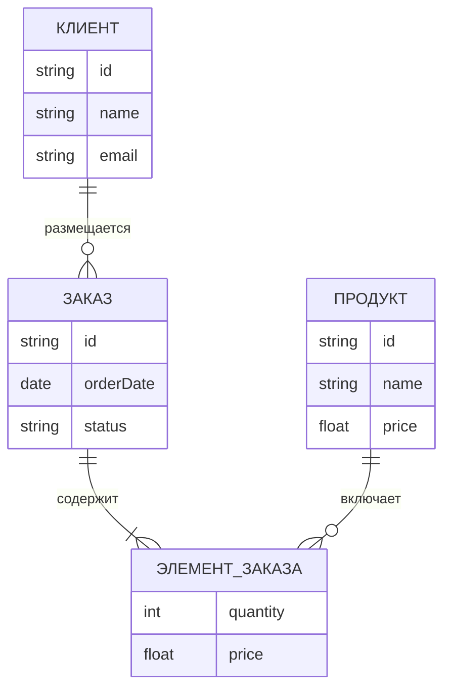

import DatabaseSchemaViewerPlay from '@site/src/components/DatabaseSchemaViewerPlay.jsx';

# Знакомство с базами данных

<div class="article-tags">
  <span class="tag tag-required">ОБЯЗАТЕЛЬНО</span>
  <span class="tag tag-beginner">ДЛЯ НОВИЧКОВ</span>
</div>

<span class="complexity-badge">Разработчику</span>
<span class="complexity-badge">Аналитику</span>
<span class="complexity-badge">Тестировщику</span>  
<span class="complexity-badge">Архитектору</span>
<span class="complexity-badge">Инженеру</span>

---

## Знакомство с базами данных

Мы уже разобрались с данными, информацией, сайтами и программами. Слова **БД** и **СУБД** встречались по ходу — здесь разложим их по полочкам без перегруза формулами.

**База данных (БД)** — сами данные и правила, по которым они организованы. **СУБД** (система управления базами данных) — программа, которая хранит эти данные на диске, принимает запросы, следит за целостностью и даёт доступ нескольким приложениям одновременно. В разговоре "база MySQL" обычно означает и данные, и СУБД — в учебниках различие полезно помнить.

Дальше — от простого к моделям хранения и выбору SQL / NoSQL / NewSQL.

---

### Что такое база данных?

★ **База данных** — упорядоченное хранилище информации по заданной **схеме**: какие сущности есть, какие у них поля, какие связи и ограничения допустимы.

В нормативных и учебных источниках формулировки различаются, но сходятся в трёх признаках:

1. **Хранение и обработка в вычислительной системе** — архивы, библиотечные каталоги или электронные таблицы без СУБД обычно БД не называют, хотя в них тоже есть упорядоченные данные.
2. **Логическая структурированность** — явно выделены элементы, связи между ними, типы и допустимые операции (поиск, изменение, отчёт).
3. **Схема (метаданные)** — формальное описание содержания, структуры и ограничений целостности. По **ГОСТ Р ИСО МЭК ТО 10032-2007** (эталонная модель управления данными) постоянные данные в среде БД состоят из **схемы** и **собственно базы данных**; СУБД использует определения в схеме для доступа и контроля прав.

Типичные определения из литературы:

- совокупность данных, организованных по правилам и поддерживаемых в памяти компьютера для отражения предметной области;
- совместно используемый набор логически связанных данных **и описания этих данных** (схемы), удовлетворяющий информационным потребностям организации.

Удобная аналогия — записная книжка коллег: имя, телефон, отдел. В IT то же самое на другом масштабе: пользователи, товары, заказы, посты, логи.

<div class="callout callout--info">
  <div class="callout-title">БД и СУБД в разговоре</div>
  Часто говорят «база MySQL», имея в виду и данные, и программу-менеджер. В учебниках **база данных** — содержимое и правила организации; **СУБД** — программный комплекс, который это содержимое создаёт, хранит и обслуживает. Подробнее — в главе [СУБД](./2.md).
</div>

Базы данных помогают:

- быстро искать и менять записи;
- не терять данные при сбоях (если СУБД настроена правильно);
- дать **нескольким программам** доступ к одним и тем же данным без "каши каждый в своём файле".

Типичный сценарий: сайт отправляет запрос "список пользователей с пагинацией", СУБД находит строки и отдаёт результат за миллисекунды — даже при миллионах записей, если есть индексы и разумная схема.

---

### Схема базы данных

★ **Схема базы данных** (англ. *database schema*) — формальное описание **содержания**, **структуры** и **ограничений целостности**, по которым создают и сопровождают БД. В реляционных СУБД схема задаёт таблицы (отношения), столбцы с типами и обязательностью, первичные и внешние ключи, проверочные ограничения. Текст схемы хранится в **словаре данных** (каталоге системы); на диаграммах схему часто рисуют как таблицы и линии связей по внешним ключам.

**Три уровня схемы** (классическая схема проектирования):

| Уровень | Что описывает | Пример артефакта |
| :--- | :--- | :--- |
| **Концептуальная** | Понятия предметной области и связи между ними | ER-диаграмма без типов SQL |
| **Логическая** | Сущности, атрибуты, ключи, кардинальность | Логическая модель перед `CREATE TABLE` |
| **Физическая** | Как логика ложится на файлы, индексы, разбиения | DDL, партиции, индексы в PostgreSQL |

На концептуальном уровне говорят о **сущностях** (наборах однотипных фактов), **атрибутах** (свойствах) и **связях** между сущностями. Логическая схема переводит это в отношения и ключи; физическая — в конкретные объекты СУБД на диске.

<div class="callout callout--note">
  <div class="callout-title">Слово «schema» в продуктах</div>
  В **Oracle** и **SQL Server** *schema* — ещё и **пространство имён** объектов (набор таблиц, представлений, процедур у пользователя или в БД). В **PostgreSQL** `CREATE SCHEMA` создаёт такое пространство (`public`, `app`, …). Это **имя контейнера** внутри одной БД, отдельно от «схемы данных» как описания структуры предметной области. См. [мини-глоссарий](./intro.md#мини-глоссарий).
</div>

<DatabaseSchemaViewerPlay
  title="Логическая схема в действии"
  subtitle="Подключитесь к эмулированной БД и посмотрите таблицы, поля и связи FK на диаграмме"
/>

---

### Модели данных и связи

**Модель данных** в классической теории БД — **формальная теория** представления и обработки данных в СУБД. Она включает три аспекта (по **Э. Ф. Кодду** и **К. Дж. Дейту**):

| Аспект | Содержание |
| :--- | :--- |
| **Структура** | Какие типы объектов и логические структуры допустимы (отношения, сегменты, документы…) |
| **Манипуляция** | Как переходить между состояниями БД и извлекать данные (алгебра, навигация по указателям, API) |
| **Целостность** | Какие ограничения должны выполняться всегда (ключи, домены, ссылочная целостность) |

Каждая СУБД построена на **явной или неявной** модели: реляционные — на **реляционной модели данных (РМД)**, MongoDB — на документной, Redis — на «ключ–значение» и т.д.

<div class="callout callout--tip">
  <div class="callout-title">Модель данных и схема БД</div>
  **Модель данных** — инструмент и теория (как язык программирования). **Схема конкретной БД** — результат проектирования на этом инструменте (как программа на языке). Путать «модель данных» со «схемой таблиц» — распространённая ошибка; подчёркивали **Дейт**, **Когаловский**, **Кузнецов**.
</div>

На практике до DDL это «карта» сущностей, полей и связей. Теория реляционной модели — в [Теоретических основах](./4.md) и в [разделе SQL](/encyclopedia/3-data-markup/3-07-sql/103.md).

---

#### Два разных слова "relation"

| Термин | Откуда | Что значит |
| :--- | :--- | :--- |
| **relation** | реляционная модель Кодда | **Отношение** — таблица как набор кортежей (строк). Отсюда слово **реляционная** БД. |
| **relationship** | ER-моделирование | **Связь** между сущностями на диаграмме ("покупатель размещает заказ"). |

**Реляционная СУБД** хранит данные в **отношениях** (таблицах) и связывает их через ключи и JOIN. **Связи** в ER — проектный язык; в SQL они становятся внешними ключами (`FOREIGN KEY`) и запросами.

Подробнее: [Entity Relationship](./11.md), [Теоретические основы](./4.md), [Реляционная модель](/encyclopedia/3-data-markup/3-07-sql/103.md).


На схеме выше — сущности "Пользователь" и "Группа". У пользователя есть поле с ID группы: так реализуется связь **один ко многим**.

Такие рисунки называют **ER-диаграммами** (Entity-Relationship). Их рисуют на этапе проектирования; в работающей БД те же сущности — таблицы и ограничения.

---

### Реляционные базы данных

★ **Реляционные СУБД** хранят данные в **таблицах** (отношениях). Схема задаёт столбцы, типы и ограничения; запросы чаще всего пишут на **SQL**.

Внешне таблица похожа на лист Excel — у СУБД при этом есть транзакции, одновременный доступ многих клиентов, внешние ключи, индексы, права доступа.

Пример таблицы `users`:

| ID | Имя | E-mail | Возраст |
| :--- | :--- | --- | ---: |
| 1 | Анна | anna@mail.com | 25 |
| 2 | Иван | ivan@mail.com | 30 |

У каждого столбца — свой **тип** (`INTEGER`, `VARCHAR`, `DATE` и т.д.) и правила (`NOT NULL`, уникальность).

Примеры реляционных СУБД: **PostgreSQL**, **MySQL**, **Microsoft SQL Server**, **SQLite**.

Сила модели — в **связях между таблицами**: заказ ссылается на клиента, строка заказа — на товар. Ниже — упрощённая ER-схема магазина:


---

### Нереляционные и специализированные хранилища

★ **NoSQL** — **Not Only SQL**: семейство СУБД под другие компромиссы — гибкая схема, горизонтальное масштабирование, низкая задержка, граф, кэш.

Документ в MongoDB может выглядеть так:

```json
{
  "id": 1,
  "name": "Анна",
  "email": "anna@mail.com",
  "hobbies": ["рисование", "путешествия"]
}
```

У соседней записи может не быть поля `hobbies` — для документной модели это нормально.

Примеры NoSQL-СУБД: **MongoDB**, **Redis**, **Cassandra**, **Neo4j**.

В примерах названы **СУБД** (продукты), как MySQL или PostgreSQL.

---

#### Как выбирать

| Задача | Частый выбор | Почему |
| :--- | :--- | :--- |
| Учёт, платежи, строгие инварианты | Реляционная СУБД + SQL | ACID, FK, нормализация |
| Кэш, сессии, счётчики | Redis и т.п. | Скорость, TTL |
| Каталог с разной структурой полей | MongoDB и др. | Гибкая схема |
| SQL + масштаб кластера | **NewSQL** | [NewSQL](/encyclopedia/3-data-markup/3-06-nosql/811) |

На реальных проектах часто **несколько хранилищ**: PostgreSQL для заказов, Redis для сессий — разделение нагрузок.

Углубление: [SQL](/encyclopedia/3-data-markup/3-07-sql/intro), [NoSQL](/encyclopedia/3-data-markup/3-06-nosql/intro).

Дальше по [маршруту раздела](./intro.md): [роль БД в организации](./6.md) → [теория и WAL](./4.md) → [правила Кодда](./5.md) → [ER-модель](./11.md).

---

### Типы моделей данных

Модели данных бывают не только реляционными и «NoSQL». Ниже — сводная таблица; устаревшие иерархическая и сетевая модели важны для истории и для понимания, откуда взялась доминанта SQL.

| Тип | Суть | Примеры СУБД |
| :--- | :--- | :--- |
| **Реляционная** | Данные — **отношения** (наборы кортежей); связи через ключи и JOIN | PostgreSQL, MySQL, SQL Server |
| **Документная** | Записи в JSON/BSON, гибкая структура полей | MongoDB |
| **Ключ–значение** | Пары ключ → значение, часто в памяти | Redis |
| **Графовая** | Вершины и рёбра, обход связей | Neo4j |
| **Иерархическая** | Дерево «предок–потомок», один родитель у потомка | IBM IMS |
| **Сетевая** | Граф записей; у потомка может быть несколько предков | IDMS, IDS (исторические) |

#### Иерархическая модель (кратко)

Данные — **дерево**: у каждого узла-потомка ровно **один** предок; у предка может быть много потомков. Запрос **вниз** по дереву прост («все заказы покупателя»); **вверх** и произвольные связи «боком» — сложнее. Базовые единицы — **сегмент** и **поле**; целостность «потомок без родителя» поддерживается автоматически. Типичный наследник эпохи мейнфреймов — **IBM IMS** (1960-е), до сих пор встречается в банковских и гос. системах. Близкий пример вне СУБД — **файловая система** (каталог → подкаталоги → файлы).

#### Сетевая модель (кратко)

Расширение иерархии: у **потомка может быть несколько предков**. Записи связаны **типами связей**; навигация — переход от предка к потомку и обратно по указателям. Модель эффективна по памяти и скорости на железе 1960–70-х, но **жёстко привязана к физической организации**: смена структуры часто требует переписывания приложений. Стандарт **CODASYL**; известный спор **Кодда и Бахмана** (1974) показал преимущество декларативной реляционной модели. Исторические продукты: **IDS**, **IDMS**.

#### Реляционная модель — почему победила

**Э. Ф. Кодд** (1969–1970) предложил хранить всё в **отношениях** и оперировать ими через **реляционную алгебру** и **исчисление**. **Информационный принцип**: любое содержимое БД задаётся **только значениями** в кортежах, без скрытых указателей между ячейками. Отсюда **декларативный SQL** и декларативные ограничения целостности. Альтернативы (иерархия, сеть, позже ОО-СУБД) остались в нишах; реляционные БД — основа корпоративного учёта.

История хранения данных от перфокарт и магнитных лент до облачных СХД — в [разделе «Данные и информация»](/encyclopedia/1-basics/1-09-dannye-i-informatsiya/intro) и в материалах по [внутреннему устройству](./3.md).

---
