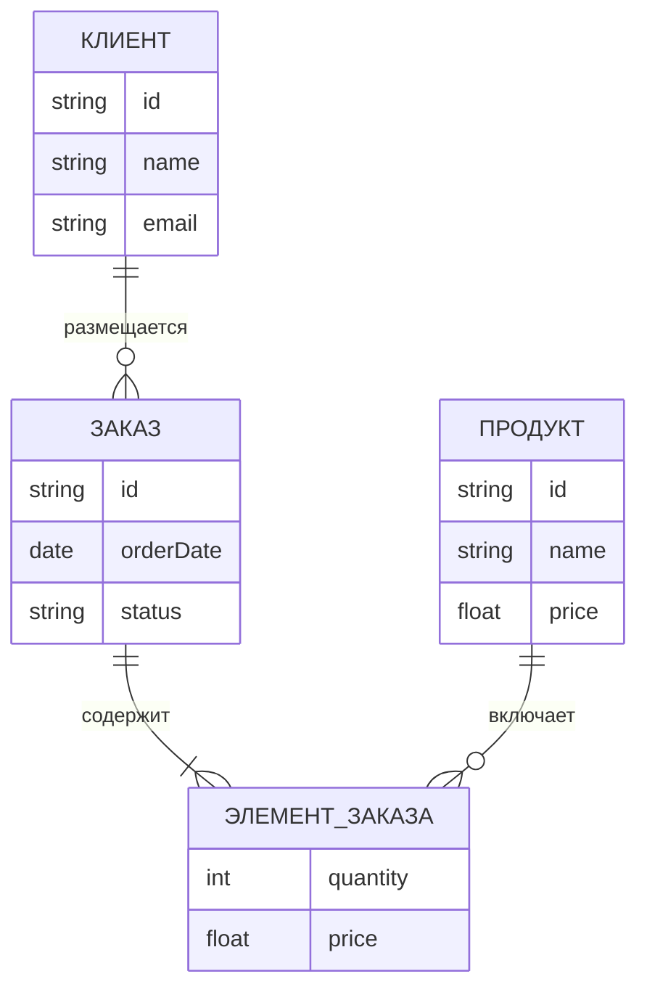

import DatabaseSchemaViewerPlay from '@site/src/components/DatabaseSchemaViewerPlay.jsx';

# Знакомство с базами данных

<div class="article-tags">
  <span class="tag tag-required">ОБЯЗАТЕЛЬНО</span>
  <span class="tag tag-beginner">ДЛЯ НОВИЧКОВ</span>
</div>

<span class="complexity-badge">Разработчику</span>
<span class="complexity-badge">Аналитику</span>
<span class="complexity-badge">Тестировщику</span>  
<span class="complexity-badge">Архитектору</span>
<span class="complexity-badge">Инженеру</span>

---

## Знакомство с базами данных

Мы уже разобрались с данными, информацией, сайтами и программами. Слова **БД** и **СУБД** встречались по ходу — здесь разложим их по полочкам без перегруза формулами.

**База данных (БД)** — сами данные и правила, по которым они организованы. **СУБД** (система управления базами данных) — программа, которая хранит эти данные на диске, принимает запросы, следит за целостностью и даёт доступ нескольким приложениям одновременно. В разговоре "база MySQL" обычно означает и данные, и СУБД — в учебниках различие полезно помнить.

Дальше — от простого к моделям хранения и выбору SQL / NoSQL / NewSQL.

---

### Что такое база данных?

★ **База данных** — упорядоченное хранилище информации по заданной **схеме**: какие сущности есть, какие у них поля, какие связи и ограничения допустимы.

Удобная аналогия — записная книжка коллег: имя, телефон, отдел. В IT то же самое на другом масштабе: пользователи, товары, заказы, посты, логи.

Базы данных помогают:

- быстро искать и менять записи;
- не терять данные при сбоях (если СУБД настроена правильно);
- дать **нескольким программам** доступ к одним и тем же данным без "каши каждый в своём файле".

Типичный сценарий: сайт отправляет запрос "список пользователей с пагинацией", СУБД находит строки и отдаёт результат за миллисекунды — даже при миллионах записей, если есть индексы и разумная схема.

---

### Схема базы данных

★ **Схема базы данных** – описание содержания, структуры, ограничений целостности, словом, это определение таблиц, полей, ключей, словарей и прочей информации, касающейся структурирования и порядка. Схема бывает следующих уровней:

	- Концептуальная схема – отображает концепции и их связи;
	- Логическая схема – карта сущностей и их атрибутов и связей;
	- Физическая схема – частичная реализация логической схемы.
	
Таким образом, существуют некие "сущности" - наборы данных. Эти наборы данных как-то связаны друг с другом – это связи. Сущности обладают какими-то особенностями и свойствами – атрибутами.

<DatabaseSchemaViewerPlay
  title="Логическая схема в действии"
  subtitle="Подключитесь к эмулированной БД и посмотрите таблицы, поля и связи FK на диаграмме"
/>

---

### Модели данных и связи

**Модель данных** — правила, по которым мы описываем объекты предметной области и операции над ними. На практике это "карта" сущностей, полей и связей до того, как появятся таблицы в СУБД.

---

#### Два разных слова "relation"

| Термин | Откуда | Что значит |
| :--- | :--- | :--- |
| **relation** | реляционная модель Кодда | **Отношение** — таблица как набор кортежей (строк). Отсюда слово **реляционная** БД. |
| **relationship** | ER-моделирование | **Связь** между сущностями на диаграмме ("покупатель размещает заказ"). |

**Реляционная СУБД** хранит данные в **отношениях** (таблицах) и связывает их через ключи и JOIN. **Связи** в ER — проектный язык; в SQL они становятся внешними ключами (`FOREIGN KEY`) и запросами.

Подробнее: [Entity Relationship](./11.md), [Теоретические основы](./4.md), [Реляционная модель](/encyclopedia/3-data-markup/3-07-sql/103.md).


На схеме выше — сущности "Пользователь" и "Группа". У пользователя есть поле с ID группы: так реализуется связь **один ко многим**.

Такие рисунки называют **ER-диаграммами** (Entity-Relationship). Их рисуют на этапе проектирования; в работающей БД те же сущности — таблицы и ограничения.

---

### Реляционные базы данных

★ **Реляционные СУБД** хранят данные в **таблицах** (отношениях). Схема задаёт столбцы, типы и ограничения; запросы чаще всего пишут на **SQL**.

Внешне таблица похожа на лист Excel — у СУБД при этом есть транзакции, одновременный доступ многих клиентов, внешние ключи, индексы, права доступа.

Пример таблицы `users`:

| ID | Имя | E-mail | Возраст |
| :--- | :--- | --- | ---: |
| 1 | Анна | anna@mail.com | 25 |
| 2 | Иван | ivan@mail.com | 30 |

У каждого столбца — свой **тип** (`INTEGER`, `VARCHAR`, `DATE` и т.д.) и правила (`NOT NULL`, уникальность).

Примеры реляционных СУБД: **PostgreSQL**, **MySQL**, **Microsoft SQL Server**, **SQLite**.

Сила модели — в **связях между таблицами**: заказ ссылается на клиента, строка заказа — на товар. Ниже — упрощённая ER-схема магазина:


---

### Нереляционные и специализированные хранилища

★ **NoSQL** — **Not Only SQL**: семейство СУБД под другие компромиссы — гибкая схема, горизонтальное масштабирование, низкая задержка, граф, кэш.

Документ в MongoDB может выглядеть так:

```json
{
  "id": 1,
  "name": "Анна",
  "email": "anna@mail.com",
  "hobbies": ["рисование", "путешествия"]
}
```

У соседней записи может не быть поля `hobbies` — для документной модели это нормально.

Примеры NoSQL-СУБД: **MongoDB**, **Redis**, **Cassandra**, **Neo4j**.

В примерах названы **СУБД** (продукты), как MySQL или PostgreSQL.

---

#### Как выбирать

| Задача | Частый выбор | Почему |
| :--- | :--- | :--- |
| Учёт, платежи, строгие инварианты | Реляционная СУБД + SQL | ACID, FK, нормализация |
| Кэш, сессии, счётчики | Redis и т.п. | Скорость, TTL |
| Каталог с разной структурой полей | MongoDB и др. | Гибкая схема |
| SQL + масштаб кластера | **NewSQL** | [NewSQL](/encyclopedia/3-data-markup/3-06-nosql/811) |

На реальных проектах часто **несколько хранилищ**: PostgreSQL для заказов, Redis для сессий — разделение нагрузок.

Углубление: [SQL](/encyclopedia/3-data-markup/3-07-sql/intro), [NoSQL](/encyclopedia/3-data-markup/3-06-nosql/intro).

Дальше по [маршруту раздела](./intro.md): [роль БД в организации](./6.md) → [теория и WAL](./4.md) → [правила Кодда](./5.md) → [ER-модель](./11.md).

---

### Типы моделей данных

Модели данных, конечно, бывают не только реляционными и нереляционными. Если погрузиться, всё намного сложнее. Давайте рассмотрим их с более глубоким делением:

| Тип | Описание | СУБД |
| :--- | :---: | ---: |
|Реляционная	|Данные хранятся в таблицах, связи между ними строго определены	|MySQL, PostgreSQL
|Документная	|Данные хранятся в формате JSON/BSON, каждая запись может быть уникальной	|MongoDB
|Ключ-значение	|Очень простая модель, данные хранятся как пары ключ-значение	|Redis
|Графовая	|Данные представлены в виде вершин и связей между ними	|Neo4j, Amazon Neptune
|Иерархическая / сетевая	|Устаревшие модели, использовались в ранних БД	|IBM IMS

---
