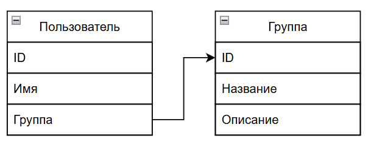
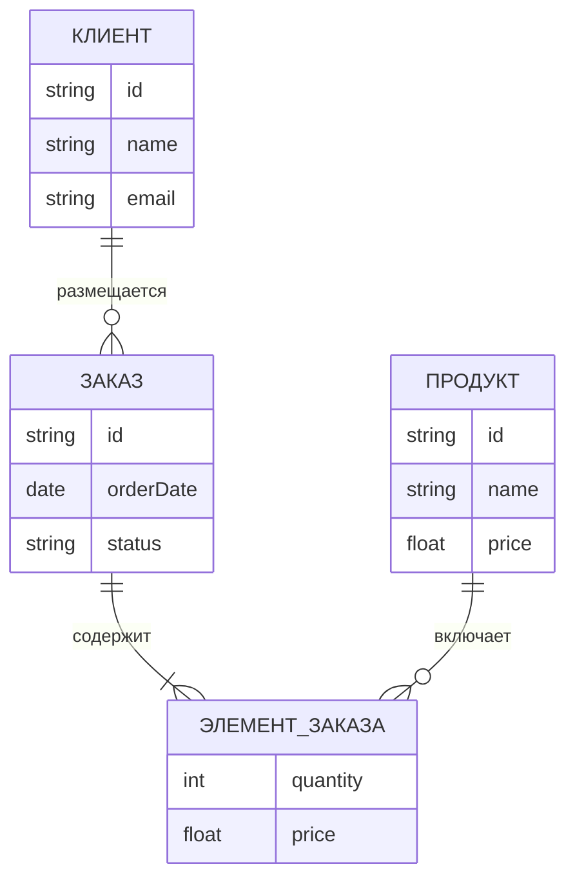

# Знакомство с базами данных

<div class="article-tags">
  <span class="tag tag-required">ОБЯЗАТЕЛЬНО</span>
  <span class="tag tag-beginner">ДЛЯ НОВИЧКОВ</span>
</div>

<span class="complexity-badge">Разработчику</span>
<span class="complexity-badge">Аналитику</span>
<span class="complexity-badge">Тестировщику</span>  
<span class="complexity-badge">Архитектору</span>
<span class="complexity-badge">Инженеру</span>

## Знакомство с базами данных

Мы рассмотрели, что такое данные, информация, изучили, как работают сайты, и что такое программы. Мы упоминали БД, СУБД, но не погружались в суть. Как стало ясно, данные являются структурированными каким-то образом, и не лежат «кучей».

---

### Что такое база данных?

★ **База данных** – упорядоченное хранилище информации, как цифровая библиотека. Эта совокупность данных хранится в соответствии со схемой данных, а манипуляции с данными производятся в соответствии с правилами средств моделирования данных.

Представим, что у нас есть множество коллег. Их номера телефонов и имена мы где-то записываем – в блокноте. Такой блокнот и выступает в роли базы данных. И в IT таким же образом хранятся данные пользователей, товары каталога, посты в соцсетях, фильмы, игры, книги, музыку и прочее.

Базы данных позволяют быстро находить, изменять, добавлять данные, избегать их потери, а также дают возможность многим программам работать с одними и теми же данными. Программа словно говорит БД «дай мне список пользователей!», БД ищет данные, и возвращает их программе, которая показывает результат пользователю. Всё это происходит за считанные доли секунды, даже если данных миллионы.

---

### Схема базы данных

★ **Схема базы данных** – описание содержания, структуры, ограничений целостности, словом, это определение таблиц, полей, ключей, словарей и прочей информации, касающейся структурирования и порядка. Схема бывает следующих уровней:

	- Концептуальная схема – отображает концепции и их связи;
	- Логическая схема – карта сущностей и их атрибутов и связей;
	- Физическая схема – частичная реализация логической схемы.
	
Таким образом, существуют некие «сущности» - наборы данных. Эти наборы данных как-то связаны друг с другом – это связи. Сущности обладают какими-то особенностями и свойствами – атрибутами.

---

### Модели данных и связи

Моделирование данных определяет правила и принципы создания модели данных.

Модель данных – это абстрактное, самодостаточное и логическое определение объектов, операторов, которые в совокупности составляют машину доступа к данным, с которыми взаимодействует пользователь или программа. Это, если проще, карта сущностей.

Сущности могут быть определены наличием связей (реляции, от английского relationship – отношения). И как раз реляционные базы данных – это SQL, а нереляционные – NoSQL.



В примере выше, мы видим две сущности - «Пользователь» и «Группа». Они связаны между собой следующим образом - у каждого пользователя есть поле «Группа». Оно содержит ID сущности «Группа», таким образом ссылаясь на запись с таким ID.

Такие диаграммы называют ER (Entity Relationship), и они строятся именно при проектировании. На самом деле это просто таблицы, которые содержат набор данных.

---

### Реляционные базы данных

★ **Реляционные (SQL) БД**. Данные хранятся в таблицах, как в Excel, где имеется чёткая структура в строгом формате, а для работы с данными используется язык SQL. 

Пример:

| ID | Имя | E-mail | Возраст |
| :--- | :---: | ---: | ---: |
|1	|Анна	|anna@mail.com |25
|2	|Иван	|ivan@mail.com |30

База данных имеет структуру в виде таблиц, и в таблице «Пользователи» определены столбцы «ID», «Имя», «E-mail», «Возраст». Каждый столбец (колонка) обладает своими требованиями к типу данных и количеству символов.

Примеры SQL-БД: MySQL, PostgreSQL, Microsoft SQL Server.

Сами по себе реляции являются взаимосвязями, и именно это ключевая особенность таких баз данных. К примеру, это может быть схема связи заказов.


---

### Нереляционные базы данных

★ **Нереляционные (NoSQL) базы** – это гибкие хранилища без жёстких таблиц. Данные могут быть в любом формате, что позволяет быстро работать с огромными объёмами данных, легко масштабировать, и менять структуру когда угодно:

```json
{
  "id": 1,
  "name": "Анна",
  "email": "anna@mail.com",
  "hobbies": ["рисование", "путешествия"]
}
```

В данном случае у каждой записи есть ключи («id», «name», «email», «hobbies») и значения («1», «Анна», «anna@mail.com», «рисование» и «путешествия»).

Примеры NoSQL-БД: MongoDB, Redis, Cassandra.

Если вы уже работали с БД, то вы обратили внимание, что приведено в примерах SQL и NoSQL баз данных (MySQL, MongoDB) – это на самом деле не БД, а СУБД. БД – сама структура данных, а СУБД – система управлениями базами данных.

SQL и NoSQL – когда применять? На самом деле всё просто. Если вам нужна структура, порядок, будто библиотека, где всё расставлено по полкам, авторам, номерам – выбираем SQL. Если нам важна скорость, гибкость для хаотичных или огромных данных, где всё лежит в «куче», то выбираем NoSQL.

Важно отметить, что наука о данных крайне широкая, и мы рассмотрим её во втором томе, погрузившись как в NoSQL, так и в SQL.

---

### Типы моделей данных

Модели данных, конечно, бывают не только реляционными и нереляционными. Если погрузиться, всё намного сложнее. Давайте рассмотрим их с более глубоким делением:

| Тип | Описание | СУБД |
| :--- | :---: | ---: |
|Реляционная	|Данные хранятся в таблицах, связи между ними строго определены	|MySQL, PostgreSQL
|Документная	|Данные хранятся в формате JSON/BSON, каждая запись может быть уникальной	|MongoDB
|Ключ-значение	|Очень простая модель, данные хранятся как пары ключ-значение	|Redis
|Графовая	|Данные представлены в виде вершин и связей между ними	|Neo4j, Amazon Neptune
|Иерархическая / сетевая	|Устаревшие модели, использовались в ранних БД	|IBM IMS

---