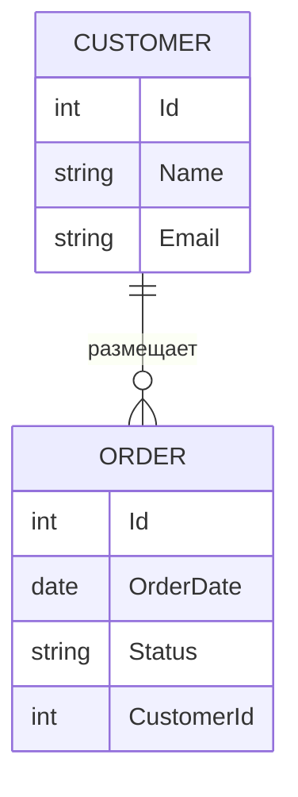
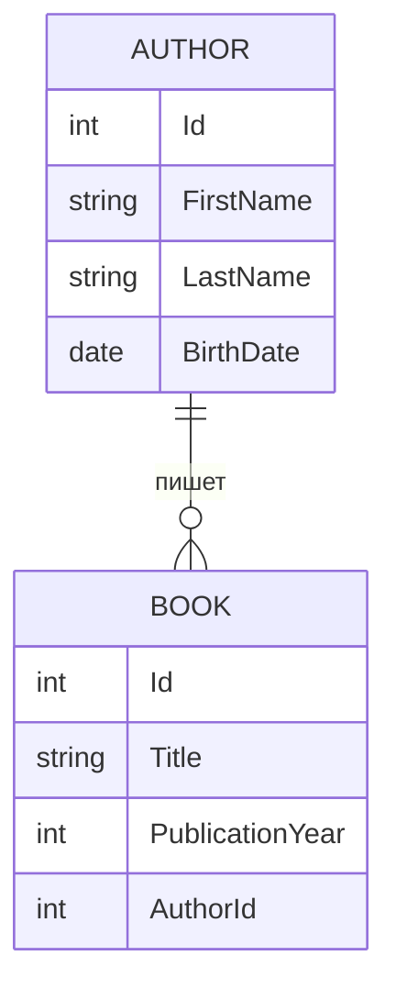

import ERDDemo from '@site/src/components/ERDDemo.jsx';

# Entity Relationship

<div class="article-tags">
  <span class="tag tag-required">ОБЯЗАТЕЛЬНО</span>
  <span class="tag tag-beginner">ДЛЯ НОВИЧКОВ</span>
</div>

<span class="complexity-badge">Разработчику</span>
<span class="complexity-badge">Аналитику</span>
<span class="complexity-badge">Тестировщику</span>  
<span class="complexity-badge">Архитектору</span>
<span class="complexity-badge">Инженеру</span>

---

## Entity Relationship

В этой главе — как перевести предметную область в таблицы и связи: сущности, атрибуты, внешние ключи, кардинальность. Это **концептуальный и логический** язык проектирования; полный цикл (нормализация, физика, чек-лист перед `CREATE TABLE`) — в [Проектировании баз данных](/encyclopedia/7-project/7-06-proektirovanie-i-arhitektura/design/116). Контекст "зачем это бизнесу" — [Роль базы данных в организации](./6.md).

Примеры SQL **нейтральные**; имена таблиц во **множественном числе** (`orders`, не `Order`), чтобы не споткнуться о зарезервированное `ORDER` в `ORDER BY`.

---

### Что такое сущность (Entity)

**Сущность** — это объект или концепция из предметной области, которую необходимо описать и сохранить в системе. Сущности представляют собой ключевые элементы реального мира, имеющие набор характеристик и поведение. 

Каждая сущность обладает **уникальным идентификатором**, позволяющим отличать один экземпляр от другого.

Примерами сущностей могут быть:
- Покупатель в интернет-магазине
- Заказ на товар
- Товар в каталоге
- Сотрудник компании
- Машина в автопарке

Таблица: Покупатель (Customer)

| Id | Name             | Email                   |
|------------|------------------|-------------------------|
| 101        | Иван Петров      | ivan.petrov@example.com |
| 102        | Мария Сидорова   | maria.s@example.com     |
| 103        | Алексей Кузнецов | alex.kuzn@example.com   |


Таблица: Заказ (`orders`)

| Id | OrderDate   | Status     | CustomerId |
|---------|-------------|------------|------------|
| 5001    | 2026-02-10  | Доставлен  | 101        |
| 5002    | 2026-02-12  | В пути     | 102        |
| 5003    | 2026-02-14  | Новый      | 101        |
| 5004    | 2026-02-15  | Отменён    | 103        |

Поле `CustomerId` в таблице `orders` указывает на запись в `Customer`.  
Заказ с `Id = 5001` принадлежит покупателю `101` (Иван Петров); у покупателя `101` два заказа: `5001` и `5003`.

Таблица: Товар в каталоге (Product)

| Id | Name                     | Price  |
|-----------|--------------------------|--------|
| 2001      | Ноутбук Dell XPS 13      | 85000  |
| 2002      | Механическая клавиатура  | 4500   |
| 2003      | Беспроводные наушники    | 12000  |
| 2004      | USB-C кабель 2 м         | 800    |

Таблица: Сотрудник компании (Employee)

| Id | FullName           | Position            | Department       |
|------------|--------------------|---------------------|------------------|
| 301        | Ольга Волкова      | Менеджер по продажам| Отдел продаж     |
| 302        | Дмитрий Егоров     | Старший разработчик | IT-отдел         |
| 303        | Наталья Романова   | Бухгалтер           | Финансовый отдел |
| 304        | Сергей Лебедев     | Водитель            | Логистика        |

Таблица: Машина в автопарке (Vehicle)

| Id | Brand    | Model       | LicensePlate | AssignedTo |
|-----------|----------|-------------|--------------|------------|
| 401       | Toyota   | Camry       | А123БВ777    | 304        |
| 402       | Ford     | Transit     | Е456КМ777    | 304        |
| 403       | Hyundai  | Solaris     | У789ОР777    | NULL       |

Поле `AssignedTo` содержит `EmployeeId` сотрудника, закреплённого за автомобилем.  
Машина с `VehicleId = 401` закреплена за сотрудником `304` — Сергеем Лебедевым.  
Машина с `VehicleId = 403` не назначена никому (`AssignedTo = NULL`).

Сущность всегда выражается **существительным**. Это важное правило языковой структуры моделирования: если термин не является существительным, он, скорее всего, не представляет собой сущность.

В контексте реляционных баз данных каждая сущность обычно соответствует одной таблице. Экземпляры сущности становятся строками этой таблицы.

---

#### Пример сущности "Покупатель"

```sql
CREATE TABLE Customer (
    Id INT PRIMARY KEY,
    Name VARCHAR(100),
    Email VARCHAR(150),
    RegistrationDate DATE
);
```

Эта таблица хранит информацию о покупателях. Каждая строка — отдельный покупатель, каждый столбец — атрибут, описывающий его характеристики.

---

### Что такое связь между сущностями

**Связь** — это взаимодействие или ассоциация между двумя или более сущностями. 

Связи показывают, как объекты связаны друг с другом в рамках бизнес-логики или предметной области. В отличие от сущностей, связи выражаются **глаголами**: "размещает", "включает", "принадлежит", "обрабатывает".

Связи **всегда двусторонние**. 

Если *сущность A* связана с *сущностью B*, то и *сущность B* связана с *сущностью A*. Однако характер этой связи может быть разным с каждой стороны: один к одному, один ко многим, многие ко многим.

---

#### Пример связи

Покупатель **размещает** заказ.  
Заказ **принадлежит** покупателю.

Это одна и та же связь, описанная с двух сторон. Глагол задаёт семантику отношения и помогает понять природу взаимодействия.

---

### Отношение (Relation) между конкретными полями сущности

**Отношение между сущностями** реализуется через ссылки между полями. 

Обычно одна таблица содержит **внешний ключ (foreign key)**, который ссылается на **первичный ключ (primary key)** другой таблицы.

Такое отношение устанавливает строгую связь между конкретными записями. Например, поле `CustomerId` в таблице `orders` указывает на запись в `Customer`.

---

#### Пример таблицы "Заказ"

```sql
CREATE TABLE orders (
    Id INT PRIMARY KEY,
    OrderDate DATE,
    Status VARCHAR(20),
    CustomerId INT,
    FOREIGN KEY (CustomerId) REFERENCES Customer(Id)
);
```

Поле `CustomerId` — это внешний ключ, который соединяет каждый заказ с конкретным покупателем. Без такого поля невозможно определить, кому принадлежит заказ.

Отношения обеспечивают целостность данных. Система управления базами данных проверяет, что значение внешнего ключа существует в связанной таблице, предотвращая появление "висячих" ссылок.

---

### Атрибуты сущностей

Атрибут — это свойство или характеристика сущности. Атрибуты описывают состояние объекта и хранятся в виде полей таблицы.

---

#### Типы атрибутов

**Идентифицирующие атрибуты** — это атрибуты, которые однозначно определяют экземпляр сущности. Чаще всего это первичный ключ, такой как `Id` или `GUID`. Идентифицирующие атрибуты обязательны и уникальны.

**Описательные атрибуты** — это все остальные поля, которые несут смысловую нагрузку: имя, дата рождения, цена, статус и так далее. Они могут быть обязательными или необязательными.

**Пустые атрибуты** — это атрибуты, которые могут не содержать значения (`NULL`). Такие атрибуты используются, когда информация временно недоступна или не применима к данному экземпляру.

Пример:
- `Email` у покупателя может быть пустым, если пользователь не указал его.
- `MiddleName` может отсутствовать у некоторых людей.

Атрибуты должны быть атомарными — содержать одно значение, а не список или структуру. Это требование первой нормальной формы.

---

### Различия между терминами — поля, свойства, атрибуты, параметры

Эти термины часто используются как синонимы, но имеют нюансы в зависимости от контекста.

**Атрибут** — термин из теории баз данных и ER-моделирования. Описывает характеристику сущности на уровне концептуальной модели.

**Поле** — термин из реляционной модели и SQL. Соответствует столбцу в таблице. Поле — это физическая реализация атрибута.

**Свойство** — термин из объектно-ориентированного программирования. В коде класса свойство представляет собой переменную или метод доступа к данным объекта. При маппинге объектов на таблицы свойства часто соответствуют полям.

**Параметр** — это входное значение функции, метода или запроса. Параметр не описывает состояние сущности, а используется для передачи данных в процессе выполнения операции.

В контексте проектирования баз данных корректнее использовать термины "атрибут" (на этапе моделирования) и "поле" (на этапе реализации).

---

### Виды сущностей

Существуют различные классификации сущностей в зависимости от их роли и структуры.

---

#### Сильные и слабые сущности

**Сильная сущность** существует независимо от других сущностей. Она имеет собственный первичный ключ, не зависящий от других таблиц. Пример: `Customer`, `Product`.

**Слабая сущность** не может существовать без связанной сильной сущности. Её первичный ключ частично или полностью состоит из внешнего ключа, ссылающегося на сильную сущность. Пример: строка заказа (`order_items`) бессмысленна без заголовка заказа (`orders`).

Слабые сущности часто используют составной первичный ключ:
```sql
CREATE TABLE order_items (
    OrderId INT,
    ProductId INT,
    Quantity INT,
    Price DECIMAL(10,2),
    PRIMARY KEY (OrderId, ProductId),
    FOREIGN KEY (OrderId) REFERENCES orders(Id),
    FOREIGN KEY (ProductId) REFERENCES Product(Id)
);
```

---

#### Нормализованные сущности

Нормализованная сущность — это результат применения правил нормализации базы данных. Цель нормализации — устранить избыточность и аномалии при вставке, обновлении и удалении данных.

Сущность считается нормализованной, если она удовлетворяет определённой нормальной форме:
- Первая нормальная форма: все атрибуты атомарны
- Вторая нормальная форма: нет частичных зависимостей от составного ключа
- Третья нормальная форма: нет транзитивных зависимостей

Нормализация приводит к созданию дополнительных сущностей для хранения повторяющихся данных. Например, вместо хранения страны в каждой записи о покупателе, создаётся отдельная сущность `Country`.

---

### Проектирование схем баз данных

Проектирование начинается с анализа предметной области и выявления ключевых сущностей. Далее определяются связи между ними и их кардинальность (один к одному, один ко многим, многие ко многим).

---

#### Кардинальность связей

- **Один к одному (1:1)**: один экземпляр сущности A связан с одним экземпляром сущности B. Пример: человек и его паспорт.
- **Один ко многим (1:N)**: один экземпляр сущности A связан со множеством экземпляров сущности B. Пример: покупатель и его заказы.
- **Многие ко многим (M:N)**: множество экземпляров сущности A связано с множеством экземпляров сущности B. Пример: студенты и курсы. Такие связи реализуются через промежуточную таблицу.

---

#### Правила именования внешних ключей

При создании связей следует придерживаться согласованной стратегии именования. Наиболее распространённый подход:

- Имя внешнего ключа формируется как `ИмяСвязаннойСущности + Id`
- Пример: для связи с сущностью `Customer` используется поле `CustomerId`
- Для GUID-идентификаторов: `CustomerGuid`

Такой подход обеспечивает читаемость и предсказуемость структуры базы данных. Разработчики сразу понимают назначение поля по его имени.

---

#### Пример двух связанных сущностей

Сущность 1 — Покупатель:
```sql
CREATE TABLE Customer (
    Id INT PRIMARY KEY,
    Name VARCHAR(100) NOT NULL,
    Email VARCHAR(150)
);
```

Сущность 2 — Заказ:
```sql
CREATE TABLE orders (
    Id INT PRIMARY KEY,
    OrderDate DATE NOT NULL,
    Status VARCHAR(20) NOT NULL,
    CustomerId INT NOT NULL,
    FOREIGN KEY (CustomerId) REFERENCES Customer(Id)
);
```

Связь между ними: один покупатель может иметь множество заказов, но каждый заказ принадлежит только одному покупателю.

---

### ERD и ER-диаграммы

ERD (Entity-Relationship Diagram) — это визуальное представление структуры базы данных. Диаграмма "сущность-связь" показывает сущности, их атрибуты и отношения между ними.

На диаграмме:
- Сущности изображаются прямоугольниками
- Связи — ромбами или линиями с пометками
- Атрибуты могут быть указаны внутри прямоугольников или отдельно

Для проектирования баз данных особенно важно показывать, какие именно поля участвуют в связях, а не просто наличие связи между сущностями.

<ERDDemo />

---

#### Пример ER-диаграммы на Mermaid



Эта диаграмма показывает:
- Сущность `CUSTOMER` с её атрибутами
- Сущность `ORDER` с её атрибутами  
- Связь "размещает" между ними
- Кардинальность: один покупатель может разместить множество заказов (`||--o{`)

---

### Инструменты для создания ER-диаграмм

Для эффективного проектирования и визуализации сущностей используются специализированные инструменты.

**Microsoft Visio Professional** — мощный инструмент для создания диаграмм всех типов, включая ERD. Поддерживает автоматическую генерацию диаграмм из существующих баз данных и обратную генерацию DDL-скриптов из диаграмм.

**Draw.io (diagrams.net)** — бесплатный веб-инструмент с поддержкой ER-диаграмм. Позволяет создавать профессиональные схемы и экспортировать их в различные форматы. Имеет библиотеку готовых шаблонов для сущностей и связей.

**Mermaid** — язык описания диаграмм, интегрированный во многие системы документации, включая GitHub и Docusaurus. Позволяет описывать диаграммы текстом, что упрощает версионирование и совместную работу.

Каждый из этих инструментов позволяет создавать как простые схемы с прямоугольниками и линиями для демонстрации общих концепций, так и детализированные диаграммы с указанием конкретных полей и типов данных для проектирования реальных баз данных.

---

### Принципы проектирования связей между сущностями

При создании связей между таблицами следует придерживаться нескольких ключевых принципов, обеспечивающих читаемость, поддерживаемость и корректность модели данных.

---

#### Единообразие именования внешних ключей

Стандартный подход к именованию внешнего ключа состоит в комбинации имени связанной сущности и суффикса, обозначающего тип идентификатора:

- `CustomerID` — если первичный ключ в таблице `Customer` называется `ID`
- `CustomerGuid` — если используется глобальный уникальный идентификатор
- `ProductCode` — если сущность использует бизнес-идентификатор вместо технического

Такой подход устраняет неоднозначность и позволяет быстро понять, на какую таблицу ссылается поле, даже без просмотра схемы базы данных.

---

#### Избегание циклических зависимостей

Циклическая зависимость возникает, когда две или более таблиц ссылаются друг на друга напрямую. Например:

- Таблица `Employee` содержит поле `ManagerId`, ссылающееся на `Employee.Id`
- Таблица `Department` содержит поле `HeadId`, ссылающееся на `Employee.Id`
- Таблица `Employee` содержит поле `DepartmentId`, ссылающееся на `Department.Id`

Хотя такие зависимости допустимы в реляционных базах данных, они усложняют операции вставки и удаления. При проектировании важно учитывать порядок выполнения операций и использовать временные отключения проверки ограничений, если это необходимо.

---

#### Кардинальность и реализация связей

Разные типы связей требуют разных подходов к реализации:

**Один ко многим (1:N)**  
Внешний ключ размещается в "многих" сторонах связи. Например, в `orders` лежит `CustomerId`, ссылающийся на `Customer.Id`.

**Один к одному (1:1)**  
Внешний ключ может быть помещён в любую из таблиц, но чаще всего он совпадает с первичным ключом. Такая связь часто используется для разделения тяжёлых или чувствительных данных. Например, основная информация о пользователе хранится в `User`, а персональные данные — в `UserProfile`, где `Id` является и первичным, и внешним ключом.

**Многие ко многим (M:N)**  
Требует создания промежуточной таблицы, содержащей пары идентификаторов. Эта таблица может содержать дополнительные атрибуты, описывающие саму связь. Например, таблица `Enrollment` связывает студентов и курсы и может содержать дату зачисления и оценку.

---

### Пример полной модели с двумя сущностями и связью

Рассмотрим две сущности: **Автор** и **Книга**.

---

#### Сущность "Автор"

```sql
CREATE TABLE Author (
    Id INT PRIMARY KEY,
    FirstName VARCHAR(50) NOT NULL,
    LastName VARCHAR(50) NOT NULL,
    BirthDate DATE
);
```

---

#### Сущность "Книга"

```sql
CREATE TABLE Book (
    Id INT PRIMARY KEY,
    Title VARCHAR(200) NOT NULL,
    PublicationYear INT,
    AuthorId INT NOT NULL,
    FOREIGN KEY (AuthorId) REFERENCES Author(Id)
);
```

Связь: один автор может написать множество книг, но каждая книга имеет одного автора (в рамках упрощённой модели).

---

#### ER-диаграмма на Mermaid



Диаграмма показывает:
- Сущность `AUTHOR` с её атрибутами
- Сущность `BOOK` с её атрибутами
- Связь "пишет" с кардинальностью один ко многим
- Поле `AuthorId` в таблице `Book` как реализацию связи

---

### Дополнительные атрибуты связей

В некоторых случаях связь сама по себе становится носителем информации. Например, сотрудник может работать в отделе с определённой должностью и датой начала работы. Эти данные относятся не к сотруднику и не к отделу, а именно к факту их взаимодействия.

Такие случаи требуют выделения связи в отдельную сущность или использование промежуточной таблицы с дополнительными полями.

Пример:

```sql
CREATE TABLE EmployeeDepartment (
    EmployeeId INT,
    DepartmentId INT,
    Position VARCHAR(100),
    StartDate DATE,
    EndDate DATE,
    PRIMARY KEY (EmployeeId, DepartmentId),
    FOREIGN KEY (EmployeeId) REFERENCES Employee(Id),
    FOREIGN KEY (DepartmentId) REFERENCES Department(Id)
);
```

Здесь `EmployeeDepartment` — это не просто связь, а полноценная сущность, описывающая факт трудоустройства с деталями.

---

### Роль нормализации в формировании сущностей

Нормализация напрямую влияет на количество и структуру сущностей. При переходе от одной нормальной формы к другой могут появляться новые таблицы:

- При устранении повторяющихся групп создаются отдельные сущности
- При устранении частичных зависимостей выделяются таблицы для подчинённых данных
- При устранении транзитивных зависимостей создаются справочники

Например, если в таблице `Customer` хранится `CountryName`, а страна встречается у многих покупателей, то создаётся сущность `Country`:

```sql
CREATE TABLE Country (
    Id INT PRIMARY KEY,
    Name VARCHAR(100) UNIQUE
);

CREATE TABLE Customer (
    Id INT PRIMARY KEY,
    Name VARCHAR(100),
    Email VARCHAR(150),
    CountryId INT,
    FOREIGN KEY (CountryId) REFERENCES Country(Id)
);
```

Это устраняет дублирование названий стран и обеспечивает целостность данных.

---

### Зависимость структуры от предметной области

Структура сущностей и связей определяется не техническими возможностями СУБД, а логикой предметной области. Например:

- В библиотеке книга может иметь только одного автора → связь 1:N
- В издательстве книга может иметь несколько авторов → связь M:N через промежуточную таблицу
- В академической системе авторство может включать порядок авторов → промежуточная таблица с полем `AuthorOrder`

Проектирование начинается с анализа бизнес-процессов, а не с выбора типов данных или инструментов. Только после полного понимания связей можно переходить к физической реализации.

--- 
