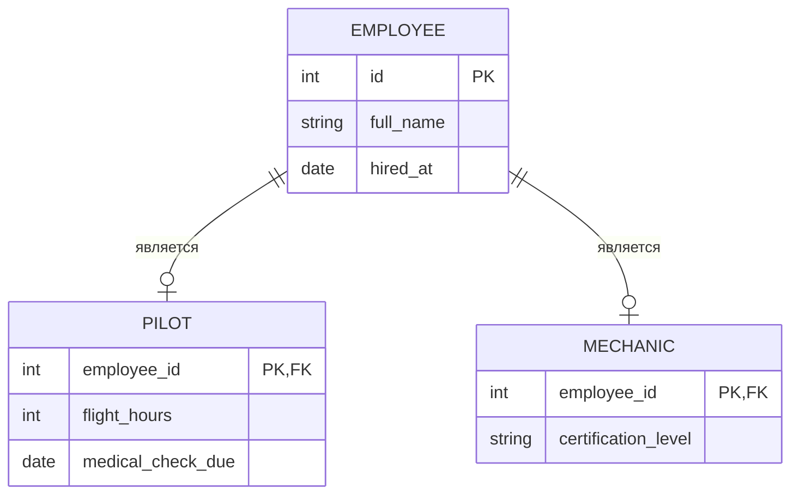
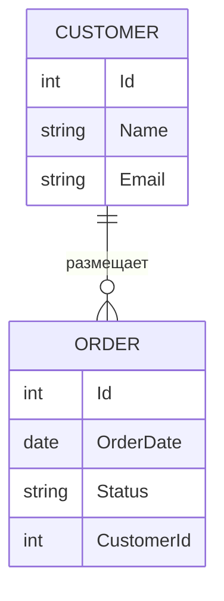
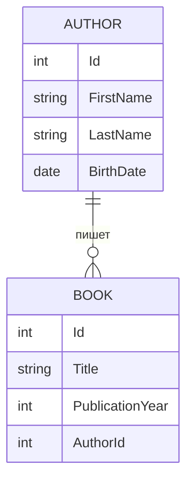

import ExternalPlayEmbed from '@site/src/components/ExternalPlayEmbed';


# Entity Relationship

<div class="article-tags">
  <span class="tag tag-required">ОБЯЗАТЕЛЬНО</span>
  <span class="tag tag-beginner">ДЛЯ НОВИЧКОВ</span>
</div>

<span class="complexity-badge">Разработчику</span>
<span class="complexity-badge">Аналитику</span>
<span class="complexity-badge">Тестировщику</span>  
<span class="complexity-badge">Архитектору</span>
<span class="complexity-badge">Инженеру</span>

---

## Entity Relationship

Глава про перевод предметной области в таблицы и связи.

- [Сущности](#chto-takoe-sushchnost-entity) и [атрибуты](#atributy-sushchnostej)
- [Внешние ключи](#vneshnij-klyuch-i-politiki) и [кардинальность](#kardinalnost-svyazej)
- [Расширенная EER](#rasshirennaya-er-model) (иерархии ролей, связь M:N)

Здесь **концептуальная и логическая** модель. Нормализация, физическая схема и [чек-лист перед `CREATE TABLE`](/encyclopedia/3-data-markup/3-07-sql/104.md#chek-list-modelirovaniya-dannyh) — в [Проектировании баз данных](/encyclopedia/7-project/7-06-proektirovanie-i-arhitektura/design/116). Роли вокруг данных — [Роль базы данных в организации](./6.md).

Примеры SQL **нейтральные**; имена таблиц во **множественном числе** (`orders`, не `Order`), чтобы не споткнуться о зарезервированное `ORDER` в `ORDER BY`.

---

<span id="chto-takoe-sushchnost-entity"></span>

### Что такое сущность (Entity)

**Сущность** — это объект или концепция из предметной области, которую необходимо описать и сохранить в системе. Сущности представляют собой ключевые элементы реального мира, имеющие набор характеристик и поведение. 

Каждая сущность обладает **уникальным идентификатором**, позволяющим отличать один экземпляр от другого.

Примерами сущностей могут быть:
- Покупатель в интернет-магазине
- Заказ на товар
- Товар в каталоге
- Сотрудник компании
- Машина в автопарке

Таблица: Покупатель (Customer)

| Id | Name             | Email                   |
|------------|------------------|-------------------------|
| 101        | Иван Петров      | ivan.petrov@example.com |
| 102        | Мария Сидорова   | maria.s@example.com     |
| 103        | Алексей Кузнецов | alex.kuzn@example.com   |


Таблица: Заказ (`orders`)

| Id | OrderDate   | Status     | CustomerId |
|---------|-------------|------------|------------|
| 5001    | 2026-02-10  | Доставлен  | 101        |
| 5002    | 2026-02-12  | В пути     | 102        |
| 5003    | 2026-02-14  | Новый      | 101        |
| 5004    | 2026-02-15  | Отменён    | 103        |

Поле `CustomerId` в таблице `orders` указывает на запись в `Customer`.  
Заказ с `Id = 5001` принадлежит покупателю `101` (Иван Петров); у покупателя `101` два заказа: `5001` и `5003`.

Таблица: Товар в каталоге (Product)

| Id | Name                     | Price  |
|-----------|--------------------------|--------|
| 2001      | Ноутбук Dell XPS 13      | 85000  |
| 2002      | Механическая клавиатура  | 4500   |
| 2003      | Беспроводные наушники    | 12000  |
| 2004      | USB-C кабель 2 м         | 800    |

Таблица: Сотрудник компании (Employee)

| Id | FullName           | Position            | Department       |
|------------|--------------------|---------------------|------------------|
| 301        | Ольга Волкова      | Менеджер по продажам| Отдел продаж     |
| 302        | Дмитрий Егоров     | Старший разработчик | IT-отдел         |
| 303        | Наталья Романова   | Бухгалтер           | Финансовый отдел |
| 304        | Сергей Лебедев     | Водитель            | Логистика        |

Таблица: Машина в автопарке (Vehicle)

| Id | Brand    | Model       | LicensePlate | AssignedTo |
|-----------|----------|-------------|--------------|------------|
| 401       | Toyota   | Camry       | А123БВ777    | 304        |
| 402       | Ford     | Transit     | Е456КМ777    | 304        |
| 403       | Hyundai  | Solaris     | У789ОР777    | NULL       |

Поле `AssignedTo` содержит `EmployeeId` сотрудника, закреплённого за автомобилем.  
Машина с `VehicleId = 401` закреплена за сотрудником `304` — Сергеем Лебедевым.  
Машина с `VehicleId = 403` не назначена никому (`AssignedTo = NULL`).

Сущность всегда выражается **существительным**. Это важное правило языковой структуры моделирования — если термин не является существительным, он, скорее всего, не представляет собой сущность.

В контексте реляционных баз данных каждая сущность обычно соответствует одной таблице. Экземпляры сущности становятся строками этой таблицы.

---

#### Пример сущности "Покупатель"

```sql
CREATE TABLE Customer (
    Id INT PRIMARY KEY,
    Name VARCHAR(100),
    Email VARCHAR(150),
    RegistrationDate DATE
);
```

Эта таблица хранит информацию о покупателях. Каждая строка — отдельный покупатель, каждый столбец — атрибут, описывающий его характеристики.

---

### Что такое связь между сущностями

**Связь** — это взаимодействие или ассоциация между двумя или более сущностями. 

Связи показывают, как объекты связаны друг с другом в рамках бизнес-логики или предметной области. В отличие от сущностей, связи выражаются **глаголами** — "размещает", "включает", "принадлежит", "обрабатывает".

Связи **всегда двусторонние**. 

Если *сущность A* связана с *сущностью B*, то и *сущность B* связана с *сущностью A*. Однако характер этой связи может быть разным с каждой стороны — один к одному, один ко многим, многие ко многим.

---

#### Пример связи

Покупатель **размещает** заказ.  
Заказ **принадлежит** покупателю.

Это одна и та же связь, описанная с двух сторон. Глагол задаёт семантику отношения и помогает понять природу взаимодействия.

<span id="stepen-svyazi"></span>

#### Степень связи

**Степень связи** — число **разных типов сущностей**, которые участвуют в одной ассоциации. Тип сущности — это класс объектов ("Сотрудник", "Заказ"), а не отдельная строка в таблице.

| Степень | Сколько типов сущностей | Пример из жизни | Как выглядит в SQL / на ER |
| :--- | :--- | :--- | :--- |
| **Унарная (1)** | один тип | сотрудник **руководит** другим сотрудником | столбец `manager_id` в таблице `employees` ссылается на `employees.id`; на диаграмме — **петля** на одном прямоугольнике (**рекурсивная** связь) |
| **Бинарная (2)** | два типа | покупатель **размещает** заказ | `orders.customer_id → customers.id`; самый частый случай в операционных системах ([OLTP](/encyclopedia/3-data-markup/3-05-osnovy-baz-dannyh/3.md#kogda-optimizaciya-imeet-znachenie)) |
| **Тернарная (3)** | три типа | преподаватель **ведёт** курс **в** аудитории в заданный семестр | один факт связывает три роли сразу; в таблице часто три внешних ключа или отдельная сущность "Назначение" |

На практике тернарную связь часто **разбивают на несколько бинарных**, если так проще писать запросы и задавать внешние ключи. Оставляют "тройку" целиком, когда смысл теряется при разделении — например, одна и та же пара (преподаватель, курс) может идти в **разных аудиториях** в разные семестры, и все три измерения нужны в одном ключе строки.

Связи степени 4 и выше встречаются редко; их обычно декомпозируют до бинарных и [ассоциативных сущностей](#assotsiativnaya-sushchnost).

---

<span id="klyuchi-v-relacionnoj-sheme"></span>

### Ключи в реляционной схеме

При переходе от ER-диаграммы к `CREATE TABLE` каждая сущность получает способ однозначно отличать строки и ссылаться на другие таблицы.

**Первичный ключ (PRIMARY KEY)** гарантирует уникальность записи в таблице и запрещает `NULL`. По нему другие таблицы строят ссылки.

**Естественный ключ** берётся из предметной области — артикул, ISBN, код товара. Имеет смысл, когда значение стабильно и уникально без генератора:

```sql
CREATE TABLE products (
    product_code VARCHAR(20) PRIMARY KEY,
    product_name VARCHAR(100) NOT NULL,
    category     VARCHAR(50),
    price        DECIMAL(10, 2)
);
```

**Суррогатный ключ** (`Id`, `SERIAL`, UUID) удобен, когда естественный идентификатор длинный, меняется или приходит извне позже. Внешние ключи в дочерних таблицах чаще ссылаются на суррогат, а бизнес-код дублируют с ограничением `UNIQUE`.

#### Как выбрать первичный ключ

| Критерий | Естественный ключ | Суррогатный ключ |
| :--- | :--- | :--- |
| **Уникальность** | Стабилен в предметной области (ISBN, ИНН юрлица) | Генерируется СУБД или приложением |
| **Изменения** | Плохо, если код товара или статус могут смениться | Идентификатор строки не меняется при смене бизнес-атрибутов |
| **Составной ключ** | Допустим `(order_id, line_no)` | Часто заменяют одним `SERIAL` + `UNIQUE` на бизнес-поля |
| **Внешние ключи** | Дочерние таблицы тянут длинный составной FK | Короткая ссылка на `id`, бизнес-код — отдельно |

Практическое правило — **суррогат в `PRIMARY KEY`**, **естественный код — `UNIQUE NOT NULL`**, если он нужен в отчётах и интеграциях. Не используйте в PK поля, которые пользователи "переименовывают" (email, телефон, название отдела).

#### Типовые ошибки при проектировании ключей

- **Суррогат без бизнес-ограничения** — дубликаты заказов с разными `id`, но одним номером в 1С.
- **Естественный ключ из volatile-данных** — PK по email: смена адреса ломает все ссылки.
- **Смешение связи и атрибута** — "имя менеджера" текстом в заказе вместо `manager_id`.
- **M:N без промежуточной сущности** — массив id в JSON вместо таблицы связи с атрибутами (дата зачисления, роль).
- **Избыточные связи** — две разные FK на одну сущность без разной семантики.

Теория ключей и целостности — [Реляционная модель данных](/encyclopedia/3-data-markup/3-07-sql/103.md#otnoshenie-na-praktike); нормализация после выбора ключей — [Нормализация данных](/encyclopedia/3-data-markup/3-07-sql/104.md).

---

<span id="vneshnij-klyuch-i-politiki"></span>

### Отношение (Relation) между конкретными полями сущности

**Отношение между сущностями** реализуется через ссылки между полями. 

Обычно одна таблица содержит **внешний ключ (foreign key)**, который ссылается на **первичный ключ (primary key)** другой таблицы.

Такое отношение устанавливает строгую связь между конкретными записями. Например, поле `CustomerId` в таблице `orders` указывает на запись в `Customer`.

---

#### Пример таблицы "Заказ"

```sql
CREATE TABLE orders (
    Id INT PRIMARY KEY,
    OrderDate DATE,
    Status VARCHAR(20),
    CustomerId INT,
    FOREIGN KEY (CustomerId) REFERENCES Customer(Id)
);
```

Поле `CustomerId` — это внешний ключ, который соединяет каждый заказ с конкретным покупателем. Без такого поля невозможно определить, кому принадлежит заказ.

Отношения обеспечивают **ссылочную целостность**. СУБД проверяет, что значение внешнего ключа есть среди значений **потенциального ключа** родительского отношения, и блокирует "висячие" ссылки.

#### Формальное определение внешнего ключа

Пусть в таблице **R2** (дочерняя) есть столбцы **FK**, а в **R1** (родительская) — **потенциальный ключ CK**. **FK** — внешний ключ, если:

1. Типы и имена атрибутов FK после возможного переименования совпадают с CK.
2. В любой момент множество значений FK в R2 — **подмножество** значений CK в R1 (допускается `NULL`, если столбец необязателен).

R1 называют **родительским** (главным) отношением, R2 — **дочерним** (подчинённым).

#### Политики при изменении родителя

При `DELETE` или `UPDATE` строки в родительской таблице поведение задаётся в DDL:

| Политика | Поведение |
| :--- | :--- |
| **RESTRICT** / **NO ACTION** | Запретить операцию, если есть ссылающиеся строки |
| **CASCADE** | Удалить или обновить дочерние строки вместе с родителем |
| **SET NULL** | Обнулить FK в дочерних строках (если столбец допускает `NULL`) |

Пример: улица с `id_city = 3` не может появиться, пока в справочнике городов нет города с `id = 3`; при удалении города с **CASCADE** удалятся и его улицы, при **RESTRICT** удаление города вернёт ошибку.

<div class="callout callout--info">
  <div class="callout-title">Связь с теорией</div>

  <div class="callout-body">
  Ограничения уровня БД (внешние ключи) дополняют ограничения уровня **домена** (`NOT NULL`, `CHECK`) и **отношения** (`PRIMARY KEY`, `UNIQUE`). Классификация — в [Теоретических основах](./4.md#целостность-базы-данных).
  </div>
</div>

---

<span id="atributy-sushchnostej"></span>

### Атрибуты сущностей

Атрибут — это свойство или характеристика сущности. Атрибуты описывают состояние объекта и хранятся в виде полей таблицы.

---

#### Типы атрибутов

**Идентифицирующие атрибуты** — это атрибуты, которые однозначно определяют экземпляр сущности. Чаще всего это первичный ключ, такой как `Id` или `GUID`. Идентифицирующие атрибуты обязательны и уникальны.

**Описательные атрибуты** — это все остальные поля, которые несут смысловую нагрузку — имя, дата рождения, цена, статус и так далее. Они могут быть обязательными или необязательными.

**Пустые атрибуты** — это атрибуты, которые могут не содержать значения (`NULL`). Такие атрибуты используются, когда информация временно недоступна или не применима к данному экземпляру.

Пример:
- `Email` у покупателя может быть пустым, если пользователь не указал его.
- `MiddleName` может отсутствовать у некоторых людей.

Атрибуты должны быть атомарными — содержать одно значение, а не список или структуру. Это требование первой нормальной формы.

---

### Различия между терминами — поля, свойства, атрибуты, параметры

Эти термины часто используются как синонимы, но имеют нюансы в зависимости от контекста.

**Атрибут** — термин из теории баз данных и ER-моделирования. Описывает характеристику сущности на уровне концептуальной модели.

**Поле** — термин из реляционной модели и SQL. Соответствует столбцу в таблице. Поле — это физическая реализация атрибута.

**Свойство** — термин из объектно-ориентированного программирования. В коде класса свойство представляет собой переменную или метод доступа к данным объекта. При маппинге объектов на таблицы свойства часто соответствуют полям.

**Параметр** — это входное значение функции, метода или запроса. Параметр не описывает состояние сущности, а используется для передачи данных в процессе выполнения операции.

В контексте проектирования баз данных корректнее использовать термины "атрибут" (на этапе моделирования) и "поле" (на этапе реализации).

---

### Виды сущностей

Существуют различные классификации сущностей в зависимости от их роли и структуры.

---

<span id="silnye-i-slabye-sushchnosti"></span>

#### Сильные и слабые сущности

**Сильная сущность** существует независимо от других сущностей. Она имеет собственный первичный ключ, не зависящий от других таблиц. Пример: `Customer`, `Product`.

**Слабая сущность** не может существовать без связанной сильной сущности. Её первичный ключ частично или полностью состоит из внешнего ключа, ссылающегося на сильную сущность. Пример: строка заказа (`order_items`) бессмысленна без заголовка заказа (`orders`).

Слабые сущности часто используют составной первичный ключ:
```sql
CREATE TABLE order_items (
    OrderId INT,
    ProductId INT,
    Quantity INT,
    Price DECIMAL(10,2),
    PRIMARY KEY (OrderId, ProductId),
    FOREIGN KEY (OrderId) REFERENCES orders(Id),
    FOREIGN KEY (ProductId) REFERENCES Product(Id)
);
```

---

<span id="rasshirennaya-er-model"></span>

### Расширенная ER-модель (EER)

**ER-модель** описывает сущности и связи "в лоб" — клиент, заказ, товар. **Расширенная ER (EER, *Extended Entity-Relationship*)** добавляет конструкции для **иерархий** и **ролей**, когда у объектов одного класса разные поля и разные связи. Диаграмму называют **EERD**.

Типичный случай — компания, где все люди в кадрах числятся **сотрудниками**, но у **пилота** есть лётные часы и медкомиссия, у **бухгалтера** — нет, а у **механика** — своя сертификация. Если всё свалить в одну таблицу `employees` с десятками необязательных столбцов, большинство ячеек останутся пустыми (`NULL`) — это усложняет запросы и проверки. EER показывает общее и особенное **до** того, как вы пишете `CREATE TABLE`.

См. также [нотации ER](#notacii-er-modeli), [сильные и слабые сущности](#silnye-i-slabye-sushchnosti), [нормализацию](/encyclopedia/3-data-markup/3-07-sql/104.md).

#### Когда нужен подтип

Подтип выделяют, если выполняются **оба** условия:

- для бизнеса это **отдельный тип** объекта (пилот — не просто значение поля `должность = 'пилот'`, а своя сущность с особыми правилами);
- у типа есть **свои атрибуты или связи**, которых нет у соседей (только пилот проходит проверку лётного времени).

Если отличается только одно поле из справочника ("отдел", "статус") — достаточно обычной таблицы и `CHECK` или FK на справочник, без иерархии ISA.

#### Супертип, подтип и ISA

| Термин | Значение | Пример |
| :--- | :--- | :--- |
| **Супертип** | обобщённая сущность с полями, общими для всех подтипов | `СОТРУДНИК` — ФИО, дата найма |
| **Подтип** | частный вид супертипа | `ПИЛОТ`, `МЕХАНИК`, `БУХГАЛТЕР` |
| **Связь "является" (*is-a*)** | каждый экземпляр подтипа — экземпляр супертипа | пилот **является** сотрудником |
| **ISA** (*is-a*) | обозначение иерархии на диаграмме (треугольник с подписью ISA) | от `СОТРУДНИК` вниз к ролям |
| **Наследование** | подтип **получает** атрибуты и связи супертипа | пилот наследует `full_name`, `hired_at` |

На логическом уровне строка подтипа обычно соотносится со строкой супертипа как **один к одному** (один `employee_id` — одна запись в `employees` и не более одной в `pilots`, если роли не пересекаются).



- **Специализация** — идём **сверху вниз**. Сначала общая сущность, затем выделяем подтипы по отличиям.
- **Обобщение** — идём **снизу вверх**. Заметили похожие сущности и вынесли общие поля в супертип.

#### Дискриминатор подтипа

**Дискриминатор** — поле, по которому система понимает, к какому подтипу относится запись. Часто это столбец в таблице супертипа:

- `emp_type = 'pilot'`
- `emp_type = 'mechanic'`

Дискриминатор связывают с ограничениями:

- `CHECK (emp_type IN (...))` в [DDL](/encyclopedia/3-data-markup/3-07-sql/101.md);
- триггер или логика приложения при вставке в таблицу подтипа (в `pilots` может существовать только строка с `emp_type = 'pilot'`).

Подробнее про ограничения на уровне БД — [Ограничения целостности в SQL](/encyclopedia/3-data-markup/3-07-sql/444.md).

#### Непересекающиеся и перекрывающиеся подтипы

| Вид | Правило | Пример |
| :--- | :--- | :--- |
| **Непересекающиеся** (*disjoint*) | один экземпляр супертипа — **не больше чем в одном** подтипе | сотрудник в учёте либо пилот, либо механик, либо бухгалтер |
| **Перекрывающиеся** (*overlapping*) | один экземпляр может входить **в несколько** подтипов | человек одновременно **сотрудник** и **студент**; преподаватель и администратор |

- для **непересекающихся** ролей часто хватает **одного** дискриминатора с единственным значением;
- для **перекрывающихся** — отдельный флаг или отдельная строка в таблице каждого подтипа (один `person_id` и в `employees`, и в `students`).

#### Полнота иерархии

| Ограничение | Смысл | Когда применяют |
| :--- | :--- | :--- |
| **Полная** (*total*) | **каждый** экземпляр супертипа обязан попасть хотя бы в один подтип | в домене жёстко задан список ролей, пропусков нет |
| **Частичная** (*partial*) | часть экземпляров супертипа **может остаться** только на уровне супертипа | роль уточняют позже или не все записи классифицированы |

#### Три способа перенести EER в SQL

Выбор зависит от числа подтипов, того, пересекаются ли роли, и от того, насколько важны жёсткие ограничения в самой БД.

**1. Отдельная таблица на каждый подтип (нормализованный ISA)**

- общая таблица `employees` с полями для всех;
- таблицы `pilots`, `mechanics` с `employee_id` как PK и FK на `employees`;
- лишних `NULL` в ролевых столбцах нет;
- целостность задаётся `FOREIGN KEY` и `CHECK`;
- для сводного отчёта по всем ролям нужны `JOIN`.

**2. Одна широкая таблица**

- один `employees` со столбцом `emp_type` и nullable-полями под каждую роль;
- простые `SELECT` без соединений;
- слабее гарантии ("пилот" без `flight_hours` формально возможен);
- широкие строки и риск лишней избыточности — тема [денормализации](/encyclopedia/3-data-markup/3-07-sql/104.md) и [ORM](/encyclopedia/4-code-dev/4-10-orm-i-rabota-s-dannymi/116.md).

**3. Только таблицы подтипов без общего супертипа**

- встречается редко;
- общие поля приходится дублировать или собирать через `UNION` в представлениях.

Пример способа 1:

```sql
CREATE TABLE employees (
    id         INT PRIMARY KEY,
    full_name  VARCHAR(200) NOT NULL,
    hired_at   DATE NOT NULL,
    emp_type   VARCHAR(20) NOT NULL
        CHECK (emp_type IN ('pilot', 'mechanic', 'accountant'))
);

CREATE TABLE pilots (
    employee_id       INT PRIMARY KEY
        REFERENCES employees(id) ON DELETE CASCADE,
    flight_hours      INT NOT NULL,
    medical_check_due DATE NOT NULL
);
```

На диаграмме ISA рисуют **треугольником**; в [нотации Чена](#notacii-er-modeli) — отдельные прямоугольники и связь "является". Практика ERD в аналитике — [ERD среди нотаций](/encyclopedia/7-project/7-04-analitika/1231).

#### Многозначные атрибуты

**Многозначный атрибут** — у **одного** экземпляра сущности хранится **несколько значений одного признака** (несколько телефонов у клиента, несколько жанров у книги).

В реляционной схеме так не хранят в одном столбце. Вместо этого:

- отдельная таблица `customer_phones(customer_id, phone)` с внешним ключом на клиента;
- или связь **многие ко многим**, если сами значения — сущности (студент записан на несколько курсов).

Строка `"+7..., +7..., +7..."` в одной ячейке нарушает [первую нормальную форму](/encyclopedia/3-data-markup/3-07-sql/104.md#normalnye-formy) и ломает поиск по одному номеру.

<span id="assotsiativnaya-sushchnost"></span>

#### Ассоциативная сущность и связь M:N

**Связь "многие ко многим" (M:N)** на ER-диаграмме допустима на **концептуальном** уровне (много студентов на много курсов). В **реляционной** СУБД её почти всегда превращают в две связи **один ко многим** через **ассоциативную сущность** — отдельную таблицу-связку.

Таблица-связка обычно содержит:

- внешний ключ на первую сущность (`student_id`);
- внешний ключ на вторую (`course_id`);
- первичный ключ — суррогат `id` или пара `(student_id, course_id)`;
- **атрибуты самой связи** — дата зачисления, оценка, роль (они не принадлежат ни студенту, ни курсу в одиночку).

В нотации Crow's Foot связку рисуют отдельным прямоугольником между двумя "многими" концами. По смыслу это близко к [слабой сущности](#silnye-i-slabye-sushchnosti) строки заказа, но для **симметричной** M:N, где нет единственного "родителя".

Реализация кардинальности M:N в SQL — в [Реляционной модели](/encyclopedia/3-data-markup/3-07-sql/103.md#otnoshenie-na-praktike).

```sql
CREATE TABLE enrollments (
    id          SERIAL PRIMARY KEY,
    student_id  INT NOT NULL REFERENCES students(id),
    course_id   INT NOT NULL REFERENCES courses(id),
    enrolled_at DATE NOT NULL DEFAULT CURRENT_DATE,
    grade       NUMERIC(3, 1),
    UNIQUE (student_id, course_id)
);
```

---

<span id="biznes-pravila-i-er"></span>

### От бизнес-правила к ER-модели

**Бизнес-правило** — короткая формулировка политики предметной области, которую система должна соблюдать. Примеры:

- "Куратор может курировать много студентов."
- "Средний балл студента — от 2.00 до 5.00."
- "У одного заказа ровно один покупатель."

ER-модель строят **из таких фраз**, а не из списка уже существующих Excel-файлов. Иначе в схеме появятся лишние таблицы или пропадут нужные связи. Сбор правил на этапе анализа — [Роль базы данных в организации](./6.md), воркшопы с ERD — [ERD среди нотаций](/encyclopedia/7-project/7-04-analitika/1231).

#### Как разобрать фразу на элементы модели

| Что в тексте правила | Что появляется на ER / в SQL |
| :--- | :--- |
| **Существительные** (куратор, студент, заказ) | **Сущности** (прямоугольники) |
| **Глагол** (курирует, размещает, содержит) | **Связь** между сущностями |
| **Числа и диапазоны** ("от 2.00 до 5.00", "не больше трёх") | `CHECK`, домен типа или отдельный справочник |
| **"Только один" / "много" / "необязательно"** | **Кардинальность** связи (1:1, 1:N, M:N) |

Ограничения в DDL — в [Ограничения целостности](/encyclopedia/3-data-markup/3-07-sql/444.md); после модели — [чек-лист моделирования](/encyclopedia/3-data-markup/3-07-sql/104.md#chek-list-modelirovaniya-dannyh).

#### Два вопроса для кардинальности

Для сущностей **A** и **B** задайте:

1. Сколько экземпляров **B** может быть связано с **одним** экземпляром **A**?
2. Сколько экземпляров **A** может быть связано с **одним** экземпляром **B**?

**Пример.** Правила:

- "Куратор курирует много студентов."
- "Студент курируется одним куратором."

Ответы:

- на одного куратора — **много** студентов;
- на одного студента — **один** куратор.

Итог — связь **один ко многим (1:N)**; внешний ключ `curator_id` логично положить в таблицу `students`. Разбор кардинальности на диаграмме — в разделе [Кардинальность связей](#kardinalnost-svyazej) ниже.

Полный путь от требований до таблиц — [Проектирование баз данных](/encyclopedia/7-project/7-06-proektirovanie-i-arhitektura/design/116).

---

#### Нормализованные сущности

Нормализованная сущность — это результат применения правил нормализации базы данных. Цель нормализации — устранить избыточность и аномалии при вставке, обновлении и удалении данных.

Сущность считается нормализованной, если она удовлетворяет определённой нормальной форме:

- **1НФ** — все атрибуты атомарны, без повторяющихся групп столбцов (`product1`, `product2`).
- **2НФ** — нет частичных зависимостей от составного ключа (поля заказа отдельно от строк заказа).
- **3НФ** — нет транзитивных зависимостей между неключевыми полями (регион клиента — в справочнике клиентов).
- **НФБК** и **4НФ** — редкие случаи с несколькими кандидатными ключами и независимыми списками значений.

Пошаговые примеры на таблицах заказов, расписания и сотрудников — в [Нормализация данных](/encyclopedia/3-data-markup/3-07-sql/104.md#normalnye-formy). Перед DDL — [чек-лист моделирования](/encyclopedia/3-data-markup/3-07-sql/104.md#chek-list-modelirovaniya-dannyh).

Нормализация приводит к созданию дополнительных сущностей для хранения повторяющихся данных. Например, вместо хранения страны в каждой записи о покупателе создаётся отдельная сущность `Country`.

---

### Проектирование схем баз данных

Проектирование начинается с анализа предметной области и выявления ключевых сущностей. Далее определяются связи между ними и их кардинальность (один к одному, один ко многим, многие ко многим).

---

<span id="kardinalnost-svyazej"></span>

#### Кардинальность связей

- **Один к одному (1:1)**: один экземпляр сущности A связан с одним экземпляром сущности B. Пример: человек и его паспорт.
- **Один ко многим (1:N)**: один экземпляр сущности A связан со множеством экземпляров сущности B. Пример: покупатель и его заказы.
- **Многие ко многим (M:N)**: множество экземпляров сущности A связано с множеством экземпляров сущности B. Пример: студенты и курсы. Такие связи реализуются через промежуточную таблицу.

---

#### Правила именования внешних ключей

При создании связей следует придерживаться согласованной стратегии именования. Наиболее распространённый подход:

- Имя внешнего ключа формируется как `ИмяСвязаннойСущности + Id`
- Пример: для связи с сущностью `Customer` используется поле `CustomerId`
- Для GUID-идентификаторов: `CustomerGuid`

Такой подход обеспечивает читаемость и предсказуемость структуры базы данных. Разработчики сразу понимают назначение поля по его имени.

---

#### Пример двух связанных сущностей

Сущность 1 — Покупатель:
```sql
CREATE TABLE Customer (
    Id INT PRIMARY KEY,
    Name VARCHAR(100) NOT NULL,
    Email VARCHAR(150)
);
```

Сущность 2 — Заказ:
```sql
CREATE TABLE orders (
    Id INT PRIMARY KEY,
    OrderDate DATE NOT NULL,
    Status VARCHAR(20) NOT NULL,
    CustomerId INT NOT NULL,
    FOREIGN KEY (CustomerId) REFERENCES Customer(Id)
);
```

Связь между ними: один покупатель может иметь множество заказов, но каждый заказ принадлежит только одному покупателю.

---

<span id="notacii-er-modeli"></span>

### Нотации ER-модели

Одну предметную область можно нарисовать в разных **нотациях**. Смысл (сущности, связи, кардинальность) один; отличаются символы на диаграмме.

| Нотация | Сущность | Связь | Кардинальность | Где встречается |
| :--- | :--- | :--- | :--- | :--- |
| **Чена (Chen)** | Прямоугольник | Ромб между сущностями | Числа у линий (`1`, `N`) | Классические учебники, ГОСТ-стиль |
| **Crow's Foot ("воронья лапка")** | Прямоугольник с полями | Линия между сущностями | "Лапки" на концах: `\|`, `O`, `<` | Visio, draw.io, многие CASE-средства |
| **Mermaid** `erDiagram` | Блок с атрибутами | Подпись на ребре | один-ко-многим (`\|\|--o` + воронья лапка) | Документация в Git, эта энциклопедия |

В **нотации Чена** атрибуты часто овалами вокруг сущности; на практике в инструментах атрибуты чаще **внутри** прямоугольника сущности — так проще читать DDL.

В **Crow's Foot** на конце линии:

- вертикальная черта `\|` — "ровно один";
- круг `O` — "ноль или один";
- "лапка" `<` — "много".

Пример: заказчик и заказ — **один ко многим** (в Mermaid ниже: `CUSTOMER ||--o` с вороньей лапкой на стороне заказа).

**Эволюция моделей данных** (кратко): иерархическая и сетевая → **реляционная** (таблицы, SQL) → объектно-ориентированная и **NoSQL** под специализированные нагрузки. В одной организации часто сочетают реляционную БД учёта и Redis или документное хранилище каталога — см. [четыре типа БД](./1.md#chetyre-osnovnyh-tipa-baz-dannyh).

---

### ERD и ER-диаграммы

ERD (Entity-Relationship Diagram) — это визуальное представление структуры базы данных. ERD среди нотаций моделирования — [основы диаграмм](/encyclopedia/7-project/7-04-analitika/1231); ниже — предметная область БД. Диаграмма "сущность–связь" показывает сущности, их атрибуты и отношения между ними.

На диаграмме:
- сущности изображаются прямоугольниками;
- связи — ромбами (Чен) или линиями с "лапками" (Crow's Foot);
- атрибуты — внутри сущности или отдельными овалами.

Для проектирования баз данных особенно важно показывать, какие именно поля участвуют в связях, а не просто наличие связи между сущностями.

<ExternalPlayEmbed example="data-markup/erd-demo" title="ERD — диаграмма сущностей" minHeight={520} />

---

#### Пример ER-диаграммы на Mermaid



Эта диаграмма показывает:
- Сущность `CUSTOMER` с её атрибутами
- Сущность `ORDER` с её атрибутами  
- Связь "размещает" между ними
- Кардинальность: один покупатель может разместить множество заказов (один-ко-многим на диаграмме)

---

### Инструменты для создания ER-диаграмм

Для эффективного проектирования и визуализации сущностей используются специализированные инструменты.

**Microsoft Visio Professional** — мощный инструмент для создания диаграмм всех типов, включая ERD. Поддерживает автоматическую генерацию диаграмм из существующих баз данных и обратную генерацию DDL-скриптов из диаграмм.

**Draw.io (diagrams.net)** — бесплатный веб-инструмент с поддержкой ER-диаграмм. Позволяет создавать профессиональные схемы и экспортировать их в различные форматы. Имеет библиотеку готовых шаблонов для сущностей и связей.

**Mermaid** — язык описания диаграмм, интегрированный во многие системы документации, включая GitHub и Docusaurus. Позволяет описывать диаграммы текстом, что упрощает версионирование и совместную работу.

Каждый из этих инструментов позволяет создавать как простые схемы с прямоугольниками и линиями для демонстрации общих концепций, так и детализированные диаграммы с указанием конкретных полей и типов данных для проектирования реальных баз данных.

---

### Принципы проектирования связей между сущностями

При создании связей между таблицами следует придерживаться нескольких ключевых принципов, обеспечивающих читаемость, поддерживаемость и корректность модели данных.

---

#### Единообразие именования внешних ключей

Стандартный подход к именованию внешнего ключа состоит в комбинации имени связанной сущности и суффикса, обозначающего тип идентификатора:

- `CustomerID` — если первичный ключ в таблице `Customer` называется `ID`
- `CustomerGuid` — если используется глобальный уникальный идентификатор
- `ProductCode` — если сущность использует бизнес-идентификатор вместо технического

Такой подход устраняет неоднозначность и позволяет быстро понять, на какую таблицу ссылается поле, даже без просмотра схемы базы данных.

---

#### Избегание циклических зависимостей

Циклическая зависимость возникает, когда две или более таблиц ссылаются друг на друга напрямую. Например:

- Таблица `Employee` содержит поле `ManagerId`, ссылающееся на `Employee.Id`
- Таблица `Department` содержит поле `HeadId`, ссылающееся на `Employee.Id`
- Таблица `Employee` содержит поле `DepartmentId`, ссылающееся на `Department.Id`

Хотя такие зависимости допустимы в реляционных базах данных, они усложняют операции вставки и удаления. При проектировании важно учитывать порядок выполнения операций и использовать временные отключения проверки ограничений, если это необходимо.

---

#### Кардинальность и реализация связей

Разные типы связей требуют разных подходов к реализации:

**Один ко многим (1:N)**  
Внешний ключ размещается в "многих" сторонах связи. Например, в `orders` лежит `CustomerId`, ссылающийся на `Customer.Id`.

**Один к одному (1:1)**  
Внешний ключ может быть помещён в любую из таблиц, но чаще всего он совпадает с первичным ключом. Такая связь часто используется для разделения тяжёлых или чувствительных данных. Например, основная информация о пользователе хранится в `User`, а персональные данные — в `UserProfile`, где `Id` является и первичным, и внешним ключом.

**Многие ко многим (M:N)**  
Требует создания промежуточной таблицы, содержащей пары идентификаторов. Эта таблица может содержать дополнительные атрибуты, описывающие саму связь. Например, таблица `Enrollment` связывает студентов и курсы и может содержать дату зачисления и оценку.

---

### Пример полной модели с двумя сущностями и связью

Рассмотрим две сущности: **Автор** и **Книга**.

---

#### Сущность "Автор"

```sql
CREATE TABLE Author (
    Id INT PRIMARY KEY,
    FirstName VARCHAR(50) NOT NULL,
    LastName VARCHAR(50) NOT NULL,
    BirthDate DATE
);
```

---

#### Сущность "Книга"

```sql
CREATE TABLE Book (
    Id INT PRIMARY KEY,
    Title VARCHAR(200) NOT NULL,
    PublicationYear INT,
    AuthorId INT NOT NULL,
    FOREIGN KEY (AuthorId) REFERENCES Author(Id)
);
```

Связь: один автор может написать множество книг, но каждая книга имеет одного автора (в рамках упрощённой модели).

---

#### ER-диаграмма на Mermaid



Диаграмма показывает:
- Сущность `AUTHOR` с её атрибутами
- Сущность `BOOK` с её атрибутами
- Связь "пишет" с кардинальностью один ко многим
- Поле `AuthorId` в таблице `Book` как реализацию связи

---

### Дополнительные атрибуты связей

В некоторых случаях связь сама по себе становится носителем информации. Например, сотрудник может работать в отделе с определённой должностью и датой начала работы. Эти данные относятся не к сотруднику и не к отделу, а именно к факту их взаимодействия.

Такие случаи требуют выделения связи в отдельную сущность или использование промежуточной таблицы с дополнительными полями.

Пример:

```sql
CREATE TABLE EmployeeDepartment (
    EmployeeId INT,
    DepartmentId INT,
    Position VARCHAR(100),
    StartDate DATE,
    EndDate DATE,
    PRIMARY KEY (EmployeeId, DepartmentId),
    FOREIGN KEY (EmployeeId) REFERENCES Employee(Id),
    FOREIGN KEY (DepartmentId) REFERENCES Department(Id)
);
```

Здесь `EmployeeDepartment` — это полноценная сущность, описывающая факт трудоустройства с деталями.

---

### Роль нормализации в формировании сущностей

Нормализация напрямую влияет на количество и структуру сущностей. При переходе от одной нормальной формы к другой могут появляться новые таблицы:

- При устранении повторяющихся групп создаются отдельные сущности
- При устранении частичных зависимостей выделяются таблицы для подчинённых данных
- При устранении транзитивных зависимостей создаются справочники

Например, если в таблице `Customer` хранится `CountryName`, а страна встречается у многих покупателей, то создаётся сущность `Country`:

```sql
CREATE TABLE Country (
    Id INT PRIMARY KEY,
    Name VARCHAR(100) UNIQUE
);

CREATE TABLE Customer (
    Id INT PRIMARY KEY,
    Name VARCHAR(100),
    Email VARCHAR(150),
    CountryId INT,
    FOREIGN KEY (CountryId) REFERENCES Country(Id)
);
```

Это устраняет дублирование названий стран и обеспечивает целостность данных.

---

### Зависимость структуры от предметной области

Структура сущностей и связей определяется не техническими возможностями СУБД, а логикой предметной области. Например:

- В библиотеке книга может иметь только одного автора → связь 1:N
- В издательстве книга может иметь несколько авторов → связь M:N через промежуточную таблицу
- В академической системе авторство может включать порядок авторов → промежуточная таблица с полем `AuthorOrder`

Проектирование начинается с анализа бизнес-процессов, а не с выбора типов данных или инструментов. Только после полного понимания связей можно переходить к физической реализации.

--- 
