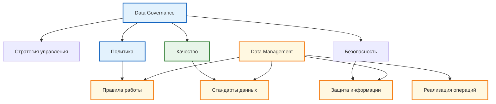
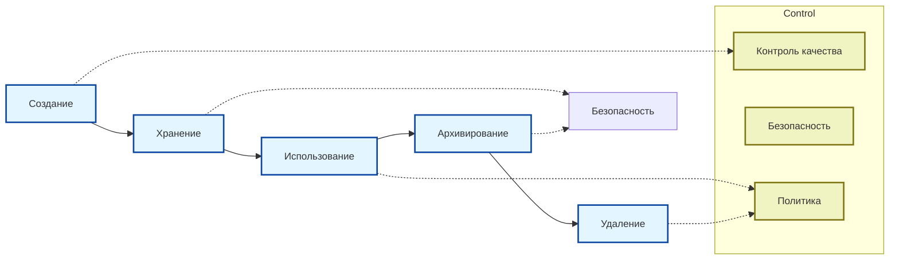

import DataGovernancePlay from '@site/src/components/DataGovernancePlay.jsx';

# Управление данными - Data Governance

<div class="article-tags">
  <span class="tag tag-required">ОБЯЗАТЕЛЬНО</span>
  <span class="tag tag-beginner">ДЛЯ НОВИЧКОВ</span>
</div>

<span class="complexity-badge">Разработчику</span>
<span class="complexity-badge">Аналитику</span>
<span class="complexity-badge">Тестировщику</span>  
<span class="complexity-badge">Архитектору</span>
<span class="complexity-badge">Инженеру</span>

## Управление данными - Data Governance

Представьте, что данные в компании — это детали конструктора. Если они разбросаны по разным коробкам, перемешаны или половины не хватает, вы никогда не соберёте нужную модель. А если кто-то посторонний возьмёт самые ценные детали — это вообще проблема.

Управление данными (Data Governance) — это про то, чтобы в конструкторе всегда был порядок: каждая деталь на своём месте, понятно, кто её может брать, и все знают, как с ней обращаться. Без этого даже самые умные аналитики будут ошибаться, а руководители — принимать решения «на глазок».

<DataGovernancePlay />

---

## Корпоративные данные

Корпоративные данные представляют собой информационный ресурс организации, который формирует основу для принятия управленческих решений и обеспечения операционной деятельности. Структура корпоративных данных включает в себя несколько основных категорий информации.

### Административно-управленческие и кадровые данные

Эта категория включает документы, которые определяют внутреннюю деятельность организации и взаимоотношения с сотрудниками:

- Уставы и учредительные документы
- Приказы и распоряжения руководства
- Протоколы собраний и заседаний
- Личные дела сотрудников
- Штатное расписание
- Трудовые договоры и соглашения

Все указанные документы имеют юридическую значимость и подлежат строгому учёту.

### Финансово-бухгалтерские данные

Финансовая информация обеспечивает прозрачность хозяйственной деятельности организации:

- Счета и платёжные поручения
- Налоговая отчётность
- Данные о транзакциях
- Движение денежных средств
- Отчёты по расходам и доходам

Эти данные требуют особой защиты из-за чувствительности финансовой информации.

### Операционные данные бизнес-процессов

Операционная информация непосредственно участвует в производственных процессах компании:

- Базы клиентов (CRM системы)
- Логистические записи
- Спецификации товаров и услуг
- Данные о продажах и закупках
- Производственные планы

Качество этих данных влияет на эффективность работы организации напрямую.

### Интеллектуальная собственность

Информация, составляющая конкурентное преимущество организации:

- Разработки и патенты
- Маркетинговые исследования
- Уникальные методики и технологии
- Бизнес-планы

Этот тип данных требует максимального уровня защиты доступа.

### Служебная переписка и коммуникации

Коммуникационные материалы отражают внутренние процессы взаимодействия:

- Внутренние чаты
- Электронная почта
- Архивы служебных записок
- Журналы телефонных разговоров

Эти данные часто становятся объектом анализа при расследовании инцидентов.

---

## Что такое управление корпоративными данными

Управление данными представляет собой комплекс мероприятий, направленных на обеспечение качества, безопасности и соответствия нормативным требованиям на протяжении всего жизненного цикла информации. Это фундамент для принятия точных решений и защиты корпоративной информации.

Управление данными включает три ключевых компонента:

| Компонент | Описание | Цель |
|-----------|----------|------|
| Качество данных | Обеспечение достоверности, актуальности, полноты и непротиворечивости информации | Эффективная аналитика и принятие решений |
| Безопасность данных | Защита конфиденциальной информации от утечек и несанкционированного доступа | Сохранение коммерческой тайны |
| Политика данных | Формализованные правила работы с информацией | Стандартизация процессов |

**Data Governance** формирует стратегию управления данными, а **Data Management** напрямую осуществляет управление данными согласно определённой стратегии. Оба направления работают в единой системе для обеспечения эффективности использования информационной продукции.



---

## Политика управления данными

Политика управления данными — это свод формальных правил и стандартов, определяющих, как именно создаются, хранятся, обрабатываются и удаляются данные в организации. Документ устанавливает требования ко всем участникам работы с информацией.

Основные элементы политики управления данными включают следующие разделы:

- Правила доступа к данным
- Требования к качеству информации
- Процедуры резервного копирования
- Методики классификации данных
- Процессы удаления устаревшей информации
- Регламенты обработки персональных данных

Документация политики должна быть доступна всем сотрудникам и регулярно обновляться при изменении требований.

---

## Качество данных

Обеспечение качества данных гарантирует их достоверность, актуальность, полноту и непротиворечивость. Высокое качество необходимо для эффективной аналитики и принятия обоснованных управленческих решений.

Примеры показателей качества данных:

- Точность значений (соответствие реальным показателям)
- Полнота заполнения обязательных полей
- Актуальность информации (своевременность обновления)
- Согласованность между разными источниками
- Читаемость и понятность форматирования

```json
{
  "quality_metrics": {
    "accuracy_score": 98.5,
    "completeness_level": 95.2,
    "timeliness_rating": 92.8,
    "consistency_index": 97.1
  },
  "data_sources": [
    "CRM система",
    "Складской учёт",
    "Финансовые отчёты"
  ]
}
```

Для поддержания высокого уровня качества данных проводятся регулярные проверки и очистка информационных ресурсов.

---

## Безопасность данных

Безопасность данных включает защиту конфиденциальной информации от утечек и несанкционированного доступа. Эта задача решается через применение технических и организационных мер защиты.

Методы обеспечения безопасности данных:

- Шифрование информации при хранении и передаче
- Контроль прав доступа к различным уровням данных
- Мониторинг действий пользователей с важной информацией
- Аудит изменений в критических базах данных
- Резервное копирование для восстановления после инцидентов

<div class="callout callout--tip">
<div class="callout-title">Проверка доступа</div>
Регулярно пересматривайте права доступа сотрудников к данным — изменения в должности или увольнение требуют немедленного обновления разрешений.
</div>

---

## Роли и ответственность

Для поддержания данных в порядке назначаются ответственные лица, такие как Data Steward (стюарды данных) и Data Owner (владельцы данных). Каждый участник получает чёткий перечень обязанностей.

| Роль | Ответственность | Полномочия |
|------|----------------|------------|
| Data Owner | Владелец данных определяет требования | Принимает решения о доступе |
| Data Steward | Контролирует качество и соответствие | Обрабатывает запросы по правилам |
| Data Analyst | Работает с данными для получения выводов | Читает информацию по правилам |
| Security Officer | Обеспечивает защиту от угроз | Предотвращает нарушения доступа |

### Data Owner (владелец данных)

Ответственное лицо определяет бизнес-значимость конкретной категории данных и утверждает политики работы с ними. Владелец данных несёт ответственность за их использование в соответствии с целями организации.

### Data Steward (стюард данных)

Исполнительная роль, которая контролирует качество данных и соблюдение установленных политик. Стюард работает с ежедневными операциями по обеспечению стандартов.

### Пример роли Data Steward

```python
def validate_data_quality(records):
    """Проверка качества входящих данных"""
    issues = []
    
    for record in records:
        if not record.get('email'):
            issues.append("Отсутствует email")
        if len(record.get('phone', '')) < 10:
            issues.append("Некорректный номер телефона")
            
    return len(issues) == 0, issues

# Применение проверки
is_valid, problems = validate_data_quality(new_customer_list)
```

<details>
<summary>
<b>Дополнительные детали по ролям</b>
</summary>

Каждая роль имеет свой уровень доступа и зону ответственности. Команда работает согласовано для достижения общей цели по управлению качеством корпоративной информации.

</details>

---

## Инструменты Data Governance

Современные инструменты позволяют автоматизировать процессы управления данными и обеспечить контроль на всех этапах работы с информацией.

Типы инструментов для реализации Data Governance:

| Категория инструмента | Примеры функций |
|----------------------|-----------------|
| Каталоги данных | Поиск, описание, классификация |
| Системы мастер-данных | Единые справочники |
| Проверка качества | Валидация, очистка |
| Мониторинг доступа | Логирование событий |
| Политики и правила | Автоматизация контроля |

### Каталог данных

Каталог данных позволяет находить информацию, понимать её происхождение и контекст использования. Пользователи получают возможность видеть метаданные и связи между различными источниками.

### Система мастер-данных

Единый справочник предотвращает дублирование информации в разных системах. Все подразделения работают с одинаковыми базовыми сведениями о клиентах, продуктах и партнёрах.

### Валидация качества данных

Автоматические проверки выявляют несоответствия и ошибки до того, как они попадут в аналитические отчеты. Система предупреждает об отклонениях от установленных стандартов.

---

## Жизненный цикл данных

Данные проходят несколько этапов в течение времени своего существования в организации:

1. Создание — формирование новой записи
2. Хранение — размещение в безопасном месте
3. Использование — обработка и доступ
4. Архивирование — перевод в исторический режим
5. Удаление — окончательное уничтожение

Каждый этап требует своих подходов к обеспечению качества и безопасности.

---

### Этапы управления данными



---
