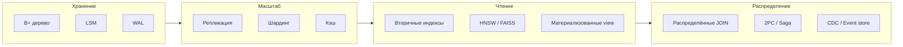

# Масштабирование БД — опорные темы

  ОБЯЗАТЕЛЬНО
  ДЛЯ НОВИЧКОВ

Разработчику
Архитектору
Инженеру

---

Масштабируемая база данных — это не один приём, а **связка** механизмов хранения, журналирования, индексов, репликации и согласования между узлами. Ниже — конспект тем, которые стоит пройти после [основ СУБД](./2.md) и [внутреннего устройства](./3.md), перед углублённым [администрированием](/encyclopedia/3-data-markup/3-08-upravlenie-rsubd/1.md) и [system design](/encyclopedia/7-project/7-06-proektirovanie-i-arhitektura/143.md).

---

## 1. Структуры хранения и журнал

| Тема | Зачем изучать | Где в энциклопедии |
| :--- | :--- | :--- |
| **B⁺-дерево** | Точечный и диапазонный поиск по ключу на диске; основа OLTP-индексов | [Восемь структур](./3.md#vosem-struktur-indeksa-i-hraneniya), [B-деревья](/encyclopedia/3-data-markup/3-02-struktury-dannyh/2.md#7-b-деревья-и-их-варианты) |
| **LSM-дерево** | Высокая пропускная способность **записи**; уровни SSTable и compaction | [Таблица структур](./3.md#vosem-struktur-indeksa-i-hraneniya), [NoSQL — WAL и LSM](/encyclopedia/3-data-markup/3-06-nosql/2.md) |
| **Журнал упреждающей записи (WAL)** | Durability при сбое; основа репликации и PITR | [Восстановление после сбоя](./8.md#wal--журнал-опережающей-записи), [теория](./4.md) |

**B⁺-дерево** хранит данные только в листьях; внутренние узлы — навигация. Страница на диске (4–16 КБ) соответствует узлу дерева: одно чтение с диска — один случайный I/O. Диапазон `WHERE id BETWEEN …` эффективен, потому что соседние ключи лежат в соседних листьях.

**LSM** (Log-Structured Merge) сначала пишет в **memtable** в RAM (часто на skip list), затем сбрасывает неизменяемые **SSTable** на диск и периодически **компактирует** уровни. Запись последовательная и быстрая; цена — фоновое слияние файлов и усложнение чтения «свежих» данных до compaction.

**WAL** — принцип «сначала журнал, потом страницы таблиц». При перезагрузке СУБД проигрывает хвост журнала (redo/undo). Тот же поток WAL питает **streaming replication** в PostgreSQL и аналоги в других СУБД.

---

## 2. Репликация и разделение данных

| Тема | Суть | Где углубиться |
| :--- | :--- | :--- |
| **Репликация лидер–подчинённый** | Один **primary** принимает записи; **replica/standby** копируют журнал | [Репликация РСУБД](/encyclopedia/3-data-markup/3-08-upravlenie-rsubd/1.md#репликация), [MongoDB replica set](/encyclopedia/3-data-markup/3-06-nosql/4.md) |
| **Реплики только для чтения** | `SELECT` и отчёты на копии; запись только на primary | [§ ниже в 3.08](/encyclopedia/3-data-markup/3-08-upravlenie-rsubd/1.md#read-replicas), [MSA-стек](/encyclopedia/7-project/7-06-proektirovanie-i-arhitektura/design/118.md) |
| **Шардинг** | Данные одной логической БД на нескольких серверах по ключу | [Шардинг в 3.08](/encyclopedia/3-data-markup/3-08-upravlenie-rsubd/1.md#шардинг), [12 концепций](/encyclopedia/7-project/7-06-proektirovanie-i-arhitektura/141.md#9-шардирование-sharding) |
| **Кэширование запросов** | Горячие ответы в Redis/Memcached до обращения к primary | [Кэш вне СУБД](/encyclopedia/3-data-markup/3-08-upravlenie-rsubd/1.md#keshirovanie-vne-subd) |

**Лидер–подчинённый** (primary–replica, master–slave) — доминирующая схема в реляционных и документных СУБД: один источник истины для записи, несколько копий для чтения и DR. Failover переводит роль лидера на реплику (Patroni, Always On, MongoDB elections).

**Read replica** — реплика, на которую намеренно направляют только чтение. Учитывают **replication lag**: клиент после записи может не увидеть данные на replica, если читать сразу. Решения — чтение с primary после записи, sticky session, `read your writes` в драйвере.

**Шардинг** увеличивает ёмкость и запись; **репликация** — отказоустойчивость и чтение. На практике каждый шард часто имеет свой набор реплик.

---

## 3. Индексы для масштабирования чтения

| Тема | Роль | Где углубиться |
| :--- | :--- | :--- |
| **Кластерный индекс** | Физический порядок строк на диске; один на таблицу (обычно PK) | [Типы по роли](./3.md#tipy-indeksov-po-role) |
| **Вторичные индексы** | Поиск по не-PK полям; цепочка secondary → PK → строка | [Типы по роли](./3.md#tipy-indeksov-po-role), [практика](./3.md#vtorichnye-indeksy), [сложные индексы](/encyclopedia/3-data-markup/3-07-sql/884.md) |
| **Векторные индексы (HNSW, FAISS)** | Приближённый поиск ближайших соседей в многомерном пространстве | [Векторные БД](/encyclopedia/3-data-markup/3-06-nosql/812.md), [pgvector HNSW](/encyclopedia/3-data-markup/3-06-nosql/812.md) |

**Кластерный** индекс задаёт порядок хранения строк (InnoDB — PK). **Вторичный** индекс — отдельное B⁺-дерево по `email`, статусу и т.д.; в InnoDB в листе всегда есть **PK** для доступа к строке в кластере.

**HNSW** — многослойный граф для ANN-поиска; параметры `M`, `efConstruction`, `efSearch` задают компромисс точность/скорость/память. **FAISS** — библиотека Meta с IVF, PQ и GPU-вариантами; часто встраивают в пайплайн, а не заменяют полностью СУБД.

---

## 4. Запросы в распределённой среде

| Тема | Проблема | Подход |
| :--- | :--- | :--- |
| **Распределённые соединения (JOIN)** | Строки разных таблиц на разных шардах — нет локального `JOIN` | [§ в 3.08](/encyclopedia/3-data-markup/3-08-upravlenie-rsubd/1.md#raspredelennye-soedineniya), денормализация, [Shared Nothing](/encyclopedia/7-project/7-06-proektirovanie-i-arhitektura/design/2117.md) |
| **Материализованные представления** | Тяжёлый отчётный `SELECT` каждый раз | [SQL — MV](/encyclopedia/3-data-markup/3-07-sql/8.md#материализованные-представления), [семь стратегий](/encyclopedia/3-data-markup/3-08-upravlenie-rsubd/1.md#sem-strategij-masshtabirovaniya) |

При шардинге запрос без ключа шарда вынуждает **scatter-gather** — опрос всех узлов и слияние на координаторе. `JOIN` между шардами ещё дороже: данные тянут по сети. Архитектурный ответ — проектировать доступ по **shard key**, денормализовать витрины, выносить аналитику в отдельный контур (CDC → DWH).

**Материализованное представление** физически хранит результат запроса; обновление — `REFRESH` по расписанию или инкрементально. В event-driven системах ту же роль играют **проекции** из потока событий.

---

## 5. Согласованность между узлами

| Тема | Фазы / идея | Когда применяют |
| :--- | :--- | :--- |
| **Двухфазный коммит (2PC)** | Prepare → Commit/Abort у всех участников | Редко в микросервисах; иногда внутри СУБД и legacy EJB |
| **Трёхфазный коммит (3PC)** | Добавлен pre-commit; меньше блокировок при сбое координатора | Учебная модель; на практике чаще Saga и eventual consistency |

**2PC** — координатор спрашивает участников «готовы?», затем фиксирует или откатывает. Гарантирует атомарность распределённой транзакции, но **блокирует** ресурсы и падает по доступности при потере координатора.

**3PC** вводит дополнительную фазу, чтобы участники могли завершить транзакцию, если координатор недоступен после prepare. В промышленных микросервисах чаще выбирают **Saga** (локальные транзакции + компенсации) или **outbox + события** вместо глобального 2PC.

Подробнее — [распределённые транзакции](/encyclopedia/7-project/7-06-proektirovanie-i-arhitektura/design/2117.md#распределённые-транзакции), [MSA и 2PC](/encyclopedia/7-project/7-06-proektirovanie-i-arhitektura/design/118.md), [Saga](/encyclopedia/7-project/7-06-proektirovanie-i-arhitektura/design/2124.md).

---

## 6. Поток изменений и событийная модель

| Тема | Суть | Где углубиться |
| :--- | :--- | :--- |
| **Событийная модель хранения (event store)** | Состояние = replay цепочки событий; журнал append-only | [Event Sourcing](/encyclopedia/7-project/7-06-proektirovanie-i-arhitektura/design/2123.md) |
| **Захват изменений данных (CDC)** | Поток INSERT/UPDATE/DELETE из журнала БД во внешние системы | [CDC в миграции MSA](/encyclopedia/8-infra-security/8-05-mikroservisy-i-integratsiya/116.md#change-data-capture-cdc), [outbox](/encyclopedia/7-project/7-06-proektirovanie-i-arhitektura/design/118.md), [брокеры](/encyclopedia/2-system-network/2-09-osnovy-integratsionnogo-vzaimodeystviya/121) |

**Event store** хранит **факты** (`OrderPlaced`, `PaymentCaptured`), а не перезаписывает строку. Текущее состояние для UI — **материализованная проекция**, которую можно пересобрать из лога.

**CDC** читает WAL/binlog (Debezium, logical replication) и публикует изменения в Kafka или другой bus. Это мост между OLTP-БД и поисковыми индексами, кэшем, витринами и микросервисами без опроса primary каждые N секунд. Теория очередей и гарантий доставки — [Брокеры сообщений](/encyclopedia/2-system-network/2-09-osnovy-integratsionnogo-vzaimodeystviya/121).

---

## Как темы складываются в систему

На практике путь такой: **индексы и WAL** на одном узле → **реплики и кэш** под рост чтения → **партиции и шарды** под объём и запись → **MV, CDC и проекции** под отчёты и интеграции → **Saga/outbox** вместо 2PC между сервисами.

---

## Рекомендуемый порядок чтения

1. [Как СУБД выполняет запрос](./3.md) — B⁺, LSM, партиции.
2. [WAL и восстановление](./8.md).
3. [Управление РСУБД — репликация и шардинг](/encyclopedia/3-data-markup/3-08-upravlenie-rsubd/1.md#репликация).
4. [NoSQL — репликация](/encyclopedia/3-data-markup/3-06-nosql/2.md#репликация-и-масштабирование) — если кластер не только SQL.
5. [System Design — карта](/encyclopedia/7-project/7-06-proektirovanie-i-arhitektura/143.md) — кэш, [очереди](/encyclopedia/2-system-network/2-09-osnovy-integratsionnogo-vzaimodeystviya/121), CDN в общем контуре.

---
