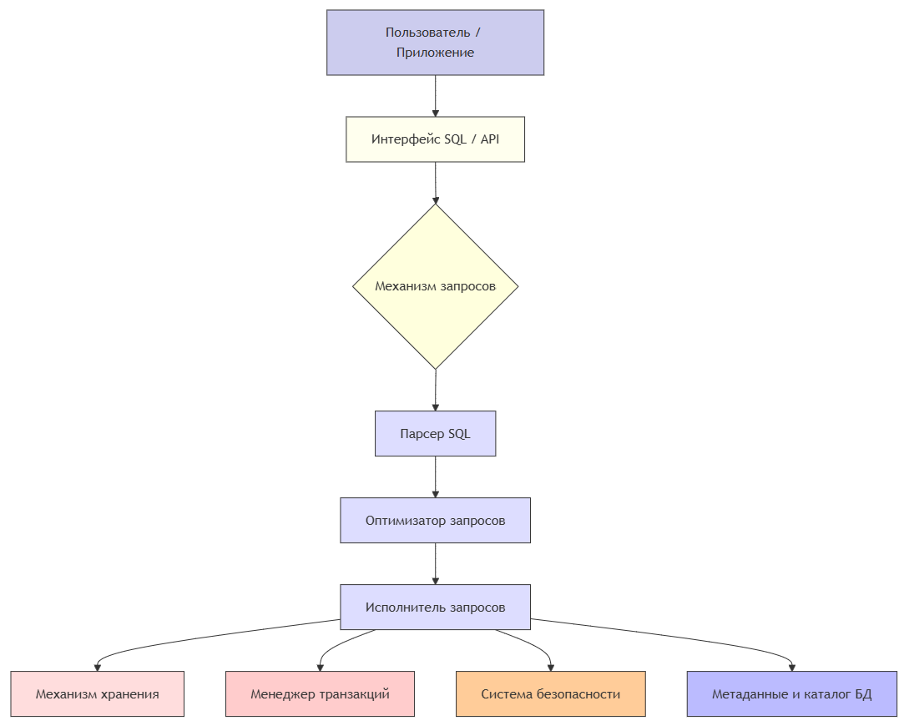

# Системы управления базами данных (СУБД)

  ОБЯЗАТЕЛЬНО
  ДЛЯ НОВИЧКОВ

Разработчику
Аналитику
Тестировщику  
Архитектору
Инженеру

## Системы управления базами данных (СУБД)

### Что такое СУБД?

Чтобы управлять базой данных, нужна какая-то специфическая программа или набор программ – система. Эта система и есть СУБД – система управления базами данных – совокупность программных и лингвистических средств, обеспечивающих управление созданием и использованием баз данных. СУБД выполняет множество задач, включая:

	- Создание и поддержка схемы БД
	- Хранение данных
	- Обеспечение безопасности (контроль доступа, права пользователей)
	- Резервное копирование и восстановление
	- Обработка запросов от приложений
	- Контроль целостности и согласованности данных
	- Поддержка транзакций (ACID-свойства)

Если БД - это место хранения информации, то СУБД является инструментом, который позволяет эту информацию управлять, использовать и защищать. В отличие от каталога с файлами, здесь добавляется целый набор возможностей, которые представляют собой совокупность программных и лингвистических средств.

---

### Возможности СУБД

1. Создание и поддержка структуры базы данных. СУБД позволяет создавать таблицы, поля, связи между ними, задавать ограничения и указывать типы данных. Именно так обеспечивается структурированное хранение информации.
2. Хранение данных. СУБД отвечает за физическое хранение данных на диске, и разумеется для собственной качественной работы она организует хранение так, чтобы данные были доступны, даже если их много. Поэтому программные возможности СУБД включают оптимизацию работы с диском.
3. Обработка запросов. Когда пишут запрос к базе данных, СУБД получает текстовую команду, которую парсит, оптимизирует и выполняет. СУБД отлично знает, где лежат данные, как к ним обратиться, благодаря чему от пользователя достаточно лишь сохранять правильность синтаксиса при составлении запросов.
4. Контроль безопасности. СУБД обеспечивает защиту данных, проверяя, кто имеет право читать данные, менять их, а если нужно - даже шифровать. Всё, что выполняют с данными пользователи - фиксируется и записывается в журналах, поэтому всегда можно выяснить, кто менял или удалял данные.
5. Резервное копирование и восстановление. В случае, если что-то случится с оборудованием или программным обеспечением, данные могут испортиться или удалиться. В том числе и из-за действий пользователей. СУБД умеет делать резервные копии и восстанавливать из них данные, если что-то сломалось. Это важно для предотвращения потерь информации.
6. Контроль целостности и согласованности. СУБД следит за тем, чтобы данные были корректными - не было ссылок на несуществующие записи, все правила бизнес-логики соблюдались, а одновременные изменения несколькими пользователями не приводили к ошибкам.

---

### Типы СУБД

СУБД бывают разных типов, в зависимости от того, какие данные они используют:
	- Реляционные СУБД (SQL) - SQLite, MySQL, PostgreSQL, Oracle, Microsoft SQL Server;
	- Нереляционные СУБД (NoSQL) - MongoDB, Redis, Cassandra, Couchbase;
	- Гибридные СУБД (NewSQL, совмещающие SQL и NoSQL) - Google Spanner, CockroachDB.

---

### Компоненты СУБД

СУБД состоит из следующих компонентов:
1. Ядро СУБД управляет данными и их структурой.
2. Механизм запросов принимает SQL-запросы, анализирует, оптимизирует и выполняет.
3. Механизм хранения отвечает за чтение и запись данных на диск.
4. Менеджер транзакций следит за ACID-свойствами.
5. Система безопасности управляет доступом и правами.
6. Инструменты администрирования — мониторинг, резервное копирование, восстановление.

---
