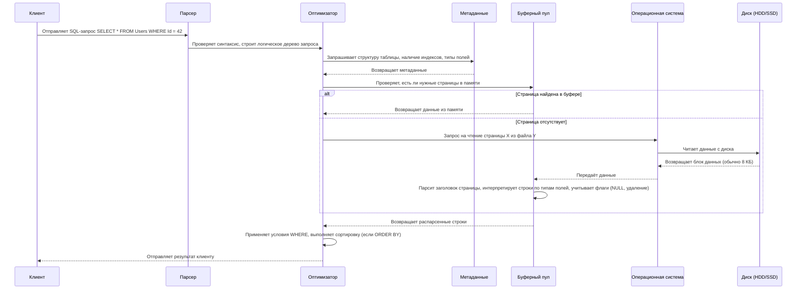

# Внутреннее устройство баз данных

<div class="article-tags">
  <span class="tag tag-required">ОБЯЗАТЕЛЬНО</span>
  <span class="tag tag-beginner">ДЛЯ НОВИЧКОВ</span>
</div>

<span class="complexity-badge">Разработчику</span>
<span class="complexity-badge">Аналитику</span>
<span class="complexity-badge">Тестировщику</span>  
<span class="complexity-badge">Архитектору</span>
<span class="complexity-badge">Инженеру</span>

## Как БД работает с данными?

### Работа БД

**Данные в БД**, как и любые файлы, **хранятся** в хранилище, то есть **на диске**. А диск сильно медленнее, чем оперативная память, и при запуске программы, данные читаются с диска, выгружаясь в ОЗУ.

И сам по себе процесс чтения и выгрузки в память довольно долгий. СУБД как раз отвечают за наиболее быстрый и оптимизированный подход к этой задаче.

Приложения выгружают данные с диска (хранилища) в оперативную память. И это работает при открытии файлов - и разумеется, данные в БД тоже хранятся на диске. Такой момент многие могут не учесть при проектировании - качество, стабильность и надёжность диска. Если купить сервера, установить в них дешёвые и объемные диски, то подозрительно странно будет, когда запросы в БД станут выполняться долго, и для пользователей будет всё «тормозить».

База данных - это ящик с данными, который лежит в архиве - хранилище.

**БД не хранит информацию в виде SQL-запросов или табличек из интерфейса**. 

Всё, что вы видите в таблицах, в реальности хранится в виде байтов на диске — это просто файлы, как и любые другие. БД может состоять из одного или нескольких файлов (например, `.mdf`, `.ldf` в SQL Server, `.sqlite` в SQLite, `.ibd` в MySQL). 

Эти файлы содержат **метаданные** (структуры таблиц, индексы), **страницы данных** (строки записей), **информацию о транзакциях** - всё это организовано в блоки или страницы, например, по 8 килобайт. Это позволяет эффективно управлять чтением и кэшированием.

---

### Алгоритм выполнения запроса

Когда вы делаете простой SQL-запрос, например:

```sql
SELECT * FROM Users WHERE Id = 42;
```

…тогда СУБД должна найти нужную запись.

1. Запрос сначала анализируется парсером на предмет синтаксиса.
2. Затем оптимизатор решает, как лучше выполнить запрос (например, использовать индекс или сделать полный скан).
3. Если нужные данные не находятся в памяти (буфере), СУБД отправляет команду операционной системе - «Прочти мне данные со страницы X из файла Y».
4. ОС обращается к диску (HDD/SSD), считывает данные и передаёт их в буферный пул (или кэш) СУБД. 
Буферный пул — специальный участок памяти, где часто используемые данные хранятся, чтобы избежать повторного чтения с диска.
5. Получив данные с диска, СУБД сталкивается с задачей интерпретации данных.
6. Сначала чтение заголовка страницы (обычно он весит 8 КБ), где есть тип страницы (данные, индекс, метаданные), указатель на следующую страницу, и информация о целостности (checksum).

>**Метаданные** - это информация о самой структуре данных. 

>Все эти данные тоже хранятся в **особых системных таблицах** или страницах, благодаря метаданным СУБД понимает, где находится нужная таблица, какие поля и типы данных там есть, и какие индексы можно использовать. Будто СУБД сначала вручают «карту», а потом она решает, куда двигаться дальше.

>Поэтому часто данные группируются в схемы.

>Если в таблице есть индекс, например на Id, то вместо того чтобы перебирать все страницы, СУБД ищет значение в структуре индекса, находит указатель на конкретную страницу данных, и загружает только нужную часть данных. Как поиск слова в словаре по алфавитному указателю вместо перелистывания всей книги. Указатели в словарях и есть индексы.

7. После заголовка идёт интерпретация строк данных. СУБД знает, как каждое поле должно быть представлено, в зависимости от типа данных - к примеру, INT - 4 байта, а DATETIME - 8 байт. Дополнительно интерпретируются и флаги - удалена ли запись, есть ли NULL-значения. БД использует информацию о типах данных, чтобы правильно распарсить бинарные данные в привычные значения - числа, строки, даты и т.д.

8. После того, как данные прочитаны и интерпретированы, они проверяются на соответствие условиям (WHERE), при необходимости сортируются (ORDER BY), затем передаются клиенту (через сетевой протокол или локально).

Чтение с диска - медленная операция, особенно на HDD. Поэтому современные СУБД стараются минимизировать обращения к диску, использовать буферный пул (буферизированный кэш), и хранить популярные данные в памяти. Для более быстрого I/O использовать лучше SSD.



---

## Организация данных в базе

### 1. Логико-математические основы реляционной модели

Реляционная модель данных, предложенная Эдгаром Коддом, опирается на аппарат математической логики и теории множеств. Понимание её логических основ необходимо для осознания границ выразительной мощности реляционных языков, включая SQL.

#### WFF-формулы и их роль в спецификации данных

В языках реляционного уровня (например, в реляционном исчислении) выражения строятся как **формулы хорошо построенные (Well-Formed Formulas, WFF)**. WFF — это синтаксически корректная последовательность символов, составленная из переменных, констант, предикатов, логических связок и кванторов в соответствии с правилами формальной логики. Пример WFF в контексте реляционной базы:  

`∃x (Сотрудник(x) ∧ x.отдел = 'ИТ' ∧ x.стаж ≥ 5)`

Эта формула читается как «существует сотрудник x, принадлежащий отделу "ИТ" и имеющий стаж не менее пяти лет». Именно такие формулы лежат в основе декларативного характера SQL: пользователь описывает **что** хочет получить, а не **как** это получить.

#### Кортежные переменные и предикаты

В реляционном исчислении различают два подхода: **исчисление кортежей** и **исчисление доменов**. В первом случае переменная (например, `t`) пробегает по множеству **кортежей** некоторого отношения (таблицы). Такая переменная называется **кортежной переменной** и может использоваться в формулах с указанием атрибутов: `t.имя`, `t.зарплата`.

**Предикат** в данном контексте — это утверждение о кортеже, которое может быть истинным или ложным. Например, `Сотрудник(t)` — предикат принадлежности кортежа `t` отношению `Сотрудник`. Предикаты могут быть атомарными (сравнение значений, проверка принадлежности) или составными (с использованием логических операторов).

#### Кванторы существования и всеобщности

В реляционном исчислении используются два квантора:
- **Квантор существования (∃)**: утверждает, что существует хотя бы один кортеж, удовлетворяющий формуле.
- **Квантор всеобщности (∀)**: утверждает, что все кортежи во всём отношении удовлетворяют формуле.

Квантор всеобщности не имеет прямого выражения в SQL, но может быть сведён к комбинации отрицания и квантора существования. Например, утверждение «все сотрудники получают более 50 000» эквивалентно: «не существует сотрудника, у которого зарплата `≤` 50 000».

#### Целевой список

В реляционном исчислении формула завершается **целевым списком** — перечислением атрибутов (или выражений над ними), которые должны быть включены в результирующее отношение. Например: `{ t.имя, t.зарплата | Сотрудник(t) ∧ t.отдел = 'ИТ' }`. В SQL этому соответствует конструкция `SELECT`.

---

### 2. Архитектура ANSI/SPARC: уровни абстракции данных

Для обеспечения независимости данных от приложений и оптимизации внутренней обработки в 1975 году была предложена трёхуровневая архитектура **ANSI/SPARC**. Эта модель остаётся концептуальной основой большинства современных СУБД.

#### Внешнее представление (уровень представления)

**Внешнее представление** (external level, view level) — это совокупность представлений (views), определяемых для конкретных пользователей или приложений. Оно описывает только ту часть данных, которая релевантна данному контексту, скрывая остальную структуру и обеспечивая логическую независимость: изменения в схеме базы не требуют переделки приложений, если представление остаётся неизменным.

Пример: бухгалтеру доступно представление с зарплатами и ФИО, но без данных о проектах; разработчику — представление с проектами и задачами, но без зарплат.

#### Концептуальная схема (логический уровень)

**Концептуальная схема** (conceptual schema) — центральный уровень архитектуры. Она описывает всю логическую структуру базы данных: сущности, атрибуты, связи, ограничения целостности, домены и отношения — без привязки к физическому хранению. Именно на этом уровне проектировщики работают с ER-диаграммами и нормальными формами.

Концептуальная схема обеспечивает **логическую целостность** и служит мостом между внешними представлениями и внутренним хранением.

#### Внутренняя схема (физический уровень)

**Внутренняя схема** (internal schema) определяет, как данные физически организованы на носителе: форматы файлов, методы сжатия, структуры индексов, стратегии размещения, буферизация. Пользователь обычно не имеет к ней прямого доступа, но от неё напрямую зависит производительность операций.

**Физическая независимость** означает, что изменения во внутренней схеме (например, замена B-дерева на хеш-индекс) не затрагивают концептуальную схему и представления.

---

### 3. Реляционные и булевы операторы в языках запросов

SQL, будучи практичной реализацией реляционной алгебры и исчисления, предоставляет богатый набор операторов, которые можно разделить на **реляционные** и **булевы**.

#### Реляционные операторы

Это операции над отношениями: `SELECT`, `PROJECT`, `JOIN`, `UNION`, `INTERSECT`, `EXCEPT`, `DIVIDE`. В SQL им соответствуют конструкции `SELECT ... FROM ...`, `JOIN`, `UNION`, `INTERSECT`, `EXCEPT`. Они формируют **результат как новое отношение**.

#### Булевы операторы

Булевы операторы (`AND`, `OR`, `NOT`) применяются к **предикатам** в условиях `WHERE` или `HAVING`. Они управляют логикой отбора строк и строятся на трёхзначной логике (TRUE, FALSE, UNKNOWN), где UNKNOWN возникает при работе с `NULL`.

Особенностью SQL является то, что `UNKNOWN` рассматривается как **неудовлетворяющее условию**: строка включается в результат только если предикат оценивается как `TRUE`.

#### Специальные предикатные операторы

SQL поддерживает расширенные предикаты:
- **`IN`**: проверяет принадлежность значения множеству значений или результату подзапроса.
- **`BETWEEN`**: сокращение для двойного сравнения (`x BETWEEN a AND b` ≡ `x ≥ a AND x ≤ b`).
- **`LIKE`**: сопоставление строк по шаблону с подстановочными символами (`%`, `_`).
- **`IS NULL` / `IS NOT NULL`**: единственный корректный способ проверки на `NULL`, так как `NULL = NULL` даёт `UNKNOWN`.
- **`EXISTS`**: проверяет, возвращает ли подзапрос хотя бы одну строку; возвращает `TRUE` или `FALSE`, игнорируя содержимое.
- **`ANY` / `SOME` / `ALL`**: применяются к скалярным подзапросам и сравнивают значение со множеством: `x > ANY (...)` означает, что x больше хотя бы одного элемента.

Оператор `NOT` в контексте этих предикатов может приводить к неочевидным результатам в трёхзначной логике. Например, `NOT (x IN (1, 2, NULL))` эквивалентно `x ≠ 1 AND x ≠ 2 AND x ≠ NULL`, что всегда даёт `UNKNOWN`, если `x` не `NULL`.


### 4. Вложенные и связанные подзапросы

В SQL запрос может содержать другой запрос — **подзапрос**. Он используется в условиях (`WHERE`, `HAVING`), в списке выборки (`SELECT`) или даже в `FROM`. Подзапросы делятся на два типа:

#### Независимые (некоррелированные) подзапросы

Такой подзапрос **не зависит** от внешнего запроса и может быть выполнен автономно. Его результат вычисляется один раз и используется во всём внешнем запросе. Например:

```sql
SELECT имя FROM Сотрудник
WHERE отдел_id = (SELECT id FROM Отдел WHERE название = 'ИТ');
```

Здесь подзапрос возвращает скалярное значение, не ссылаясь на таблицу `Сотрудник`.

#### Связанные (коррелированные) подзапросы

Связанный подзапрос **содержит ссылку на атрибуты внешнего запроса** и выполняется многократно — по одному разу для каждой строки внешнего запроса. Это делает его потенциально дорогостоящим, но мощным инструментом для выражения локальных условий. Пример:

```sql
SELECT имя FROM Сотрудник s1
WHERE зарплата > (SELECT AVG(зарплата) FROM Сотрудник s2 WHERE s2.отдел_id = s1.отдел_id);
```

Здесь для каждого сотрудника `s1` вычисляется средняя зарплата в его отделе (`s2.отдел_id = s1.отдел_id`). Семантически подобные запросы эквивалентны использованию оконных функций, но оконные функции часто эффективнее.

Коррелированные подзапросы тесно связаны с **квантором существования**: конструкция `EXISTS` с коррелированным подзапросом — стандартный способ выразить условие «для данного элемента существует связанный элемент в другой таблице».

---

### 5. Множества и операции над ними в реляционной модели

Реляционная модель основана на **теории множеств**, а не на мультимножествах (bags). Однако SQL по историческим причинам допускает дубликаты, если явно не указано `DISTINCT`. Тем не менее, фундаментальные операции над отношениями остаются теоретико-множественными.

#### Основные операции:

- **Объединение (`UNION`)**: объединяет два отношения с одинаковой арностью, удаляя дубликаты (если не указано `ALL`).
- **Пересечение (`INTERSECT`)**: возвращает кортежи, присутствующие в обоих отношениях.
- **Разность (`EXCEPT` или `MINUS`)**: возвращает кортежи из первого отношения, отсутствующие во втором.
- **Декартово произведение (`CROSS JOIN`)**: комбинирует каждый кортеж первого отношения с каждым из второго.

Эти операции **замкнуты**: результат всегда является отношением (множеством кортежей). Это свойство критически важно для композиции запросов и обеспечения предсказуемости семантики.

SQL также предоставляет **реляционное деление** (division), хотя и не имеет для него прямого синтаксиса. Оно моделируется через комбинацию `NOT EXISTS`, `EXCEPT` или оконных функций и выражает условие вида: «найти все X, для которых существует Y для каждого Z» (например, «найти студентов, прошедших все курсы»).

---

### 6. Селективность столбца и её роль в оптимизации запросов

**Селективность** — метрика, характеризующая уникальность значений в столбце. Селективность принимает значения в диапазоне `(0, 1]`: чем ближе к 1 — тем выше уникальность (например, первичный ключ), чем ближе к 0 — тем больше дубликатов (например, пол «мужской/женский»).

Оптимизатор запросов использует селективность для:
- выбора порядка соединений (менее селективные условия откладываются);
- выбора типа соединения (nested loops vs hash join vs merge join);
- решения о применении индекса (индекс эффективен, если условие отсекает значительную часть строк — то есть, когда селективность высока).

Низкоселективные столбцы могут быть кандидатами для **битовых индексов**, тогда как высокоселективные — для **B-деревьев** или **хешированных индексов**.

---

### 7. Индексные структуры: хешированные, битовые и таблицы индексов

Индексы — вспомогательные структуры, ускоряющие доступ к данным. Выбор структуры зависит от типа запросов и характеристик данных.

#### Хешированные индексы

Основаны на хеш-функции, отображающей ключ в адрес блока данных. Обеспечивают **O(1)** доступ при точном совпадении (`WHERE id = 123`), но **не поддерживают диапазонные запросы** (`WHERE id BETWEEN 100 AND 200`). Применяются в системах, ориентированных на точечный поиск (например, кэши, OLTP-таблицы с первичным ключом).

#### Битовые индексы (bitmap indexes)

Используются для столбцов с **низкой селективностью** (например, статусы, категории, пол). Для каждого возможного значения создаётся битовая карта, где каждый бит соответствует строке таблицы: 1 — значение присутствует, 0 — отсутствует. Операции `AND`, `OR`, `NOT` над битовыми картами выполняются быстро на уровне процессора. Эффективны в **OLAP-сценариях**, где много условий фильтрации по маломощным доменам. Однако плохо масштабируются при частых обновлениях.

#### Индекс-таблицы (Index-Organized Tables, IOT)

В отличие от кучевых таблиц (heap tables), где данные хранятся в произвольном порядке, а индекс ссылается на физические адреса, **индекс-таблица** хранит **сами данные внутри структуры индекса** (обычно B-дерева). Это устраняет необходимость в дополнительном чтении блока данных после поиска по индексу (так называемый **double lookup**). IOT особенно эффективны, когда:
- запросы почти всегда идут по первичному ключу;
- таблица состоит в основном из ключа и нескольких атрибутов;
- важна компактность хранения (нет дублирования ключа в индексе и данных).

Недостаток — сложность в управлении вторичными индексами (они ссылаются на первичный ключ, а не на физический адрес), что может привести к увеличению стоимости соединений.

---

### 8. Вычисляемые столбцы

**Вычисляемый (виртуальный или сохраняемый) столбец** — это атрибут, значение которого определяется выражением на основе других столбцов этой же строки. Например:

```sql
ALTER TABLE Продукт ADD (
    общая_стоимость AS (цена * количество) STORED
);
```

Существует два варианта реализации:
- **Виртуальный (virtual)**: значение вычисляется при каждом обращении, не занимает место на диске, но может замедлять запросы.
- **Сохраняемый (stored)**: значение вычисляется при вставке/обновлении и физически хранится как обычный столбец. Это ускоряет чтение, но увеличивает объём хранения и накладывает накладные расходы на запись.

Вычисляемые столбцы полезны для:
- стандартизации сложных выражений (например, налог, возраст, хэш от данных);
- поддержки инвариантов без триггеров;
- оптимизации запросов: если выражение часто используется в `WHERE`, его можно индексировать, если столбец сохраняемый.

Некоторые СУБД (например, SQL Server, PostgreSQL с генерируемыми столбцами, Oracle) поддерживают индексацию виртуальных столбцов при условии детерминированности функции.

### 9. Физическое размещение данных

Физическое размещение определяет, **как и где** данные хранятся на диске, в оперативной памяти и кэшах. От этого напрямую зависит производительность операций чтения/записи, отказоустойчивость и масштабируемость.

#### Основные принципы

- **Страницы (pages)** — минимальная единица ввода-вывода. Обычно имеют размер 4–16 КБ. При запросе строки СУБД читает всю страницу, содержащую эту строку.
- **Экстенты (extents)** — набор смежных страниц, выделяемых таблице или индексу. Уменьшают фрагментацию.
- **Сегменты (segments)** — логические контейнеры для хранения объектов (например, сегмент таблицы, сегмент индекса).
- **Табличные пространства (tablespaces)** — виртуальные хранилища, сопоставленные с физическими файлами или дисками. Позволяют управлять размещением: например, разнести «горячие» и «холодные» данные по разным дискам.

#### Расположение строк

В кучевых таблицах (heap-organized tables) строки добавляются в первую подходящую свободную страницу. В индекс-организованных таблицах (IOT) — в узлы B-дерева согласно ключу. В колоночных СУБД — данные размещаются по столбцам: все значения одного атрибута хранятся последовательно, что выгодно для аналитических запросов с агрегацией.

Физическое размещение влияет на:
- **локальность данных** (строки, часто используемые вместе, желательно хранить близко — например, через clustering index);
- **фрагментацию** (логическая последовательность не совпадает с физической → больше I/O);
- **параллелизм** (разделение данных по файлам позволяет задействовать несколько дисков или узлов).

---

### 10. Партиционирование

**Партиционирование** — это метод логического и физического деления большой таблицы на меньшие части (**партиции**) по определённому критерию, при этом сохраняя единый логический интерфейс. Это один из ключевых механизмов масштабирования в OLTP и особенно OLAP.

#### Типы партиционирования

- **Диапазонное (range)**: партиции формируются по диапазонам значений (например, по датам: `2023-Q1`, `2023-Q2` и т.д.).
- **Списковое (list)**: партиции соответствуют явно заданным значениям (например, `регион IN ('Москва', 'СПб')`).
- **Хешированное (hash)**: значения ключа прогоняются через хеш-функцию, результат определяет партицию. Обеспечивает равномерное распределение.
- **Композитное**: комбинация вышеперечисленных (например, сначала по году — диапазон, затем по региону — хеш).

#### Преимущества

- **Партиционное прореживание (partition pruning)**: оптимизатор исключает из плана выполнения запроса те партиции, которые заведомо не содержат искомые данные. Это резко снижает объём сканируемых данных.
- **Изолированное обслуживание**: можно архивировать, резервировать или восстанавливать отдельные партиции без влияния на всю таблицу.
- **Параллельная обработка**: разные партиции могут обрабатываться разными потоками или даже разными узлами в распределённой СУБД.

#### Типы партиционирования по структуре

- **По таблице** (table partitioning): данные разделяются на уровне таблицы.
- **По индексу** (index partitioning): индексы могут быть **локальными** (каждая партиция таблицы имеет свой индекс) или **глобальными** (единый индекс по всей таблице).

Локальные индексы предпочтительны при частых DML-операциях с отдельными партициями, так как не требуют перестройки всего индекса.

---

### 11. Управление статистикой

**Статистика** — это метаданные о распределении данных, которые **оптимизатор запросов** использует для построения эффективного плана выполнения. Без актуальной статистики оптимизатор действует на основе предположений, что часто приводит к неэффективным планам.

#### Что включает статистика?

- Количество строк в таблице (`row count`);
- Количество страниц/блоков;
- Средняя длина строки;
- Распределение значений в столбцах:
  - гистограммы (частота значений, границы диапазонов);
  - количество уникальных значений;
  - наиболее частые значения (most common values, MCV);
  - селективность предикатов.

#### Сбор статистики

СУБД предоставляют команды для сбора статистики:
- `ANALYZE` (PostgreSQL);
- `UPDATE STATISTICS` (SQL Server);
- `DBMS_STATS.GATHER_TABLE_STATS` (Oracle).

Статистика может собираться:
- **полностью** (по всем строкам — точно, но дорого);
- **выборочно** (по случайной подвыборке — быстрее, но менее точно).

#### Автоматизация и свежесть

Современные СУБД поддерживают **автоматический сбор статистики** при достижении порога изменений (например, после изменения 10% строк). Однако в системах с резкими изменениями распределения (например, ежедневная загрузка данных в хранилище) требуется **ручной или расписанный пересбор**.

#### Влияние на планы

Пример: если статистика устарела и оптимизатор полагает, что в таблице 1 000 строк, а на деле их 1 000 000, он может выбрать **последовательное сканирование** вместо **поиска по индексу**, что приведёт к катастрофическому замедлению.

Статистика также критична для оценки **кардинальности соединений** и **сложных условий с корреляцией между столбцами** (например, `город = 'Москва' AND страна = 'Германия'`). Для таких случаев некоторые СУБД поддерживают **мультиколоночную статистику**.

---
