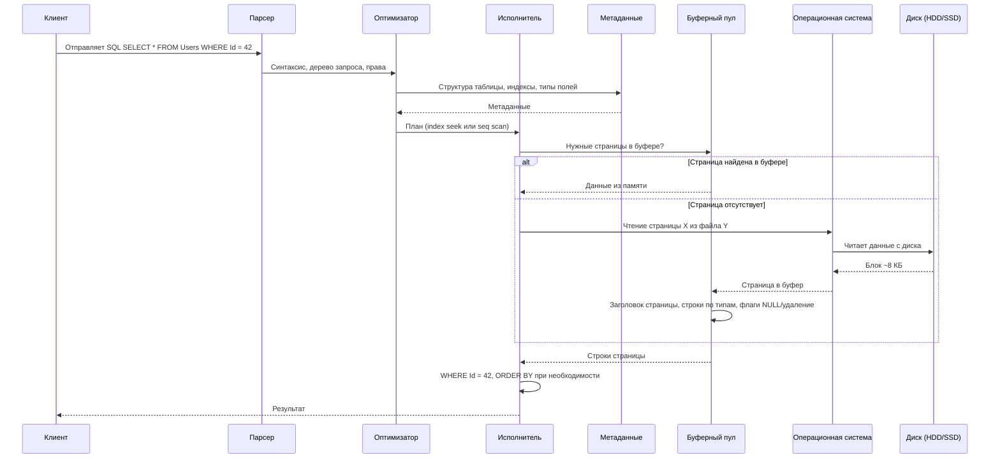

# Внутреннее устройство баз данных

<div class="article-tags">
  <span class="tag tag-required">ОБЯЗАТЕЛЬНО</span>
  <span class="tag tag-beginner">ДЛЯ НОВИЧКОВ</span>
</div>

<span class="complexity-badge">Разработчику</span>
<span class="complexity-badge">Аналитику</span>
<span class="complexity-badge">Тестировщику</span>  
<span class="complexity-badge">Архитектору</span>
<span class="complexity-badge">Инженеру</span>

---

## Как БД работает с данными?

Здесь — путь SQL-запроса от парсера до диска: страницы, буферный пул, индексы, оптимизатор. Схема процессов, shared memory и фоновых задач PostgreSQL — в [Принципах работы SQL-движка](/encyclopedia/3-data-markup/3-07-sql/2.md#архитектура-postgresql-компоненты-субд) и [главе про СУБД](./2.md#процессы-и-память-клиент-сервер-на-примере-postgresql). Теория WAL и согласованности при сбое — в [Теоретических основах](./4.md) и [Восстановлении после сбоя](./8.md). Параллельные транзакции — [Конкурентный доступ](./7.md) и [транзакции в SQL](/encyclopedia/3-data-markup/3-07-sql/77.md).

---

### Работа БД

**Данные в БД**, как и любые файлы, **хранятся** в хранилище, то есть **на диске**. А диск сильно медленнее, чем оперативная память, и при запуске программы, данные читаются с диска, выгружаясь в ОЗУ.

И сам по себе процесс чтения и выгрузки в память довольно долгий. СУБД как раз отвечают за наиболее быстрый и оптимизированный подход к этой задаче.

Приложения выгружают данные с диска (хранилища) в оперативную память. И это работает при открытии файлов - и разумеется, данные в БД тоже хранятся на диске. Такой момент многие могут не учесть при проектировании - качество, стабильность и надёжность диска. Если купить сервера, установить в них дешёвые и объемные диски, то подозрительно странно будет, когда запросы в БД станут выполняться долго, и для пользователей будет всё "тормозить".

База данных - это ящик с данными, который лежит в архиве - хранилище.

**БД не хранит информацию в виде SQL-запросов или табличек из интерфейса**. 

Всё, что вы видите в таблицах, в реальности хранится в виде байтов на диске — это просто файлы, как и любые другие. БД может состоять из одного или нескольких файлов (например, `.mdf`, `.ldf` в SQL Server, `.sqlite` в SQLite, `.ibd` в MySQL). 

Эти файлы содержат **метаданные** (структуры таблиц, индексы), **страницы данных** (строки записей), **информацию о транзакциях** - всё это организовано в блоки или страницы, например, по 8 килобайт. Это позволяет эффективно управлять чтением и кэшированием.

---

<span id="алгоритм-выполнения-запроса"></span>

### Алгоритм выполнения запроса

Когда вы делаете простой SQL-запрос, например:

```sql
SELECT * FROM Users WHERE Id = 42;
```

…СУБД должна найти нужную запись. Сначала запрос проходит **реляционное ядро** (разбор, план, исполнение), затем **движок хранения** (страницы, буфер, транзакции, блокировки). Общая схема слоёв — в [Принципах работы SQL-движка](/encyclopedia/3-data-markup/3-07-sql/2.md#путь-sql-внутри-субд).

| Этап | Компонент | Что происходит |
| :--- | :--- | :--- |
| 1 | Сетевой интерфейс | Клиент передаёт текст SQL; СУБД проверяет сессию и права |
| 2 | Парсер | Синтаксис, дерево запроса, существование таблиц и столбцов |
| 3 | Оптимизатор | Выбор плана — индекс, полный скан, порядок соединений |
| 4 | Исполнитель | Пошаговое выполнение плана (фильтр `WHERE Id = 42`) |
| 5 | Методы доступа + буфер | Поиск страницы в RAM или запрос к диску |
| 6 | Менеджер транзакций | Для записи — журнал WAL, границы commit |
| 7 | Менеджер блокировок | Согласование с другими сессиями (MVCC, блокировки) |
| 8 | Ответ клиенту | Строки результата или статус `UPDATE`/`INSERT` |

Та же цепочка в терминах **Transport Subsystem → Query Processor → Execution Engine → Storage Engine** (дерево разбора, план, менеджеры буфера и восстановления) — с примером `SELECT` — в [четырёх подсистемах обработки SQL](/encyclopedia/3-data-markup/3-07-sql/2.md#четыре-подсистемы-обработки-sql).

#### Физика чтения страницы (этапы 5–7)

После выбора плана **исполнитель** через **методы доступа** ищет страницу в **буферном пуле** — участке RAM, где СУБД держит часто используемые блоки (~8 КБ), чтобы не ходить на диск при каждом обращении.

- Если страница уже в буфере — чтение идёт из памяти.
- Если страницы нет — СУБД просит ОС прочитать блок со страницы X файла Y; ОС обращается к HDD/SSD и передаёт данные в буферный пул.

Дальше СУБД интерпретирует бинарные данные:

1. Читается **заголовок страницы** (тип — данные, индекс, метаданные; указатели; checksum).

>**Метаданные** - это информация о самой структуре данных. 

>Все эти данные тоже хранятся в **особых системных таблицах** или страницах, благодаря метаданным СУБД понимает, где находится нужная таблица, какие поля и типы данных там есть, и какие индексы можно использовать. Будто СУБД сначала вручают "карту", а потом она решает, куда двигаться дальше.

>Поэтому часто данные группируются в схемы.

>Если в таблице есть индекс, например на Id, то вместо того чтобы перебирать все страницы, СУБД ищет значение в структуре индекса, находит указатель на конкретную страницу данных, и загружает только нужную часть данных. Как поиск слова в словаре по алфавитному указателю вместо перелистывания всей книги. Указатели в словарях и есть индексы.

2. Интерпретируются **строки** по типам полей (INT — 4 байта, `DATETIME` — 8 байт и т.д.) и флагам (NULL, пометка удаления).
3. Исполнитель применяет `WHERE Id = 42`, при необходимости `ORDER BY` и отдаёт строки клиенту по сетевому протоколу.

Параллельные сессии на этапах записи согласуются через **менеджер транзакций** (WAL, commit) и **менеджер блокировок** (см. [конкурентный доступ](./7.md)).

Чтение с диска - медленная операция, особенно на HDD. Поэтому современные СУБД стараются минимизировать обращения к диску, использовать буферный пул (буферизированный кэш), и хранить популярные данные в памяти. Для более быстрого I/O использовать лучше SSD.



---

<span id="kogda-optimizaciya-imeet-znachenie"></span>

### Когда оптимизация имеет значение

В **малой** базе на **десятки–сотни строк** в таблице даже «тяжёлый» `SELECT` с полным сканом отрабатывает за миллисекунды. На **миллионах** строк тот же текст без индекса и без продуманных `JOIN` превращается в минуты ожидания и блокировки диска.

Главная функция СУБД в проде — **своевременный ответ** при росте данных и числа сессий. Поэтому оптимизацию изучают вместе с внутренним устройством: план, индексы, буфер, статистика — и с тем, **как формулировать** запрос. Практика тюнинга и настройки сервера — [управление РСУБД](/encyclopedia/3-data-markup/3-08-upravlenie-rsubd/1.md#devyat-rychagov-proizvoditelnosti); разбор `JOIN` — [в SQL](/encyclopedia/3-data-markup/3-07-sql/55.md#kak-sostavit-zapros-s-soedineniyami).

---

<span id="kak-sostavit-zapros-po-shagam"></span>

### Как составить запрос по шагам

Перед набором SQL в IDE полезно пройти цепочку «от результата к источникам» — так меньше лишних столбцов и декартовых произведений.

| Шаг | Вопрос | В SQL |
| :---: | :--- | :--- |
| 1 | **Какие столбцы** и вычисления нужны в ответе? | `SELECT` — только нужное, без `*` в проде |
| 2 | **Из каких таблиц** (и представлений) брать данные? | `FROM` |
| 3 | **Как соединить** таблицы по ключам? | `JOIN` … `ON` |
| 4 | **Какие строки отфильтровать?** | `WHERE` (до агрегации) |
| 5 | **Группировка, сортировка, лимит?** | `GROUP BY`, `HAVING`, `ORDER BY`, `LIMIT` |

Пример: отчёт «активные заказы клиента с суммой по строкам».

1. Столбцы: `order_id`, `order_date`, `line_total`.
2. Таблицы: `orders`, `order_lines`.
3. Соединение: `orders.id = order_lines.order_id`.
4. Фильтр: `orders.status = 'active'` и `orders.customer_id = $1`.
5. Сортировка: `ORDER BY order_date DESC`.

```sql
SELECT o.id,
       o.order_date,
       ol.quantity * ol.unit_price AS line_total
FROM   orders o
JOIN   order_lines ol ON ol.order_id = o.id
WHERE  o.customer_id = $1
  AND  o.status = 'active'
ORDER  BY o.order_date DESC;
```

После черновика — `EXPLAIN (ANALYZE, BUFFERS)` и проверка индексов по полям из `WHERE` и `JOIN` ([типы индексов](#tipy-indeksov-po-role)).

---

## Организация данных в базе

### 1. Логико-математические основы реляционной модели

Реляционная модель данных, предложенная Эдгаром Коддом, опирается на аппарат математической логики и теории множеств. Понимание её логических основ необходимо для осознания границ выразительной мощности реляционных языков, включая SQL.

---

#### WFF-формулы и их роль в спецификации данных

В языках реляционного уровня (например, в реляционном исчислении) выражения строятся как **формулы хорошо построенные (Well-Formed Formulas, WFF)**. WFF — это синтаксически корректная последовательность символов, составленная из переменных, констант, предикатов, логических связок и кванторов в соответствии с правилами формальной логики. Пример WFF в контексте реляционной базы:  

`∃x (Сотрудник(x) ∧ x.отдел = 'ИТ' ∧ x.стаж ≥ 5)`

Эта формула читается как "существует сотрудник x, принадлежащий отделу "ИТ" и имеющий стаж не менее пяти лет". Именно такие формулы лежат в основе декларативного характера SQL: пользователь описывает **что** хочет получить, а не **как** это получить.

---

#### Кортежные переменные и предикаты

В реляционном исчислении различают два подхода: **исчисление кортежей** и **исчисление доменов**. В первом случае переменная (например, `t`) пробегает по множеству **кортежей** некоторого отношения (таблицы). Такая переменная называется **кортежной переменной** и может использоваться в формулах с указанием атрибутов: `t.имя`, `t.зарплата`.

**Предикат** в данном контексте — это утверждение о кортеже, которое может быть истинным или ложным. Например, `Сотрудник(t)` — предикат принадлежности кортежа `t` отношению `Сотрудник`. Предикаты могут быть атомарными (сравнение значений, проверка принадлежности) или составными (с использованием логических операторов).

---

#### Кванторы существования и всеобщности

В реляционном исчислении используются два квантора:
- **Квантор существования (∃)**: утверждает, что существует хотя бы один кортеж, удовлетворяющий формуле.
- **Квантор всеобщности (∀)**: утверждает, что все кортежи во всём отношении удовлетворяют формуле.

Квантор всеобщности не имеет прямого выражения в SQL, но может быть сведён к комбинации отрицания и квантора существования. Например, утверждение "все сотрудники получают более 50 000" эквивалентно: "не существует сотрудника, у которого зарплата `≤` 50 000".

---

#### Целевой список

В реляционном исчислении формула завершается **целевым списком** — перечислением атрибутов (или выражений над ними), которые должны быть включены в результирующее отношение. Например: `{ t.имя, t.зарплата | Сотрудник(t) ∧ t.отдел = 'ИТ' }`. В SQL этому соответствует конструкция `SELECT`.

---

### 2. Архитектура ANSI/SPARC — уровни абстракции данных

Для обеспечения независимости данных от приложений и оптимизации внутренней обработки в 1975 году была предложена трёхуровневая архитектура **ANSI/SPARC**. Эта модель остаётся концептуальной основой большинства современных СУБД.

---

#### Внешнее представление (уровень представления)

**Внешнее представление** (external level, view level) — это совокупность представлений (views), определяемых для конкретных пользователей или приложений. Оно описывает только ту часть данных, которая релевантна данному контексту, скрывая остальную структуру и обеспечивая логическую независимость: изменения в схеме базы не требуют переделки приложений, если представление остаётся неизменным.

Пример: бухгалтеру доступно представление с зарплатами и ФИО, но без данных о проектах; разработчику — представление с проектами и задачами, но без зарплат.

---

#### Концептуальная схема (логический уровень)

**Концептуальная схема** (conceptual schema) — центральный уровень архитектуры. Она описывает всю логическую структуру базы данных: сущности, атрибуты, связи, ограничения целостности, домены и отношения — без привязки к физическому хранению. Именно на этом уровне проектировщики работают с ER-диаграммами и нормальными формами.

Концептуальная схема обеспечивает **логическую целостность** и служит мостом между внешними представлениями и внутренним хранением.

---

#### Внутренняя схема (физический уровень)

**Внутренняя схема** (internal schema) определяет, как данные физически организованы на носителе: форматы файлов, методы сжатия, структуры индексов, стратегии размещения, буферизация. Пользователь обычно не имеет к ней прямого доступа, но от неё напрямую зависит производительность операций.

**Физическая независимость** означает, что изменения во внутренней схеме (например, замена B-дерева на хеш-индекс) не затрагивают концептуальную схему и представления.

---

### 3. Реляционные и булевы операторы в языках запросов

SQL, будучи практичной реализацией реляционной алгебры и исчисления, предоставляет богатый набор операторов, которые можно разделить на **реляционные** и **булевы**.

---

#### Реляционные операторы

Это операции над отношениями: `SELECT`, `PROJECT`, `JOIN`, `UNION`, `INTERSECT`, `EXCEPT`, `DIVIDE`. В SQL им соответствуют конструкции `SELECT ... FROM ...`, `JOIN`, `UNION`, `INTERSECT`, `EXCEPT`. Они формируют **результат как новое отношение**.

---

#### Булевы операторы

Булевы операторы (`AND`, `OR`, `NOT`) применяются к **предикатам** в условиях `WHERE` или `HAVING`. Они управляют логикой отбора строк и строятся на трёхзначной логике (TRUE, FALSE, UNKNOWN), где UNKNOWN возникает при работе с `NULL`.

Особенностью SQL является то, что `UNKNOWN` рассматривается как **неудовлетворяющее условию**: строка включается в результат только если предикат оценивается как `TRUE`.

---

#### Специальные предикатные операторы

SQL поддерживает расширенные предикаты:
- **`IN`**: проверяет принадлежность значения множеству значений или результату подзапроса.
- **`BETWEEN`**: сокращение для двойного сравнения (`x BETWEEN a AND b` ≡ `x ≥ a AND x ≤ b`).
- **`LIKE`**: сопоставление строк по шаблону с подстановочными символами (`%`, `_`).
- **`IS NULL` / `IS NOT NULL`**: единственный корректный способ проверки на `NULL`, так как `NULL = NULL` даёт `UNKNOWN`.
- **`EXISTS`**: проверяет, возвращает ли подзапрос хотя бы одну строку; возвращает `TRUE` или `FALSE`, игнорируя содержимое.
- **`ANY` / `SOME` / `ALL`**: применяются к скалярным подзапросам и сравнивают значение со множеством: `x > ANY (...)` означает, что x больше хотя бы одного элемента.

Оператор `NOT` в контексте этих предикатов может приводить к неочевидным результатам в трёхзначной логике. Например, `NOT (x IN (1, 2, NULL))` эквивалентно `x ≠ 1 AND x ≠ 2 AND x ≠ NULL`, что всегда даёт `UNKNOWN`, если `x` не `NULL`.


---

### 4. Вложенные и связанные подзапросы

В SQL запрос может содержать другой запрос — **подзапрос**. Он используется в условиях (`WHERE`, `HAVING`), в списке выборки (`SELECT`) или даже в `FROM`. Подзапросы делятся на два типа:

---

#### Независимые (некоррелированные) подзапросы

Такой подзапрос **не зависит** от внешнего запроса и может быть выполнен автономно. Его результат вычисляется один раз и используется во всём внешнем запросе. Например:

```sql
SELECT имя FROM Сотрудник
WHERE отдел_id = (SELECT id FROM Отдел WHERE название = 'ИТ');
```

Здесь подзапрос возвращает скалярное значение, не ссылаясь на таблицу `Сотрудник`.

---

#### Связанные (коррелированные) подзапросы

Связанный подзапрос **содержит ссылку на атрибуты внешнего запроса** и выполняется многократно — по одному разу для каждой строки внешнего запроса. Это делает его потенциально дорогостоящим, но мощным инструментом для выражения локальных условий. Пример:

```sql
SELECT имя FROM Сотрудник s1
WHERE зарплата > (SELECT AVG(зарплата) FROM Сотрудник s2 WHERE s2.отдел_id = s1.отдел_id);
```

Здесь для каждого сотрудника `s1` вычисляется средняя зарплата в его отделе (`s2.отдел_id = s1.отдел_id`). Семантически подобные запросы эквивалентны использованию оконных функций, но оконные функции часто эффективнее.

Коррелированные подзапросы тесно связаны с **квантором существования**: конструкция `EXISTS` с коррелированным подзапросом — стандартный способ выразить условие "для данного элемента существует связанный элемент в другой таблице".

---

### 5. Множества и операции над ними в реляционной модели

Реляционная модель основана на **теории множеств**, а не на мультимножествах (bags). Однако SQL по историческим причинам допускает дубликаты, если явно не указано `DISTINCT`. Тем не менее, фундаментальные операции над отношениями остаются теоретико-множественными.

---

#### Основные операции —

- **Объединение (`UNION`)**: объединяет два отношения с одинаковой арностью, удаляя дубликаты (если не указано `ALL`).
- **Пересечение (`INTERSECT`)**: возвращает кортежи, присутствующие в обоих отношениях.
- **Разность (`EXCEPT` или `MINUS`)**: возвращает кортежи из первого отношения, отсутствующие во втором.
- **Декартово произведение (`CROSS JOIN`)**: комбинирует каждый кортеж первого отношения с каждым из второго.

Эти операции **замкнуты**: результат всегда является отношением (множеством кортежей). Это свойство критически важно для композиции запросов и обеспечения предсказуемости семантики.

SQL также предоставляет **реляционное деление** (division), хотя и не имеет для него прямого синтаксиса. Оно моделируется через комбинацию `NOT EXISTS`, `EXCEPT` или оконных функций и выражает условие вида: "найти все X, для которых существует Y для каждого Z" (например, "найти студентов, прошедших все курсы").

---

### 6. Селективность столбца и её роль в оптимизации запросов

**Селективность** — метрика, характеризующая уникальность значений в столбце. Селективность принимает значения в диапазоне `(0, 1]`: чем ближе к 1 — тем выше уникальность (например, первичный ключ), чем ближе к 0 — тем больше дубликатов (например, пол "мужской/женский").

Оптимизатор запросов использует селективность для:
- выбора порядка соединений (менее селективные условия откладываются);
- выбора типа соединения (nested loops vs hash join vs merge join);
- решения о применении индекса (индекс эффективен, если условие отсекает значительную часть строк — то есть, когда селективность высока).

Низкоселективные столбцы могут быть кандидатами для **битовых индексов**, тогда как высокоселективные — для **B-деревьев** или **хешированных индексов**.

---

### 7. Индексные структуры — хешированные, битовые и таблицы индексов

Индексы — вспомогательные структуры, ускоряющие доступ к данным; это первая [стратегия масштабирования](/encyclopedia/3-data-markup/3-08-upravlenie-rsubd/1.md#sem-strategij-masshtabirovaniya) и самый частый [рычаг производительности](/encyclopedia/3-data-markup/3-08-upravlenie-rsubd/1.md#devyat-rychagov-proizvoditelnosti) на уровне схемы. Их проектируют по **паттернам запросов** приложения, а не «на все столбцы». Выбор структуры зависит от типа запросов и характеристик данных.

<span id="pyat-osnovnyh-struktur-indeksov"></span>

#### Пять основных структур индексов

Большинство реляционных и поисковых СУБД опираются на **пять** классических структур. Каждая заточена под свой тип запроса; смешивать их «на всякий случай» бессмысленно — растёт стоимость записи и обслуживания.

| Структура | Что ускоряет | Ограничение | Типичное применение |
| :--- | :--- | :--- | :--- |
| **B-дерево** | Точечный и диапазонный поиск по упорядоченному ключу | Данные могут дублироваться в узлах разных уровней | Учебные модели, отдельные реализации |
| **B⁺-дерево** | Точечный поиск, диапазоны, `ORDER BY` по ключу индекса | Обновления затрагивают дерево и листовой список | PostgreSQL, InnoDB, Oracle, SQL Server |
| **Хеш-индекс** | Точное совпадение `WHERE key = ?` | Диапазоны, сортировка, префикс по ключу | Redis, in-memory движки; редко — `HASH` в PostgreSQL |
| **Битовый (bitmap)** | Фильтр по столбцу с малым числом значений | Частые `UPDATE` по индексируемому столбцу | OLAP, Oracle Bitmap, bitmap scan в PostgreSQL |
| **Инвертированный** | Поиск по слову, токену, тегу | Не заменяет индекс по первичному ключу | Elasticsearch, Lucene, `GIN` по `tsvector` |

Реализация B- и B⁺-деревьев, хеш-таблиц и инвертированных списков — в [§7 и §11.2 структур данных](/encyclopedia/3-data-markup/3-02-struktury-dannyh/2.md#7-b-деревья-и-их-варианты). Ниже — смысл каждой структуры с точки зрения запросов к БД.

##### B-дерево

**B-дерево** (B-tree) — сбалансированное дерево, в котором ключи и **указатели на строки** (или сами поля записи) могут храниться **и во внутренних узлах, и в листьях**. Поиск идёт сверху вниз: на каждом уровне выбирается интервал ключей и спуск по дочернему указателю. Если искомый ключ совпал уже во **внутреннем** узле, обход может завершиться без спуска к листу — это экономит одно чтение страницы в теории, но усложняет диапазонные обходы и поддержание связности при split/merge.

Узлы выровнены под **страницу диска** (4–16 КБ): одно чтение узла — одна случайная I/O. Высота дерева мала (часто 3–4 уровня на миллиарды ключей), потому что в узле много ключей, а не по два, как в двоичном дереве.

##### B⁺-дерево

**B⁺-дерево** — вариант, который доминирует в дисковых OLTP-СУБД. Отличия от классического B-дерева принципиальны:

- **Внутренние узлы** хранят только ключи-разделители для навигации (без полезной нагрузки строки).
- **Все значения ключей и ссылки на строки** лежат **только в листьях**.
- **Листья связаны** в двусвязный список горизонтальными указателями.

Цепочка листьев даёт эффективные **диапазонные сканы** — `WHERE id BETWEEN 10 AND 50`, `ORDER BY indexed_column` — без возврата к корню дерева: движок находит начальный лист по корню и идёт по ссылкам «вправо». Именно поэтому **B⁺-дерево** — стандарт для быстрого поиска **и** сортировки по индексированному столбцу. Подробнее — в [§7.3 B⁺-деревья](/encyclopedia/3-data-markup/3-02-struktury-dannyh/2.md#7-b-деревья-и-их-варианты) и в блоке [B⁺-дерево — почему оно в основе OLTP](#b-plus-derevo-masshtab).

##### Хеш-индекс

**Хеш-индекс** отображает ключ в позицию **корзины** (bucket) через хеш-функцию:

1. **Ключ поиска** (например, `E4` или `user_id = 42`).
2. **Хеш-функция** `f(ключ) → номер корзины` (например, `f("E4") = 5`).
3. **Массив корзин** — в слоте 5 лежит цепочка записей или указатель **на строку таблицы** (RID, первичный ключ, указатель на страницу).

Средняя сложность точечного чтения — **O(1)**; коллизии (разные ключи, один хеш) разрешают цепочкой в корзине или открытой адресацией. Хеш **перемешивает** порядок ключей, поэтому запросы `BETWEEN`, `ORDER BY` по этому индексу и префиксный поиск по строке **не поддерживаются** — нужно B⁺-дерево или отдельный индекс. Хеш уместен для кэшей, справочников «ключ → строка» и редких `HASH`-индексов в реляционных СУБД. См. [хешированные индексы](#хешированные-индексы).

##### Битовый индекс

**Битовый индекс** (bitmap index) выгоден, когда у столбца **мало различных значений** (низкая кардинальность) — статус `ACTIVE` / `INACTIVE`, пол, флаг, код региона из десятка вариантов.

Для каждого значения домена строится **битовая карта** длиной в число строк таблицы (или сегмента): бит `i` равен `1`, если в строке `i` стоит это значение, иначе `0`. Пример для столбца `status`:

| row_id | status | Bitmap_ACTIVE | Bitmap_INACTIVE |
| :---: | :--- | :---: | :---: |
| 1 | ACTIVE | 1 | 0 |
| 2 | INACTIVE | 0 | 1 |
| 3 | ACTIVE | 1 | 0 |

Запрос `WHERE status = 'ACTIVE' AND region = 'EU'` сводится к **побитовому AND** двух карт — операция дешёвая на CPU и хорошо сочетается с OLAP-фильтрами. При частых обновлениях строк карты пересчитываются дорого; для «горячих» OLTP-таблиц чаще выбирают B⁺-дерево. Подробнее — [битовые индексы](#битовые-индексы-bitmap-indexes).

##### Инвертированный индекс

**Прямой (forward) индекс** отвечает на вопрос «какие термины встречаются в документе *D*?» — `документ 1 → {Tiger, …}`. **Инвертированный индекс** переворачивает направление: **термин → список документов** (и часто позиции внутри текста):

- `Tiger` → документы `1`, `3`
- `Lion` → документы `2`, `5`

Запрос «найти все тексты со словом *database*» читает список для термина `database`; запрос из нескольких слов — **пересечение** или **объединение** списков (AND/OR). Так устроены **полнотекстовый поиск** (Elasticsearch, Lucene), инвертированные файлы в аналитике и расширения вроде `GIN` по `tsvector` в PostgreSQL. Реляционная таблица с B⁺ по `id` остаётся источником строк; инвертированный индекс закрывает `WHERE text @@ '…'`. См. [§11.2.5](/encyclopedia/3-data-markup/3-02-struktury-dannyh/2.md#1125-инвертированный-индекс) и [алгоритмы поиска](/encyclopedia/4-code-dev/4-01-algoritmy/2.md).

<div class="callout callout--info">
  <div class="callout-title">Как выбрать структуру под запрос</div>
  Точное равенство по высокоселективному ключу — B⁺ или хеш. Диапазон и сортировка — B⁺. Много фильтров по «узким» категориям в отчётах — битовые карты. Поиск слов в тексте — инвертированный индекс. Потоковая запись и LSM — в [расширенной таблице](#vosem-struktur-indeksa-i-hraneniya) ниже.
</div>

<span id="vosem-struktur-indeksa-i-hraneniya"></span>

#### Восемь структур под капотом индексов и хранения

Классические **B⁺, хеш, bitmap и инвертированный** индекс разобраны выше — [пять основных структур](#pyat-osnovnyh-struktur-indeksov). Ниже — расширенная шпаргалка: **где** живут данные (RAM или диск), **какой** тип запроса ускоряют и **где** встречается на практике (включая LSM, skip list, пространственные и текстовые структуры). Подробные реализации и сложность операций — в [структурах данных для СУБД](/encyclopedia/3-data-markup/3-02-struktury-dannyh/2.md#112-subd-indeksy-i-hranenie); LSM и SSTable в контексте NoSQL — в [Основах NoSQL](/encyclopedia/3-data-markup/3-06-nosql/2.md).

| Структура | Среда | Типичный запрос | Где встречается |
| :--- | :--- | :--- | :--- |
| **Skip list** (пропускающий список) | ОЗУ | Упорядоченный поиск, вставка, диапазон в памяти | Memtable LSM-движков; sorted set в Redis ([ZSET](/encyclopedia/3-data-markup/3-06-nosql/51)) |
| **Хеш-индекс** | ОЗУ | Точное совпадение ключа за **O(1)** в среднем | In-memory СУБД и кэши (Redis, VoltDB); см. ниже [хешированные индексы](#хешированные-индексы) |
| **SSTable** (Sorted String Table) | Диск | Неизменяемый отсортированный файл «ключ → значение» | Уровни LSM после flush; [глоссарий SSTable](/glossary/S#sstable) |
| **LSM-дерево** | ОЗУ + диск | Потоковая **запись**, последующее слияние файлов | Cassandra, RocksDB, LevelDB; [memtable / SSTable](/encyclopedia/3-data-markup/3-06-nosql/intro) |
| **B⁺-дерево** | Диск (страницы) | Точечный и **диапазонный** поиск по ключу | PostgreSQL, MySQL InnoDB, Oracle, SQL Server — [§7 в структурах](/encyclopedia/3-data-markup/3-02-struktury-dannyh/2.md#7-b-деревья-и-их-варианты) |
| **Инвертированный индекс** | Индекс поиска | «Документы, где есть слово *X*» | Elasticsearch, Lucene, полнотекст в СУБД |
| **Суффиксное дерево / массив** | Строка или индекс | Подстрока, префикс, повторы в тексте | Биоинформатика, сжатие (BWT); [§8](/encyclopedia/3-data-markup/3-02-struktury-dannyh/2.md#8-суффиксные-структуры) |
| **R-дерево** | Пространственный индекс | Объекты в прямоугольнике, ближайший сосед | PostGIS, ГИС; [геометрические структуры](/encyclopedia/3-data-markup/3-02-struktury-dannyh/12.md) |

**Как читать таблицу.** Структуры из верхних строк (skip list, хеш) заточены под **быструю работу в RAM**. B⁺-дерево и SSTable учитывают **страницу диска** (4–16 КБ) — одно чтение узла = одна I/O. LSM объединяет оба мира: пишем в память (часто skip list), сбрасываем на диск неизменяемыми SSTable и периодически **компактируем** уровни. Инвертированный, суффиксный и R-индексы решают задачи **поиска по тексту, подстроке и координатам**, а не заменяют первичный ключ таблицы.

<span id="b-plus-derevo-masshtab"></span>

#### B⁺-дерево — почему оно в основе OLTP

В **B⁺-дереве** все значения ключей и указатели на строки лежат в **листьях**; внутренние узлы хранят только границы диапазонов для навигации. Листья связаны списком — отсюда эффективные диапазонные запросы (`BETWEEN`, `ORDER BY` по индексированному столбцу). Высота дерева мала (часто 3–4 уровня на миллиарды ключей), потому что в узел помещается много ключей размером со **страницу** диска. При вставке узел может **расколоться** (split); при удалении — сливаться с соседом. PostgreSQL (B-tree), InnoDB, SQL Server — варианты B⁺ или близкие B-tree для первичных и вторичных индексов.

<span id="lsm-derevo-masshtab"></span>

#### LSM-дерево — запись в поток, чтение через уровни

**LSM** (Log-Structured Merge) оптимизирует **последовательную запись**: новые пары «ключ → значение» попадают в **memtable** (RAM), журналируются в WAL, затем flush превращает отсортированный снимок в **SSTable** на диске. Фоновая **compaction** сливает перекрывающиеся файлы и удаляет устаревшие версии ключей. Чтение по ключу может затронуть memtable и несколько SSTable на разных **уровнях** (L0…Ln) — отсюда настройки compaction и bloom-фильтры на файлах. Cassandra, RocksDB, LevelDB, HBase — типичные LSM-движки; сравнение с B⁺ в контексте масштабирования — [опорные темы](./12.md#1-структуры-хранения-и-журнал).

<span id="tipy-indeksov-po-role"></span>

#### Типы индексов по роли — primary, clustered, secondary

Помимо **структуры** хранения (B⁺, хеш, bitmap — [пять основных](#pyat-osnovnyh-struktur-indeksov)), индексы классифицируют по **роли в цепочке доступа к строке**. Три типа, которые стоит держать в голове при разборе `EXPLAIN` и проектировании схемы:

| Тип | Вопрос, на который отвечает | Влияет на физический порядок строк |
| :--- | :--- | :--- |
| **Primary (первичный)** | Где строка с данным ключом первичного файла / PK? | Зависит от того, кластеризован ли PK |
| **Clustered (кластерный)** | В каком порядке строки **лежат на диске**? | **Да** — задаёт порядок хранения |
| **Secondary (вторичный)** | Как найти строки по **другому** столбцу (email, статус)? | **Нет** — только отдельная структура поиска |

##### Primary index — плотный и разреженный

**Первичный индекс** строят по ключу упорядоченного файла данных (часто это **первичный ключ** таблицы). Различают два способа связи индекса с записями:

| Вариант | Запись в индексе | Поиск | Память индекса |
| :--- | :--- | :--- | :--- |
| **Плотный (dense)** | На **каждое** значение ключа поиска — своя запись с указателем на строку | Прямой переход по индексу | Больше |
| **Разреженный (sparse)** | Только на **первый ключ блока** (страницы) данных; внутри блока — последовательный просмотр | Индекс → блок → поиск в блоке | Меньше |

В учебных моделях разреженный индекс экономит место на очень больших последовательных файлах. В современных СУБД первичный ключ почти всегда обслуживается **B⁺-деревом** с плотными листьями; разреженность чаще проявляется на уровне **блоков страниц**, а не «одна запись индекса на миллион строк».

`PRIMARY KEY` в SQL создаёт уникальный индекс по ключу; в InnoDB этот индекс одновременно **кластерный** (см. ниже).

##### Clustered index — физический порядок строк

**Кластерный индекс** (clustered index) определяет, в каком порядке строки таблицы **физически записаны** на диске (в пределах экстента/файла таблицы). Диапазонные запросы по ключу кластеризации читают соседние страницы подряд — минимум случайных I/O.

- **MySQL InnoDB** — кластерный индекс совпадает с **первичным ключом**; листья B⁺-дерева PK содержат **все столбцы строки**. Вторичные индексы хранят значение своего ключа и **PK** для обратного поиска строки.
- **SQL Server** — один **clustered index** на таблицу (часто на PK; можно выбрать другой столбец). Остальные индексы — **nonclustered**.
- **PostgreSQL** — таблицы по умолчанию **heap** (порядок вставки); кластеризацию можно задать командой `CLUSTER` по индексу (разовая перестройка, порядок не гарантируется при последующих INSERT без повторного `CLUSTER`).

На таблицу обычно приходится **не больше одного** кластерного индекса: физически строки можно упорядочить только одним ключом. [Индекс-организованные таблицы (IOT)](#indeks-tablicy-iot) — частный случай, когда «таблица» и есть B⁺-дерево по PK.

##### Secondary index — поиск по не-PK полям

**Вторичный индекс** строят по столбцу, который **не** задаёт кластеризацию — `email`, `status`, внешний ключ для `JOIN`. Физический порядок таблицы он **не меняет**; это отдельное B⁺-дерево (или иная структура) для быстрого поиска по этому полю, в том числе по **неуникальным** значениям (несколько строк с одним email — в индексе несколько записей с разными `id`).

Типичная цепочка чтения в heap- или InnoDB-модели:


1. Оптимизатор идёт во **вторичный индекс** по `email`.
2. Из листа индекса получает **первичный ключ** (или указатель на блок — RID в heap-СУБД).
3. По PK проходит **первичный / кластерный** индекс (или таблицу) и читает полную строку.

Отсюда **двойное обращение** (double lookup) при вторичном индексе на heap-таблице и почему покрывающие индексы (`INCLUDE`, index-only scan) экономят один проход — см. [сложные индексы SQL](/encyclopedia/3-data-markup/3-07-sql/884.md).

<div class="callout callout--tip">
  <div class="callout-title">Как не перепутать термины</div>
  **Primary** — про ключ идентификации строки. **Clustered** — про физический порядок на диске (в InnoDB PK = clustered). **Secondary** — любой дополнительный индекс для запросов по другим столбцам. Структура под капотом почти всегда B⁺ — см. [пять структур](#pyat-osnovnyh-struktur-indeksov).
</div>

<span id="vtorichnye-indeksy"></span>

#### Вторичные индексы — практика в SQL

**Первичный ключ** индексируется автоматически и однозначно идентифицирует строку. **Вторичный индекс** создают явно (`CREATE INDEX`) по столбцам из `WHERE`, `JOIN`, `ORDER BY`. Каждая вставка и обновление затрагивает страницы всех затронутых индексов — проектируют их под реальные запросы, а не «на все поля».

| Модель таблицы | Что хранит вторичный индекс | Как находится строка |
| :--- | :--- | :--- |
| **Heap** (PostgreSQL по умолчанию) | Значение ключа + **TID** (физический адрес версии строки) или PK | Индекс → TID / PK → heap |
| **InnoDB** | Значение ключа + **PK** (PK всегда в листе вторичного индекса) | Индекс → кластерный PK → лист с данными |
| **IOT** | Значение ключа + PK | Индекс → узел B⁺ по PK без отдельной кучи |

Роль вторичного индекса в цепочке lookup — [типы по роли](#tipy-indeksov-po-role). Составные, частичные и покрывающие варианты — [сложные индексы SQL](/encyclopedia/3-data-markup/3-07-sql/884.md).

<div class="callout callout--tip">
  <div class="callout-title">Связь с оптимизатором</div>
  Оптимизатор SQL выбирает **план** (индексный доступ, полное сканирование, hash join), но не меняет физическую структуру индекса. Понимание восьми типов помогает объяснить, почему `WHERE id = 42` и `WHERE id BETWEEN 1 AND 1000` ведут себя по-разному и почему полнотекстовый поиск выносят в отдельный движок.
</div>

---

<span id="хешированные-индексы"></span>

#### Хешированные индексы

Основаны на хеш-функции, отображающей ключ в номер **корзины** в массиве слотов. В корзине хранится указатель на строку (или цепочка коллизий). Обеспечивают **O(1)** доступ в среднем при точном совпадении (`WHERE id = 123`). Диапазоны (`WHERE id BETWEEN 100 AND 200`), сортировка по ключу индекса и префиксный поиск по строке **не поддерживаются** — порядок ключей задаёт хеш, а не сравнение. Применяются в кэшах (Redis), in-memory СУБД и точечном OLTP; обзор механизма — [хеш-индекс в пяти структурах](#pyat-osnovnyh-struktur-indeksov).

---

<span id="битовые-индексы-bitmap-indexes"></span>

#### Битовые индексы (bitmap indexes)

Используются для столбцов с **низкой селективностью** (статусы, категории, пол, булевы флаги). Для каждого значения домена создаётся **битовая карта**: бит с номером строки равен `1`, если в этой строке стоит данное значение, иначе `0`. Сложные фильтры сводятся к побитовым `AND`, `OR`, `NOT` на уровне CPU — это дешевле, чем многократно сканировать таблицу. Эффективны в **OLAP** и витринах с редкими обновлениями индексируемых столбцов; при частых `INSERT`/`UPDATE` стоимость пересборки карт растёт. Сравнение с B⁺ и хешом — [пять основных структур](#pyat-osnovnyh-struktur-indeksov).

---

<span id="indeks-tablicy-iot"></span>

#### Индекс-таблицы (Index-Organized Tables, IOT)

В отличие от кучевых таблиц (heap tables), где данные хранятся в произвольном порядке, а индекс ссылается на физические адреса, **индекс-таблица** хранит **сами данные внутри структуры индекса** (обычно B⁺-дерева по PK). Это частный случай **кластерного** индекса ([типы по роли](#tipy-indeksov-po-role)) и устраняет отдельный проход к heap после поиска по PK. IOT особенно эффективны, когда:
- запросы почти всегда идут по первичному ключу;
- таблица состоит в основном из ключа и нескольких атрибутов;
- важна компактность хранения (нет дублирования ключа в индексе и данных).

Недостаток — сложность в управлении вторичными индексами (они ссылаются на первичный ключ, а не на физический адрес), что может привести к увеличению стоимости соединений.

---

### 8. Вычисляемые столбцы

**Вычисляемый (виртуальный или сохраняемый) столбец** — атрибут, значение которого выводится из других столбцов той же строки. Синтаксис **зависит от СУБД**:

```sql
-- PostgreSQL
ALTER TABLE product ADD COLUMN line_total numeric(12,2)
  GENERATED ALWAYS AS (price * quantity) STORED;

-- SQL Server
ALTER TABLE product ADD line_total AS (price * quantity) PERSISTED;

-- Oracle (близко к классическому варианту)
ALTER TABLE product ADD (
  line_total AS (price * quantity) VIRTUAL
);
```

Существует два варианта реализации:
- **Виртуальный (virtual)**: значение вычисляется при каждом обращении, не занимает место на диске, но может замедлять запросы.
- **Сохраняемый (stored)**: значение вычисляется при вставке/обновлении и физически хранится как обычный столбец. Это ускоряет чтение, но увеличивает объём хранения и накладывает накладные расходы на запись.

Вычисляемые столбцы полезны для:
- стандартизации сложных выражений (например, налог, возраст, хэш от данных);
- поддержки инвариантов без триггеров;
- оптимизации запросов: если выражение часто используется в `WHERE`, его можно индексировать, если столбец сохраняемый.

Некоторые СУБД (например, SQL Server, PostgreSQL с генерируемыми столбцами, Oracle) поддерживают индексацию виртуальных столбцов при условии детерминированности функции.

---

### 9. Физическое размещение данных

Физическое размещение определяет, **как и где** данные хранятся на диске, в оперативной памяти и кэшах. От этого напрямую зависит производительность операций чтения/записи, отказоустойчивость и масштабируемость.

---

#### Основные принципы

- **Страницы (pages)** — минимальная единица ввода-вывода. Обычно имеют размер 4–16 КБ. При запросе строки СУБД читает всю страницу, содержащую эту строку.
- **Экстенты (extents)** — набор смежных страниц, выделяемых таблице или индексу. Уменьшают фрагментацию.
- **Сегменты (segments)** — логические контейнеры для хранения объектов (например, сегмент таблицы, сегмент индекса).
- **Табличные пространства (tablespaces)** — виртуальные хранилища, сопоставленные с физическими файлами или дисками. Позволяют управлять размещением: например, разнести "горячие" и "холодные" данные по разным дискам.

---

#### Расположение строк

В кучевых таблицах (heap-organized tables) строки добавляются в первую подходящую свободную страницу. В индекс-организованных таблицах (IOT) — в узлы B-дерева согласно ключу. В колоночных СУБД — данные размещаются по столбцам: все значения одного атрибута хранятся последовательно, что выгодно для аналитических запросов с агрегацией.

Физическое размещение влияет на:
- **локальность данных** (строки, часто используемые вместе, желательно хранить близко — например, через clustering index);
- **фрагментацию** (логическая последовательность не совпадает с физической → больше I/O);
- **параллелизм** (разделение данных по файлам позволяет задействовать несколько дисков или узлов).

---

### 10. Партиционирование

**Партиционирование** — это метод логического и физического деления большой таблицы на меньшие части (**партиции**) по определённому критерию, при этом сохраняя единый логический интерфейс. Это один из ключевых механизмов масштабирования в OLTP и особенно OLAP и один из [девяти типовых приёмов ускорения БД](/encyclopedia/3-data-markup/3-08-upravlenie-rsubd/1.md#devyat-rychagov-proizvoditelnosti) (внутри одного экземпляра СУБД, в отличие от шардинга по серверам).

---

#### Типы партиционирования

- **Диапазонное (range)**: партиции формируются по диапазонам значений (например, по датам: `2023-Q1`, `2023-Q2` и т.д.).
- **Списковое (list)**: партиции соответствуют явно заданным значениям (например, `регион IN ('Москва', 'СПб')`).
- **Хешированное (hash)**: значения ключа прогоняются через хеш-функцию, результат определяет партицию. Обеспечивает равномерное распределение.
- **Композитное**: комбинация вышеперечисленных (например, сначала по году — диапазон, затем по региону — хеш).

---

#### Преимущества

- **Партиционное прореживание (partition pruning)**: оптимизатор исключает из плана выполнения запроса те партиции, которые заведомо не содержат искомые данные. Это резко снижает объём сканируемых данных.
- **Изолированное обслуживание**: можно архивировать, резервировать или восстанавливать отдельные партиции без влияния на всю таблицу.
- **Параллельная обработка**: разные партиции могут обрабатываться разными потоками или даже разными узлами в распределённой СУБД.

---

#### Типы партиционирования по структуре

- **По таблице** (table partitioning): данные разделяются на уровне таблицы.
- **По индексу** (index partitioning): индексы могут быть **локальными** (каждая партиция таблицы имеет свой индекс) или **глобальными** (единый индекс по всей таблице).

Локальные индексы предпочтительны при частых DML-операциях с отдельными партициями, так как не требуют перестройки всего индекса.

---

#### Шардинг и партиционирование

**Партиционирование** в одной СУБД делит таблицу на части внутри **одного** (или кластерного) экземпляра: оптимизатор отсекает лишние партиции, проще архивировать старые месяцы. **Шардинг** распределяет данные по **разным серверам**; каждый шард — отдельный узел (часто со своей репликой). Логика разреза похожа (диапазон, список, хеш), но шардинг снимает потолок одной машины и добавляет маршрутизацию запросов.

При проектировании высокой нагрузки сначала обычно используют партиции и реплики чтения; шардинг подключают, когда одного primary недостаточно по записи или объёму. Критерии ключа шарда (кардинальность, частота, монотонные ID) и паттерны маршрутизации — в [шпаргалке по распределённым системам](/encyclopedia/7-project/7-06-proektirovanie-i-arhitektura/141.md#9-шардирование-sharding) и в [масштабируемости](/encyclopedia/7-project/7-06-proektirovanie-i-arhitektura/2.md).

---

### 11. Управление статистикой

**Статистика** — это метаданные о распределении данных, которые **оптимизатор запросов** использует для построения эффективного плана выполнения. Без актуальной статистики оптимизатор действует на основе предположений, что часто приводит к неэффективным планам.

---

#### Что включает статистика?

- Количество строк в таблице (`row count`);
- Количество страниц/блоков;
- Средняя длина строки;
- Распределение значений в столбцах:
  - гистограммы (частота значений, границы диапазонов);
  - количество уникальных значений;
  - наиболее частые значения (most common values, MCV);
  - селективность предикатов.

---

#### Сбор статистики

СУБД предоставляют команды для сбора статистики:
- `ANALYZE` (PostgreSQL);
- (SQL Server);

```sql
UPDATE STATISTICS
```
- `DBMS_STATS.GATHER_TABLE_STATS` (Oracle).

Статистика может собираться:
- **полностью** (по всем строкам — точно, но дорого);
- **выборочно** (по случайной подвыборке — быстрее, но менее точно).

---

#### Автоматизация и свежесть

Современные СУБД поддерживают **автоматический сбор статистики** при достижении порога изменений (например, после изменения 10% строк). Однако в системах с резкими изменениями распределения (например, ежедневная загрузка данных в хранилище) требуется **ручной или расписанный пересбор**.

---

#### Влияние на планы

Пример: если статистика устарела и оптимизатор полагает, что в таблице 1 000 строк, а на деле их 1 000 000, он может выбрать **последовательное сканирование** вместо **поиска по индексу**, что приведёт к катастрофическому замедлению.

Статистика также критична для оценки **кардинальности соединений** и **сложных условий с корреляцией между столбцами** (например, `город = 'Москва' AND страна = 'Германия'`). Для таких случаев некоторые СУБД поддерживают **мультиколоночную статистику**.

---
