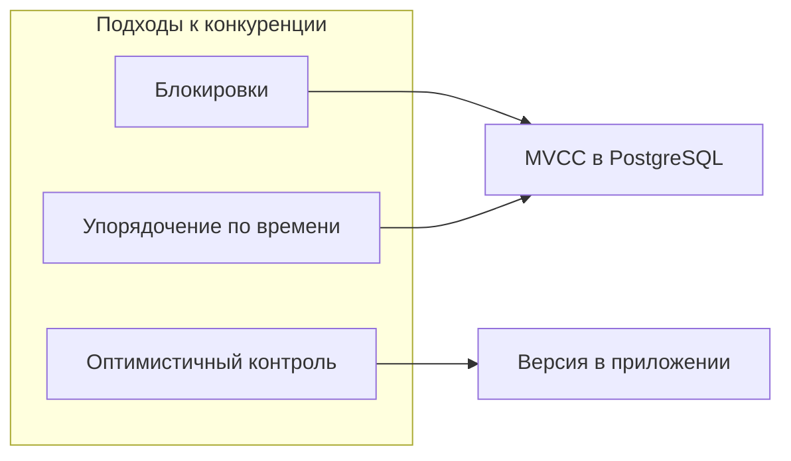
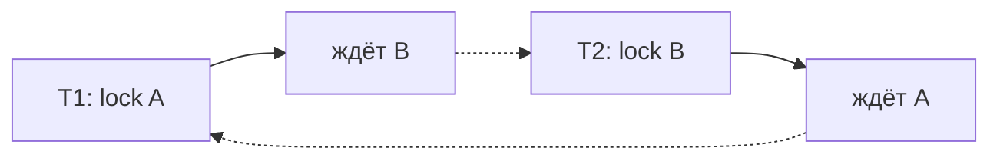

# Конкурентный доступ к данным

<div class="article-tags">
  <span class="tag tag-required">ОБЯЗАТЕЛЬНО</span>
  <span class="tag tag-beginner">ДЛЯ НОВИЧКОВ</span>
</div>

<span class="complexity-badge">Разработчику</span>
<span class="complexity-badge">Аналитику</span>
<span class="complexity-badge">Архитектору</span>

---

## С чего начать

Представьте два кассовых терминала, которые одновременно списывают деньги с одного счёта, или два менеджера, которые меняют остаток на складе. Без правил вы получите **неверный баланс**: последняя запись "победит", первая списание **исчезнет** из истории, хотя клиент уже получил чек.

**Конкурентный доступ** — ситуация, когда много клиентов (приложений, пользователей, фоновых задач) **одновременно** читают и пишут **одни и те же** строки в БД. СУБД обязана сохранить **согласованность**: цифры в отчёте сходятся с реальностью, деньги никуда не "испаряются".

Для этого существуют:

- **транзакции** — пакет операций "всё или ничего";
- **уровни изоляции** — насколько одна транзакция видит чужую незавершённую работу;
- **блокировки**, **MVCC**, **оптимистичный контроль** — разные способы разрулить конфликт.

В [главе про транзакции в SQL](/encyclopedia/3-data-markup/3-07-sql/77.md) — синтаксис `BEGIN`, `COMMIT`, `SET TRANSACTION`, блокировки в PostgreSQL. Здесь — **картина целиком** для новичка: зачем три подхода в учебниках и что из этого реально делает PostgreSQL.

---

### Словарик главы

| Термин | Простыми словами |
| :--- | :--- |
| **Транзакция** | Группа SQL-команд, которая завершается `COMMIT` (сохранить) или `ROLLBACK` (отменить всё). |
| **ACID** | Четыре свойства надёжной транзакции (ниже — по буквам). |
| **Блокировка** | "Занято" — другая транзакция ждёт или получает ошибку. |
| **MVCC** | Хранение нескольких **версий** строки; читатели реже ждут писателей. |
| **Гонка (race)** | Две операции "бегут" параллельно; результат зависит от порядка — опасно. |
| **Deadlock** | T1 ждёт T2, T2 ждёт T1 — обе стоят, пока СУБД одну не откатит. |

---

## Транзакции — атомарность изменений в БД

**Транзакция** — пакет операций "всё или ничего" с гарантиями **ACID**:

| Буква | Английское | Смысл для новичка |
| :---: | :--- | :--- |
| **A** | Atomicity | Либо все шаги применились, либо ни один (при сбое — откат). |
| **C** | Consistency | После commit соблюдаются правила схемы (ключи, `CHECK`). |
| **I** | Isolation | Параллельные транзакции **не мешают** друг другу сверх выбранного уровня. |
| **D** | Durability | После `COMMIT` результат переживёт сбой (через WAL — см. [8.md](./8.md)). |

**I** (*Isolation*) — центр этой главы: насколько одна транзакция "видит" незавершённую работу другой.

**Минимальный скелет в SQL:**

```sql
BEGIN;                    -- начало транзакции (в PostgreSQL часто неявно)

UPDATE accounts
SET balance = balance - 100
WHERE id = 1;

UPDATE accounts
SET balance = balance + 100
WHERE id = 2;

COMMIT;                   -- зафиксировать оба UPDATE
-- ROLLBACK;              -- отменить всё с момента BEGIN
```

Если между двумя `UPDATE` упадёт сервер — при перезапуске СУБД **откатит** незавершённую транзакцию: перевод "зависнет" наполовину.

Без транзакций приложение вручную пишет "если второй UPDATE упал — откати первый" — при сбое питания или таймауте сети эта логика **ломается**.

---

## Три подхода в теории СУБД

В учебниках по базам данных обычно выделяют три семейства решений. В реальных продуктах они **смешиваются** (например, MVCC + блокировки при конфликте).



---

### 1. Блокировки (pessimistic locking)

**Идея:** прежде чем читать или менять данные, транзакция **захватывает блокировку** на ресурс (строку, страницу, таблицу). Другие ждут или получают ошибку.

**Плюсы:** понятная модель; легко предотвратить конфликт заранее.

**Минусы:** ожидания, риск **взаимоблокировки** (deadlock), при грубых блокировках — падает параллелизм.

**В SQL:**

```sql
-- PostgreSQL: явная блокировка строки на время транзакции
BEGIN;
SELECT balance FROM accounts WHERE id = 1 FOR UPDATE;
UPDATE accounts SET balance = balance - 100 WHERE id = 1;
COMMIT;
```

**Разбор `FOR UPDATE`:**

- читаем строку счёта;

```sql
SELECT … FROM accounts WHERE id = 1
```
- `FOR UPDATE` — "забронируй эту строку для **моей** транзакции до `COMMIT`";
- другая транзакция с `FOR UPDATE` по тому же `id` **подождёт**;
- `UPDATE` уже меняет заблокированную строку без сюрприза "кто-то успел между чтением и записью".

Подробнее: [Блокировки в PostgreSQL](/encyclopedia/3-data-markup/3-07-sql/110.md), [77.md](/encyclopedia/3-data-markup/3-07-sql/77.md).

**Когда уместно:** высокая конкуренция за **одну и ту же** запись (склад, билеты, бронь мест), **короткие** транзакции (миллисекунды–секунды, не минуты формы в браузере).

---

### 2. Упорядочение по меткам времени (timestamp ordering)

**Идея:** каждой транзакции присваивается **метка времени** (логические часы, не обязательно `clock_timestamp()` из SQL). Операции выполняются так, как если бы транзакции шли **в порядке меток**. Если транзакция с более поздней меткой пытается прочитать "устаревшее" значение, её **откатывают** и перезапускают.

**Плюсы:** в чистом виде — теоретическая простота; читатели не блокируют писателей.

**Минусы:** откаты при конфликте; на практике чистый T/O в промышленных РСУБД редок — чаще его идеи пересекаются с MVCC и версионированием.

**Связь с жизнью:** когда вы видите в таблице столбец `updated_at` или `version` и сравниваете "кто новее" — это **родственная** идея упорядочения, но уже на уровне приложения или оптимистичного контроля (ниже).

---

### 3. Оптимистичный контроль (optimistic concurrency control)

**Идея:** транзакции **не блокируют** данные при чтении. Каждый читает копию, считает новое значение, а при **записи** проверяет: "никто не изменил строку с момента моего чтения?" Если изменил — **отказ** (`UPDATE` затронул 0 строк) и повтор с бизнес-логикой.

**Реализация в БД:** столбец версии или ` xmin`/системные поля MVCC; в приложении — `WHERE id = ? AND version = ?`.

```sql
-- Учебный пример: версия строки
UPDATE products
SET price = 1990, version = version + 1
WHERE id = 42 AND version = 7;
-- Если version уже 8, UPDATE не обновит строку — конфликт
```

**Плюсы:** отлично при **редких** конфликтах на одной записи; много параллельных читателей.

**Минусы:** нужна обработка повторов; при частых конфликтах на одном ключе хуже, чем `FOR UPDATE`.

**Когда уместно:** профили пользователей, справочники, документы, где одновременно правят редко; REST API с полем `etag` / `version`.

---

## MVCC — то, что вы реально используете в PostgreSQL

**MVCC** (*Multi-Version Concurrency Control*) — "многоверсионность": при `UPDATE` строка **не затирается на месте** — создаётся **новая версия**, старая остаётся, пока её читает другая транзакция.

**Аналогия:** журнал правок в Google Docs. Вы видите свою "версию документа на 10:00", коллега — на 10:01; сервер хранит обе, пока обе нужны.

**Что это даёт новичку:**

- `SELECT` (чтение) обычно **не блокирует** `UPDATE` (запись) в другой транзакции;
- при конфликте **двух** `UPDATE` одной строки блокировки **всё равно** есть — победит тот, кто второй дождётся или получит deadlock;
- старые версии копятся → нужен **`VACUUM`** в PostgreSQL (очистка "мёртвых" строк), иначе растёт размер таблицы.

**Важно:** MVCC дополняет блокировки, а не заменяет их полностью.

В [77.md](/encyclopedia/3-data-markup/3-07-sql/77.md): чтение по MVCC в PostgreSQL обычно не блокирует запись. Углубление — [110.md](/encyclopedia/3-data-markup/3-07-sql/110.md).

**InnoDB (MySQL)** тоже использует MVCC в `REPEATABLE READ` — детали: [883](/encyclopedia/3-data-markup/3-07-sql/883.md).

---

## Уровни изоляции — что вы "покупаете"

Уровень изоляции — настройка **I** из ACID: какие **аномалии** допустимы между параллельными транзакциями.

| Аномалия | Суть простыми словами |
| :--- | :--- |
| **Грязное чтение** | Видеть чужие **незакоммиченные** изменения |
| **Неповторяемое чтение** | Два `SELECT` в одной транзакции дают **разный** результат |
| **Фантомы** | Появляются **новые строки**, подходящие под условие |

Таблица уровней и синтаксис `SET TRANSACTION` — в [77.md](/encyclopedia/3-data-markup/3-07-sql/77.md). Запомните практику: по умолчанию в PostgreSQL — `READ COMMITTED`; для строгой сериализуемости — `SERIALIZABLE` (цена — больше откатов/ожиданий).

---

## Как выбрать подход (практическая шпаргалка)

| Ситуация | Что чаще работает |
| :--- | :--- |
| Перевод денег, списание со склада, бронь с ограниченным числом мест | Транзакция + `SELECT … FOR UPDATE` или строгая изоляция |
| Много чтений, редкие правки одной строки | Оптимистичный `version` / `updated_at` |
| Отчёты, аналитика, длинное чтение без записи | Снимок, реплика read-only, уровень `REPEATABLE READ` / MVCC |
| Распределённая система без одной СУБД | Saga, идемпотентность, eventual consistency — уже [архитектура](/encyclopedia/7-project/7-06-proektirovanie-i-arhitektura/design/116), не классический ACID на одном узле |

Чек-лист проектировщика в [design/116](/encyclopedia/7-project/7-06-proektirovanie-i-arhitektura/design/116) напоминает про пункт 12: "возможна ли параллельная запись?" — имеется в виду именно это.

---

## Параллельные транзакции и производительность

**Параллелизм** — не "включить 100 потоков и всё ускорится". Узкие места:

- блокировки на горячих строках;
- рост WAL и fsync при многих мелких коммитах;
- bloat от MVCC без обслуживания (`VACUUM` в PostgreSQL).

Оптимизация запросов ([881.md](/encyclopedia/3-data-markup/3-07-sql/881.md)) не заменяет правильную модель конкуренции: быстрый `UPDATE` всё равно встанет в очередь за `FOR UPDATE`, если ключ один.

---

## Аномалии на временной шкале (зачем нужны уровни изоляции)

Рассмотрим счёт с балансом 1000 ₽. Две транзакции **T1** и **T2** работают без изоляции.

---

### Потерянное обновление (lost update)

| Время | T1 | T2 | Баланс в БД |
| :---: | :--- | :--- | :---: |
| t1 | `READ` → 1000 | | 1000 |
| t2 | | `READ` → 1000 | 1000 |
| t3 | считает 1000−100, пишет 900 | | 900 |
| t4 | | считает 1000−50, пишет 950 | **950** |

Ожидали 850 ₽ (оба списания), получили 950 — **первое списание потерялось**. Лечение: одна транзакция, `FOR UPDATE`, или оптимистичный `version`.

---

### Грязное чтение

| Время | T1 | T2 | Баланс |
| :---: | :--- | :--- | :---: |
| t1 | `UPDATE` → 900, **ещё не COMMIT** | | 900 (не закоммичено) |
| t2 | | `READ` → 900 | 900 |
| t3 | `ROLLBACK` | | 1000 |

T2 увидела **незакоммиченные** данные, которых "не было". Уровни от `READ COMMITTED` и выше это запрещают.

---

### Неповторяемое чтение и фантомы

В одной транзакции два `SELECT COUNT(*) FROM orders WHERE status='new'` дают **разные** числа, если между ними другая транзакция вставила строки — **фантомы**. `REPEATABLE READ` / `SERIALIZABLE` сужают такие окна (в PostgreSQL поведение уточняйте по версии — см. [77.md](/encyclopedia/3-data-markup/3-07-sql/77.md)).

---

## Учебный эталон — перевод денег в одной СУБД

Правильный шаблон для OLTP — **короткая** транзакция и блокировка затронутых строк:

```sql
BEGIN;

UPDATE accounts SET balance = balance - 100
WHERE id = 1 AND balance >= 100;

-- Проверка, что списание прошло (иначе недостаточно средств)
UPDATE accounts SET balance = balance + 100
WHERE id = 2;

COMMIT;
```

С `SELECT … FOR UPDATE` в начале вы фиксируете балансы до расчёта и не даёте третьей транзакции вклиниться между чтением и записью.

---

## Взаимоблокировка (deadlock)

**Ситуация:** T1 держит блокировку строки A и ждёт B; T2 держит B и ждёт A. Обе стоят, пока таймаут или детектор deadlock не **откатит** одну из них.



**Практика:** обращаться к таблицам в **одинаковом порядке** (сначала `accounts` с меньшим `id`, потом с большим); держать транзакции короткими; в коде — повтор при `deadlock detected` (PostgreSQL SQLSTATE `40P01`).

---

## Двухфазная блокировка (2PL) — идея за MVCC

В учебниках **двухфазное блокирование**: фаза роста (блокировки только нарастают) → фаза спада (снимаются). Гарантирует сериализуемость, но на практике жёстко режет параллелизм. **MVCC** в PostgreSQL — другой компромисс: читатели часто не блокируют писателей, но при записи в одну строку конкуренция остаётся.

---

## Уровень приложения — повтор, HTTP, очереди

СУБД не заменяет бизнес-логику:

- при **optimistic** конфликте API возвращает `409 Conflict` и предлагает обновить форму;
- **идемпотентный** ключ платежа (`Idempotency-Key`) защищает от двойного списания при повторе HTTP после таймаута;
- **очередь** заказов с (PostgreSQL) — воркеры забирают задачи без взаимной блокировки.

```sql
SELECT … FOR UPDATE SKIP LOCKED
```

Длинные транзакции "пока пользователь думает в форме" с открытым `BEGIN` — частая причина блокировок; держите транзакцию **только на время SQL**, а не на время UI.

---

## Контрольные вопросы

1. Чем **оптимистичный** контроль отличается от **пессимистичных** блокировок по моменту проверки конфликта?
2. Зачем в учебниках отдельно вводят **упорядочение по меткам времени**, если в PostgreSQL вы слышите в основном про MVCC?
3. Почему `READ UNCOMMITTED` почти не используют в банковских системах?
4. Что должно сделать приложение, если обновил **ноль** строк?

```sql
UPDATE … WHERE version = 7
```
5. Опишите **lost update** на примере двух списаний с одного счёта.
6. Почему deadlock связан с порядком захвата блокировок?
7. Зачем не держать транзакцию открытой, пока пользователь заполняет веб-форму?

---

## См. также

- [Транзакции, изоляция и блокировки](/encyclopedia/3-data-markup/3-07-sql/77.md)
- [Блокировки в PostgreSQL](/encyclopedia/3-data-markup/3-07-sql/110.md)
- [Восстановление после сбоя](./8.md) — WAL и согласованность при сбое
- [Проектирование баз данных](/encyclopedia/7-project/7-06-proektirovanie-i-arhitektura/design/116) — чек-лист перед `CREATE TABLE`

---
