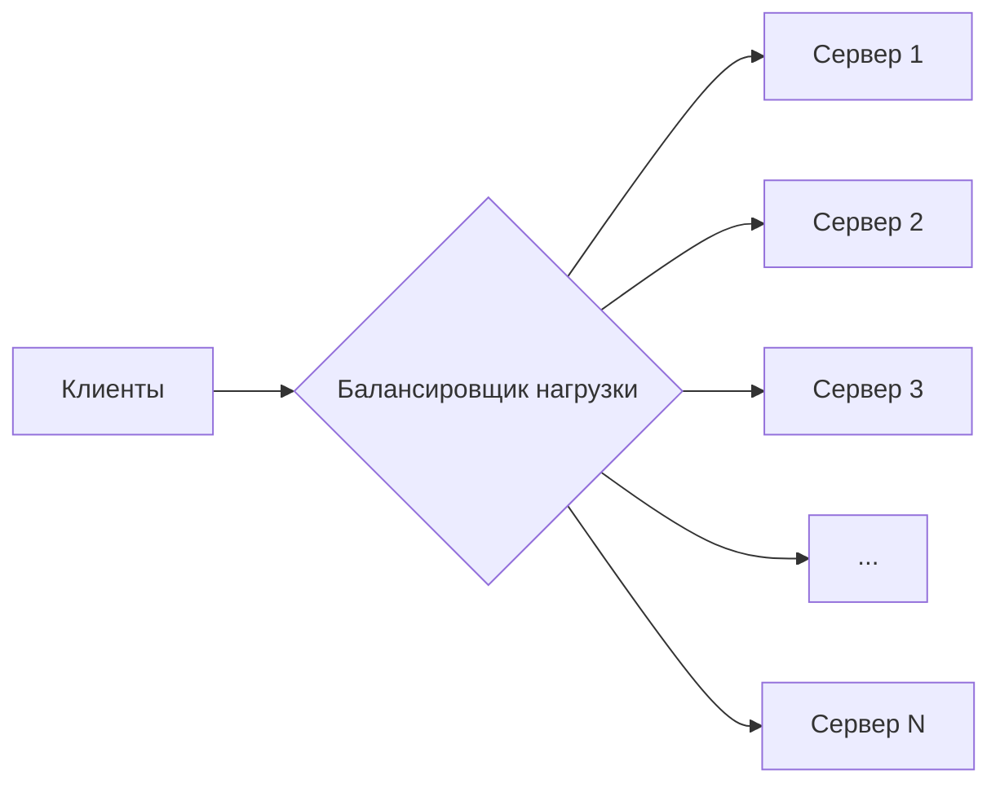
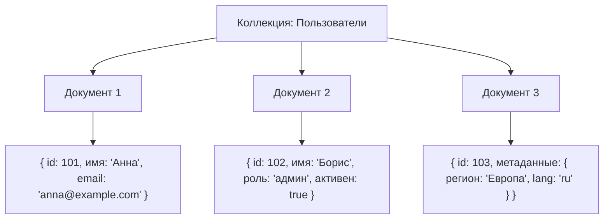
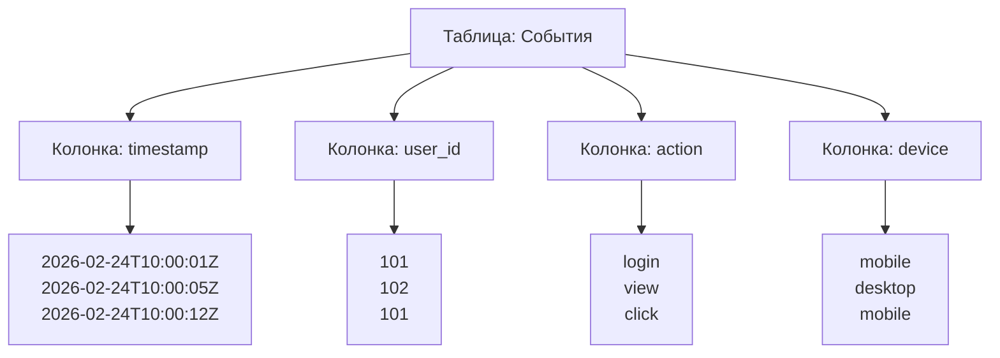

import TechHistoryPlay from '@site/src/components/TechHistoryPlay.jsx';

# История развития NoSQL-систем

  ОБЯЗАТЕЛЬНО
  ДЛЯ НОВИЧКОВ

Разработчику
Аналитику
Тестировщику  
Архитектору
Инженеру

<TechHistoryPlay topic="nosql" />

---

## История NoSQL

Прежде чем говорить о появлении NoSQL-систем, важно понять, в каком контексте происходил этот переход. К середине 2000-х годов реляционные СУБД, в первую очередь Oracle, Microsoft SQL Server, IBM DB2 и открытые решения вроде PostgreSQL и MySQL, доминировали на рынке управления данными более трёх десятилетий. Архитектурный фундамент реляционной модели, заложенный в 1970 году Эдгаром Коддом, оказался практически успешным: ACID-гарантии, декларативные запросы на языке SQL, поддержка нормализации, целостности и транзакций стали стандартом для корпоративных информационных систем.

Однако к началу 2000-х растущие требования к масштабируемости, гибкости схемы и скорости обработки данных начали выявлять ограничения реляционного подхода в новых условиях. Появились вызовы, для которых классические СУБД оказались не оптимальны:

- **Вертикальное масштабирование** (scale-up) достигало физических и экономических пределов: серверы с сотнями гигабайт оперативной памяти и многопроцессорными конфигурациями становились всё дороже, а отказоустойчивость одного узла оставалась уязвимой;
- **Строгая схема данных** мешала быстрой итеративной разработке: в веб-приложениях, особенно в стартапах, требования к структуре данных менялись ежедневно, а миграции схемы в production-среде были рискованны и трудоёмки;
- **Глобальная распределённость** приложений требовала репликации и согласованного доступа без единой точки отказа, но двухфазные коммиты и строгая изоляция транзакций плохо масштабировались в географически распределённых кластерах;
- **Неструктурированные и полуструктурированные данные** (социальные медиа, логи, метаданные, JSON-документы, вложенные структуры) неудобно отображались на реляционные таблицы без денормализации, JOIN-ов и сложных сущностей-связок.

Эти трудности не были фатальными для всех сценариев — банки, ERP-системы и госучреждения продолжали успешно использовать реляционные СУБД. Но для сервисов, ориентированных на интернет-масштаб (Web 2.0, облачные платформы, аналитика в реальном времени), требовался иной подход.

Именно в этой среде и сформировался запрос на альтернативы — как **дополнение**: системы, жертвующие частью строгости ради гибкости, горизонтальной масштабируемости и производительности.

В первую очередь, понадобилось решить вопрос с горизонтальным масштабированием:

---

### Термин NoSQL

Часто ошибочно полагают, что термин *NoSQL* буквально означает "не SQL" и подразумевает полный отказ от языка запросов. На самом деле, как позже поясняли многие разработчики, изначальное значение было двусмысленным и скорее подчёркивало **Not Only SQL**.

Сам термин впервые зафиксирован в 1998 году, когда Карло Стиньо (Carlo Strozzi) назвал так свою лёгкую реляционную СУБД, не использующую SQL в качестве интерфейса — однако это была всё же реляционная система. Значительного влияния она не оказала.

Реальный поворотный момент наступил в 2009 году, когда в рамках конференции по open-source базам данных в Сан-Франциско (организованной Джоханом Оскарссоном) собрались разработчики проектов, не основанных на реляционной модели: Voldemort, Cassandra, HBase, Riak и другие. Для объединения дискуссии и маркетингового обозначения нового класса систем был предложен хэштег **#nosql**. Именно с этого момента термин начал активно распространяться в профессиональном сообществе.

Важно подчеркнуть: **NoSQL — не единая технология и не единая архитектура**. Это собирательное обозначение для нескольких *семейств* систем, различающихся по модели данных, способу хранения, семантике консистентности и распределённости. Как правило, выделяют четыре основные категории:

1. **Документ-ориентированные** (MongoDB, CouchDB, Firebase)  
2. **Ключ-значение** (Redis, Memcached, Riak, DynamoDB)  
3. **Колоночные** (Cassandra, HBase, ScyllaDB)  
4. **Графовые** (Neo4j, Amazon Neptune, ArangoDB — гибридная)

Ниже мы проследим историю каждой из этих ветвей, начиная с предпосылок и первых реализаций.

---

### Предшественники

Хотя современная волна документ-ориентированных СУБД связана с MongoDB и CouchDB, идея хранения гибких, самодостаточных единиц информации имеет корни гораздо глубже.

В 1960–1970-х годах в информационно-поисковых системах (например, в библиотечных каталогах, научных архивах) активно использовались **иерархические и сетевые модели данных** — такие как IMS (Information Management System) от IBM (1966) или CODASYL-модель. Структуры этих систем были близки к деревьям или графам, и данные хранились в виде "записей" с вложенными подзаписями — прототипами современных документов.

Ключевым отличием от реляционной модели было **отсутствие нормализации** и **явная поддержка вложенности** — как в JSON или XML. Однако такие системы были сложны в сопровождении, не имели декларативного языка запросов, и после появления реляционных СУБД были вытеснены на периферию.

В 1980–1990-х возрождение интереса к гибким форматам пришло вместе с развитием **SGML**, а затем — **XML**. Появились первые XML-базы данных:  
- **Tamino** (Software AG, 1999) — коммерческая система с поддержкой XQuery и полнотекстового поиска;  
- **eXist-db** (2001, Wolfgang Meier) — open-source XML-хранилище, ориентированное на академические и издательские проекты.

Эти системы работали по принципу: *документ — это атомарная единица*, его структура может меняться, индексируются элементы и атрибуты, запросы строятся по пути в дереве (XPath/XQuery). Однако их производительность, масштабируемость и интеграция с веб-стеком оставляли желать лучшего.

Решающий импульс получил документ-ориентированный подход с приходом **JSON** как доминирующего формата представления данных в веб-API. Лёгкость сериализации, встроенная поддержка во всех языках и естественная вложенность сделали его идеальным кандидатом на роль основы для новой СУБД.

---

### История MongoDB

MongoDB появилась в 2007 году как внутренний инструмент компании **10gen** (позже переименованной в MongoDB Inc.), основанной бывшими инженерами DoubleClick — Дуайтом Мерриманом (Dwight Merriman), Кевином Райаном (Kevin Ryan) и Элиотом Хоровицем (Eliot Horowitz). Изначально стартап занимался платформой для облачных приложений (PaaS), но быстро обнаружил, что отсутствует подходящая СУБД для их задач: хранение динамических, изменяющихся структур данных с высокой скоростью записи и возможностью горизонтального масштабирования.

Первая публичная версия MongoDB (0.1) была выпущена в **августе 2009 года** под лицензией AGPL. Ключевые идеи:

- **Документ как BSON** — двоичный JSON с поддержкой типов (даты, бинарные данные, ObjectID и т.д.);  
- **Динамическая схема** — коллекции не требуют объявления структуры, документы в одной коллекции могут различаться;  
- **Встроенные индексы**, включая геопространственные и текстовые;  
- **Репликация через replica sets** (начиная с 1.6, 2010 г.);  
- **Шардинг** (начиная с 1.6, а полноценно — с 2.0, 2011 г.).

MongoDB быстро набрала популярность благодаря простоте установки, интуитивному API и отличной документации. Она органично вписывалась в стек MEAN/MEVN и стала фактическим стандартом для стартапов, SaaS-продуктов и микросервисов.

Важно отметить, что MongoDB изначально **не обеспечивала полную ACID-согласованность**. До версии 4.0 (2018) транзакции были ограничены одной коллекцией; междокументные транзакции появились позже, но с оговорками по производительности. Это вызвало критику, особенно со стороны сторонников строгой надёжности, но для многих сценариев (например, логирование, профили пользователей, каталоги товаров) уровень консистентности "eventual" был достаточен.

MongoDB не была первой документной БД — **CouchDB** (2005, Деймьен Кац) опередила её на несколько лет, предложив HTTP/REST-интерфейс, peer-to-peer репликацию и "конфликт-устойчивые" реплики (CRDT-подход). Однако CouchDB оказалась менее удобной для традиционных разработчиков, и MongoDB заняла доминирующее положение благодаря более привычной семантике и активной коммерческой поддержке.

---

### In-memory хранилища

Не все NoSQL-системы возникли как попытка заменить реляционные БД. Некоторые из наиболее влиятельных решений изначально создавались для **ускорения доступа к данным**, а уже потом эволюционировали до полноценных persistent-хранилищ.

---

#### Memcached

Memcached разработан в 2003 году Брэдом Фитцпатриком (Brad Fitzpatrick), автором LiveJournal — одного из первых крупных блоговых платформ. LiveJournal столкнулся с огромной нагрузкой на базу данных: каждый просмотр страницы профиля требовал десятков SQL-запросов к комментариям, друзьям, настройкам и т.п.

Вместо оптимизации запросов или шардинга базы, команда LiveJournal приняла решение **кэшировать результаты запросов в оперативной памяти распределённо**. Memcached — простейший распределённый кэш "ключ-значение", работающий по протоколу текстового RPC поверх TCP. Он не знал ничего о структуре данных: принимал ключ, возвращал байтовый массив. Никакой персистентности, транзакций, индексов — только скорость.

Memcached стал *де-факто* стандартом кэширования. Его использовали Facebook, Twitter, YouTube. Он не являлся СУБД в классическом понимании, но продемонстрировал силу парадигмы "key-value" и важность latency-оптимизации. Многие позже реализованные NoSQL-системы (например, Riak, Voldemort) заимствовали идею распределённого хэш-кольца (consistent hashing), предложенную в исследовательской работе Amazon Dynamo (2007), которая, в свою очередь, была частично вдохновлена практическим опытом Memcached.

---

#### Redis

Redis (REmote DIctionary Server) разработан в 2009 году Сальваторе Санильфилдом (Salvatore Sanfilippo), известным как *antirez*. В отличие от Memcached, Redis с самого начала задумывался как **более гибкая структура данных в памяти**: помимо строк, он поддерживал списки, множества, хэш-таблицы, сортированные множества, геопространственные индексы и потоки (streams, с 5.0).

Критически важными стали следующие аспекты:

- **Возможность персистентности** через snapshotting (RDB) и append-only file (AOF);  
- **Поддержка pub/sub**, атомарных операций и Lua-скриптов;  
- **Репликация master-slave**, а затем — кластеризация (с 3.0, 2015);  
- **Гарантии упорядоченности и атомарности** на уровне команд.

Redis быстро вышел за рамки простого кэша: его стали использовать как брокер сообщений (queues), хранилище сессий, движок для рейтингов и лидербордов, временный буфер для агрегации событий, конфигурационное хранилище и даже как основной источник правды в low-latency системах (например, финансовые тики). В 2020 году Redis Labs сменила лицензию на RSAL (Redis Source Available License), отойдя от строгой open-source модели — что вызвало дискуссии, но не остановило распространение.

Важно: хотя Redis часто относят к NoSQL (и формально это верно — он не реляционный и не использует SQL), его архитектура ближе к **in-memory data structure store**, чем к классической распределённой базе. Тем не менее, он стал неотъемлемой частью современного стека данных и оказал значительное влияние на проектирование гибридных систем (например, тандем PostgreSQL + Redis для hot/cold данных).

---

## Колоночные СУБД

### Предыстория

Прежде чем появилась концепция *колоночного хранения*, существовала чёткая дихотомия между двумя типами рабочих нагрузок:

- **OLTP** (On-Line Transaction Processing) — короткие, частые транзакции, обновление небольших фрагментов данных, строгая согласованность. Для неё идеально подходило *строчное* (row-oriented) хранение: одна запись — одна строка — один блок диска.
- **OLAP** (On-Line Analytical Processing) — длинные запросы, агрегации, сканирование миллионов записей по нескольким полям, редкие обновления. Здесь чтение целых строк было неэффективно: если запросу нужны только поля `timestamp` и `user_id`, зачем читать с диска `full_name`, `email`, `address`, `preferences`?

Уже в 1980-х в академической среде высказывались идеи о хранении данных по *столбцам*. Первой известной реализацией можно считать **SYBASE IQ** (1994), коммерческую СУБД, оптимизированную под аналитику. Однако широкого распространения она не получила из-за высокой стоимости и узкой специализации.

Прорыв произошёл в 2006 году, когда инженеры Google опубликовали статью **"Bigtable: A Distributed Storage System for Structured Data"**. Bigtable, строго говоря, *не колоночная*, а *широкостолбцовая* (wide-column) система, где данные организованы в трёхуровневую структуру:  
`row key → column family → column qualifier → timestamp → value`.

Тем не менее, ключевые идеи Bigtable легли в основу целого поколения open-source систем:

- **Масштабируемость на тысячи узлов** через шардирование по row key;  
- **Сортировка строк лексикографически**, что позволяет эффективно сканировать диапазоны;  
- **Версионность значений** через timestamp — каждая ячейка может хранить историю изменений;  
- **Гибкость схемы**: новые колонки могут появляться динамически, отсутствие необходимости объявлять структуру заранее.

Bigtable использовалась внутри Google для критически важных сервисов: Google Search, Google Analytics, Google Maps, Gmail. Это доказало жизнеспособность подхода в production-масштабе.

---

### Apache Cassandra

В 2007 году инженеры Facebook (в частности, Аватар Сетх и Прабхакар Чаласани) столкнулись с задачей масштабируемого хранения входящих/исходящих сообщений в Inbox. Требования были жёсткими:  
- высокая доступность (99.999% uptime);  
- линейное горизонтальное масштабирование;  
- отказоустойчивость в условиях отказов целых дата-центров (multi-DC replication).

Инспирировавшись Bigtable и системой Dynamo от Amazon (2007, статья "Dynamo: Amazon’s Highly Available Key-value Store"), они разработали **Cassandra** — гибридную систему, сочетающую:

- **Модель данных Bigtable** (row key, column families),  
- **Архитектуру Dynamo** (peer-to-peer, consistent hashing, vector clocks, eventual consistency, tunable quorum).

Имя "Cassandra" было выбрано не случайно: в греческой мифологии Кассандра делала верные пророчества, но ей никто не верил — отсылка к тому, что система выдавала корректные данные, даже если разработчики не доверяли её "нестрогой" семантике.

В 2008 году Facebook открыла исходный код Cassandra под лицензией Apache 2.0 и передала проект фонду Apache Software Foundation. В 2010 году Cassandra получила статус Top-Level Project.

Ключевые этапы эволюции:

- **0.7 (2010)** — введение CQL (Cassandra Query Language), имитирующего SQL, чтобы снизить порог входа;  
- **1.2 (2012)** — lightweight transactions (на основе Paxos), компактификация, улучшенная поддержка виртуальных узлов (vnodes);  
- **3.0 (2015)** — отказ от column families в пользу *materialized views* и *user-defined types*, что сделало модель данных ближе к документной;  
- **4.0 (2021)** — поддержка Java 11, улучшенная безопасность, отказ от Thrift в пользу исключительно CQL.

Cassandra стала эталоном для систем с приоритетом **доступности и устойчивости к разделению сети** (AP в терминах CAP-теоремы). Её используют Apple (для хранения данных iCloud), Netflix (метрики и мониторинг), Uber (геоданные), Discord (сообщения). Однако она не подходит для сценариев, требующих строгой транзакционности (например, банковские переводы) — компромисс, заложенный в архитектуре с самого начала.

---

### Apache HBase

Параллельно с Cassandra развивался другой клон Bigtable — **HBase**, созданный в 2007 году Питером Вайсом (Powerset, позже Microsoft) и включённый в экосистему Apache Hadoop в 2008 году.

В отличие от Cassandra, HBase:

- **Зависит от HDFS** (Hadoop Distributed File System) как слоя персистентности;  
- Использует **ZooKeeper** для координации кластера;  
- Обеспечивает **сильную согласованность** (linearizable reads/writes) за счёт централизованного регионального сервера;  
- Лучше интегрируется с MapReduce, Spark и другими инструментами Hadoop-стека.

HBase стал основой для аналитических платформ в Yahoo!, Facebook (до перехода на Scuba и TAO), а также для систем, где важна точность чтения (например, реестры, журналы аудита). Однако зависимость от HDFS и ZooKeeper усложняет эксплуатацию, и в последние годы HBase уступает позиции более лёгким и облачным решениям (ScyllaDB, Amazon Keyspaces, Google Cloud Bigtable).

---

## Графовые базы данных

### Теоретические основы

Граф как модель данных старше реляционной: теория графов восходит к Эйлеру (1736, задача о Кёнигсбергских мостах), а в информатике графы использовались с 1950-х (алгоритмы Дейкстры, Флойда-Уоршелла). Однако до 2000-х графовые структуры в базах данных были скорее академической нишей.

Первые попытки реализовать графовые СУБД появились в 1980–1990-х:

- **GDB** (Graph Database, 1980-е, University of California);  
- **HyperGraphDB** (2006, Borislav Iordanov) — гиперграфовая модель, где рёбра могут соединять более двух узлов.

Но настоящий прорыв произошёл с развитием социальных сетей, семантического веба и задач, где связи между сущностями важнее самих сущностей:  
- "Друзья друзей" в Facebook;  
- Рекомендации "люди, купившие это, также купили…" в Amazon;  
- Фрод-детекция через кластеризацию подозрительных транзакций;  
- Онтологии и связанные данные (Linked Data, RDF).

В таких случаях реляционные JOIN-ы становятся вычислительно дорогими: сложность растёт экспоненциально с глубиной обхода (например, поиск связей на 6 шагов вперёд требует 6 JOIN-ов и сканирования миллиардов строк).

---

### Neo4j

Neo4j была основана в 2000 году в Швеции командой во главе с Эмилем Eifrem (Emil Eifrem). Интересно, что идея возникла при работе над проектом для медиакомпании, где требовалось моделировать связи между редакторами, статьями, рубриками и правами доступа. Команда обнаружила, что даже простые запросы вроде "все статьи, отредактированные людьми, обучавшимися у X" требуют сложнейших SQL-конструкций.

Neo4j изначально была ориентирована на **native graph storage**:  
- Узлы и рёбра хранятся как физические записи на диске;  
- Рёбра индексируются *двунаправленно* — обход графа происходит без full scan;  
- Используется проприетарный язык запросов **Cypher** (введён в 2011), вдохновлённый ASCII-art: `(a)-[:KNOWS]->(b)`.

Версия 1.0 вышла в 2010 году. Ключевые вехи:

- **2.0 (2013)** — введение *labels* для узлов и *schema indexes*, что сделало систему пригодной для production;  
- **3.0 (2016)** — поддержка кластеризации (Causal Clustering на основе Raft);  
- **4.0 (2020)** — multi-database, finer-grained security, reactive drivers;  
- **5.0 (2022)** — облачная нативность, улучшенная поддержка RDF и ontologies.

Neo4j не первая графовая СУБД, но первая, достигшая промышленного масштаба. Её используют Walmart (цепочки поставок), Cisco (сетевая топология), Adobe (персонализация), Deutsche Bank (антифрода). В 2021 году Neo4j достигла оценки в $2 млрд.

Важно: Neo4j — не единственный игрок. Появились:

- **Amazon Neptune** — fully managed, поддерживает Gremlin и openCypher;  
- **JanusGraph** (форк TitanDB, 2017) — распределённая, работает поверх Cassandra, HBase, Scylla;  
- **ArangoDB** и **Microsoft Azure Cosmos DB** — мультимодельные системы, поддерживающие графы наряду с документами и ключ-значением.

Графовые модели доказали свою эффективность в задачах, где семантика отношений критична — и это область, где реляционные СУБД принципиально неэффективны.

---

## Влияние NoSQL на Big Data, машинное обучение, IoT и системы рекомендаций

NoSQL не просто добавило новые инструменты — оно изменило *подход к проектированию архитектур данных*. Ниже — как это отразилось на смежных областях.

---

### Big Data

До 2010 года "Big Data" ассоциировалась почти исключительно с Hadoop и MapReduce — batch-обработкой данных за часы. Но рост потоковых данных (соцсети, мобильные приложения, сенсоры) потребовал **low-latency ingestion** и **stateful streaming**.

NoSQL-системы стали естественным *слоем хранения* для потоковых архитектур:

- **Kafka + Cassandra** — поток событий в Kafka, агрегаты и состояния в Cassandra (например, счётчики активности);  
- **Flink/Spark Streaming + Redis** — state backend для оконных операций;  
- **HBase + Hadoop** — для гибридных OLAP/OLTP-сценариев.

Без масштабируемых, отказоустойчивых хранилищ потоковая аналитика осталась бы академической.

---

### Машинное обучение

Традиционно ML-пайплайны выглядели так:  
`сырые данные → ETL в реляционную БД → выгрузка в CSV → обучение → деплой модели как REST-API`.

Этот цикл был медленным и не позволял использовать *фичи в реальном времени* (например, "последние 5 кликов за минуту").

NoSQL-хранилища позволили создать **онлайн feature stores**:

- **Redis** — для хранения свежих фич (sliding windows, counters);  
- **Cassandra** — для хранения исторических фич с TTL и партиционированием по user_id;  
- **MongoDB** — для хранения аннотированных данных, метаданных экспериментов.

Системы вроде Feast, Tecton, Hopsworks используют именно такие бэкенды. Это дало возможность:
- Сократить *feature skew* между train и inference;  
- Проводить A/B-тестирование моделей с разными фичами;  
- Обновлять фичи без перезапуска пайплайна.

---

### IoT

IoT-сценарии предъявляют уникальные требования:
- Высокая частота записи (тысячи событий в секунду с одного устройства);  
- Низкая задержка чтения (например, триггер при превышении температуры);  
- Долгосрочное хранение с компрессией (годы данных с датчиков).

Классические реляционные СУБД не справляются с write-throughput. Решения:

- **TimescaleDB** (расширение PostgreSQL) — гибрид, но с колоночными оптимизациями;  
- **InfluxDB** — time-series оптимизированная, использует LSM-деревья (как Cassandra);  
- **ScyllaDB** — rewrite Cassandra на C++ с latency < 1 мс;  
- **Azure Cosmos DB (MongoDB API)** — для edge-to-cloud синхронизации.

Ключевой вклад NoSQL — **асинхронная, идемпотентная запись** и **TTL-политики**, позволяющие автоматически удалять старые данные без нагрузки на приложение.

---

### Системы рекомендаций

Ранние рекомендательные системы (например, Netflix Prize, 2006–2009) строились на матрицах "пользователь–товар", хранимых в реляционных БД или flat-файлах. Но масштаб (миллионы пользователей × миллионы товаров) вынудил перейти к распределённым хранилищам:

- **Cassandra** — для хранения sparse matrices и precomputed similarities;  
- **Redis Sorted Sets** — для хранения топ-N рекомендаций на пользователя в памяти;  
- **Neo4j** — для построения *knowledge graphs*: "пользователь купил товар", "товар принадлежит категории", "категория связана с сезоном", "пользователь живёт в регионе".

Современные системы (например, Pinterest’s PinSage) используют **графовые нейросети (GNN)**, где входные данные — подграфы из Neo4j или JanusGraph. Без эффективного хранения и обхода связей обучение таких моделей было бы невозможно.

Таким образом, NoSQL не просто *поддержала* развитие ML и Big Data — она стала **структурным условием** их масштабируемости.

{/* sidebar-collections */}

---

## В подборках

Статья входит в тематические маршруты из меню **Подборки** и блока "С чего начать?" на главной. Соседние шаги того же маршрута:

**История** — [История развития структур данных](/encyclopedia/3-data-markup/3-02-struktury-dannyh/11), [История языка JavaScript](/encyclopedia/5-languages/5-01-javascript/11), [История развития сетевых технологий](/encyclopedia/2-system-network/2-03-set-i-internet/2), [История языка Python](/encyclopedia/5-languages/5-02-python/14), [История информационных технологий — о разделе](/encyclopedia/1-basics/1-07-nemnogo-o-proshlom/intro), [История языка Java](/encyclopedia/5-languages/5-03-java/11).

{/* /sidebar-collections */}

---

{/* http-basics-link  */}

  
Основа по протоколу

  

  Базовый разбор HTTP и HTTPS находится в отдельной статье — [HTTP как основа веб-интеграций](/encyclopedia/2-system-network/2-09-osnovy-integratsionnogo-vzaimodeystviya/118).

  

