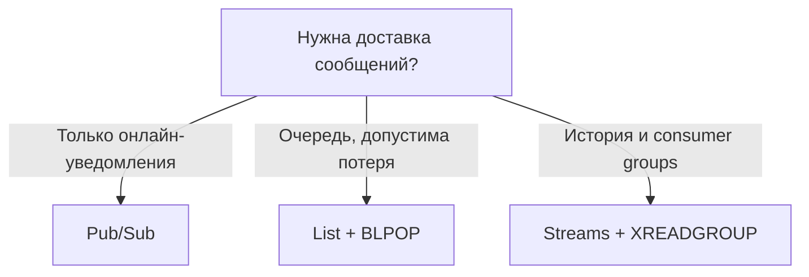

import RedisCacheDemo from '@site/src/components/RedisCacheDemo.jsx';

# Redis - хранилище ключ-значение в памяти

<div class="article-tags">
  <span class="tag tag-required">ОБЯЗАТЕЛЬНО</span>
  <span class="tag tag-beginner">ДЛЯ НОВИЧКОВ</span>
</div>

<span class="complexity-badge">Разработчику</span>
<span class="complexity-badge">Аналитику</span>
<span class="complexity-badge">Тестировщику</span>  
<span class="complexity-badge">Архитектору</span>
<span class="complexity-badge">Инженеру</span>

## Redis

> **Как читать эту главу.** Сначала — интуиция и живой пример кэша, затем типы данных и сценарии в `redis-cli`. Дальше — память, персистентность, репликация, кластер, Lua, Pub/Sub и Streams. Синтаксис команд и production-настройки — в [справочнике по Redis](/encyclopedia/3-data-markup/3-06-nosql/51); пошаговая установка — в [Первых шагах с Redis](/encyclopedia/3-data-markup/3-06-nosql/511).

### Что такое Redis?

Представьте интернет-магазин: первый покупатель открывает каталог — сервер идёт в PostgreSQL, собирает JSON, отдаёт ответ за десятки миллисекунд. Сотый покупатель за ту же минуту запрашивает тот же каталог. Без кэша база снова выполнит тяжёлый запрос. С Redis схема меняется:

1. Приложение сначала смотрит в Redis по ключу, например `cache:catalog:ru`.
2. Если ключ есть (**cache hit**) — ответ отдаётся из памяти за микросекунды.
3. Если ключа нет (**cache miss**) — идём в SQL, кладём результат в Redis с TTL и отвечаем клиенту.
4. Когда TTL истёк или данные инвалидированы вручную — снова miss и обновление из основной БД.

<RedisCacheDemo />

На верхнем уровне Redis похож на **словарь «ключ → значение»**: нет `SELECT … WHERE` по полям внутри значения (для этого есть модули вроде RediSearch или отдельные типы — hash, sorted set). «Словарь» — отправная точка: значение может быть списком, множеством, потоком сообщений, счётчиком с атомарным `INCR` и т.д.

**Redis** (*Remote Dictionary Server*) — распределённое **in-memory data structure store**: хранилище структур данных в оперативной памяти для сценариев реального времени. Название Redis расшифровывается как *Remote Dictionary Server*, что отражает его базовый принцип: удалённый доступ к ассоциативному массиву, то есть к коллекции данных, организованных по принципу «ключ — значение». Однако современный Redis давно вышел за рамки простого словаря. Это полноценная *in-memory data structure store* — хранилище структур данных, резидентное в памяти, но при этом поддерживающее персистентность, репликацию, кластеризацию, расширяемость через модули и интеграцию с инфраструктурой высоконагруженных систем.

Ключевая особенность Redis — размещение данных в оперативной памяти (RAM) на протяжении всего времени работы демона. Это обеспечивает чрезвычайно низкую задержку доступа: типичное время выполнения большинства команд измеряется микросекундами. Такая скорость достигается за счёт отсутствия дисковых операций в критическом пути, и благодаря продуманной внутренней архитектуре: однопоточная модель обработки команд, отсутствие блокировок в основном цикле, эффективные алгоритмы работы с памятью. Важно подчеркнуть, что резидентность не означает *временность*. При правильной настройке механизмов персистентности (RDB или AOF) Redis гарантирует сохранность данных даже при аварийной остановке или перезагрузке системы. Поэтому Redis — это не просто кэш, а полноценная база данных, пригодная для хранения критически важной информации — при условии, что объём данных укладывается в доступные ресурсы оперативной памяти.

Redis часто используется как кэш, и это действительно одно из самых массовых применений. Веб-приложение, получая запрос от пользователя, сначала проверяет наличие запрашиваемых данных в Redis. Если данные присутствуют (происходит *cache hit*), они возвращаются немедленно. Если отсутствуют (*cache miss*), приложение обращается к основной базе данных (например, PostgreSQL или MySQL), получает данные, сохраняет их в Redis с заданным сроком жизни и лишь затем возвращает клиенту. Такой подход разгружает дисковую СУБД от повторяющихся запросов, снижает задержки и повышает пропускную способность системы в целом. Однако использование Redis в качестве кэша — лишь верхушка айсберга. Его внутренние структуры данных и операционная семантика позволяют реализовать широкий спектр компонентов распределённых систем: сессионные хранилища, системы управления очередями, брокеры сообщений, распределённые блокировки, механизмы ограничения частоты запросов, индексы для полнотекстового поиска и даже движки для выполнения моделей машинного обучения.

Основной единицей адресации в Redis является **ключ** — произвольная байтовая строка (практически до 512 МБ на ключ, но в проде ключи короткие: `user:1000:profile`, `session:abc123`). На уровне движка нет таблиц и схемы: порядок в данных задаёт **соглашение команды** — префиксы, двоеточие, номер логической БД (`SELECT`, по умолчанию 0–15).

У каждого ключа ровно **один тип значения** в момент времени. Тип задаёт доступные команды: к списку нельзя применить `HGET`, к строке — `LPUSH`.

**Пять классических типов** (их достаточно для большинства задач):

| Тип | Зачем | Типичный пример |
|-----|--------|-----------------|
| **String** | Кэш, счётчики, сериализованный JSON | `SET cache:page:1 "..." EX 300` |
| **Hash** | Объект по полям без полного JSON | `HSET user:42 name "Ann"` |
| **List** | Очередь FIFO, стек | `LPUSH queue:jobs "email"` |
| **Set** | Уникальные теги, пересечения | `SADD online:uids "42"` |
| **Sorted set (ZSET)** | Рейтинги, отложенные задачи по времени | `ZADD leaderboard 1500 "player:anna"` |

**Специализированные типы** расширяют модель: **Stream** (лог событий с consumer groups), **GEO**, **HyperLogLog** (приблизительный подсчёт уникальных), битовые операции над string, модули **RedisBloom** / **RedisJSON** в [Redis Stack](/encyclopedia/3-data-markup/3-06-nosql/51#redis-stack-модули-как-стандарт-де-факто). Внутри они тоже оптимизированы под свои операции, а не «просто строка».

Строка — самый простой и наиболее часто используемый тип. Значение строки представляет собой произвольную последовательность байтов. Это позволяет хранить сериализованные объекты (например, JSON), изображения в base64, бинарные данные. Строки поддерживают не только базовые операции чтения и записи (`GET`, `SET`), но и арифметические команды (`INCR`, `DECR`, `INCRBYFLOAT`), что делает их удобными для реализации счётчиков. Кроме того, существуют операции для побитовой манипуляции (`SETBIT`, `GETBIT`, `BITCOUNT`, `BITPOS`), превращающие строку в эффективную *битовую карту* (bitmap). Например, для отслеживания ежедневной активности пользователя можно использовать один ключ, в котором каждый бит соответствует одному дню года: установка бита происходит за O(1), а подсчёт активных дней за год — за один вызов `BITCOUNT`.

Хэш — это коллекция полей и их значений, привязанных к одному ключу. Его удобно рассматривать как мини-таблицу или сериализованный объект. В отличие от хранения всего объекта в виде JSON-строки, хэш позволяет извлекать (`HGET`), обновлять (`HSET`, `HINCRBY`) или проверять существование (`HEXISTS`) отдельных полей без необходимости передачи и парсинга всего объекта. Это особенно экономично при работе с крупными структурами, в которых часто меняются лишь отдельные атрибуты. Внутренне Redis может представлять хэш в компактной форме *ziplist*, если количество полей и их длина невелики, что значительно сокращает потребление памяти.

Список — упорядоченная коллекция строк, поддерживающая операции вставки и извлечения с обоих концов (`LPUSH`/`RPUSH`, `LPOP`/`RPOP`). Такая семантика делает списки идеальной основой для реализации *очередей* (FIFO, с использованием `LPUSH` и `RPOP`) и *стеков* (LIFO, с `LPUSH` и `LPOP`). Блокирующие варианты команд (`BLPOP`, `BRPOP`) позволяют потребителю задачи «уснуть» до появления нового элемента, что исключает необходимость постоянного опроса и экономит ресурсы. Списки также поддерживают доступ по индексу (`LINDEX`), вставку в произвольное место (`LINSERT`), обрезку (`LTRIM`) и массовое получение диапазонов (`LRANGE`).

Множество — коллекция *уникальных*, неупорядоченных строк. Основные операции — добавление (`SADD`), удаление (`SREM`), проверка принадлежности (`SISMEMBER`). Наиболее мощная группа команд — операции над несколькими множествами: объединение (`SUNION`), пересечение (`SINTER`), разность (`SDIFF`). Это позволяет эффективно решать задачи, связанные с категоризацией, фильтрацией и анализом принадлежности. Например, можно хранить множества идентификаторов пользователей, подписанных на разные теги, а затем за один запрос найти всех, кто подписан одновременно на «технологии» и «наука», но не на «политику».

Упорядоченное множество (sorted set, или zset) — это расширение обычного множества, где каждый элемент имеет числовое значение, называемое *счётом* (score). Элементы в таком множестве всегда хранятся в порядке возрастания счёта. Это позволяет выполнять эффективный поиск по диапазону (`ZRANGEBYSCORE`), получать ранг элемента (`ZRANK`), а также динамически изменять счёт (`ZINCRBY`). Sorted set является основой для реализации рейтингов, досок лидеров, систем приоритезации задач и временных индексов. Например, можно использовать UNIX-время в качестве счёта, чтобы хранить ленту событий и быстро извлекать все события за последние 24 часа.

### Паттерны кэширования и согласованность (коротко)

| Паттерн | Кто пишет в Redis | Когда применяют |
|---------|-------------------|-----------------|
| **Cache-aside** | Приложение после чтения из SQL | Самый частый кэш API и страниц |
| **Read-through** | Обёртка/библиотека сама грузит при miss | Когда логика кэша централизована |
| **Write-through** | Запись одновременно в Redis и БД | Реже; нужна строгая синхронность кэша |

На **одном узле** Redis обрабатывает команды в одном потоке — операции над одним ключом выглядят **линеаризуемыми**. На **реплике** чтение может отставать от мастера (асинхронная репликация). В **кластере** multi-key операции только в одном слоте (см. [хэш-теги](/encyclopedia/3-data-markup/3-06-nosql/51#распределение-ключей-хэш-слоты-hash-slots)). Подробнее про CAP и BASE — в [Основах NoSQL](/encyclopedia/3-data-markup/3-06-nosql/2).

---

### Практические примеры (`redis-cli`)

Четыре сценария для локального Redis:

```bash
docker run -d -p 6379:6379 --name redis-learn redis:7
docker exec -it redis-learn redis-cli
```

**1. Кэш строки с TTL (cache-aside)**

```bash
GET user:42
# (nil)

SET user:42 '{"id":42,"name":"Анна"}' EX 300
# OK

GET user:42
TTL user:42
```

**2. Распределённая блокировка: захват и безопасное освобождение**

```bash
SET lock:order:7 "worker-pod-2:8f3a" NX EX 30
# OK

SET lock:order:7 "worker-pod-3:9b1c" NX EX 30
# (nil)
```

Снятие lock — через **Lua** с проверкой токена (см. [Lua-скрипты](#lua-скрипты-и-транзакции)), а не слепой `DEL`: иначе можно удалить чужую блокировку после истечения TTL.

**3. Таблица лидеров (sorted set)**

```bash
ZADD leaderboard 1500 player:anna 980 player:boris 2100 player:vika
ZINCRBY leaderboard 50 player:boris
ZRANGE leaderboard 0 2 REV WITHSCORES
```

**4. Поток событий (Streams)**

```bash
XADD events * action login user_id 42
XGROUP CREATE events processors $ MKSTREAM
XREADGROUP GROUP processors consumer-1 COUNT 1 STREAMS events >
# после обработки — XACK events processors <id>
```

Для атомарного «прочитать и изменить» нескольких ключей в **одном слоте** — `MULTI`/`EXEC` или Lua. **Pipeline** ускоряет сеть, но не заменяет транзакцию — см. [справочник](/encyclopedia/3-data-markup/3-06-nosql/51#транзакции-pipeline-и-lua-скрипты).

---

### Внутренние механизмы и управление памятью

Хотя пользователь взаимодействует с Redis через высокоуровневые типы данных — строку, хэш, список и так далее — на уровне реализации эти типы могут использовать разные внутренние структуры, называемые *кодировками* (encodings). Выбор кодировки производится автоматически и динамически: Redis стремится использовать наиболее компактную и эффективную форму представления до тех пор, пока объём данных или характер операций не требуют переключения на более универсальную, но менее экономичную кодировку.

Например, хэш при небольшом количестве полей и небольшой длине их имён и значений хранится как *ziplist* — компактный массив байтов, в котором поля и значения записаны последовательно. Аналогично, множество из небольших целочисленных элементов может храниться в виде *intset* — отсортированного массива 16-, 32- или 64-битных целых, что позволяет исключить дублирование и обеспечить O(log N) поиск. Упорядоченное множество при малом размере также использует *ziplist*, где элементы и их счёты чередуются в одном массиве. Эти оптимизации позволяют хранить тысячи небольших объектов с минимальными накладными расходами: в некоторых сценариях средний размер записи может составлять менее 100 байт.

Переход на «полную» кодировку (например, `hashtable` для хэшей или `skiplist` для sorted sets) происходит прозрачно, когда нарушаются пороговые условия — по умолчанию это 512 элементов и 64 байта на элемент, хотя параметры настраиваются в конфигурации. Такой подход сочетает высокую плотность упаковки для типичных сценариев (профили пользователей, сессии, кэшируемые фрагменты) с масштабируемостью для более сложных задач.

Управление памятью в Redis построено вокруг собственного аллокатора, по умолчанию — jemalloc. Redis отслеживает потребление памяти и при достижении `maxmemory` включает **eviction** по политике `maxmemory-policy`:

| Политика | Что вытесняется | Типичное применение |
|----------|-----------------|---------------------|
| `allkeys-lru` / `allkeys-lfu` | Любые ключи | Кэш, где всё можно пересоздать |
| `volatile-lru` / `volatile-lfu` / `volatile-ttl` | Только ключи **с TTL** | Кэш + постоянные ключи без TTL |
| `allkeys-random` / `volatile-random` | Случайные ключи | Простые кэши |
| `noeviction` | Ничего; ошибка при записи | Очереди, locks, критичные данные |

Для кэша страниц часто ставят `allkeys-lru` и лимит RAM. Для очередей — `noeviction` и мониторинг: иначе `LPUSH` начнёт падать с OOM вместо вытеснения.

---

### Персистентность

Данные живут в RAM, но Redis **может** восстанавливать состояние с диска при включённых **RDB** и/или **AOF**. Слово *volatile* в `maxmemory-policy` (`volatile-lru` и т.д.) означает «ключи **с TTL**», а не «временное хранилище».

| Режим | Суть | Когда уместен |
|-------|------|----------------|
| Только RAM | После рестарта пусто | Чистый кэш |
| **RDB** | Периодический снимок | Бэкапы, быстрый старт |
| **AOF** | Журнал команд | Меньше потерь при аварии |
| **RDB + AOF** | Снапшот + дельта | Production с важными данными в Redis |

Оба механизма можно комбинировать:

**RDB** — это механизм создания *снапшотов* (snapshotting). В заданные моменты времени (например, при изменении не менее 1000 ключей за 60 секунд) основной процесс форкает дочерний, который записывает текущее состояние всех данных в бинарный файл на диск. Это позволяет добиться минимального влияния на производительность основного потока и получить компактный, легко переносимый дамп. Однако между моментами снапшотов возможна потеря данных — вплоть до нескольких минут. RDB подходит для резервного копирования, миграций и ситуаций, где допустима ограниченная потеря.

**AOF** работает иначе: каждая модифицирующая команда (например, `SET`, `LPUSH`, `HINCRBY`) логируется в текстовый файл в том же формате, в каком её получает сервер. При перезапуске Redis «переигрывает» этот журнал, восстанавливая состояние. Для повышения надёжности AOF можно настроить на запись после каждой команды (`appendfsync always`), раз в секунду (`everysec`, по умолчанию) или по усмотрению ОС (`no`). Последний вариант даёт максимальную производительность, но увеличивает риск потери данных. Со временем файл AOF растёт — даже для одного ключа могут накопиться сотни `INCR`. Чтобы этого избежать, Redis периодически запускает *перезапись* (rewrite): в фоне создаётся новый, компактный файл, содержащий только итоговое состояние данных (например, один `SET counter 1000` вместо тысячи `INCR`). Этот процесс также использует форк и не блокирует основную обработку.

Комбинированное использование RDB и AOF (начиная с Redis 4.0) позволяет достичь компромисса: AOF обеспечивает минимальную потерю (вплоть до одной команды), а RDB ускоряет восстановление за счёт компактного базового состояния. При старте Redis сначала загружает RDB-снапшот, а затем применяет только *дополнения* из AOF, записанные после момента создания снапшота.

---

### Репликация и отказоустойчивость

Redis поддерживает асинхронную репликацию в режиме *master–replica* (ранее *master–slave*). Реплика подключается к мастеру, получает полный дамп данных (через RDB-файл или прямую передачу в памяти), а затем непрерывно принимает поток команд в реальном времени. Репликация — *не блокирующая*: мастер продолжает обслуживать запросы во время передачи состояния. Реплики могут обслуживать только читающие команды, что позволяет разгружать мастер и обеспечивать отказоустойчивость.

Ключевой механизм обеспечения доступности — *автоматическое переключение при отказе* (failover), реализуемое через **Redis Sentinel** или встроенный в **Redis Cluster** контроллер. Sentinel — это отдельный демон, который мониторит состояние мастеров и реплик, инициирует выбор нового мастера (обычно наиболее актуальной реплики), перенастраивает клиентов и уведомляет администраторов. Требуется минимум три ноды Sentinel для избежания split-brain.

Начиная с Redis 6.2, появилась поддержка *мульти-мастерной репликации* на уровне **Redis Enterprise** — с использованием CRDT (*Conflict-Free Replicated Data Types*). Эта технология позволяет нескольким узлам одновременно принимать запись в разных дата-центрах, а конфликты разрешаются детерминированно на основе меток времени и идентификаторов. Это даёт 99.999% доступности и локальные задержки менее 1 мс для глобально распределённых приложений.

---

### Кластеризация и шардирование

Когда объём данных или нагрузка превышает возможности одного узла, используется **Redis Cluster** — встроенное решение для горизонтального масштабирования, доступное начиная с Redis 3.0. Кластер автоматически *шардирует* (разделяет) ключевое пространство на 16384 *хэш-слота*. Каждый ключ хэшируется по CRC16 и привязывается к одному из слотов; слоты равномерно распределяются между узлами.

Кластер состоит из *мастер-нод* (хранят данные) и *реплика-нод* (дублируют данные одного мастера). Отказ мастера автоматически компенсируется перевыбором его реплики в новый мастер. Клиенты могут подключаться к любому узлу: если запрошенный ключ находится на другом узле, сервер вернёт *MOVED*-перенаправление с адресом нужного узла. Большинство современных клиентских библиотек кэшируют топологию кластера и перенаправляют запросы прозрачно.

Redis Cluster не поддерживает *межшардные* операции: нельзя выполнить `SUNION` над множествами на разных узлах или Lua по ключам из разных слотов.

**Хэш-теги:** если в ключе есть `{...}`, для слота используется **только содержимое скобок**:

- `user:1000:profile` и `user:1000:sessions` → обычно **разные** слоты;
- `user:{1000}:profile` и `user:{1000}:sessions` → **один** слот.

Тогда допустимы `MGET`, `MULTI`/`EXEC` и Lua над этими ключами. Подробнее — в [справочнике](/encyclopedia/3-data-markup/3-06-nosql/51#распределение-ключей-хэш-слоты-hash-slots).

Альтернативы: прокси (Twemproxy, predixy), **`redis-py`** с Redis Cluster, managed-сервисы (ElastiCache, Azure Cache, Memorystore).

---

### Lua-скрипты и транзакции

Redis предоставляет два механизма для группировки операций: транзакции (`MULTI`/`EXEC`) и серверные Lua-скрипты. Оба гарантируют *атомарность*: команды внутри блока выполняются без прерывания другими запросами. Однако их назначение и выразительная мощность существенно различаются.

Транзакции в Redis — **очередь команд** одного клиента: после `MULTI` выполнение на `EXEC`. Отличайте **`MULTI`/`EXEC`** (атомарность) от **pipeline** (только меньше RTT, без атомарности). Redis *не откатывает* `EXEC` при ошибке одной команды. Для условной логики — **Lua** или `WATCH` + `MULTI` + `EXEC`.

Для последнего предназначены **Lua-скрипты**. Redis встраивает интерпретатор Lua 5.1 и позволяет выполнять произвольный код на сервере. Скрипт загружается один раз (`SCRIPT LOAD`) или передаётся напрямую (`EVAL`), кэшируется по SHA-хэшу (`EVALSHA`), и затем может быть вызван многократно. Внутри скрипта доступны все команды Redis через глобальный объект `redis.call()` (или `redis.pcall()`, если требуется перехват ошибки). Все операции в пределах одного вызова `EVAL` выполняются атомарно: никакие другие клиенты не могут вмешаться в их выполнение.

Это делает Lua-скрипты идеальным инструментом для реализации:
- сложной условной логики («если ключ A существует и его значение > X, то увеличь B и удали C»);
- распределённых примитивов (блокировки, семафоры, rate limiting);
- транзакций с откатом (вручную, через проверку состояний и вызов `redis.error_reply()`);
- агрегаций, требующих нескольких шагов чтения-модификации-записи.

**Снятие блокировки по токену:**

```lua
if redis.call('GET', KEYS[1]) == ARGV[1] then
    return redis.call('DEL', KEYS[1])
end
return 0
```

**Rate limiter (скользящее окно, ZSET):**

```lua
local key = KEYS[1]
local window = tonumber(ARGV[1])
local limit = tonumber(ARGV[2])
local req_id = ARGV[3]
local t = redis.call('TIME')
local now = t[1] * 1000 + math.floor(t[2] / 1000)
local min_score = now - window

redis.call('ZREMRANGEBYSCORE', key, 0, min_score)
local count = redis.call('ZCARD', key)
if count < limit then
    redis.call('ZADD', key, now, req_id)
    redis.call('PEXPIRE', key, window)
    return count + 1
end
return -1
```

`ARGV[3]` — уникальный id запроса (UUID), чтобы не коллизировать в ZSET. Скрипт выполняется за один round-trip атомарно.

---

### Pub/Sub и Streams — брокеры сообщений в Redis

Redis включает два механизма для организации обмена сообщениями: классическую модель *publish–subscribe* и современную систему *Streams*.

**Pub/Sub** реализует простую схему «один ко многим»: клиенты подписываются на каналы (`SUBSCRIBE channel`), издатель публикует сообщения (`PUBLISH channel payload`). Сообщения доставляются всем текущим подписчикам *асинхронно* и *один раз*. Если подписчик отключён на момент публикации — сообщение теряется. Pub/Sub не хранит историю, не гарантирует доставку и не поддерживает групповую обработку. Поэтому он подходит для сценариев вроде широковещательных уведомлений, лайв-обновлений интерфейса или внутреннего мониторинга — но не для критичных к надёжности задач.

**Когда что выбирать**



**Streams** (с Redis 5.0) — журнал событий в одном ключе. ID — `milliseconds-sequence` (например, `1609040574632-0`). Записи: `XADD`, чтение: `XRANGE` / `XREAD`. Ключевые свойства:
- **персистентность**: сообщения хранятся в памяти и на диске (с учётом настроек персистентности);
- **история**: можно читать поток с любого смещения, включая начало;
- **группы потребителей** (`XGROUP`, `XREADGROUP`): множество клиентов могут совместно обрабатывать один поток, при этом каждое сообщение доставляется ровно одному участнику группы; неподтверждённые (`XACK`) сообщения попадают в *pending entries list* и могут быть перераспределены при сбое потребителя;
- **блокирующее чтение** (`XREAD BLOCK`): клиент «засыпает» до появления новых сообщений.

Streams позволяют строить отказоустойчивые, масштабируемые системы обработки событий: логирование, аудит, триггеры, микросервисные взаимодействия с at-least-once семантикой.

---

### Безопасность

Redis изначально проектировался для доверенной среды и не включал механизмы безопасности по умолчанию. Однако современные версии (начиная с 6.0) предоставляют комплексную модель контроля доступа:

- **Аутентификация**: поддерживается как устаревший глобальный пароль (`requirepass`), так и гибкая система ACL (Access Control Lists). ACL позволяет создавать пользователей с индивидуальными правами: разрешать/запрещать конкретные команды, ограничивать доступ к ключам по шаблону (`~user:*`), управлять каналами Pub/Sub и потоками.
  
- **Шифрование**: соединения могут быть защищены с помощью TLS 1.2/1.3 (начиная с Redis 6). Это критично при размещении в публичных облаках или передаче чувствительных данных.

- **Сетевая изоляция**: по умолчанию Redis слушает только `127.0.0.1`. Для внешнего доступа требуется явно указать `bind 0.0.0.0` и настроить фаервол/Security Group.

- **Ограничение ресурсов**: `maxmemory`, `maxclients`, `timeout` помогают защититься от DoS через исчерпание памяти или соединений.

Наиболее безопасная конфигурация:  
1) размещение Redis в приватной подсети;  
2) включение TLS;  
3) отказ от глобального пароля в пользу ACL с минимальными привилегиями для каждого приложения;  
4) отключение опасных команд (`FLUSHALL`, `CONFIG`, `DEBUG`) через ACL;  
5) регулярный аудит журналов:

```redis
ACL LOG
SLOWLOG GET 20
```

---

### Модули и Redis Stack

Redis поддерживает динамическую загрузку модулей — библиотек, расширяющих функциональность ядра. Модули пишутся на C и взаимодействуют с движком через строгий ABI, обеспечивая производительность и стабильность.

Наиболее востребованные официальные модули (входят в **Redis Stack** — бесплатную сборку от Redis Inc.):
- **RedisJSON**: хранение, индексирование и запрос JSON-документов. Поддерживает путь в стиле JSONPath, обновление частей документа, вложенные структуры.
- **RediSearch**: полнотекстовый поиск по полям (включая JSON), поддержка числовых/гео/векторных фильтров, ранжирование по TF-IDF/BM25.
- **RedisAI**: загрузка и выполнение моделей TensorFlow, PyTorch, ONNX — прямо в памяти Redis. Позволяет делать инференс без сетевых задержек.
- **RedisGraph**: графовая СУБД на основе алгоритма GraphBLAS. Запросы на диалекте Cypher.
- **RedisBloom**: фильтры Блума, Cuckoo Filters, Top-K, Count-Min Sketch — для оценки уникальности, частоты, top-N с гарантированной памятью и предсказуемой ошибкой.
- **RedisTimeSeries**: оптимизированное хранение временных рядов с агрегацией, downsampling, компрессией.

Redis Stack объединяет ядро Redis, все модули и **RedisInsight** — веб-интерфейс для визуализации данных, отладки скриптов, построения запросов к JSON и Search. Это позволяет за считанные минуты развернуть систему с кэшированием, поиском, AI-инференсом и аналитикой.

---

### Клиентские библиотеки и инструменты

Экосистема Redis включает проверенные клиенты для всех основных языков:

- **Python**: `redis` (`redis-py`; асинхронный API — `redis.asyncio`);
- **Node.js**: `ioredis` (рекомендуется: поддержка кластера, pipelining, таймаутов), `node-redis`;
- **Java**: `Lettuce` (реактивный, thread-safe, поддержка кластера), `Jedis` (упрощённый, потоконебезопасный);
- **C#**: `StackExchange.Redis` (промышленный стандарт, connection multiplexing, автоматическое восстановление);
- **Go**: `go-redis` (полнофункциональный, поддержка кластера и шардирования).

**RedisInsight** — официальный GUI. Позволяет:
- просматривать данные по типам (включая JSON-дерево);
- выполнять и отлаживать Lua-скрипты;
- строить запросы к RediSearch/RedisJSON;
- визуализировать метрики (память, операции в секунду, latency);
- управлять кластером и репликами.

**CLI** (`redis-cli`) остаётся мощнейшим инструментом для администрирования: поддерживает интерактивный режим, скриптование, `--scan`, `--bigkeys`, `--latency`, `--stat`, `--rdb`, `--pipe`.

---

### Сценарии применения

Redis выходит далеко за рамки кэширования. Вот типичные use case’ы:

1. **Кэш горячих данных**: страницы, API-ответы, результаты тяжёлых вычислений. TTL и политики eviction позволяют управлять «свежестью».
2. **Сессионное хранилище**: сериализованный объект сессии по ключу `session:<id>`. Redis гарантирует мгновенный доступ и автоматическую очистку по истечении срока.
3. **Очереди задач**: списки (`LPUSH`/`BRPOP`) для фоновых джобов; sorted sets — для приоритезированных или отложенных задач (score = время выполнения).
4. **Распределённые примитивы**: блокировки с токеном (`SET key <uuid> NX EX`), семафоры (счётчик + Lua), leader election. Снятие lock — Lua с проверкой токена (см. [практику](#практические-примеры-redis-cli)).
5. **Real-time системы**: чаты (Pub/Sub или Streams), онлайн-статус (битовые карты по дням), активность (sorted set с timestamp), рейтинги (sorted set по score).
6. **Аналитика в реальном времени**: HyperLogLog для уникальных посетителей, битовые карты для daily active users, Count-Min Sketch — для частотных событий.
7. **AI/ML-инфраструктура**:  
   - *векторное хранение*: через `FT.SEARCH` с `VECTOR`-индексом (Redis Stack);  
   - *кэширование эмбеддингов и ответов LLM*;  
   - *контекст диалога*: хранение истории в хэше или JSON;  
   - *rate limiting* для API моделей.

Redis легко интегрируется в облачные среды: **Amazon ElastiCache**, **Azure Cache for Redis**, **Google Memorystore** предоставляют управляемые инстансы с мониторингом, резервным копированием и автоматическим масштабированием. Поддержка Kubernetes (операторы, Helm-чарты), Docker, Vercel, Heroku делает размещение тривиальным.

---

### Сравнение с SQL-ориентированными СУБД

Redis и реляционные базы данных решают разные задачи и лучше всего дополняют друг друга.

| Критерий | Redis | SQL-СУБД |
|---------|-------|----------|
| **Место хранения** | Оперативная память (RAM) | Диск (SSD/HDD), с кэшированием в RAM |
| **Задержка** | микросекунды | миллисекунды (из-за seek, парсинга, блокировок) |
| **Модель данных** | Ключ–значение, структуры данных | Таблицы, строки, столбцы, нормализация |
| **Язык запросов** | Команды по типу данных | SQL (мощный, декларативный) |
| **Согласованность** | Строгая (внутри узла), eventual (в кластере) | ACID-транзакции, строгая согласованность |
| **Масштабирование** | Горизонтальное (шардирование), линейное | Вертикальное (масштабирование узла), горизонтальное — сложно (шардинг на приложении) |
| **Отказоустойчивость** | Встроенная репликация, автоматический failover | Требует настройки (streaming replication, Patroni, etc.) |
| **Объём данных** | Ограничен RAM (от ГБ до ТБ в кластере) | Теоретически неограничен (дисковое пространство) |
| **Сложные запросы** | Нет JOIN’ов, агрегаций, подзапросов | Полная поддержка |

Redis не заменяет PostgreSQL или MySQL. Он *ускоряет* их: берёт на себя «горячие» операции, оставляя дисковой СУБД хранение «холодных» данных, сложные аналитические запросы и долгосрочную целостность. Архитектура «Redis + SQL» — стандарт де-факто для высоконагруженных приложений.

---

## Основные используемые команды в Redis

### Команды для работы с ключами

Эти команды универсальны и применимы ко всем типам значений.

- **`SET key value`** — устанавливает значение по указанному ключу.
- **`GET key`** — возвращает значение, связанное с ключом.
- **`DEL key [key ...]`** — удаляет один или несколько ключей.
- **`EXISTS key [key ...]`** — проверяет существование одного или нескольких ключей.
- **`KEYS pattern`** — возвращает все ключи, соответствующие шаблону (не рекомендуется в продакшене из-за блокировки).
- **`SCAN cursor [MATCH pattern] [COUNT count]`** — безопасная альтернатива `KEYS` для постраничного перебора ключей.
- **`TTL key`** — возвращает оставшееся время жизни ключа в секундах.
- **`EXPIRE key seconds`** — устанавливает время жизни ключа.
- **`PERSIST key`** — удаляет установленный срок жизни ключа, делая его постоянным.
- **`TYPE key`** — возвращает тип значения, хранящегося по ключу.

---

### Команды для строк (Strings)

Строки — самый простой и часто используемый тип данных в Redis.

```bash
SET cache:home:html "<html>...</html>" EX 300
GET cache:home:html
INCRBY counter:api:login 1
MGET user:1 user:2 user:3
```

- **`SET key value [EX seconds] [PX milliseconds] [NX|XX]`** — расширенная версия установки значения с опциями:
  - `EX` — задаёт время жизни в секундах.
  - `PX` — задаёт время жизни в миллисекундах.
  - `NX` — устанавливает значение только если ключ не существует.
  - `XX` — устанавливает значение только если ключ уже существует.
- **`GET key`** — получение значения строки.
- **`INCR key`** — увеличивает числовое значение на 1.
- **`INCRBY key increment`** — увеличивает числовое значение на заданную величину.
- **`DECR key`** — уменьшает числовое значение на 1.
- **`DECRBY key decrement`** — уменьшает числовое значение на заданную величину.
- **`APPEND key value`** — добавляет значение к концу существующей строки.
- **`STRLEN key`** — возвращает длину строки.

---

### Команды для списков (Lists)

Списки в Redis реализованы как двусвязные списки, что позволяет эффективно выполнять операции с обоих концов.

```bash
LPUSH events "order.created"
RPOP events
BLPOP events 10
LRANGE events 0 99
```

- **`LPUSH key value [value ...]`** — добавляет один или несколько элементов в начало списка.
- **`RPUSH key value [value ...]`** — добавляет один или несколько элементов в конец списка.
- **`LPOP key`** — удаляет и возвращает первый элемент списка.
- **`RPOP key`** — удаляет и возвращает последний элемент списка.
- **`LRANGE key start stop`** — возвращает диапазон элементов списка.
- **`LLEN key`** — возвращает длину списка.
- **`LINDEX key index`** — возвращает элемент по индексу.
- **`LSET key index value`** — устанавливает значение элемента по индексу.
- **`LTRIM key start stop`** — обрезает список до указанного диапазона.

---

### Команды для множеств (Sets)

Множества — неупорядоченные коллекции уникальных строк.

```bash
SADD online:users "42" "7"
SISMEMBER online:users "42"
SINTER set:a set:b
```

- **`SADD key member [member ...]`** — добавляет один или несколько элементов во множество.
- **`SMEMBERS key`** — возвращает все элементы множества.
- **`SISMEMBER key member`** — проверяет наличие элемента во множестве.
- **`SCARD key`** — возвращает количество элементов во множестве.
- **`SREM key member [member ...]`** — удаляет указанные элементы из множества.
- **`SINTER key [key ...]`** — возвращает пересечение множеств.
- **`SUNION key [key ...]`** — возвращает объединение множеств.
- **`SDIFF key [key ...]`** — возвращает разность множеств.

---

### Команды для упорядоченных множеств (Sorted Sets)

Упорядоченные множества — это множества, где каждый элемент имеет числовой «счёт» (score), определяющий порядок.

```bash
ZADD rating 4.8 "product:42" 3.2 "product:7"
ZRANGE rating 0 -1 WITHSCORES REV
ZINCRBY rating 0.1 "product:42"
```

- **`ZADD key score member [score member ...]`** — добавляет элементы с указанием их счёта.
- **`ZRANGE key start stop [WITHSCORES]`** — возвращает элементы в порядке возрастания счёта.
- **`ZREVRANGE key start stop [WITHSCORES]`** — возвращает элементы в порядке убывания счёта.
- **`ZCARD key`** — возвращает количество элементов в упорядоченном множестве.
- **`ZSCORE key member`** — возвращает счёт указанного элемента.
- **`ZRANK key member`** — возвращает позицию элемента в порядке возрастания.
- **`ZREVRANK key member`** — возвращает позицию элемента в порядке убывания.
- **`ZREM key member [member ...]`** — удаляет элементы из упорядоченного множества.

---

### Команды для хешей (Hashes)

Хеши позволяют хранить объекты в виде набора полей и значений.

```bash
HSET product:42 title "Keyboard" price "79.99"
HGET product:42 price
HGETALL product:42
```

- **`HSET key field value [field value ...]`** — устанавливает одно или несколько полей в хеше.
- **`HGET key field`** — возвращает значение поля хеша.
- **`HMGET key field [field ...]`** — возвращает значения нескольких полей.
- **`HGETALL key`** — возвращает все поля и значения хеша.
- **`HDEL key field [field ...]`** — удаляет одно или несколько полей.
- **`HEXISTS key field`** — проверяет существование поля в хеше.
- **`HKEYS key`** — возвращает все поля хеша.
- **`HVALS key`** — возвращает все значения хеша.
- **`HLEN key`** — возвращает количество полей в хеше.
- **`HINCRBY key field increment`** — увеличивает числовое значение поля на заданную величину.

---

### Команды для управления сервером и производительностью

Эти команды используются для администрирования и диагностики.

```bash
redis-cli PING
redis-cli INFO memory
redis-cli INFO stats
redis-cli MONITOR   # только отладка, нагружает сервер
```

- **`PING`** — проверка доступности сервера.
- **`INFO [section]`** — возвращает информацию о состоянии сервера.
- **`CONFIG GET parameter`** — получает значение параметра конфигурации.
- **`CONFIG SET parameter value`** — устанавливает значение параметра конфигурации.
- **`FLUSHDB`** — удаляет все ключи из текущей базы данных.
- **`FLUSHALL`** — удаляет все ключи из всех баз данных.
- **`SELECT index`** — переключается на указанную базу данных (по умолчанию 0–15).
- **`CLIENT LIST`** — выводит список подключённых клиентов.
- **`MONITOR`** — выводит все команды, получаемые сервером в реальном времени (только для отладки).
- **`SLOWLOG GET [count]`** — возвращает записи журнала медленных команд.

---

### Транзакции и блокировки

Redis поддерживает базовые механизмы транзакций через группировку команд.

- **`MULTI`** — начинает транзакцию.
- **`EXEC`** — выполняет все команды, поставленные в очередь после `MULTI`.
- **`DISCARD`** — отменяет транзакцию.
- **`WATCH key [key ...]`** — отслеживает изменения ключей перед выполнением транзакции.
- **`UNWATCH`** — отменяет наблюдение за ключами.

---

### Публикация и подписка

Redis поддерживает модель publish/subscribe для обмена сообщениями.

- **`PUBLISH channel message`** — отправляет сообщение в канал.
- **`SUBSCRIBE channel [channel ...]`** — подписывается на один или несколько каналов.
- **`UNSUBSCRIBE [channel [channel ...]]`** — отменяет подписку.
- **`PSUBSCRIBE pattern [pattern ...]`** — подписывается на каналы по шаблону.
- **`PUNSUBSCRIBE [pattern [pattern ...]]`** — отменяет подписку по шаблону.

---

### Команды для гиперлоглогов и битовых операций

Эти команды предназначены для специализированных задач.

- **`PFADD key element [element ...]`** — добавляет элементы в структуру HyperLogLog для приближённого подсчёта уникальных значений.
- **`PFCOUNT key [key ...]`** — возвращает приблизительное количество уникальных элементов.
- **`PFMERGE destkey sourcekey [sourcekey ...]`** — объединяет несколько HyperLogLog структур.
- **`SETBIT key offset value`** — устанавливает бит в строке по указанному смещению.
- **`GETBIT key offset`** — возвращает значение бита по смещению.
- **`BITCOUNT key [start end]`** — подсчитывает количество установленных битов.
- **`BITOP operation destkey key [key ...]`** — выполняет побитовую операцию (`AND`, `OR`, `XOR`, `NOT`) над строками.

---

## Развёртывание Redis и организация кэширования

Цель данного раздела — показать типичный жизненный цикл: от установки и настройки до интеграции в приложение с контролем состояния и отказоустойчивостью. Мы развернём Redis как отдельный кэширующий сервис, который может использоваться в веб-приложении (например, на Node.js или Python), и покажем, как проверить его работоспособность.

### Шаг 1. Установка Redis

#### На Ubuntu / Debian (рекомендуемый способ — из официального репозитория)

Официальный репозиторий Redis гарантирует актуальную версию и корректные зависимости.

```bash
# Добавляем GPG-ключ
curl -fsSL https://packages.redis.io/gpg | sudo gpg --dearmor -o /usr/share/keyrings/redis-archive-keyring.gpg

# Добавляем репозиторий
echo "deb [signed-by=/usr/share/keyrings/redis-archive-keyring.gpg] https://packages.redis.io/deb $(lsb_release -cs) main" | sudo tee /etc/apt/sources.list.d/redis.list

# Обновляем список пакетов
sudo apt update

# Устанавливаем Redis Server (демон) и клиент
sudo apt install redis-server redis-tools
```

> **Почему не `apt install redis`?**  
> Пакет `redis` в стандартных репозиториях Ubuntu часто устаревший (например, 5.x в 22.04 LTS). Установка из официального источника даёт доступ к последним функциям (ACL, Streams, TLS) и исправлениям безопасности.

#### На других ОС

- **macOS**: `brew install redis`
- **Windows**: официально поддерживается только через WSL2 (установите Ubuntu в WSL и следуйте инструкции выше). Нативный порт `tporadowski/redis` не рекомендуется для production — он не поддерживается разработчиками Redis.
- **Docker**:  
  ```bash
  docker run -d --name redis-stack -p 6379:6379 -p 8001:8001 redis/redis-stack:latest
  ```  
  Этот образ включает Redis Stack (модули JSON, Search и RedisInsight на порту 8001).

---

### Шаг 2. Базовая настройка и запуск

Redis по умолчанию запускается как системный сервис через `systemd`.

Проверим статус:

```bash
sudo systemctl status redis-server
```

Если сервис неактивен — запустим и включим автозагрузку:

```bash
sudo systemctl enable --now redis-server
```

#### Минимальная безопасная конфигурация

Файл конфигурации по умолчанию: `/etc/redis/redis.conf`. Отредактируем его:

```bash
sudo nano /etc/redis/redis.conf
```

Внесём следующие изменения:

1. **Привязка к локальному интерфейсу** (если Redis используется только локально):  
   ```conf
   bind 127.0.0.1 ::1
   ```
   Если Redis должен быть доступен другим сервисам в той же сети — укажите внутренний IP, например `bind 192.168.1.10`, **но не `0.0.0.0` без фаервола**.

2. **Настройка лимита памяти** (обязательно для кэша):  
   ```conf
   maxmemory 512mb
   maxmemory-policy allkeys-lru
   ```
   Это гарантирует, что при достижении 512 МБ Redis начнёт вытеснять наименее используемые ключи, а не откажется от записи.

3. **Включение AOF для надёжности** (опционально, но рекомендуется, если кэш критичен):  
   ```conf
   appendonly yes
   appendfsync everysec
   ```

4. **Настройка ACL** (начиная с Redis 6.0, заменяет `requirepass`):  
   В конце файла добавим нового пользователя для приложения:
   ```conf
   user appuser on >Str0ngP@ss +@all ~cache:* ~session:* resetchannels
   ```
   Это создаёт пользователя `appuser` с паролем `Str0ngP@ss`, разрешающего все команды (`+@all`), но только для ключей, начинающихся с `cache:` или `session:`, и без доступа к каналам Pub/Sub.

   > Обратите внимание: пользователь `default` по умолчанию отключён. Чтобы оставить доступ для администратора через `redis-cli`, добавьте:  
   > `user default on nopass ~* &* +@all`

После изменений перезапустим службу:

```bash
sudo systemctl restart redis-server
```

---

### Шаг 3. Проверка работоспособности

Подключимся через CLI с аутентификацией:

```bash
redis-cli -u redis://appuser:Str0ngP@ss@127.0.0.1:6379
```

Выполним тестовые команды:

```bash
> SET cache:homepage '{"html":"<h1>Welcome</h1>","ttl":300}' EX 300
OK
> GET cache:homepage
"{\"html\":\"<h1>Welcome</h1>\",\"ttl\":300}"
> TTL cache:homepage
(integer) 298
> INFO memory
# Memory
used_memory:1041256
used_memory_human:1016.85K
maxmemory:536870912
maxmemory_human:512.00M
```

Если всё работает — Redis готов к использованию.

---

### Шаг 4. Интеграция в приложение (Node.js, пример кэширования API-ответа)

Установим клиент:

```bash
npm install ioredis
```

Создадим файл `cache.js`:

```javascript
const Redis = require('ioredis');

// Подключение с учётом ACL
const redis = new Redis({
  host: '127.0.0.1',
  port: 6379,
  username: 'appuser',
  password: 'Str0ngP@ss',
  // Отказоустойчивость: автоматическое переподключение
  retryStrategy(times) {
    const delay = Math.min(times * 50, 2000);
    return delay;
  },
  // Таймауты (защита от зависаний)
  connectTimeout: 3000,
  commandTimeout: 2000,
});

// Функция-обёртка для кэширования
async function cacheGet(key, fetchFn, ttl = 300) {
  try {
    // Шаг 1: Попытка чтения из кэша
    const cached = await redis.get(key);
    if (cached) {
      console.log(`[CACHE HIT] ${key}`);
      return JSON.parse(cached);
    }

    // Шаг 2: Вычисление (запрос к БД, внешнему API и т.п.)
    console.log(`[CACHE MISS] ${key}`);
    const data = await fetchFn();

    // Шаг 3: Сохранение в кэш (только если данные получены)
    if (data !== undefined && data !== null) {
      await redis.set(key, JSON.stringify(data), 'EX', ttl);
    }

    return data;
  } catch (err) {
    // При ошибке Redis — прозрачно работаем без кэша
    console.warn(`[CACHE ERROR] ${err.message}`);
    return fetchFn();
  }
}

module.exports = { redis, cacheGet };
```

Используем в обработчике API (например, Express):

```javascript
const express = require('express');
const { cacheGet } = require('./cache');

const app = express();

// Эмуляция тяжёлого запроса к БД
async function fetchUserProfile(userId) {
  // Имитируем задержку
  await new Promise(r => setTimeout(r, 200));
  return { id: userId, name: `User ${userId}`, lastLogin: new Date().toISOString() };
}

app.get('/api/user/:id', async (req, res) => {
  const userId = req.params.id;
  const key = `cache:user:${userId}`;

  try {
    const profile = await cacheGet(key, () => fetchUserProfile(userId), 600);
    res.json(profile);
  } catch (err) {
    res.status(500).json({ error: 'Internal Server Error' });
  }
});

app.listen(3000, () => console.log('Server running on http://localhost:3000'));
```

Проверка:

```bash
curl http://localhost:3000/api/user/123
# первый вызов — [CACHE MISS]
# повторный вызов в течение 10 минут — [CACHE HIT]
```

---

### Шаг 5. Мониторинг и обслуживание

#### Основные команды диагностики

- `INFO` — общая статистика (память, клиенты, репликация, команды в секунду).
- `INFO memory` — детали потребления памяти.
- `INFO stats` — счётчики команд, hits/misses.
- `SLOWLOG GET 10` — 10 самых медленных команд (по умолчанию логируются команды > 10 мс).
- `CLIENT LIST` — активные подключения.

#### Автоматизированный мониторинг

Добавим простой скрипт `healthcheck.sh`:

```bash
#!/bin/bash
REDIS_CLI="redis-cli -u redis://appuser:Str0ngP@ss@127.0.0.1:6379"

# Проверка доступности
if ! $REDIS_CLI PING | grep -q "PONG"; then
  echo "CRITICAL: Redis не отвечает"
  exit 2
fi

# Проверка памяти
USED_MB=$($REDIS_CLI INFO memory | grep used_memory_human | cut -d: -f2 | sed 's/M.*//')
MAX_MB=512

if (( $(echo "$USED_MB > $MAX_MB * 0.9" | bc -l) )); then
  echo "WARNING: Память Redis заполнена на >90% ($USED_MB MB / $MAX_MB MB)"
  exit 1
fi

# Проверка hit rate
HITS=$($REDIS_CLI INFO stats | grep keyspace_hits | cut -d: -f2)
MISSES=$($REDIS_CLI INFO stats | grep keyspace_misses | cut -d: -f2)
TOTAL=$((HITS + MISSES))

if [ $TOTAL -gt 0 ]; then
  HIT_RATE=$(echo "scale=2; $HITS / $TOTAL * 100" | bc)
  echo "OK: Hit rate = ${HIT_RATE}%, Memory = ${USED_MB} MB"
else
  echo "OK: Нет запросов, Memory = ${USED_MB} MB"
fi
exit 0
```

Запускать можно через `cron` каждые 5 минут.

---

### Шаг 6. Масштабирование и отказоустойчивость (опционально)

Если нагрузка растёт:

1. **Репликация** — добавьте реплику на другой сервер, указав в её `redis.conf`:
   ```conf
   replicaof 192.168.1.10 6379
   masteruser appuser
   masterauth Str0ngP@ss
   ```
   Затем настройте клиент (`ioredis`) на использование `sentinels` или `cluster`.

2. **Redis Sentinel** — для автоматического failover: развёрните минимум 3 Sentinel-ноды и настройте их на мониторинг мастера.

3. **Кластер** — при объёме данных больше RAM одного узла:

```bash
redis-cli --cluster create \
  10.0.0.1:6379 10.0.0.2:6379 10.0.0.3:6379 \
  --cluster-replicas 1
```

> Совет: для начала оцените hit rate и latency. Часто достаточно увеличить `maxmemory` или оптимизировать TTL — кластеризация оправдана только при `>` 100k ops/sec или `>` 50 ГБ данных.

---

## Приложение — Справочник по `redis-cli`

`redis-cli` — официальный консольный клиент Redis, сочетающий интерактивный REPL и режим выполнения однократных команд (one-shot mode). Помимо выполнения Redis-команд, он предоставляет встроенные утилиты для сканирования, профилирования, отладки и администрирования.

### Синтаксис запуска

```bash
redis-cli [OPTIONS] [cmd [arg [arg ...]]]
```

#### Основные параметры подключения

| Параметр | Описание |
|---------|----------|
| `-h <host>` | Хост Redis (по умолчанию `127.0.0.1`) |
| `-p <port>` | Порт (по умолчанию `6379`) |
| `-a <password>` | Пароль (устаревший; рекомендуется использовать `-u`) |
| `-u <uri>` | URI-строка: `redis://[:password@]host:port[/db]` или `rediss://` для TLS |
| `-n <db>` | Номер базы данных (по умолчанию `0`) |

> **Пример подключения с ACL-аутентификацией**:  
> ```bash
> redis-cli -u redis://appuser:Str0ngP@ss@127.0.0.1:6379
> ```

---

### Блок 1. Управление данными и кэшем

| Команда | Описание | Пример | Предупреждение |
|--------|----------|--------|----------------|
| `FLUSHDB` | Удаляет все ключи **в текущей базе данных**. | `redis-cli FLUSHDB` | Необратимо. Не затрагивает другие DB. |
| `FLUSHALL` | Удаляет все ключи **во всех базах данных**. | `redis-cli FLUSHALL` | **Крайне опасно в production**. Используйте только в тестовых средах или после явного подтверждения. |
| `FLUSHDB ASYNC` `FLUSHALL ASYNC` | Асинхронная очистка (начиная с Redis 4.0). Запускает фоновую задачу, не блокируя основной поток. | `redis-cli FLUSHALL ASYNC` | Рекомендуется при большом объёме данных. |
| `KEYS <pattern>` | Возвращает все ключи, соответствующие шаблону. | `redis-cli KEYS 'cache:user:*'` | **Блокирует сервер на время выполнения**. Непригодно для production при > 10⁴ ключей. Используйте `--scan`. |
| `DEL <key> [...]` | Удаляет один или несколько ключей. Возвращает количество удалённых. | `redis-cli DEL cache:homepage session:abc` | Безопасно, если ключи известны. |
| `EXPIRE <key> <seconds>` | Устанавливает TTL для ключа. | `redis-cli EXPIRE temp:data 300` | Перезаписывает существующий TTL. |
| `TTL <key>` | Возвращает оставшееся время жизни ключа (в секундах), `-1` — бессрочный, `-2` — отсутствует. | `redis-cli TTL cache:token` | — |

> **Альтернатива `KEYS` в production**:  
> ```bash
> # Безопасный перебор с шаблоном
> redis-cli --scan --pattern 'cache:*'
> 
> # Удаление ключей по шаблону (в скрипте)
> redis-cli --scan --pattern 'temp:*' | xargs redis-cli DEL
> ```

---

### Блок 2. Диагностика и мониторинг

| Команда | Описание | Пример |
|--------|----------|--------|
| `INFO [section]` | Выводит статистику. Без аргумента — все секции. | `redis-cli INFO memory` `redis-cli INFO stats` |
| `CLIENT LIST` | Список всех подключений (ID, адрес, состояние, память, длительность). | `redis-cli CLIENT LIST` |
| `CLIENT KILL <filter>` | Принудительно закрывает соединения. | `redis-cli CLIENT KILL TYPE normal` `redis-cli CLIENT KILL ADDR 192.168.1.5:54321` |
| `SLOWLOG GET [count]` | Показывает самые медленные команды (по умолчанию — последние 10 мс и выше). | `redis-cli SLOWLOG GET 5` |
| `MEMORY USAGE <key>` | Показывает объём памяти, потребляемый конкретным ключом (в байтах). | `redis-cli MEMORY USAGE cache:homepage` |
| `MEMORY STATS` | Детальная статистика по аллокатору, фрагментации, overhead. | `redis-cli MEMORY STATS` |
| `LATENCY LATEST` | Последние всплески задержки (например, из-за `fork()` при RDB). | `redis-cli LATENCY LATEST` |

> **Профилирование в реальном времени**:  
> ```bash
> # Статистика по операциям в секунду
> redis-cli --stat
> 
> # Латентность (мс) в реальном времени
> redis-cli --latency
> 
> # Латентность относительно сервера (для выявления сетевых проблем)
> redis-cli --latency-history -h remote-host
> ```

---

### Блок 3. Администрирование и конфигурация

| Команда | Описание | Пример |
|--------|----------|--------|
| `CONFIG GET <param>` | Чтение параметра конфигурации. | `redis-cli CONFIG GET maxmemory` |
| `CONFIG SET <param> <value>` | Изменение параметра **без перезагрузки**. | `redis-cli CONFIG SET maxmemory 1gb` |
| `CONFIG REWRITE` | Перезапись `redis.conf` текущими значениями (если `config file` указан). | `redis-cli CONFIG REWRITE` |
| `SHUTDOWN [SAVE\|NOSAVE]` | Корректная остановка сервера. `SAVE` — принудительный снапшот, `NOSAVE` — без сохранения. | `redis-cli SHUTDOWN NOSAVE` |
| `BGREWRITEAOF` | Запуск фоновой перезаписи AOF-файла. | `redis-cli BGREWRITEAOF` |
| `BGSAVE` | Запуск фонового создания RDB-снапшота. | `redis-cli BGSAVE` |
| `LASTSAVE` | Время последнего успешного `BGSAVE` (Unix timestamp). | `redis-cli LASTSAVE` |

> **Перезагрузка конфигурации без downtime**:  
> ```bash
> # Пример: обновление политики вытеснения
> redis-cli CONFIG SET maxmemory-policy allkeys-lru
> redis-cli CONFIG REWRITE  # сохранит в redis.conf
> ```

---

### Блок 4. Работа с кластером и репликацией

| Команда | Описание | Пример |
|--------|----------|--------|
| `CLUSTER NODES` | Топология кластера: ID узлов, роль (master/replica), слоты, состояние. | `redis-cli -c CLUSTER NODES` |
| `CLUSTER INFO` | Статус кластера: `cluster_state:ok`, `cluster_slots_assigned`, `cluster_known_nodes`. | `redis-cli -c CLUSTER INFO` |
| `ROLE` | Текущая роль узла: `master`, `slave`, `sentinel`. Для реплики — смещение и состояние синхронизации. | `redis-cli ROLE` |
| `REPLICAOF <host> <port>` | Перевод узла в режим реплики (динамически, без перезапуска). | `redis-cli REPLICAOF 192.168.1.10 6379` |
| `FAILOVER [FORCE\|TAKEOVER]` | Инициировать failover на реплике (`FORCE` — без согласия мастера). | `redis-cli FAILOVER FORCE` |

> **Важно**: при работе с кластером **обязательно** используйте флаг `-c` (cluster mode):  
> ```bash
> redis-cli -c -h node1.example.com
> ```

---

### Блок 5. Пакетная обработка и миграция

| Флаг / Команда | Описание | Пример |
|----------------|----------|--------|
| `--pipe` | Массовый импорт команд из stdin в протоколе *Redis protocol* (RESP). | `cat dump.redis | redis-cli --pipe` |
| `--rdb <file>` | Создать дамп в формате RDB и сохранить в файл (аналог `BGSAVE`, но напрямую в указанный путь). | `redis-cli --rdb backup.rdb` |
| `--bigkeys` | Сканирование и анализ самых «тяжёлых» ключей по типу и объёму. | `redis-cli --bigkeys` |
| `--memkeys` (Redis 7.0+) | Анализ ключей по потреблению памяти (более точно, чем `--bigkeys`). | `redis-cli --memkeys` |
| `--hotkeys` | Эвристический поиск «горячих» ключей по частоте обращений (требует `maxmemory-policy` с поддержкой LRU). | `redis-cli --hotkeys` |

> **Пример миграции данных между инстансами**:  
> ```bash
> # Дамп → передача → восстановление
> redis-cli -h src.example.com --rdb dump.rdb
> redis-cli -h dst.example.com --pipe < dump.rdb
> ```

---

### Блок 6. Lua и отладка

| Команда | Описание | Пример |
|--------|----------|--------|
| `SCRIPT LOAD "<lua>"` | Загружает скрипт, возвращает SHA1. | `redis-cli SCRIPT LOAD "return redis.call('PING')"` |
| `SCRIPT EXISTS <sha1> [...]` | Проверяет наличие скриптов в кэше сервера. | `redis-cli SCRIPT EXISTS a0... b1...` |
| `SCRIPT FLUSH [ASYNC]` | Очистка кэша скриптов. | `redis-cli SCRIPT FLUSH ASYNC` |
| `--ldb` | Запуск интерактивного отладчика Lua (только в локальном режиме). | `redis-cli --ldb --eval debug.lua key1 , arg1` |

---

### Рекомендации по эксплуатации

1. **Избегайте `KEYS` и `FLUSH*` без подтверждения в production** — используйте `--scan` и `FLUSH* ASYNC`.
2. **Всегда указывайте таймауты в скриптах**:  
   ```bash
   redis-cli --raw --no-auth-warning --connect-timeout 3 --command-timeout 2 PING
   ```
3. **Для автоматизации предпочтительнее использовать `redis-cli` в one-shot mode**, а не `echo "CMD" | redis-cli`, чтобы избежать проблем с экранированием.
4. **Проверяйте exit code**: `redis-cli` возвращает `0` при успехе, `1` — при ошибке команды, `2` — при сетевой/аутентификационной ошибке.

---

