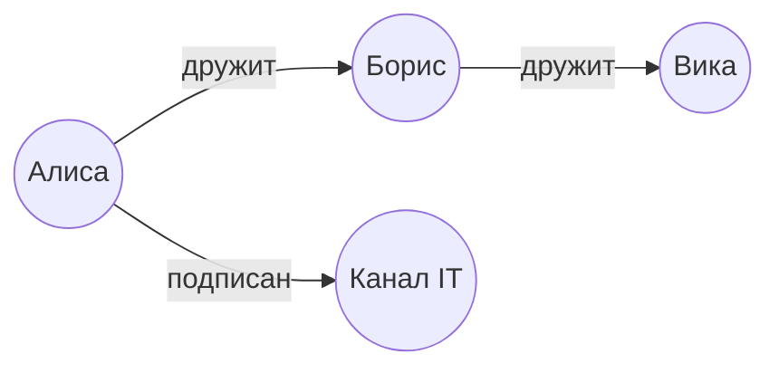
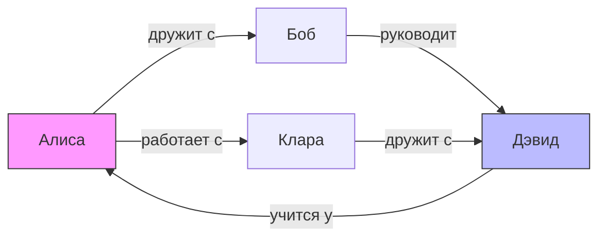

import ExternalPlayEmbed from '@site/src/components/ExternalPlayEmbed';


# Графовые базы данных

<div class="article-tags">
  <span class="tag tag-required">ОБЯЗАТЕЛЬНО</span>
  <span class="tag tag-beginner">ДЛЯ НОВИЧКОВ</span>
</div>

<span class="complexity-badge">Разработчику</span>
<span class="complexity-badge">Аналитику</span>
<span class="complexity-badge">Тестировщику</span>  
<span class="complexity-badge">Архитектору</span>
<span class="complexity-badge">Инженеру</span>

---

## Графовые базы данных




На схеме выше — фрагмент графа — узлы обозначают сущности (например, людей), а рёбра — связи между ними. Интерактивный обход — в блоке ниже. Такой способ представления данных не является новым — графы как математический аппарат известны с XVIII века и активно применяются в теории сетей, логистике, социологии и информатике. Однако только в XXI веке графы получили полноценную реализацию в виде специализированных систем управления базами данных, способных эффективно хранить, индексировать и обрабатывать данные в виде графовых структур.

<ExternalPlayEmbed example="data-markup/graph-traversal-play" title="Обход графа (Cypher)" minHeight={520} />

---

### Что такое графовая структура данных

Граф — это абстрактная структура, состоящая из множества элементов двух типов — **узлов** (nodes, vertices) и **рёбер** (edges, relationships, links), соединяющих эти узлы. В отличие от табличных и иерархических моделей, каждая связь в графе может быть уникальной, иметь собственную семантику, а также нести дополнительную информацию в виде атрибутов.

Граф не обязан быть направленным: связи могут быть однонаправленными (от узла A к узлу B) или двунаправленными (A ↔ B). Направленность отражает природу отношения — например, *"Алиса следует за Бобом"* (направлено) отличается от *"Алиса дружит с Бобом"* (часто рассматривается как симметричное, но не обязательно). Важно понимать, что граф не ограничивает сложность связей: одна и та же пара узлов может быть соединена несколькими рёбрами разных типов, и каждое из них может обладать собственными свойствами.

Ключевое преимущество графовой структуры — её естественность для описания реальных систем, в которых доминируют взаимодействия и зависимости. Так, в социальной сети узлы — пользователи, а рёбра — дружба, подписка, лайки, сообщения. В системе управления знаниями узлы — понятия, а рёбра — классификации (*"является подтипом"*), ассоциации (*"часто упоминается вместе с"*), причинно-следственные связи. В логистике — узлы как склады и узлы как транспортные узлы, а рёбра — маршруты доставки с указанием расстояния, времени, стоимости и ограничений.

Таким образом, граф — *модель данных*, в которой смысл заключён в связях. Это фундаментальное отличие от реляционного подхода, где связь — вторичная конструкция (внешний ключ), требующая JOIN-операций и не имеющая собственной семантики.

---

### Графовая база данных и графовая СУБД

**Графовая база данных** — это база данных, физическая и логическая организация которой ориентирована на хранение графовых структур. Это означает, что узлы и рёбра хранятся в виде самостоятельных объектов первого класса.

**Графовая СУБД** — это программная система, управляющая графовой базой данных — обеспечивает создание, чтение, обновление и удаление (CRUD) узлов и рёбер, поддерживает транзакционность, индексацию, запросы, безопасность и масштабирование. Важно различать термины:
- *Графовая база данных* — это совокупность данных в графовом формате.
- *Графовая СУБД* — это инструментарий для работы с этой базой.

В отличие от объектно-реляционных или документо-ориентированных СУБД, графовые системы строят своё ядро вокруг топологических операций. При выполнении запроса типа *"найти всех друзей друзей пользователя"* графовая СУБД не сканирует таблицы и не комбинирует индексы по внешним ключам — она начинает обход из заданного узла и следует по связям, что делает такой запрос *локальным* и *масштабируемым*: его сложность зависит от ширины и глубины обхода в конкретной части графа.

Это свойство называется **локальностью обхода** и является ключевым преимуществом графовых баз при работе с глубоко связанными данными. В реляционной СУБД тот же запрос потребовал бы нескольких JOIN-операций, число которых растёт экспоненциально с глубиной, и план выполнения мог бы быстро деградировать даже при наличии индексов.

---

### Применение графовых баз данных

Графовые СУБД находят применение там, где доминируют сложные, многомерные, динамичные связи. Ниже перечислены основные области, где традиционные СУБД демонстрируют ограничения, а графовые — превосходство:

---

#### Социальные сети и анализ связей  

В социальных графах важно *как*, *насколько тесно*, *в каком контексте*. Выявление сообществ, расчёт центральности узлов (например, PageRank), обнаружение ботов или мошеннических схем — всё это требует эффективного обхода и анализа подграфов. Графовые базы позволяют выполнять такие операции в реальном времени даже при миллиардах узлов.

---

#### Рекомендательные системы  

Классический подход — коллаборативная фильтрация на основе поведения пользователей. Граф здесь позволяет моделировать *гетерогенную сеть* — пользователи, товары, категории, события (просмотр, покупка, оценка), отзывы. Запрос вида *"найти товары, купленные пользователями, похожими на текущего, но не купленные им самим"* реализуется как короткий путь в графе. Особенно эффективны гибридные подходы, где граф дополняется векторными эмбеддингами — так называемый *GraphRAG* (Graph-augmented Retrieval-Augmented Generation), активно продвигаемый Neo4j.

---

#### Сети знаний и онтологии  

Граф — естественная форма представления знаний (knowledge graphs). Здесь узлы — сущности (люди, места, события, концепции), а рёбра — предикаты (отношения вида *"родился в"*, *"является частью"*, *"описан в источнике"*). Такие графы используются в семантической паутине (RDF/OWL), интеллектуальном поиске, системах поддержки принятия решений. Графовые СУБД поддерживают интеграцию с внешними источниками (через RDF-сторы, API, потоки данных), что позволяет строить универсальные индексы знаний.

---

#### IT-инфраструктура и кибербезопасность  

В задачах управления активами, отслеживания зависимостей между сервисами (service dependency mapping), анализа уязвимостей (например, *"какой путь ведёт от внешней точки до критической БД?"*), графы позволяют быстро моделировать состояние системы и её изменение во времени. Анализ атак (attack path analysis), расследование инцидентов (forensics), построение графов угроз — всё это опирается на эффективный обход и паттерн-матчинг.

---

#### Биоинформатика и фармакология  

Молекулы, белки, гены, заболевания — всё это можно моделировать как узлы; связи могут отражать взаимодействие, ингибирование, экспрессию. Поиск лекарственных мишеней, предсказание побочных эффектов, интеграция данных из разных источников (например, клинических испытаний и публикаций) — типичные задачи для графовых баз.

---

#### Мастер-данные и интеграция  

В корпоративных системах часто существует проблема *разрозненных источников истины* — один и тот же клиент или продукт может иметь разные идентификаторы в CRM, ERP, биллинге. Граф позволяет построить *единую связанную сущность* (golden record) через связи соответствия, разрешение конфликтов, взвешенные доверительные отношения — без необходимости физического объединения данных.

Во всех этих сценариях ключевая выгода — *контекстуализация данных*. Графовая СУБД позволяет извлекать информацию на основе топологии — не "покажи все записи, где поле X = Y", а "найди все пути длиной`≤` 3 от A до B, где рёбра удовлетворяют условию Z". Это качественно иной уровень выразительности.

---

## Neo4j

Neo4j — одна из самых зрелых и широко применяемых графовых систем управления базами данных. Она была представлена в 2007 году и с тех пор развивалась как *native graph database*, то есть система, в которой графовые структуры реализованы на уровне ядра СУБД, а не эмулируются поверх реляционного или документного хранилища.

Официальный статус Neo4j — *property graph database* — данные представлены в виде **узлов**, **связей** (рёбер), **меток** и **свойств**. Эта модель допускает богатую семантику и эффективную индексацию, сохраняя при этом простоту восприятия и гибкость схемы.

---

### Архитектура Neo4j

В основе Neo4j лежит *native graph storage* — набор оптимизированных файлов на диске, в которых узлы и связи хранятся непосредственно как физические структуры с фиксированным размером записи. Каждый узел содержит указатели (offsets) на:
- первый исходящий и первый входящий связи,
- список свойств,
- метки.

Каждая связь представляет собой двунаправленную запись — она содержит ссылки на начальный и конечный узлы, тип связи, указатели на следующую исходящую и входящую связь (для быстрого обхода по связям одного узла), а также ссылку на свойства. Такая структура позволяет выполнять обход графа с минимальным количеством чтений с диска — часто достаточно одного seek-а на узел и одного — на связь.

Индексы в Neo4j реализованы отдельно — для свойств узлов и связей создаются **B-tree** или **Lucene-based full-text индексы**, для меток и типов связей — **token lookup indexes**, позволяющие быстро находить все узлы с заданной меткой. В Enterprise-версии доступны расширенные типы индексов, включая пространственные (`spatial.cartesian`, `spatial.wgs-84`) и векторные (в рамках Graph Data Science).

Транзакционность обеспечивается через **write-ahead log (WAL)** — стандартный механизм, гарантирующий ACID-свойства. Neo4j поддерживает изоляцию уровня `READ_COMMITTED` и `REPEATABLE_READ`, а также оптимистичные и пессимистические блокировки на уровне узлов и связей.

Масштабирование достигается через:
- **вертикальное** — использование мощных серверов (один экземпляр Neo4j может обрабатывать графы размером **сотни терабайт**),
- **горизонтальное** — в Enterprise-версии реализована архитектура **Causal Clustering**, где роли распределены:
  - *Core servers* — хранят данные, обеспечивают согласованность через протокол Raft,
  - *Read replicas* — обслуживают только чтение, реплицируют данные асинхронно, могут быть развёрнуты в географически распределённых зонах.

Также поддерживается **Fabric** — межбазовый уровень, позволяющий выполнять запросы сразу к нескольким базам данных (например, по регионам или по типу данных), объединяя результаты в единый ответ.

---

### Модель данных — property graph

В Neo4j используется модель **property graph**, которая отличается от RDF-графов (стандарт W3C для семантической паутины) следующими чертами:

| Характеристика | Property Graph (Neo4j) | RDF Graph |
|----------------|------------------------|-----------|
| Сущность | Узел с метками и свойствами | Ресурс с URI или blank node |
| Связь | Ребро с типом, направлением, свойствами | Тройка (subject–predicate–object), без свойств у связи |
| Типизация | Метки (произвольные, множественные) | Классы и свойства через онтологии (RDFS, OWL) |
| Хранение | Native, оптимизировано под обход | Часто поверх triple stores (например, Apache Jena) |
| Гибкость | Высокая — нет необходимости в предварительной схеме | Средняя — схема может быть необязательной, но рекомендована |

Property graph особенно удобен для прикладных задач, где связи несут смысловую нагрузку (например, *"дружит с"*, *"купил"*, *"зависит от"*), а не просто являются предикатами. Наличие свойств у связей — критически важная возможность — можно хранить *"дата начала дружбы"*, *"вес рекомендации"*, *"SLA для API-вызова"* — без создания промежуточных узлов.

---

### Язык запросов Cypher

Cypher — это язык, спроектированный *для людей*. Его ключевая идея — **описывать то, что вы ищете, а не как это искать**. Вместо последовательности JOIN-ов и фильтров вы задаёте шаблон графа — и система находит все его вхождения.

Синтаксис построен на ASCII-подобных обозначениях:
- Узел: `(a:Person {name: "Алиса"})`
- Связь: `-[:дружит_с {с_2022: true}]->`
- Путь: `(a)-[:работает_в]->(c)<-[:управляет]-(b)`

Это позволяет *визуально читать* запрос как фрагмент графа.

---

#### Основные конструкции

1. **`MATCH`** — находит все подграфы, соответствующие шаблону. Может включать условия (`WHERE`), опциональные части (`OPTIONAL MATCH`), переменные пути (`[*1..3]`), кратчайшие пути (`shortestPath`).

2. **`WITH`** — промежуточная агрегация и фильтрация. Позволяет разбивать сложные запросы на логические этапы, как в конвейере:
```cypher
   MATCH (u:User)-[:RATED]->(m:Movie)
   WITH u, count(m) AS rated
   WHERE rated > 100
   MATCH (u)-[:RATED {rating: 5}]->(top:Movie)
   RETURN u.name, collect(top.title) AS favorites
```

3. **`MERGE`** — "найди или создай". Ключевой инструмент для идемпотентной загрузки данных. Гарантирует, что шаблон будет существовать ровно один раз:
```cypher
   MERGE (a:Person {email: "alice@example.com"})
     ON CREATE SET a.created = datetime()
     ON MATCH SET a.lastSeen = datetime()
```

4. **Агрегация в графовом контексте** — функции `count()`, `collect()`, `avg()` применяются *внутри групп*, образованных неявно по non-aggregated переменным. Это позволяет, например, посчитать число друзей для каждого пользователя в одном запросе.

5. **Подзапросы (`CALL { ... }`)** — позволяют комбинировать разнородные графовые паттерны (например, `UNION` из связей `FRIEND_OF` и `COLLEAGUE_OF`) с последующей обработкой.

---

#### Пример — рекомендация "друзья друзей, которых вы ещё не знаете"
```cypher
MATCH (me:Person {name: "Алиса"})-[:KNOWS]->(friend)-[:KNOWS]->(foaf)
WHERE NOT (me)-[:KNOWS]->(foaf) AND me <> foaf
RETURN foaf.name AS recommendation, count(*) AS mutual_friends
ORDER BY mutual_friends DESC
LIMIT 5
```
Запрос естественно отражает бизнес-логику. В реляционной СУБД аналогичный запрос потребовал бы минимум двух JOIN-ов, подзапроса с NOT EXISTS и оконной функции для сортировки по популярности.

---

#### Мини-практикум в Neo4j Browser

Повторите в [Neo4j Browser](https://neo4j.com/download/) (локально, Aura free tier или sandbox). Команды выполняются по одной; в конце — очистка тестового графа.

**Шаг 1. Тестовые данные**

```cypher
CREATE (anna:Person {name: 'Анна'}),
       (boris:Person {name: 'Борис'}),
       (vika:Person {name: 'Вика'}),
       (kate:Person {name: 'Катя'})
CREATE (anna)-[:KNOWS {since: 2020}]->(boris),
       (anna)-[:KNOWS]->(vika),
       (boris)-[:KNOWS]->(kate),
       (vika)-[:KNOWS]->(kate);
```

**Шаг 2. Прямые связи**

```cypher
MATCH (p:Person {name: 'Анна'})-[r:KNOWS]->(friend:Person)
RETURN friend.name, r.since;
```

**Шаг 3. Друзья друзей (2 шага)**

```cypher
MATCH (me:Person {name: 'Анна'})-[:KNOWS*2]->(foaf:Person)
WHERE me <> foaf
RETURN DISTINCT foaf.name;
```

**Шаг 4. Рекомендации "знакомые, с которыми ещё не знаком"** — тот же запрос, что в примере выше (с меткой `KNOWS` вместо кириллического типа связи для совместимости с инструментами):

```cypher
MATCH (me:Person {name: 'Анна'})-[:KNOWS]->(friend)-[:KNOWS]->(foaf)
WHERE NOT (me)-[:KNOWS]->(foaf) AND me <> foaf
RETURN foaf.name AS recommendation, count(*) AS mutual_friends
ORDER BY mutual_friends DESC;
```

**Шаг 5. Сравнение с SQL (логика, не синтаксис 1:1)**

В реляционной модели те же сущности — таблицы `person`, `knows(from_id, to_id)`; "друзья друзей" — два `JOIN` по `knows`, фильтр `NOT EXISTS` для исключения уже известных. В графе паттерн `(me)-[:KNOWS*2]->(foaf)` читается как маршрут на диаграмме; планировщик Neo4j идёт по указателям рёбер, а не строит промежуточные hash join на всей таблице.

**Шаг 6. Очистка (только тестовый граф)**

```cypher
MATCH (n) DETACH DELETE n;
```

> В production не используйте `DETACH DELETE` без `WHERE` — здесь граф создан только для учебного упражнения.

Синтаксис Cypher подробнее: [справочник](/encyclopedia/3-data-markup/3-06-nosql/71), интерактивный обход — в блоке `<ExternalPlayEmbed example="data-markup/graph-traversal-play" title="Обход графа (Cypher)" minHeight={520} />` выше.

---

### Mermaid-визуализация и mindmap — сравнение

Для иллюстрации графовой структуры в документации часто используется **Mermaid** — язык описания диаграмм, поддерживаемый в Markdown (включая Docusaurus). Вот как может выглядеть фрагмент социального графа:



Эта диаграмма — *статическая визуализация*. Она не хранит данные, не поддерживает запросы, не масштабируется. Её цель — пояснение.

**Mindmap** (карта памяти) — метод визуального структурирования идей. Обычно это древовидная структура с центральным узлом и ветвями. Хотя mindmap можно представить как граф, он:
- не поддерживает циклы (а графы — поддерживают),
- не допускает множественных типов связей,
- не хранит свойства у связей.

Таким образом, mindmap — инструмент *мышления*, а графовая база — инструмент *хранения и анализа*. Можно экспортировать данные из Neo4j в формат mindmap для презентации, но нельзя использовать mindmap как СУБД.

---

### Экосистема Neo4j и интеграции

Neo4j не существует изолированно. Она встраивается в современные архитектуры через:

- **APOC (Awesome Procedures On Cypher)** — библиотека процедур для расширения возможностей — работа с JSON, HTTP-вызовы, генерация данных, миграции.
- **Neo4j Graph Data Science Library** — реализация 65+ алгоритмов: от PageRank и Betweenness Centrality до Louvain community detection и node2vec эмбеддингов.
- **Neo4j Bloom** — инструмент визуального исследования графов для аналитиков (без знания Cypher).
- **Neo4j ETL Tools** — коннекторы для Kafka, Spark, JDBC, CSV/JSON импорт.
- **LangChain & LlamaIndex интеграции** — поддержка GraphRAG: контекст для LLM извлекается по релевантным подграфам, а не по документам.

Особое внимание — **GraphRAG**, упомянутому на сайте Neo4j как ключевое направление. В отличие от классического RAG (Retrieval-Augmented Generation), где ретривал идёт по текстовым чанкам, GraphRAG:
1. Строит knowledge graph из неструктурированных данных (NER + relation extraction),
2. При запросе находит *связанные сущности и пути* в графе,
3. Формирует контекст как *структурированное описание связей* (например: *"Алиса → дружит с → Боб → работает в → Neo4j → использует → Cypher"*),
4. Передаёт его в LLM — повышая точность, объяснимость и устойчивость к hallucination.

Книга *Essential GraphRAG* (Manning, 2024) — канонический гайд по этой практике.

---

### Безопасность и управление

Neo4j Enterprise Edition предлагает развитую систему привилегий:
- Разделение прав на уровне **графа**, **узла/связи**, **свойства** (`GRANT TRAVERSE`, `DENY READ {email}`),
- Управление пользователями, ролями, базами данных (`CREATE USER`, `GRANT ROLE`),
- Аудит транзакций, шифрование на диске и в транзите, соответствие стандартам (SOC 2, ISO 27001, GDPR).

Все это делает Neo4j применимой в регулируемых отраслях — финтехе, здравоохранении, госсекторе.

---

## Neo4j в 2025 году — состояние платформы, ключевые направления и практики

По состоянию на 2025 год Neo4j остаётся ведущей графовой СУБД с более чем **300 000 разработчиков**, **80+ клиентами из Fortune 100** и **170+ партнёрами** в экосистеме. Платформа эволюционировала от простой базы данных к *графовой платформе для построения интеллектуальных приложений*, особенно в контексте ИИ.

---

### Основные векторы развития

#### 1. **AI-Ready Data by Design**

Neo4j позиционируется как *естественная среда для подготовки данных под ИИ*. В отличие от "плоских" наборов данных, где связи теряются или кодируются вручную, графовая модель сохраняет контекст:
- сущности (люди, продукты, события) — как узлы,
- семантические отношения — как связи с типами и свойствами,
- динамика — через временные метки, версионирование, транзакционный журнал.

Результат — *знания*, пригодные для объяснимых моделей. Neo4j позиционирует knowledge graph как источник точных и объяснимых данных для ИИ (accurate, explainable data for AI).

---

#### 2. **GraphRAG — следующее поколение RAG**

Традиционный Retrieval-Augmented Generation (RAG) страдает от "разрыва контекста": LLM получает набор фрагментов текста без их взаимосвязей. **GraphRAG**, активно продвигаемый Neo4j (включая книгу *Essential GraphRAG*, Manning, 2024), решает эту проблему:

1. **Извлечение сущностей и связей** из неструктурированных данных (через NER, OpenIE, LLM-вызовы).
2. **Построение knowledge graph** в Neo4j — узлы — сущности, связи — отношения, свойства — метаданные (источник, достоверность, временная привязка).
3. **Контекстный ретривал**: при запросе система ищет *пути в графе*, включающие:
   - прямые сущности,
   - ближайшие соседи,
   - семантические маршруты (например, *"A → часть → B ← влияет на ← C"*).
4. **Формирование структурированного промпта** для LLM — описания графа (можно в формате Cypher, JSON или естественного языка).

Преимущества:
- **Повышенная точность**: устраняется шум от несвязанных чанков.
- **Объяснимость**: можно визуализировать, *почему* тот или иной фрагмент был включён.
- **Traceability**: каждая часть контекста имеет источник и путь доказательства.
- **Устойчивость к галлюцинациям**: LLM оперирует проверенными связями.

Neo4j предлагает готовые пайплайны GraphRAG через интеграции с LangChain, LlamaIndex и собственные APOC-процедуры.

---

#### 3. **Агентные системы (Agentic Innovation)**

Neo4j развивает инструменты для построения *production-grade агентов* — система, способная:
- планировать действия на основе графа целей и зависимостей,
- динамически обновлять своё состояние (например, "задача X выполнена → разблокировать Y"),
- объяснять принятые решения через цепочки связей.

Граф здесь играет роль:
- **памяти** (long-term memory в виде узлов и связей),
- **планировщика** (поиск кратчайшего или оптимального пути к цели),
- **лога аудита** (каждое действие — новая связь или узел с меткой `:Action`).

---

## Построение knowledge graph

Рассмотрим типичный workflow построения knowledge graph на Neo4j — без формул, с акцентом на этапы и инструменты.

---

### Этап 1. Моделирование домена

На этом этапе определяются:
- **Сущности** → метки узлов (`:Person`, `:Organization`, `:Document`, `:Concept`),
- **Отношения** → типы связей (`:AUTHOR_OF`, `:MENTIONS`, `:IS_A`, `:PART_OF`),
- **Атрибуты** → свойства узлов и связей (`title`, `date`, `confidence_score`, `source_url`).

Важно: модель гибкая. Можно начать с минимального набора и расширять по мере поступления данных.

---

### Этап 2. Импорт данных

Neo4j поддерживает множественные источники:
- **CSV / JSON** — через `LOAD CSV` (с поддержкой заголовков, кастомных разделителей, периодической фиксации транзакций):
```cypher
  USING PERIODIC COMMIT 1000
  LOAD CSV WITH HEADERS FROM 'file:///people.csv' AS row
  CREATE (:Person {
    name: row.name,
    birthYear: toInteger(row.birth_year)
  });
```
- **API / Kafka / Spark** — через APOC или коннекторы (например, `apoc.load.json`, `apoc.load.jdbc`).
- **ETL-процессы** — с использованием `MERGE` для идемпотентности:
```cypher
  MATCH (org:Organization {id: row.org_id})
  MERGE (p:Person {id: row.person_id})
    ON CREATE SET p.name = row.name
  MERGE (p)-[:WORKS_AT {from: date(row.start_date)}]->(org);
```

---

### Этап 3. Индексация и ограничения

Для производительности и целостности:
- **Индексы**:
```cypher
  CREATE INDEX FOR (p:Person) ON (p.name);
  CREATE INDEX FOR (d:Document) ON (d.id);
  CREATE FULLTEXT INDEX docs_idx FOR (d:Document) ON EACH [d.title, d.content];
```
- **Ограничения** (Enterprise-функционал, но часть доступна в Community):
```cypher
  CREATE CONSTRAINT person_id_unique ON (p:Person) ASSERT p.id IS UNIQUE;
  CREATE CONSTRAINT doc_requires_title ON (d:Document) ASSERT d.title IS NOT NULL;
```

---

### Этап 4. Запросы и анализ

Примеры типичных задач:

---

#### 4.1. Поиск по контексту
> "Найти все документы, в которых упоминаются и *Алиса*, и *Neo4j*, и хотя бы один из её коллег"  
```cypher
MATCH (a:Person {name: "Алиса"})-[:WORKS_WITH]->(colleague),
      (d:Document)-[:MENTIONS]->(a),
      (d)-[:MENTIONS]->(:Organization {name: "Neo4j"}),
      (d)-[:MENTIONS]->(colleague)
RETURN d.title, d.date
ORDER BY d.date DESC;
```

---

#### 4.2. Расчёт влияния (PageRank)

Через Graph Data Science Library:
```cypher
CALL gds.pageRank.stream('myGraph')
YIELD nodeId, score
RETURN gds.util.asNode(nodeId).name AS name, score
ORDER BY score DESC;
```

---

#### 4.3. Обнаружение сообществ (Louvain)
```cypher
CALL gds.louvain.stream('myGraph')
YIELD nodeId, communityId
RETURN communityId, count(*) AS size
ORDER BY size DESC;
```

---

### Этап 5. Визуализация и интерактивное исследование

Neo4j Browser и Bloom позволяют:
- отображать подграфы по запросу,
- фильтровать по меткам/свойствам,
- строить "узкие" представления (например, только связи `:MENTIONS`),
- экспортировать в PNG, JSON, Cypher.

Mermaid-диаграммы (как в начале главы) полезны для статической документации, но не заменяют динамические инструменты.

---

## Сравнение с альтернативами — когда Neo4j — не единственный выбор

| Критерий                     | Neo4j (Property Graph)       | Amazon Neptune (RDF + PG)   | JanusGraph (на базе Cassandra/HBase) | TigerGraph (Native MPP)     |
|-----------------------------|------------------------------|-----------------------------|--------------------------------------|-----------------------------|
| **Модель**                  | Property Graph               | RDF + ограниченный PG       | Property Graph                       | Property Graph              |
| **Язык запросов**           | Cypher (родной), GQL (в будущем) | Gremlin, SPARQL, openCypher | Gremlin                              | GSQL (процедурный)          |
| **Масштабирование**         | Вертикальное + Causal Clustering (EE) | Горизонтальное (AWS)        | Горизонтальное                       | MPP (параллельные обходы)   |
| **GraphRAG / LLM-ready**    | ✅ Полная поддержка (APOC, GDS, LangChain) | ⚠️ Через Gremlin + внешние инструменты | ⚠️ Ограниченная                      | ⚠️ Через GSQL + SDK         |
| **Enterprise-функции**      | Широкие (безопасность, backup, SLA) | Через AWS IAM, CloudWatch   | Требует доп. настройки               | Высокая стоимость лицензии  |
| **Лицензия**                | Community (AGPL), Enterprise (коммерч.) | Коммерческая (AWS)          | Apache 2.0                           | Коммерческая                 |

**Вывод**:  
- Если нужна **максимальная продуктивность разработки**, интеграция с ИИ и зрелая экосистема — **Neo4j** оптимален.  
- Если требуется **масштабируемость на сотни TB+ в managed-облаке** — **Neptune**.  
- Если уже есть **Cassandra/HBase** и нужна open-source альтернатива — **JanusGraph**.  
- Для **сверхглубоких обходов (10+ hops)** в реальном времени — **TigerGraph**.

---

{/* http-basics-link  */}
<div class="callout callout--tip">
  <div class="callout-title">Основа по протоколу</div>

  <div class="callout-body">
  Базовый разбор HTTP и HTTPS находится в отдельной статье — [HTTP как основа веб-интеграций](/encyclopedia/2-system-network/2-09-osnovy-integratsionnogo-vzaimodeystviya/118).
</div>
  </div>

{/* sidebar-collections */}

---

## В подборках

Статья входит в [тематические подборки](/about/collections) и блок "С чего начать?" на [главной](/). Соседние шаги того же маршрута:

**Нейросети и ИИ** — [Векторные базы данных](/encyclopedia/3-data-markup/3-06-nosql/812), [Трансформеры и NLP — о разделе](/encyclopedia/6-ai/6-09-transformery-i-nlp/intro), [Применение ИИ — о разделе](/encyclopedia/6-ai/6-06-primenenie-ii/intro), [Разработка ИИ — о разделе](/encyclopedia/6-ai/6-05-razrabotka-ii/intro), [Модели и инструменты — о разделе](/encyclopedia/6-ai/6-04-modeli-i-instrumenty/intro), [Нейросети — о разделе](/encyclopedia/6-ai/6-03-neyroseti/intro).

{/* /sidebar-collections */}

---
