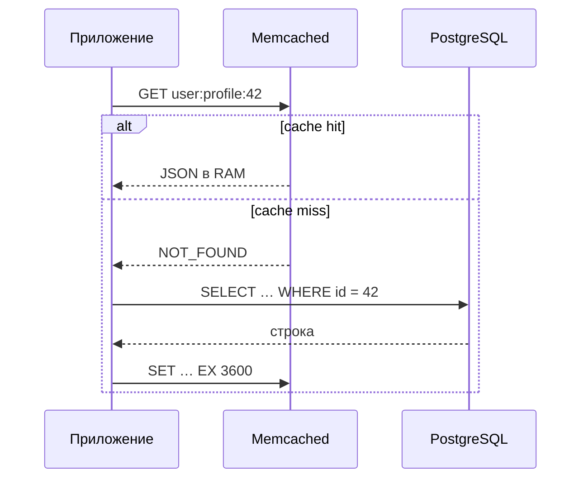

import MemcachedCachePlay from '@site/src/components/MemcachedCachePlay.jsx';

# Memcached - кэширование в оперативной памяти

<div class="article-tags">
  <span class="tag tag-required">ОБЯЗАТЕЛЬНО</span>
  <span class="tag tag-beginner">ДЛЯ НОВИЧКОВ</span>
</div>

<span class="complexity-badge">Разработчику</span>
<span class="complexity-badge">Аналитику</span>
<span class="complexity-badge">Тестировщику</span>  
<span class="complexity-badge">Архитектору</span>
<span class="complexity-badge">Инженеру</span>

---

## Memcached

> **Как читать эту главу.** Сначала — зачем нужен кэш и живой пример **cache-aside** (демо ниже). Затем паттерны, схема запроса и код на **pymemcache**. Дальше — устройство памяти (slab, LRU), кластер на consistent hashing, сценарии и отличие от Redis. Команды протокола и флаги `-m`/`-l` — в [справочнике](/encyclopedia/3-data-markup/3-06-nosql/81); установка и telnet за 15 минут — в [Первых шагах](/encyclopedia/3-data-markup/3-06-nosql/8111).

---

### Зачем Memcached, если есть PostgreSQL?

Представьте страницу профиля: первый запрос идёт в SQL за 15–30 мс, следующие сотни запросов за ту же минуту снова бьют в ту же строку `users`. Индексы и шардирование помогают базе, но **повтор одной и той же работы** остаётся.

**Memcached** решает узкую задачу: держать готовый ответ в RAM под коротким ключом (`user:profile:42`) и отдавать его за доли миллисекунды в локальной сети. Это не "вторая база", а **ускоритель**: при падении кэша приложение по-прежнему читает PostgreSQL — просто медленнее.

<MemcachedCachePlay />

Потрогайте демо: **GET** → при промахе "backend" → **SET** с TTL; при переполнении слотов срабатывает **LRU**. Так же ведёт себя продакшен, только ключей миллионы.

---

### Что такое Memcached (коротко)

**Memcached** — открытый сетевой демон **"ключ → байты"** в оперативной памяти. Сервер не знает JSON, SQL и схем: только `get` / `set` / `delete` и несколько атомарных команд (`incr`, `cas`). Всё остальное — на стороне приложения (сериализация, инвалидация, выбор TTL).

| Вопрос | Ответ |
|--------|--------|
| Порт по умолчанию | **11211** (TCP; UDP лучше отключить в prod) |
| Это СУБД? | **Нет** — нет запросов по полям, транзакций, персистентности на диск |
| Источник истины | Всегда **ваша БД** или API; кэш можно потерять |
| Чем не Redis? | Memcached — **только кэш**; Redis — структуры, pub/sub, persistence (см. [сравнение](#memcached-vs-redis) ниже) |
| Чем не CDN? | CDN кэширует **HTTP-ответ**; Memcached — **данные до рендера** страницы |

Демон слушает сеть (часто внутренний VLAN), клиенты — `pymemcache`, `libmemcached`, EnyimMemcached для .NET и др. Они же распределяют ключи по нескольким узлам (**consistent hashing**).

**Главное правило:** отсутствие ключа в Memcached — **нормальный промах**, а не ошибка. Архитектура должна пережить полную очистку кэша без потери бизнес-данных.

---

### Принцип локальности — почему кэш "угадывает" запросы

Кэш работает не магией, а **локальностью**: недавно нужные данные снова понадобятся с высокой вероятностью. Две привычные формы:

- **Временная локальность** — если элемент данных был использован один раз, высока вероятность его повторного использования в ближайшее время. Например, страница профиля пользователя может запрашиваться десятки раз в минуту при активности на форуме или социальной сети.
- **Пространственная локальность** — если обратились к одному элементу данных, велика вероятность последующего обращения к соседним элементам. В контексте web-приложений это проявляется в виде выборок, объединённых по смыслу: список последних комментариев, топ-10 новостей, рекомендации для пользователя.

Эти закономерности позволяют кэшу эффективно "предугадывать" будущие запросы, даже не обладая логикой бизнес-процесса. Буфер процессора первого уровня работает по тем же принципам: он хранит недавно использованные инструкции, потому что циклы и функции многократно исполняются; файловая система кэширует недавно прочитанные блоки, поскольку программы обычно последовательно читают файлы; даже автомагнитола буферизирует следующие секунды аудиопотока, полагая, что пользователь не будет постоянно перематывать трек.

В web-среде локальность проявляется особенно ярко. Некоторые страницы (главная, личный кабинет, популярные статьи) получают существенно больший трафик, чем остальные. Определённые данные (настройки темы, информация о текущем пользователе, баннеры, геолокация по IP) используются практически в каждом запросе. Даже тяжёлые аналитические выборки — например, "рейтинг авторов за последнюю неделю" — могут обновляться раз в час, но запрашиваться тысячи раз за это время. Кэширование таких данных позволяет снизить нагрузку на бэкенд с линейной до почти константной: первое обращение "платит" полную стоимость запроса, все последующие — только стоимость обращения к кэшу.

Memcached специализируется именно на таком сценарии: *однократное вычисление — многократное потребление*. Он дополняет базу данных, создавая "буферную зону" между приложением и источником истины.

---

### Паттерны кэширования (перед кодом)

В Memcached на практике почти всегда **cache-aside**: приложение само читает кэш и при промахе ходит в БД.

| Паттерн | Кто пишет в Memcached | Когда |
|---------|----------------------|--------|
| **Cache-aside** | Приложение после чтения из SQL | Каталоги, профили, агрегаты страниц |
| **Read-through** | Обёртка/библиотека при miss | Редко; логика кэша в одном слое |
| **Write-through** | Одновременно в кэш и БД | Нужна жёсткая синхронность — редко с Memcached |

Согласованность — **eventual**: между `UPDATE` в БД и `delete` в кэше пользователь может на доли секунды увидеть старое значение. Для большинства сайтов это приемлемо.

---

### Общая схема — cache-aside по шагам

Три этапа: **проверка** → при промахе **вычисление** → **сохранение** с TTL.



Без кэша каждый вызов `get_user_profile` бьёт в БД (10–30 мс и выше). С Memcached — типичный **cache-aside**:

```python
# Псевдо-API — идея (ниже — pymemcache)
def get_user_profile(user_id: int) -> dict:
    key = f"user:profile:{user_id}"
    cached = cache.get(key)
    if cached is not None:
        return deserialize(cached)

    row = db.execute(
        "SELECT id, name, email FROM users WHERE id = %s", (user_id,)
    ).fetchone()
    cache.set(key, serialize(row), expire=3600)  # pymemcache: expire, не ttl
    return row
```

Дальше — пошагово:

1. Приложение формирует канонический ключ, например, `user:profile:12345`, где `12345` — идентификатор пользователя. Ключ должен быть детерминированным: одному и тому же запросу всегда соответствует один и тот же строковый идентификатор.
2. Выполняется операция `GET` к Memcached. Это сетевой запрос, время которого определяется в первую очередь задержкой канала (RTT) и, в меньшей степени, нагрузкой на сервер кэша. В локальной сети типичное время — 0.1–0.5 мс.
3. Если значение найдено, оно десериализуется (если требовалось) и возвращается вызывающей функции. Цепочка на этом завершается — обращения к базе данных не происходит.
4. Если значение отсутствует ("промах кэша"), приложение выполняет оригинальный запрос к бэкенду, получает результат, сериализует его (например, в JSON или бинарный формат) и выполняет операцию `SET` с указанием ключа и, как правило, *времени жизни* (TTL — time-to-live). TTL задаётся в секундах и может варьироваться от 1 до 2 592 000 (30 дней); значение 0 трактуется как "бесконечное" хранение, хотя на практике оно ограничено объёмом памяти.

Эта схема, называемая *cache-aside* (или lazy loading), является наиболее распространённой. Её достоинства — простота, гибкость и отсутствие зависимости от порядка инициализации. Однако она накладывает ответственность за актуальность кэша на приложение: при изменении данных в источнике необходимо либо обновить значение в кэше, либо инвалидировать его.

**Инвалидация** после `UPDATE` в БД — ответственность приложения:

```python
# Вариант A — сразу положить свежее значение
client.set(f"user:profile:{user_id}", json.dumps(new_profile), expire=3600)

# Вариант B — удалить ключ — проще, но следующий читатель снова нагрузит БД
client.delete(f"user:profile:{user_id}")
```

Рабочий пример на **pymemcache**:

```python
import json
from pymemcache.client.base import Client

client = Client(("127.0.0.1", 11211))

def get_user_profile(user_id: int) -> dict | None:
    key = f"user:profile:{user_id}"
    raw = client.get(key)
    if raw is not None:
        return json.loads(raw)

    row = fetch_user_from_db(user_id)  # ваша функция доступа к PostgreSQL и т.д.
    if row is not None:
        client.set(key, json.dumps(row), expire=3600)
    return row

def invalidate_user_profile(user_id: int) -> None:
    client.delete(f"user:profile:{user_id}")
```

Протокол можно проверить без SDK (Linux, GNU `nc`):

```bash
printf "set demo:hello 0 60 5\r\nhello\r\nget demo:hello\r\n" | nc -q 1 127.0.0.1 11211
```

На Windows удобнее [Первые шаги](/encyclopedia/3-data-markup/3-06-nosql/8111) (демо-терминал) или `telnet localhost 11211`. Формат: `set <key> <flags> <exptime> <bytes>\r\n` затем тело. `exptime` в секундах; `0` — без срока, но **LRU** вытеснит при нехватке RAM.

Важно, что ни один из этих подходов не гарантирует *мгновенную* согласованность: между моментом изменения в базе и обновлением кэша может пройти небольшой промежуток времени, в течение которого клиенты получат устаревшие данные. В большинстве web-приложений это допустимо: пользователь не заметит задержки в несколько сотен миллисекунд при обновлении профиля, но ощутит раздражение от задержки в секунду при его открытии. Именно поэтому Memcached применяется там, где важна *конечная согласованность*.

---

### Внутреннее устройство Memcached

Здесь — "под капотом": почему задержки предсказуемы и почему нельзя "просто перечислить все ключи". Redis сознательно богаче; Memcached — **минимальный быстрый KV в RAM**.

---

#### Операции за O(1) *на один ключ*

`get` / `set` / `delete` / `incr` по конкретному ключу — **амортизированно константное** время. При нехватке памяти срабатывает **eviction** (см. slab ниже).

- **Хранение данных в виде хеш-таблицы в памяти**. Ключ хешируется с использованием неблокирующего алгоритма (изначально — Jenkins hash, в более поздних версиях — MurmurHash3), результат хеша определяет ячейку (bucket) в хеш-таблице. Разрешение коллизий осуществляется методом цепочек (chaining), но длина цепочек строго ограничена: если количество записей в bucket превышает порог, Memcached начинает эвакуировать старые записи по стратегии LRU даже до истечения TTL.
- **Отсутствие сложных структур данных**. Memcached не поддерживает списки, множества, хеш-мапы внутри значений — значение всегда представляет собой неинтерпретируемую последовательность байтов. Это устраняет необходимость в сериализации/десериализации на стороне сервера и упрощает управление памятью.
- **Запрет на операции с линейной сложностью**. В Memcached сознательно отсутствуют такие возможности, как перебор всех ключей, поиск по шаблону, выборка по префиксу или массовое удаление. Даже команда `stats` — предназначенная для мониторинга — не возвращает список ключей, а лишь агрегированные счётчики. Это не ограничение реализации, а архитектурное требование: любая операция, время выполнения которой растёт с ростом объёма данных, потенциально может нарушить предсказуемость задержек.

---

#### Управление памятью

Одной из наиболее важных и характерных особенностей Memcached является использование *slab-аллокатора* вместо стандартного `malloc`/`free`. Эта техника направлена на борьбу с фрагментацией памяти и обеспечивает стабильную производительность даже при длительной работе и высокой интенсивности запросов.

Принцип slab-аллокатора заключается в следующем: вся выделенная Memcached память разбивается на фиксированные блоки — *slabs*. Каждый slab принадлежит к определённому *классу* (slab class), характеризующемуся размером блока — *chunk*. Например, slab class 1 содержит чанки по 96 байт, class 2 — по 120 байт, class 3 — по 152 байта и так далее, с геометрическим увеличением (коэффициент ~1.25 по умолчанию). При поступлении запроса на сохранение значения Memcached выбирает наименьший slab class, чей chunk вмещает ключ, значение и служебные метаданные (флаги, TTL, размер). Затем свободный чанк из этого slab’а выделяется под запись.

Преимущества подхода:
- **Отсутствие фрагментации**: память внутри slab’а переиспользуется внутри slab class. Это исключает появление "дыр", которые делают невозможным выделение крупных непрерывных блоков.
- **Предсказуемое время выделения/освобождения**: операции сводятся к работе со стеком свободных чанков в рамках slab’а — O(1).
- **Эффективное использование кэша процессора**: данные одного slab class размещаются компактно, что улучшает локальность по памяти.

Недостаток — *внутренняя фрагментация*: если значение занимает 100 байт, а минимальный подходящий чанк — 120 байт, 20 байт будут неиспользованы. Однако на практике потери редко превышают 10–15%, а управление размерами классов (через параметры `-f`, `-n`, `-L`) позволяет адаптировать аллокатор под специфику нагрузки.

---

#### Модель ввода-вывода

Memcached изначально использовал однопоточную архитектуру на основе *асинхронного I/O* (epoll в Linux, kqueue в BSD, IOCP в Windows). Это означает, что обработка всех сетевых соединений выполняется в одном потоке управления, без переключения контекста и синхронизации между потоками. Такая модель обеспечивает минимальные накладные расходы и высокую масштабируемость по количеству соединений — один экземпляр Memcached может обслуживать десятки тысяч одновременных клиентов.

Однако с развитием многоядерных процессоров стало очевидно, что однопоточная модель не использует всю доступную вычислительную мощность. Начиная с версии 1.2.3, Memcached получил поддержку *многопоточности*, но с важным уточнением: потоки не привязаны к соединениям. Вместо этого:
- Основной поток принимает новые соединения.
- Рабочие потоки (по умолчанию — по одному на ядро) обрабатывают уже установленные соединения, чередуясь по циклическому принципу.
- Хеш-таблица защищена мьютексами *на уровне bucket’ов*, что минимизирует конкуренцию: два запроса к разным ключам, попавшим в разные bucket’ы, могут выполняться полностью параллельно.

Таким образом, многопоточность в Memcached — это средство задействовать все ядра процессора при высокой *конкурентной* нагрузке. Процент загрузки CPU у типичного Memcached-сервера редко превышает 5–10% даже при интенсивном использовании, что свидетельствует о доминировании сетевых и задержек памяти в общем времени отклика.

---

### Распределение данных и отказоустойчивость

Memcached изначально проектировался как *распределённая* система. Серверное приложение не имеет встроенных механизмов репликации, шардирования или координации — эти функции реализуются на уровне клиентской библиотеки. Это делает архитектуру гибкой: разработчик сам выбирает стратегию распределения, исходя из требований к производительности, отказоустойчивости и согласованности.

---

#### Клиентская маршрутизация

Ранние версии клиентских библиотек использовали простой *модульный хеш*: `server_index = hash(key) % N`, где `N` — количество серверов. Такой подход прост, но обладает критическим недостатком: при добавлении или удалении сервера (например, из-за сбоя) *все* ключи перераспределяются — кэш полностью "сбрасывается", что приводит к массовым промахам и лавинообразному росту нагрузки на бэкенд.

Современные клиенты (`libmemcached`, `spymemcached`, EnyimMemcached) используют **consistent hashing**: ключи и серверы на кольце хешей. У каждого физического узла — несколько **virtual nodes (vnodes)**. Ключ попадает на первый vnode **по часовой стрелке** от своего хеша.

> Не путайте **vnodes** с **репликацией**: Memcached сам копии не хранит — двойной `set` в коде, если нужна избыточность.

Преимущества:
- При добавлении или удалении сервера затрагивается только *часть* ключей — те, которые лежат между удаляемым (или добавляемым) узлом и его соседом по кольцу. В идеальном случае перераспределению подвергается не более `1/N` ключей.
- Возможность взвешенного распределения: серверам с большей ёмкостью памяти можно назначить больше виртуальных узлов, увеличивая долю ключей, которые они хранят.

Важно: согласованный хеш не обеспечивает отказоустойчивость *по умолчанию*. Если сервер выходит из строя, его ключи становятся недоступны до тех пор, пока клиент не обнаружит сбой (по таймауту соединения) и не перенаправит запросы. Но именно локализованный характер перераспределения делает возможным ручное или автоматическое восстановление без катастрофических последствий.

---

#### Обработка сбоев

Memcached рассматривает потерю данных как *неизбежное и допустимое событие*. Сервер не сохраняет содержимое кэша на диск, не делает реплики, не уведомляет клиентов об изменениях. В случае аварийного завершения процесса или отключения питания всё содержимое кэша теряется. Это не недостаток — это проектировочное решение, направленное на упрощение, повышение скорости и минимизацию рисков взаимной блокировки.

Архитектура приложения должна строиться на предположении, что *любой запрос к Memcached может завершиться промахом*. В этом смысле Memcached ведёт себя как *опциональный ускоритель*. Хорошо спроектированная система переживёт полную потерю кэша и сохранит работоспособность при частичных сбоях — например, при потере 30% серверов в кластере.

Для повышения надёжности в критичных сценариях применяются дополнительные меры:
- **Репликация на уровне приложения**: при записи (`set`) отправлять копию значения сразу на два независимых сервера ("master" и "backup"). При чтении сначала обращаться к первичному, при ошибке — к резервному. Это увеличивает сетевой трафик и латентность записи, но снижает вероятность промаха.
- **Гибридные стратегии**: использовать Memcached для некритичных данных (кэш страниц, агрегатов), а для сессий и других важных временных данных — более надёжные хранилища (Redis с persistence, реляционная таблица с TTL).
- **Грациозная деградация**: при обнаружении массовых промахов (например, более 50% за секунду) приложение может временно отключить использование кэша для тяжёлых операций, чтобы не допустить перегрузки бэкенда.

---

### Типы данных и операции

На сервере один тип — **blob байтов**. JSON и счётчики — соглашения клиента. Команды **атомарны для одного ключа**; транзакций на несколько ключей нет. Полная таблица ответов — в [справочнике](/encyclopedia/3-data-markup/3-06-nosql/81#команды-ascii-протокола).

---

#### Базовые операции

```text
set session:abc 0 3600 11
hello world
STORED

get session:abc
VALUE session:abc 0 11
hello world
END
```

- **get** `<key>` — получить значение по ключу. Возвращает данные или `NOT_FOUND`.
- **set** `<key> <flags> <exptime> <bytes>` — установить значение. `exptime` — TTL в секундах (0 = без явного срока, но объект может быть вытеснен LRU).
- `add <key> …` — установить значение, *только если ключ отсутствует*. Аналог операции "вставить, если не существует".
- `replace <key> …` — установить значение, *только если ключ существует*.
- удалить ключ немедленно или отложить удаление на указанное время (в секундах), что полезно для предотвращения "шторма промахов".

```sql
delete <key> [time]
```

---

#### Атомарные операции для конкурентных сценариев

```text
incr page:views:123 1
157
```

- **incr** / **decr** `<key> <value>` — атомарно изменить числовое значение (ASCII-целое). При **decr** ниже нуля значение не уходит в минус.
- `append <key> <value>` / `prepend <key> <value>` — дописать данные в конец или начало существующего значения. Требует, чтобы ключ уже существовал.
- `gets <key>` / `cas <key> <flags> <exptime> <bytes> <cas_unique>` — механизм *compare-and-swap*. `gets` возвращает значение и уникальный идентификатор версии (CAS token). `cas` обновляет значение, только если текущий CAS token совпадает с переданным. Это позволяет реализовать optimistic concurrency control без блокировок.

Например, инкремент счётчика просмотров можно реализовать так:

```text
> incr page:views:123 1
157
```

А обновление рейтинга с проверкой версии — так:

```text
> gets user:rating:456
VALUE user:rating:456 0 2
42
123456789  ← CAS token
END

> cas user:rating:456 0 0 2 123456789
43
STORED
```

Если между `gets` и `cas` кто-то успел изменить значение, CAS token изменится, и команда вернёт `EXISTS` — приложение может повторить операцию.

Отсутствие транзакций, JOIN’ов, индексов — следствие философии Memcached: *быстро хранить и отдавать то, что уже готово*. Любая логика выше этого уровня — задача приложения.

---

### Сценарии применения Memcached в реальных системах

Memcached почти никогда не стоит один — он снимает повторяющуюся нагрузку с БД и API. Ниже — от самого частого к более спорному.

---

#### Кэширование результатов запросов к базе данных

Самый распространённый сценарий — замена повторяющихся SQL- или API-вызовов на обращения к кэшу. Это особенно эффективно для:
- **Статичных или медленно меняющихся данных**: справочники, конфигурации, метаданные (типы документов, статусы заказов), географические справочники.
- **Агрегированных выборок**: рейтинги, статистика, "горячие" топики, рекомендации — результаты сложных JOIN’ов и GROUP BY, обновляемые по расписанию (например, раз в 5 минут).
- **Персонализированных данных с высокой частотой обращения**: профиль пользователя, список избранных товаров, корзина (при условии, что синхронизация с бэкендом происходит при оформлении заказа).

Ключевой момент — *канонизация ключа*. Ключ должен однозначно идентифицировать запрос и его параметры. Для запроса `SELECT * FROM articles WHERE category = ? AND lang = ?` хорошим ключом будет `articles:cat:tech:lang:ru`, а не просто `articles_tech`. Это предотвращает конфликты и позволяет точно инвалидировать подмножество данных при изменении категории или языка.

Кэшировать следует *результат*, преобразованный в прикладной объект. Например, после `db_select()` данные сериализуются в JSON или бинарный формат (MessagePack, Protocol Buffers), а в кэш помещается именно этот объект. Это устраняет необходимость повторного преобразования при каждом извлечении из кэша.

---

#### Кэширование фрагментов страниц (fragment caching)

В отличие от кэширования всей страницы (full-page caching), которое требует сложной инвалидации при любом изменении, фрагментное кэширование сохраняет отдельные блоки — "виджеты": меню навигации, баннеры, блоки отзывов, динамические подвалы. Каждый фрагмент имеет собственный TTL и инвалидируется независимо.

Преимущества:
- Гибкость: статичные блоки кэшируются надолго, динамические — на несколько секунд.
- Изоляция ошибок: сбой при генерации одного блока не приводит к падению всей страницы.
- Совместимость с CDN: фрагменты, не зависящие от пользователя (например, топ-новостей), можно отдавать через edge-кэш.

В контексте Memcached такой подход реализуется на уровне шаблонизатора: перед рендерингом блока проверяется его ключ (`fragment:header:ru`, `fragment:sidebar:user:123`); при промахе выполняется генерация и результат сохраняется.

---

#### Сессии и временные состояния

Хотя Memcached не гарантирует сохранность данных, он широко применяется для хранения *сессий пользователей* в веб-приложениях, особенно в распределённых окружениях. Преимущества:
- Единое хранилище для всех frontend-серверов: пользователь может перейти с `web-01` на `web-02` без потери сессии.
- Автоматическая "чистка" устаревших сессий: истечение TTL равносильно выходу пользователя.
- Высокая скорость авторизации: извлечение сессии занимает `<`1 мс, тогда как SELECT по токену в БД — десятки миллисекунд.

Критичность потери сессии варьируется. Для публичных сайтов (блоги, СМИ) разлогинивание — незначительное неудобство. Для банковских или корпоративных систем — неприемлемо. В таких случаях к сессиям применяют гибридный подход: основное состояние — в Memcached для скорости, резервная копия — в БД для восстановления. Или используют Memcached только как *ускоритель*, а первичный источник остаётся в БД.

---

#### Очереди и промежуточные буферы

Несмотря на отсутствие встроенной поддержки очередей, Memcached может использоваться для реализации *лёгких*, нестрогих очередей:
- `incr` для атомарной генерации уникальных ID.
- `add` с фиксированным ключом (`queue:lock`) как примитив блокировки.
- Очередь на основе `list` эмулируется через ключи вида `queue:item:12345`, но требует сторонней логики индексации.

Однако важно понимать: Memcached не подходит для *надёжных* очередей (гарантия доставки, упорядоченность, подтверждение обработки). Для таких задач существуют специализированные системы (RabbitMQ, Kafka, Redis Streams).

---

#### Счётчики и метрики в реальном времени

Благодаря атомарным `incr`/`decr`, Memcached подходит для агрегации high-cardinality метрик: число просмотров страниц, кликов по баннерам, ошибок API-вызовов. Значения накапливаются в течение короткого интервала (например, 1 минута), затем фоновый процесс забирает их (`get` + `set 0`) и сохраняет в аналитическую БД.

Ограничение: при сбое сервера счётчики обнуляются. Поэтому такой подход применяется только для *индикативной* аналитики, а не для бухгалтерского учёта.

---

### Memcached и альтернативы

Memcached — не универсальный инструмент, и его применение должно быть обосновано. Рассмотрим ключевые альтернативы и критерии выбора.

---

#### Memcached и Redis
Оба в RAM, но **роли разные**: Memcached — тонкий кэш; Redis — структуры, очереди, persistence.

| Критерий             | Memcached                                     | Redis                                          |
|----------------------|-----------------------------------------------|------------------------------------------------|
| **Основная цель**    | Высокоскоростное кэширование "ключ— значение" | Универсальное хранилище структур данных        |
| **Структуры данных** | Только бинарные значения                      | Строки, хеши, списки, множества, Sorted Set’ы, Streams |
| **Персистентность**  | Нет                                           | RDB-снимки, AOF-лог, репликация                |
| **Репликация**       | Только на уровне приложения                   | Встроенная master-replica, Redis Sentinel, Cluster |
| **Согласованность**  | Отсутствие гарантий                           | Настройки durability (fsync), WAIT-команда     |
| **Память**           | Только RAM, slab-аллокатор                    | RAM + возможность вытеснения на диск (Redis on Flash), виртуальная память (Redis 7+) |
| **Производительность** | Чуть выше при простых операциях             | Немного ниже из-за накладных расходов на структуры |
| **Сложность**        | Минимальная                                   | Выше: настройка, мониторинг, управление памятью |

**Выбирайте Memcached, если:**
- Вам нужен *максимально быстрый* кэш для часто читаемых, редко меняющихся данных.
- Вы полностью принимаете модель "потеря = норма".
- Система уже использует Memcached, и миграция не оправдана.

**Выбирайте Redis, если:**
- Требуется хранение сессий с гарантией восстановления.
- Нужны атомарные операции над структурами (например, ZRANK для топ-списков).
- Необходимы pub/sub, транзакции, Lua-скрипты.
- Вы строите новую систему и предпочитаете "один инструмент на все случаи".

---

#### Memcached и локальный кэш (внутрипроцессный)

Локальные кэши (например, `MemoryCache` в .NET, `lru_cache` в Python, Guava Cache в Java) хранят данные в памяти самого приложения. Их плюсы — нулевая сетевая задержка, простота интеграции. Минусы — отсутствие общего состояния между экземплярами приложения, несогласованность, сложность инвалидации.

**Комбинированный подход (multi-level caching)** часто оказывается оптимальным:
1. **L1-кэш** — локальный, маленький (десятки–сотни записей), TTL 1–5 сек. Используется для "горячих" данных (текущий пользователь, настройки).
2. **L2-кэш** — Memcached/Redis, общий для всех нод, TTL 30 сек – 1 час. Хранит агрегаты и менее частые данные.

При запросе сначала проверяется L1. При промахе — L2. При промахе L2 — бэкенд. При обновлении — инвалидируются оба уровня. Это снижает нагрузку на сеть и L2-кэш, сохраняя преимущества распределённого хранения.

---

#### Memcached и CDN

CDN (Content Delivery Network) кэширует *HTTP-ответы* на edge-серверах, близких к пользователю. Memcached кэширует *данные* на уровне приложения. Это разные уровни стека:
- CDN эффективен для анонимного трафика: главная страница, статические статьи, медиафайлы.
- Memcached необходим для персонализированного контента: личный кабинет, рекомендации, динамические виджеты.

Они дополняют, а не заменяют друг друга. Типичный путь запроса:  
`Пользователь → CDN (если кэш есть — отдаёт) → Frontend → Memcached (если кэш есть — отдаёт) → Бэкенд`.

---

### Типичные ошибки и антипаттерны

Простой протокол не прощает ожиданий "как у PostgreSQL". Ниже — то, что чаще всего ломает прод или проваливает ревью архитектуры.

---

#### 1. Кэширование неправильных данных

- **Очень большие значения** (>1 МБ). Memcached имеет лимит на размер значения (по умолчанию — 1 МБ, можно увеличить до 128 МБ через `-I`, но не рекомендуется). Большие объекты занимают много памяти, увеличивают сетевой трафик и блокируют обработку запросов в однопоточной модели.
- **Часто изменяющиеся данные с длинным TTL**. Например, кэширование баланса счёта на 5 минут приведёт к отображению устаревшей информации. Для таких данных нужен короткий TTL или активная инвалидация.
- **Секреты и персональные данные без шифрования**. Memcached не обеспечивает аутентификацию по умолчанию (SASL — опционально). Данные в памяти доступны любому, кто имеет сетевой доступ к серверу.

---

#### 2. Проблемы с инвалидацией

- **Полное отсутствие инвалидации** — обновили БД, кэш не тронули:

```sql
UPDATE users SET name = ? WHERE id = ?;
```

```bash
# сразу после UPDATE (протокол Memcached)
printf "delete user:profile:123\r\n" | nc localhost 11211
```
- **Чрезмерная инвалидация**. При обновлении одного элемента инвалидируется весь кэш (`flush_all`) — приводит к лавине промахов.
- **Гонки при обновлении**. Два параллельных запроса читают старое значение из БД, обновляют его и записывают в кэш — один из результатов теряется. Решение: использовать `cas` или pessimistic locking на уровне БД.

---

#### 3. Архитектурные просчёты

- **Thundering herd (стадный промах)**. После `flush_all`, рестарта или падения ноды сотни потоков одновременно идут в БД за одним ключом. Смягчение: **jitter** к TTL, **singleflight**, короткая блокировка в Redis/БД.
- **Единая точка отказа**. Один сервер Memcached для всего кластера. При его падении — полный сброс кэша. Решение: кластер из 3+ серверов с consistent hashing.
- **Смешение сред**. Один кластер Memcached для dev/stage/prod — приводит к утечкам данных и непредсказуемому поведению. Решение: изоляция по сетевым зонам или префиксам (`prod:user:123`, `dev:user:123`).
- **Отсутствие мониторинга**. Не отслеживаются hit ratio, evictions, connection rate. При падении hit ratio ниже 80% кэш перестаёт быть эффективным, но команда об этом не знает.

---

#### 4. Неправильные ожидания

- **Надежда на персистентность**. "Memcached сохранит данные при перезагрузке" — нет, данные живут только в RAM.
- **Требование строгой согласованности**. "Пользователь должен сразу видеть изменения" — Memcached работает по принципу eventual consistency.
- **Использование как основной БД**. Попытка хранить в Memcached данные, не имеющие источника истины — ведёт к необратимой потере информации при сбое.

---

### Практическое применение Memcached — развёртывание, конфигурация и интеграция

#### Установка и запуск сервера

Memcached распространяется как исходный код и бинарные пакеты для большинства Unix-подобных систем. В Linux-дистрибутивах установка, как правило, сводится к одной команде:

```bash
# Ubuntu/Debian
sudo apt update && sudo apt install memcached

# CentOS/RHEL/Fedora
sudo dnf install memcached   # или yum, или dnf5
```

После установки пакета службу поднимает systemd; в Debian/Ubuntu флаги часто в `/etc/memcached.conf` — это **аргументы для бинарника**, не отдельный язык конфигурации ([справочник](/encyclopedia/3-data-markup/3-06-nosql/81#архитектурные-параметры-и-опции-запуска)).

Основные параметры при развёртывании:

- `-m <мегабайт>` — объём памяти, выделяемой под кэш. По умолчанию — 64 МБ, что недостаточно даже для тестовой среды. Рекомендуется выделять не более 50–70% от свободной RAM на сервере, чтобы оставить место ОС и другим процессам. Например, `-m 2048` для 2 ГБ.
- `-p <порт>` — TCP-порт прослушивания. По умолчанию — `11211`. При развёртывании нескольких экземпляров на одной машине (не рекомендуется, но возможно) порты должны быть уникальными.
- `-l <адрес>` — IP-адрес интерфейса, на котором принимаются соединения. **Критически важно**: в продакшене *никогда* не оставлять `0.0.0.0` или публичный IP без дополнительной защиты. Рекомендуется:
  - Внутри VPC: привязка к внутреннему IP (`-l 10.0.1.5`) или `127.0.0.1`, если сервер и клиент на одной машине.
  - При отсутствии сетевой изоляции: использование `-l 127.0.0.1` + reverse proxy с аутентификацией, либо включение SASL (см. ниже).
- `-c <число>` — максимальное количество одновременных соединений. По умолчанию — 1024. При высокой нагрузке может потребоваться увеличение до 10 000–50 000 (проверьте лимиты `ulimit -n` ОС).
- `-t <число>` — количество рабочих потоков. По умолчанию — 4. Оптимально — по одному потоку на ядро процессора, но не более 16–24 (из-за накладных расходов на синхронизацию).
- `-I <размер>` — максимальный размер значения. По умолчанию — 1 МБ. Увеличение (`-I 16m`) возможно, но *не рекомендуется*: большие объекты нарушают баланс производительности и повышают фрагментацию slab’ов.

Пример конфигурации для средней нагрузки (4 ядра, 8 ГБ RAM, выделено 4 ГБ под кэш):

```
# /etc/memcached.conf
-m 4096
-p 11211
-l 10.0.1.10
-c 5000
-t 4
-I 4m
```

После изменения конфигурации службу необходимо перезапустить:

```bash
sudo systemctl restart memcached
sudo systemctl enable memcached   # автозапуск при старте
```

---

#### Безопасность — как не отдать кэш "всем желающим"

Memcached изначально проектировался для работы в доверенной среде (внутренняя сеть дата-центра). В 2018 году массовые DDoS-атаки (амплификация через UDP-порт 11211) продемонстрировали критическую уязвимость открытых инстансов. Чтобы избежать компрометации:

1. **Отключите UDP**, если он не требуется (в большинстве случаев — не требуется):
   ```
   -U 0
   ```
2. **Ограничьте доступ на сетевом уровне**:
   - Используйте firewall (iptables/nftables):
     ```bash
     sudo iptables -A INPUT -p tcp --dport 11211 -s 10.0.0.0/8 -j ACCEPT
     sudo iptables -A INPUT -p tcp --dport 11211 -j DROP
     ```
   - В облаках (AWS, Yandex.Cloud) настройте Security Groups / network ACLs, разрешив доступ только с CIDR frontend-серверов.
3. **Включите SASL-аутентификацию** (сборка с `--enable-sasl`, в дистрибутивах — обычно с 1.5.x):
   - Установите `libsasl2-modules`.
   - В конфигурации добавьте:
     ```
     -S
     -u memcached
     ```
   - Создайте файл `/etc/memcached/memcached.conf` с учётными данными (формат Cyrus SASL):
     ```
     mech_list: plain
     log_level: 5
     sasldb_path: /etc/memcached/memcached.sasldb
     ```
   - Добавьте пользователей:
     ```bash
     sudo saslpasswd2 -a memcached -c <username>
     ```
   - Клиентские библиотеки (например, `EnyimMemcached` в .NET) поддерживают передачу логина/пароля при инициализации.

> **Важно**: SASL снижает производительность на 5–15% из-за накладных расходов на проверку учётных данных. Используйте его только при отсутствии сетевой изоляции.

4. **Не храните чувствительные данные**. Даже в защищённой среде Memcached не шифрует данные в памяти. Персональные данные, токены, пароли — должны быть зашифрованы *до* помещения в кэш (например, AES-GCM с ключом, хранящимся в KMS или HashiCorp Vault).

---

### Интеграция с приложением — примеры на популярных стеках

Ниже приведены *идиоматичные*, сопровождаемые примеры интеграции. Акцент сделан на:
- обработку промахов,
- сериализацию,
- управление ресурсами,
- graceful degradation.

---

#### C# (.NET 6+, EnyimMemcachedCore)

`EnyimMemcachedCore` — распространённый клиент для .NET с DI, async/await и SASL. В начале файла: `using Microsoft.Extensions.Logging;`.

1. Установка:
   ```bash
   dotnet add package EnyimMemcachedCore
   ```

2. Конфигурация в `Program.cs`:
   ```csharp
   builder.Services.AddEnyimMemcached(options =>
   {
       options.AddServer("10.0.1.10", 11211);
       options.Protocol = MemcachedProtocol.Binary; // бинарный протокол быстрее текстового
       options.Authentication = new PlainAuthentication
       {
           UserName = "app",
           Password = builder.Configuration["Memcached:Password"]
       };
   });
   ```

3. Использование в сервисе:
   ```csharp
   public class UserProfileService
   {
       private readonly IMemcachedClient _cache;
       private readonly IDbConnection _db;
       private readonly ILogger<UserProfileService> _logger;

       public UserProfileService(
           IMemcachedClient cache,
           IDbConnection db,
           ILogger<UserProfileService> logger)
       {
           _cache = cache ?? throw new ArgumentNullException(nameof(cache));
           _db = db ?? throw new ArgumentNullException(nameof(db));
           _logger = logger ?? throw new ArgumentNullException(nameof(logger));
       }

       public async Task<UserProfile?> GetUserAsync(int userId, CancellationToken ct = default)
       {
           // Формируем детерминированный ключ
           var cacheKey = $"user:profile:{userId}";

           // Пытаемся получить из кэша
           var cached = await _cache.GetAsync<UserProfile>(cacheKey, ct);
           if (cached != null)
               return cached;

           // Промах: читаем из БД
           UserProfile? fromDb = null;
           try
           {
               fromDb = await _db.QuerySingleOrDefaultAsync<UserProfile>(
                   "SELECT * FROM users WHERE id = @UserId", 
                   new { UserId = userId }, 
                   commandTimeout: 5, 
                   cancellationToken: ct);
           }
           catch (Exception ex) // БД недоступна — не падаем, пытаемся дальше
           {
               // Логируем, но не прерываем выполнение
               _logger.LogWarning(ex, "DB timeout for user {UserId}", userId);
               return null;
           }

           if (fromDb == null)
               return null;

           // Сохраняем в кэш с TTL = 5 минут
           // Используем `AddAsync`, чтобы не перезаписать, если другой поток уже записал
           await _cache.AddAsync(cacheKey, fromDb, TimeSpan.FromMinutes(5), ct);

           return fromDb;
       }

       public async Task UpdateUserAsync(UserProfile profile, CancellationToken ct = default)
       {
           // Сначала обновляем источник истины
           await _db.ExecuteAsync(
               "UPDATE users SET name = @Name, email = @Email WHERE id = @Id",
               profile, cancellationToken: ct);

           // Инвалидируем кэш (лучше, чем обновлять: избегаем гонок)
           await _cache.DeleteAsync($"user:profile:{profile.Id}", ct);
       }
   }
   ```

**Пояснения**:
- `AddAsync` вместо `SetAsync`: гарантирует, что при одновременном обновлении двумя потоками не "перетрётся" более свежее значение.
- Обработка исключений БД: кэш не заменяет источник, но может временно компенсировать его недоступность.
- TTL = 5 минут — компромисс между актуальностью и нагрузкой.

---

#### Python (pymemcache, с поддержкой кластера)

`pymemcache` — лёгкий, надёжный клиент с поддержкой consistent hashing.

1. Установка:
   ```bash
   pip install pymemcache
   ```

2. Инициализация (лучше в рамках application startup):
   ```python
   from pymemcache.client.hash import HashClient
   from pymemcache.serde import json_serializer, json_deserializer

   # Серверы кластера
   servers = [
       ('10.0.1.10', 11211),
       ('10.0.1.11', 11211),
       ('10.0.1.12', 11211),
   ]

   # Клиент с сериализацией JSON и retry
   cache = HashClient(
       servers,
       use_pooling=True,
       pool_size=4,
       pool_maxsize=16,
       serializer=json_serializer,
       deserializer=json_deserializer,
       connect_timeout=1.0,
       timeout=0.5,
       no_delay=True,  # уменьшает задержки TCP
       ignore_exc=True  # при ошибке кэша — не падаем, возвращаем None
   )
   ```

3. Пример использования в функции:
   ```python
   import logging
   from typing import Optional
   import json

   logger = logging.getLogger(__name__)

   def get_article(slug: str, db) -> Optional[dict]:
       cache_key = f"article:{slug}"

       # Получаем из кэша
       cached = cache.get(cache_key)
       if cached is not None:
           return cached  # pymemcache уже десериализовал через JSON

       # Промах
       try:
           row = db.execute(
               "SELECT id, title, body, author_id FROM articles WHERE slug = %s",
               (slug,)
           ).fetchone()

           if not row:
               return None

           article = {
               "id": row[0],
               "title": row[1],
               "body": row[2],
               "author_id": row[3]
           }

           # Сохраняем с TTL = 300 сек
           cache.set(cache_key, article, expire=300)
           return article

       except Exception as e:
           logger.exception("DB error for article %s", slug)
           return None  # graceful degradation
   ```

**Пояснения**:
- `ignore_exc=True` — ключевой параметр: при недоступности Memcached (`ConnectionRefused`, `Timeout`) методы возвращают `None` вместо исключения.
- `use_pooling` — повторное использование TCP-соединений, критично для high-RPS.
- `expire=300` — явное указание TTL в секундах.

---

#### TypeScript/JavaScript (Node.js, memjs)

`memjs` — современный, поддерживающий async/await клиент для Node.js.

1. Установка:
   ```bash
   npm install memjs
   ```

2. Конфигурация:
   ```ts
   import { Client } from 'memjs';

   const memcached = Client.create('10.0.1.10:11211,10.0.1.11:11211', {
     timeout: 1000,      // ms
     retries: 2,         // повтор при таймауте
     expires: 0,         // по умолчанию — "никогда не истекать", переопределяется в set
     failures: 5,        // число ошибок до отметки сервера как "недоступного"
     retry_delay: 1000,  // задержка перед повтором
     namespace: 'prod'   // префикс для изоляции сред: prod:, stage:
   });
   ```

3. Пример сервиса:
   ```ts
   import { serialize, deserialize } from 'some-serializer'; // например, msgpack

   export class SessionService {
     async getSession(token: string): Promise<Session | null> {
       const key = `sess:${token}`;
       try {
         const data = await memcached.get(key);
         if (!data) return null;

         return deserialize(data) as Session;
       } catch (err) {
         // Логируем, но не прерываем — попробуем БД (если есть резерв)
         console.warn('Cache miss or error for session', token, err);
         return null;
       }
     }

     async createSession(session: Session): Promise<string> {
       const token = crypto.randomBytes(24).toString('hex');
       const key = `sess:${token}`;
       const serialized = serialize(session);

       // TTL = 24 часа (в секундах)
       await memcached.set(key, serialized, 86400);
       return token;
     }

     async invalidateSession(token: string): Promise<void> {
       await memcached.del(`sess:${token}`).catch(() => {
         // Игнорируем ошибки удаления — сессия и так умрёт по TTL
       });
     }
   }
   ```

**Пояснения**:
- `namespace` — простой способ избежать коллизий между dev/stage/prod.
- Обработка ошибок в `catch`: удаление и `get` не должны ломать логику приложения.
- Сериализация через MessagePack (а не JSON) снижает объём на 30–50%:

```python
import msgpack
payload = msgpack.packb(session, use_bin_type=True)
```

---

### Мониторинг и диагностика — как понять, что кэш работает

Memcached предоставляет богатый набор статистики через команду `stats`. Основные метрики:

| Метрика | Описание | Норма | Проблема |
|--------|----------|-------|----------|
| `get_hits` / `get_misses` | Число попаданий / промахов | Hit ratio `≥` 85% | `<` 70% — кэш неэффективен |
| `curr_items` / `total_items` | Текущее / всего добавлено элементов | `curr_items` стабильно | Резкий рост `evictions` — нехватка памяти |
| `evictions` | Число вытесненных записей из-за нехватки памяти | 0 или мало | Высокое значение — увеличьте `-m` или сократите TTL |
| `bytes` | Текущий объём данных в байтах | `≤` 80% от `-m` | Близко к лимиту — риск фрагментации |
| `curr_connections` | Текущие соединения | `<` 70% от `-c` | Близко к лимиту — увеличьте `-c` |
| `cmd_set` / `cmd_get` | Число операций записи/чтения | Соотношение зависит от сценария | Резкие всплески — проверьте клиентский код |

Получить статистику:

```bash
telnet localhost 11211
# stats
# quit

echo stats | nc 10.0.1.10 11211
stats slabs
```

В production — экспортер `prometheus-memcached-exporter`.

Пример вывода (сокращён):
```
STAT pid 1234
STAT uptime 86400
STAT time 1732012800
STAT version 1.6.9
STAT curr_items 152430
STAT total_items 1842900
STAT bytes 1073741824
STAT curr_connections 42
STAT get_hits 4218750
STAT get_misses 612500   → hit ratio = 4218750 / (4218750+612500) ≈ 87.3%
STAT evictions 124
```

**Рекомендуемые действия**:
- Hit ratio `<` 80% → проанализируйте ключи: возможно, кэшируются уникальные запросы (например, `user:12345:session:abcde67890`), которые никогда не повторяются.
- Высокие `evictions` → увеличьте объём памяти или сократите TTL для крупных/редкоиспользуемых ключей.
- Рост `bytes` до лимита → `stats slabs`; если `mem_requested` сильно меньше `total_malloced`, пересчитайте размеры чанков (`-f`).

---

**Дальше:** [Справочник по Memcached](/encyclopedia/3-data-markup/3-06-nosql/81) (флаги и команды протокола) · [Первые шаги](/encyclopedia/3-data-markup/3-06-nosql/8111) (установка и telnet/`nc`).

---
---

{/* http-basics-link  */}
<div class="callout callout--tip">
  <div class="callout-title">Основа по протоколу</div>
  Базовый разбор HTTP и HTTPS находится в отдельной статье — [HTTP как основа веб-интеграций](/encyclopedia/2-system-network/2-09-osnovy-integratsionnogo-vzaimodeystviya/118).
</div>

