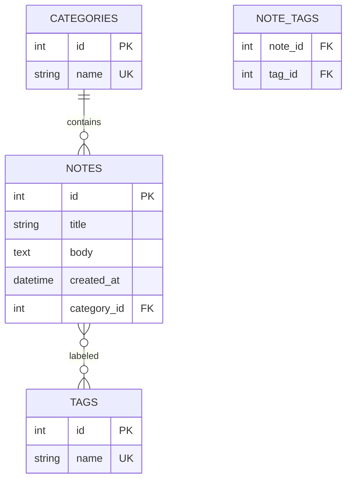

import ExternalCodeEmbed from '@site/src/components/ExternalCodeEmbed';


import ExternalPlayEmbed from '@site/src/components/ExternalPlayEmbed';


# Первые шаги с SQL

<div class="article-tags">
  <span class="tag tag-required">ОБЯЗАТЕЛЬНО</span>
  <span class="tag tag-beginner">ДЛЯ НОВИЧКОВ</span>
</div>

<span class="complexity-badge">Разработчику</span>
<span class="complexity-badge">Аналитику</span>
<span class="complexity-badge">Тестировщику</span>  
<span class="complexity-badge">Архитектору</span>
<span class="complexity-badge">Инженеру</span>

---

В этой главе порядок такой:

1. спроектировать схему (ER-диаграмма и DDL)
2. собрать проект на **SQLite** в одном файле — без установки сервера
3. поставить **PostgreSQL** и повторить те же идеи на серверной СУБД

Теория сущностей и связей — [Entity Relationship](/encyclopedia/3-data-markup/3-05-osnovy-baz-dannyh/11). Полный цикл проектирования — [проектирование БД](/encyclopedia/7-project/7-06-proektirovanie-i-arhitektura/design/116). Нормализация — [реляционная модель и нормальные формы](/encyclopedia/3-data-markup/3-07-sql/104.md).

---

## Проектирование базы данных

**СУБД** хранит данные в **таблицах**. Прежде чем выполнять `CREATE TABLE`, опишите предметную область словами и на схеме.

Учебный пример — приложение "личные заметки".

**Сущность** — объект предметной области, который хранят в таблице (категория, заметка, тег).

**Связь** показывает, как сущности связаны между собой:

- одна категория — много заметок (1:N)
- одна заметка — много тегов, и один тег — у многих заметок (M:N через таблицу-связку)

| Таблица | Поля | Связь |
|---------|------|-------|
| `categories` | id, name | одна категория → много notes |
| `notes` | id, title, body, created_at, category_id | каждая заметка → одна category |
| `tags` | id, name | M:N с notes через `note_tags` |
| `note_tags` | note_id, tag_id | связующая таблица |

**PK** (первичный ключ) однозначно идентифицирует строку. **FK** (внешний ключ) ссылается на PK другой таблицы.

### ER-диаграмма в Mermaid



### От схемы к DDL

**DDL** (Data Definition Language) — команды SQL, которые **создают** структуру (`CREATE TABLE`), а не вставляют строки.

```sql
CREATE TABLE categories (
    id          INTEGER PRIMARY KEY,
    name        TEXT NOT NULL UNIQUE
);

CREATE TABLE notes (
    id          INTEGER PRIMARY KEY,
    title       TEXT NOT NULL,
    body        TEXT,
    created_at  TEXT NOT NULL DEFAULT (datetime('now')),
    category_id INTEGER NOT NULL REFERENCES categories(id)
);

CREATE TABLE tags (
    id   INTEGER PRIMARY KEY,
    name TEXT NOT NULL UNIQUE
);

CREATE TABLE note_tags (
    note_id INTEGER NOT NULL REFERENCES notes(id) ON DELETE CASCADE,
    tag_id  INTEGER NOT NULL REFERENCES tags(id) ON DELETE CASCADE,
    PRIMARY KEY (note_id, tag_id)
);
```

Перед `CREATE TABLE` проверьте:

- у каждой таблицы есть первичный ключ
- внешние ключи ссылаются на существующие столбцы
- имена таблиц во множественном числе (`notes`, не `Note`) — так проще не спутать с зарезервированным `ORDER` в SQL

Чек-лист — [моделирование данных](/encyclopedia/3-data-markup/3-07-sql/104.md#chek-list-modelirovaniya-dannyh).

---

<span id="pervyj-proekt-sqlite"></span>

## Первый проект с данными на SQLite

★ **SQLite** — [реляционная СУБД](/encyclopedia/3-data-markup/3-05-osnovy-baz-dannyh/1) в **одном файле** `.db`. Отдельный сервер не нужен — библиотека встроена в приложение. Подходит для первого проекта до [PostgreSQL](./888.md).

Полная глава по API — [SQLite — практическая работа](./887.md).

### DB Browser for SQLite

**DB Browser** — бесплатная программа с графическим интерфейсом для SQLite ([sqlitebrowser.org](https://sqlitebrowser.org/)).

1. **File → New Database** — сохраните `notes.db` рядом с кодом
2. вкладка **Execute SQL** — вставьте DDL из раздела выше и нажмите ▶
3. **Browse Data** — просмотр строк; **Database Structure** — список таблиц

Тестовые данные:

```sql
INSERT INTO categories (id, name) VALUES (1, 'Работа'), (2, 'Личное');
INSERT INTO notes (id, title, body, category_id)
VALUES (1, 'Первый SELECT', 'Освоить SELECT и JOIN', 1);
INSERT INTO tags (id, name) VALUES (1, 'sql'), (2, 'учёба');
INSERT INTO note_tags VALUES (1, 1), (1, 2);
```

Проверочный запрос с **JOIN** (соединение таблиц):

```sql
SELECT n.title, c.name AS category, GROUP_CONCAT(t.name) AS tags
FROM notes n
JOIN categories c ON c.id = n.category_id
LEFT JOIN note_tags nt ON nt.note_id = n.id
LEFT JOIN tags t ON t.id = nt.tag_id
GROUP BY n.id;
```

Импорт таблицы из Excel — [CSV](/encyclopedia/3-data-markup/3-04-konfiguratsii-i-dannye/219); в DB Browser — **File → Import → Table from CSV file**.

### Мини-приложение на Python

Тот же файл `notes.db` читает скрипт через стандартный модуль `sqlite3`:

```python
import sqlite3
from pathlib import Path

DB = Path(__file__).with_name("notes.db")

def list_notes():
    with sqlite3.connect(DB) as conn:
        conn.row_factory = sqlite3.Row
        rows = conn.execute("""
            SELECT n.id, n.title, c.name AS category
            FROM notes n
            JOIN categories c ON c.id = n.category_id
            ORDER BY n.id
        """).fetchall()
    for r in rows:
        print(f"{r['id']}. [{r['category']}] {r['title']}")

if __name__ == "__main__":
    list_notes()
```

Запуск — `python notes_app.py`. Для `INSERT` из пользовательского ввода используйте плейсхолдеры `?`, а не склейку строк — иначе возможна [SQL-инъекция](/encyclopedia/8-infra-security/8-07-informatsionnaya-bezopasnost/123). Обзор безопасности — [раздел SQL](/encyclopedia/3-data-markup/3-07-sql/intro).

<div class="callout callout--tip">
  <div class="callout-title">Итог этапа</div>

  <div class="callout-body">
  Схема на бумаге → DDL → файл БД → GUI → запрос из кода. Ниже тот же путь на серверной PostgreSQL.
  </div>
</div>

---

## Установка системы PostgreSQL

Когда SQLite-проект понятен, ставьте **серверную** СУБД — несколько приложений, роли, [pgAdmin](#pgadmin-4), практика ближе к продакшену.

Для работы нужны **сервер** (демон PostgreSQL) и **клиент** (`psql`, pgAdmin).

Установка программ обычно выглядит так (официальный установщик PostgreSQL на Windows):

<ExternalPlayEmbed example="basics/installer-wizard-play" title="Мастер установки" minHeight={480} playProps={{ appName: 'Установка PostgreSQL', productName: 'PostgreSQL 16', welcomeText: 'Мастер задаст каталог программы, отдельно — каталог данных, пароль суперпользователя postgres и компоненты pgAdmin.', defaultPath: 'C:\\\\Program Files\\\\PostgreSQL\\\\16', extraOptionsLabel: 'Установить Stack Builder и Command Line Tools (psql)', cardSubtitle: 'Далее — пошаговый алгоритм для Windows и Linux' }} />

---

### Требования к системе
- Операционная система: Windows, Linux (Debian/Ubuntu) или macOS.
- Права администратора на машине.
- Доступ к интернету для загрузки установочных пакетов.

---

### Алгоритм установки

#### Вариант А — Установка на Windows

1. Скачайте установщик PostgreSQL 16 с [postgresql.org/download/windows](https://www.postgresql.org/download/windows/) или [Postgres Pro для Windows](https://postgrespro.ru/products/download).
2. Запустите мастер установки — каталог программы (по умолчанию `C:\Program Files\PostgreSQL\16`), **отдельно** — каталог данных, локаль (для русского текста — "Russian, Russia" или локаль ОС), пароль роли `postgres`.
3. Для учебной машины на шаге настройки памяти можно выбрать **"параметры по умолчанию"**, чтобы СУБД не занимала много ОЗУ.
4. Отметьте компоненты **pgAdmin** и **Command Line Tools** (в них входит `psql`).
5. Служба `postgresql-16` стартует автоматически; логи — в подкаталоге `log` каталога данных. Конфигурация — `postgresql.conf` и `pg_hba.conf` в каталоге данных.

**Кириллица в psql на Windows.** Если в терминале "кракозябры", в свойствах окна консоли включите шрифт **TrueType** (Consolas или Lucida Console).

Запуск клиента — "SQL Shell (psql)" из меню "Пуск" или pgAdmin после установки.

---

## pgAdmin 4

**pgAdmin** — графический клиент для PostgreSQL (схема, SQL, мониторинг). С PostgreSQL 16 на Windows часто ставится из того же установщика; на Debian/Ubuntu — пакет `pgadmin4` из репозитория PGDG.

Краткий workflow:

1. **Добавить сервер** — имя подключения, на вкладке Connection — host, port `5432`, user, password (можно "Save password" с мастер-паролем pgAdmin).
2. **Навигатор** слева — базы (`demo`, `postgres`, …), схемы, таблицы; контекстное меню — DDL, права, экспорт.
3. **Query Tool** (Tools → Query tool) — SQL, **F5** выполняет выделенный фрагмент; результат на вкладке Data Output.
4. **Dashboard** — графики активности; вкладки Properties, Statistics, Dependencies у выбранного объекта.
5. Русский интерфейс — Configure pgAdmin → Miscellaneous → User language → `Russian`, перезагрузка страницы (pgAdmin 4 — веб-интерфейс).

Встроены отладчик **PL/pgSQL** и обёртки над утилитами (`pg_dump`, …). Подробнее — [pgadmin.org](https://www.pgadmin.org/docs/).

---

#### Вариант Б — Установка на Linux (Debian/Ubuntu, репозиторий PGDG)

Пакет `postgresql` из стандартного репозитория дистрибутива часто отстаёт по версии. Для **PostgreSQL 16** подключите официальный репозиторий [PGDG](https://www.postgresql.org/download/linux/debian/):

```bash
sudo apt-get install -y lsb-release ca-certificates wget
sudo sh -c 'echo "deb http://apt.postgresql.org/pub/repos/apt $(lsb_release -cs)-pgdg main" \
  > /etc/apt/sources.list.d/pgdg.list'
wget --quiet -O - https://www.postgresql.org/media/keys/ACCC4CF8.asc | sudo apt-key add -
sudo apt-get update
sudo apt-get install -y postgresql-16 postgresql-client-16
```

Перед установкой проверьте локаль (`locale`). Для русского текста подходят `ru_RU.UTF-8` или `en_US.UTF-8`.

Проверка службы:

```bash
sudo systemctl status postgresql
```

Вход в `psql` под системным пользователем `postgres`:

```bash
sudo -u postgres psql
```

<div class="callout callout--info">
  <div class="callout-title">Postgres Pro Standard</div>

  <div class="callout-body">
  Совместимый с vanilla PostgreSQL дистрибутив <strong>Postgres Pro Standard 16</strong> бесплатен для ознакомления и обучения — инструкции на <a href="https://postgrespro.ru/products/download">postgrespro.ru/products/download</a>.
  </div>
</div>

---

#### Вариант В — Использование Docker (универсальный способ)

Создание контейнера с базой данных позволяет изолировать среду разработки:

```bash
docker run --name my-postgres \
  -e POSTGRES_PASSWORD=mysecretpassword \
  -p 5432:5432 \
  -d postgres:latest
```

Подключение к контейнеру выполняется командой:
```bash
docker exec -it my-postgres psql -U postgres
```

---

## Создание базы данных

База данных представляет собой логическое хранилище для таблиц, индексов и других объектов. Создание БД выполняется через системную команду или графический интерфейс.

---

### Командный способ

В `psql` или другом SQL-клиенте:

```sql
CREATE DATABASE company_db;
```

---

### Графический способ (pgAdmin)

1. Откройте pgAdmin и раскройте узел "Servers".
2. Нажмите правой кнопкой мыши на пункт "Databases".
3. Выберите "Create" -> "Database...".
4. В открывшемся окне введите имя `company_db`.
5. Укажите владельца базы (обычно `postgres`).
6. Нажмите "Save".

Важно помнить, что каждая новая база данных имеет собственную схему по умолчанию `public`, куда будут помещаться созданные объекты.

---

## Создание таблицы

Таблица — это основная структура для хранения данных, состоящая из строк и столбцов. Определение структуры таблицы включает указание имен колонок и их типов данных.

---

### Синтаксис создания таблицы

```sql
CREATE TABLE employees (
    id SERIAL PRIMARY KEY,
    first_name VARCHAR(50) NOT NULL,
    last_name VARCHAR(50) NOT NULL,
    email VARCHAR(100) UNIQUE,
    hire_date DATE DEFAULT CURRENT_DATE,
    salary NUMERIC(10, 2),
    department_id INTEGER
);
```

---

### Анализ компонентов определения

- **id**: Автоинкрементный идентификатор. Тип `SERIAL` автоматически создает последовательность и назначает уникальные значения.
- **first_name, last_name**: Текстовые поля фиксированной длины. Ограничение `NOT NULL` гарантирует заполненность.
- **email**: Поле для адреса электронной почты. Ограничение `UNIQUE` запрещает дублирование значений.
- **hire_date**: Дата найма. Параметр `DEFAULT CURRENT_DATE` подставляет текущую дату при отсутствии явного значения.
- **salary**: Числовое поле с двумя знаками после запятой.
- **department_id**: Целочисленное поле для связи с отделами.

---

## Добавление ограничений и индексов

Ограничения обеспечивают целостность данных, а индексы ускоряют поиск информации.

---

### Добавление внешнего ключа

Внешний ключ связывает строку одной таблицы со строкой другой. Это обеспечивает ссылочную целостность.

Предположим, существует таблица `departments`:
```sql
CREATE TABLE departments (
    id SERIAL PRIMARY KEY,
    name VARCHAR(100) NOT NULL
);
```

Добавим связь между таблицами `employees` и `departments`:

```sql
ALTER TABLE employees 
ADD CONSTRAINT fk_department 
FOREIGN KEY (department_id) REFERENCES departments(id);
```

---

### Создание индекса

Индекс — это структура данных, которая ускоряет операции выборки. Индексируются часто используемые поля поиска или сортировки.

Создание индекса по фамилии сотрудников:
```sql
CREATE INDEX idx_employees_last_name ON employees(last_name);
```

Создание составного индекса для ускорения поиска по отделу и дате найма:
```sql
CREATE INDEX idx_dept_hire ON employees(department_id, hire_date);
```

Использование индексов снижает время выполнения запросов, особенно на больших объемах данных.

---

## Выполнение SQL CRUD запросов

CRUD (Create, Read, Update, Delete) — набор операций для управления данными.

---

### Создание записей (Create)

Вставка новых сотрудников в таблицу:

```sql
INSERT INTO employees (first_name, last_name, email, salary, department_id)
VALUES 
('Ivan', 'Ivanov', 'ivanov@example.com', 75000.00, 1),
('Maria', 'Petrova', 'petrova@example.com', 82000.00, 2),
('Alexey', 'Sidorov', 'sidorov@example.com', 65000.00, 1);
```

Вставка данных об отделах:
```sql
INSERT INTO departments (name)
VALUES ('IT Department'), ('HR Department');
```

---

### Чтение данных (Read)

Выборка всех записей:
```sql
SELECT * FROM employees;
```

Выборка конкретных колонок с фильтрацией:
```sql
SELECT first_name, last_name, salary 
FROM employees 
WHERE salary > 70000;
```

Сортировка результатов:
```sql
SELECT * FROM employees ORDER BY salary DESC;
```

---

### Обновление данных (Update)

Изменение зарплаты сотрудника:
```sql
UPDATE employees 
SET salary = 80000.00 
WHERE id = 1;
```

Обновление нескольких полей одновременно:
```sql
UPDATE employees 
SET email = 'new_email@example.com', 
    hire_date = '2024-01-01' 
WHERE id = 2;
```

---

### Удаление данных (Delete)

Удаление конкретного сотрудника:
```sql
DELETE FROM employees WHERE id = 3;
```

Удаление всех записей из таблицы (осторожно):
```sql
TRUNCATE TABLE employees;
```

---

## Создание представлений (VIEW)

Представление — это виртуальная таблица, созданная на основе результата запроса. Представления не хранят данные физически, а вычисляют их при обращении.

---

### Простое представление

Создание представления со списком сотрудников и их зарплатами:

```sql
CREATE VIEW employee_salary_view AS
SELECT 
    e.first_name,
    e.last_name,
    d.name AS department_name,
    e.salary
FROM employees e
JOIN departments d ON e.department_id = d.id;
```

Использование представления:
```sql
SELECT * FROM employee_salary_view WHERE salary > 75000;
```

---

### Преимущества использования VIEW
- Упрощение сложных запросов.
- Сокрытие деталей реализации физических таблиц.
- Контроль доступа к определенным колонкам.
- Стандартизация логики выборки данных.

---

## Создание триггеров и процедур с агрегатными функциями и JOIN

Триггеры автоматически выполняют действия при изменении данных. Процедуры позволяют инкапсулировать сложную логику и использовать агрегатные функции.

---

### Создание функции с агрегатными функциями

Функция рассчитывает среднюю зарплату в отделе.

```sql
CREATE OR REPLACE FUNCTION get_avg_salary_by_department(p_dept_id INTEGER)
RETURNS NUMERIC AS $$
DECLARE
    avg_sal NUMERIC;
BEGIN
    SELECT AVG(salary) INTO avg_sal
    FROM employees
    WHERE department_id = p_dept_id;
    
    RETURN avg_sal;
END;
$$ LANGUAGE plpgsql;
```

Вызов функции:
```sql
SELECT get_avg_salary_by_department(1);
```

---

### Создание процедуры с использованием JOIN

Процедура обновляет статистику отдела при добавлении нового сотрудника.


<ExternalCodeEmbed example="sql/sql-101-001" title="Создание процедуры с использованием JOIN" minHeight={426} />


Запуск процедуры:
```sql
CALL update_department_stats();
```

---

### Создание триггера

Триггер автоматически проверяет корректность зарплаты перед вставкой записи. Зарплата не может быть отрицательной.


<ExternalCodeEmbed example="sql/sql-101-002" title="Создание триггера" minHeight={318} />


Попробуйте выполнить вставку с отрицательной зарплатой:
```sql
INSERT INTO employees (first_name, last_name, salary)
VALUES ('Test', 'User', -5000);
-- Система вернет ошибку исключения.
```

---

<span id="psql-meta-komandy"></span>

## Мета-команды psql

Команды с обратной косой чертой выполняет **только psql**; в pgAdmin и других GUI их аналоги другие. Полный список — `\?` внутри сеанса.

| Команда | Назначение |
| :--- | :--- |
| `\l` | Список баз данных |
| `\c dbname` | Подключиться к другой БД |
| `\du` | Роли (пользователи) |
| `\dt` | Таблицы текущей схемы |
| `\di` | Индексы |
| `\dv` | Представления |
| `\df` | Функции |
| `\dn` | Схемы |
| `\dx` | Установленные расширения |
| `\dp` | Привилегии |
| `\d имя` | Описание объекта |
| `\d+ имя` | Расширенное описание (размер, статистика) |
| `\gx` | Расширенный построчный вывод последнего результата |
| `\timing on` | Показывать время выполнения запросов |
| `\q` | Выход из psql |

Дальше по PostgreSQL — [практическая глава и API](./888.md), [демобаза demo](./891.md); администрирование — [справочник](/encyclopedia/3-data-markup/3-08-upravlenie-rsubd/2.md). Закрепить синтаксис на одной схеме с построчным разбором — [SQL — реальные кейсы](/lab/Примеры/1152) (можно в браузере до установки сервера).

{/* sidebar-collections */}

---

## В подборках

Статья входит в [тематические подборки](/about/collections) и блок "С чего начать?" на [главной](/). Соседние шаги того же маршрута:

**Первые шаги** ([маршрут подборки](/about/collections/pervye-shagi)) — [Первая программа на Expo](/encyclopedia/4-code-dev/4-12-mobilnye-prilozheniya/11321), [Первые шаги с MongoDB](/encyclopedia/3-data-markup/3-06-nosql/411), [Первая программа на React Native](/encyclopedia/4-code-dev/4-12-mobilnye-prilozheniya/11311), [Первые шаги с Redis](/encyclopedia/3-data-markup/3-06-nosql/511), [Первая программа Electron с React](/encyclopedia/4-code-dev/4-11-desktopnye-prilozheniya/118), [Первые шаги с Cassandra](/encyclopedia/3-data-markup/3-06-nosql/611).

{/* /sidebar-collections */}

---
