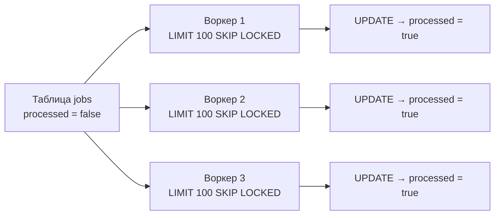

import ExternalCodeEmbed from '@site/src/components/ExternalCodeEmbed';


# Блокировки и конкурентный доступ в PostgreSQL

<div class="article-tags">
  <span class="tag tag-required">ОБЯЗАТЕЛЬНО</span>
  <span class="tag tag-beginner">ДЛЯ НОВИЧКОВ</span>
</div>

<span class="complexity-badge">Разработчику</span>
<span class="complexity-badge">Архитектору</span>
<span class="complexity-badge">Инженеру</span>

---

## MVCC и блокировки

PostgreSQL использует **MVCC**: читатели обычно не блокируют писателей и наоборот. Физические блокировки строк возникают при **конфликте записи** двух транзакций над одной версией строки.

Классическая теория (Shared / Exclusive) на уровне строк реализована через видимость версий; явные блокировки задаются командами `SELECT … FOR UPDATE` и `LOCK TABLE`.

---

## Блокировки таблиц (уровни)

| Уровень | Типичная операция | Блокирует `SELECT`? | Блокирует `UPDATE`? |
| :--- | :--- | :--- | :--- |
| `ACCESS SHARE` | `SELECT` | Нет | Нет |
| `ROW SHARE` | `SELECT FOR UPDATE/SHARE` | Нет | Нет |
| `ROW EXCLUSIVE` | `INSERT`, `UPDATE`, `DELETE` | Нет | Другие `ROW EXCLUSIVE` |
| `SHARE UPDATE EXCLUSIVE` | `VACUUM`, `ANALYZE` | Нет | Да |
| `ACCESS EXCLUSIVE` | `DROP TABLE`, `ALTER TABLE` | Да | Да |

---

## Явные блокировки строк

```sql
BEGIN;

-- Эксклюзивная блокировка выбранных строк до COMMIT
SELECT * FROM inventory
WHERE item_id = 1
FOR UPDATE;

UPDATE inventory SET quantity = quantity - 1 WHERE item_id = 1;

COMMIT;
```

| Вариант | Поведение |
| :--- | :--- |
| `FOR SHARE` | Разделяемая блокировка: чтение `FOR SHARE` разрешено, запись — нет |
| `FOR UPDATE NOWAIT` | Ошибка сразу, если строка занята |
| `FOR UPDATE SKIP LOCKED` | Пропуск занятых строк — без ожидания; очереди и параллельные пакеты |

Блокировки действуют до `COMMIT` или `ROLLBACK`.

Это **пессимистичная** стратегия — первая транзакция с `FOR UPDATE` занимает строку, остальные **ждут в очереди**, пока не будет `COMMIT` или `ROLLBACK`. Конфликт разрешается **до** записи, а не проверкой `version` при `UPDATE`.

Пошаговое сравнение с **оптимистичным** контролем (`version`, `updated_at`, конфликт при записи) — в [Конкурентном доступе](/encyclopedia/3-data-markup/3-05-osnovy-baz-dannyh/7.md#odin-schet-dva-polzovatelya).

---

<span id="skip-locked-ochered"></span>

## Очередь задач: одна строка на воркер

Классический сценарий — несколько воркеров забирают **следующую** свободную задачу. Без `SKIP LOCKED` второй воркер **встанет в ожидание**, хотя в таблице ещё тысячи необработанных строк:

```sql
-- Плохо для параллелизма: воркеры ждут друг друга
SELECT id
FROM jobs
WHERE processed = false
FOR UPDATE;
```

С `SKIP LOCKED` каждый воркер мгновенно получает **только незанятые** строки:

```sql
BEGIN;

SELECT order_id
FROM orders
WHERE status = 'new'
ORDER BY order_date
FOR UPDATE SKIP LOCKED
LIMIT 1;

-- обработка в приложении…
UPDATE orders SET status = 'processing' WHERE order_id = …;

COMMIT;
```

Тот же приём на учебной схеме `shop_data` — в [практикуме shop_data](./111.md#транзакции-и-блокировки).

---

<span id="skip-locked-paket"></span>

## Параллельная пакетная обработка внутри PostgreSQL

`SKIP LOCKED` полезен не только для "взять одну задачу". Им строят **массовую фоновую обработку** — несколько воркеров (процессы приложения, `pg_cron`, Kubernetes Job) одновременно проходят огромную таблицу `jobs`, каждый забирая **пакет** из N строк без внешней очереди (RabbitMQ, Redis).

Схема работы:



Захват и пометка пакета **в одной транзакции** — через CTE:

```sql
BEGIN;

WITH batch AS (
  SELECT id
  FROM jobs
  WHERE processed = false
  ORDER BY created_at
  LIMIT 100
  FOR UPDATE SKIP LOCKED
)
UPDATE jobs j
SET processed = true,
    processed_at = now()
FROM batch
WHERE j.id = batch.id
RETURNING j.*;

COMMIT;
```

`RETURNING` отдаёт воркеру список захваченных строк — дальше их можно обрабатывать уже **вне** транзакции или в следующем шаге того же `BEGIN`…`COMMIT`, если обработка быстрая.

Типовые области применения:

- рассылка писем и уведомлений;
- биллинг и пересчёт начислений по расписанию;
- импорт и нормализация сырых записей;
- массовые отчёты и агрегации по "хвосту" таблицы.

<div class="callout callout--tip">
  <div class="callout-title">Очередь в БД или внешний брокер?</div>

  <div class="callout-body">
  Таблица с <code>SKIP LOCKED</code> — простой и надёжный вариант, когда задачи уже живут в PostgreSQL, объём умеренный, а задержка в секунды допустима. Отдельный брокер (RabbitMQ, Kafka, Redis Streams) оправдан при миллионах сообщений в минуту, сложной маршрутизации и изоляции от нагрузки на OLTP-таблицы. Обзор асинхронных очередей — <a href="/encyclopedia/1-basics/1-22-kommunikatsiya-i-obschenie/6">Коммуникация и общение, глава 6</a>.
</div>
  </div>

---

<span id="skip-locked-prod"></span>

## Практика: индексы, статусы и "зависшие" задачи

**Индекс под выборку.** Без индекса по условию отбора каждый воркер сканирует всю таблицу. Для `WHERE processed = false` удобен **частичный** индекс:

```sql
CREATE INDEX idx_jobs_pending
ON jobs (created_at)
WHERE processed = false;
```

**Порядок строк.** `ORDER BY` внутри `LIMIT` задаёт приоритет (FIFO, срочность). Без `ORDER BY` планировщик вернёт произвольный набор — для фоновых задач это часто допустимо, для бизнес-очереди — нет.

**Статус `processing`.** Если воркер упал между `SELECT` и `UPDATE`, строка останется заблокированной до `ROLLBACK` сессии. В продакшене вместо булева `processed` используют цепочку статусов и метку захвата:

```sql
-- 1) вернуть «зависшие» задачи (воркер умер, транзакция откатилась или таймаут)
UPDATE jobs
SET status = 'pending',
    locked_at = NULL,
    worker_id = NULL
WHERE status = 'processing'
  AND locked_at < now() - interval '10 minutes';

-- 2) захватить новый пакет
BEGIN;

WITH batch AS (
  SELECT id
  FROM jobs
  WHERE status = 'pending'
  ORDER BY priority DESC, created_at
  LIMIT 100
  FOR UPDATE SKIP LOCKED
)
UPDATE jobs j
SET status = 'processing',
    locked_at = now(),
    worker_id = — 
FROM batch
WHERE j.id = batch.id
RETURNING j.*;

COMMIT;
```

После успешной обработки — отдельный `UPDATE` в `done` (или `DELETE`, если история не нужна). При ошибке — `status = 'failed'` и счётчик попыток.

**Длина транзакции.** Держите `BEGIN`…`COMMIT` **коротким**: только захват пакета и смена статуса. Тяжёлую работу (HTTP-запросы, генерация PDF, ML) выполняйте **после** `COMMIT`, иначе блокировки строк и WAL-нагрузка растут, а воркеры мешают OLTP-запросам.

**Совместимость.** `SKIP LOCKED` и `NOWAIT` — расширения PostgreSQL (с 9.5); в MySQL 8+ есть аналог `FOR UPDATE SKIP LOCKED`, в SQL Server — `READPAST` с хинтами. Сводка по четырём СУБД — [шпаргалка 892](./892.md).

---

## Взаимоблокировки (deadlock)

Цикл: транзакция A ждёт ресурс B, B ждёт A. PostgreSQL обнаруживает цикл процессом `deadlock detector` (интервал `deadlock_timeout`, по умолчанию 1 с) и **откатывает одну** транзакцию.

Профилактика:

- блокировать таблицы/строки в **одинаковом порядке**;
- держать транзакции **короткими**;
- использовать `NOWAIT` / `SKIP LOCKED` в очередях;
- не повышать изоляцию без необходимости.

---

### Диагностика


<ExternalCodeEmbed example="sql/sql-110-001" title="Диагностика" minHeight={390} />


---

## Advisory-блокировки

Логические замки приложения без привязки к строке таблицы:

```sql
SELECT pg_advisory_lock(42);
-- критическая секция
SELECT pg_advisory_unlock(42);
```

---

## Контрольные вопросы

1. Почему обычный `SELECT` не блокирует `UPDATE` в PostgreSQL?
2. Чем `FOR UPDATE` отличается от `FOR SHARE`?
3. Чем `SKIP LOCKED` отличается от обычного `FOR UPDATE` при нескольких воркерах?
4. Зачем в пакетном захвате использовать CTE + `UPDATE` в одной транзакции?
5. Почему тяжёлую обработку задач лучше выполнять после `COMMIT`?
6. Как СУБД разрешает deadlock?

---

## См. также

- [Транзакции, изоляция и блокировки](./77.md)
- [Практикум shop_data](./111.md)
- [Шпаргалка: блокировка и пакет задач](./885.md#блокировка-строк-для-обновления)
- [Пакетная работа с данными](/encyclopedia/3-data-markup/3-11-analiz-dannyh/433)
- [Архитектура СУБД](./2.md)

---
