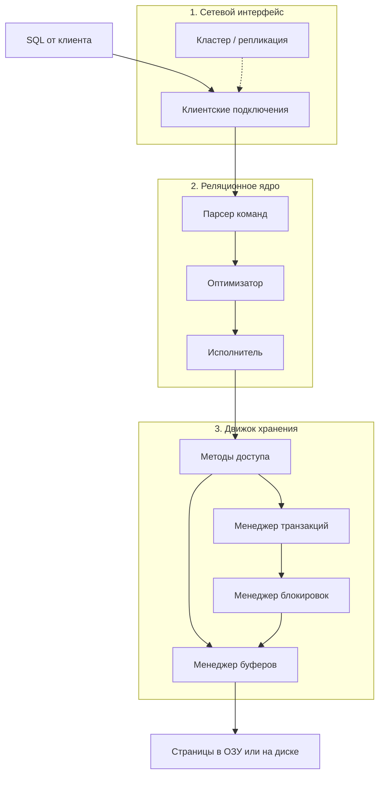
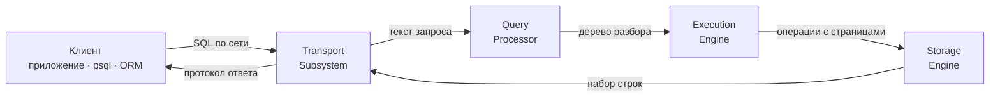
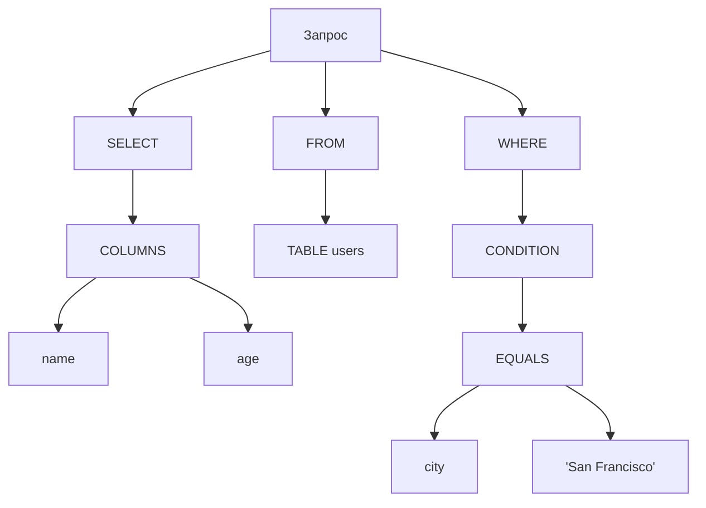
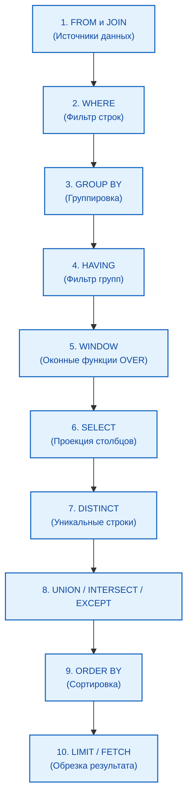
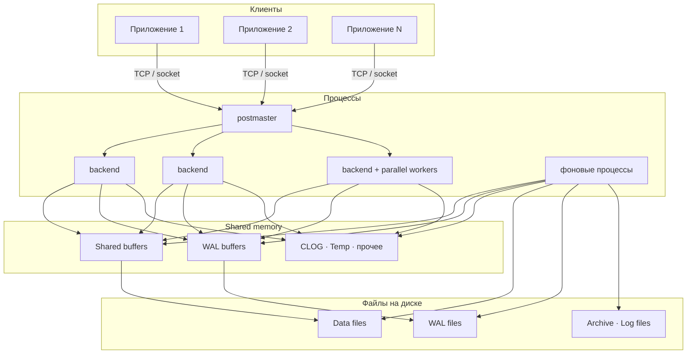

import ExternalPlayEmbed from '@site/src/components/ExternalPlayEmbed';


# Принципы работы SQL-движка

<div class="article-tags">
  <span class="tag tag-required">ОБЯЗАТЕЛЬНО</span>
  <span class="tag tag-beginner">ДЛЯ НОВИЧКОВ</span>
</div>

<span class="complexity-badge">Разработчику</span>
<span class="complexity-badge">Аналитику</span>
<span class="complexity-badge">Тестировщику</span>  
<span class="complexity-badge">Архитектору</span>
<span class="complexity-badge">Инженеру</span>

---

<span id="как-работает-sql"></span>

## Как работает SQL?

Вы пишете запрос сверху вниз: сначала `SELECT`, потом `FROM`. СУБД обрабатывает его **в другом порядке** — сначала источники и фильтры, затем группировка и оконные функции, и только потом проекция столбцов. Это объясняет ограничения на псевдонимы и `WHERE`.

Подробный разбор `SELECT`: [Оператор SELECT — синтаксис и стиль](./107.md). Планы и оптимизатор: [Оптимизация SQL-запросов](./881.md).

<span id="базовый-порядок-выполнения-семь-шагов"></span>

### Базовый порядок выполнения (семь шагов)

В учебных шпаргалках часто приводят **упрощённую** цепочку для типичного `SELECT` с группировкой. Её удобно держать в голове, пока не понадобятся оконные функции и операции над множествами:

| Шаг | Конструкция | Что делает СУБД |
| :---: | :--- | :--- |
| 1 | `FROM` | Берёт исходные строки из таблиц (и соединяет их, если есть `JOIN`) |
| 2 | `WHERE` | Отбрасывает строки, не прошедшие условие |
| 3 | `GROUP BY` | Делит оставшиеся строки на группы |
| 4 | `HAVING` | Отбрасывает группы по условию на агрегатах |
| 5 | `SELECT` | Считает столбцы и выражения результата |
| 6 | `ORDER BY` | Сортирует строки ответа |
| 7 | `LIMIT` / `TOP` / `FETCH` | Обрезает число возвращаемых строк |

Текст запроса по-прежнему начинается с `SELECT`, но **логика** идёт снизу вверх по этой таблице. Ниже — [полная схема](#как-работает-sql) с `WINDOW`, `DISTINCT` и `UNION`.

---

### Порядок работы с данными

Типичный путь запроса с точки зрения приложения:
	- подключение к серверу БД (логин, пароль, хост и порт);
	- отправка текста SQL (`SELECT`, `UPDATE`, `INSERT`, `DELETE` и др.);
	- внутренняя обработка в СУБД (см. [путь внутри движка](#путь-sql-внутри-субд));
	- возврат результата клиенту (набор строк, число затронутых строк, код ошибки).

<span id="путь-sql-внутри-субд"></span>

### Путь SQL внутри СУБД

Текст запроса, который вы отправили из приложения, `psql` или ORM, **сначала обрабатывается внутри СУБД**, и только потом превращается в чтение или запись страниц на диске. Это отдельная цепочка от [логического порядка `SELECT`](#как-работает-sql) (сначала `FROM`, потом `WHERE`, в конце проекция столбцов).

Серверные СУБД (PostgreSQL, MySQL, SQL Server, Oracle) обычно делят эту работу на **три слоя**:

| Слой | Компоненты | Задача |
| :--- | :--- | :--- |
| **Сетевой интерфейс** | приём подключений, протокол клиента, иногда обмен между узлами кластера | принять сессию, передать текст SQL в ядро, вернуть ответ |
| **Реляционное ядро** (relational engine) | парсер, оптимизатор, исполнитель | разобрать SQL, проверить права и схему, выбрать план, выполнить операторы плана |
| **Движок хранения** (storage engine) | методы доступа, буферный пул, менеджер транзакций, менеджер блокировок | прочитать или изменить страницы, соблюсти ACID и конкурентный доступ |



**Восемь шагов** (типичная цепочка для `SELECT` или `UPDATE`):

1. **Приём** — клиент открывает TCP-сессию (или локальный сокет); СУБД аутентифицирует пользователя и принимает текст запроса.
2. **Парсер** — проверка синтаксиса, построение дерева запроса; семантика (существуют ли таблицы и столбцы, допустимы ли типы, хватает ли прав).
3. **Оптимизатор** — переписывание запроса, оценка вариантов (индекс, seq scan, порядок `JOIN`), выбор [плана выполнения](./881.md).
4. **Исполнитель** — пошагово выполняет план — фильтры, соединения, агрегаты, сортировка; для записи координирует изменения строк.
5. **Методы доступа** — единый интерфейс "прочитать страницу индекса / таблицы", "вставить строку", "обновить поле"; скрывает формат файлов конкретной СУБД.
6. **Менеджер буферов** — ищет нужную **страницу** (часто 8 КБ) в RAM; при промахе запрашивает блок у ОС с диска (HDD/SSD).
7. **Менеджер транзакций** — границы `BEGIN`/`COMMIT`, журнал WAL, согласованность при сбое ([теория WAL](/encyclopedia/3-data-markup/3-05-osnovy-baz-dannyh/8.md)).
8. **Менеджер блокировок** — согласует параллельные сессии (блокировки строк/таблиц, MVCC), чтобы транзакции не портили данные друг другу ([конкурентный доступ](/encyclopedia/3-data-markup/3-05-osnovy-baz-dannyh/7.md)).

На шагах 6–8 исполнитель работает со **страницами и версиями строк**, а не с текстом SQL. Подробнее про байты на диске и буферный пул — [Внутреннее устройство БД](/encyclopedia/3-data-markup/3-05-osnovy-baz-dannyh/3.md#алгоритм-выполнения-запроса). Пошаговая анимация слоёв — в демо ниже.

<span id="четыре-подсистемы-обработки-sql"></span>

### Четыре подсистемы обработки SQL

В учебных схемах реляционной СУБД тот же путь часто рисуют как **четыре подсистемы** — от клиента до диска. Это те же этапы, что в [восьми шагах](#путь-sql-внутри-субд), с другими именами:

| Подсистема | Соответствие выше | Задача |
| :--- | :--- | :--- |
| **Transport Subsystem** (транспорт) | сетевой интерфейс, шаг 1 | приём запроса по протоколу (TCP/IP, сокет), сессия, аутентификация, передача текста SQL в ядро и ответа клиенту |
| **Query Processor** (обработчик запросов) | парсер, шаг 2 | лексический и синтаксический разбор, семантика, построение **дерева разбора** (parse tree / query tree) |
| **Execution Engine** (движок выполнения) | оптимизатор + исполнитель, шаги 3–4 | выбор [плана выполнения](./881.md), пошаговое чтение/запись данных по плану |
| **Storage Engine** (движок хранения) | методы доступа, буфер, транзакции, блокировки, шаги 5–8 | страницы в RAM и на диске, ACID, конкурентность, восстановление после сбоя |



#### Пример — один `SELECT` от клиента до диска

Запрос с ноутбука или сервера приложения:

```sql
SELECT name, age
FROM users
WHERE city = 'San Francisco';
```

**1. Transport Subsystem** — драйвер открывает соединение с PostgreSQL (порт 5432), передаёт строку SQL, получает таблицу результата или ошибку.

**2. Query Processor** — парсер проверяет синтаксис и строит дерево — какие столбцы вернуть, из какой таблицы читать, какое условие в `WHERE`. Упрощённая структура:



Семантический анализ сверяет `users`, `name`, `age`, `city` с каталогом (системными таблицами метаданных) и правами роли.

**3. Execution Engine** — оптимизатор оценивает варианты. Если есть индекс `city_index`, план может выглядеть так:

| Шаг плана | Смысл |
| :--- | :--- |
| Index Seek | Найти в индексе по `city` значение `'San Francisco'` |
| Lookup | По указателям из индекса прочитать строки таблицы `users` |
| Project | Взять только столбцы `name` и `age` |
| Return | Отдать строки транспортному слою |

Без индекса вместо Index Seek будет **Seq Scan** (полный просмотр таблицы) — тот же смысл для клиента, другая стоимость.

**4. Storage Engine** — исполнитель обращается к подсистемам хранения:

| Менеджер | Роль в этом запросе |
| :--- | :--- |
| **Buffer Manager** | Ищет страницы индекса и таблицы в буферном пуле; при промахе читает с диска |
| **Transaction Manager** | Для чистого `SELECT` в autocommit — короткая read-only транзакция; для `INSERT`/`UPDATE` — журнал WAL и commit |
| **Lock Manager** | Согласует чтение с параллельными записями (MVCC, при необходимости блокировки) |
| **Recovery Manager** | Фоновая роль при нормальной работе; при старте после сбоя — redo/undo по WAL ([восстановление](/encyclopedia/3-data-markup/3-05-osnovy-baz-dannyh/8.md)) |

Итоговые строки поднимаются по цепочке Storage Engine → Execution Engine → Transport Subsystem → клиент.

<div class="callout callout--info">
  <div class="callout-title">Два словаря — одна машина</div>

  <div class="callout-body">
  "Сетевой интерфейс / реляционное ядро / движок хранения" и "Transport / Query Processor / Execution Engine / Storage Engine" описывают одну и ту же РСУБД. В документации PostgreSQL чаще встречаются backend, planner, executor, shared buffers; в SQL Server — relational engine и storage engine.
  </div>
</div>

<div class="callout callout--tip">
  <div class="callout-title">SELECT и UPDATE — один каркас</div>

  <div class="callout-body">
  Для чтения доминируют парсер → оптимизатор → исполнитель → буфер → диск. Для записи к цепочке добавляются журнал WAL, блокировки и фиксация транзакции — сценарий "Запись" в интерактиве.
  </div>
</div>

Чтение SQL-запроса процессором (логический разбор внутри реляционного ядра):
	- сначала запрос разбирается на части;
	- определяется, что нужно сделать (SELECT);
	- определяется какие столбцы нужно обработать (* - все поля);
	- определяется, откуда – из какой таблицы это взять (FROM);
	- каким условиям должны соответствовать данные (WHERE);
	- как вывести результат (группировка, сортировка, вычисления);
	- проверяются права доступа к таблице для выполнившего запрос;
	- выполняется оптимизация запроса;
	- запрос исполняется и возвращается результат.

<ExternalPlayEmbed example="tools-data/dbms-architecture-play" title="Dbms Architecture" />

**Интересный факт:**
В SQL порядок слов не соответствует порядку выполнения. И если запрос будет выглядеть так:
```sql
SELECT name, COUNT(*) 
FROM users 
WHERE age > 18 
GROUP BY name 
HAVING COUNT(*) > 5 
ORDER BY name;
```

на самом деле порядок будет такой:
```sql
FROM users 
WHERE age > 18 
GROUP BY name 
HAVING COUNT(*) > 5 
SELECT name, COUNT(*) 
ORDER BY name;
```

Порядок чтения здесь не построчный.



| № | Этап | Смысл |
| :--- | :--- | :--- |
| 1 | `FROM` / `JOIN` | Откуда брать строки |
| 2 | `WHERE` | Фильтр до группировки; агрегаты недоступны |
| 3 | `GROUP BY` | Группы для `COUNT`, `SUM`, `AVG` |
| 4 | `HAVING` | Фильтр групп |
| 5 | `WINDOW` | Оконные функции `… OVER (…)` |
| 6 | `SELECT` | Столбцы и выражения результата |
| 7 | `DISTINCT` | Убрать дубликаты |
| 8 | `UNION` / `INTERSECT` / `EXCEPT` | Операции над множествами |
| 9 | `ORDER BY` | Сортировка; псевдонимы из `SELECT` обычно доступны |
| 10 | `LIMIT` / `FETCH` | Сколько строк вернуть |

**Псевдонимы столбцов** (`AS` в `SELECT`) нельзя использовать в `WHERE`, `GROUP BY` и `HAVING` того же уровня. Псевдонимы **таблиц** из `FROM` — можно в `SELECT` и `WHERE`. Оконные функции: [Встроенные и пользовательские функции в SQL](./7.md). Справочник: [Справочник по SQL](./883.md).

---

<span id="архитектура-postgresql-компоненты-субд"></span>

## Архитектура PostgreSQL (компоненты СУБД)

На примере PostgreSQL видно, как клиентский SQL превращается в работу процессов, памяти и файлов. Та же схема в сжатом виде — в [PostgreSQL — практическая работа и API](./888.md#как-работает-postgresql).

---

### Три слоя (напоминалка)



1. **Клиенты** — приложения, `psql`, ORM: каждое **подключение** получает свой **backend-процесс**.
2. **Память и процессы** — `postmaster`, backend'ы, parallel workers, служебные процессы и общие буферы.
3. **Диск** — файлы таблиц, журнал WAL, архив WAL, текстовые логи.

---

### Postmaster и backend-процессы

- **`postmaster`** — родительский процесс кластера — слушает порт, создаёт backend на новое подключение, перезапускает упавшие служебные процессы.
- **Backend** — обрабатывает одну сессию — парсинг SQL, план, исполнение, протокол ответа клиенту.
- **Parallel workers** — вспомогательные процессы для одного тяжёлого запроса (параллельное сканирование, сортировка), если планировщик включил параллелизм.

Конкурентность между сессиями — через **MVCC** и блокировки на уровне строк/таблиц, а не через потоки внутри одного процесса ([конкурентный доступ](/encyclopedia/3-data-markup/3-05-osnovy-baz-dannyh/7.md)).

---

### Shared memory

| Буфер | Зачем |
| :--- | :--- |
| **Shared buffers** | Кэш страниц 8 КБ из файлов таблиц и индексов |
| **WAL buffers** | Накопление записей журнала перед `fsync` в `pg_wal/` |
| **CLOG** | Быстрый ответ "закоммичена ли транзакция" |
| **Temp buffers** | Страницы временных таблиц |
| Прочие | Служебные структуры планировщика и IPC |

**Оптимизатор** читает статистику (`pg_statistic`, `ANALYZE`), выбирает план (seq scan, index scan, join). **Исполнитель** трогает страницы в shared buffers; при промахе — чтение с диска.

---

### Фоновые процессы

| Процесс | Кратко |
| :--- | :--- |
| **WAL Writer** | WAL buffers → файлы журнала |
| **Background Writer** | "Грязные" страницы shared buffers → data files |
| **Checkpointer** | Checkpoint, согласование WAL и данных на диске |
| **Autovacuum** | Очистка мёртвых версий строк, `VACUUM` |
| **Stats Collector** | Метрики для `pg_stat_*` |
| **Sys Logger** | Текстовые логи |
| **Archiver** | Архив сегментов WAL |
| **Replication Launcher** | Потоковая / логическая репликация |

Без WAL Writer и Checkpointer журнал и данные расходились бы по срокам жизни на диске; без Autovacuum раздувались бы таблицы из-за MVCC.

---

### WAL и долговечность

**Журнал предзаписи (WAL)** — любое зафиксированное изменение **сначала** устойчиво попадает в WAL (буфер → файл), **потом** может лечь в файл таблицы через shared buffers и BG Writer. Параметры `wal_level`, `checkpoint_timeout`, `synchronous_commit` задают глубину журнала и задержку commit.

Теория redo/undo и crash recovery — [Восстановление после сбоя](/encyclopedia/3-data-markup/3-05-osnovy-baz-dannyh/8.md). Бэкап и PITR — [Резервное копирование](./106.md).

---

### Физическое представление

- **Страница (block)** — обычно 8 КБ, минимальная единица ввода-вывода.
- **Файл отношения** — последовательность страниц на диске.
- **Tablespace** — размещение файлов на разных носителях.
- Каталог данных — `base/` (базы), `pg_wal/` (журнал), `pg_xact/` (статусы транзакций).

---

### Жизненный цикл запроса

Соответствует [восьми шагам](#путь-sql-внутри-субд) на уровне PostgreSQL:

1. Приём по сети (порт 5432) — сетевой интерфейс, backend-процесс на сессию.
2. Лексический и синтаксический разбор — парсер.
3. Семантическая проверка → дерево запроса — парсер и каталог метаданных.
4. Оптимизация — порядок соединений, индексы, параллельные worker'ы.
5. Выполнение плана — исполнитель, методы доступа, shared buffers.
6. Транзакции и блокировки — для `INSERT`/`UPDATE`/`DELETE` и изоляции чтений.
7. При промахе буфера — чтение страниц с диска через ОС.
8. Возврат результата клиенту по протоколу PostgreSQL.

---

### Диагностика конфигурации

```sql
SHOW config_file;
SHOW shared_buffers;
SHOW work_mem;
SHOW wal_level;

SELECT name, setting, unit
FROM pg_settings
WHERE name IN ('shared_buffers', 'work_mem', 'max_connections');

SELECT pg_current_wal_lsn();
SELECT pg_relation_filepath('orders');
```

Перезагрузка параметров без остановки кластера (если параметр помечен как `reload`):

```sql
SELECT pg_reload_conf();
```

**Контрольные вопросы:** почему изменения сначала пишутся в WAL; как `shared_buffers` влияет на чтение; чем логическая таблица отличается от файлов на диске; когда оптимизатор выбирает последовательное сканирование вместо индекса.

Подробнее о плане выполнения: [Оптимизация SQL-запросов](./881.md). О резервных копиях и WAL: [Резервное копирование](./106.md).

---
