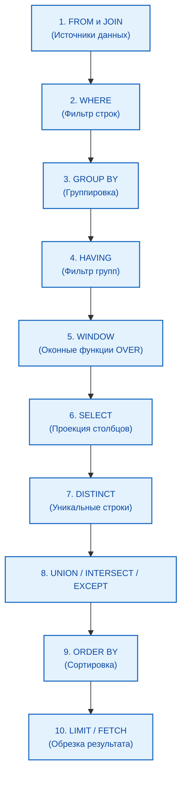

import DbmsArchitecturePlay from '@site/src/components/DbmsArchitecturePlay.jsx';

# Принципы работы SQL-движка

<div class="article-tags">
  <span class="tag tag-required">ОБЯЗАТЕЛЬНО</span>
  <span class="tag tag-beginner">ДЛЯ НОВИЧКОВ</span>
</div>

<span class="complexity-badge">Разработчику</span>
<span class="complexity-badge">Аналитику</span>
<span class="complexity-badge">Тестировщику</span>  
<span class="complexity-badge">Архитектору</span>
<span class="complexity-badge">Инженеру</span>

## Как работает SQL?

Вы пишете запрос сверху вниз: сначала `SELECT`, потом `FROM`. СУБД обрабатывает его **в другом порядке** — сначала источники и фильтры, затем группировка и оконные функции, и только потом проекция столбцов. Это объясняет ограничения на псевдонимы и `WHERE`.

Подробный разбор `SELECT`: [107](./107.md). Планы и оптимизатор: [881](./881.md).

### Порядок работы с данными

Типичный путь запроса:
	- выполняется подключение к БД (логин/пароль, адрес сервера);
	- отправляется запрос (например, выбрать все записи из таблицы №1);
	- выполняется обработка запроса в СУБД;
	- СУБД парсит (разбирает запрос);
	- СУБД строит план выполнения запроса (как найти данные быстрее);
	- СУБД читает или записывает данные;
	- СУБД возвращает результат (таблица, число, статус).

Чтение SQL-запроса процессором:
	- сначала запрос разбирается на части;
	- определяется, что нужно сделать (SELECT);
	- определяется какие столбцы нужно обработать (* - все поля);
	- определяется, откуда – из какой таблицы это взять (FROM);
	- каким условиям должны соответствовать данные (WHERE);
	- как вывести результат (группировка, сортировка, вычисления);
	- проверяются права доступа к таблице для выполнившего запрос;
	- выполняется оптимизация запроса;
	- запрос исполняется и возвращается результат.

<DbmsArchitecturePlay />

**Интересный факт:**
В SQL порядок слов не соответствует порядку выполнения. И если запрос будет выглядеть так:
```sql
SELECT name, COUNT(*) 
FROM users 
WHERE age > 18 
GROUP BY name 
HAVING COUNT(*) > 5 
ORDER BY name;
```

на самом деле порядок будет такой:
```sql
FROM users 
WHERE age > 18 
GROUP BY name 
HAVING COUNT(*) > 5 
SELECT name, COUNT(*) 
ORDER BY name;
```

Порядок чтения здесь не построчный.



| № | Этап | Смысл |
| :--- | :--- | :--- |
| 1 | `FROM` / `JOIN` | Откуда брать строки |
| 2 | `WHERE` | Фильтр до группировки; агрегаты недоступны |
| 3 | `GROUP BY` | Группы для `COUNT`, `SUM`, `AVG` |
| 4 | `HAVING` | Фильтр групп |
| 5 | `WINDOW` | Оконные функции `… OVER (…)` |
| 6 | `SELECT` | Столбцы и выражения результата |
| 7 | `DISTINCT` | Убрать дубликаты |
| 8 | `UNION` / `INTERSECT` / `EXCEPT` | Операции над множествами |
| 9 | `ORDER BY` | Сортировка; псевдонимы из `SELECT` обычно доступны |
| 10 | `LIMIT` / `FETCH` | Сколько строк вернуть |

**Псевдонимы столбцов** (`AS` в `SELECT`) нельзя использовать в `WHERE`, `GROUP BY` и `HAVING` того же уровня. Псевдонимы **таблиц** из `FROM` — можно в `SELECT` и `WHERE`. Оконные функции: [7](./7.md). Справочник: [883](./883.md).

---

## Архитектура PostgreSQL (компоненты СУБД)

На примере PostgreSQL видно, как устроена обработка запроса «под капотом».

### Основные компоненты

- **Процессы backend** — обработка подключений; параллелизм чтения/записи через MVCC.
- **Буферный пул (`shared_buffers`)** — кэш страниц данных в ОЗУ; политика замещения clock-sweep.
- **Журнал предзаписи (WAL)** — атомарность и долговечность: сначала запись в WAL, затем в буфер; параметры `wal_level`, `checkpoint_timeout`.
- **Оптимизатор** — построение плана, оценка стоимости, использование статистики `pg_statistic`.

### Физическое представление

- **Страница (block)** — обычно 8 КБ, минимальная единица ввода-вывода.
- **Файл отношения** — последовательность страниц на диске.
- **Tablespace** — размещение файлов на разных носителях.
- Каталог данных: `base/` (базы), `pg_wal/` (журнал), `pg_xact/` (статусы транзакций).

### Жизненный цикл запроса

1. Приём по сети (порт 5432).
2. Лексический и синтаксический разбор.
3. Семантическая проверка → дерево запроса.
4. Оптимизация: порядок соединений, индексы, методы агрегации.
5. Выполнение плана: чтение из буфера или диска, фильтры, соединения.
6. Возврат результата клиенту.

### Диагностика конфигурации

```sql
SHOW config_file;
SHOW shared_buffers;
SHOW work_mem;
SHOW wal_level;

SELECT name, setting, unit
FROM pg_settings
WHERE name IN ('shared_buffers', 'work_mem', 'max_connections');

SELECT pg_current_wal_lsn();
SELECT pg_relation_filepath('orders');
```

Перезагрузка параметров без остановки кластера (если параметр помечен как `reload`):

```sql
SELECT pg_reload_conf();
```

**Контрольные вопросы:** почему изменения сначала пишутся в WAL; как `shared_buffers` влияет на чтение; чем логическая таблица отличается от файлов на диске; когда оптимизатор выбирает последовательное сканирование вместо индекса.

Подробнее о плане выполнения: [Оптимизация SQL-запросов](./881.md). О резервных копиях и WAL: [Резервное копирование](./106.md).

---
