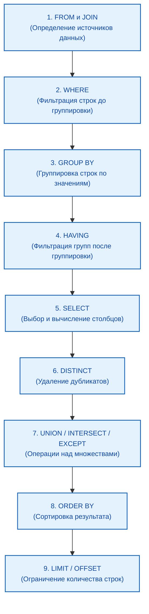

import DbmsArchitecturePlay from '@site/src/components/DbmsArchitecturePlay.jsx';

# Принципы работы SQL-движка

<div class="article-tags">
  <span class="tag tag-required">ОБЯЗАТЕЛЬНО</span>
  <span class="tag tag-beginner">ДЛЯ НОВИЧКОВ</span>
</div>

<span class="complexity-badge">Разработчику</span>
<span class="complexity-badge">Аналитику</span>
<span class="complexity-badge">Тестировщику</span>  
<span class="complexity-badge">Архитектору</span>
<span class="complexity-badge">Инженеру</span>

## Как работает SQL?

### Порядок работы с данными

Порядок работы с данными:
	- выполняется подключение к БД (логин/пароль, адрес сервера);
	- отправляется запрос (например, выбрать все записи из таблицы №1);
	- выполняется обработка запроса в СУБД;
	- СУБД парсит (разбирает запрос);
	- СУБД строит план выполнения запроса (как найти данные быстрее);
	- СУБД читает или записывает данные;
	- СУБД возвращает результат (таблица, число, статус).

Чтение SQL-запроса процессором:
	- сначала запрос разбирается на части;
	- определяется, что нужно сделать (SELECT);
	- определяется какие столбцы нужно обработать (* - все поля);
	- определяется, откуда – из какой таблицы это взять (FROM);
	- каким условиям должны соответствовать данные (WHERE);
	- как вывести результат (группировка, сортировка, вычисления);
	- проверяются права доступа к таблице для выполнившего запрос;
	- выполняется оптимизация запроса;
	- запрос исполняется и возвращается результат.

<DbmsArchitecturePlay />

**Интересный факт:**
В SQL порядок слов не соответствует порядку выполнения. И если запрос будет выглядеть так:
```sql
SELECT name, COUNT(*) 
FROM users 
WHERE age > 18 
GROUP BY name 
HAVING COUNT(*) > 5 
ORDER BY name;
```

на самом деле порядок будет такой:
```sql
FROM users 
WHERE age > 18 
GROUP BY name 
HAVING COUNT(*) > 5 
SELECT name, COUNT(*) 
ORDER BY name;
```

Порядок чтения здесь не построчный.



| № | Команда | Смысл |
| :--- | :---: | ---: |
|1	|FROM и JOIN	|Определение - откуда брать данные. Обрабатываются таблицы, указанные в FROM, а также все JOIN (включая INNER, LEFT, RIGHT и т.д.). В результате создаётся временная таблица, виртуальный набор строк из объединенных таблиц.
|2	|WHERE	|Фильтрация строк до группировки. Применяются условия к отдельным строкам, удаляются строки, не удовлетворяющие условиям. На этом этапе агрегировать (SUM, COUNT) не получится.
|3	|GROUP BY	|Группировка строк по значениям - строки объединяются в группы по указанным столбцам, и каждая уникальная комбинация значений становится одной строкой в результирующем наборе на этом этапе. Именно после группировки можно использовать агрегатные функции (COUNT, SUM, AVG).
|4	|HAVING	|Фильтрация групп после группировки, аналог WHERE, который применяется к группам, а не отдельным строкам. Можно использовать агрегатные функции - в итоге удаляются группы, не удовлетворяющие условиям. К примеру, можно оставить те группы, где больше 5 сотрудников.
|5	|SELECT	|Выбор и вычисление столбцов - на этом этапе определяется, какие столбцы попадут в результат, выполняются вычисления - арифметические выражения, вызовы функций, псевдонимы. Именно здесь можно ссылаться на псевдонимы, но в других частях запроса использовать псевдонимы нельзя, потому что SELECT выполняется позже.
|6	|DISTINCT	|Удаление дубликатов. Если указано SELECT DISTINCT, то дублирующиеся строки удаляются. Проверка дубликатов идёт по финальным выбранным столбцам, потому что после SELECT.
|7	|UNION / INTERSECT / EXCEPT	|Операции над множествами. Объединяют результаты нескольких SELECT-запросов, выполняются после формирования каждого отдельного набора. UNION объединяет, INTERSECT пересекает, EXCEPT - разность.
|8	|ORDER BY	|Сортировка результата. Сортирует финальный набор строк по указанным столбцам или выражениям. Можно использовать псевдонимы, так как SELECT уже выполнен, и сортировка никак не влияет на логику группировки или фильтрации.
|9	|LIMIT и OFFSET	|Ограничение количества строк. Выполняется в самом конце.

Подробности об SQL можно получить на W3 - https://www.w3schools.com/sql/

---
