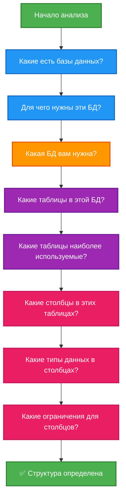
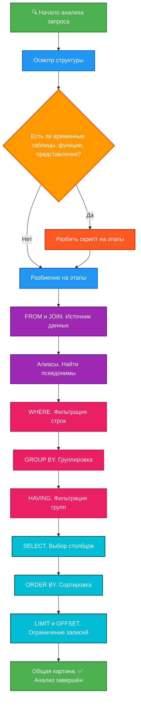

# Чтение и анализ сложных SQL-запросов

<div class="article-tags">
  <span class="tag tag-required">ОБЯЗАТЕЛЬНО</span>
  <span class="tag tag-beginner">ДЛЯ НОВИЧКОВ</span>
</div>

<span class="complexity-badge">Разработчику</span>
<span class="complexity-badge">Аналитику</span>
<span class="complexity-badge">Тестировщику</span>  
<span class="complexity-badge">Архитектору</span>
<span class="complexity-badge">Инженеру</span>

---

## Как читать сложные SQL запросы

### Знай базу данных

Поначалу бывает страшно, когда видишь сложный SQL-запрос. Да куда уж, страшно всегда. Но нужно научиться именно понимать запросы.

Первое, что нужно понимать, так это сами сущности. Желательно хотя бы приблизительно представлять, что находится в таблицах, в каких таблицах, и зачем эти таблицы нужны.

Если неизвестно, то лучше хотя бы пробежаться по ключевым таблицам обычными SELECT-запросами для понимания, что там есть.

То есть, **знание базы данных упрощает работу с ней**.

Что хранится в базе данных, как хранится? В идеале, нужно перед работой ознакомиться, или пройти хотя бы обучение, по возможности.

Если возможности не даётся, значит придётся изучать прямо в бою.

Определите:

1. Какие есть базы данных?
2. Для чего нужны эти базы данных?
3. Какая база данных вам нужна?
4. Какие есть таблицы в этой базе данных?
5. Какие таблицы наиболее часто используемые?
6. Какие столбцы имеются в этих таблицах?
7. Какие типы данных в этих столбцах?
8. Какие имеются ограничения для этих столбцов?



---

### Ментальная модель

База данных обрабатывает запрос согласно строгому алгоритму, и всегда нужно искать последовательность:

1. **Осмотрите структуру** - есть ли временные таблицы, функции, представления, или вложенные запросы. Если есть, значит **нужно разбить весь скрипт на этапы**, и читать их по отдельности.

2. **Разбейте запрос на этапы**, если он сложный. Например, этап первый - создание временной таблицы с выборкой, этап второй - изменение данных, этап третий - удаление временной таблицы.

3. Ищите **FROM** и **JOIN**, потому что определяется источник данных. Какие таблицы, какие соединения, чтобы понимать, где мы ищём. Это как найти кабинет.

4. Определите **алиасы**. Если у вас нет таблицы `t`, но в запросе видите `t.something`, значит нужно найти значение `t`. Посмотрите на конструкции вроде `FROM TABLE t` или `AS t`. Если видите алиас, значит нужно найти то, что подразумевается под таким псевдонимом (что такое `t`?).

5. Ищите **WHERE**. Нужно понять, какие условия указаны, какая фильтрация строк. Система отбирает записи, поэтому нужно определить их.

6. Ищите **GROUP BY**. Поймите, есть ли группировка оставшихся строк - это нужно для агрегатных функций.

7. Ищите **HAVING**. Это тоже фильтрация, которая происходит уже после агрегации.

8. Ищите **SELECT**. Это, конечно, сразу бросится в глаза, но в сложных запросах селектов может быть много, и нужно понять, какие конкретно столбцы и где выбираются.

9. Ищите **ORDER BY**. После выборки данные сортируются. В каком порядке?

10. Ищите **LIMIT** и **OFFSET**. Есть ли установка на ограничение количества выводимых записей?

11. Теперь мы поняли, что происходит, и должны пройтись так по всем этапам, что позволит нам **определить общую картину**.



---

## Анализ соединений таблиц

Оператор JOIN объединяет строки из двух таблиц на основе связанного столбца.

Нужно понимать:
- какие таблицы соединены?
- по каким условиям?
- какая таблица правая, какая левая?

---

### INNER JOIN

Запрос возвращает строки при наличии **совпадения в обеих таблицах**. Отсутствие совпадения исключает строку из результата. Пересечение множеств данных формирует итог.

Пример:
```sql
SELECT
o.order_number,
u.full_name,
o.total_amount
FROM orders o
INNER JOIN users u ON o.user_id = u.id
WHERE o.status = 'delivered';
```
Запрос выбирает номера заказов, имена пользователей и суммы. Соединение происходит по идентификатору пользователя. Фильтрация оставляет только доставленные заказы.

---

### LEFT JOIN

Запрос возвращает **все строки из левой таблицы**. Строки из правой таблицы добавляются при наличии совпадения. Отсутствие совпадения заполняет столбцы правой таблицы значением NULL.

Пример использования:
```sql
SELECT
c.name AS category_name,
p.name AS product_name,
p.price
FROM categories c
LEFT JOIN products p ON c.id = p.category_id
ORDER BY c.name, p.price DESC;
```
Запрос показывает все категории. Товары отображаются рядом с соответствующей категорией. Категории без товаров сохраняются в результате с пустыми полями товара.

---

### RIGHT JOIN и FULL OUTER JOIN

Правое соединение возвращает **все строки из правой таблицы**. Полное внешнее соединение возвращает все строки из обеих таблиц. Отсутствие совпадения заполняет недостающую часть значением NULL.

Пример полного соединения:
```sql
SELECT
c.name AS category_name,
p.name AS product_name
FROM categories c
FULL OUTER JOIN products p ON c.id = p.category_id
WHERE c.parent_id IS NULL OR p.category_id IS NULL;
```
Запрос находит категории без товаров и товары без категорий. Условие WHERE фильтрует результат по наличию пустых значений.

---

### Множественные соединения

Запрос может содержать **несколько операторов JOIN подряд**. Каждое соединение добавляет новую таблицу к промежуточному результату. Порядок соединений влияет на производительность и логику выборки.

Пример цепочки соединений:
```sql
SELECT
o.order_number,
u.full_name,
p.name AS product_name,
oi.quantity,
oi.unit_price,
oi.subtotal
FROM orders o
JOIN users u ON o.user_id = u.id
JOIN order_items oi ON o.id = oi.order_id
JOIN products p ON oi.product_id = p.id
WHERE o.status IN ('processing', 'shipped')
ORDER BY o.created_at DESC;
```
Запрос собирает данные из четырех таблиц. Связь идет от заказов к пользователям, позициям заказа и товарам. Фильтрация ограничивает статусы заказов. Сортировка упорядочивает результат по дате создания.

---

## Работа с подзапросами и CTE

**Подзапросы** и **общие табличные выражения** (CTE) позволяют разбивать сложную логику на части. Чтение таких конструкций требует понимания области видимости данных

Определите:
- где начинается подзапрос?
- где заканчивается подзапрос?
- где начинается CTE?
- что входит в CTE?
- где заканчивается CTE?
- где основной запрос?

---

### Подзапросы в SELECT

**Подзапрос в списке выбора** (в SELECT) вычисляет значение для каждой строки основного запроса. Результат подзапроса становится отдельным столбцом.

Пример вычисляемого столбца:
```sql
SELECT
p.name,
p.price,
(SELECT AVG(price) FROM products WHERE category_id = p.category_id) AS category_avg_price
FROM products p;
```
Запрос показывает цену товара и среднюю цену по категории. Подзапрос выполняется для каждой строки товара. Связь происходит через идентификатор категории.

---

### Подзапросы в FROM

**Подзапрос в разделе FROM** действует как временная таблица. Основной запрос обращается к результату подзапроса как к обычной таблице.

Пример временной таблицы:
```sql
SELECT
category_stats.name,
category_stats.product_count,
category_stats.avg_price
FROM (
SELECT
c.name,
COUNT(p.id) AS product_count,
AVG(p.price) AS avg_price
FROM categories c
LEFT JOIN products p ON c.id = p.category_id
GROUP BY c.id, c.name
) AS category_stats
WHERE category_stats.product_count > 5;
```
Внутренний запрос агрегирует данные по категориям. Внешний запрос фильтрует категории по количеству товаров. Псевдоним category_stats обеспечивает доступ к столбцам.

---

### Подзапросы в WHERE

**Подзапрос в условии WHERE** фильтрует строки основного запроса. Операторы IN, EXISTS, сравнения используют результат подзапроса.

Пример фильтрации через IN:
```sql
SELECT name, price
FROM products
WHERE category_id IN (
SELECT id FROM categories WHERE parent_id = 1
);
```

Запрос выбирает товары из дочерних категорий. Внутренний запрос находит идентификаторы категорий. Внешний запрос проверяет вхождение идентификатора категории товара в список.

Пример фильтрации через EXISTS:
```sql
SELECT u.full_name, u.email
FROM users u
WHERE EXISTS (
SELECT 1 FROM orders o
WHERE o.user_id = u.id AND o.total_amount > 50000
);
```
Запрос находит пользователей с крупными заказами. Подзапрос проверяет наличие заказа у пользователя. Условие существования возвращает истину при наличии совпадения.

---

### IN против EXISTS

| Критерий | `IN` | `EXISTS` |
| :--- | :--- | :--- |
| Семантика | Значение в списке / результате подзапроса | Есть ли хотя бы одна строка |
| `NULL` в подзапросе | `NOT IN` может дать пустой результат | `NOT EXISTS` корректен |
| Читаемость | Удобен для коротких списков | Удобен для проверки связи |
| План | Часто hash semi join | Часто semi join |

**Правило:** для "есть ли связанные строки" предпочитайте `EXISTS`; для фиксированного списка констант — `IN`.

```sql
-- Клиенты без заказов — только NOT EXISTS (или IN с фильтром NULL)
SELECT c.full_name
FROM customers c
WHERE NOT EXISTS (
    SELECT 1 FROM orders o WHERE o.customer_id = c.customer_id
);
```

Развёрнуто: [Подзапросы, EXISTS и IN](./108.md).

---

### Common Table Expressions (CTE)

Конструкция WITH определяет именованные временные наборы данных. Чтение запроса начинается с изучения блоков CTE. Основной запрос использует эти блоки как обычные таблицы.

Здесь нужно просто понять формулу:

- `WITH` **имя временного набора данных** 
- `AS` (внутри ещё один запрос)
- основной запрос с использованием временного набора данных.

Главное понять, как называется набор данных из `WITH`, как и для чего в запросе он используется, и что указано в блоке `AS`.


Простой CTE улучшает читаемость:
```sql
WITH active_products AS (
SELECT id, name, price, category_id
FROM products
WHERE is_active = true
)
SELECT
ap.name,
ap.price,
c.name AS category_name
FROM active_products ap
JOIN categories c ON ap.category_id = c.id
ORDER BY ap.price DESC;
```
Блок active_products фильтрует активные товары. Основной запрос соединяет товары с категориями. Сортировка упорядочивает результат по цене.

Множественные CTE позволяют строить цепочки вычислений:
```sql
WITH
category_stats AS (
SELECT
category_id,
COUNT(*) AS product_count,
AVG(price) AS avg_price
FROM products
GROUP BY category_id
),
top_categories AS (
SELECT category_id
FROM category_stats
WHERE product_count >= 5 AND avg_price > 1000
)
SELECT
p.name,
p.price,
cs.product_count,
cs.avg_price
FROM products p
JOIN category_stats cs ON p.category_id = cs.category_id
JOIN top_categories tc ON p.category_id = tc.category_id
ORDER BY p.price DESC;
```
Первый блок вычисляет статистику по категориям. Второй блок отбирает категории по критериям. Основной запрос соединяет товары с отобранными категориями.

---

### Рекурсивные CTE

Рекурсивные выражения обрабатывают иерархические данные. Структура включает базовый случай и рекурсивную часть. Объединение происходит через UNION ALL.

Формула такая же, но будет уже 
- **имя временного набора данных**

```sql
WITH RECURSIVE
```
- `AS` (запрос, в котором `UNION ALL`) 
- основной запрос.

Пример обхода дерева категорий:
```sql
WITH RECURSIVE category_tree AS (
SELECT
id,
name,
parent_id,
name AS path,
1 AS level
FROM categories
WHERE parent_id IS NULL
UNION ALL
SELECT
c.id,
c.name,
c.parent_id,
ct.path || ' > ' || c.name,
ct.level + 1
FROM categories c
INNER JOIN category_tree ct ON c.parent_id = ct.id
)
SELECT
id,
name,
path,
level
FROM category_tree
ORDER BY path;
```
Базовый случай выбирает корневые категории. Рекурсивная часть присоединяет дочерние категории. Поле path накапливает путь к узлу. Поле level хранит глубину вложенности.

---

## Оконные функции

> **Полный учебный блок:** [Встроенные и оконные функции в SQL](./7.md#оконные-функции) — сравнение с агрегатами, `OVER`/`PARTITION BY`/`ORDER BY`, доли, отчёты без Excel, кейсы на shop_data.

> **Общая база:** именованный вызов с аргументами и возвратом в коде — [функции в коде](/encyclopedia/4-code-dev/4-02-chto-takoe-kod-i-kak-on-rabotaet/4). В SQL выражения `COUNT()`, `SUM()`, `OVER` — тот же приём на уровне запроса, другой синтаксис.


**Оконные функции** вычисляют значения across набора строк, связанных с текущей строкой. Результат не сворачивает строки в группы. Каждая строка сохраняет свою идентичность.

---

### Синтаксис OVER

Ключевое слово `OVER` определяет окно строк. Если увидели это слово, значит перед вами оконная функция.

Параметры PARTITION BY и ORDER BY управляют границами окна, поэтому они тоже будут своего рода признаками.

- Ищите `OVER`
- Определите, что внутри скобок.

Пример нумерации строк:
```sql
SELECT
category_id,
name,
price,
ROW_NUMBER() OVER (
PARTITION BY category_id
ORDER BY price DESC
) AS rank_in_category
FROM products
WHERE is_active = true;
```
Функция нумерует товары внутри категории. Сортировка по цене определяет порядок нумерации. Разбиение по категории сбрасывает счетчик для каждой группы.

---

### Ранжирование

Функции `RANK` и `DENSE_RANK` присваивают ранги строкам. Равные значения получают одинаковый ранг.

Пример ранжирования заказов:
```sql
SELECT
user_id,
total_amount,
RANK() OVER (ORDER BY total_amount DESC) AS price_rank,
DENSE_RANK() OVER (ORDER BY total_amount DESC) AS dense_rank
FROM orders
WHERE status = 'delivered';
```
Запрос ранжирует заказы по сумме. RANK пропускает номера при равенстве сумм. DENSE_RANK сохраняет непрерывную нумерацию.

---

### Доступ к соседним строкам

Функции `LAG` и `LEAD` получают значения из предыдущих или следующих строк. Окно определяет смещение относительно текущей строки.

Пример сравнения с предыдущим днем:
```sql
SELECT
DATE(created_at) AS order_date,
SUM(total_amount) AS daily_revenue,
LAG(SUM(total_amount)) OVER (ORDER BY DATE(created_at)) AS prev_day_revenue,
LEAD(SUM(total_amount)) OVER (ORDER BY DATE(created_at)) AS next_day_revenue
FROM orders
GROUP BY DATE(created_at)
ORDER BY order_date;
```
Запрос показывает выручку за день. LAG добавляет выручку за предыдущий день. LEAD добавляет выручку за следующий день.

---

### Скользящие агрегаты

Оконные функции вычисляют агрегаты по подвижному окну. Параметр `ROWS BETWEEN` задает границы окна.

Пример скользящего среднего:
```sql
SELECT
DATE(created_at) AS order_date,
AVG(total_amount) AS daily_avg,
AVG(AVG(total_amount)) OVER (
ORDER BY DATE(created_at)
ROWS BETWEEN 6 PRECEDING AND CURRENT ROW
) AS seven_day_moving_avg
FROM orders
GROUP BY DATE(created_at)
ORDER BY order_date;
```
Запрос вычисляет среднее за 7 дней. Окно включает текущий день и 6 предыдущих. Результат сглаживает дневные колебания.

---

### Кумулятивные суммы

**Накопительный итог** суммирует значения от начала окна до текущей строки.

Пример накопительной выручки:
```sql
SELECT
DATE(created_at) AS order_date,
SUM(total_amount) AS daily_revenue,
SUM(SUM(total_amount)) OVER (
ORDER BY DATE(created_at)
) AS cumulative_revenue
FROM orders
GROUP BY DATE(created_at)
ORDER BY order_date;
```
Запрос показывает ежедневную выручку. Кумулятивная сумма растет с каждым днем. Порядок сортировки определяет направление накопления.

---

## Агрегация и группировка

Оператор `GROUP BY` сворачивает строки в группы. Агрегатные функции вычисляют одно значение для группы.

Нужно определить, есть ли здесь агрегатная функция, и если есть, то уже ориентируемся по ключевым словам.

---

### Базовые агрегаты

Функции `COUNT`, `SUM`, `AVG`, `MIN`, `MAX` обрабатывают наборы значений. Если видим такие слова, то значит перед нами агрегатная функция. После ключевого слова `AS` будет имя столбца, в который будет записано значение. 

Пример статистики заказов:
```sql
SELECT
COUNT(*) AS order_count,
SUM(total_amount) AS total_revenue,
AVG(total_amount) AS average_order,
MIN(total_amount) AS min_order,
MAX(total_amount) AS max_order
FROM orders
WHERE status = 'delivered';
```
Запрос вычисляет метрики для доставленных заказов. COUNT считает количество строк. SUM суммирует суммы заказов. AVG вычисляет среднее значение. MIN и MAX находят границы диапазона.

---

### Группировка по нескольким столбцам

Запрос может группировать данные по **комбинации столбцов**. Каждая уникальная комбинация образует группу.

Пример группировки по дате и статусу:
```sql
SELECT
DATE(created_at) AS order_date,
status,
COUNT(*) AS orders_count,
SUM(total_amount) AS daily_revenue
FROM orders
GROUP BY DATE(created_at), status;
```
Запрос разбивает заказы по дням и статусам. Агрегаты вычисляются для каждой пары дата-статус.

---

### Фильтрация групп через HAVING

Оператор HAVING фильтрует результаты группировки. Условия применяются к агрегированным значениям.

Пример отбора категорий:
```sql
SELECT
category_id,
COUNT(*) AS product_count
FROM products
GROUP BY category_id
HAVING COUNT(*) > 10;
```
Запрос группирует товары по категориям. Фильтрация оставляет категории с более чем 10 товарами.

---

### Комбинация WHERE и HAVING

WHERE фильтрует строки до группировки. HAVING фильтрует группы после агрегации.

Пример комплексной фильтрации:
```sql
SELECT
user_id,
COUNT(*) AS order_count,
SUM(total_amount) AS total_spent
FROM orders
WHERE status != 'cancelled'
GROUP BY user_id
HAVING SUM(total_amount) > 10000;
```
Запрос исключает отмененные заказы на этапе WHERE. Группировка собирает статистику по пользователям. HAVING отбирает пользователей с суммой покупок выше порога.

---
